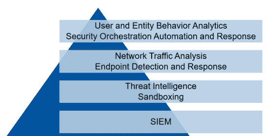
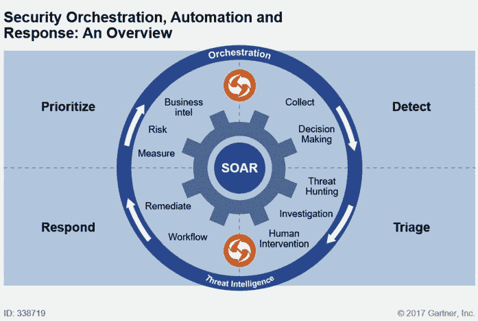

# 理解反应性、主动性和操作性安全

随着网络攻击次数的增加以及受害者报告的巨大损失，网络安全正变得越来越重要。然而，在许多组织中，网络安全的实施往往是因应威胁或攻击而采取的措施。组织可以根据财务能力和面临的威胁程度选择采取反应性、主动性和操作性网络防御，或是这三者的组合。本章将介绍这三种网络安全实施方式，帮助你选择最适合公司的一种。

在本章中，我们将涵盖以下主题：

+   主动网络防御

+   反应性网络安全

+   操作性安全

+   安全三大支柱的重要性

# 主动网络防御

主动网络防御侧重于预见攻击，并在攻击发起时主动保护目标（计算机、系统和网络）。其目的是通过攻击向量的威胁干扰攻击或攻击准备工作，从而使攻击向量的效果减弱，甚至轻松击退攻击。主动网络防御可以说是网络安全实施的最佳方式，尽管许多组织并未给予足够关注。这种方式预见到即将到来的攻击，并准备好一系列防御系统和策略来干扰这些攻击或使其无效。因此，公司资产很少面临风险，因为威胁没有接触到它们。尽管如此，许多组织仍然选择保持反应性或采用操作性网络安全，原因有很多，接下来我们将详细说明。

# 中小型企业

中小型企业（SMEs）在财务方面通常资源有限，因此不容易采纳主动安全防护，因为其维护成本较高。可以理解的是，它们不希望分配资源以至于影响到其他业务的运作。

中小型企业也倾向于为了业务运作而推迟某些网络安全措施的实施。由于主动网络安全防护涉及的内容较为复杂，且常常需要立即采取行动以防止可能的攻击，因此中小型企业可能会觉得它麻烦且不方便。它们希望网络安全策略能够适应自己的时间表，而不是反过来。

中小型企业也以寻求专业网络安全帮助较慢而著称。如果它们能找到评价较好的现成安全系统，通常会优先采用这些系统。然而，在不断变化的网络安全形势中，像 Facebook 这样的科技巨头也成为了受害者，仅仅部署安全系统而不理解威胁形势及其需要覆盖的范围已经不再安全。

最后，中小企业长期以来对网络攻击采取反应性措施，因此会回避主动安全策略。只有在他们成为攻击的受害者之后，他们才会加强自己的安全防范。

# 大型组织

大型公司通常认为自己太大，无法通过主动安全策略有效管理。由于主动安全覆盖整个组织，因此有许多领域是无法涵盖的。例如，在某些攻击发生之前，所有员工可能并未接受相应的培训。

此外，大型公司通常会关注自己的声誉。主动安全增加了额外的监视手段，可能最终揭示组织面临的威胁。此外，一些措施，例如要求所有员工参加某种培训的紧急通知，可能会以负面形式呈现，表明公司正受到攻击。

# 令人担忧的攻击趋势

赛门铁克（Symantec），一家领先的网络安全产品公司，发布了一份报告，介绍了对目标效果最为显著的先进网络攻击技术。具体如下：

+   **在被攻击的计算机上部署合法软件**：为了避免被杀毒程序发现并依然能够监控被攻击的计算机，网络攻击者会安装看似合法的软件。在攻击所造成的恶意软件被移除后，杀毒工具通常不会删除这些合法软件，从而让攻击者继续掌控该计算机。

+   **利用公司资源转移被盗资产**：为了在攻击后继续存在，网络犯罪分子会利用公司资源在不引起怀疑的情况下转移任何被盗的知识产权。因此，他们不会直接将信息资产上传到自己的服务器，而是通过伪造的通信将数据发送到他们控制的被入侵的电子邮件。

+   **在受害者的网络或服务器中构建更多攻击工具**：一些网络攻击者不使用预包装的攻击工具，而是在受害者的网络中自行组装攻击工具。对于那些具有防火墙的组织，这种方法特别有效，因为防火墙能够阻止恶意软件工具进入组织网络。

+   **使用公司账户进行定向钓鱼攻击员工**：另一个被发现的战术是，黑客使用被入侵的公司电子邮件来攻击其他员工。这比伪造的电子邮件攻击成功率更高。

这些战术只是众多无法轻易被反应性或运营性安全措施阻止的攻击方式中的一部分。这些攻击是专门设计来打破这两种传统安全策略的。主动安全能够识别这些以及许多其他杰出的攻击，并致力于使它们对组织无效或降低其效果。以下是主动安全重点关注的几个关键领域：

+   **资产管理**：在这种安全方法中，必须了解组织中的所有设备。因此，应有一份更新的设备登记册，列出所有连接到网络的设备，并提供足够的细节，以确定它们的用户或功能。

+   **软件清单**：为了防止恶意或不需要的程序被安装，主动安全措施包括对用户可以在其计算机和移动设备上运行的软件进行清单管理，以及对服务器中的软件进行清单管理。

+   **硬件和软件配置**：设备和软件的配置应经过验证，并根据需要更新，以确保不会使公司面临威胁。

+   **漏洞评估**：应了解组织面临的威胁。此外，还需要确定这些威胁的风险和影响。

+   **恶意软件安全**：应有能够提供病毒防护的工具，以保护组织免受恶意软件的侵害。

+   **员工培训**：由于攻击者通过网络钓鱼和社交工程攻击员工，主动防御包括培训员工识别常见的网络钓鱼或社交工程攻击，以及如何防御网络攻击。

# 实施主动安全

如你所见，尽管主动安全是一个有效的方法，但对于许多组织来说，它可能不是首选。然而，随着网络攻击动态的变化，主动安全或许将在未来几年成为首选方法。在本节中，我们将深入探讨实施主动安全的各个方面。以下是制定主动安全策略时需要考虑的一些因素。

# 漏洞评估

这包括扫描组织的网络、设备和系统，发现其漏洞。这些扫描最好同时在组织的外部和内部网络中进行，以便提供全面的报告。然后必须采取措施解决已识别的威胁，防止可能的利用。

# 渗透测试

这包括授权对公司内部和外部 IT 基础设施进行渗透测试，进一步识别黑客可能利用的漏洞来攻击公司。渗透测试采取实际攻击的形式，因此可以视为黑客尝试突破组织的方式，从而可以识别如何防止他们成功。渗透测试通常包括以下内容：

+   **网络侦察**：检测指定范围内的所有计算机，确定这些计算机的操作系统和服务。此外，还需要获取 DNS 记录，进一步识别网络上运行的系统。

+   **枚举**：下一步是确定每台计算机的操作系统和服务版本。服务也可以进行探测，以帮助确定其配置。

+   **利用**：识别网络上运行的服务中的任何缺陷和漏洞。随后，使用利用工具和技术攻击这些服务。例如，防火墙可能正在运行一个无法处理超过某个限制的流量的服务。因此，可能会使用一个僵尸网络通过超出其限制的流量淹没防火墙。

+   **验证**：在成功利用漏洞后，漏洞会被验证并优先考虑减轻措施。

# 社会工程学评估

这旨在确保员工准备好应对社会工程学攻击，不会屈服于网络犯罪分子使用的把戏和伎俩。

# Web 应用程序安全评估

这个评估侧重于应用程序中通常被黑客利用的漏洞。组织必须测试网络应用程序的威胁以及成功入侵后的影响。在发现威胁后，应修补应用程序或将其下线，以防止黑客将其作为攻击面。此外，还应确定成功入侵的影响，帮助组织进一步增强其安全层。例如，成功突破登录界面后的影响可以通过仅暴露不太重要的数据来减轻。敏感数据可以通过加密等技术移到一个更高安全级别的层级中。

总结来说，主动安全包括所有可以防止攻击首先发生的技术。这种方法由那些预见到潜在负面情况且无法冒险损害声誉的公司采用。

# 反应性网络安全

可能并不总是能够预见即将到来的攻击。此外，对于一些公司来说，如果组织很少遭到攻击，保持如此多的威胁监控工具运行可能会很昂贵。反应性安全是一种方法，它不是预见网络安全事件，而是在这些事件发生后对过去或当前的威胁做出反应。因此，只有当一个组织被黑客攻击并遭到入侵时，反应性安全才会启动。采用这种方法时，受害组织会评估威胁及网络攻击所带来的影响。通过这些信息，安全措施会被安装，以防止未来类似的攻击。

反应式安全策略对许多商业高管来说具有财务和商业意义，这也是为什么许多组织仍然困于此策略的原因。高管们通常专注于减少开支和最大化利润。此外，商业需求、威胁以及许多其他因素在不断变化。因此，部署基于未来可能发生的威胁假设的主动安全措施变得相当昂贵。现实是，威胁会变化，商业也会发生变化。例如，依赖本地托管网站进行销售的企业可能会选择采用云应用。云端的安全由服务提供商提供，因此公司几乎无需关注安全问题。如果他们有一个主动安全策略，可能会感到困惑，因为为了预测和保护网站所购买的昂贵工具或服务将不再需要。采用反应式安全策略时，企业不会感到困扰，因为该策略能够适应这些变化。

为了实现资源的最小浪费，许多组织考虑采用这一安全策略。由于它通常是在网络安全事件发生后再进行处理，因此更为传统。业务处于主导地位，决定安全基础设施的部署。由于 IT 领导者通常难以计算网络安全投资的回报，这一策略为管理层提供了更清晰的支出图景。所需金额是根据组织所面临的攻击来确定的。该策略对管理层来说也较为简单易懂。它具有因果关系。发生网络安全事件就需要投入 IT 安全资金。这比主动策略更容易为商业高管理解，因为主动策略是在看不见的、可能永远不会发生的攻击上进行投资。

# 实施反应式安全策略

由于该策略是基于发生攻击后才会启动响应，因此必须有一个高效的监控系统。此外，由于攻击的发生可能导致服务中断，因此该策略还必须具备高效的备份和灾难恢复功能。为了防止类似攻击的再次发生，组织需要了解造成之前攻击的原因。因此，这一策略必须包括取证调查。以下是这些组件如何在组织中实施的过程。

# 监控

与其采用主动防御来防止攻击发生，组织通常会使用高效的监控工具，时刻关注计算机、系统和网络上的可疑活动。当检测到可疑行为或攻击时，系统会发出警报，以便采取适当的响应措施。例如，组织可能会在其网络上安装入侵检测系统，监控侦察扫描、非法流量、恶意软件以及其他类型的威胁。当系统检测到威胁时，可能会通知 IT 部门或集成的安全工具来应对这些威胁。

# 响应

响应的类型取决于威胁和攻击的程度。如果攻击仍在进行中，响应将专注于停止攻击。例如，如果大量非法流量正指向某个服务器，IT 部门可能会选择将该服务器下线或重新配置其 IP 地址，从而避免攻击到达。如果攻击已经入侵系统，IT 团队可能会更改访问凭据并终止所有会话，从而将攻击者驱逐出系统。对于已发生的攻击，响应将采取不同的方式。IT 团队必须防止重复攻击或恶意软件在受害者系统中的蔓延。因此，如果某个服务器成为目标，可能会将其从网络中断开并进行物理隔离。如果系统遭遇了暴力破解攻击且登录系统被破坏，登录模块可能会被暂时移除，以防止进一步的攻击。采取的响应措施会影响攻击的后果。然而，组织仍然需要确保其客户不受不良影响，因此会采取以下措施。

# 灾难恢复

被动安全策略在很大程度上依赖于组织在攻击后恢复的能力。因此，灾难恢复计划是该策略的关键组成部分。灾难恢复的优先级可能会根据组织和攻击类型的不同而有所不同。灾难恢复中有五个主要的关注点：计算机、硬件、网络、软件和数据。它们在这里进行了详细说明：

+   计算机指的是网络中的工作站和服务器。在发生攻击后，需要对其进行检查，以确定是否受到影响。企业防病毒系统可以用于发起同时扫描，帮助完成这项工作。硬件指的是组织中任何计算硬件，例如网络路由器、桌面、消防墙和计算机外设。网络安全事件仍然包括这些硬件的物理盗窃或破坏。因此，如果发生了物理攻击，就需要确定所有硬件是否仍然完好，并更换任何已被破坏或盗窃的敏感硬件。例如，如果路由器被盗或毁坏，应安装替换设备。类似地，如果承载敏感系统的服务器被破坏或盗窃，也应进行替换。

+   网络包括网络中的所有连接方式。例如，如果无线网络被攻破，最好更改其 SSID 或密码，从而迫使黑客退出。如果与服务提供商的连接遭到破坏，应启用备用服务提供商。这将确保组织不会一直处于离线状态。

+   软件包括操作系统和通常在组织中运行的应用程序。一些攻击者可能拥有可以攻击特定版本软件的工具。因此，当发生攻击时，组织应考虑更新到最新的操作系统版本。这些版本将包含补丁，防止类似的攻击再次发生。此外，一些黑客可能会错误配置某些软件。例如，他们可能重新配置路由器来破坏通信。因此，在这种情况下，软件需要配置为正确的设置。在攻击软件感染恶意软件的情况下，IT 团队可以卸载它并提供替代方案，以确保组织的正常运行。

+   数据可以说是最重要的数字资产，因此应在灾难恢复中优先考虑。如果关键任务数据被修改或盗窃，IT 团队应恢复最新的备份，以回滚所做的更改或使需要数据的用户能够访问。由于数据的脆弱性，IT 团队还必须确保在恢复之前，相关系统不含恶意软件或后门，防止攻击者通过这些手段获取未经授权的数据访问权限。

# 法医调查

反应性安全策略旨在确保攻击不会重复发生。因此，必须充分了解其原因，并识别任何促成攻击成功的因素。例如，系统泄露可能仅仅是因为系统管理员使用了默认密码。法医调查将揭示该攻击是突破了登录控制并且是由于使用了默认凭证而发生的。组织将获得完整的情况，并实施更好的安全控制措施，以防止同样的攻击再次发生。例如，在这种情况下，组织可能会选择实施双因素认证，并制定禁止系统管理员使用默认密码的安全政策。在法医调查结束时，组织应当了解它必须采取的所有缓解措施来保障自身安全。

在某些情况下，法医调查与追索工作相结合。例如，如果钱款被盗，法医工作可能包括追踪资金流向，找出钱款的去向。实际上曾有一些真实案例中，网络犯罪分子盗取了资金，而法医调查员则成功追踪并追回了被盗的款项。Ubiquity Networks 就是其中一个例子，40,000,000 美元通过社会工程学手段被盗取，而法医调查员成功追踪并追回了 8,000,000 美元。除了资金，法医调查还可以恢复数据。大部分被盗的数据最终会出现在暗网市场上。法医调查员可以在暗网市场上搜寻某些类型数据的新列表。然后，他们可以伪装成买家，从黑客手中将数据取回，避免数据被卖给其他人。

总结来说，组织实施主动安全并不总是经济上可行的。大多数组织由于其简便性并且对企业高管有吸引力，采用的是反应性网络安全策略。反应性方法仅在发现重大威胁或发生攻击时采取行动。该方法旨在阻止攻击并防止公司资产遭受过度损失。该策略涵盖计算机、硬件、软件、网络和数据。其四个关键步骤为：监控、响应、灾难恢复和法医调查。这些步骤协同工作，确保组织能够在网络攻击中以最小的业务影响生还，并识别并缓解安全攻击的原因，以防止未来的攻击。

# 操作安全概述

操作安全通常被视为操作风险与网络安全的汇聚点。它是主动安全和被动安全之间的中间地带。这种网络安全方法解决了组织通常面临的业务和安全需求的冲突。商业高管希望从上至下管理网络安全，以便它与其他业务流程保持一致。然而，他们缺乏将网络安全与业务流程连接起来的技术知识。例如，他们可能了解防火墙和防病毒程序的基础知识，但他们无法了解这些工具如何与他们的业务流程和员工相连接。对于高管来说，这只是一个拥有网络安全工具的问题。

然而，现实情况要复杂得多。网络安全不仅仅是拥有两三种安全工具，而是保护数据的机密性、完整性和可用性。商业高管显然缺乏所有必要的安全工具或措施的知识，以保护信息的 CIA 三要素。他们只知道一些自己熟悉的工具，并认为网络安全的投入仅仅围绕这些工具展开。

网络安全是复杂且高度技术性的，因为它必须涉及整个组织。它包括组织内部的人员、流程、设备和服务；所有的商业操作都是网络安全的一部分。

运维安全方法将组织的流程与网络安全结合在一起。因此，这种方法可以防范可能威胁企业的操作风险。组织每天面临许多操作性网络安全风险。例如，传统的 IT 风险，包括未经授权的数据访问、拒绝服务攻击和社会工程学攻击。此外，法律风险来自于围绕 IT 操作的法规，如数据的收集、存储和共享。第三，来自供应商和供应商的第三方风险。这些只是组织面临的众多操作风险中的一部分，必须加以处理，以防止数据丢失、诉讼和声誉风险。操作安全策略通过巧妙的实施计划涵盖所有这些风险，接下来我们将讨论这一点。

# 实施操作安全

操作安全分为三道防线：风险管理、网络安全管理和审计：

+   **防御的第一道防线是风险管理。** 在这一环节中，处理影响企业运营的各种风险。在这一层次，关键关注点是风险分析和管理。必须识别企业各个领域的不同风险。对于这些风险，每个风险的关键风险指标都必须确立。然后，必须确定每个风险发生的概率。接下来是评估每个风险发生的严重性。利用这些信息，可以将运营风险按优先级排序或在矩阵中列出，以确定解决它们的优先顺序。

+   **防御的第二道防线是网络安全管理。** 这包括所有涉及保护组织免受第一道防线所识别的运营风险的过程。第二道防线从安全政策开始。这些政策有助于减少将风险引入企业的可能性。接下来是关键风险指标的定义。这些定义帮助 IT 团队在风险事件发生时进行警报。定义关键风险指标后，接下来是网络安全标准。这些标准概述了执行不同网络安全策略，以减轻或防止已定义的风险发生。第二道防线以网络安全管理工具结束，这些工具用于查看组织的网络安全状况。

+   **操作安全的最后一道防线是审计。** 审计有两种类型：内部审计和外部审计。这道防线确保所有其他防线已正确实施。它还帮助识别安全策略中的薄弱环节。

# 三大安全支柱的意义

各组织有不同的需求、风险暴露和资源获取能力。然而，网络安全是一个跨领域的问题，任何组织都可能成为目标或受害者。本章讨论了组织可以在其内部部署的三种安全策略。虽然这些策略可以独立运作，但当它们交织在一起时，效果最佳。它们本质上是互补的，可以为组织提供来自多个方面的保护。

主动安全策略确保极少有攻击能够成功侵入组织。它专注于预测并中和威胁，强化攻击面，以便攻击者很难渗透进组织的网络或系统。反应性安全策略与主动安全相对。反应性安全仅在威胁发生时做出响应。因此，相比于网络安全，更多的时间和资源会投入到核心业务目标中。反应性安全确保无论何时发生攻击，组织都能够恢复，并识别根本原因，封堵漏洞以防止未来的攻击。此外，反应性安全还包括可能对被盗资产进行追踪和恢复。运营安全策略与人员和流程协作。它识别在业务运营过程中可能遇到的风险，并制定安全解决方案以防止这些风险带来不利影响。此外，它还确保组织定期进行审计，以发现安全策略中的任何弱点。

当这三种安全策略结合在一起时，它们就像支柱一样，形成强大的防御力抵御攻击。它们还提供多层次的安全防护，其中主动安全防御能够防止大多数攻击的发生，运营安全保障业务运作不受攻击干扰，而反应性安全确保企业足够有韧性以应对攻击并建立未来防御措施。考虑安全策略时，企业的需求、对网络安全威胁的暴露程度以及可用资源是重要的因素。根据这三项因素，每种策略的适用性在不同组织中会有所不同。

# 安全操作与持续监控

安全监控是网络安全中的一个重要过程。安全监控为任何组织提供了从企业网络、应用程序、终端设备和用户活动中检测和分析事件的能力。通常，**安全操作与持续监控**（**SOC**）包括三个要素：**人员**、**流程**和**技术**。

**技术**帮助驱动资产的监控，如网络、应用程序、终端设备、服务器、Web 应用程序，并通过自动关联和分析生成警报：

来自微软 SOC 的照片

**人员**组成部分在 SOC 中侧重于手动验证这些警报并进行分类。

**流程**组成部分主要负责分析警报/日志，识别威胁并向修复团队提供详细信息，或将其标记为假阳性：

SOC 还必须将其目标与组织的业务目标和愿景对齐。SOC 需要建立其监控策略以满足业务需求。通常，SOC 是一个全天候、七天运营的系统，这是有意设计的，目的是让 SOC 分析员、适当的流程和检测技术能够通过处理来自内部公司资源的数据，并将其与来自各种外部来源的已知威胁信息进行关联，缩短从检测到攻击发生之间的时间差。通过丰富且可操作的威胁情报、先进的分析能力、数据背景化处理和正确的技能，SOC 还可以主动采取措施来阻止和遏制攻击。SOC 始终依赖于情报，例如恶意软件数据、妥协指标、攻击信息以及安全供应商和应用程序供应商提供的威胁与漏洞报告。现代 SOC 需要拥抱安全自动化和机器学习，以达到最高的成熟度。除了 SIEM 的核心技术、威胁情报馈送和各种数据馈送外，SOC 还可以利用入侵检测工具、杀毒集成、DLP 馈送、工作流和报告工具等技术。SOC 可以通过三种不同的方式实现：自有 SOC 或自管理 SOC、共同管理 SOC 以及由第三方完全管理的 SOC。

# **自有 SOC**（自管理 SOC）

**自有 SOC** 是由公司内部管理的安全监控，使用公司自身的专业人才或经过培训的资源。自有 SOC 在完全由组织控制的场所或设施中运行。在这种情况下，组织完全承担选择自己的 SIEM 工具、管理该工具和运行操作的责任，同时也负责培训分析员，确保其保持最新的技术和知识。

# **共同管理 SOC**

当你无法拥有一个自主管理的 SOC 时，第二个选择是拥有一个共同管理的 SOC。在共同管理 SOC 模型的场景中，你将与另一个服务提供商合作，分担工作量、技术或运营负担。在这种模型中，你可以通过将部分责任交给 SOC 服务供应商来优化运营，例如你可以选择监控白班，并让供应商管理夜班，或者你可以让供应商拥有 SIEM 并由你方资源管理运营，或者你可以拥有 SIEM 并将运营外包给供应商。在共同管理 SOC 的方式下，你有机会通过对供应商应用服务水平协议来实现更高的灵活性，并在比完全拥有 SOC 所需的时间更短的时间内启动 SOC；你几乎可以直接进入成熟的 SOC 运营模式。另一个对你有利的因素是，如果你失去了自己的资源，或者在供应商管理的分析师的情况下，你永远不必担心失去人才，因为他们会保持人才池。如果你选择一个拥有训练有素且经验丰富的分析师池的服务供应商，这将自动有利于你的安全运营。另一方面，如果你选择共同管理 SIEM，你可以共同分担许可、维护和运营的费用。这在一定程度上减轻了你的业务负担，但并非完全解除，因为你可能仍然需要负责事件响应和分析，与供应商之间共享资源，管理你方的治理，负责你方业务的风险管理，监控与供应商的 SLA，以及监控供应商的服务质量，以确保检测和运营质量不受影响。以下图表展示了共同管理 SOC 的层次结构：

# 完全管理的 SOC

完全托管的 SOC 已成为业内几年来的热门话题。该运营模式使您能够将整个 SOC 过程外包或转交给第三方供应商，您可以全面访问其经过培训的资源、SIEM 和检测技术以及成熟的流程。您的 SOC 能够迅速从零提升到一百。组织通常会将所有遥测数据、可视化数据和日志发送到供应商管理的 SOC 数据中心，在那里，**托管安全服务提供商**（**MSSP**）将分析这些数据，找出安全事件/事件。与其他两种模型相比，MSSP 的好处更大，因为作为组织，您几乎可以立即获得一个成熟的 SOC。可以预期从 MSSP 获得基于结果的结果，提供高度准确的检测和响应，采用先进的检测和响应技术。MSSP 拥有一支经验丰富且技术娴熟的团队，负责监控、分析和调查。完全托管的 SOC 还带来了可扩展性和危机管理的好处，您无需担心是否需要因任何原因监控更多设备或应用程序，或是否发生重大事件，可能需要额外的资源来帮助应对这种情况。MSSP 通常与提供高度丰富且可操作的威胁数据的机构和供应商建立了合作关系，这些数据与您的业务相关，对高级检测能力至关重要。拥有完全托管的 SOC 的另一个好处是行业级别的可见性和威胁数据共享；如果另一个客户出现类似类型的攻击，攻击信息和威胁情报几乎可以立即作为建议提供给您，并在检测基础设施中使用。总体而言，MSSP 供应商将拥有访问大型数据中心的权限，您可以利用这些数据中心进行存储和保留。唯一您可能仍需拥有的部分是您的 SOC 管理和在发生攻击时的威胁修复。目前，MSSP 模式是最受欢迎的 SOC 模式。

要了解 Microsoft 如何操作 SOC，请查看 [`www.microsoft.com/security/blog/2019/02/21/lessons-learned-from-the-microsoft-soc-part-1-organization/`](https://www.microsoft.com/security/blog/2019/02/21/lessons-learned-from-the-microsoft-soc-part-1-organization/)。要了解 Google 如何操作 SOC，请访问 [`medium.com/google-cloud/google-cloud-platform-security-operations-center-soc-data-lake-4b31e011f622`](https://medium.com/google-cloud/google-cloud-platform-security-operations-center-soc-data-lake-4b31e011f622)。要了解 FireEye 如何帮助构建 SOC，请访问 [`www.fireeye.com/services/mandiant-cyber-defense-center-development.html`](https://www.fireeye.com/services/mandiant-cyber-defense-center-development.html)。

# 主动与被动安全

网络攻击的范围和复杂性今天正在不断上升。最近的所有攻击都成功绕过了现有的安全解决方案，无论是传统的还是先进的。这些攻击之所以成功，是因为它们能够隐藏在我们网络和基础设施的合法领域中。我们当前的安全解决方案是基于扫描已知问题、过滤或丢弃坏信息，甚至尝试监控身份和用户习惯来检测的，但这些方法无法有效阻止攻击。主要原因是这些解决方案仍然侧重于响应安全事件，处理发生的安全问题，并规划如何从中恢复。换句话说：一种反应式的安全响应。反应式响应虽然有效，但并不能在足够的层面上应对如今的高级攻击。我们需要将重点转向一种主动的安全响应。行业已经从反应式安全响应转向主动安全响应。这是安全框架和方法论的范式转变，涉及我们如何预测、分析和应对威胁。与反应式安全响应不同，主动方法提供了对攻击基础设施更全面、更深入的可见性。简单来说，主动方法从攻击者的视角审视攻击面，尝试预测攻击并采取适当的措施加以防范。

按照逻辑，反应式安全响应模型的思维方式是，*“如果发生攻击，系统和安全分析人员会做出响应。”* 它是通过已知的攻击参数和方法设置一个陷阱，等待监控和检测系统对此做出反应。在反应式方式中，重点始终放在形成强大的外围防御，阻止那些试图突破网络的攻击。这种安全方式是局部的，面向特定的业务单元及其活动；它没有利用其他企业或行业垂直领域中类似性质的攻击。反应式安全无法提供威胁格局的 360 度视角，但反应式安全操作的方式总是更简单、反应更快，且运营成本较低。通过从杀毒检测系统、漏洞扫描器和数据泄露防护（DLP）系统获取的数据流，反应式安全的监控可以进一步增强。此模型的缺点是，它总是在漏洞或妥协发生后才对安全检测做出反应。

在这里，主动的安全监控和响应方式占据了主导地位。这是一种以情报驱动的模型，系统通过来自多个内部和外部源的可操作情报数据进行丰富，并与现有的实时监控系统相配合。这种主动的方法能够洞察整个威胁领域及网络攻击链的所有阶段，而不仅仅是集中在攻击链的一个或部分阶段。主动安全的一个关键方面是威胁狩猎，它通过寻找网络行为中的异常或任何异常模式、系统中的已知恶意文件，或者可以从已知攻击中找到的注册表项，帮助分析师获得更多关于网络和系统的洞察。作为分析师，你还可以在网络中查找已知的**妥协指标**（**IOCs**），以发现任何妥协的迹象。威胁狩猎是一个持续的过程，始终会根据从威胁情报来源获得的新信息进行调整。威胁狩猎还可以通过自动化方式进行，通过观察网络行为、系统异常、某些事件的时间线分析，以及网络和系统一段时间内的基准数据来进行。

# 威胁情报系统及其重要性  

每个组织都非常担心自己所持有的数据以及如何确保其安全。数据敏感性已达历史新高。在我们努力保护数据安全并积极检测任何威胁时，必须具备适当且有效的威胁情报。威胁情报可以通过获取关于各种系统、流程、网络、应用程序、外围防御机制及其他 IT 资产的特定威胁信息（情报）来实现。这些数据随后会被收集、分析和丰富，以提供积极的、可操作的威胁情报。威胁情报如此重要的原因之一是，因为当前一代的威胁极为复杂，且难以被检测到。我们必须获取非常具体的信息，并从任何威胁情报源中进行搜索，寻找可能的妥协迹象，并获得可操作的内容。为了走在先进威胁的前面，确保我们的分析和关联系统能够获取适当的威胁数据至关重要。  

任何有效且成熟的威胁情报系统必须能够实时收集和分类威胁信息，以便为 SIEM（安全信息和事件管理）和事件响应系统提供可操作的威胁情报，帮助它们分析并关联收集的威胁信息与它们正在监控的安全警报和事件。这些来自威胁情报系统的威胁警报还将帮助 SOC（安全运营中心）专业人员创建自定义签名以进一步检测。威胁情报系统收集与事件、日志、安全漏洞以及近期和历史攻击数据相关的各种信息。这包括来自组织的安全设备和网络设备的检测数据，以及来自外部威胁源的情报。你还可以设置蜜罐系统来收集攻击信息并将其作为威胁数据使用。数据收集需要专注且有意义，适用于打算使用这些数据的组织，因为每个业务都有不同的需求和基础设施类型。威胁情报的收集和馈送需要适应每个业务。无关的情报数据将导致错误的假设，因此漏掉攻击或泄露的风险更大。为了使威胁情报有效，情报数据的收集必须以集中方式进行，因为系统从多个位置和设备收集威胁和漏洞信息，以便关联数据。你必须从内部和外部来源收集数据，因为它们结合起来将提供关于你所在行业或组织的威胁和攻击向量的更详细信息。同时，也要关注收集有关任何正在进行的全球性攻击及其攻击向量、相关的缓解指令和检测参数的信息，这些信息可以来自政府 CERT、NIST、ENISA 等机构，以及行业来源，如 Cisco、Symantec、McAfee、Microsoft 和 RSA。你还可以关注开源威胁情报，如 OSINT、SANS 互联网风暴中心和开放威胁交换（Open Threat Exchange）。所有这些收集到的威胁信息需要根据威胁类型、对业务实体和职能的重要性进行适当分类和分隔。例如，可以根据业务单元的地理位置、使用的业务应用程序和 IT 基础设施来分类。地理位置对于确定威胁的来源至关重要，这样你可以优先关注那些可能受到影响的业务地点；这也有助于判断是否是针对你组织的定向攻击，或者可能是针对某个国家的攻击。这种情况可以帮助你定位受影响最严重的业务功能、应用程序或单元，并为提前或及时修复提供空间，以免为时已晚。它还将帮助你定义适当的缓解和检测策略，使你能够专注于有效利用资源，因为无论组织的规模如何，资源总是有限的。

一个成功且成熟的威胁情报系统必须能够生成并分发关于所有发现及相关调查的报告，帮助其他参与安全保护、调查和监控过程的人员，在各级操作、工程和战略决策过程中开展必要的工作。这些报告可以通过实时方法生成，或通过发布在线建议书的方式。安全威胁情报建议书还可能通过威胁交换机制，如 STIX 或 Traffic Light Protocol，与同行业的其他组织共享，让每个人都能利用这些信息，提前应对攻击。  

# 数字取证与实时事件响应与 SIEM 的结合  

正如我们在过去几年目睹的网络攻击激增，我们深信预防和监控只是应对网络安全攻击的初步步骤。我们应该做的是发展更多的能力，向威胁狩猎、内部威胁情报以及强有力的数字取证调查支持的事件响应能力迈进。

目前，行业中的大多数组织已经将 SIEM 作为其主要的中央监控平台。传统上，我们一直将 SIEM 用作接收来自网络其他部分的信息的平台，如本章前面所提到的，以便进行关联分析并识别威胁和安全事件。实质上，SIEM 一直像一个只听不说的设备。在今天的网络安全情境下，SIEM 应在整个过程中扮演更大的角色，发声并协同采取行动。SIEM 可以承担的一个突出任务是与数字取证平台集成，实时接收更丰富和更战术性的信息。数字证据极为易变，这加快了任何安全事件的响应时间。数字证据在网络安全事件中的脆弱和关键特性迫使我们以完全自动化的方式处理问题。响应事件时，传统的证据获取方法，如克隆磁盘，已不再有效，无法跟上攻击所需的时间；攻击在你意识到之前就已成功。  

这就要求我们以自动化的方式从可疑设备收集数字证据，并且应当在为时已晚之前完成。我们需要将这些遥测数据与 SIEM 集成，以触发对终端的证据收集，就像安防摄像头在运动传感器的帮助下开始录像一样。这为我们提供了关于发生事件的详细信息，并且收集的证据更加准确，且是在正确的时间收集的：事件发生的时间，而不是事后。捕捉到一个受损机器在黑客获得外壳访问权限后立刻的状态——提供初步分析并为深入调查做好准备——将帮助我们扭转局面，打败坏人。事实上，这仅仅是开始，我们还应该开发能够自动分析收集到的证据并用威胁情报进行丰富的系统/平台，使其变得更快、更准确。

# 开始了解安全自动化和编排

让我们从为什么需要**安全自动化与编排**（**SA&O**）开始。随着单点安全解决方案的迅速增长，大多数 IT 团队发现自己陷入困境，因为这导致了对安全环境的监控效果不佳，以及事件响应管理不力。应对那些未能协同工作的众多解决方案不仅浪费了时间和资源，而且还给组织的预算带来了沉重压力。在这种情况下，SA&O 扮演了救援角色，它通过使点对点解决方案协同工作，节省了组织宝贵的时间，从而为事件响应行动的集中编排铺平了道路。说实话，这一领域存在着巨大的技能短缺，因此这一部分成为了书中的重点内容。在我们继续了解需要学习的内容之前，了解这些术语的含义也是非常重要的。

安全编排是一种连接和整合不同安全系统和流程的方法。编排作为安全操作的连接层，帮助节省了在不同工具之间跳转以拼凑信息的时间，从而实现更快速、更高效和更准确的响应。

安全自动化是指在信息或网络安全系统中自动化处理任务。你可以在单一产品或系统中自动化多个任务，但为了在其他产品、工具或系统之间自动化许多任务或安全流程，就需要安全编排。

安全自动化自动处理最繁琐和耗时的任务，一旦你将工具进行编排，你可以利用精简的操作手册或工作流来自动化整个过程。这意味着，安全问题一旦出现，你的工作流就会立即启动，工具之间的数据相关性、深入调查、警报升级、响应支持等工作也会同步进行，正如下图所示：

自动化和编排可以使安全团队优先处理和管理效率，同时应对从检测工具和 SIEM 工具中传来的耗时的警报响应。学习如何使用自动化编排非常重要，特别是在调查和修复事件时。我们见过 CISO 到一级安全分析师都认为一切都可以自动化，这种想法虽然有道理，但他们也认为所有工作可以一次性完成！如果没有适当的文档支持，自动化和编排的好处将大打折扣。即使是最雄心勃勃的专家，自动化每一个事件以及你事件响应工作流中的每个步骤，也如同试图煮沸大海一样不现实。在你成为企业安全团队的一部分时，尤其如此，因为通常涉及多个跨职能团队，涉及多种不同的技术，最有效的方式是先走路再跑。

在过去的几年里，安全自动化和编排已成为网络安全行业的热门话题。所以在这一部分，我们将分享一些技巧，帮助你迈出利用自动化和编排的第一步。

自动化并不像听起来那么简单，你需要知道何时使用它，以及如何遵循工作流，才能取得成功。

一旦你确定了安全自动化和编排的安全用例，你就可以产生可衡量的影响。以下是三个帮助你识别安全自动化和编排的优秀用例的建议。

# 步骤 1——从小做起

拥有一个较小的任务或操作手册将有助于你学习 SA&O。拥有一个小型的操作手册/演示实验室，并设置有限的自动化任务，通常能提供一条很好的学习路径。一个例子是检查 IP 在多个声誉服务中的评分，并计算加权声誉分数。另一个例子可能是创建或更新一个票务系统。这里的关键概念是自动化更大工作流中的关键部分，从而提高工作效率，避免上下文切换，以及避免在多个界面之间复制粘贴。

为了帮助你入门，你可以问自己以下问题，你的答案将形成一张地图，基本上就是在告诉你*“从这里开始”*：

+   你的主要商业驱动因素和优先事项是什么？

+   现在驱动你战略的是什么？是风险管理的需求、整体增长、更强的投资回报率，还是遵守 GDPR 等监管问题？

+   哪些指标是重要的？例如，是否是调查的事件数量增加？响应时间和 MTTR 改善？成本管理？

# 第 2 步 – 学习分析（事件）

一旦你熟悉了 SA&O，你就可以进入下一步。检查工作流的操作计划将帮助你掌握更复杂的场景。

这是一个例子。由于钓鱼攻击仍然是许多网络攻击的首要入侵点，学习如何检查可疑的钓鱼邮件将非常有用。你可以通过自动化重复的操作，例如从威胁情报服务获取声誉数据并丰富事件，然后将工作人员插入工作流中，以便他们可以做出关闭或升级的决策，而不是一次又一次重复相同的步骤。

随着时间的推移，越是从小处着手，逐步推进到更复杂的自动化，你将学会完全自动化这个过程。这种方法的好处在于，它允许你将始终处于高需求状态的分析人员集中于更复杂的问题。

作为初学者，学习常见的事件总是很好的。尝试掌握前五个事件，熟悉相关厂商并进行分析。找出这些事件是否需要从威胁情报源、火墙、邮件服务器和网络设备的集中凭证存储中收集信息并采取措施。更复杂的用例将涉及更多的系统以及更多的团队，这将引导我们进入下一步。

# 第 3 步 – 学会明智地监控

你投入时间学习分析的越多，越能快速达到最后一步，在这一阶段，你需要找出如何将这些分析步骤自动化。接下来，定义一组可以用于衡量这些步骤的指标也非常重要，这些指标有助于在 SOC 内构建报告。一种常见的指标是**平均修复时间**（**MTTR**），它是桌面支持的服务级别指标，衡量从报告事件到事件解决所经历的平均时间。通过安全自动化和编排获得的效率提高，应该使该指标下降。

当然，持续改进将为你的技能集增值。如果自动化意味着在几分钟而非几小时或几天内调查事件，你可以快速计算这些成本，甚至评估分析人员将额外时间集中在其他可能需要自动化或无法自动化的更关键工作的好处。很快，你将能够在整个组织中应用你的新最佳实践和流程，获得最终的编排和自动化效益。

# 三种常见的安全编排、自动化和响应用例

精通用例将帮助你积累大量经验，因此这里有三个关键用例供你关注。

# 钓鱼邮件

钓鱼邮件已经成为近年来组织面临的最关键问题之一。一些最近的高调数据泄露事件就是由于精心设计的钓鱼邮件所导致的。安全编排、自动化和响应非常适合通过提取邮件中的文物，然后对这些文物进行额外增强，如果必要的话，隔离恶意邮件及其任何恶意负载，来自动化地处理和检查可疑的钓鱼邮件。

# 恶意网络流量

关于恶意流量的警报可以直接接收，或通过 SIEM 转发。无论哪种方式，如果你学会如何自动化和编排与这些类型事件相关的行动，你可以节省大量时间。

一旦日志被接收，分析员会使用数据增强工具，如威胁情报、声誉服务和 IT 资产清单，以及工具如`nslookup`和`whois`。分析员随后判断这些指标是否显得具有恶意，如果是，则开始隔离并进一步调查。如果使用自动化和编排，这个过程将自动完成。使用相同的自动化手段，搜索整个组织内相同指标的其他实例，然后警报分析员任何新增的发现也会变得更加容易。自动化或半自动化的隔离也是可能的；例如，通过防火墙或代理阻止 IP 地址或 URL，或在进一步调查之前将主机隔离，如下所示：

图 1：whois 搜索的示例结果

接下来，我们将探讨漏洞管理以及它如何增强监控工作。

# 漏洞管理

安全编排自动化并不打算作为漏洞管理平台，并且永远不会取代今天强大的漏洞管理系统，但有些方面可以帮助我们。它们可以用来确保安全团队了解任何新的漏洞。自动化可以用来查询漏洞数据库，获取有关漏洞的更多信息，查询 Active Directory 或 CMDB 以获取资产信息，或查询 SIEM 或 EDR 以获取事件信息。根据漏洞、主机或事件信息，案件可以自动升级或重新分配，或者主机甚至可以在执行适当的缓解任务之前暂时隔离。

# 总结

本章内容讲解了为什么你需要学习操作安全。我们涵盖了主动安全、被动安全和操作安全的含义，这些支柱的意义，以及什么是安全运营中心，为什么你需要理解它。

本章主要聚焦于网络安全的操作和技术层面，下一章将阐述人类因素的重要性，比如如果你想选择任何职业，如何在你的领域选择导师。我们将探讨人际网络的作用，因为安全从来不是单靠个人实现的，你将需要信息和人脉来获取重要的资讯、指导，甚至是找到工作。

# 进一步阅读

查阅以下资源，了解本章所涉及的更多内容：

+   [`www.symantec.com/connect/blogs/top-5-priorities-proactive-cybersecurity`](https://www.symantec.com/connect/blogs/top-5-priorities-proactive-cybersecurity)

+   [`www.fortynorthsecurity.com/`](https://www.fortynorthsecurity.com/)

+   [`www.stickman.com.au/reactive-cyber-security-approach-put-business/`](https://www.stickman.com.au/reactive-cyber-security-approach-put-business/)

+   [`www.netfortris.com/blog/proactive-vs.-reactive-whats-your-network-security-strategy`](https://www.netfortris.com/blog/proactive-vs.-reactive-whats-your-network-security-strategy)

+   [`www.openaccessgovernment.org/reactive-mentality-on-cybersecurity/60036/`](https://www.openaccessgovernment.org/reactive-mentality-on-cybersecurity/60036/)

+   [`www.ready.gov/business/implementation/IT`](https://www.ready.gov/business/implementation/IT)

+   [`www.disasterrecovery.org/`](https://www.disasterrecovery.org/)

+   [`www.accenture.com/t20170803T055319Z__w__/us-en/_acnmedia/PDF-7/Accenture-Cyber-Risk-Convergence-Of-Operational-Risk-And-Cyber-Security.pdf`](https://www.accenture.com/t20170803T055319Z__w__/us-en/_acnmedia/PDF-7/Accenture-Cyber-Risk-Convergence-Of-Operational-Risk-And-Cyber-Security.pdf)
