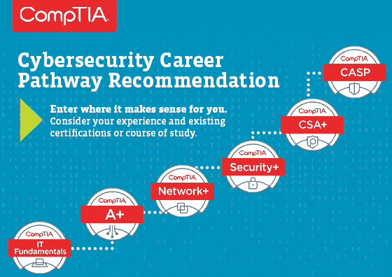
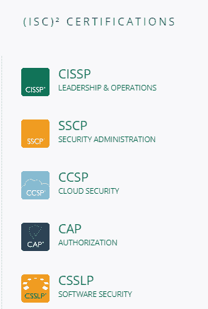
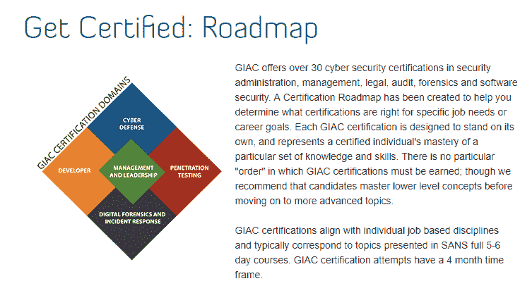
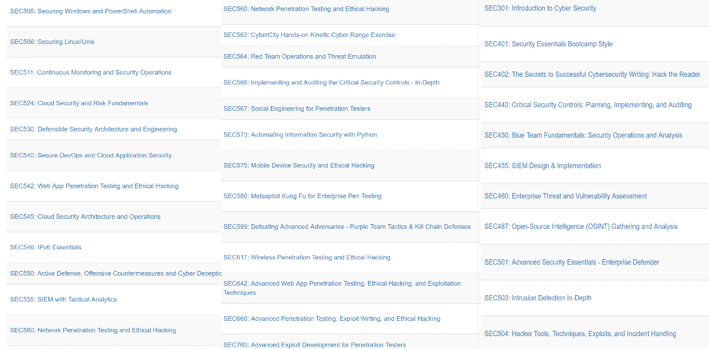
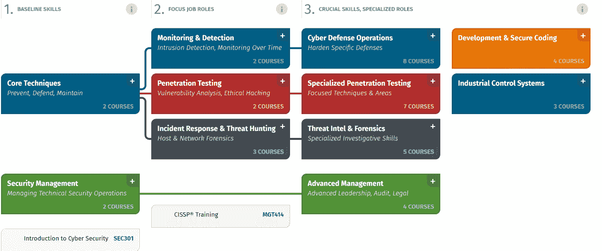
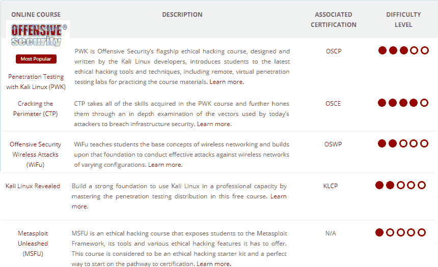
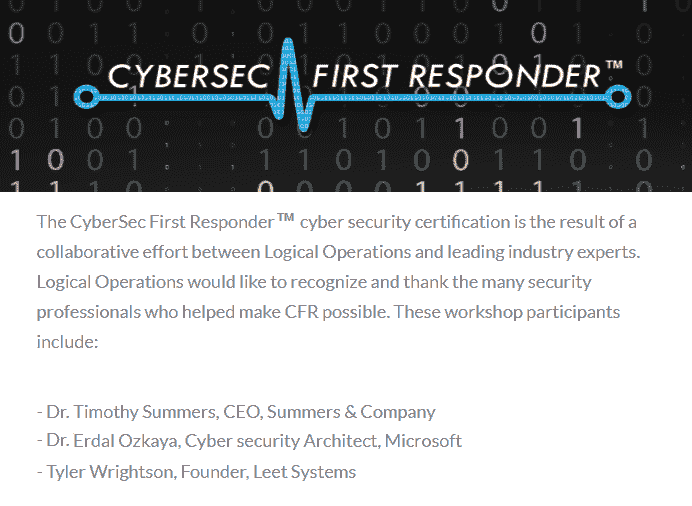
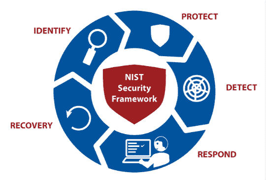

# 知识检查与认证

随着电子学习（eLearning）逐渐超过传统课堂教学，许多人不需要进入教室就能获得重要技能。一些组织选择提供免费培训课程，特别是在网络安全领域，以增加能够可靠应对网络犯罪的专业人士数量。此外，许多威胁专门针对组织中的用户。组织通过将员工注册到在线课程中，而不是传统的研讨会，来教授基本概念，从而应对这些网络犯罪。在线学习网络安全技能非常方便，尤其是对于那些有志于进入该领域的人。电子学习平台充满了令人惊叹的知识来源。虽然有一些人担心这些平台提供的培训质量不高，或者某些平台没有涵盖某些课程的所有要求，但也有一些受许可的学习平台可以提供培训，并且能够颁发认证证书，证明学习者通过了一个公认的平台，并且满足了所有评估要求，最终获得了证书。本章将探讨获取认证的必要性，以及如何选择适合的学习平台和认证课程。它将讨论以下内容：

+   获取认证的需求

+   选择认证和认证机构

+   认证，展示你的知识

# 获取认证的需求

在当前的市场环境中，无论你是受雇于公司还是作为自由职业者，认证都可能对你的职业生涯产生影响。以下是你应该努力获得认证的一些原因。

# 它们向雇主展示你具有主动性

在就业市场上，拥有大学学位已经成为常态。大多数学位课程并不会完全专注于某一领域。然而，参加网络安全认证课程可以让你在人群中脱颖而出。尽管完成学位课程依然有其价值，但拥有某一特定领域的认证将让你具备额外的优势。认证通常提供与特定职位高度相关的技能。例如，如果你参加了渗透测试课程，你将获得对所有安全分析师职位都非常相关的技能。因此，拥有认证是非常有价值的。这向雇主展示了你主动提升特定领域技能的能力，从而让你更具竞争力，适合你申请的职位。

# 他们反映了你在特定领域的能力

在就业市场上，人们对招聘那些在纸面上有高资格但实际技能较差的候选人感到担忧。学位往往具有误导性，因为学生可能通过了那些较为简单、与工作关系不大的课程，但在最重要的课程上失败。此外，学位课程中的评估往往不够全面。它们没有让学习者面临挑战性情境，也没有充分考察他们的能力。学位证书并不能反映候选人的强项或弱点。相反，认证课程往往更为严格，学习者必须通过多个评估来证明自己具备该课程所要求的技能。一些认证课程还会提供有关学习者在特定模块中表现的详细信息。它们向雇主保证所教授的技能已经过全面评估，你在所有领域都表现出色。因此，雇主在录用你时会有更少的顾虑。

# 它们为你提供了特定工作所需的知识

网络安全领域对变化反应非常迅速。新的威胁会带来新的技能需求，公司也会开始寻找具备这些技能的专家。学位课程往往改变缓慢，因此大学很难仅因为出现新的威胁而调整课程。幸运的是，认证课程相对灵活，许多供应商会根据市场需求评估技能要求，并相应调整他们的培训内容。尽早获得一些认证，你就能在需求量大的岗位上找到工作，并获得不错的薪水。学位课程并不旨在为学习者提供如此快速的培训，以利用市场上出现的技能空缺。

# 它们可以帮助你启动网络安全职业生涯

认证课程的优势在于它们不依赖于你的本科学位。虽然拥有相关的 IT 学位是有益的，但并不总是那么重要，也不是限制那些可以参加认证课程的人的条件。因此，如果你想完全转行，参加认证课程会更有利。它们可以节省你重返大学、花四年时间获得学位的成本和时间。

# 它们能增强客户的信心

这同样适用于那些在正式公司之外工作的专业人士，例如提供咨询或审计服务的独立承包人。客户可以理解地不愿意将敏感数据和系统交给这些人。成为你领域的认证专家能让客户对你的能力充满信心。他们相信你是专业的，因此可以信任你处理所有必要的数据和系统。

# 它们能帮助你进行市场推广

认证证明你在某一领域拥有比一般学位持有者更多的技能。在职场中，认证可以促使人力资源考虑你晋升到更高的职位，或者提高你的薪酬水平以匹配市场工资。对于那些在正式雇主之外工作的自由职业者或临时工来说，认证也会对你有利，因为它显示了你比其他自由职业者或临时工更有技能。你获得认证的知名机构名称也可能成为你的优势。如果雇主发现你在多个领域拥有认证，他们可能会忽视其他申请者。

# 选择认证和供应商

在决定参加某个认证课程并选择供应商之前，有一些因素是你需要考虑的，我们现在来看看这些因素。

# 供应商的声誉

在电子学习领域有一定时间历史的供应商，往往受到许多组织的认可。相反，初创公司通常会受到质疑。因此，选择那些知名或已经提供培训多年供应商的认证会更为明智。

# 课程的时长

认证是在成功完成课程后颁发的。大多数课程持续几个月，通常是三到四个月。然而，一些供应商将课程时长延长，学员的学习周期可能长达六个月，而其他供应商则将其限制在四个月内。评估课程时长非常重要，以确保你不会被那些收费较高、课程时长过长的课程所利用。

# 来自前学员的反馈

一些供应商拥有完善的反馈机制，学员可以在其中留下关于教师和课程整体质量的反馈。有些教师的水平确实不高，而有些课程的深度也不足。花时间查看学员在网站、Google 评论和社交媒体页面上的反馈，可能会为你节省一些以后可能遇到的烦恼。

# 学员支持

一些在线学习平台结构较差，学习者只是被提供材料，并在一定时间后进行自动化测试。因此，在选择课程时，了解学习者获得支持的程度非常重要。

# 认证的可信度

认证应该由有资质的教育机构提供。然而，一些网站提供自己的认证，这些认证在任何地方都不被认可。因此，在注册课程之前，检查提供课程的公司是否有相关资质是非常重要的。

# 就业市场的需求

就业市场决定了你应该具备的技能。理想情况下，学习者应选择能够通向需求较大的职业的课程。例如，网络攻击的增加使得市场对渗透测试人员的需求大增。获得渗透测试认证能让你在就业市场中占据先机。

# 有效的网络安全需要全员参与

问一个路人什么是网络安全，你可能会得到一个与最近的大数据泄露相关的回答。很难忽视主流新闻媒体不断告诉我们，*私人*信息中的“私人”只是个笑话，任何一个曾经在网上表单中输入过自己最喜欢颜色的人都无法免受黑市商人、不道德政府、网络激进分子和你能想象到的其他威胁的侵害。再深问一步，你的随机路人可能会告诉你他们为保持在线安全所做的一切——以及他们没有做的一切。至少，你可能会得出这样的结论：公众对网络安全问题的意识已大幅提升。意识，毫无疑问，是加强安全的重要一步，无论是在企业环境中，还是在个人环境中。但仅有意识是不够的。

作为数字化、联网社会的成员，我们不应该只是意识到自己的问题。相反，我们应该去解决它们。然而，我们往往没有这样做，而是选择接受不好的结果，而不是解决其根本原因。

当你考虑到安全问题常常看起来难以克服时，这完全可以理解。即使只是为了保护我们自己的个人信息，我们作为个体能做些什么呢？失败的点太多，许多因素超出了一个人的控制。

所以，与其单打独斗地使用基础工具并依赖他人的有限帮助，最合乎逻辑的选择是转移我们的注意力，拥抱一种新的标准：网络安全文化。换句话说，我们需要集体努力，分享有价值的安全知识、策略、最佳实践等，和其他数字公民共同努力。如果我们想要有效的网络安全，每个人都必须参与其中。

# 这对我有什么好处？

说懒惰是人类天性的一个关键因素有一定道理，但这个借口过于简单和武断。问题不是我们不愿意履行应有的谨慎，而是我们没有得到足够的动机。*“这对我有什么好处？”* 是网络安全的一个基本无声问题——这是我们必须关注的问题。

当我们指责普通用户没有定期更改他们在众多网站和系统上的多个密码时，我们似乎没有去理解他们为什么没有做到这一点。只有当为时已晚，当用户的身份被盗时，他们才会意识到这种安全行为的重要性。

那么，为什么他们没有更早地采取这种做法呢？很多时候，他们仅仅是被告知该做什么，而没有真正理解为什么需要这样做。也许他们在网上阅读过一篇简短的*《十大用户安全指南》*文章，或者同事在午餐休息时匆匆提到了一些个人安全提示。也许他们的雇主发了一封关于安全的邮件，但用户并没有认真对待。虽然这些行为提供了一个不错的开端，但它们并不充分。单纯的表面评论并不能培养足够或全面的网络安全文化。

那么，培养这种文化的关键就在于实质性内容。激发他人主动参与的最实质性方式之一就是让他们与这种情况产生共鸣。人们常常陷入思维陷阱，过于抽象地看待自己的计算机使用，就好像他们在线上的行为与实际的现实世界后果毫无关系。为了让他们理解自己数字行为的严重性，我们需要让他们摆脱这种过时的思维模式。

当普通的计算机用户离开家去上班时，他们会锁好前门。那么，当他们离开办公桌去吃午餐时呢？他们是否会将工作站留 unlocked 以便任何路过的人都能使用？就像物理门一样，我们随时都在打开网络门——而当这些门通向个人或敏感信息时，我们必须在背后锁上它们，以确保这些信息的安全。

网络世界中的并非所有事物都有现实世界的对应物，这给培养安全意识氛围带来了独特的挑战。回到密码的例子，普通的房主可能不会每个月去找锁匠更换前门的锁。

然而，如果你能够向用户传达这样一个观点：时间是任何黑客进行暴力破解密码尝试的关键因素，定期更改密码的重要性就变得更加明显。在这种情况下，*“对我有什么好处？”*的答案很简单：你始终领先于那些不断完善攻击方法的攻击者，你的关键信息也会保持安全。

# 持续监控的文化

有效的网络安全文化有许多维度，但其中最重要的一项就是持续监控。对于我们所有用户来说，能够监控自己的在线行为是否被滥用至关重要。不幸的是，很多人容易觉得自己的在线足迹过于广泛，而且其中许多是无法控制的。这就是为什么保持网站账户、密码和电子邮件地址清单会很有帮助。

像**KeePass**和**LastPass**这样的密码管理器使这一过程变得更加轻松，同时使用加密技术保持清单的机密性。你还可以将电子邮件作为所有其他账户活动的中心。许多网站和服务提供在关键账户配置更改时发送电子邮件提醒的选项。你越快获得这些变化的信息，就能越快确认——或者否认——其有效性并采取适当的行动。

这可能意味着能够立刻发现黑客已经更改了你的在线银行账户密码，而不是等到下次登录时才发现——那时账户已经被大额提款。

需要为强大的网络安全文化作出贡献的不仅仅是终端用户——企业也有很多跟进的工作。就像用户一样，持续监控至关重要。无论数据是在传输过程中还是处于静态状态，关注数据的安全是一种积极的安全方法，而这种方法在企业界通常严重不足。

我们听说的许多数据泄露事件直到数月甚至数年后才被发现。攻击者早已从服务器上窃取数据，以至于很难确切知道究竟盗取了什么。这是你绝对不希望你的企业处于的状况，因此拥有像**安全信息与事件管理**（**SIEM**）这样的解决方案至关重要，能够让你的网络安全人员及时了解任何可疑活动的发生。毕竟，是组织中的人传播并维护你的文化，而不是自动化的机器和软件。没有比通过培训和认证更好的方式来确保强大安全文化的增长与发展。参加大师级课程并获得认证，如 CertNexsus（Logical Operations）提供的*CyberSec First Responder: 威胁检测与响应*证书，将使你的团队准备好应对任何威胁。

不要再等一周或一个月才开始改变你周围的文化。今天就采取行动，无论是追求证书、升级安全软件和工具，还是仅仅改变那些长期未更改的密码。每个人在创造网络安全文化上投入的努力越多，我们共同的数字未来就会越光明。

大多数人对网络安全的常见认知围绕着数据泄露。然而，大多数人未能理解这些泄露为何会发生。虽然在影响了近 50,000,000 名用户的 Facebook 数据泄露事件中，所有网民都愤怒不已，但没有人愿意深入探讨这些攻击的根本原因。这一知识空白成为网络犯罪分子滋生的温床。因此，从整体上弥补这一空白，才能有效应对网络安全挑战。

在下一部分，我们将讨论网络安全专业人员需要的各种认证，以提高技能并保持领先地位。

# CompTIA Security+

这项由 CompTIA 提供的认证实际上是安全专业人员的一个良好起点。它为个人提供了一个机会，深入了解安全基础设施、身份管理、风险评估与缓解，同时也包含了相当数量的加密知识。对于从事系统管理员和 IT 基础设施服务的人员来说，这可能是一个不错的起步。它可能为你从现有角色过渡到更专注于安全的角色提供了重叠的技能。该认证的一个最佳特点是它是厂商中立的，这意味着它涵盖了通用安全概念的技能，而不专注于任何特定产品。许多人将其视为入门级认证，但如果你至少有几年 IT 经验，它也同样有用。CompTIA Security+认证也已通过美国国防部指令 8140/8570.01-M 的要求。有很多选择可以完成这个认证，但你也可以选择自学完成，然后参加考试。

# CompTIA PenTest+

这项来自 CompTIA 的认证提供了实践、基于表现的以及选择题的测试，确保每位考生具备在系统上执行任务所需的技能、知识和能力。PenTest+考试还包括用于计划、界定范围和管理弱点的管理技能，而不仅仅是利用这些弱点。你将获得渗透测试、漏洞评估和管理技能；该考试符合 ISO17024 标准，并获得 ANSI 认证。

# CompTIA 网络安全分析师（CySA+）

这是 CompTIA 提供的另一项认证，旨在帮助个人获得网络和设备行为分析的技能，以便他们能够预防和检测网络安全威胁。CySA+被认为是中级网络安全分析师认证。此认证专注于教授你入侵检测与响应技能，并覆盖一些高级持久性威胁的内容。你将能够获得关于如何对来自不同来源的威胁数据进行数据分析，并解读分析结果以识别你的业务和组织中的威胁、风险和漏洞的技能。在完成培训后，你还将掌握使用各种威胁检测工具的技能。此认证同样符合美国国防部指令 8570.01-M 的要求。

# CompTIA 高级安全专家（CASP+）

CASP+是希望继续深入技术领域而非单纯管理的技术专业人员的理想认证。CASP+验证了在风险管理、企业安全操作与架构、研究与协作以及企业安全整合等方面的高级能力。

欲了解更多详情，请访问：[`certification.comptia.org/certifications/comptia-advanced-security-practitioner`](https://certification.comptia.org/certifications/comptia-advanced-security-practitioner)。

这里是 CompTIA 网络安全职业路径：

# EC-Council，认证道德黑客（CEH）

这是过去十年间网络安全领域中少数非常受欢迎的认证之一。我从未看到任何想要进入网络安全领域的专业人士，或只是想理解攻击者视角的人，对此认证的热情有所下降。该认证由 EC-Council 提供，他们还提供一系列其他安全专业人员的认证。此认证专注于*“白帽黑客”*——这一概念定义了你如何使用与坏人相同的技术，主动发现并防止攻击。它教你如何像攻击者一样思考，了解实际攻击是如何执行的，以及使用了什么手段。此认证还让你了解黑客技术，包括足迹跟踪、侦察、扫描网络漏洞、枚举以及了解特洛伊木马、蠕虫和病毒的内部工作机制。它还教你如何使用嗅探器，如何进行 DoS 和 DDoS 攻击，以及在进行威胁评估时如何使用社会工程学。除了专注于基于网络的和社会工程学攻击外，CEH 还引入了 Web 黑客攻击的概念，如何攻击 Web 服务器以及在防止此类攻击时你可能会遇到什么问题，SQL 注入攻击，以及如何对企业应用程序执行这些攻击，主动查找漏洞。最后但同样重要的是，这还包括如何避开 IDS、防火墙和蜜罐。要最好地获得此认证，建议参加为期五天的培训课程，并强烈推荐采用课堂教学模式，以便你能够通过团队合作获得更多经验，并有机会使用培训师设置的实验室，获得第一手的实践经验。

# EC-Council，计算机黑客取证调查员（CHFI）

EC-Council 还为希望从事数字取证领域职业的个人提供了另一项认证：**计算机黑客取证调查员**，通常被称为**CHFI**。随着网络攻击的增加，数字取证调查员的需求处于高峰期，这项认证使你能够迅速成为帮助行业在数据泄露后场景中寻找证据的数字取证调查员之一。正如我们在前面章节中提到的，数字取证调查是识别证据并对其进行分析的过程，以创建报告，使得这些发现能够支持法律程序起诉犯罪分子，同时你也可以利用这些信息来防止未来的攻击。CHFI 认证将使你接触到计算机调查和分析技术的概念和流程，以确定相关的法律证据。这些证据可能是与广泛的计算机犯罪或其他形式的数字滥用有关的，包括商业机密盗窃、知识产权盗窃或破坏，以及欺诈行为。在 CHFI 认证和培训过程中，你将学习使用各种方法从涉及数字犯罪的计算机系统中发现数据，或者在某些情况下恢复已删除、加密或损坏的文件。

# EC-Council 网络安全职业路径

以下是 EC-Council 推荐的职业路径：

若想了解更多关于 EC-Council 认证的完整列表，请访问其官网：[`www.eccouncil.org/`](https://www.eccouncil.org/)。

# 注册信息系统安全专家（CISSP）

**注册信息系统安全专家**，简称**CISSP**，是由**国际信息系统安全认证联盟**（**(ISC)²**）授予的认证。这是专业人士必须拥有的认证之一，并且在安全领域中备受推崇。CISSP 涉及与信息安全相关的各种主题。作为这项认证过程的一部分，你需要学习八个安全领域：

+   安全与风险管理

+   资产安全

+   安全架构与工程

+   通信与网络安全

+   **身份与访问管理**（**IAM**）

+   安全评估与测试

+   安全操作

+   软件开发安全

与其他认证不同的是，CISSP 要求考生在其八个领域中的两个或更多领域具有至少五年的全职工作经验，而其他认证可能无需此类安全经验。但如果考生拥有四年制大学学位或硕士学位，他们可以获得一年经验的豁免。这是否意味着没有所需经验的考生无法获得此认证？并非如此，即便没有经验，他们也可以参加此认证考试，但通过 CISSP 考试后，他们将获得（ISC）²的助理认证，并且该认证有效期最长为六年。在这六年内，考生需要积累所需的经验，并将其提交给（ISC）²进行认证，最终获得 CISSP 认证。一旦（ISC）²接受了专业经验要求，认证将转为 CISSP 资格。你可以通过附近的培训机构、在线提供商或独立学习来备考，阅读市场上各种书籍。

# 认证云安全专业人员（CCSP）

如果你已经在从事云技术工作，并且希望从云安全的角度提升你的职业生涯，那么这项认证就是你应该开始的认证。它是由（ISC）²和**云安全联盟**（**CSA**）联合设计的，旨在通过提供所需的知识和技能，帮助云安全专业人士提升技能，涵盖云安全设计、实施、架构、运营、控制和合规性等话题。这个专业认证将帮助考生学习以下六个领域，重点关注云安全：

+   架构概念和设计要求

+   云数据安全

+   云平台和基础设施安全

+   云应用安全

+   运营

+   法律和合规性

你需要具备一定的基础经验：至少五年的信息技术工作经验，其中三年必须在信息安全领域，且至少一年在 CCSP 的六个领域之一。没有足够经验的考生，可以通过成功通过 CCSP 考试成为（ISC）²的助理。

（ISC）²的助理将在六年内积累五年的所需经验。或者，你也可以没有任何经验地参加认证考试，但通过 CCSP 考试后，你将获得（ISC）²的助理认证，该认证有效期最长为六年。五年后，获得经验，你可以申请 CCSP 认证：

# 信息系统审计师认证（CISA）

注册信息系统审计师（CISA）是由**信息系统审计与控制协会**（**ISACA**）提供的 IT 认证，这是一家知名机构。如果你想将 IT 审计作为职业发展方向，CISA 是你应该努力争取的认证。CISA 将教你审计、安全和信息系统控制领域的技能。这个认证在全球范围内被广泛接受，已经成为安全审计认证的事实标准。如果你已经从事信息系统审计工作，拥有安全领域的经验，或者担任 IT 顾问、隐私官或信息安全官，这个认证对你的经验和技能非常有价值。要获得该认证，必须具备至少五年的信息安全工作经验，其中至少三年是从事信息安全管理工作的经验。这个证书将帮助你了解五个领域，并获得全面深入的知识：

+   **领域 1**：信息系统审计过程

+   **领域 2**：IT 治理与管理

+   **领域 3**：信息系统获取、开发与实施

+   **领域 4**：信息系统运营、维护与服务管理

+   **领域 5**：信息资产保护

# 注册信息安全经理（CISM）

注册信息安全经理也是由 ISACA 提供的认证。这项认证主要面向负责管理和治理组织信息安全系统的 IT 专业人员。此认证将帮助你掌握管理安全风险、安全项目开发以及如何管理安全治理、事件管理和响应相关活动所需的技能。与 CISA 类似，CISM 也要求至少五年的安全工作经验，其中三年必须是在信息安全管理方面的经验。你还可以在考试通过后，在五年内提供相关证据。CISM 的重点是以下五个领域：

+   **领域 1**：信息安全治理

+   **领域 2**：信息风险管理

+   **领域 3**：信息安全项目开发

+   **领域 4**：信息安全项目管理

+   **领域 5**：事件管理与响应

# 哪个(ISC)²认证最适合你？

你随时可以访问(ISC)²官网获取最新信息：[`www.isc2.org/certifications/ultimate-guides`](https://www.isc2.org/certifications/ultimate-guides)

# 全球信息保障认证（GIAC）认证

GIAC 是全球最大的认证机构之一，提供许多备受推崇且深具技术性的网络安全认证。GIAC 主要由 SANS 研究所成立，旨在为全球专业人士提供高质量的安全培训。GIAC 下有许多旗舰认证，以下列举了一些（你可以在 [www.giac.org/certifications/categories](http://www.giac.org/certifications/categories) 查找其余认证）：

# GIAC 信息安全基础（GISF）

GISF 将为你提供机会，学习并展示关键的信息安全概念，理解信息和信息资产面临的威胁与风险。此认证还将帮助你学习如何识别可用于保护信息和信息资产的最佳实践。该认证可视为 GIAC 的入门级认证。你需要学习以下主题：

+   AAA 与访问控制

+   应用安全

+   计算机数学

+   密码学算法与攻击

+   密码学基础

+   密码学历史

+   网络寻址与协议

+   网络攻击

+   网络通信基础

+   网络安全技术

+   风险管理原则与安全政策

+   系统安全

# GIAC 安全基础认证（GSEC）

GSEC 是一项入门级认证，它将使你能够在网络安全的基本概念和术语之外，发展更多技能。你需要学习以下主题以获得 GSEC 认证：

+   访问控制与密码管理

+   主动防御

+   应急计划

+   关键控制

+   密码学

+   密码学算法与部署

+   密码学应用

+   深度防御

+   可防御的网络架构

+   端点安全

+   强制执行 Windows 安全政策

+   事件处理与响应

+   IT 风险管理

+   **Linux 安全**：结构、权限与访问

+   **Linux 服务**：加固与安全

+   **Linux**：监控与攻击检测

+   **Linux**：安全工具

+   日志管理与 SIEM

+   恶意代码与漏洞缓解

+   网络设备安全

+   网络安全设备

+   网络与协议

+   保护 Windows 网络服务

+   安全政策

+   威胁狩猎

+   虚拟化与云安全

+   漏洞扫描与渗透测试

+   网络通信安全

+   Windows 访问控制

+   Windows 作为服务

+   Windows 自动化、审计和取证

+   Windows 安全基础设施

+   无线网络安全

# GIAC 认证的周界保护分析师（GPPA）

GPPA 为你提供了一个机会，学习保护现代边界所需的技能，现代边界不仅仅是公司防火墙和外围设备，因为现在有云资产，移动设备的使用也带来了挑战。这个认证解决了这些挑战，同时仍然让你学习传统的保护方法，你将获得设计、配置和监控路由器、防火墙以及其他外围防御系统的能力。该认证将覆盖以下主题：

+   高级边界保护

+   云安全

+   创建与审计规则库

+   主机级检测和数据丢失防护（DLP）

+   IPv6 和 ICMPv6

+   日志收集与分析

+   **基于网络的入侵检测与防御** (**NIPS**/**NIDS**)

+   数据包分片

+   边界概念和 IP 基础

+   路由器安全和网络访问控制

+   主机和服务的安全

+   静态和有状态数据包过滤

+   TCP/IP 协议

+   VPN 基础及实现

+   漏洞评估和审计

+   无线设计与安全

# GIAC 认证入侵分析师（GCIA）

GCIA 是最受推崇和认可的安全专业人员认证之一，适合那些希望继续在安全事件处理领域发展的人员。对于有经验的网络安全专家，这项认证同样非常有价值。尝试 GCIA 认证将要求你了解安全事件及如何在网络攻击发生时或发生后处理这些事件。为了参加认证考试，你需要掌握以下主题：

+   高级分析和网络取证

+   高级 IDS 概念

+   应用协议

+   TCP/IP 和链路层概念

+   DNS、IP 头和分片、IPv6、TCP、UDP 和 ICMP 的概念

+   IDS 基础和网络架构

+   IDS 规则

+   网络流量分析

+   数据包工程

+   SiLK 及其他流量分析工具

+   Wireshark 基础

# SANS 认证

SANS 是全球最大的资讯安全培训来源之一。它通过多种方式提供培训：现场和虚拟课堂、在线自学、带直播讲解的网络课程、与本地导师的指导学习，或是通过 Simulcast 让你最远的同事也能参与的私人企业培训。

由于 SANS 有许多培训选项，我建议你访问他们的网站，找到适合你需求的课程：[`www.sans.org/courses/`](https://www.sans.org/courses/)：

为了让你的工作更轻松，SANS 创建了一份路线图，你可以在[`www.sans.org/cyber-security-skills-roadmap`](https://www.sans.org/cyber-security-skills-roadmap)找到它：

# 思科认证

思科提供业界顶尖的认证，它也是启动你安全职业生涯的绝佳途径，尤其是如果你希望专注于网络安全领域的话。思科认证主要分为四个大类，第一个是入门级认证，即**CCENT**，第二个是助理级认证，包括**CCNA**和**CCDA**系列认证，第三个是专业级认证，涵盖**CCNP**和**CCDP**系列，最后是专家级认证，涵盖**CCIE**和**CCDE**系列。对于那些希望深入了解网络设计、架构和安全的更专业的从业者，思科认证还提供了**CCAr**（认证架构师）级别的认证。思科认证的最大优势在于，他们将每个级别分成了九个不同的类别，这使得你能够轻松选择适合你职业生涯和具体技术领域的路径：路由与交换、设计、工业网络、网络安全、服务提供商、服务提供商操作、存储网络、语音、数据中心和无线。这样的划分也很有道理，因为网络这一学科非常庞大，你无法在一项认证中学习所有内容。当然，如果你有足够的时间和资源（我知道现实中很少有人拥有一系列这些认证），你也可以选择在所有九个类别中都获得认证，只是你必须逐一通过它们，并在其中积累专业知识。我们来看看这些认证中的一些（其他的可以在[www.cisco.com/c/en/us/training-events/training-certifications/certifications.html](https://www.cisco.com/c/en/us/training-events/training-certifications/certifications.html)上找到）。

# 思科认证入门网络技术员（CCENT）

这是一个入门级的基础认证。通过这个认证，你将学习网络的基本概念，如何执行网络支持等工作，以及如何实施、操作和故障排除一个小型企业或分支网络。你还将学习网络安全的基础知识。这个认证无疑为你打开了网络领域的职业大门，如果你正在寻找相关职业的话。这也是其他思科认证的基础，例如 CCNA。因为这是一个非常基础的认证类型，我认为任何在 IT 领域的人都可以尝试：

+   **服务质量**（**QoS**）的基本理解。

+   一个关于虚拟化和云服务的模块。

+   接触与 WAN、接入层和核心层相关的网络可编程性。

+   学习网络层 1-3 的基础元素。理解这些层次对核心路由和交换非常重要。

+   了解防火墙、无线控制器和接入点的基本原理。

+   学习 IPv6 和基础网络安全。

+   可以访问实验室，在实验课程期间提供使用案例的配置命令。

# CCNA 路由与交换

CCNA 路由与交换是 IT 网络世界中另一个备受推崇的认证，几乎所有网络工程师在其网络职业生涯的起步阶段都拥有此认证。如果您计划成为其中之一，您可以期望学习如何实施、操作和配置企业网络，了解 IPv4 和 IPv6 网络以及 LAN 交换机和 IP 路由器的工作原理和配置方法。您还将了解有关广域网和网络安全威胁的知识。最后但同样重要的是，它还教授您如何排除网络故障以及与路由和交换相关的网络设备。除了您可能已经作为 CCENT 的一部分涵盖的主题外，您还将学习一些额外的技能：

+   您将能够管理具有多个交换机、VLAN、干线和生成树的中型局域网

+   掌握故障排除 IP 连接

+   与配置和故障排除**增强内部网关路由协议**（**EIGRP**）、**开放最短路径优先**（**OSPF**）在 IPv4 和 IPv6 环境中相关的技能

+   您将能够通过定义其特性、功能和组件来构建广域网

# Offensive Security 认证专业人士（OSCP）/ Offensive Security's Penetration Testing with Kali Linux（PwK）

这是您可以参加的最佳网络安全培训课程之一。 Offensive Security 的培训课程侧重于攻击性安全，特别是渗透测试领域。由于信息安全领域的专业化非常多，最适合您的课程取决于您的兴趣所在。

Offensive Security 的**Kali Linux 渗透测试**（**PwK**）课程侧重于全球渗透测试人员使用的现代技术，因此对您来说是一个很好的起点。

**突破周界**（**CTP**）专注于利用开发、Web 应用程序和广域网攻击，这对于渗透测试人员也非常有用；然而，PwK 教授您成为优秀渗透测试人员所需的核心技能。 CTP 还要求具有不同进攻技术的高级知识，因此不建议初学者。如果您认为自己具备所需知识，请随时尝试以下 CTP 课程注册挑战：[`www.fc4.me/`](http://www.fc4.me/)。

除了 PwK 和 CTP 外，他们还有一门专门针对无线渗透测试的课程，名为 Offensive Security Wireless Attacks（WiFu）。

在注册课程之前，我们建议您浏览每个课程大纲，选择符合您兴趣的课程。每门课程都提供在线的大纲，您可以查看涵盖的主题：[`www.offensive-security.com/information-security-certifications/oscp-offensive-security-certified-professional/`](https://www.offensive-security.com/information-security-certifications/oscp-offensive-security-certified-professional/)。以下截图展示了部分可用课程：

# Offensive Security 的 Kali Linux 渗透测试（PwK）

OSCP 是信息安全专业人员最受认可和尊敬的认证之一。要获得认证，您必须完成 Offensive Security 的 PwK 课程，并通过 24 小时的实操考试。为了获得实操经验，每位学员都会获得访问虚拟渗透测试实验室的权限，在实验室中可以练习课程中学到的技巧。OSCP 考试包括一个包含不同配置和操作系统的虚拟网络。考试开始时，学员将收到关于隔离考试网络的考试和连接指示，而他们对该网络没有任何先前的了解或接触。

# CertNexus 网络安全应急响应员（CFR）

通过一种理解攻击结构的方式，**网络安全应急响应员**（**CFR**）网络安全认证确保个人掌握在攻击发生前、过程中和之后，能够为组织提供所需的高风险技能。

网络安全应急响应员是抵御网络攻击的第一道防线，网络攻击可能会给组织带来宝贵的时间和金钱损失。网络安全应急响应员培训和认证项目将帮助安全专业人员成为应对网络攻击的第一响应者，教学内容包括分析威胁、设计安全的计算和网络环境、主动防御网络以及应对/调查网络安全事件：

要了解更多关于认证的信息，请访问[`certnexus.com/cybersec-first-responder-cfr-continuing-education-program/`](https://certnexus.com/cybersec-first-responder-cfr-continuing-education-program/)。

还有一个名为 CyberSafe 的终端用户培训课程。但这个课程更多面向终端用户。

# NIST 网络安全框架

美国商务部的**国家标准与技术研究院**（**NIST**）响应总统行政命令《改善关键基础设施网络安全》，创建了 NIST 网络安全框架。该框架是在与行业合作的基础上制定的，为组织提供更好管理和降低网络安全风险的指导。NIST 网络安全框架核心部分提出了行业认为对管理网络安全风险有帮助的关键网络安全成果。核心部分包含四个元素：功能、类别、子类别和信息参考。下图展示了 NIST 网络安全框架的五个阶段：

NIST 网络安全框架

# 识别

识别功能中的活动是有效利用框架的基础。了解业务背景、支持关键功能的资源以及相关的网络安全风险，使组织能够集中精力并优先考虑其工作，与其风险管理策略和业务需求保持一致。

结果类别如下：

+   资产管理

+   业务环境

+   治理

+   风险评估

+   风险管理策略

以下是一些相关的网络安全课程：

+   EC-Council 认证道德黑客

+   CompTIA 网络安全分析师

+   注册信息系统审计师

+   注册信息安全经理

+   注册信息系统安全专业人员

# 保护

保护功能支持限制或减少潜在网络安全事件的影响。

结果类别如下：

+   访问控制

+   意识与培训

+   数据安全

+   信息保护过程和程序

+   维护

+   保护技术

以下是一些相关的网络安全课程：

+   CompTIA 安全+

+   CompTIA 高级安全从业者

+   CompTIA 网络安全分析师

+   思科安全

+   EC-Council 认证安全分析师

# 检测

检测功能支持及时发现网络安全事件。

结果类别如下：

+   异常与事件

+   安全持续监控

+   检测过程

以下是一些相关的网络安全课程：

+   CompTIA 网络安全分析师

+   思科安全课程

# 响应

响应功能支持应对潜在网络安全事件的能力，以减少其影响。

结果类别如下：

+   恢复规划

+   改进

+   通讯

以下是一些相关的网络安全课程：

+   EC-Council 计算机黑客取证调查员

+   网络安全首次响应者：威胁检测与响应

+   思科安全

# 恢复

恢复功能支持及时恢复正常操作，以减少网络安全事件的影响。

结果类别如下：

+   恢复规划

+   改进

+   通讯

以下是一些相关的网络安全课程：

+   注册信息安全经理

+   注册信息系统安全专业人员

+   CompTIA 高级安全从业者

# 总结

本章重点讨论了知识检查，特别是与认证相关的内容。现在有许多开放的电子学习平台，所有平台都提供具有竞争力的课程，并在每个课程成功完成后颁发认证。

认证将为学习者提供在就业市场上的一些优势，而仅拥有学位的申请者则无法获得这些优势。认证向雇主展示你具备主动性，证明你在某个特定领域具有高超的技能，帮助你掌握市场需求技能，推销你的技能，并为那些没有 IT 学位的人开启网络安全职业生涯。选择认证和认证提供商时，必须谨慎。在选择课程之前，你应该评估提供商的声誉、认证的可信度、课程的时长、以前学习者的反馈、学习者所获得的支持程度以及市场需求。

在下一章中，我们将探讨可以公开和商业化消费的各种安全情报资源，以增强组织的安全性。

# 进一步阅读

查看以下资源，了解本章所涉及的更多信息：

+   [`www.trushieldinc.com/top-3-reasons-you-need-cyber-security-awareness-training/`](https://www.trushieldinc.com/top-3-reasons-you-need-cyber-security-awareness-training/)

+   [`altimetersolutions.com/importance-of-cybersecurity-certifications/`](https://altimetersolutions.com/importance-of-cybersecurity-certifications/)

+   [`hirevergence.com/importance-of-cybersecurity-certifications/`](https://hirevergence.com/importance-of-cybersecurity-certifications/)

+   [`www.whitedust.net/the-importance-of-cybersecurity-certification-training/`](https://www.whitedust.net/the-importance-of-cybersecurity-certification-training/)
