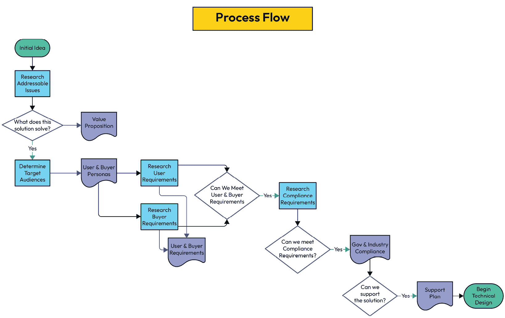

# 2

# 安全从设计桌开始

安全不仅仅是一个过程。安全不能是事后考虑的事情。安全是一种心态。当你考虑将新产品或升级产品推向市场时，安全从设计桌开始。你在这里做出的选择将定义一些你可能以前没有考虑过的结果。

在上一章中，我们简要回顾了嵌入式 Linux 系统（即设备）是什么，以及它们如何解决现实世界的问题。接下来的几章将重点讲解设计和构建阶段。每一章都会在上一章的基础上进行扩展，正如你很快会发现的那样，所有这些都是需要注意的考虑因素。

在设计阶段，产品团队在减轻未来风险方面有着最高的成功机会。通过适当的范围定义、规划和执行，你的团队可以在创造高度高效的设备解决方案方面取得巨大成功。如果在这一阶段考虑到我们即将回顾的各个因素，它们将成为成功的因素，而非风险因素。

安全审计员、系统架构师和产品经理，凭借他们预期的职位描述，都是风险缓解者。这就是我们现在在这里做的原因。感谢你与我一起踏上这段旅程。

*三思而后行* 是许多人都很熟悉的一句格言。在设计阶段，我认为这还远远不够。我说的是 *三思而后行，换一把尺子，把新尺子与旧尺子对比，再用新尺子量两次，然后仔细考虑切割*。如果仍然有疑虑，应该拿第三把尺子（重新开始！）。我还建议在初次切割前进行同行评审。同行评审是我无法过度推荐的。第二双眼睛（或者更多的眼睛）通常能发现并指出你可能忽略的东西。

说实话，我有点夸张了。这样做是有很多合理的原因的。没有考虑到解决方案的关键方面可能会导致产品薄弱或不足。在最糟糕的情况下，你可能会陷入一堆冒烟的垃圾中，并且将你的职业生涯置于危险之中。在本章中，我们将深入探讨许多在产品设计阶段常被忽视的因素。这些风险并不全是纯粹的技术问题。然而，每一个单独的风险都可能引发问题。有些是社会性的，有些是政治性的，大多数与必须验证的设计因素相关。

本章将涵盖的流程可以通过以下图表来说明：

图 2.1 – 本章流程图

在本章中，我们将涵盖以下主题：

+   解决方案面向的商业需求是什么？

+   我的目标买家和目标用户是谁？

+   是否有任何特定的政府合规标准会影响决策树？

+   我们将如何支持这个设备解决方案？

+   其他影响产品的需求和关注点

我们开始吧。

# 解决方案满足的商业需求是什么？

你有了一个新产品的创意，这太棒了。在你花时间向管理层推销这个提案之前，必须花一些时间，袖子挽起来，设定一些明确的产品设计目标。

让我们一起走一遍这个过程。你需要问自己一些问题，并且能够详细回答这些问题。单纯为了市场上有个亮眼的技术解决方案就投放产品的时代早已过去。你的潜在客户有紧张的预算和巨大的时间压力。为客户创造价值必须是任何提议的解决方案中最重要的特性。

首先，你的解决方案到底会为未来的终端用户提供哪些服务？这个答案必须清晰且精确地回答这个问题：*你的设备解决方案到底是为了应对什么商业需求或问题，以便为终端客户增加价值？* 要回答这个问题，必须清楚几个关键点。问题到底是什么？有没有什么替代方案（如果有的话）？

那么，*添加价值*到底是什么意思？你的解决方案必须在多个方面打勾。接下来，问问自己，*这个解决方案的实施有多复杂？普通客户是否有能力自己设计/实现一个自家的解决方案？* 答案必须是：*我的解决方案为人们的生活增值，或提供了其他方式难以获得的宝贵服务。*

如果你的解决方案可以轻松被其他人设计、构建或实施，那么将来卖出你的创意的机会可能会非常渺茫。能够解决复杂且棘手问题的解决方案，才是那些能为客户带来直接价值的解决方案。

*研究，研究，研究！* 我对所有正在评估或考虑创建新产品的人这么说。*为什么？* 可能会有人问。我的回答既关键又简单。如果别人已经解决了这个问题，并且围绕它创建了产品，那么你就处于一个不利的位置。现有的竞争者显然占有优势，并且很可能控制了市场。

市场上如果已经有多个解决方案，这该怎么办？在这种情况下，我开玩笑地建议你质疑一下自己的理智。你的公司将面临一场艰苦的战斗，需要为每一个可能的客户而努力。在这里，我希望你的解决方案能够压倒竞争对手，且这段旅程能够帮助你达成目标。

现在你已经明确了你的产品旨在解决的具体使用案例，接下来我们可以进入下一步设计标准，那就是确定你的目标**用户画像**。

# 我的目标买家和目标用户是谁？

*我为什么要关心这些人物角色？* 或者 *我以为这本书是关于安全的！* 你可能会默默地想。太好了！我让你开始思考了。这本书确实是关于安全和降低风险的。这对你未来的产品和公司成功至关重要，我们将分两部分来讨论。答案的复杂度可以与未来你的公司销售团队、产品经理和售前工程师将要接触的人物角色的复杂性相匹配。

收集目标买家和用户需求的详细知识，需要应用相当多的心理学。这些洞察力将极大帮助你确定必须规划哪些功能，以实现技术上的胜利，最终促成你的嵌入式 Linux 系统设备的销售。两者的驱动力和动机完全不同，直接影响他们对解决方案的需求。预先直接或间接接触这些目标行业中的人物角色，以便收集情报，将是你团队的战略活动。焦点小组和调查也可以成为收集需求信息的宝贵工具。利用你手头的每一个工具和方法。商业就像战争，所以不要玩得太“公平”。要充分利用每个优势。

在我们继续讨论各种人物角色的重要性之前，请允许我再给你一个警告。未能满足目标受众的需求和期望，最终会导致解决方案的采纳率低下。如果我不提及客户组织内部的政治因素，这将是我的失职。这些因素可能是一个隐藏的变量。在与这些人物角色沟通之前，尽可能多地收集信息。准备工作非常重要，提前准备好他们可能会问的问题及答案至关重要。虽然客户的政治动机与安全性没有直接关系，但它们很容易转向安全功能的讨论，或者变成一个批评会议，把你的竞争对手与您一起推向聚光灯下（当然是比喻意义上的）。

## 目标买家

目标买家可能是最难以把握的人物角色。他们可能并不是直接参与产品部署、测试或使用的人。这些客户人物角色可能是部门负责人、高管、财务部门人员或采购专家。那么，让我们深入探讨这些例子中驱动因素的不同。

重要提示

目标买家可能是这些例子的组合（也就是说，既是高管又是部门负责人，或者是财务部门人员和采购专家）。

这也是一个公平的说法，根据你的解决方案的规模和成本，可能涉及决策过程的不同人物角色及其数量。

### 高管

通常，他们拥有最终的决策权和发言权。他们的驱动力更多是聚焦于在市场上取得竞争优势、创造利润以及保持足够的合规性，避免损害公司品牌或陷入法律问题。

让一位高管支持你的项目，可能意味着成功、较低的采用率，或者更糟糕的是，完全失败的部署。他们在各自组织中的重要性通常能为你的团队扫清障碍，但请记住——如果你没有在解决方案中考虑到他们的需求，他们推动的那些障碍，可能正是阻碍你项目的障碍。

### 一个部门主管

部门主管可以成为你最轻松的盟友，也可能是你最难逾越的障碍，因为他们的控制领域和经验与其组织需求高度契合。他们可能在不同职位时已经有过使用你或竞争对手解决方案的经验（或一般了解）。他们的安全要求可能既具战略性，又具战术性，基于他们独特的领域知识。

部门主管也可能倾向于采用自家研发的解决方案，或者你的解决方案可能正在竞选取代他们之前创建的方案（这也是他们最初被晋升为部门主管的原因）。

通常，部门主管这一角色也很可能依赖他们的一个或多个员工提供意见和考虑。这种协作程度使得他们成为目标买家中最*知情*的人。因此，他们常常带着自己的一份*必备*安全功能清单和一份次要的*可选*功能清单来到讨论桌前。

### 一个采购专家

采购专家是压低成本的高手，他们的报酬完全基于这一点。这些人是任何销售团队的噩梦。他们根本不关心解决方案的价值或它所提供的赋能。通常，这些人来自法律或金融背景，这也是合情合理的，因为他们的职责是谈判采购合同。

在为公司寻找解决方案时，他们通常会收到一份功能需求清单，但通常，他们并不完全了解这些解决方案的功能或工作原理。这个角色可能需要额外的赋能，帮助他们理解为什么你的解决方案是最好的。如果你能在设计阶段接触到他们，他们可以帮助推动所需的功能，并帮助产品团队为你的解决方案定一个初始的价格点。根据我的经验和谦虚的看法，这些人是任何销售/售前周期中最难对付的客户。

确定并规划好你的关键目标买家群体的需求是一个挑战，但了解他们的驱动力能让你在设计中占得先机。现在，让我们继续下一个小节，回顾目标用户群体。

## 目标用户

目标用户是您的关键影响者。他们有望定期使用您的解决方案。他们对使他们生活更轻松的功能最为了解。他们对您的界面和设备操作具有最高的意见水平。他们可能已经使用您的旧版解决方案，甚至更糟糕的是，使用了竞争对手的解决方案。这一群体可以决定成败。作为解决方案的最终消费者，他们的影响力在采购其组织的产品和服务时至关重要。

在许多情况下，假设这一群体理解您正在解决方案中构建的技术是不公平的。您解决方案的目的是使他们的工作更轻松，并为他们提供他们自身可能没有的额外能力。电器解决方案的唯一目的是为那些在组织内没有技术能力或高级支持的人提供先进的功能。

这一群体也是您解决方案被采纳的最佳盟友。他们可以为您提供关于实地情况的最大情报。他们的意见可以推动功能和安全性要求的实现。

我们审查了最关键的用户角色，您的解决方案中必须考虑到他们的需求和期望。这并非包罗万象，但应该在消除特定安全功能需求的猜测方面提供巨大优势，哪些安全功能是“必须有的”，最终哪些安全功能可能被初步视为可选的。请带着一颗谨慎的心看待这一切，因为形势在变化，人员在变动，您正在创建的这份设计要求清单也可能会变动。

在我们即将讨论的下一组关键因素中，我们将审查合规对产品设计的影响。

# 是否有特定的政府合规标准会影响决策树？

遵守一个或多个政府标准的要求可能会限制您解决方案的功能性，同时增加其设计难度和市场准备工作。由于这本书可能在全球范围内销售，我的多年经验更直接地集中在北美市场。可以争论的是，嵌入式系统最大的市场可能就是北美本身；仅凭这一事实，就为全球制造商创造了在那里销售解决方案的机会。

确定您的目标买家、用户及其所在地，显然将决定您需要考虑哪些合规标准。了解许多国家都有类似和不同的限制以及适用的安全法律，这一点至关重要。

许多国家将源自美国的标准作为基础。在美国，我们也关注其他国家的强制性要求。全球安全社区的多样性和技术性都非常突出。就像开源社区一样，信息共享和同行评审是其核心精神之一。我们将在未来的章节中对许多这些资源进行深入细致的审查。  

让我们深入了解一些行业领域，并讨论哪些合规标准可以直接应用于它们中的任何计算机系统。这些例子将强调联邦/国家级的举措，但请记住，也可能存在州级或地方性的立法推动合规标准。在我们深入探讨之前，我想再给你一个免责声明：全球范围内有成千上万的法律、规则和条例管理着商业的各个方面；然而，在接下来的市场和其主要关注点的列表中，我们将重点关注一些对安全性和设计规范直接产生影响的重要举措。深呼吸一下，开始吧！  

## 医疗保健系统（及数据隐私）  

首先，让我们谈谈医疗保健。在北美，医疗保健行业的客户基础超过 3.83 亿人。保护他们的系统、隐私以及患者的数据是由法律强制执行的。接下来会解释一些相关内容。  

### HIPAA  

让我们从美国联邦政府的标准——**健康保险可携性与责任法案**（**HIPAA**）开始说起。自 1996 年实施以来，HIPAA 在美国全国范围内推动了大量投资和行业审查。它是数据隐私如何处理的典范。  

点击此链接了解更多关于该法律及其对医疗保健系统要求的详细信息：[`aspe.hhs.gov/reports/health-insurance-portability-accountability-act-1996`](https://aspe.hhs.gov/reports/health-insurance-portability-accountability-act-1996)。  

其他对医疗保健系统至关重要的标准将对你的嵌入式 Linux 系统产生较大影响，可能需要你提交设备进行测试和认证。  

### IEC 60601

该标准适用于医疗设备的电气安全和电磁辐射（如无线电信号、辐射和 Wi-Fi），并定义了基本安全性的测试。  

这个标准在全球范围内有很多名字；以下是一些国家如何遵循该标准，但称其为不同名称的例子：  

+   加拿大称其为*CAN/CSA C22.2* *Number 60601-1*  

+   **欧盟**（**EU**）称其为*EN 60601-1*  

+   日本称其为*JIS T0601-1*  

+   澳大利亚和新西兰称其为*AS/NZ 3200.1.0*  

这并非一个详尽无遗的列表。这也是我建议你研究适用于你的标准的原因。可惜的是，我知道在本书的过程中，我将时不时地重复这一点。  

有关法律及其对医疗系统要求的更多细节，请点击此链接：[`www.iso.org/standard/65529.html`](https://www.iso.org/standard/65529.html)。

### CE 标志/认证

这是欧盟的要求，证明医疗设备已通过评估，符合严格的安全、健康和环境标准，适用于医疗设备。它还证明了**有害物质限制**（全球称为**RoHS**）。

有关法律及其对医疗系统要求的更多细节，请点击此链接：[`single-market-economy.ec.europa.eu/single-market/ce-marking_en`](https://single-market-economy.ec.europa.eu/single-market/ce-marking_en)。

医疗行业可能会比较复杂，接下来我们将转向下一个垂直行业，你应该会发现审查的力度会更强。接下来我们来看看金融服务系统。

## 金融服务系统

在全球范围内，金融服务行业受到严格监管，以保护普通消费者。该行业涵盖了广泛的服务，从普通银行和贷款到信用卡、房地产贷款、商业融资、股票市场、债券、年金和其他投资工具。

因此，多个政府机构应运而生，负责监管和监控金融市场的各个方面。接下来，让我们来看看一些更为重要的机构（以美国为例）。全球范围内还有更多类似的机构：

+   **联邦存款保险公司**（**FDIC**）是美国国会创建的一个机构，负责维护美国金融系统的可持续性和公众信任（基本上涵盖整个银行业）。

+   **证券交易委员会**（**SEC**）负责广泛的职责，监管证券和股票市场行业。

+   **联邦储备委员会**的成立目的是控制 12 家联邦储备银行的运营并监督其业务。

+   **支付卡行业安全标准委员会**（**PCI SSC**）成立的目的是监管和规范信用卡行业。

在美国，这些机构以及执法机构、**国内税务局**（**IRS**）和美国财政部，确保严格执行保护公众的规则和法规。这种情况在全球范围内大致相同。

无论你居住或工作的国家是哪里，技术在其中扮演着重要角色。这个行业的系统受多项安全法律和标准的管辖。让我们来看看一些全球范围内（不仅仅是美国）的重大法律，它们可以在你的产品安全方面带来更多的审查：

+   欧盟的**通用数据保护条例**（**EU-GDPR**）适用于任何持有欧盟居民个人数据的机构。有关该法律及其对金融行业系统要求的更多细节，请点击此链接：[`gdpr-info.eu/`](https://gdpr-info.eu/)。

+   **英国 GDPR**（欧盟 GDPR 的英国版）适用于任何持有英国公民个人数据的机构。有关该法律及其对行业要求的更多细节，请访问此链接：[`www.gov.uk/data-protection`](https://www.gov.uk/data-protection)。

+   **萨班斯-奥克斯利法案**（**SOX**）为美国金融服务行业的金融系统建立了关键的安全标准。有关该法律及其对行业要求的更多细节，请访问以下链接：

    +   [`www.sec.gov/divisions/corpfin/faqs/soxact2002.htm`](https://www.sec.gov/divisions/corpfin/faqs/soxact2002.htm)

    +   [`sarbanes-oxley-act.com/`](https://sarbanes-oxley-act.com/)

+   **支付卡行业数据安全标准**（**PCI DSS**）旨在制定统一的政策要求，以保护系统和消费者数据。有关该法律及其对行业要求的更多细节，请访问此链接：[`www.pcisecuritystandards.org/`](https://www.pcisecuritystandards.org/)。

+   **银行保密法**（**BSA**）对银行业中的电子转账进行监管，旨在防止洗钱行为。有关该法律及其对行业要求的更多细节，请访问以下链接：

    +   [`bsaefiling.fincen.treas.gov/main.html`](https://bsaefiling.fincen.treas.gov/main.html)

    +   [`www.occ.treas.gov/topics/supervision-and-examination/bsa/index-bsa.html`](https://www.occ.treas.gov/topics/supervision-and-examination/bsa/index-bsa.html)

+   **格雷姆-利奇-布莱利法案**（**GLBA**）强制要求提供金融服务的公司向客户披露有关其信息共享实践的全面信息，以保护客户数据。该法案为数据隐私提供了一个框架。

    有关该法律及其对行业要求的更多细节，请访问此链接：[`www.ftc.gov/business-guidance/privacy-security/gramm-leach-bliley-act`](https://www.ftc.gov/business-guidance/privacy-security/gramm-leach-bliley-act)

+   **支付服务指令 2**（**PSD2**）是欧盟法规，管理支付服务，可能与美国的 PCI DSS 法规相似。有关该法律及其对行业要求的更多细节，请访问以下链接：

    +   [`www.gov.uk/government/publications/the-revised-payment-services-directive-psd2-rpc-opinion`](https://www.gov.uk/government/publications/the-revised-payment-services-directive-psd2-rpc-opinion)

    +   [`ec.europa.eu/commission/presscorner/detail/en/qanda_23_3544`](https://ec.europa.eu/commission/presscorner/detail/en/qanda_23_3544)

+   **联邦金融机构检查委员会**（**FFIEC**）负责确保银行系统通过详细的网络安全标准和审查保持安全。有关该法律及其对行业要求的更多细节，请访问此链接：[`www.ffiec.gov/`](https://www.ffiec.gov/)。

好了！哇，这有点激烈。你准备好参加测验了吗？！我只是开玩笑的。这是许多法规和政府官僚主义要突破的障碍。让我们继续下一个行业吧。

## 零售和在线市场系统

零售和在线市场系统（也称为电子商务系统）与金融服务领域的许多法规相同，以强制系统标准。对我来说，这很有道理。这是逻辑的。这两个垂直领域都涉及个人数据和金融交易的处理。以下是一些熟悉的倡议和您可能不熟悉的倡议。所有这些（以及未列出的其他内容）可能会对零售和电子商务产生重大影响。

零售业与金融服务行业类似，如 PCI DSS、EU-GDPR 和 UK-GDPR 等法律也适用于该行业。然而，由于这个行业还向公众提供服务，其责任不仅限于简单的数据保护，正如下面这些法律所示：

+   **儿童在线隐私保护法案** (**COPPA**) 限制了可以从 13 岁以下儿童那里收集和使用的数据以及可以向他们市场的内容。点击此链接获取有关该法律及其对该行业要求的更多详细信息：[`www.ftc.gov/legal-library/browse/rules/childrens-online-privacy-protection-rule-coppa`](https://www.ftc.gov/legal-library/browse/rules/childrens-online-privacy-protection-rule-coppa)。

+   **美国残疾人法案** (**ADA**) ([`www.ada.gov/`](https://www.ada.gov/)) 强制在线商务（即，网站必须兼容能够使残疾人士无歧视地查看它们的视图）。

所以，这就是了。已为您概述了致力于保护您的购物体验和数字隐私的机构。让我们继续讨论大象房间里的大问题，那就是政府本身。

## 政府和军事系统

作为一名军事退伍军人和前美国政府承包商，我认为这一特定的合规标准集合是我心中的至爱。好吧，我承认曾经有过痛苦和疤痕，但达到并超越标准一直是我的基因。话虽如此，在这里你需要格外留意。

### 美国政府机构

下面是一些在网络安全领域具有显著监管水平并经常与国际分享其标准的美国机构的列表。尽管不是全部列举，这些政府机构是需要密切关注的，我们在后续章节中也会讨论它们的许多公开资源：

+   **网络安全和基础设施安全局（CISA）** ([`www.cisa.gov/`](https://www.cisa.gov/))：CISA 是美国的首席网络安全机构，领导其他政府机构和行业合作伙伴确保该国、其公民及其数字资产的数字安全。

+   **国家标准与技术研究院**（**NIST**）([`www.nist.gov/`](https://www.nist.gov/)): 虽然 NIST 实际上隶属于美国商务部，但 NIST 在网络安全方面的贡献最为人熟知的是其对系统进行安全标准认证的工作。

+   **国家安全局**（**NSA**）([`www.nsa.gov/Cybersecurity/`](https://www.nsa.gov/Cybersecurity/)): NSA 在美国政府机构中领导着密码学和情报收集工作。它向政府机构提供各种产品和服务，并且在使**开源软件**（**OSS**）和 Linux 对所有人更安全方面做出了重大贡献。

+   **国土安全部**（**DHS**）([`www.dhs.gov/topics/cybersecurity`](https://www.dhs.gov/topics/cybersecurity)): DHS 是美国另一个覆盖面极广的机构。它在网络安全方面的作用通常涉及对网络安全犯罪和相关活动的调查。

现在我们已经了解了一些负责网络安全的主要政府机构，让我们来看看一些**非政府组织**（**NGOs**）和外国政府机构，它们在安全和标准方面也有重要影响。

### 非美国政府的网络安全机构

由于本文希望在美国及海外阅读，我想将这些机构单独列出，因为它们也是值得关注的机构，并且应当留意它们的工作。它们还在各自的领域内制定并且经常执行网络安全措施。让我们来看几个关键的例子：

+   **欧洲网络与信息安全局**（**ENISA**）([`www.enisa.europa.eu/`](https://www.enisa.europa.eu/)): ENISA 专注于制定适用于整个欧洲的安全标准。它不仅制定政策，还设计流程，并有认证机制。在欧盟范围内，它是网络安全标准领域的首要机构。

+   **欧洲安全与合作组织**（**OSCE**）([`www.osce.org/`](https://www.osce.org/)): OSCE 是一个非营利组织，每个欧洲国家在其中都有发言权，涉及经济、反恐、执法策略以及（当然）网络安全等事务。

+   **网络与信息安全部门**（**C&IS**）([`www.mha.gov.in/en/divisionofmha/cyber-and-information-security-cis-division`](https://www.mha.gov.in/en/divisionofmha/cyber-and-information-security-cis-division)): C&IS 是印度政府的一个部门，负责处理所有与网络安全、网络犯罪、国家安全政策相关的事务，同时还涉及技术安全标准和建议。

+   **互联网安全中心**（**CIS**）([`www.cisecurity.org/`](https://www.cisecurity.org/)): CIS 是一个基于社区的非营利组织，通过销售安全最佳实践材料和相关服务来资助自己。

+   **国家网络安全事件处置与战略准备中心** (**NISC**) ([`www.nisc.go.jp/eng/index.html`](https://www.nisc.go.jp/eng/index.html))：NISC 是日本的网络安全监管机构。负责制定并实施商业和政府系统的标准。

现在，我们已经回顾了一些国际和外国政府机构在网络安全领域的责任，让我们在下一节中更深入地审视数据的影响和关键性定义。

### Impact Levels

美国政府已经明确定义了隐含的临界性水平，以确定应用于特定级别的系统安全性和审核。他们将这些级别分类为 **Impact Levels**。关于这些级别影响的图形描述可以在美国 **国防部** (**DoD**) 网站上找到 – [`media.defense.gov/2020/May/18/2002302035/-1/-1/1/NAVY_TELEWORK_CAPABILITIES_V14.PDF`](https://media.defense.gov/2020/May/18/2002302035/-1/-1/1/NAVY_TELEWORK_CAPABILITIES_V14.PDF)。

美国国防部对 IL 确定的快速总结如下：

+   **IL-2**: Impact Level 2 指的是公共或非关键任务信息。拥有 **Federal Risk and Authorization Management Program** (**FEDRAMP**) 认证的产品将自动达到此等级。

+   **IL-4**: Impact Level 4 指的是 **受控非机密信息** (**CUI**)，非任务关键信息，与国家安全系统无关。

+   **IL-5**: Impact Level 5 指的是具有更高敏感性的 CUI 系统，实际的任务关键信息或实际的国家安全系统。

+   **IL-6**: Impact Level 6 指的是处理机密 *机密* 数据和其他国家安全系统的信息系统。

+   **IL-7**: Impact Level 7 指的是处理机密 *绝密* 数据和关键国家安全系统的信息系统。

正如我们在上一节中突出的那样，美国政府非常重视数据分类级别。但他们并不止步于此。我们将在下一节中讨论美国政府的一系列指令和标准。

### 美国政府的标准和认证

政府或军事机构要求的联邦强制执行的标准和认证有很多。让我们看看需要注意的关键标准：

+   **Federal Information Security Modernization Act** (**FISMA**): 符合 FISMA 制定的标准强制要求公司进行年度详细的系统安全审计 ([`security.cms.gov/learn/federal-information-security-modernization-act-fisma`](https://security.cms.gov/learn/federal-information-security-modernization-act-fisma))。

+   **FEDRAMP**: FEDRAMP 认证用于产品和 Web 服务，使其能够销售并供政府机构使用，前提是这些产品也符合适当的影响等级要求 ([`www.fedramp.gov/`](https://www.fedramp.gov/))。

+   **安全技术实施指南** (**STIGs**): 这些公开共享的操作系统、网络组件和应用程序的加固指南是获得和保持其他政府和军事认证的基准。它们也为非政府实体提供了更高的标准，这些标准可以应用于任何行业垂直领域的系统。我在我的职业生涯中已经无数次使用过这些指南（尤其是在我作为政府承包商从事敏感系统工作时） ([`public.cyber.mil/stigs/downloads/`](https://public.cyber.mil/stigs/downloads/))。

+   **通用准则** (*ISO/IEC 15408*): 这是一个多国合作的典范，多个国家已经标准化并强制执行遵守网络安全基本原则的标准基准。许多国家参与了这一全球标准，并且提供相应的认证 ([`www.commoncriteriaportal.org/index.cfm`](https://www.commoncriteriaportal.org/index.cfm))。

+   **联邦信息处理标准** (**FIPS**) (*FIPS 140-2/140-3*): 这两个 FIPS 标准及其认证通过全面的测试和认证强制执行对加密技术的详细遵守。*FIPS 140-3*是更新且当前的标准。这个极为全面的过程不仅对那些将产品通过认证的制造商来说成本高昂，而且在某些情况下需要数年的时间。NIST 是认证机构。我在这个过程中有着丰富的个人经验，并且曾帮助我当前公司的一些合作伙伴完成该过程。更多细节请参阅以下链接：

    +   [`csrc.nist.gov/pubs/fips/140-3/final`](https://csrc.nist.gov/pubs/fips/140-3/final)

    +   [`csrc.nist.gov/pubs/fips/140-2/upd1/final`](https://csrc.nist.gov/pubs/fips/140-2/upd1/final)

+   **美国政府标准配置（USGv6/USGv6-r1）** ([`www.nist.gov/programs-projects/usgv6-program`](https://www.nist.gov/programs-projects/usgv6-program)): 该项目由 NIST 创建并执行，用以规范所有在产品中使用**互联网协议第六版** (**IPv6**) 的系统。

总结来说，我们已经看到许多政府在计算机系统的使用上施加影响。如果你计划将你的解决方案推向政府部门，那么显然你的产品需要具备最高的安全性，因为有大量的标准可能适用于你的嵌入式 Linux 系统设备。

我们审查了一些关于如何在产品设计中满足合规性需求的关键示例。在后续章节中，我们将深入探讨如何应用非常具体的标准，并为你提供一些实践练习。合规性遵守不是那些*可有可无*的内容，因为不遵守可能带来刑事指控或民事责任的严重后果；这将使你的公司面临风险。

现在我们已经看到一些标准和合规性措施如何推动你解决方案的安全足迹，让我们来看看你的组织如何考虑在将解决方案销售给终端客户后进行支持。

# 我们将如何支持该设备解决方案？

另一个可能影响你设备解决方案商业模式的关键设计因素是你计划如何为客户群体提供支持和服务。

支持和服务的规划将直接影响你设备的安全性。远程访问、**虚拟私人网络**（**VPN**）、用户账户、补丁方法、终端用户自助支持能力等，都是必须在设计过程中考虑的选项。现在，让我们来看看一些交付和支持模型，这些模型将影响访问控制和你解决方案的安全足迹。

## 托管服务

**托管服务**提供允许你的公司完全控制解决方案的使用、更新周期和访问控制。无论围绕这一点的商业模型如何，仍有几个关键因素需要在你的解决方案架构中得到处理，例如以下几点：

+   客户级别（终端用户访问）

+   初始网络配置

+   扩展性和冗余

+   远程访问或本地访问

+   解决方案是否为气隔式（air-gapped）？

+   审计要求

托管服务模型并不适合所有人。让我们继续讨论下一个模型，即在线支持模型。

## 在线支持

在线支持是指通过网页方式提供设备更新和客户信息的方式。它通常可能包括通过网页或电子邮件创建帮助请求的方式。也可能出现这样的情况：用户可以在线获取帮助/支持，但设备本身处于离线或气隔状态。在建立在线支持模型后，让我们来看看可能影响其成功的关键因素：

+   你如何考虑设备的初始设置和配置？

+   该设备是否可以连接互联网？

+   该设备将使用哪些方法来获取和处理更新？

+   你将如何提供自动更新与用户发起更新？

提供在线支持可以为终端客户提供便捷的资源访问，并提供简单的更新和信息传递方式。然而，并非所有商业模型（或使用模型）都会接受这种方式。在这种情况下，我们进入下一个模型：离线支持模型。

## 离线支持

在这种情况下，设备不会直接从制造公司获取任何东西。设备本身假定处于受限的、与外部网络隔离或不联网的环境中。我们来看看一些需要考虑并进行规划的关键因素：

+   你如何处理初始设备设置与配置？

+   用户将使用什么方法来获取并处理解决方案的更新？

## 无支持/自助支持

无支持或自助支持是市场上最不常见的模式。它迫使最终用户自己做所有事情，而解决方案的制造商在产品发货后对产品没有控制权。这是一种设定后就不再关注的模式。对于一些非常低成本的项目，如传感器设备，这种方式可能合适，但最终会让客户认为你的解决方案是*一次性*的。虽然这种过于简化的有限支持模式能为公司带来一些成本优势，但仍然有一些因素需要规划，以确保客户满意：

+   初始设备设置与配置

+   客户端的故障修复选项

## 替换

没有任何硬件平台是完美的。有时候，设备就是会损坏。对于某些解决方案来说，在现场（也就是远程）进行更新或故障排除实在是太困难或不现实。解决这一问题的方法其实非常简单。贵公司可以与客户交换一个新的系统，以替换无法正常工作的单元，或为客户提供一个更更新或升级的单元。现在，让我们看看你必须考虑和计划的内容：

+   客户数据备份和从旧系统到新系统的转移是否可行？

+   你如何处理初始设备设置与配置？

由于这是任何产品团队常见的痛点，我们仍然必须为不可避免的情况做规划。现在，让我们看看一些你可能没有考虑到的其他事项。

# 其他影响产品的需求和关注点

在本节中，我们将继续深入反思那些可能被忽视或遗忘的因素。通过这样做，我们将为产品的安全性和长寿命进行规划，并最终迈出确保其成功的步伐。

## 硬件生命周期

如果你是产品经理，本节内容将非常适合你。确保你的计划与硬件供应商的支持生命周期一致至关重要，这样才能确保你能在设备预定的生命周期内获得所有单元和替换零件。

知道你的供应商当前硬件版本处于生命周期的哪个阶段是非常有帮助的。大多数主流硬件供应商会在 3 到 5 年内维护一个特定的平台。在此期间，一些组件或主板的小幅改动是常见的。替换零件可能会在这一时间段后再供应几年，但价格会较高。

假设你的解决方案使用的是主流供应商的现成平台，我们来回顾几个关键因素：

+   我们将为生命周期支持分配多少预算？

+   我的供应商平台的微小变动是否会对设备造成问题？

+   我对于设备未来版本的升级和更换计划是什么？

+   我在我的设备中使用了哪些第三方硬件组件？

+   我打算为即时更换准备多少备用系统和备件？

好的……为什么这与安全相关？我的回答很简单。如果你未能确保硬件供应链的安全，一旦产品被最终客户采纳，你将会在未来遇到大量支持风险。这到底意味着什么呢？如果你无法再支持最初部署的现有硬件，就会变成一个问题，甚至可能造成一个复杂的局面，使得产品出现多个平台，这会成为一个支持噩梦和物流噩梦。更糟糕的是，如果你更换平台，你可能会引入一个未知的漏洞或软件不兼容。说实话，我们在这里是为了降低风险，对吧？

哎呀！我刚刚打开了一个潘多拉的盒子。那么，让我们用最简单的术语来解析它。确保供应链的安全并准备好备件，将避免你部署多个平台后产品变得更难以支持的风险。我的指导的目的就是帮助你降低风险和成本。

让我们一起走过这一过程。*我们将为生命周期支持分配多少预算？* 这是产品经理在销售活动中能提出的最重要问题，因为它直接关系到大多数产品经理每天追踪的**盈亏**（**P&L**）账目。生命周期支持是一个复杂的计算。

必须规划多种不同类型的支出：

+   人员成本

+   支持方法（网页、电子邮件、电话等）

+   更换成本

+   备件成本

+   由于硬件或软件（或两者）与实际规划的解决方案生命周期不匹配而可能产生的额外成本

现在我们已经审查了硬件平台的生命周期如何影响管道和产品交付的安全性，让我们来看看与硬件紧密相关的另一个明显问题：操作系统的生命周期。

## Linux 发行版生命周期

大多数 Linux 发行版，无论是社区版还是企业版，都有其预定的生命周期。这是故意为之的。拥有明确的生命周期定义，使得支持该发行版的人员能够规划更新、功能发布和版本过渡。

这些知识还能帮助你和你的团队最好地规划产品的需求。与操作系统相关的关键里程碑日期将推动设计、部署/发布，并最终决定产品的生命周期。

生命周期状态还将直接与产品的成本结构相关。付费、支持的企业级发行版按单元计算费用。费用形式可能是年度订阅、永久许可证或额外的支持费用。一些供应商为超过正常生命周期的发行版提供简化支持。这种延长生命周期的支持通常是额外收费的，且通常仅涉及操作系统的一个小子集。此时提供的通常只是被认为至关重要或重要的安全修复的回溯。较为**常见的漏洞与暴露**（**CVEs**）和错误修复通常不包括在内，也不支持新功能或新硬件兼容性。

今天有无数种 Linux 发行版可供选择。大多数发行版声称定位于某个特定的细分市场，并针对特定的使用场景。另一些则是企业和政府领域的领导者。有的发行版易于使用（也就是面向 Linux 初学者），而其他的则需要更深的知识和技能，这些技能远超现代职场中常见的水平。由于有这么多选择，我认为最好缩小范围，专注于一些最常见且在嵌入式 Linux 系统生态中声音最大的参与者。

我再次声明：这个列表并不完全，但这些是目前（2024 年）大多数设备所依赖的基础。如果我遗漏了您认为应该在此列表中的发行版，请接受我的歉意。详细列举当前所有可能的 Linux 发行版本身就可以成为一本书。这些列出的发行版按无特定顺序并无任何偏见地呈现给您。在本节中，我们将回顾生命周期、付费模式和支持周期。在接下来的章节中，我们将更深入地探讨这些操作系统，看看它们如何最好或不适合您的产品。

我将如何格式化并展示关于分布式采样的数据，这些数据可能会成为嵌入式 Linux 系统设备基础的一部分，展示方式如下：

+   发行版名称

+   发行版主页的 URL

+   发布计划总结

+   主要生命周期时长

+   授权/订阅信息

+   支持选项信息

+   其他重要提示（可选）

那么，让我们根据上述格式深入了解一些优秀的例子：

+   **Rocky** **Linux™** ([`rockylinux.org/`](https://rockylinux.org/))

    每 3 年发布一次重大版本

    每 5 个月更新子版本

    10 年生命周期

    免费使用

    没有原生支持选项

重要提示

从每个重大版本迁移时，需要重新安装——例如，它们不提供从版本 8.x 到 9.x 的升级路径。

该发行版由 CentOS 的创始人创建，回应 Red Hat 停止对操作系统的下游支持，因此将 CentOS 过渡为介于 Fedora 和**Red Hat Enterprise Linux** (**RHEL**)之间的开发版发布集，而不是一个与 RHEL 相似的下游免费操作系统。Rocky 的命名是为了纪念 CentOS 的创始人之一，遗憾的是他已经去世。

+   **AlmaLinux™** ([`almalinux.org/`](https://almalinux.org/))

    每 3 年发布一次完整版本

    每 6 个月发布一次更新子版本

    10 年生命周期

    免费使用

    付费支持选项由 AlmaLinux 网站上列出的第三方提供

+   **CentOS™** ([`centos.org/`](https://centos.org/))

    官方已被名为 CentOS Stream 的非生产级开发者沙箱所取代

    最后的更新已于 2024 年 6 月停止发布

    免费使用

    第三方付费支持选项仍然存在，且其中一些可能能延续至 2024 年 6 月之后数年

+   **SUSE Linux Enterprise Server™ (SLES)** ([`www.suse.com/`](https://www.suse.com/))

    10 年生命周期，另外提供最多 3 年的付费长期系统支持（[`www.suse.com/lifecycle/#product-suse-linux-enterprise-server`](https://www.suse.com/lifecycle/#product-suse-linux-enterprise-server)）

    订阅模式

    订阅中包括支持选项

重要说明

提供免费不支持的 SLES 变体（openSUSE）：

[`www.opensuse.org/`](https://www.opensuse.org/)

+   **Wind River** **Linux™** ([`www.windriver.com/products/linux`](https://www.windriver.com/products/linux))

    每年只有一个版本发布，旨在与 Yocto 发布对齐

    10 年生命周期，超过 10 年后仍提供付费支持

    仅限付费许可模式（没有免费选项）

    支持选项包括在许可选项中：[`www.windriver.com/products/linux/support-maintenance`](https://www.windriver.com/products/linux/support-maintenance)

+   **Red Hat Enterprise Linux™ (RHEL)** ([`www.redhat.com/en/technologies/linux-platforms/enterprise-linux`](https://www.redhat.com/en/technologies/linux-platforms/enterprise-linux))

    每 3 年发布一次完整版本

    每 6 个月发布一次更新子版本

    10 年生命周期，额外提供最多 4 年的**扩展生命周期支持** (**ELS**)

    付费订阅模式

    支持级别由订阅版本决定（即，Premium 与 Standard）

重要说明

个人可免费获得开发用订阅：[`developers.redhat.com`](http://developers.redhat.com)。企业开发订阅有多个付费和无成本订阅选项，可以选择是否包含支持。

+   **Oracle Enterprise** **Linux™** ([`www.oracle.com/linux/`](https://www.oracle.com/linux/))

    每 3 年发布一次完整版本

    每 6 个月发布一次更新子版本

    10 年生命周期，另外提供最多 3 年的 Oracle Linux 扩展支持付费服务 ([`blogs.oracle.com/scoter/post/oracle-linux-and-unbreakable-enterprise-kernel-uek-releases`](https://blogs.oracle.com/scoter/post/oracle-linux-and-unbreakable-enterprise-kernel-uek-releases))

    支持的付费订阅模式 – 免费使用和分发 ([`www.oracle.com/linux/technologies/oracle-linux-downloads.html`](https://www.oracle.com/linux/technologies/oracle-linux-downloads.html))

+   **Ubuntu™** **服务器** ([`ubuntu.com/`](https://ubuntu.com/))

    主要版本 – 10 年（5 年标准支持 + 5 年专业支持）

    补充版本 – 6 个月

    **长期支持**（**LTS**）版本 – 2 年 ([`ubuntu.com/about/release-cycle`](https://ubuntu.com/about/release-cycle))

    免费使用和分发 – 提供付费支持选项

现在我们已经了解了最可能的操作系统及其支持的生命周期，接下来让我们讨论整体供应链问题。

## 供应链问题

*这与供应链问题有什么关系？*你可能会问。嗯，这是一个很好的问题。为此准备多个计划以应对问题是更为重要的。如果你正在制造基于硬件的设备解决方案，这一点尤为关键。

使你的计划生命周期与硬件供应商保持一致是很常见的做法，甚至是至关重要的。假设你的解决方案需要额外的第三方组件怎么办？你还有哪些备用零件来源？是否有计划在维修设施中保持某些部件？还有，别忘了确保支持人员在实验室中拥有可能出现的所有平台硬件和第三方组件组合，以便排除客户问题并提供优质支持。

另一个增加复杂性的情况是，当硬件组件的变化引起所需驱动程序、内核模块、库等的变化时。这意味着每种组合必须经过全面的审查、扫描和验证，并确保符合相同级别的安全措施。保持组合数量最小化，最终将有助于你的团队能够大规模交付。否则，这就变成了千刀万剐；每个客户的情况与下一个客户略有不同，甚至更糟的是，某个客户的每个系统可能都不相同。于是，问题来了：这将变成一个安全*和*支持的噩梦。每次发布新版本或修补程序时，必须考虑到每个组合。这也可能影响你如何向客户提供更新，并进一步影响客户体验。

# 摘要

哇！我们已经涵盖了许多不同但同样重要的标准，这些标准将融入到你的设计和产品规划策略中。我强烈推荐根据你的产品未来需求和期望创建一个详细的检查清单。确保解决方案的稳定性、可支持性和长久性，将使设计、创造和销售更好的、更安全的设备变得更加容易。最终，你只是在为最终客户提供更多他们期望从你的解决方案中得到的东西。

在下一章节中，我们将回顾如何将这些设计标准应用于硬件选择和采购过程中。
