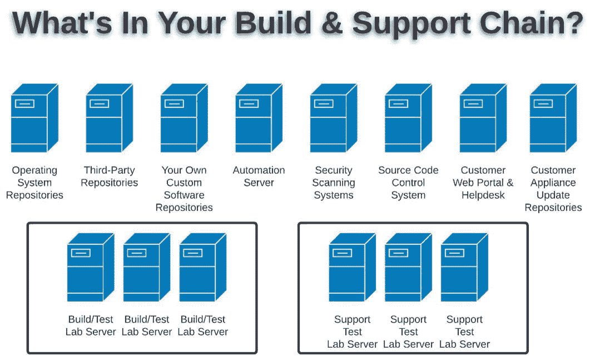
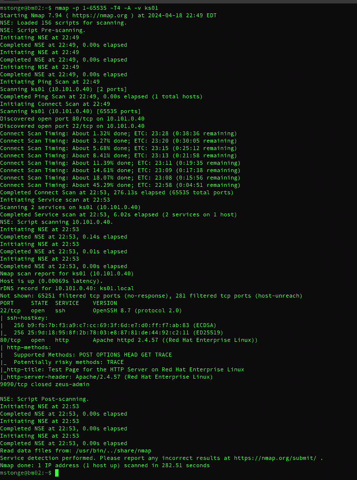
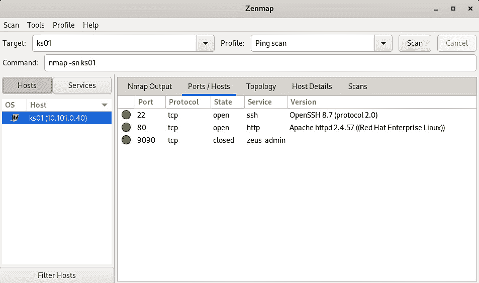
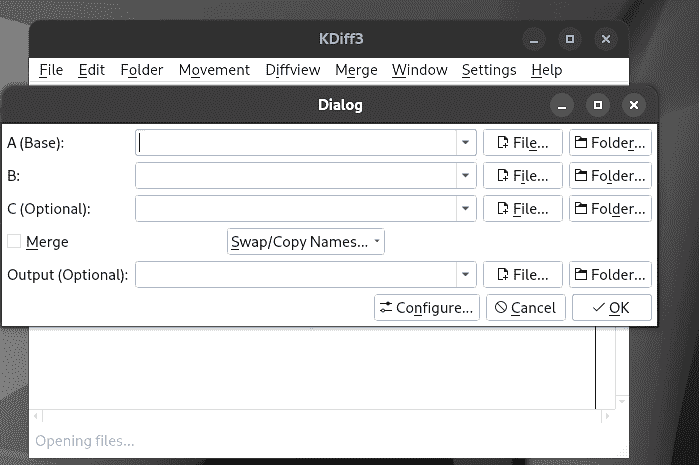
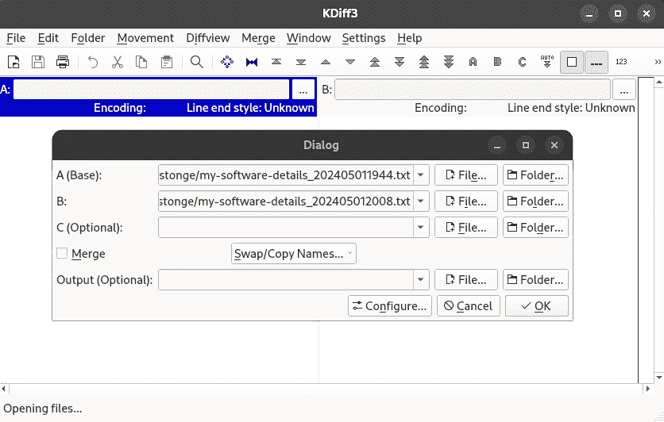
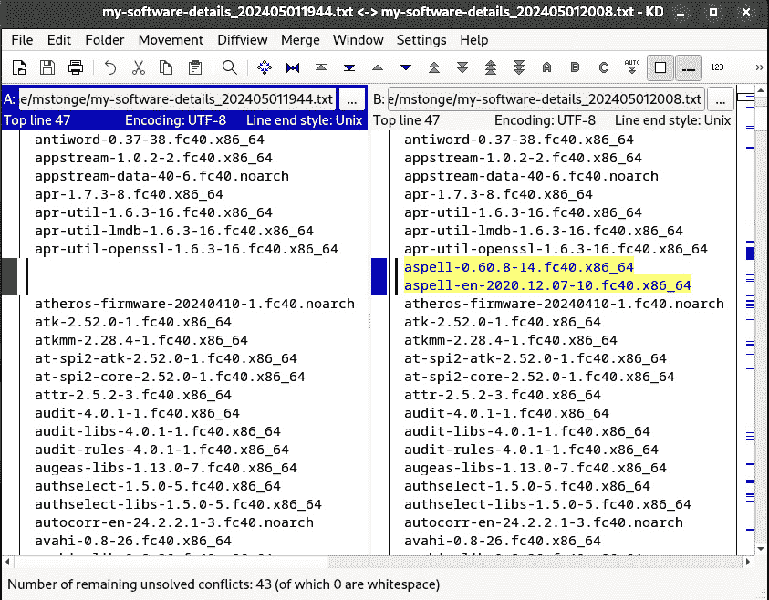

# 5

# 我的构建链中的基本需求

安全从设计桌面开始。这是事实。然而，它在构建链中得到增强并焕发活力。正是在这里，我们将实施并验证我们的安全政策，测试、扫描我们的原型，利用我们手头所有的信息资源，确保我们的产品在看到第一个客户之前，尽可能地安全且稳健。

这里才是真正的“魔法”发生的地方（或者不幸的是，如果你选择忽视它，它就不会发生）。在前几章中，我们讨论了无数的设计因素，这些因素最终促成了你概念上的初步设计标准。从这里起，我们将开始动手操作，确保遵循嵌入式系统的最佳实践，并应用安全措施。

这里是你公司构建环境中可能出现的一个非详尽的示例。这些工具应该仅对直接参与该产品或支持生产发布的人员开放。从安全的仓库到扫描工具及其间的一切，这些关键工具将极大地助力你的产品生命周期的成功。

你将需要的众多工具是广泛的，包括（但不限于）以下内容：

+   本地仓库

+   源代码控制系统

+   项目管理系统

+   客户支持系统

+   构建自动化系统

+   合规性和安全扫描系统

+   更新已部署设备的基础设施

+   最重要的是，一套完整的测试系统

这是成功的构建链基础设施所需的系统和工具的视角：



图 5.1 – 安全构建和支持链中的示例系统

拿上你喜欢的饮品，清空日程，准备好一些 USB 闪存驱动器，咱们去实验室吧。我邀请你与我一同踏上这段旅程，卷起袖子，开始敲击键盘。你准备好开始实践如何保护你的软件供应链了吗？

在接下来的章节中，我将阐述关键概念，并引导你完成一些详细的练习：

+   软件供应链控制

+   自动化和工具集成 – 简要概述

+   安全扫描、测试和修复

+   清单和配置跟踪

+   更新控制机制

让我们开始吧。

# 技术要求

如果你想跟随本章的练习，你至少需要两台运行相同 Linux 发行版的机器（物理或虚拟）。在练习中，我会标明我使用了哪个发行版以及其他相关的配置信息。出于本书的目的，假设你和你的团队对任何一种源代码控制/管理解决方案有足够的经验。

本书本身有一个 GitHub 页面和仓库。许多练习和示例配置文件都可以在那里找到：

[`github.com/PacktPublishing/The-Embedded-Linux-Security-Handbook/tree/main/Chapter05/exercises`](https://github.com/PacktPublishing/The-Embedded-Linux-Security-Handbook/tree/main/Chapter05/exercises)

# 软件供应链控制

作为解决方案提供商，您有责任了解、跟踪并保持每个组成部分的记录。如果您的解决方案需要遵守政府或行业的合规性要求，那么如果这些记录没有维护，可能会产生严重后果。

在这种情况下，我再次推荐使用企业级 Linux 发行版。它们的软件源是安全的，从源代码到编译、打包，最终交付给您。它们有很好的记录——它们必须有！这些供应商可以为您的团队提供我们所说的**软件物料清单**（**SBOM**）。这是一份完整的组件及其版本清单。此外，它也是一份声明，证明他们使用的是经过安全测试和验证的软件。

市场上有几种商业解决方案。像 Aqua、Synopsys® 和 Red Hat® 等公司（仅举几例）提供了一些出色的综合解决方案，用于保护软件管道的安全。团队可以考虑的可行选项有很多，接下来我们进入下一个部分——源代码控制。

## 源代码控制

知识产权，也就是使您的解决方案与众不同的那些特殊代码，应该受到保护。有时，几乎是任何代价都值得的。

有许多优秀的商业和开源解决方案。通常，这些解决方案与其他服务（如 bug 跟踪、敏捷项目管理、软件打包解决方案等）集成。无论您组织选择了哪种源代码控制系统，我建议确保采取所有可行的措施来最小化访问并确保平台安全。保护您公司的知识产权。接下来我们来看一看软件供应链的其他部分。

# 自动化和工具集成——简要概述

没有适当的自动化水平，任何 DevOps 环境都无法算完整。就像源代码控制一样，这方面有许多优秀的商业和开源解决方案。Red Hat Ansible®、SaltStack®、Puppet Enterprise®、Chef®、Ansible AWX® 和 Puppet Bolt® 是最常用的。

在构建链中，其他产品也可能包含大量自动化。例如，CloudBees 公司提供的平台。它们的 Jenkins 产品在全球 DevOps 环境中处于领先地位。这只是众多解决方案中的一个例子。

自动化是一个我可以滔滔不绝讲上好几个小时的话题。但这绝不是我在这一简短部分中想表达的重点。我想告诉你的是，正确实施自动化可以减轻许多人力操作时会犯错的繁琐和单调任务。风险缓解与效率，简单明了。

无论你的团队选择哪个工具（或多个工具）进行项目，我都建议你们像审查其他敏捷流程一样审查它们的使用效果和效率。这里没有错误的选择，唯一的错误是完全不在构建、测试和支持链条中使用任何自动化。不要只是找到一个工具，而是要找到最适合你们预算和团队技能，并能在项目的时间范围内轻松使用的工具。

我们肯定会在后续章节中深入探讨更多关于工具和集成的内容，接下来让我们继续前进。

# 安全扫描、测试和修复

通过使用**自由开源软件**（**FOSS**），你的团队可以实现产品生命周期中的许多（如果不是全部的话）方面。是的，我确实是开源软件的倡导者，自上世纪 90 年代末以来一直如此，尤其是在 Linux 的世界里。原因很简单，那就是技能的可移植性。

几乎所有的 Linux 发行版都共享大约 90% 的相同命令和工具。它们不共享的那 10%，正是让这些发行版独特、可扩展或更安全的地方。为了讨论方便，我想专注于这 90% —— 常见的工具。

在 Linux 的命令提示符下（无论是哪个发行版），有一些基本的命令是我们都熟悉并依赖的。虽然确实存在一些差异，但我这里重点讨论的是最常用的工具。

我想提到的第一个命令行工具是**Nmap**。Nmap 有一个图形界面版本，叫做**Zenmap**（或者在旧版本中叫做**nmap-fe**）。它几乎可以在所有 Linux 发行版和平台上找到。为什么？因为它擅长找出哪些端口是开放的，甚至能进行所谓的**操作系统指纹识别**（即，识别主机使用的是哪种操作系统）。

那么，让我们快速看一下 Nmap 和 Zenmap 在实际操作中的表现，做一个简短的实操练习。

## 练习 – 执行网络端口扫描

在本次练习中，我们将对一些测试机器进行详细的网络端口扫描。我们将使用两个类似的工具。第一个工具是 Nmap，它是一个开源的命令行端口扫描工具。第二个工具是 Zenmap，它也是开源工具，但它有一个图形用户界面。

练习要求

在这个练习中，你需要访问启用了图形桌面的 Linux 主机以及一个定义好的目标主机（用于扫描）。在随附的截图中，我使用的是 Fedora®作为 Linux 发行版，但几乎任何发行版都可以。Nmap 应该可以从你的发行版自己的仓库中获取，但我们需要从 FlathubTM 下载 Zenmap。在 Fedora 上，如果你在 gnome-software 应用中启用了第三方仓库，这个仓库已经为你配置好了。

首先，你需要登录到主机并打开终端会话。我们通常假设它默认没有安装，因此在继续之前我们将进行安装。如果你已经安装了相关工具，可以跳过这一步。

然后，我们将安装 Flathub `flatpak` 仓库（如果它尚未安装）：

```

$ flatpak remote-add --if-not-exists flathub \ 
https://dl.flathub.org/repo/flathub.flatpakrepo
[mstonge@bm03 ~]$
```

接下来，我们将在命令行确认 Flathub 仓库是否可用。

提示

请注意，即使在 gnome-software 中进行了配置，除非你亲自安装/启用它，否则它可能无法在命令行中使用。

```

$ flatpak remotes
Name    Options
fedora  system,oci
flathub system
```

现在我们将安装`zenmap` `flatpak`。

```

$ sudo flatpak install zenmap
Looking for matches…
Found ref 'app/org.nmap.Zenmap/x86_64/stable' in remote 'flathub' (system).
Use this ref? [Y/n]: y
Required runtime for org.nmap.Zenmap/x86_64/stable (runtime/org.gnome.Platform/x86_64/45) found in remote flathub
Do you want to install it? [Y/n]: y
org.nmap.Zenmap permissions:
    ipc    network    x11    file access [1]
    [1] home
        ID                                  Branch          Op          
Remote           Download
 1\. [✓] org.gnome.Platform.Locale           45              i           
flathub           18.1 kB / 369.6 MB
 2\. [✓] org.gnome.Platform                  45              i           
flathub          242.7 MB / 378.4 MB
 3\. [✓] org.nmap.Zenmap                     stable          i           
flathub            7.0 MB / 8.6 MB
Installation complete.
```

接下来，我们将从操作系统的自身仓库安装 Nmap。

```

$ sudo dnf install -y nmap
```

我们将获得以下输出：

```

Last metadata expiration check: 0:00:27 ago on Tue 30 Apr 2024 
09:08:18 PM EDT.
Dependencies resolved.
========================================================================
 Package                Architecture             Version                 
           Repository                 Size
========================================================================
Installing:
 nmap                   x86_64                   3:7.95-1.fc40          
            updates                   5.8 M
Transaction Summary
========================================================================
Install  1 Package
Total download size: 5.8 M
Installed size: 25 M
Downloading Packages:
nmap-7.95-1.fc40.x86_64.rpm                                             
            299 kB/s | 5.8 MB     00:19
------------------------------------------------------------------------
--------------------------------------------
Total                                                                   
            297 kB/s | 5.8 MB     00:20
Fedora 40 - x86_64 - Updates                                            
            1.6 MB/s | 1.6 kB     00:00
Importing GPG key 0xA15B79CC:
 Userid     : "Fedora (40) <fedora-40-primary@fedoraproject.org>"
 Fingerprint: 115D F9AE F857 853E E844 5D0A 0727 707E A15B 79CC
 From       : /etc/pki/rpm-gpg/RPM-GPG-KEY-fedora-40-x86_64
Key imported successfully
Running transaction check
Transaction check succeeded.
Running transaction test
Transaction test succeeded.
Running transaction
  Preparing        :                                                   
                                         1/1
  Installing       : nmap-3:7.95-1.fc40.x86_64                         
                                         1/1
  Running scriptlet: nmap-3:7.95-1.fc40.x86_64                         
                                         1/1
Installed:
  nmap-3:7.95-1.fc40.x86_64
Complete!
```

这是我在网络中使用 Nmap 工具进行扫描的示例。

其实是我在对一个名为`ks01`的主机进行详细端口扫描。我们将看到的是开放端口和运行的服务。



图 5.2 – Nmap 端口扫描及结果

在那个示例扫描中，我们可以看到 SSH 和 HTTP 都可以被外部主机访问。

首先，让我们看看我们的选项是什么（*提示 – 其实有很多！*）。

```

$ nmap --help
```

我们将获得以下输出：

```

Nmap 7.95 ( https://nmap.org )
Usage: nmap [Scan Type(s)] [Options] {target specification}
TARGET SPECIFICATION:
  Can pass hostnames, IP addresses, networks, etc.
  Ex: scanme.nmap.org, microsoft.com/24, 192.168.0.1; 10.0.0-255.1-254
  -iL <inputfilename>: Input from list of hosts/networks
  -iR <num hosts>: Choose random targets
  --exclude <host1[,host2][,host3],...>: Exclude hosts/networks
  --excludefile <exclude_file>: Exclude list from file
HOST DISCOVERY:
  -sL: List Scan - simply list targets to scan
  -sn: Ping Scan - disable port scan
  -Pn: Treat all hosts as online -- skip host discovery
  -PS/PA/PU/PY[portlist]: TCP SYN, TCP ACK, UDP or SCTP discovery to given ports
  -PE/PP/PM: ICMP echo, timestamp, and netmask request discovery probes
  -PO[protocol list]: IP Protocol Ping
  -n/-R: Never do DNS resolution/Always resolve [default: sometimes]
  --dns-servers <serv1[,serv2],...>: Specify custom DNS servers
  --system-dns: Use OS's DNS resolver
  --traceroute: Trace hop path to each host
SCAN TECHNIQUES:
  -sS/sT/sA/sW/sM: TCP SYN/Connect()/ACK/Window/Maimon scans
  -sU: UDP Scan
  -sN/sF/sX: TCP Null, FIN, and Xmas scans
  --scanflags <flags>: Customize TCP scan flags
  -sI <zombie host[:probeport]>: Idle scan
  -sY/sZ: SCTP INIT/COOKIE-ECHO scans
  -sO: IP protocol scan
  -b <FTP relay host>: FTP bounce scan
PORT SPECIFICATION AND SCAN ORDER:
  -p <port ranges>: Only scan specified ports
    Ex: -p22; -p1-65535; -p U:53,111,137,T:21-25,80,139,8080,S:9
  --exclude-ports <port ranges>: Exclude the specified ports from scanning
  -F: Fast mode - Scan fewer ports than the default scan
  -r: Scan ports sequentially - don't randomize
  --top-ports <number>: Scan <number> most common ports
  --port-ratio <ratio>: Scan ports more common than <ratio>
SERVICE/VERSION DETECTION:
  -sV: Probe open ports to determine service/version info
  --version-intensity <level>: Set from 0 (light) to 9 (try all probes)
  --version-light: Limit to most likely probes (intensity 2)
  --version-all: Try every single probe (intensity 9)
  --version-trace: Show detailed version scan activity (for debugging)
SCRIPT SCAN:
 -sC: equivalent to --script=default
  --script=<Lua scripts>: <Lua scripts> is a comma separated list of
           directories, script-files or script-categories
  --script-args=<n1=v1,[n2=v2,...]>: provide arguments to scripts
  --script-args-file=filename: provide NSE script args in a file
  --script-trace: Show all data sent and received
  --script-updatedb: Update the script database.
  --script-help=<Lua scripts>: Show help about scripts.
           <Lua scripts> is a comma-separated list of script-files or
           script-categories.
OS DETECTION:
  -O: Enable OS detection
  --osscan-limit: Limit OS detection to promising targets
  --osscan-guess: Guess OS more aggressively
TIMING AND PERFORMANCE:
  Options which take <time> are in seconds, or append 'ms' (milliseconds),
  's' (seconds), 'm' (minutes), or 'h' (hours) to the value (e.g. 30m).
  -T<0-5>: Set timing template (higher is faster)
  --min-hostgroup/max-hostgroup <size>: Parallel host scan group sizes
  --min-parallelism/max-parallelism <numprobes>: Probe parallelization
  --min-rtt-timeout/max-rtt-timeout/initial-rtt-timeout <time>: Specifies
      probe round trip time.
  --max-retries <tries>: Caps number of port scan probe retransmissions.
  --host-timeout <time>: Give up on target after this long
  --scan-delay/--max-scan-delay <time>: Adjust delay between probes
  --min-rate <number>: Send packets no slower than <number> per second
  --max-rate <number>: Send packets no faster than <number> per second
FIREWALL/IDS EVASION AND SPOOFING:
  -f; --mtu <val>: fragment packets (optionally w/given MTU)
  -D <decoy1,decoy2[,ME],...>: Cloak a scan with decoys
  -S <IP_Address>: Spoof source address
  -e <iface>: Use specified interface
  -g/--source-port <portnum>: Use given port number
  --proxies <url1,[url2],...>: Relay connections through HTTP/SOCKS4 proxies
  --data <hex string>: Append a custom payload to sent packets
  --data-string <string>: Append a custom ASCII string to sent packets
  --data-length <num>: Append random data to sent packets
  --ip-options <options>: Send packets with specified ip options
  --ttl <val>: Set IP time-to-live field
  --spoof-mac <mac address/prefix/vendor name>: Spoof your MAC address
  --badsum: Send packets with a bogus TCP/UDP/SCTP checksum
OUTPUT:
  -oN/-oX/-oS/-oG <file>: Output scan in normal, XML, s|<rIpt kIddi3,
     and Grepable format, respectively, to the given filename.
  -oA <basename>: Output in the three major formats at once
  -v: Increase verbosity level (use -vv or more for greater effect)
  -d: Increase debugging level (use -dd or more for greater effect)
  --reason: Display the reason a port is in a particular state
  --open: Only show open (or possibly open) ports
  --packet-trace: Show all packets sent and received
  --iflist: Print host interfaces and routes (for debugging)
  --append-output: Append to rather than clobber specified output files
  --resume <filename>: Resume an aborted scan
  --noninteractive: Disable runtime interactions via keyboard
  --stylesheet <path/URL>: XSL stylesheet to transform XML output to HTML
  --webxml: Reference stylesheet from Nmap.Org for more portable XML
  --no-stylesheet: Prevent associating of XSL stylesheet w/XML output
MISC:
  -6: Enable IPv6 scanning
  -A: Enable OS detection, version detection, script scanning, and traceroute
  --datadir <dirname>: Specify custom Nmap data file location
  --send-eth/--send-ip: Send using raw ethernet frames or IP packets
  --privileged: Assume that the user is fully privileged
  --unprivileged: Assume the user lacks raw socket privileges
  -V: Print version number
  -h: Print this help summary page.
EXAMPLES:
  nmap -v -A scanme.nmap.org
  nmap -v -sn 192.168.0.0/16 10.0.0.0/8
  nmap -v -iR 10000 -Pn -p 80
SEE THE MAN PAGE (https://nmap.org/book/man.html) FOR MORE OPTIONS AND EXAMPLES
```

现在，让我们对目标主机进行简单扫描。请将我的目标主机名称（`ks01`）替换为你的目标主机名称；否则，这个操作对你来说无法生效。这个第一个示例是*快速*端口扫描。

```

$ nmap -F ks01
Starting Nmap 7.95 ( https://nmap.org ) at 2024-04-30 21:41 EDT
Nmap scan report for ks01 (10.101.0.40)
Host is up (3.4s latency).
rDNS record for 10.101.0.40: ks01.local
Not shown: 68 filtered tcp ports (no-response), 30 filtered tcp ports (host-unreach)
PORT   STATE SERVICE
22/tcp open  ssh
80/tcp open  http
Nmap done: 1 IP address (1 host up) scanned in 28.40 seconds
$
```

现在，让我们对目标主机进行更复杂的扫描。同样，请将我的目标主机名称（`ks01`）替换为你的目标主机。在这个扫描中，我们将查找正在运行的服务的详细版本信息（如果已检测到）。

```

$ nmap -sV ks01
Starting Nmap 7.95 ( https://nmap.org ) at 2024-04-30 21:26 EDT
Nmap scan report for ks01 (10.101.0.40)
Host is up (0.021s latency).
rDNS record for 10.101.0.40: ks01.local
Not shown: 980 filtered tcp ports (no-response), 17 filtered tcp ports (host-unreach)
PORT     STATE SERVICE  VERSION
22/tcp   open  ssh      OpenSSH 8.7 (protocol 2.0)
80/tcp   open  http     Apache httpd 2.4.57 ((Red Hat Enterprise Linux))
9090/tcp open  ssl/http Cockpit web service 282 or later
Service Info: OS: Linux; CPE: cpe:/o:linux:linux_kernel
Service detection performed. Please report any incorrect results at https://nmap.org/submit/ .
Nmap done: 1 IP address (1 host up) scanned in 95.55 seconds
```

接下来，我将展示这个 Nmap 工具不仅能扫描单个主机，还能一次扫描整个子网。此操作可能需要更长时间，执行的总时间会根据网络中目标的数量而有所不同。

警告

在没有提前与网络和系统运维团队协调的情况下，千万不要在工作中尝试这个——你可不想引发任何警报（或惹上麻烦）。

```

$ nmap 10.82.0.0/25
Starting Nmap 7.95 ( https://nmap.org ) at 2024-04-30 21:18 EDT
RTTVAR has grown to over 2.3 seconds, decreasing to 2.0
RTTVAR has grown to over 2.3 seconds, decreasing to 2.0
RTTVAR has grown to over 2.3 seconds, decreasing to 2.0
RTTVAR has grown to over 2.3 seconds, decreasing to 2.0
RTTVAR has grown to over 2.3 seconds, decreasing to 2.0
RTTVAR has grown to over 2.3 seconds, decreasing to 2.0
Nmap scan report for _gateway (10.82.0.1)
Host is up (0.0013s latency).
Not shown: 996 closed tcp ports (conn-refused)
PORT     STATE SERVICE
53/tcp   open  domain
80/tcp   open  http
443/tcp  open  https
1900/tcp open  upnp
Nmap scan report for 10.82.0.41
Host is up (0.93s latency).
Not shown: 856 filtered tcp ports (no-response), 141 filtered tcp ports (host-unreach)
PORT     STATE  SERVICE
22/tcp   open   ssh
80/tcp   open   http
9090/tcp closed zeus-admin
Nmap scan report for 10.82.0.42
Host is up (3.7s latency).
Not shown: 847 filtered tcp ports (no-response), 151 filtered tcp ports (host-unreach)
PORT   STATE SERVICE
22/tcp open  ssh
80/tcp open  http
Nmap scan report for bm03.local (10.82.0.52)
Host is up (0.00060s latency).
Not shown: 998 closed tcp ports (conn-refused)
PORT     STATE SERVICE
22/tcp   open  ssh
9090/tcp open  zeus-admin
Nmap done: 128 IP addresses (4 hosts up) scanned in 151.69 seconds
```

Nmap 能够执行多种类型的扫描，如果不小心，它也可能会有些侵入性。我建议你阅读相关文档，或许可以在线获取一些免费的 Nmap 备忘单。

现在我们简要介绍了命令行中的端口扫描，让我们继续使用稍微功能丰富一些的 GUI 工具：Zenmap。

这是我运行的一个 Zenmap 扫描示例，也针对与前一个练习和演示中相同的主机。请注意，输出格式比命令行工具 Nmap 更加优化，并且为用户提供了更多可扩展的细节选项。


图 5.3 – Zenmap 扫描

这是我进行的另一个扫描示例。这次，当我获得结果后，我点击了界面中的**Ports / Hosts**标签。



图 5.4 – 另一个 Zenmap 扫描；聚焦于 Ports / Hosts 标签

我无法过分强调确保你扫描发布候选版本的漏洞，以验证开放端口/服务的重要性。我们将在后面的章节中讨论不同类型的扫描。

现在我们已经回顾了开源扫描，让我们继续讨论如何跟踪设备中的变化。

# 清单和配置跟踪

创建软件清单是了解如何维护系统安全的关键步骤。这最终是一个详细的软件包及其版本的列表，包含了你操作系统和应用堆栈中的所有包，以及任何额外的第三方包或组合依赖项。

了解每个发布版本包含什么，以及这些包的来源，并策划一个安全的包清单，将帮助你掌控解决方案的生命周期。

我并不是说这会很容易。它有可能会，但随着解决方案变得越来越复杂，这确实会变成一项艰苦的工作——尤其是当你的解决方案所使用的并非全部都是以相同格式提供时。

让我详细讲解一下。假设你的操作系统提供商将包以 RPM 格式提供，而你有一些依赖项是作为**tarballs**或者 flatpaks 下载的。那么，如果我们还运行一些容器化的微服务呢？跟踪这一切会变得非常复杂，实际上，几乎不可能完全跟踪。这就是为什么变更跟踪和 SBOM 变得如此重要的原因。所以，让我们看看如何在我们自己的设备中跟踪变化。

## 练习 – 跟踪你产品的变化

在本次练习中，我们将深入探讨如何将现有版本与下一个更新轮次中的变化（即增量）进行对比。了解哪些包是新的（这些增量再次出现）将明显突出你的团队需要提供给现有用户的更新包，这可以通过自定义仓库或其他方式提供。

练习要求

对于这个动手操作，你只需要访问一台 Linux 机器（物理机或虚拟机）。需要 root（或`sudo`）权限。我在我的 Fedora 40 机器上做这个示例，但你也可以在任何类似 RHEL 的发行版上跟着我一起操作。

首先，我们将创建一个脚本，使用你喜欢的编辑器。创建一个名为`my-inventory-creator.sh`的文件。确保设置文件权限，使其可执行。

```

#!/usr/bin/bash
#############################
#
# my-inventory-creator.sh
#
#############################
MYDATE=$(date +"%Y%m%d%H%M")
MYFILE1="my-software-sources_$MYDATE.txt"
MYFILE2="my-software-details_$MYDATE.txt"
# Notify user of the output filenames for this run
echo "Checking for RPMs and Flatpak sources"
echo "and what's installed..."
echo
echo "Your output files for this check are: "
echo "$MYFILE1"
echo "$MYFILE2"
# Determine software sources and output to file
dnf repolist | sort > "$MYFILE1"
flatpak remotes | sort >> "$MYFILE1"
# Determine the software & versions installed and output to file
rpm -qa | sort > "$MYFILE2"
flatpak list | sort >> "$MYFILE2"
echo "Completed."
```

现在让我们运行脚本，并注意输出的文件名（包括日期戳）。这些文件名对于你来说是唯一的。

```

$ bash ./my-inventory-creator.sh
```

我们将得到以下输出：

```

Checking for RPMs and Flatpak sources
and what's installed...
Your output files for this check are:
my-software-sources_202405011944.txt
my-software-details_202405011944.txt
Completed.
```

现在让我们查看这些输出文件。这些文件对于你的构建/系统也是唯一的。我们将从软件源文件开始。

```

$ cat my-software-sources_202405011944.txt
fedora-cisco-openh264          Fedora 40 openh264 (From Cisco) - x86_64
fedora                         Fedora 40 - x86_64
google-chrome                  google-chrome
repo id                        repo name
updates                        Fedora 40 - x86_64 - Updates
fedora  system,oci
flathub system
```

现在让我们来看一下软件详情文件（这将非常长）。此命令的输出很庞大，因此我提前提醒你——我为了节省空间不得不截取了它。

```

$  cat my-software-details_202405011944.txt
aajohan-comfortaa-fonts-3.105-0.3.20210729git2a87ac6.fc40.noarch
aardvark-dns-1.10.0-1.fc40.x86_64
abattis-cantarell-fonts-0.301-12.fc40.noarch
abattis-cantarell-vf-fonts-0.301-12.fc40.noarch
abrt-2.17.5-1.fc40.x86_64
abrt-addon-ccpp-2.17.5-1.fc40.x86_64
abrt-addon-kerneloops-2.17.5-1.fc40.x86_64
abrt-addon-pstoreoops-2.17.5-1.fc40.x86_64
abrt-addon-vmcore-2.17.5-1.fc40.x86_64
abrt-addon-xorg-2.17.5-1.fc40.x86_64
abrt-cli-2.17.5-1.fc40.x86_64
(((output truncated)))
Red Hat, Inc.   io.podman_desktop.PodmanDesktop 1.9.1   stable  flathub system
Zenmap  org.nmap.Zenmap 7.94    stable  flathub system
$
```

现在我们有了构建的完整软件和源清单。让我们快速搜索一个特定的包。以我的例子为例，我使用的是`httpd`，但你可以练习搜索任何你喜欢的包或版本。

```

$ grep httpd my-software-details_202405011944.txt
fedora-logos-httpd-38.1.0-5.fc40.noarch
httpd-2.4.59-2.fc40.x86_64
httpd-core-2.4.59-2.fc40.x86_64
httpd-filesystem-2.4.59-2.fc40.noarch
httpd-tools-2.4.59-2.fc40.x86_64
[mstonge@bm03 ~]$
```

现在让我们安装一个会带来一些依赖项的包。我将安装一个名为`kdiff3`的包，它属于“diff”工具的大家族，这些工具用于找出文件或命令行输出之间的差异。同样，此命令的输出非常长，因此我再次对其进行了截取。

```

$ sudo dnf install -y kdiff3
Last metadata expiration check: 0:57:55 ago on Wed 01 May 2024 07:06:13 PM EDT.
Dependencies resolved.
========================================================================================================
 Package                         Architecture Version                               Repository     Size
========================================================================================================
Installing:
 kdiff3                          x86_64       1.10.7-3.fc40                         fedora        1.9 M
Installing dependencies:
 SDL_image                       x86_64       1.2.12-37.fc40                        fedora         45 k
 aspell                          x86_64       12:0.60.8-14.fc40                     fedora        713 k
 breeze-icon-theme               noarch       6.1.0-1.fc40                          updates       9.7 M
 daala-libs                      x86_64       0-27.20200724git694d4ce.fc40          fedora        211 k
 dbusmenu-qt5                    x86_64       0.9.3-0.34.20160218.fc40              fedora         79 k
 docbook-dtds                    noarch       1.0-85.fc40                           fedora        335 k
 docbook-style-xsl               noarch       1.79.2-22.fc40                        fedora        1.5 M
 hspell                          x86_64       1.4-21.fc40                           fedora        684 k
 kde-settings                    noarch       40.0-1.fc40                           fedora         40 k
 kdsoap                          x86_64       2.2.0-4.fc40                          fedora        133 k
 kf5-kactivities                 x86_64       5.115.0-1.fc40                        fedora        137 k
 kf5-kactivities-stats           x86_64       5.115.0-1.fc40                        fedora        111 k
((( output truncated )))
Installed:
  SDL_image-1.2.12-37.fc40.x86_64                        aspell-12:0.60.8-14.fc40.x86_64
  aspell-en-50:2020.12.07-10.fc40.x86_64                 breeze-icon-theme-6.1.0-1.fc40.noarch
  daala-libs-0-27.20200724git694d4ce.fc40.x86_64         dbusmenu-qt5-0.9.3-0.34.20160218.fc40.x86_64
  docbook-dtds-1.0-85.fc40.noarch                        docbook-style-xsl-1.79.2-22.fc40.noarch
  hspell-1.4-21.fc40.x86_64                              kde-settings-40.0-1.fc40.noarch
  kdiff3-1.10.7-3.fc40.x86_64                            kdsoap-2.2.0-4.fc40.x86_64
  kf5-kactivities-5.115.0-1.fc40.x86_64                  kf5-kactivities-stats-5.115.0-1.fc40.x86_64
  kf5-karchive-5.115.0-1.fc40.x86_64                     kf5-kauth-5.115.0-1.fc40.x86_64
  kf5-kbookmarks-5.115.0-1.fc40.x86_64                   kf5-kcodecs-5.115.0-1.fc40.x86_64
(((output truncated)))
  speech-dispatcher-libs-0.11.5-5.fc40.x86_64            speexdsp-1.2.1-6.fc40.x86_64
  vlc-libs-1:3.0.20-12.fc40.x86_64                       vlc-plugin-pipewire-3-2.fc40.x86_64
  vlc-plugins-base-1:3.0.20-12.fc40.x86_64               voikko-fi-2.5-6.fc40.noarch
Complete!
```

在最后一步中，我们安装了一个包（但它带来了 113 个依赖项）。所以，让我们重新运行我们的清单脚本，并对实际发生的更改进行一些自我检查。

提示

注意这次运行中创建的新文件。

```

$ bash ./my-inventory-creator.sh
Checking for RPMs and Flatpak sources
and what's installed...
```

你这次检查的输出文件是：

```

my-software-sources_202405012008.txt
my-software-details_202405012008.txt
Completed.
$
```

现在让我们生成两个文件集之间的差异列表。

```

$ diff my-software-sources_202405011944.txt my-software-sources_202405012008.txt
```

重要提示

我们从中获取文件的源没有发生变化，但软件详情列表会有显著的变化。让我们进行并排比较。请注意，输出将会很大。

```

$ diff -y my-software-details_202405011944.txt my-software-details_202405012008.txt  | less
aajohan-comfortaa-fonts-3.105-0.3.20210729git2a87ac6.fc40.noa   aajohan-comfortaa-fonts-3.105-0.3.20210729git2a87ac6.fc40.noa
aardvark-dns-1.10.0-1.fc40.x86_64                               aardvark-dns-1.10.0-1.fc40.x86_64
abattis-cantarell-fonts-0.301-12.fc40.noarch                    abattis-cantarell-fonts-0.301-12.fc40.noarch
abattis-cantarell-vf-fonts-0.301-12.fc40.noarch                 abattis-cantarell-vf-fonts-0.301-12.fc40.noarch
abrt-2.17.5-1.fc40.x86_64                                       abrt-2.17.5-1.fc40.x86_64
abrt-addon-ccpp-2.17.5-1.fc40.x86_64                            abrt-addon-ccpp-2.17.5-1.fc40.x86_64
((( output truncated )))
brcmfmac-firmware-20240410-1.fc40.noarch                        brcmfmac-firmware-20240410-1.fc40.noarch
                                                              > breeze-icon-theme-6.1.0-1.fc40.noarch
brlapi-0.8.5-13.fc40.x86_64                                     brlapi-0.8.5-13.fc40.x86_64
((( output truncated )))
```

现在你可以看到使用此方法添加（或更改）的内容。在上面的例子中，共有 114 项更改（实际上是添加）。为了节省空间并避免让你感到无聊，我只截取了部分输出。

这是我喜欢利用一些图形用户界面工具的地方，像我刚刚安装的那个工具。让我们快速看看`kdiff3`。

我们将选择之前步骤中的相同文件。



图 5.5 – 启动 kdiff3 比较操作

接下来，选择界面中的文件。**A (Base)** 是旧的软件详情文件。最后，选择**B**文件作为最新的文件。



图 5.6 – 选择文件

现在我们已经定义了所有要比较的文件，我们点击**OK**。

这个操作的输出将图形化显示两个列表之间的差异。



图 5.7 – 运行比较

这些差异对你和你的团队来说是至关重要的知识。掌握这些知识后，你就知道哪些文件需要策划，以为客户提供合适的更新版本（假设你将这种比较作为发布候选审查过程的一部分）。这是完美的过渡到我们下一节，关于如何在产品中提供更新控制机制。

# 更新控制机制

多年来，我与嵌入式合作伙伴讨论过的最喜欢的话题之一就是如何创建一个合适的更新方法论，并建立支持该方法的流程和基础设施。最终，根据客户的操作环境、用例和合规性要求，我们已经知道这些机制是简单的在线形式，还是复杂的离线形式。

你在这里的选择将直接影响你产品的用户界面（UI）。打包你的软件和配置将简化生命周期管理和支持成本，同时改善最终用户体验。

对于接下来的这组练习，我们假设你的团队已经选择了将特定功能与使用 RPM 包和自定义仓库一起打包，在构建和支持链中使用。这是最简单的路径，但并非总是最可行的。

我们稍后将在书本的 GitHub 仓库中讨论其他更新控制机制（并在线提供）。这些机制可以是（但不限于）加密的 tar 包、ISO 镜像、U 盘、FTP 包等。每一个都需要在构建链中做额外的工作，并且在支持链中需要更多的关注，更不用说更多经过良好培训的支持人员了。

现在我们已经回顾了如何追踪和记录你设备中的变更，接下来让我们讨论保持对你的 SBOM（软件物料清单）控制的另一个关键方面——这次通过自定义打包。

## 练习 – 构建自定义软件包

希望你已经准备好开始输入了。我们将从这里开始构建。由于在自定义软件包中可以做的事情非常多，我将仅涵盖一些与嵌入式系统最佳实践相关的内容，那就是创建你自己的发布定义文件。

我分享的以下链接基本上是所有与 RPM 相关的事项的*必备*参考资料。我建议你在此花些时间：

[`rpm-packaging-guide.github.io/`](https://rpm-packaging-guide.github.io/)

练习要求

你需要访问一台 Linux 服务器。必须具有 root 或 `sudo` 权限。关于我的演示环境：我正在使用 Fedora 40 Workstation，并且创建了一个名为 `mattbuild` 的用户（你可以在开始本练习之前创建自己的构建环境用户），并且我已经将其添加到 `sudoers` 文件中。现在让我们设置你的 RPM 包构建环境。

首先，我们将安装打包工具（以及它们的众多依赖项）。

```

$ sudo dnf install -y fedora-packager fedora-review \
rpm-build rpm-devel rpmlint make python \
coreutils diffutils rpmdevtools
  ((( OUTPUT Truncated )))
Complete!
```

接下来，我们将修改用于构建软件包的用户账户，成为*mock*系统组的成员。

```

$ sudo usermod -a -G mock mattbuild
```

最后，我们将确认用户账户的更改。你可以使用`newgrp`命令，或者注销后重新登录以重置你的环境。完成其中任何一个操作后，验证组更改是否已生效。

```

$ newgrp
$ id
uid=1001(mattbuild) gid=1001(mattbuild) groups=1001(mattbuild),135(mock) context=unconfined_u:unconfined_r:unconfined_t:s0-s0:c0.c1023
[mattbuild@fedora  ~]$
```

现在让我们为该用户创建一个合适的 rpm 构建环境。运行`rpmdev-setuptree`命令将构建一个构建过程中所需的文件夹结构。

```

$ rpmdev-setuptree
$ tree rpmbuild/
rpmbuild/
├── BUILD
├── RPMS
├── SOURCES
├── SPECS
└── SRPMS
6 directories, 0 files
```

现在让我们为我们的项目创建一个`.spec`文件。我使用`vi`或`vim`，但你可以随意使用你喜欢的编辑器。如果你不想自己输入这个文件，我会将这个文件的副本放到 GitHub 仓库里。

```

$ vi myapprel.spec
```

现在，我们将编辑文件的内容。完成后，请确保保存文件。

重要提示

在此文件中，只能使用*空格*而不是*制表符*。

```

(code - myapprel.spec)
Name:          myapprel
Version:       1.0
Release:       1
Summary:       Example custom app release file installer
License:       MIT License
%description
This will install a custom release text for your appliance
%prep
# we have no source code - so let's skip this
%build
cat > myappliance-release << EOF
Welcome to my secure embedded linux system
version 1.0
EOF
%install
mkdir -p %{buildroot}/etc
install -m 644 myappliance-release %{buildroot}/etc/myappliance-release
%files
/etc/
/etc/myappliance-release
%changelog
# nothing to report on the first attempt
```

现在让我们尝试第一次 rpm 构建。这个过程的输出会非常庞大（所以我不会列出全部内容）。

```

$ rpmbuild -ba myapprel.spec
warning: source_date_epoch_from_changelog set but %changelog is missing
Executing(%prep): /bin/sh -e /var/tmp/rpm-tmp.w4pHxJ
+ umask 022
+ cd /home/mattbuild/rpmbuild/BUILD
+ RPM_EC=0
++ jobs -p
+ exit 0
Executing(%build): /bin/sh -e /var/tmp/rpm-tmp.q2Jeer
+ umask 022
+ cd /home/mattbuild/rpmbuild/BUILD
+ CFLAGS='-O2 -flto=auto -ffat-lto-objects -fexceptions -g -grecord-gcc-switches -pipe -Wall -Werror=format-security -Wp,-U_FORTIFY_SOURCE,-D_FORTIFY_SOURCE=3 -Wp,-D_GLIBCXX_ASSERTIONS -specs=/usr/lib/rpm/redhat/redhat-hardened-cc1 -fstack-protector-strong -specs=/usr/lib/rpm/redhat/redhat-annobin-cc1  -m64   -mtune=generic -fasynchronous-unwind-tables -fstack-clash-protection -fcf-protection -fno-omit-frame-pointer -mno-omit-leaf-frame-pointer '
+ export CFLAGS
(((output truncated)))
```

现在让我们进行一次测试安装。

```

$ cp ./rpmbuild/RPMS/x86_64/myapprel-1.0-1.x86_64.rpm ~/
[mattbuild@fedora  ~]$    total 12
-rw-r--r--. 1 mattbuild mattbuild 6861 Apr 20 16:37 myapprel-1.0-1.x86_64.rpm
-rw-r--r--. 1 mattbuild mattbuild  572 Apr 20 16:35 myapprel.spec
drwxr-xr-x. 8 mattbuild mattbuild   89 Apr 20 16:05 rpmbuild
[mattbuild@fedora  ~]$    sudo dnf install -y ./myapprel-1.0-1.x86_64.rpm
[sudo] password for mattbuild:
Last metadata expiration check: 0:08:09 ago on Sat 20 Apr 2024 04:31:26 PM EDT.
Dependencies resolved.
=======================================================================
 Package                     Architecture              Version         
           Repository                       Size
=======================================================================
Installing:
 myapprel                    x86_64                    1.0-1           
           @commandline                   6.7 k
Transaction Summary
=======================================================================
Install  1 Package
Total size: 6.7 k
Installed size: 55
Downloading Packages:
Running transaction check
Transaction check succeeded.
Running transaction test
Transaction test succeeded.
Running transaction
  Preparing        :                                                  
                                              1/1
  Installing       : myapprel-1.0-1.x86_64                            
                                              1/1
  Verifying        : myapprel-1.0-1.x86_64                            
                                              1/1
Installed:
  myapprel-1.0-1.x86_64
Complete!
$
```

好的！我们已经有了第一个自定义软件包和第一个自定义文件安装程序（而且它有效！）

让我们来展示一下它。

```

$ cat /etc/myappliance-release
Welcome to my secure embedded linux system
version 1.0
```

干得好！现在你正在通过创建自己的软件包来保护你的软件供应链。我真心希望你在这个练习中至少有一点乐趣。

## 练习 – 签署你的自定义 RPM 包

现在是时候为你增加额外的学分了。这不是一门入门课程，而是一个高级课程。是的，我们现在可以创建自定义的 RPM 包了，但本章的重点是保护你的软件供应链。是时候提升难度了，加入你自己的 GPG 签名到你的自定义包中吧！

首先，我们将退出构建账户并切换到 root 权限。

```

$ su -
#
```

我们现在将确保你已经安装了正确的软件，以签署你为设备构建的 RPM 包。安装`rpm-sign`包。

```

# dnf install rpm-sign
Last metadata expiration check: 1:37:57 ago on Sat 20 Apr 2024 04:31:26 PM EDT.
Dependencies resolved.
================================================================================
========================================
 Package                    Architecture             Version                    
        Repository                 Size
=================================================================================
=======================================
Installing:
 rpm-sign                   x86_64                   4.19.1.1-1.fc39             
       updates                    22 k
Transaction Summary
=================================================================================
=======================================
Install  1 Package
Total download size: 22 k
Installed size: 22 k
Is this ok [y/N]: n
Operation aborted.
[root@bm02 ~]# dnf install -y rpm-sign
Last metadata expiration check: 1:38:20 ago on Sat 20 Apr 2024 04:31:26 PM EDT.
Dependencies resolved.
=======================================================================
 Package                    Architecture             Version                     
       Repository                 Size
=======================================================================
Installing:
 rpm-sign                   x86_64                   4.19.1.1-1.fc39              
      updates                    22 k
Transaction Summary
=======================================================================
Install  1 Package
Total download size: 22 k
Installed size: 22 k
Downloading Packages:
rpm-sign-4.19.1.1-1.fc39.x86_64.rpm                                 

       49 kB/s |  22 kB     00:00
-------------------------------------------------------------------
---------------
--------------------------------------
Total                                                               
                     28 kB/s |  22 kB     00:00
Running transaction check
Transaction check succeeded.
Running transaction test
Transaction test succeeded.
Running transaction
  Preparing        :                                                
                                                                  1/1
  Installing       : rpm-sign-4.19.1.1-1.fc39.x86_64                 
                                               1/1
  Running scriptlet: rpm-sign-4.19.1.1-1.fc39.x86_64                 
                                         1/1
  Verifying        : rpm-sign-4.19.1.1-1.fc39.x86_64                 
                                              1/1
Installed:
  rpm-sign-4.19.1.1-1.fc39.x86_64
Complete!
```

在接下来的步骤中，你将生成自己的超级酷的安全`gpg`密钥。当你在生产环境中实际操作时，必须确保使用官方的名称、电子邮件地址等来为你的`gpg`密钥生成信息。

对于这个示例，我们将使用 John Doe 的名字，电子邮件地址为`john_doe@gmail.com`，密码短语为不太安全的`Embedded`。接下来的命令是交互式的，其中一些对话框实际上会展示我戏谑地称之为“屏幕呕吐”的内容，以吸引用户注意这些对话框。其他人可能会将其称为松散管理的**文本用户界面**（**TUI**）。

重要提示

使用`gpg --full-generate-key`命令来启动一个完整功能的密钥生成对话框。

```

# gpg --gen-key
gpg (GnuPG) 2.4.4; Copyright (C) 2024 g10 Code GmbH
This is free software: you are free to change and redistribute it.
There is NO WARRANTY, to the extent permitted by law.
GnuPG needs to construct a user ID to identify your key.
Real name: John Doe
Email address: john_doe@gmail.com
You selected this USER-ID:
    "John Doe <john_doe@gmail.com>"
Change (N)ame, (E)mail, or (O)kay/(Q)uit?
```

接下来，以下对话框将会出现；你需要输入密码短语`Embedded`并选择`<OK>`继续。

```

Please enter the passphrase to protect your new key
 Passphrase: ________________________________________
       <OK>                              <Cancel>
```

系统很可能会因为你没有使用超级安全的密码短语而批评你，但这只是训练，所以请选择 `<Take this one anyway>` 继续。真该感谢这些交互式文本界面，它们确实避免了你需要学习一个超长的命令行。

```

Warning: You have entered an insecure passphrase.
A passphrase should contain at least 1 digit or special character.
 <Take this one anyway>             <Enter new passphrase>
```

我们离创建密钥已经不远了。我们必须确认密码短语 `Embedded` 才能继续。

```

 Please re-enter this passphrase
   Passphrase: ________________________________________
       <OK>                              <Cancel>
```

现在，让我们看看它如何工作。你的输出应该类似于这样（但每次密钥生成都是独特的，所以可能不完全一样）。

```

We need to generate a lot of random bytes. It is a good idea to perform some other action (type on the keyboard, move the mouse, utilize the disks) during the prime generation; this gives the random number generator a better chance to gain enough entropy.
We need to generate a lot of random bytes. It is a good idea to perform some other action (type on the keyboard, move the mouse, utilize the disks) during the prime generation; this gives the random number generator a better chance to gain enough entropy.
gpg: directory '/root/.gnupg/openpgp-revocs.d' created
gpg: revocation certificate stored as '/root/.gnupg/openpgp-revocs.d/417CAC67C4F673DEDC13C95CA01133131459C4AD.rev'
public and secret key created and signed.
pub   ed25519 2024-04-20 [SC] [expires: 2027-04-20]
      417CAC67C4F673DEDC13C95CA01133131459C4AD
uid                 Matt St. Onge <matt_st_onge@yahoo.com>
sub   cv25519 2024-04-20 [E] [expires: 2027-04-20]
[root@fedora  ~]#
```

现在，让我们来看看我们系统中目前所有的密钥。

```

# gpg --list-keys
gpg: checking the trustdb
gpg: marginals needed: 3  completes needed: 1  trust model: pgp
gpg: depth: 0  valid:   1  signed:   0  trust: 0-, 0q, 0n, 0m, 0f, 1u
gpg: next trustdb check due at 2027-04-20
[keyboxd]
---------
pub   ed25519 2024-04-20 [SC] [expires: 2027-04-20]
      417CAC67C4F673DEDC13C95CA01133131459C4AD
uid           [ultimate] John Doe <john_doe@gmail.com>
sub   cv25519 2024-04-20 [E] [expires: 2027-04-20]
```

你的密钥已经被导入。让我们查询 `rpm` 数据库，看看它是否真的存在。简单的查询可能不够，所以我们可能需要添加一些字段解析。

```

# rpm -q gpg-pubkey
gpg-pubkey-18b8e74c-62f2920f
gpg-pubkey-7fac5991-45f06f46
gpg-pubkey-d38b4796-570c8cd3
gpg-pubkey-1459c4ad-6624378b
#    rpm -q gpg-pubkey --qf '%{name}-%{version}-%{release} --> %{summary}\n'
gpg-pubkey-18b8e74c-62f2920f --> Fedora (39) <fedora-39-primary@fedoraproject.org> public key
gpg-pubkey-7fac5991-45f06f46 --> Google, Inc. Linux Package Signing Key <linux-packages-keymaster@google.com> public key
gpg-pubkey-d38b4796-570c8cd3 --> Google Inc. (Linux Packages Signing Authority) <linux-packages-keymaster@google.com> public key
gpg-pubkey-1459c4ad-6624378b --> John Doe <john_doe@gmail.com> public key
```

好的。现在，让我们为 root 设置签名环境，然后验证它是否已准备好。作为 root，使用你喜欢的编辑器在 root 主页目录下创建 `.rpmmacros` 文件。

```

# vi .rpmmacros
```

下面是你需要放入 `.rpmmacros` 文件中的内容。别忘了保存文件。

```

%_signature gpg
%_gpg_path /root/.gnupg
%_gpg_name Matt St. Onge
%_gpgbin /usr/bin/gpg2
```

正如许多人听我说过的（可能太频繁了），*信任但要验证*。所以要验证！

```

# rpm --showrc | grep __gpg_sign_cmd -A 5
-13: __gpg_sign_cmd     %{shescape:%{__gpg}}
        gpg --no-verbose --no-armor --no-secmem-warning
        %{?_gpg_digest_algo:--digest-algo=%{_gpg_digest_algo}}
        %{?_gpg_sign_cmd_extra_args}
        %{?_gpg_name:-u %{shescape:%{_gpg_name}}}
        -sbo %{shescape:%{?__signature_filename}}
#
```

你等待的神奇时刻到了。让我们用你那崭新的 `GPG` 密钥来签署刚刚构建的 RPM！记住，你将被要求输入我们的超级秘密密码短语——`Embedded`。输入它后，选择 `<OK>`。

```

# cp ~mattbuild/myapprel-1.0-1,x86_65.rpm ~/
# rpm --addsign myapprel-1.0-1.x86_64.rpm
 Please enter the passphrase to unlock the OpenPGP secret key: x
  "Matt St. Onge <matt_st_onge@yahoo.com>"
   255-bit EDDSA key, ID A01133131459C4AD,
 created 2024-04-20.
  Passphrase: _________________________________________ x
      <OK>                                   <Cancel>
[root@fedora  ~]#
```

你通过在设备中安装发布文件，创建了符合嵌入式最佳实践的第一个自定义文件。由于安全在软件供应链中至关重要，你还通过添加自己的 `GPG` 密钥签名确保了包的完整性。为自己鼓掌吧。

展示你那炫酷的新技能，再次测试一下这个包。

```

# rpm -K ./myapprel-1.0-1.x86_64.rpm
./myapprel-1.0-1.x86_64.rpm: digests signatures OK
#
```

到达这里。任务完成。让我们继续迈向确保软件供应链安全的下一步。

## 练习——创建一个自定义 DNF 仓库

实际上，对于这个问题有两种不同的思路。一种是为应用堆栈和操作系统创建独立的仓库，另一种是将所有内容放在一个单一的自定义仓库中。我更倾向于后一种。我认为把所有内容放在一起会更简单，跟踪起来也更方便。我还认为，在这个仓库中创建大量自定义 RPM 以帮助团队维护解决方案是非常有必要的。我在打字时简直能感觉到自己的眼睛在翻白眼。我是不是在重复自己？很可能是的。

这个自定义存储库中还应该包含哪些内容？首先，我建议添加一个定义您版本的 rpm，就像我们刚才创建的那样。其次，我建议创建一个文档 rpm，最好与您的应用程序分开。最后，也是最重要的，我强烈建议创建一个 rpm，直接将您的存储库信息安装到设备中。将存储库定义在其自己的 rpm 中非常关键。这有助于支持和生命周期管理，如果您需要对存储库（或 GPG 密钥）进行更改，它为最终客户提供了最简单的更新方式。

这些自定义存储库不仅仅用于设备的更新。它们可以作为您安全构建链的一部分，在内部大大发挥作用。那么，话说回来，我们该如何构建一个自定义存储库呢？

练习要求

对于这个动手练习，您只需要访问一台 Linux 机器（物理机或虚拟机）。需要 root（或`sudo`）权限。我在我的 Fedora 40 系统上做这个示例，但您也可以在任何 RHEL 类的发行版上跟着我一起操作。

首先，我们将确保已安装`httpd`和`createrepo`工具。然后，我们还需要确保 Web 服务器正在正常运行。

```

# dnf install httpd createrepo -y
….output truncated
Complete!
# systemctl enable –now httpd
Created symlink /etc/systemd/system/multi-user.target.wants/httpd.service → /usr/lib/systemd/system/httpd.service.
# systemctl status httpd
● httpd.service - The Apache HTTP Server
     Loaded: loaded (/usr/lib/systemd/system/httpd.service; enabled; preset: disabled)
    Drop-In: /usr/lib/systemd/system/service.d
             └─10-timeout-abort.conf
     Active: active (running) since Mon 2024-04-22 21:39:01 EDT; 31s ago
       Docs: man:httpd.service(8)
   Main PID: 2712 (httpd)
     Status: "Total requests: 0; Idle/Busy workers 100/0;Requests/sec: 0; Bytes served/sec:   0 B/sec"
      Tasks: 177 (limit: 38325)
     Memory: 19.7M
        CPU: 93ms
     CGroup: /system.slice/httpd.service
             ├─2712 /usr/sbin/httpd -DFOREGROUND
             ├─2713 /usr/sbin/httpd -DFOREGROUND
             ├─2715 /usr/sbin/httpd -DFOREGROUND
             ├─2716 /usr/sbin/httpd -DFOREGROUND
             └─2717 /usr/sbin/httpd -DFOREGROUND
Apr 22 21:39:01 bm02.local systemd[1]: Starting httpd.service - The Apache HTTP Server...
Apr 22 21:39:01 bm02.local (httpd)[2712]: httpd.service: Referenced but unset environment variable evaluates to an>
Apr 22 21:39:01 bm02.local httpd[2712]: Server configured, listening on: port 80
Apr 22 21:39:01 bm02.local systemd[1]: Started httpd.service - The Apache HTTP Server.
lines 1-22/22 (END)
```

接下来，我们将在 html 目录下创建一个文件夹来存放我们的存储库。然后，我们将把之前练习中创建的 rpm 文件复制到该目录。

```

# cd /var/www/html
# mkdir myapp-for-x86_64-rpms
# cd myapp-for-x86_64-rpms
# cp ~/myapprel-1.0-1.x86_64.rpm .
# ls -l
total 8
-rw-r--r--. 1 root root 6861 Apr 22 21:44 myapprel-1.0-1.x86_64.rpm
[root@bm02 myapp-for-x86_64-rpms]#
```

接下来，我们将初始化存储库。

```

# createrepo /var/www/html/myapp-for-x86_64-rpms/
Directory walk started
Directory walk done - 1 packages
Temporary output repo path: /var/www/html/myapp-for-x86_64-rpms/.repodata/
Pool started (with 5 workers)
Pool finished
#
```

测试以确保我们可以通过本地的 Web 浏览器访问存储库。

这是在本地浏览器中测试时您会看到的一个示例。它将显示您新创建的自定义存储库中的可访问内容。


图 5.8 – 在网页浏览器中查看本地存储库

这个内部存储库的其他步骤包括在防火墙上启用`http`（这样我们的新存储库可以被您实验室内的机器访问），如果正在使用，还需将存储库目录和文件的`selinux`文件上下文设置为`httpd_syscontent_t`。由于这不是一本基础的系统管理员书籍，我相信您和您的团队已经知道如何做这些简单的任务。

这通常是实验室环境中的合适设置。对于任何面向外部的应用（即面向互联网的），这种设置是完全不可接受的。对于这种使用情况，有许多书籍和资源可供参考，教您如何保护 Web 服务器；但是，我会做一些基础性建议，这些建议应该是显而易见的。

对于面向公众的 Web 服务器，您的系统应使用带有签名证书的`https`。服务器应该在您公司外部的 DNS 中，以便客户能够找到它。应采用方法控制访问，或许在单个客户或用户级别上进行控制。尽可能保护您的系统。

现在我们已经创建了一个自定义包并通过自定义仓库进行托管，剩下的就是如何配置设备以使用新的自定义内容。接下来的练习将带你完成这一过程。

## 练习 – 配置你的解决方案以使用自定义仓库

现在让我们配置设备以访问自定义仓库。这是确保将来只向最终用户提供经过测试和验证的内容的关键步骤。

练习要求

对于这个动手练习，你需要访问之前创建了示例仓库的同一台 Linux 机器，并且还需要另一台机器来配置以访问该仓库。必须具有 root（或`sudo`）权限。我在我的 Fedora 40 系统上做这个示例，但你也可以在任何类似 RHEL 的发行版上跟着我一起操作。

这些文件存储在`/etc/yum.repos.d/`目录下，文件扩展名为`.repo`。它们应该由 root 用户拥有，所有人可读，但只有 root 可以写。这样可以确保它们的安全性。

在创建你自己的示例仓库定义文件之前，我们先来看一下我为之前练习中创建的自定义仓库所做的详细拆解。这是一个名为`mycustomstuff.repo`的示例文件。我会把这个文件的副本放在 GitHub 仓库中，以防你不想自己输入这个文件内容。

```

# ID definition of the repository
[my-custom-stuff]
# NAME of the repository
name=my-custom-stuff
# the base URL - update this for your systems information
baseurl=http://bm02.local/myapp-for-x86_64-rpms/
# Repository enabled =1 ... disabled =0
enabled=1
# setting up a gpg key for the repo is a great idea if public facing
# repo gpg check enabled =1 disabled =0
repo_gpgcheck=0
# definition for the gpg key for the repo itself (if enabled)
# example formatting:
# gpgkey=file:///(path to file)
# (or)
# gpgkey=(URL to gpgkey)
#
```

现在你有了一个示例，创建你自己的`mycustomstuff.repo`文件，并将其放在没有托管仓库的 Linux 机器上。该文件应该由 root 用户拥有，但所有用户和所有组都可以读取。

完成后，通过在已设置仓库访问的机器上安装 RPM 包`myapprel`来测试其功能。

```

$ sudo dnf install -y myapprel
Last metadata expiration check: 0:21:52 ago on Wed 01 May 2024 10:45:50 PM EDT.
Dependencies resolved.
=======================================================================
===================================
 Package                 Architecture          Version               
Repository                      Size
======================================================================
====================================
Installing:
 myapprel                x86_64                1.0-1                 
my-custom-stuff                6.7 k
Transaction Summary
=====================================================================
=====================================
Install  1 Package
Total download size: 6.7 k
Installed size: 55
Downloading Packages:
myapprel-1.0-1.x86_64.rpm                                        
         1.9 MB/s | 6.7 kB     00:00
-----------------------------------------------------------------
-----------------------------------------
Total                                                             
        670 kB/s | 6.7 kB     00:00
Running transaction check
Transaction check succeeded.
Running transaction test
Transaction test succeeded.
Running transaction
  Preparing        :                                              
                                    1/1
  Installing       : myapprel-1.0-1.x86_64                        
                                    1/1
  Verifying        : myapprel-1.0-1.x86_64                        
                                    1/1
Installed:
  myapprel-1.0-1.x86_64
Complete!
```

现在我们已经成功地将系统连接到仓库并安装了自定义包，我们可以庆祝我们的成功了。这些练习对于你的团队未来如何支持设备至关重要。

需要考虑的其他问题

这本该不言而喻，但我还是要说一遍。让实际人员测试你的原型和发布候选版本。只有这样，你的团队才能知道你是否真正取得了成功。我并不是说你不应该进行自动化测试——实际上，恰恰相反，你应该同时进行。首先做所有自动化测试、渗透测试和扫描。一旦对这些结果感到满意，再进行人工测试。

你还必须测试你的流程和支持基础设施。测试新版本将如何影响支持链，以及每个新版本将如何被你的客户使用。失败或损坏的更新可能会导致停机、服务阻塞、无法使用的设备，最糟糕的是，客户会非常不满和失望。

# 总结

那么，让我们来总结一下。我们在这一章中确实涵盖了很多内容。你应该感觉自己已经取得了一定的成就。你在短时间内已经走了很长一段路。最初，你建立了你的设备物料清单（SBOM），然后你定义了自己的自定义包、发布版本和自定义仓库。所有这些最终都通过授权设备访问你的自定义仓库并安装新包来付诸实践。你已经确保了自己的软件供应链安全！希望你现在能感到有能力跟踪未来产品的生命周期，接下来我们将进入下一章，深入探讨加密技术的使用以及如何保护你解决方案中的数据。
