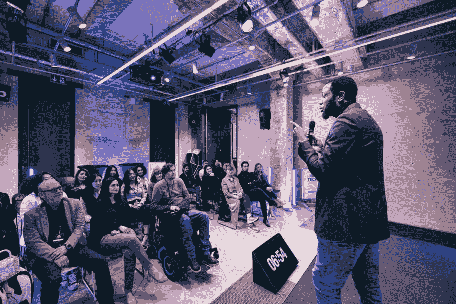

# 14

# 客户和社区反馈循环

欢迎来到最后一章，我们希望通过指导你如何与潜在社区互动，帮助你完成无限循环的闭环。归根结底，是你的客户推动了你的解决方案，因为他们有未满足的需求。不要只是帮他们解痒，更要帮助他们取得巨大的成功。他们的成功也将成为你的成功。

本章的目标不是教授你 CI/CD，而是启发你认识到来自最终用户、管理层以及利用你的产品解决问题的整体社区的持续互动和反馈所带来的价值。你可以期待这些互动为用例、方法论和使用模式提供宝贵的洞见，这些你之前可能未曾预见。所获得的数据将为未来的功能和创新提供动力，同时无疑帮助你在这个过程中提高产品的安全性。这就是你的客户为事业带来价值的地方。

你收集反馈的努力是持续**CI/CD 循环**的最后一步，然后才进入开发下一个更新：

1.  计划

1.  构建

1.  持续集成

1.  部署

1.  持续反馈

本章不会有动手实践的练习，但请不要以为你没什么工作要做。我将给你和你的团队设定一些挑战。你如何应对这些挑战可能决定了你项目的整体成功或严重失败。所以，废话不多说，让我们一起迈出最后的步伐，完成 CI/CD 循环。

本章的主要内容包括：

+   用例开发

+   用户群体

+   高管圆桌会议

+   社区反馈循环

+   闭环：书末总结

现在，让我们进入第一部分，回顾你的用例。

# 用例开发

等等，我们之前不是在书中已经讲过这个了吗？嗯，没错，实际上是的——就在*第二章*中。不过我们只是浅尝辄止。本章你会发现的内容将远远更加…具有针对性。本章的一个重要部分将是我之前提到的关于参与的另一面。

这不会是重复的内容。之前，我要求你与客户进行更多的互动。这一点现在已经假设了。在本章中，我们将完成整个 CI/CD 循环，我挑战你采取超越基本互动的步骤。事实上，我建议你和你的团队制定与潜在客户群体的具体互动方式，更重要的是，建立一个社区。换句话说，不要只是加入一个社区——要创建并领导一个社区！

在这里，我要求你真正从那些将成为你客户群体的人那里获取实际信息、研究和指导。这些人是你到达一个能够定义未来产品必须做什么、必须遵守的安全要求，并且理解他们想要什么和必须拥有什么功能的关键。

用例本身将决定你未来的用户群体如何利用你的解决方案。他们如何消费你的设备提供的服务，将驱动必须规划的安全措施（UI、用户级别访问、抗篡改等）。你如何获取这些信息是本章要解决的挑战。

此外，来自用户的反馈可能会帮助识别安全问题或缺失的安全措施，这些可能是你的团队未在该版本的设备中加入的。鼓励用户提供开放的反馈总是一个很好的产品改进建议来源。忽视他们的反馈，后果自负。

让我们进入第一种信息收集方法——创建并主持**用户** **群体**会议。

# 用户群体

在本书早些时候，在*第十一章*中，我建议你参与安全社区的用户群体。我并没有偏离这个建议。本节内容并非关于这个。这里，我挑战你去找到可能成为你用户群体的最高集中度，并在该区域创建一个用户群体。

这个用户群体将专注于你的产品、它的使用方式、未来发展，以及他们希望你维护或改进的部分。为你的产品创建自己的社区。我无法强调这有多么重要。你从这些人那里获得的反馈对你的产品成功至关重要。如果用户群体认为你没有朝着正确的方向发展，他们可能会放弃你的产品。

了解你的产品如何部署和使用可能会让你感到惊讶。你可能会发现它们并未按预期使用。这本身就可能影响到你产品的安全性和完整性。相反，你也可能得出结论，某个功能或安全措施可能被忽视了。

你甚至可能会从用户那里获得关于如何使他们的体验更愉快、更高效的宝贵见解，还可能获得一些关于哪些功能能够让你的产品与众不同的建议。永远不要低估用户群体可能揭示的宝贵信息。

你与这些人互动的方式将改变他们对你产品的看法，并最终影响他们对你公司整体的认知。要积极互动，保持开放，最重要的是倾听他们的想法和关注点。这些互动是建立与用户群体之间信任的宝贵机会，不仅能让他们的声音被听见，还能强化他们的意见至关重要。当他们知道自己的意见被重视时，他们会觉得自己不仅是解决方案的一部分，更像是一个社区的一员，而不仅仅是供应商的客户。

这是一个成功的用户群体互动的示例。

图 14.1 – 用户群体促进客户互动

这些会议绝不能表现得像销售推销；事实上，你应该避免让销售团队参与。这些小组在用户可以与产品管理团队和工程师互动时效果最好。*技术人员与技术人员对话*——这是最有效的方式。

这是一个建议。在前几次会议接近尾声时，向听众询问他们对会议节奏、未来会议内容以及会议时长的看法（是太长，太短，还是刚好合适？）。

我发现一件总是能激发参与感并导致成功的方法，就是邀请听众公开分享他们与产品的最近一次体验，无论是正面还是负面的。没有什么是正式的。这是鼓励与会者更多参与的好方法。

最后，一旦你的用户群体逐渐成型，你的下一个任务就是鼓励客户和合作伙伴参与议程。无论是演示、示范，还是由客户或合作伙伴进行的简短闪电演讲，都有助于建立你的社区并赢得信任。让他们谈谈好的、坏的和丑陋的，讲述他们是如何解决问题的，以及产品如何为他们的组织带来价值。

在下一节中，我们将回顾如何与不同层级的领导进行互动——如何获得高层支持——并且这些领导层来自你的客户群体。

# 高层圆桌会议

虽然吸引用户群体的参与可以激发他们对产品的极大热情，并提供关于使用模式的重要见解，但与行业高层建立有意义的关系将推动产品的采纳和曝光度，并为客户提供真正的渠道，帮助你推动产品的创新、可用性和安全性提升。

拥有高层支持者相当于获得了一个*力量倍增器*。该高层领导可以推动你产品的快速采纳。更重要的是，他们能够为你的团队提供关键的见解，了解实施和集成操作的实际进展，以及产品的市场反馈。

高层领导还可能对与工程团队协调或联系功能产生兴趣。他们在安全性和合规性方面的见解可能会改变你的看法。

这是一个可能的高层圆桌会议形式，适用于你的团队。

图 14.2 – 高层圆桌会议推动参与

既然你已经获得了高层支持并建立了关键领导层沟通渠道，那么接下来我们来讨论如何深入接触普通社区。

# 社区反馈循环

有许多方法可以用来吸引你的社区参与。请使用所有这些方法：活动、用户小组、圆桌会议、调查和积极的研究工作。在本书的早期，特别是在*第十一章*中，我曾挑战你参与到 Linux 和安全社区中来。现在，我直接挑战你去创建属于你自己的社区。

一旦你的公司开始销售产品，不管你愿不愿意，你的用户都会找到一种方式非正式地分享信息。这些信息共享活动可能会从留言板开始，逐渐自然演变成非正式的群体。

这是你塑造发展中的社区的最大机会。主持留言板。创建一个用户小组，最好是在你的用户聚集较多的地方。这可能意味着在多个地理区域或城市创建几个独特的群体会议环境。从用户集中度最大的地方开始，并在决定扩展并在其他地方创建新小组时，获取他们的反馈。

你可能无法覆盖全球各地的所有用户群体。你可以通过新闻通讯和调查保持用户的参与度。除非你的产品出现问题，否则不要期待调查会有 100%的回应率。但这些沟通方式无法替代直接互动。这里的目标不仅仅是持续的参与（虽然它确实有一些价值），而是希望通过让用户的声音被听到并保持他们的信息更新，鼓励他们进一步成为一个社区。我的个人观点是，你其实可能会过度参与。不要像某些不愿透露姓名的在线供应商那样，每次订单都要求你填写调查问卷。确保你的互动能为接收者带来价值，否则就不要互动。

在这里，我建议你举办活动。这些活动的目标观众是每个人。潜在客户、合作伙伴、用户、高管和行业媒体都是你希望吸引的目标。每个群体都会提供自己的意见和反馈。这些活动可以由多个同时进行的环节组成，每个环节针对不同的受众。产品信息、培训和基于小组的问答环节是这里的主角。

最终，我这里并不是在谈论如何营销你的产品。很多人能够比我做得更好，讨论这一点。我说这些的目的是要你与社区保持联系，并使其积极发展。了解他们的需求，并在你的解决方案中加以回应，将继续推动成功，并帮助你在此过程中实现更安全的产品。

# 总结

我们现在已经走到了终点。这一章涉及了如何从组织外部收集和吸收反馈的关键方面。这些努力通常是并行进行的，它们将共同为你的团队提供一个类似天气预报的虚拟报告，准确反映你的产品如何被接收和感知，以及你可以做出哪些改变，以提高安全性和采用率。它们也是一个很好的指标，表明社区认为你的产品在哪些方面做得很好，你应该在未来的版本中持续这些优点……把这些宝贵的见解当作它们本身的价值吧——这是一个你不需要为之付费给行业分析师就能得到的惊人洞察力。

最后，让我们来总结一下这本书，或者说是本书的结尾总结。

# 闭环

首先，我必须说——感谢你与我一起走过这段旅程。虽然这本书已经结束，但我真心希望这仅仅是你新旅程的开始，并且那个旅程将会有许多美好的事情等待着你和你的公司。能够成为你的引导者，是一种荣幸和愉快。

对我而言，这本书的结束，意味着我的叙述结束，我的安全-focused 长篇大论也告一段落，但故事并未结束。我将继续为书籍的 GitHub 仓库提供更新。你应该定期查看，看看新增了哪些新内容。可能是修改后的实验、更新，或更多嵌入式 Linux 的精彩示例。

## 将所有的部分拼接在一起

这本书的目的是带领你，我亲爱的读者，经历一段知识的渐进过程，无论你在做决定时需要面对什么样的挑战，你都可以将这些知识应用到你的项目中。让我们一起回顾这段最佳实践、安全操作、配置和工具的进展，看看我们应该如何将它们结合起来。

在本书的第一部分——*嵌入式系统与安全设计简介*中，我们深入反思了嵌入式 Linux 系统：这些系统是什么，谁在使用它们，以及应用设计标准的艰难任务。

现在你应该更牢固地掌握的关键概念是：理解什么是嵌入式 Linux 系统设备，谁在使用它，以及合规性工作如何推动整体解决方案的实现，从硬件和操作系统的选择开始。

在本书的第二部分——*设计组件*中，我们从理解设计标准的知识出发，将不同的安全组件应用到我们的设计中。这一部分是我们开始以动手操作的方式实际使用许多技术的地方。我们告别了第一部分的理论思维，转而采用了实际应用。

本节你应该从中获得的关键概念，首先是你可能需要在构建链中实现的工具，接着是一些非常详细和具体的安全措施，这些措施需要在你的软件和硬件配置中执行，最后是所有由于防篡改而导致的特殊情况，这些情况是为了防止最终用户自身篡改你的解决方案。

在本书的第三部分，也是最后一部分——*构建链、设备生命周期与持续改进*——我们讨论了如何创建一个可持续的 CI/CD 链，这个链不仅仅是自动化构建和测试。要实现最完美的闭环，这个链中还必须有人类的输入和输出。也就是说，你需要为你的产品/项目创建一个社区。维护和培养这个社区的工作，和你对产品的关注与尽职调查同样重要。

本节的要点是巨大的。到目前为止，你应该已经在脑海中将所有内容整合起来。你现在知道了可以随手获取哪些资源，帮助你保持信息更新并领先一步。你也知道如何实际测试和实施解决方案中的安全性。接下来，我们进入本章，完成了与社区的持续反馈环路。

我们一起走过了漫长的旅程，现在我想给你最后的挑战。

## 保持参与

这不应该是你旅程的终点。现在我能留给你的最大挑战就是保持参与，甚至更重要的是保持警觉。威胁环境不断变化，因此你必须保持领先，保持信息的更新和学习。

不仅要保持自己的参与，还要保持团队的参与。确保你产品的安全需要一个团队的持续努力。这不是一次性的工作。不要在几次成功发布后放松警惕。

另一个*禁忌*——我恳请你重视这个警告：“不要停止学习！”个人和职业上进步的速度要超过威胁环境的变化。推动你自己的成功。安全不仅仅是一个过程——它是一种心态。

再次感谢你的时间、支持和关注。我真心希望这本书能对你有所帮助。

结束…还是一个新的开始？这由你决定。接下来你打算做什么？

# 加入我们的 Discord 社区

加入我们社区的 Discord 空间，与作者和其他读者讨论：

[`packt.link/embeddedsystems`](https://packt.link/embeddedsystems)

