# *第十三章*: 为 Ghidra 社区做贡献

在本章中，我们将讨论如何正式贡献给 Ghidra 项目。毫无疑问，通过安装 Ghidra、使用它并进行自己的开发，您已经在为该项目做出贡献。但通过为社区做出贡献，我们可以向官方 Ghidra 源代码仓库带来改进。

在本章中，您将学习如何与 Ghidra 社区互动，提出更改，向项目中添加新代码，提出任何问题，帮助他人并最终从与您在逆向工程领域共享兴趣的人那里学习。参与开源项目可以是一场令人兴奋的冒险，既是学习和帮助他人的方式，又能结识真正有趣的人。

我们将从了解 Ghidra 项目及其社区开始。这将帮助您了解现有的官方和非官方资源。

最后，您将探索如何以不同的方式为 Ghidra 项目做贡献，从报告 Ghidra 中的 bug 到建议 **国家安全局** (**NSA**) 将您自己开发的代码加入其中。

本章将涉及以下主题：

+   概览 Ghidra 项目

+   探索贡献

让我们开始吧！

# 技术要求

以下是本章的技术要求：

+   一个 GitHub 账号: [`github.com/join`](https://github.com/join)

+   Git 版本控制系统: [`git-scm.com/downloads`](https://git-scm.com/downloads)

您还需要本书的 GitHub 仓库，其中包含本章所需的所有代码：[`github.com/PacktPublishing/Ghidra-Software-Reverse-Engineering-for-Beginners`](https://github.com/PacktPublishing/Ghidra-Software-Reverse-Engineering-for-Beginners)。

查看以下链接以观看《代码实战》视频: [`bit.ly/33OWhNu`](https://bit.ly/33OWhNu)

# 概览 Ghidra 项目

Ghidra 项目可通过 [`ghidra-sre.org/`](https://ghidra-sre.org/) 获取，当然，它也可以通过 NSA 网站（[`www.nsa.gov/resources/everyone/ghidra/`](https://www.nsa.gov/resources/everyone/ghidra/)）访问。Ghidra 项目网站允许您执行以下操作：

+   下载 Ghidra 的最新发布版本（在写本书时为 Ghidra v9.1.2）

+   检查 Ghidra 最新发布版本的 SHA-256

+   查看 Ghidra 发布的版本

+   查看 Ghidra 仓库中的源代码: https://github.com/NationalSecurityAgency/ghidra

前述的操作列表可以在以下截图中看到：


图 13.1 – 下载 Ghidra

NSA 决定在其网站上包括的另一组选项如下：

+   安装指南: [`ghidra-sre.org/InstallationGuide.html`](https://ghidra-sre.org/InstallationGuide.html)

+   Ghidra 的备忘单，包括快捷键: [`ghidra-sre.org/CheatSheet.html`](https://ghidra-sre.org/CheatSheet.html)

+   项目的维基，包括常见问题: [`github.com/NationalSecurityAgency/ghidra/wiki`](https://github.com/NationalSecurityAgency/ghidra/wiki)

一个问题追踪器: [`github.com/NationalSecurityAgency/ghidra/issues`](https://github.com/NationalSecurityAgency/ghidra/issues)

现在你已经了解了各种可用资源，让我们一起探索 Ghidra 项目的社区。

## Ghidra 社区

Ghidra 社区主要集中在 GitHub 上，正如我们将在*探索贡献*一节中看到的那样。我们在这里提到的 GitHub 仓库可以在[`github.com/NationalSecurityAgency/ghidra`](https://github.com/NationalSecurityAgency/ghidra)找到。

除此之外，另一个有趣的网站是 Ghidra 博客: [`ghidra.re/`](https://ghidra.re/)。目前还不清楚是谁在维护 Ghidra 博客，但它包含了许多有用的资源，其中一些如下：

+   Ghidra 在线文档: [`ghidra.re/docs/`](https://ghidra.re/docs/)

+   从初学者到高级的 Ghidra 在线课程: [`ghidra.re/online-courses/`](https://ghidra.re/online-courses/)

+   一个 Twitter 账号: [`twitter.com/GHIDRA_RE`](https://twitter.com/GHIDRA_RE)

+   针对不同客户端的一些 Ghidra 聊天频道：

    - Telegram: [`t.me/GhidraRE/https://t.me/GhidraRE_dev`](https://t.me/GhidraRE/https://t.me/GhidraRE_dev)

    - Matrix: [`riot.im/app/#/group/+ghidra:matrix.org`](https://riot.im/app/#/group/+ghidra:matrix.org)

    - Discord: [`discord.gg/S4tQnUB`](https://discord.gg/S4tQnUB)

我强烈建议你加入 Telegram 频道，因为它们非常活跃且有用。这是一个很好的方式来感受社区的活力。学习时也能享受其中的乐趣！

在本节中，我们查看了关于 Ghidra 的所有可用资源。在下一节中，我们将重点关注 Ghidra 的 GitHub 仓库，正如你所知，它是 Ghidra 社区的核心。由于这一点，它值得拥有自己的一节。

# 探索贡献

在本节中，你将了解可以进行的各种贡献类型，以及它们的法律方面。阅读完本节后，你将掌握如何与社区互动，提出 Ghidra 代码修改和改进建议。

## 了解法律方面

Ghidra 是根据 2004 年 1 月发布的 Apache 许可证版本 2.0 分发的，这是一个宽松的许可证，主要条件要求保留版权和许可证通知。作为贡献者，你将明确授予专利权。许可的作品、修改和更大的作品可以根据不同的条款分发，并且不需要源代码。

协作者与贡献者 – I

如果你想了解更多关于贡献的法律方面的信息，请阅读许可证：[`github.com/NationalSecurityAgency/ghidra/blob/master/LICENSE`](https://github.com/NationalSecurityAgency/ghidra/blob/master/LICENSE)。

现在你已经了解了关于贡献的法律方面内容，接下来让我们学习如何提交 bug 报告。

## 提交 bug 报告

与 Ghidra 合作的一种方式是报告你发现的 bug。即使在正常使用程序的过程中，也有可能发现 bug。要报告 bug，请点击此链接：

[`github.com/NationalSecurityAgency/ghidra/issues`](https://github.com/NationalSecurityAgency/ghidra/issues)。

通过点击这个链接，你将进入一个页面，页面上的每一行都对应一个 Ghidra 用户报告的问题。你可以通过点击**New issue**按钮来报告自己的 bug：

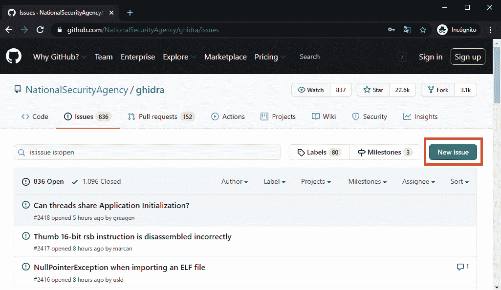

图 13.2 – 通过 GitHub 报告的 Ghidra 问题

这样做后，你将进入**Get started**选项，你可以在这里填写表单并描述 bug：


图 13.3 – 报告一个 bug

问题的自文档化表单如下所示。填写完成后，点击**Submit new issue**提交：

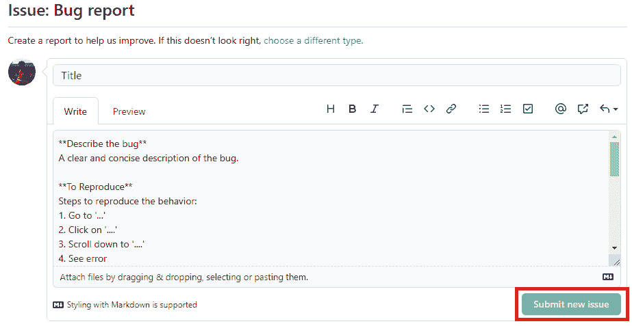

图 13.4 – 报告一个 bug

当然，你也可以通过点击你感兴趣的问题来帮助其他人解决问题。例如，如果我们点击*图 13.2*中显示的**Can threads share Application Initialization?**问题，我们就能够写下新的评论，回复现有的评论，等等：

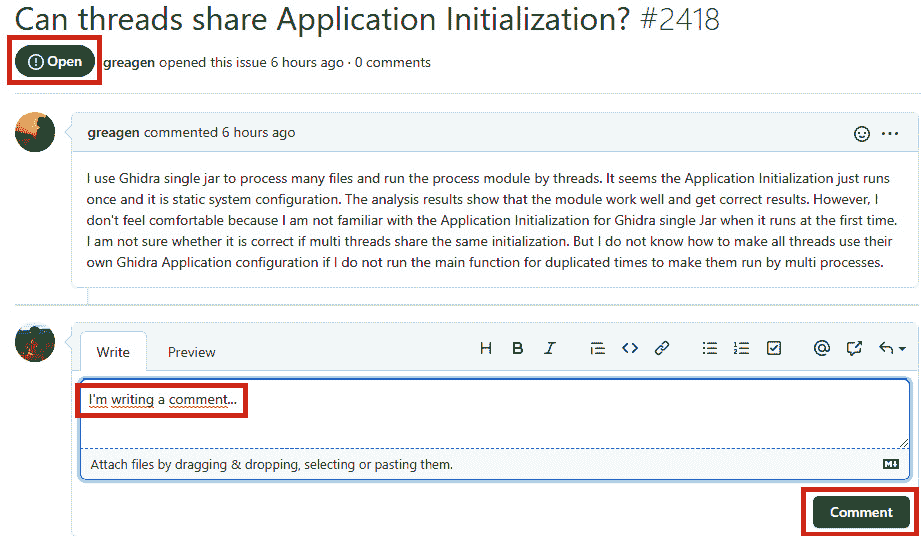

图 13.5 – 为已报告的问题写评论

该问题目前是开放状态，意味着尚未提供解决方案。这个状态通过一个绿色图标显示，图标上写着**Open**。当问题被关闭，意味着已经解决时，会通过一个红色的感叹号图标来突出显示，如下图所示：


图 13.6 – 已关闭的 Ghidra 问题示例

当你拥有一个问题时，由于你是该问题的作者，你将能够关闭它，但任何没有特权的社区成员将无法这样做：

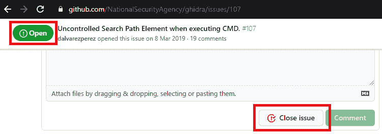

图 13.7 – 关闭你已报告的问题

有一些特权角色（协作者和贡献者）在适当的情况下可以关闭你的问题。**协作者**是对 Ghidra 项目做出贡献的社区成员，而**贡献者**是 Ghidra 项目的核心开发者：


图 13.8 – 特权角色 – 协作者和贡献者

合作者与贡献者 – II

如果你想了解合作者和贡献者之间的区别，请访问以下链接：[`github.com/CoolProp/CoolProp/wiki/Contributors-vs-Collaborators`](https://github.com/CoolProp/CoolProp/wiki/Contributors-vs-Collaborators)。如果你对这两种角色的工作流感兴趣，可以查看以下链接：

– 合作者：[`github.com/CoolProp/CoolProp/wiki/Collaborating%3A-git-development-workflow`](https://github.com/CoolProp/CoolProp/wiki/Collaborating%3A-git-development-workflow)

– 贡献者：[`github.com/CoolProp/CoolProp/wiki/Contributing%3A-git-development-workflow`](https://github.com/CoolProp/CoolProp/wiki/Contributing%3A-git-development-workflow)

正如你已经看到的，掌握 Ghidra 社区的许多方面依赖于从 GitHub 获取知识。在下一节中，我们将学习如何提出新功能。

## 提出新功能建议

我们可以像报告 bug 一样向 Ghidra 项目提出自己的想法；即通过点击**问题** | **新问题**：


图 13.9 – 创建新问题

**功能请求**表单可以通过点击**功能请求**窗口中的**开始使用**按钮来访问：


图 13.10 – 创建功能请求

贡献表单是自我文档化的。查看下面截图中显示的**功能请求**表单：

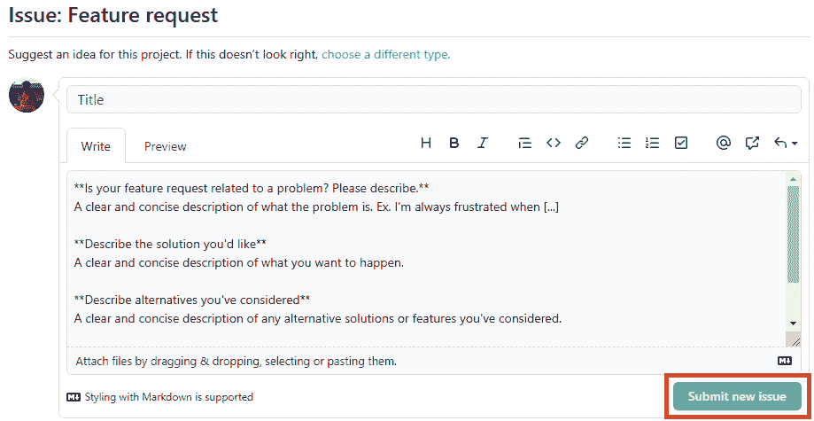

图 13.11 – 功能请求表单

要提交自己的功能请求，你必须填写**标题**字段。根据自文档化表单写下描述，并包含以下内容：

+   描述你的问题所解决的问题。

+   提供这个问题的解决方案。

+   描述你考虑过的一些替代解决方案。

+   如有必要，添加额外信息。

填写表单并点击**提交新问题**后，你会看到你的功能请求已经提交，如下截图所示：

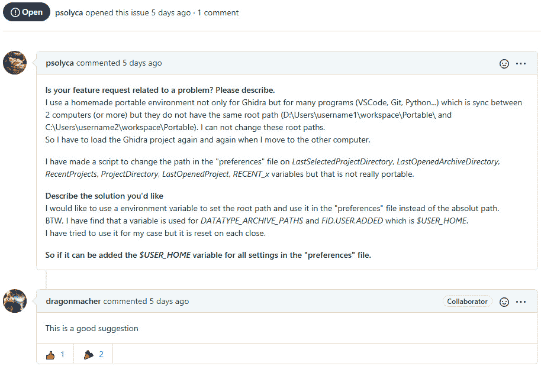

图 13.12 – 通过 GitHub 报告的 Ghidra 问题

如你所见，社区通常非常棒。如果你的贡献有帮助，他们会非常感激。

## 提交问题

如你所见，功能和漏洞报告都被视为问题——漏洞报告、功能和问题都被视为问题，如下截图所示：


图 13.13 – Ghidra 问题类型

这三种贡献的区别在于它们使用的 issue 模板（https://github.com/NationalSecurityAgency/ghidra/tree/master/.github/ISSUE_TEMPLATE），如下截图所示：

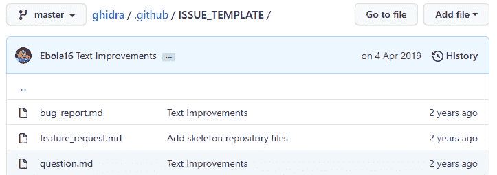

图 13.14 – Ghidra 问题模板

提交问题的模板是最简单的：

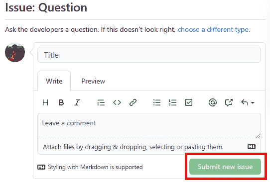

图 13.15 – 提交一个问题

写下你的问题并点击 **提交新问题**，因为正如你现在知道的，问题也被视为问题。

## 向 Ghidra 项目提交拉取请求

为了提出补丁，你需要在你自己的 GitHub 账户中创建一个 Ghidra 仓库的副本。这可以通过分叉仓库来完成，如下截图所示：


图 13.16 – 分叉 Ghidra 官方仓库

点击 **分叉** 后，你将在自己的 GitHub 账户中获得 Ghidra 的副本：

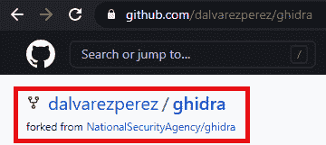

图 13.17 – Ghidra 项目在你的 GitHub 账户上的分叉

你可以使用 Git 克隆仓库。克隆会在你的计算机上创建一个你分叉的仓库的本地副本。这个副本随后会与分叉的仓库关联：

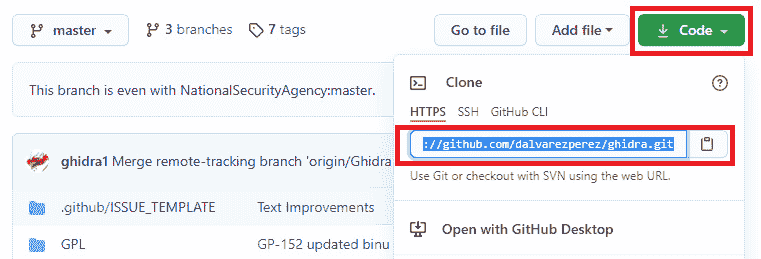

图 13.18 – 克隆 Ghidra 的分叉仓库

要克隆仓库，执行 `git clone` 命令并使用你的克隆 URL，如前面的截图所示。这可能需要一段时间，因为整个 Ghidra 项目（在编写本书时为 114.11 MB）将被复制到你的计算机上：

```
Microsoft Windows [Version 10.0.19041.572]
```

```
(c) 2020 Microsoft Corporation. All rights reserved.
```

```
C:\Users\virusito>git clone https://github.com/dalvarezperez/ghidra.git
```

```
Cloning into 'ghidra'...
```

```
remote: Enumerating objects: 119, done.
```

```
remote: Counting objects: 100% (119/119), done.
```

```
remote: Compressing objects: 100% (68/68), done.
```

```
remote: Total 80743 (delta 48), reused 115 (delta 47), pack-reused 80624
```

```
Receiving objects: 100% (80743/80743), 114.11 MiB | 1008.00 KiB/s, done.
```

```
Resolving deltas: 100% (49239/49239), done.
```

```
Checking out files: 100% (13977/13977), done.
```

```
C:\Users\virusito>
```

在此之后，你将能够对 Ghidra 进行修改（例如，你自己的开发）。在这里，我们将向 Ghidra 添加一个 `FirstPullRequest.md` 文件，作为一个任意修改，以演示这一过程。为此，请进入 `ghidra` 克隆目录并创建所需的文件：

```
C:\Users\virusito>cd ghidra
```

```
C:\Users\virusito\ghidra>echo "My first pull request" > FirstPullRequest.md
```

```
C:\Users\virusito\ghidra>
```

我们可以通过以下步骤将这些更改提交到我们分叉的仓库：

向 Git 添加 `FirstPullRequest.md` 文件：

```
C:\Users\virusito\ghidra>git add -A
```

创建一个包含我们所做更改的提交：

```
C:\Users\virusito\ghidra>git commit -m "Our commit!!"
```

```
[master 119b5f874] Our commit!!
```

```
1 file changed, 1 insertion(+)
```

```
create mode 100644 FirstPullRequest.md
```

提交这些更改到我们的在线 GitHub 仓库：

```
C:\Users\virusito\ghidra>git push
```

```
Enumerating objects: 4, done.
```

```
Counting objects: 100% (4/4),done. 
```

```
Delta compression using up to 12 threads
```

```
ompressing objects: 100% (2/2), done.
```

```
Writing objects: 100% (3/3), 317 bytes | 317.00 KiB/s, done.
```

```
Total 3 (delta 1), reused 0 (delta 0)
```

```
remote: Resolving deltas: 100% (1/1), completed with 1 local object.
```

```
To https://github.com/dalvarezperez/ghidra.git 027ba3884..119b5f874  master -> master
```

现在，你将能够在你的仓库中看到这个更改：


图 13.19 – 通过添加新文件修改的 Ghidra 分叉

除此之外，你还将看到你的仓库比 `NationalSecurityAgency` Ghidra 项目领先一个提交：


图 13.20 – 我们的 Ghidra 分叉比 Ghidra 官方仓库的主分支领先一个提交

现在你已经对 Ghidra 进行了修改，你可以建议 NSA 将此文件添加到项目中。点击 **拉取请求** 以执行包含我们更改的拉取请求：


图 13.21 – 开始一个拉取请求

最后，通过点击 **创建拉取请求**，你的拉取请求就准备好了：

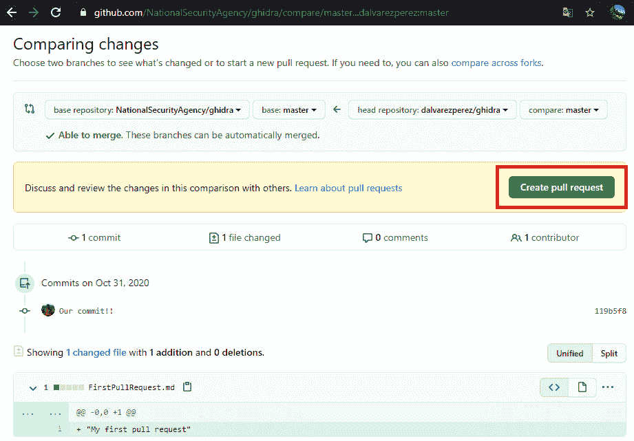

图 13.22 – 概览您的拉取请求的更改

然后，只需添加标题（默认是提交信息）、一些文本（例如`I'm trolling NSA`）并点击**创建拉取请求**：

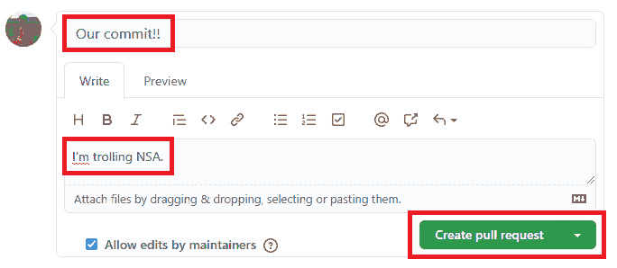

图 13.23 – 创建拉取请求，建议 NSA 将您的更改应用到 Ghidra

当然，我不会创建这个拉取请求，因为我不想与 NSA 惹麻烦。

如果您想对现有的拉取请求发表评论，请前往官方 Ghidra 代码库中的**拉取请求**标签。在这里，您可以对其他用户的现有拉取请求发表评论：


图 13.24 – 访问官方 Ghidra 代码库中已创建的拉取请求

至此，您已经学会了如何通过自己的代码为 Ghidra 做出贡献。如果您想了解更多关于如何贡献的内容，请查阅我们的 Ghidra 贡献指南。

贡献指南

如果您想了解更多关于如何贡献的内容，请查看以下链接：[`github.com/NationalSecurityAgency/ghidra/blob/master/CONTRIBUTING.md`](https://github.com/NationalSecurityAgency/ghidra/blob/master/CONTRIBUTING.md)。如果您希望准备一个高质量的开发环境，建议您参考开发者指南：[`github.com/NationalSecurityAgency/ghidra/blob/master/DevGuide.md`](https://github.com/NationalSecurityAgency/ghidra/blob/master/DevGuide.md)。

本章是关于如何为 Ghidra 做出贡献的详细指南，但显然，我们没有涵盖所有 GitHub 和/或 Git 软件的功能，因为这超出了本书的范围。事实上，还有许多其他贡献方式，例如回答其他用户的问题，但这些方法是直观的，因此这里不会讨论。

# 概要

在本章中，您了解了各种 Ghidra 在线资源，包括网站、社交网络账户、聊天和 Ghidra 代码库。

您还学会了如何以不同方式与社区互动，包括提交错误报告、新功能、问题以及评论其他用户的提交。

接着，您了解到提到的提交实际上是问题，它们有不同类型的模板。

最后，您学会了如何创建 Ghidra 的分叉，修改代码，并向社区提出您的修改建议。

在下一章，您将学习一些我们尚未涉及的高级主题，例如可满足性模理论和符号执行，以及如何扩展您迄今为止学到的知识。

# 问题

1.  要参与 Ghidra 开发过程，是否必须为 NSA 工作？

1.  您如何与其他社区成员互动？如何与他们讨论 Ghidra？

# 深入阅读

请参考以下链接以获取更多关于本章所涵盖主题的信息：

+   *精通 Git 和 GitHub - 面向初学者的实战训练营*，*Shubham Sarda*，*2019 年 9 月* [视频]：[`www.packtpub.com/product/mastering-git-and-github-a-practical-bootcamp-for-beginners-video/9781839219955`](https://www.packtpub.com/product/mastering-git-and-github-a-practical-bootcamp-for-beginners-video/9781839219955)

+   *Git 和 GitHub：完整的 Git 和 GitHub 课程*，*George Lomidze*，*2020 年 3 月* [视频]：[`www.packtpub.com/product/git-and-github-the-complete-git-and-github-course-video/9781800204003`](https://www.packtpub.com/product/git-and-github-the-complete-git-and-github-course-video/9781800204003)

+   Ghidra 贡献文档：[`github.com/NationalSecurityAgency/ghidra/blob/master/CONTRIBUTING.md`](https://github.com/NationalSecurityAgency/ghidra/blob/master/CONTRIBUTING.md)

+   Ghidra 开发者指南：[`github.com/NationalSecurityAgency/ghidra/blob/master/DevGuide.md`](https://github.com/NationalSecurityAgency/ghidra/blob/master/DevGuide.md)
