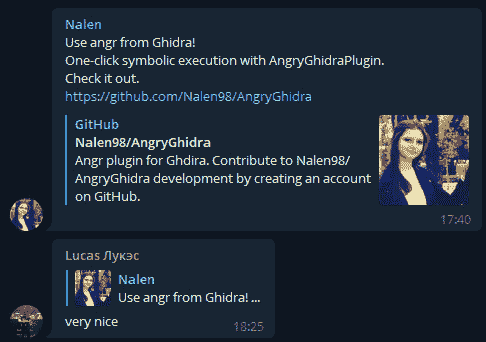
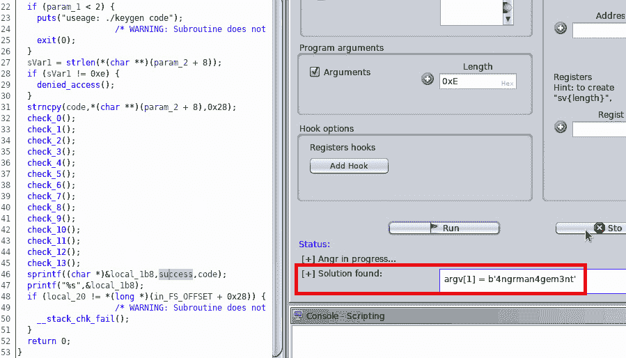
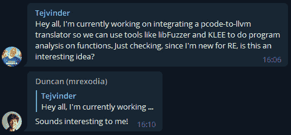

# *第十四章*：扩展 Ghidra 以进行高级逆向工程

在本章中，我们将讨论你可以采取的下一步，以深入了解 Ghidra 并充分利用其功能。通过本书，你已经学会了如何使用 Ghidra 进行逆向工程，还学会了如何修改和扩展 Ghidra，以及如何通过你自己的开发为项目做出贡献。尽管我们已经涵盖了所有内容，但我们还没有讨论如何利用 Ghidra 来攻克最前沿的逆向工程挑战。

在本章中，你将学习一些当前流行的高级逆向工程主题，包括静态和动态符号执行以及**可满足性模块理论**（**SMT**）求解器。

静态符号执行（简称符号执行）是一种系统化的程序分析技术，它使用符号输入（例如，名为 x 的 32 位向量）来执行程序，而不是使用具体值（例如，5 单位）。

随着程序在静态符号执行会话中的执行进展，输入会经过各种限制（例如，if 条件、循环条件等），从而产生公式。这些公式不仅包含算术运算，还包括逻辑运算，使其成为**可满足性模块理论**（**SMT**）问题；也就是说，这是一个我们需要判断一个一阶公式是否在某种逻辑理论下是可满足的问题。SMT 是 SAT（布尔可满足性问题）的扩展。顾名思义，SAT 公式涉及布尔值，而 SMT 是 SAT 的一种变体，扩展了整数、实数、数组、数据类型、位向量和指针等内容。

由于 SAT 和 SMT 都是已知的难题（NP 完全问题），在某些情况下，需要对其公式进行简化。这可以通过部分地用具体值填充公式来完成，这就是动态符号执行或共符号执行（其中“共符号”指的是混合具体值和符号值）。

我们将首先提供一些高级逆向工程工具和技术的基础概述，然后探讨 Ghidra 扩展功能和能力，利用这些工具使工作变得更加轻松。

在本章中，我们将涵盖以下主题：

+   学习高级逆向工程的基础

+   使用 Ghidra 进行高级逆向工程

让我们开始吧！

# 技术要求

本章的技术要求如下：

+   Microsoft Z3 定理证明器：[`github.com/Z3Prover/z3`](https://github.com/Z3Prover/z3)。

+   Miasm 逆向工程框架：[`github.com/cea-sec/miasm`](https://github.com/cea-sec/miasm)。

本书的 GitHub 仓库，包含了本章节所需的所有代码：[`github.com/PacktPublishing/Ghidra-Software-Reverse-Engineering-for-Beginners/tree/master/Chapter14`](https://github.com/PacktPublishing/Ghidra-Software-Reverse-Engineering-for-Beginners/tree/master/Chapter14)

请查看以下链接，观看《代码实战》视频：[`bit.ly/2K1SmGd`](https://bit.ly/2K1SmGd)

# 学习高级逆向工程的基础知识

在本节中，我们将提供 Ghidra 处理器模块框架的概述。这个框架会有些不同，因为处理器模块并不是用 Java 编写的，而是用 Ghidra 的处理器规范语言 SLEIGH 编写的。

## 了解符号执行

你应该已经熟悉调试程序的各个方面。在这种过程中，你使用具体的值来探索程序，这就是所谓的具体执行。例如，以下截图展示了一个 x86_64 的调试会话。在调试 `hello_world.exe` 程序时，`RAX` 寄存器的值为 `0x402300`，这是一个具体值：


图 14.1 – Ghidra SLEIGH 编辑器插件用于 Eclipse IDE

但是，有一种方法可以使用符号而非具体值来探索程序。这种探索程序的方法被称为符号执行，它的优势在于使用一个数学公式来表示所有可能的值，而不是单一的值：

+   符号：*y = x + 1*

+   具体：*y = 5 + 1 = 6*；（假设 *x = 5*）

让我们使用 MIASM（https://github.com/cea-sec/miasm）来分析相同的代码，从第一条指令（`0x402300` 地址）到第一条跳转指令（`0x402310` 地址），这允许执行符号执行：

```
00  #!/usr/bin/python3
```

```
01  from miasm.analysis.binary import Container
```

```
02  from miasm.analysis.machine import Machine
```

```
03  from miasm.core.locationdb import LocationDB
```

```
04  from miasm.ir.symbexec import SymbolicExecutionEngine
```

```
05  
```

```
06  start_addr = 0x402300
```

```
07  loc_db = LocationDB()
```

```
08  target_file = open("hello_world.exe", 'rb')
```

```
09  container = Container.from_stream(target_file, loc_db)
```

```
10  
```

```
11  machine = Machine(container.arch)
```

```
12  mdis = machine.dis_engine(container.bin_stream, 
```

```
                              loc_db=loc_db)
```

```
13  ira = machine.ira(mdis.loc_db)
```

```
14  asm_cfg = mdis.dis_multiblock(start_addr)
```

```
15  ira_cfg = ira.new_ircfg_from_asmcfg(asm_cfg)
```

```
16  symbex = SymbolicExecutionEngine(ira)
```

```
17  symbex_state = symbex.run_block_at(ira_cfg, start_addr)
```

```
18  print (symbex_state)
```

这段代码执行以下操作，符号执行我们 `hello_world.exe` 程序的第一个基本块：

1.  这声明这是一个 Python 3 脚本（第`00`行）。

1.  这段代码开始导入一些必要的 MIASM 组件（第`01`到`04`行）。

1.  这实例化了位置数据库，稍后会用到（第`07`行）。

1.  这会将 `hello_world.exe` 文件作为 MIASM 容器打开（第`08`和`09`行）。

1.  这为我们的 `hello_world.exe` 程序创建了一个架构，架构是 x86_64（第`11`行）。

1.  这初始化了队列拆解引擎（第`12`行）。

1.  这初始化了 IRA 机器（第`13`行）。IRA 是 MIASM 的中间表示，类似于 Ghidra 中的 PCode。

1.  这会获取汇编语言的控制流图（第`14`行）。

1.  这会获取 IRA 中间表示的控制流图（第`15`行）。

1.  它初始化了符号引擎（第`16`行）。

1.  这使用符号引擎在 `0x402300` 地址运行基本块（第`17`行）。

1.  这会打印符号引擎的状态（第`18`行）。

如果我们运行上述代码，将产生以下结果：

```
C:\Users\virusito\hello_world> python symbex_test.py
```

```
(@32[@64[0x404290]] == 0x2)?(0x402318,0x402312)
```

程序的符号状态可以理解为：如果存储在`0x404290`中的 64 位地址指向的 32 位值等于`0x2`（这就是你必须读取查询左侧部分的方式，相当于一个`if`语句），则跳转到`0x402318`；否则，跳转到`0x402312`。

MIASM

如果你想了解更多关于 MIASM 的内容，可以查看以下链接：[`github.com/cea-sec/miasm`](https://github.com/cea-sec/miasm)。如果你想深入理解上述代码，可以查看 MIASM 自动生成的 Doxygen 文档：[`miasm.re/miasm_doxygen/`](https://miasm.re/miasm_doxygen/)。

在本节中，你通过编写一个简单的示例学习了符号执行的基础知识。在下一节中，我们将学习为什么符号执行是有用的。

## 学习 SMT 求解器

SMT 求解器将一个（无量词的）一阶逻辑公式，*F*，作为输入，基于背景理论*T*，并返回以下内容：

+   `sat`（+模型）：如果*F*是可满足的

+   `unsat`：如果*F*是不可满足的

让我们看一个使用由微软开发的 z3 定理求解器的 Python 示例：

```
>>> from z3 import *
```

```
>>> x = Int('x')
```

```
>>> y = Int('y')
```

```
>>> s = Solver()
```

```
>>> s.add(y == x + 5)
```

```
>>> s.add(y<x)
```

```
>>> s.check()
```

```
unsat
```

在上述代码中，我们执行了以下操作：

1.  导入了微软的`z3`。

1.  声明了两个`int`类型的 z3 整数变量：`x`和`y`。

1.  实例化了 z3 求解器：s。

1.  添加了一个约束，表示`y`等于`x`加`5`。

1.  添加了另一个约束，表示`y`小于`x`。

1.  检查是否可以找到满足公式的具体值。

显然，求解器返回`unsat`，因为`y`和`x`的值不存在。这是因为`x`比`y`大`5`个单位，而`y`小于`x`。

如果我们重复此实验，并更改条件，使得`y`大于`x`，求解器将返回`sat`：

```
>>> s = Solver()
```

```
>>> s.add(y == x + 5)
```

```
>>> s.add(y>x)
```

```
>>> s.check()
```

```
sat
```

```
>>> s.model()
```

```
[x = 0, y = 5]
```

在这种情况下，公式可以被求解，我们也可以通过调用`model()`来请求满足该公式的具体值。

SMT 求解器可以与符号执行结合使用，以检查某个公式是否返回`sat`或`unsat`；例如，检查某个调用图的路径是否能够被达到。

实际上，你可以使用 MIASM 的`TranslatorZ3`模块轻松地将 MIASM IRA 符号状态（前一节中脚本第`17`行的`symbex_state`变量）转换为 z3 公式。以下代码片段展示了这一点，并扩展了前一节的脚本：

```
19  from z3 import *
```

```
20  from miasm.ir.translators.z3_ir import TranslatorZ3
```

```
21  translatorZ3 = TranslatorZ3()
```

```
22  solver = Solver()
```

```
23  solver.add(translatorZ3.from_expr(symbex_state) == 
```

```
                                              0x402302)
```

```
24  print(solver.check())
```

```
25  if(solver.check()==sat):
```

```
26    print(solver.model())
```

```
27  solver = Solver()
```

```
28  solver.add(translatorZ3.from_expr(symbex_state) == 
```

```
                                             0x4022E0)
```

```
29  print(solver.check()
```

```
30  if(solver.check()==sat):
```

```
31    print(solver.model())
```

在前一段代码片段中，正在执行以下操作：

1.  导入微软的`z3`（第`19`行）。

1.  导入`TranslatorZ3`，它允许我们将 MIASM IRA 机器符号状态转换为微软的 z3 公式（第`20`行）。

1.  实例化了`TranslatorZ3`（第`21`行）。

1.  实例化微软 z3 求解器（第`22`行）。

1.  将 IRA 符号状态转换为微软的`z3`公式，并为其添加一个约束，表示跳转指令必须直接跳转到`0x402302`地址（第`23`行）。

1.  询问求解器该公式是否有解；也就是说，是否在某种可能的情况下可以选择`0x402302`分支（`24`行）。

1.  如果可以采取该分支，则请求求解器提供解决方案（`25`行和`26`行）。

1.  再次实例化求解器，并对另一个分支重复此过程（`27`行到`31`行）。

执行完整脚本的结果给出了以下输出：

```
zf?(0x402302,0x4022E0)
```

```
sat
```

```
[zf = 1]
```

```
sat
```

```
[zf = 0]
```

前面的代码打印了 MIASM IRA 机器的符号状态。由于我们对这个分支没有进一步的限制条件，因此它对该分支的两个路径都返回`sat`。这意味着两个分支都可以被选取：当零标志被设置为`1`时，选择`0x402302`分支，而当零标志设置为`0`时，选择`0x4022E0`分支。

## 了解共符执行

符号执行（也称为静态符号执行）非常强大，因为你可以探索所有可能值的路径。你还可以探索其他路径，因为它不依赖于接收到的输入。然而，它也面临一些局限性：

+   SMT 求解器无法处理非线性和非常复杂的约束。

+   由于这是一个白盒技术，因此建模库是一个困难的问题。

为了克服这些限制，我们可以为符号执行提供具体值。这种技术被称为共符执行（也叫做动态符号执行）。

一个流行的用于分析二进制文件的 Python 框架，结合了静态和动态符号执行，称为 Angr 框架。

Angr 框架

如果你想了解更多关于 Angr 框架的内容，可以查看以下链接：[`angr.io/`](https://angr.io/)。如果你有兴趣查看一些 Angr 的实际案例，参考 Angr 文档：[`docs.angr.io/`](https://docs.angr.io/)。

正如你猜测的，这些工具和技术可以应用于逆向工程中的许多挑战性任务，尤其是在去混淆时。

# 使用 Ghidra 进行高级逆向工程

Ghidra 有一种中间语言，称为 PCode。它使得 Ghidra 变得非常强大，因为它适合应用这些技术。正如我们在*第九章*，《*脚本二进制审计*》中的*PCode 与汇编语言*部分中提到的，PCode 更适合符号执行的原因是它比汇编语言提供了更多的粒度。事实上，汇编语言中发生的副作用，例如在执行指令时修改的标志寄存器，在 PCode 中并不存在，因为它们被分割成了许多指令。中间表示的这一特性简化了创建和维护 SMT 公式的任务。

在下一节中，你将学习如何使用 Angr 扩展 Ghidra，这是一个强大的二进制分析框架，用于实现符号执行。

## 使用 AngryGhidra 向 Ghidra 添加符号执行功能

在寻找如何在 Ghidra 的 Telegram 频道上进行符号执行时，我发现了一个插件，它为 Ghidra 增加了 Angr 功能：



图 14.2 – AngryGhidra 插件发布在 GhidraRE Telegram 频道

正如我们在 *第十三章* 中提到的，*为 Ghidra 社区做贡献*，Ghidra 相关的 Telegram 群组非常有用。你可以从以下链接下载 AngryGhidra 插件：https://github.com/Nalen98/AngryGhidra。

在使用 AngryGhidra 插件时，通过右键点击地址，你可以指定以下内容：

+   开始 Angr 分析的位置（**空白状态地址**）。

+   你不想达到的路径地址（**避免地址**）。

+   你想要到达的地址（**查找地址**）。

上述字段可以在以下截图中看到：


图 14.3 – AngryGhidra 插件界面

使用这些字段，你可以在几秒钟内解决具有挑战性的二进制问题：



图 14.4 – 使用 AngryGhidra 快速解决挑战

在下一节中，我们将学习如何将 PCode 转换为 **低级虚拟机**（**LLVM**）中间表示。LLVM 提供了若干编译器和工具链子项目，但对于本书来说，我们只关心 LLVM 中间表示子项目。

## 使用 pcode-to-llvm 将 PCode 转换为 LLVM

在 Telegram 上有一个关于如何在两种中间表示之间进行转换的讨论——特别是如何从 PCode 转换为 LLVM。这是因为许多工具无法用于 PCode，且由于 Jython 的原因，Ghidra 仅限于 Python 2：



图 14.5 – 为模糊测试目的将 PCode 转换为 LLVM 的概念，发布于 GhidraRE Telegram 频道

LLVM

LLVM 项目是一个模块化且可重用的编译器和工具链技术集合。其核心项目也名为 LLVM，包含了你处理中间表示并将其转换为目标文件所需的一切。欲了解更多信息，请查看以下链接：[`llvm.org/docs/GettingStarted.html`](https://llvm.org/docs/GettingStarted.html)。

在这种情况下，提问者需要使用 LLVM，例如使用名为 libFuzzer 的模糊测试库（[`llvm.org/docs/LibFuzzer.html`](https://llvm.org/docs/LibFuzzer.html)）来查找二进制文件中的漏洞。

你可以使用 Ghidra 通过以下插件将编译后的二进制文件提升为 LLVM：

[`github.com/toor-de-force/Ghidra-to-LLVM`](https://github.com/toor-de-force/Ghidra-to-LLVM)。

如你所知，本书之外有很多有趣的主题可以深入研究。我建议你加入 Ghidra Telegram 频道和 Ghidra 社区，了解更多信息。

# 总结

在本章中，你学习了几个高级逆向工程主题；即符号执行、SMT 求解器和合成符号执行。

你通过使用 MIASM 编写一些简单代码，学习了如何执行符号执行，该代码通过符号执行一个基本的 Hello World 程序的基本块。你还通过执行两个简单实验，了解了 z3 定理求解器。

最后，你学习了如何通过扩展 Ghidra 插件来结合符号执行和合成符号执行。你还学习了如何将 PCode 转换为 LLVM 中间表示，这对于执行一些高级逆向工程任务非常有用。

希望你喜欢阅读这本书。你已经学到了很多知识，但记住要将这些知识付诸实践，以进一步发展你的技能。二进制保护越来越复杂，因此掌握高级逆向工程主题是必要的。Ghidra 可以成为这场斗争中的好盟友，所以要利用它，并将它与其他强大的工具结合使用——甚至是你自己开发的工具。

# 问题

1.  具体执行和符号执行有什么区别？

1.  符号执行能否替代具体执行？

1.  Ghidra 能否对二进制文件应用符号执行或合成符号执行？

# 进一步阅读

请参考以下链接，获取有关本章所涉及主题的更多信息：

+   *基于抽象解释的 Ghidra 去混淆插件*：[`www.msreverseengineering.com/blog/2019/4/17/an-abstract-interpretation-based-deobfuscation-plugin-for-ghidra`](https://www.msreverseengineering.com/blog/2019/4/17/an-abstract-interpretation-based-deobfuscation-plugin-for-ghidra)

+   *符号执行技术调查*，*Baldoni, R., Coppa, E., Cono D'Elia, D., 等*，*2016 年 10 月*：[`ui.adsabs.harvard.edu/abs/2016arXiv161000502B/abstract`](https://ui.adsabs.harvard.edu/abs/2016arXiv161000502B/abstract)

+   *可满足性模理论调查*，*David Monniaux*，*2017 年 1 月*：[`hal.archives-ouvertes.fr/hal-01332051/document`](https://hal.archives-ouvertes.fr/hal-01332051/document)
