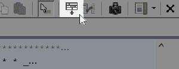
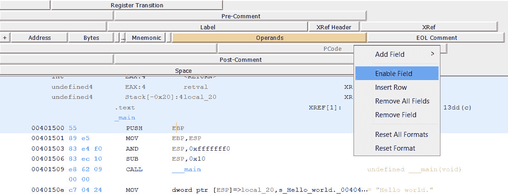
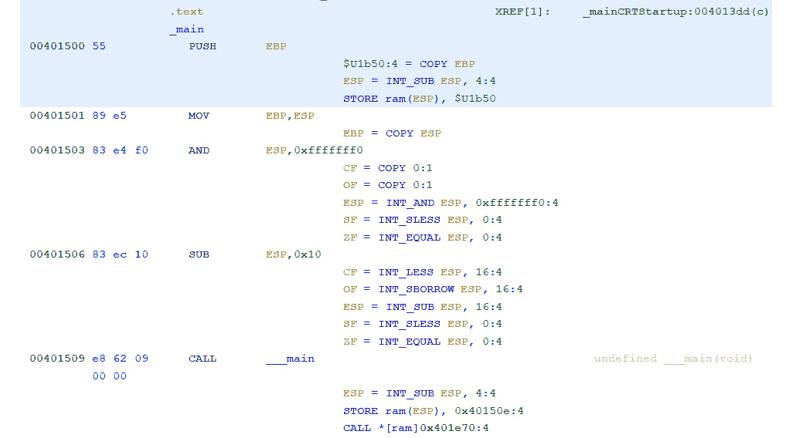
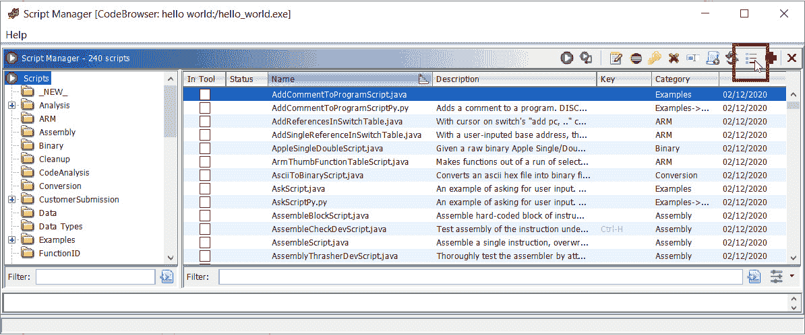
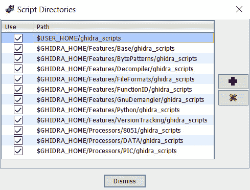

# 评估

# 第一章

1.  没有任何逆向工程框架是完美的。每个逆向工程框架都有其优缺点。我们可以提到一些当前 Ghidra 的优点，与大多数其他逆向工程框架相比：

    - 它是开源的并且免费（包括其反编译器）。

    - 它支持很多架构（可能你使用的框架目前还不支持）。

    - 它可以在一个项目中同时加载多个二进制文件。这个功能使你能够轻松地对多个相关的二进制文件（例如，一个可执行二进制文件及其库）应用操作。

    - 它通过设计支持协作逆向工程。

    - 它支持大型固件镜像（1 GB+）而不出现问题。

    - 它有非常棒的文档，其中包括示例和课程。

    - 它支持二进制文件的版本追踪，允许在不同版本的二进制文件之间匹配函数和数据及其标记。

    但是我们也可以提到一个重要的弱点：

    - Ghidra 的 Python 脚本依赖于 Jython（Python 的 Java 实现），目前不支持 Python 3。由于 Python 2.x 已被弃用，这是 Ghidra 的一个显著弱点。

1.  反汇编窗口右上角的条形工具栏允许你自定义反汇编视图：

    反汇编列表配置

    右键点击**PCode**字段，PCode 将出现在反汇编列表中：

    

    在反汇编中启用 PCode 字段

    以下图展示了启用**PCode**字段后的反汇编列表：

    

    启用 PCode 的反汇编列表

    如截图所示，对于每条汇编指令，都会生成一个或多个 PCode 指令。

1.  反汇编视图是使用处理器语言显示指令的视图，而反编译视图则显示伪 C 的反编译代码：

比较反汇编与反编译后的代码

在前面的截图中，你可以看到左侧边缘的反汇编视图与右侧边缘的反编译视图显示相同的代码。

# 第二章

1.  Ghidra 脚本非常有用，因为它们可以用于自动化逆向工程任务。

    你可以用 Ghidra 脚本自动化的任务包括：

    - 查找字符串和代码模式

    - 自动去混淆代码

    - 添加有用的注释来丰富反汇编内容

1.  脚本按类别组织，如下图左侧所示：

    脚本管理器

    当点击右上角的复选框图标时，如从脚本管理器窗口截图所示，脚本目录的路径将会显示：

    

    脚本目录

    但脚本管理器中的脚本组织是根据脚本代码头文件中的 `@category` 字段来确定的，如下所示：

    //TODO 为此脚本编写描述 //@author **//@category 字符串** //@keybinding //@menupath //@toolbar

    注意，前面的脚本头是 Python 头文件，但在为 Ghidra 编写 JavaScript 时，会使用类似的头文件。

1.  Ghidra 是用 Java 语言编写的（当然，反编译器不是，它是用 C++ 编写的），因此 Ghidra 的 API 以 Java 的形式公开。Python 也是如此，因为 Python API 是通过 Jython（一个 Java 实现的 Python）实现的 Java 桥接。

# 第三章

1.  是的，包含源代码的 ZIP 文件会附加到包含您想调试的 JAR 文件的相同文件夹中。要使用 Eclipse IDE 将源代码与 JAR 文件关联，请右键点击 JAR 文件，然后在 Java Source Attachment 部分的 Workspace 位置字段中输入 ZIP 文件，如下图所示：

    将 Graph.jar 文件与其源代码关联

    之后，您将能够展开 JAR 文件，显示其中包含的 `*.class` 文件。

1.  是的，这是可能的，以下博客文章展示了这一点：

    [`reversing.technology/2019/11/18/ghidra-dev-pt1.html`](https://reversing.technology/2019/11/18/ghidra-dev-pt1.html)

    但请记住，Eclipse IDE 是 Ghidra 官方支持的唯一 IDE。

1.  在 Ghidra 中发现了一些漏洞，但这些漏洞以及其他任何漏洞都不太可能是 NSA 在该程序中的后门。NSA 拥有自己的零日漏洞来攻击计算机，肯定不需要在自己的程序中引入后门来攻击全球的计算机。事实上，这样做会在声誉上带来极大的负面影响。

# 第四章

1.  Ghidra 扩展是扩展 Ghidra 新功能的代码，而脚本则是通过自动化任务来协助逆向工程过程的代码。

1.  由于此任务包括分析代码并改进它，您需要编写或集成一个新的 Ghidra Analyzer 扩展，以扩展 Ghidra 的分析功能。

1.  如本章第一个问题所解释，Ghidra 脚本和 Ghidra 扩展有不同的用途，因此请使用 Ghidra 脚本来自动化应用于反汇编列表的逆向工程任务，如果您想通过新功能扩展或改进 Ghidra，则使用 Ghidra 扩展。

# 第五章

1.  导入泄露了恶意软件从动态链接库中获取的功能，包括操作系统库，这使得恶意软件能够与外部进行通信。有时恶意软件会动态加载动态链接库（通过 LoadLibrary API）并动态导入函数（通过`GetProcAddress` API），因此你在进行静态分析时不会看到完整的导入库集，除非进行更深入的分析，超越仅仅是用 Ghidra 打开二进制文件并查找导入。

1.  是的，你可以使用 Ghidra 分析器从反汇编中提取面向对象的信息（例如，对象、方法等），并利用这些信息改进反汇编列表。或者，使用 Ghidra 分析器从第三方来源获取面向对象的信息，丰富反汇编列表。

1.  这样做有很多好处：

    - 如果代码注入的应用程序具有与原始进程相比更不严格的防火墙规则，则绕过防火墙规则。

    - 为了更加隐蔽，最好注入到一个合法进程中，而不是创建一个新的进程。

    这个列表包含了一些常见的原因，但完整的列表会非常庞大。

# 第六章

1.  设置给定内存地址的字节的适当 Ghidra API 函数是`setByte`。

    我按照以下步骤来定位这个 Ghidra Flat API 函数：

    1. 我查看了在*第六章*中提供的 Ghidra Flat API 参考，*脚本化恶意软件分析*。

    2. 我找到了感兴趣的 Ghidra Flat API 函数集：`setByte`。

    4. 我查看了该函数的在线文档，以确认它就是我寻找的那个函数：[`ghidra.re/ghidra_docs/api/ghidra/program/database/mem/MemoryMapDB.html#setByte(ghidra.program.model.address.Address,byte`](https://ghidra.re/ghidra_docs/api/ghidra/program/database/mem/MemoryMapDB.html#setByte(ghidra.program.model.address.Address,byte))。

    5. 描述符合我的需求：**在地址写入字节**。所以我们可以使用它来做这件事。

1.  Ghidra 是用 Java 编程语言编写的，这也是为什么该语言是最受支持的语言（当然，反编译器除外；反编译器是用 C++编程语言编写的），因此 Ghidra 的 API 自然以 Java 语言暴露。Java API 比 Python API 更好，因为 Python API 是通过 Jython 实现的 Java API 的桥梁，而 Jython 是 Python 的 Java 实现。因此，Jython 可能会出现问题，而 Java 则没有这种问题。让我们随机挑选一个问题来演示：[`github.com/NationalSecurityAgency/ghidra/issues/2369`](https://github.com/NationalSecurityAgency/ghidra/issues/2369)。

    或者按照这个链接自己查找 Jython 相关的问题：[`github.com/NationalSecurityAgency/ghidra/search?q=jython&type=issues`](https://github.com/NationalSecurityAgency/ghidra/search?q=jython&type=issues)。

1.  是的，使用 Ghidra 脚本时，可以计算运行时计算的值并将其用于丰富反汇编。

# 第七章

1.  你只能在无头模式下执行有头模式脚本，前提是这些脚本不使用 GUI API，反之亦然。如果脚本使用了无头模式专用的函数，则会抛出异常。

1.  Ghidra 的头模式有助于通过分析图形、改进图形、读取反汇编列表等，进行二进制文件的可视化和大多数手动分析。另一方面，无头模式适合执行自动化分析或对一组二进制文件应用脚本。

1.  区别在于，`grep` 或 `strings` 会返回在二进制文件中找到的任何匹配字符串，而 Ghidra 会返回分析器识别的匹配字符串。例如，你还可以在反汇编列表中识别对它的引用，虚假的字符串不会被 Ghidra 考虑在内。

# 第八章

1.  不，内存损坏是一种软件漏洞，但还有许多其他漏洞。例如，竞争条件漏洞：

    - 在同一内存地址上执行 `free()` 两次，可能导致修改意外的内存位置。

1.  它被认为是不安全的，因为没有考虑目标缓冲区的大小，而源缓冲区会被复制到这个目标缓冲区中，因此很容易导致缓冲区溢出。

1.  三种常见的二进制保护方法如下：

    - **堆栈金丝雀**：在这种方法中，我们在返回地址之前放置一个预先计算的值（即金丝雀），使得返回地址在没有首先覆盖该值的情况下无法被覆盖。可以在从函数返回后检查金丝雀的完整性。

    - **DEP (数据执行保护) / NX (不可执行)**：使堆栈不可执行，这样攻击者就不能简单地在堆栈上执行 shellcode。

    - **ASLR (地址空间布局随机化) / PIE (位置独立可执行文件)**：随机化系统可执行文件加载到内存中的位置，这样攻击者就无法轻易知道如果程序被劫持，应该将程序流重定向到哪里。

    是的，有时可以绕过所有提到的方法来实现代码执行。

# 第九章

1.  SLEIGH 是一种处理器规格语言，用于正式描述将机器指令的位编码（特定处理器的）转换为人类可读的汇编语言并转换为 PCode。

    另一方面，PCode 是一种 **中间表示** **(IR)**，可以被转换成特定处理器的汇编指令。更准确地说，它是一种 **寄存器传输语言** **(RTL)**。PCode 用于描述架构中寄存器传输级别的数据流。

1.  不，不能。

    PCode 非常有用，因为它可以转换为多种不同的汇编语言。实际上，如果你为 PCode 开发一个工具，你将自动支持许多架构。此外，PCode 比汇编语言提供了更多的粒度（一个汇编指令会转换为一个或多个 PCode 指令），因此你可以更好地控制副作用。当开发某些类型的工具时，这个特性非常有用。

# 第十章

1.  Ghidra 主要是用 Java 语言实现的，但当然，反编译器是用 C++语言实现的。

1.  你可以使用 Ghidra 插件来实现这一点。例如，你可以安装以下可用插件，支持调试同步：

    - **GDBGhidra**: [`github.com/Comsecuris/gdbghidra`](https://github.com/Comsecuris/gdbghidra)

    - **ret-sync（反向工程工具同步）**: [`github.com/bootleg/ret-sync`](https://github.com/bootleg/ret-sync)

1.  提供者是实现 Ghidra 插件**图形用户界面（GUI）**的 Java 代码。

# 第十一章

1.  原始二进制文件是包含未经处理的数据的文件，因此它没有任何格式，而格式化的二进制文件是遵循格式规范的二进制文件，这样它们可以被解析，例如通过 Ghidra。

1.  如果被分析的文件遵循格式规范，那么让加载器自动定义字节为代码或字符串、创建符号等，会更加方便。当处理原始二进制文件时，你需要手动处理数据。因此，反向工程师通常会更愿意处理格式化的二进制文件，而不是原始二进制文件。

1.  旧版 DOS 可执行文件是 MS-DOS 可执行二进制文件的格式。Ghidra 加载器用于旧版 DOS 可执行文件的开发是通过以下软件实现的：

    - `DOSHeader.java`：一个实现旧版 DOS 可执行文件解析器的 Java 文件。

    - `OldStyleExecutable.java`：一个类，使用`FactoryBundledWithBinaryReader`从通用字节提供者读取数据，并将其传递给`DOSHeader`类以进行解析。`OldStyleExecutable`类通过 getter 方法公开了`DOSHeader`和底层的`FactoryBundledWithBinaryReader`对象。

# 第十二章

1.  处理器模块使用 SLEIGH 处理器规范语言添加对处理器的支持，而分析器模块是用于扩展 Ghidra 代码分析的 Java 代码，用以识别函数、检测调用函数时的参数等。

1.  是的。指示可能开始函数或代码边界的标签是相对于所声明的模式的。

1.  一种语言指的是微处理器架构。由于微处理器架构包含一系列指令集架构，因此“语言变体”一词意味着属于同一微处理器架构的所有指令集架构中的每一个。

# 第十三章

1.  不行。Ghidra 是一个开源项目，你可以随时加入社区。你只需要创建一个 Ghidra 账户并访问以下网址即可加入：

    [`github.com/NationalSecurityAgency/ghidra/`](https://github.com/NationalSecurityAgency/ghidra/)

1.  你可以通过 GitHub 与他们互动，例如，写评论、向 Ghidra 提出带有你自己代码的拉取请求，等等：[`github.com/NationalSecurityAgency/ghidra/`](https://github.com/NationalSecurityAgency/ghidra/)。

    有几个聊天链接可以用来与其他成员交流：

    - Telegram：[`t.me/GhidraREandhttps://t.me/GhidraRE_dev`](https://t.me/GhidraREandhttps://t.me/GhidraRE_dev)

    - 矩阵：[`riot.im/app/#/group/+ghidra:matrix.org`](https://riot.im/app/#/group/+ghidra:matrix.org)

    - Discord：[`discord.com/invite/S4tQnUB`](https://discord.com/invite/S4tQnUB)

# 第十四章

1.  具体执行意味着使用具体的值来运行程序（例如，`eax`寄存器的值为 5），而符号执行则使用符号值运行程序，这些符号值可以通过`eax`寄存器表示，`eax`寄存器是一个 32 位的向量，其值此刻小于 5。

1.  不行，它做不到。对于一般情况，无法以高效的方式执行符号执行。

1.  是的。你可以扩展 Ghidra，将符号执行和/或合成执行应用于二进制文件。
