# 9

# 互联网痕迹

互联网已成为商业和消费环境中的主流。用户之间的数字通信是日常活动。如今，很少有家庭没有某种方式连接到互联网。学校还为小学生提供设备以连接互联网，来促进他们的教育。电子邮件地址、URL、社交媒体和文件共享都是用户可以参与的活动途径。是否遵循社会规范并被接受，或者是否越界进行犯罪活动，由用户自己决定。作为数字取证调查员，你的工作是调查他们在数字领域的活动。

在本章中，我们将讨论一些常见的浏览器和社交媒体网站及其提供的数字痕迹。我们还将讨论 P2P 文件共享工具、云计算服务及其数字痕迹。

我们将在以下主题中涵盖这些内容：

+   理解浏览器

+   社交媒体

+   **对等网络**（**P2P**）文件共享

+   云计算

# 理解浏览器

什么是浏览器？用户可以使用一个程序或应用程序通过**万维网**（**WWW**）访问网站。最好的浏览器一直是一个争论的话题，也可能是用户个人的选择。用户可以选择个性化浏览器，以提升他们访问 WWW 时的体验。

因此，这会产生许多数字痕迹，任何数字取证调查员都可以利用这些痕迹来重建用户的活动。此外，还会有日志、历史文件和缓存文件，数字取证调查员可以检查这些文件以识别不道德或犯罪活动。

和所有技术一样，浏览器也在不断更新和变化。用户体验通常是这些变化的关键，但最近，安全性也成为了一个重要的推动因素。虽然安全性增强并不是专门为了阻碍或妨碍数字取证调查，但它们确实产生了这样的效果。

接下来，我们将讨论你在调查过程中可能遇到的一些常见浏览器。这不是一个全面的列表，可能还有一些浏览器我们不会讨论，但你可能会遇到。

截至 2019 年 7 月，根据 W3Counter 的数据，Chrome 浏览器占据了 55%的市场份额，紧随其后的是 Safari 占 12%，Internet Explorer/Edge 占 8%，Firefox 占 6%。Chrome 在浏览器之战中处于领先地位，并且你可以在许多操作系统中找到 Chrome 浏览器。接下来，我们将讨论 Chrome 浏览器以及你在调查过程中可能遇到的数字痕迹。

## 探索 Google Chrome

Google Chrome 于 2008 年发布，并且在用户中非常受欢迎。它提供了快速高效的用户体验，且几乎没有遭遇漏洞攻击。Chrome 将大量数据存储在不同的数据库中，并提供在多个平台之间同步数据的选项。这意味着您可能会遇到在其他设备上生成的工件。那么，让我们深入了解 Chrome 浏览器的细节。

### 理解书签

我们将首先查看的工件是用户的书签。书签允许用户保存他们感兴趣的网页，并且可能为我们提供用户活动的线索。您可以在以下路径找到书签文件：

```
%USERS%/AppData/Local/Google/Chrome/User Data/Default/Bookmarks 
```

该文件*没有*文件扩展名，并且是一个 **JSON**（**JavaScript 对象表示法**）格式的文件。JSON 是一种开放的标准文件和数据交换格式。

您可以在任何文本阅读器中打开该文件，它将显示文件内容，如下图所示的 JSON BBC 书签：

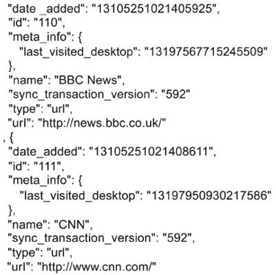

图 9.1：JSON BBC 书签

在这里，我们可以看到以下字段：

+   添加日期

+   上次访问的桌面

+   书签的名称

+   URL

但是，信息的呈现方式并不是很图形化。另一种方法是使用免费的文本查看器，如 Notepad++（可在[`notepad-plus-plus.org/`](https://notepad-plus-plus.org/)下载）和 JSON 插件。

这将使文件夹结构更易于阅读，如下图所示：

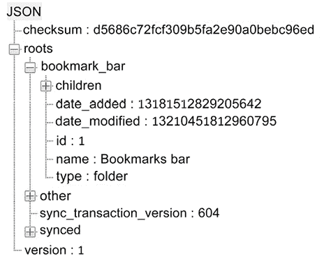

图 9.2：JSON 根文件夹

上图显示，根目录下有三个文件夹：`bookmark_bar`、`other` 和 `synced`。展开 `bookmark_bar` 文件夹时，显示出额外的 `children` 文件夹，如下图所示：

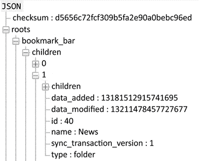

图 9.3：JSON 子文件夹

第一个文件夹仅用从零开始的数字标记。当我们展开 `1` 文件夹时，文件夹名称显示为 `News`，并附有添加和修改的日期/时间戳。当打开 `children` 文件夹时，可以查看书签，如下图所示：

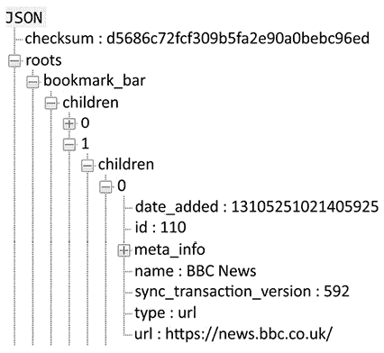

图 9.4：JSON 书签

日期/时间戳被编码在 Google Chrome 值中。要解码日期/时间戳，我喜欢使用开源工具 DCode（可在[`www.digital-detective.net/dcode/`](https://www.digital-detective.net/dcode/)下载）。DCode 也可以用于解密许多不同类型的日期/时间戳。

如下图所示，您可以看到工具已将 Google Chrome 值转换为更易读的格式：

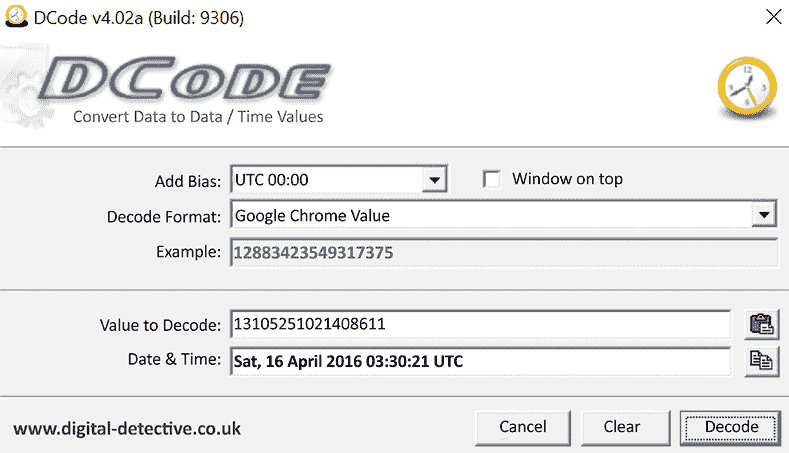

图 9.5：用于翻译 Google Chrome 值的 DCode 工具

BBC News 书签添加于 2016 年 4 月 16 日，星期六，03:30:21 UTC。

仅仅存在一个有罪的书签可能不足以采取行动。为了支持这一假设，用户访问了书签指示的网页；你可能还需要查看其他文物。一个这样的文物就是历史文件，我们接下来将进行检查。

### 理解 Chrome 历史文件

Google Chrome 历史文件将位于以下路径：

```
%USERS%/AppData/Local/Google/Chrome/User Data/ 
```

该文件将没有文件扩展名，并且是一个 SQLite 数据库。大多数取证工具会查看数据库的内容。历史数据库包含大量关于用户活动的信息：

+   下载：

    这将包括已下载文件的保存路径、下载来源的位置、下载的开始/停止时间以及下载文件的大小。

+   关键词搜索会跟踪用户通过 URL 地址栏输入的搜索词。

+   输入的 URL 将跟踪用户在地址栏中输入的 URL。

+   历史：

这将跟踪用户访问的 URL、访问该 URL 的次数以及访问时间。

在查看历史文件时，以下文本描述了用户的活动：


图 9.6：用户的 Chrome 历史

用户下载了一个名为`Thunderbird Setup 68.0.exe`的文件，并将其保存在`IEUser`的`Downloads`文件夹中。我们还知道下载开始的时间是 16:14:38 UTC，并且知道下载在 16:14:40 UTC 完成。


图 9.7：用户的搜索历史

用户还进行了两个关键词搜索，具体如下：

用户搜索了`Gmail`和`Thunderbird`这两个词。搜索使用了 Google 搜索引擎，首先搜索了`Gmail`。该搜索发生在 2019 年 8 月 28 日，而`Thunderbird`的搜索发生在 2019 年 8 月 29 日。（我已删除部分 URL 以帮助格式化。）

以下是用户访问的网页列表：

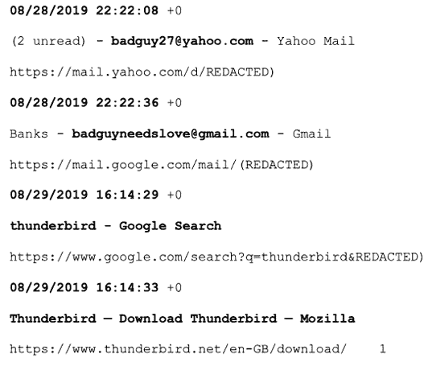

图 9.8：用户的互联网历史

从历史文件中，我们可以看到用户搜索了**Thunderbird**这个词，随后几秒钟，用户访问了 Thunderbird 下载页面。在用户搜索**Thunderbird**之前，用户访问了两个不同的基于 Web 的邮箱账户。此外，我们还可以看到用户前一天晚上访问了 Yahoo 邮件和 Gmail。基于这一分析，我们已确定用户可能正在使用或至少可以访问的不同电子邮件地址。

接下来，关于浏览器文物，我们要讨论的是 Cookies。

### Cookies

Cookie 是由网站创建并存储在用户系统上的数据集。Cookies 旨在跟踪用户的活动，例如将商品添加到购物车或记录用户访问的页面数量。需要注意的是，仅仅因为系统中存在 Cookie，并不意味着用户知情地访问了该网站。你需要寻找其他证据来支持用户活动的证据。

Google Chrome 的 Cookie 文件可以在以下路径找到：

```
%USERS%/AppData/Local/Google/Chrome/User Data/Default 
```

该文件没有文件扩展名，且它是一个 SQLite 数据库。大多数取证工具都能查看该数据库的内容。以下截图是 X-Ways Forensics 的输出：


图 9.9：Cookies

虽然数据是可读的，但格式上仍有许多不尽如人意之处。一个第三方应用程序 Chrome Cookies View（可通过 [`www.nirsoft.net/utils/chrome_cookies_view.html`](http://www.nirsoft.net/utils/chrome_cookies_view.html) 获取）将以更易读的格式解析数据，以下截图显示了该格式：


图 9.10：Cookie 视图

现在，列和数据已正确排列和格式化。该工具还将日期/时间戳从 Google Chrome 时间转换为 UTC 时间。Cookies 是跟踪用户活动的一部分，但缓存中也可能包含对你的调查有用的证据。

### 缓存

我们在*第八章*，“*电子邮件取证 – 调查技巧*”中讨论了缓存，仍然存在同样的问题，即当我们检查内容时，很难解读。现在有一个第三方工具，名为 Chrome Cache View（可通过 [www.nirsoft.net/utils/chrome_cache_view.html](https://www.nirsoft.net/utils/chrome_cache_view.html) 获取），它可以将数据转换为可读格式。以下截图是你可能看到的输出示例：


图 9.11：缓存视图

当你选择感兴趣的项目时，Chrome Cache View 允许你将信息导出为更容易阅读的格式，如下所示：

```
Filename          : gmail.html 
URL               : https://www.google.com/gmail 
Content Type      : text/html 
File Size         : 0 
Last Accessed     : 8/28/2019 15:17 
Server Time       : 8/28/2019 15:17 
Server Last Modified: 
Expire Time       : 
Server Name       : sffe 
Server Response   : HTTP/1.1 302 
Content Encoding  : 
Cache Name        : 
Cache Control     : private 
ETag              : 
Server IP Address : 172.217.14.100 
URL Length        : 28 ================================================== 
```

这更容易阅读和理解。你看到的仍然是相同的信息，只是呈现方式要好得多。

你可以看到文件名和访问网页的日期/时间。比较有趣的是服务器的 IP 地址。如果你在缓存中找到数据，例如非法图像，这可能会引导你找到托管原始图像的服务器。

现在，我们将讨论密码及其如何在 Chrome 浏览器中存储。

### 密码

密码可能是解锁不同文件或加密的关键。大多数用户会在多个不同的账户中重复使用相同的密码。恢复用户以前使用的密码，可以为你提供大量的信息。Chrome 提供了一个保存密码的选项。

你会在`Logon Data`文件中找到密码信息，文件路径如下：

```
%USERS%/AppData/Local/Google/Chrome/User Data/Default 
```

该文件没有文件扩展名，是一个 SQLite 数据库。它不包含用户账户的实际密码；而是存储每个账户的信息，这些信息用于加密密码。有一个第三方工具，Chrome Pass（可通过[`www.nirsoft.net/utils/chromepass.html`](https://www.nirsoft.net/utils/chromepass.html)获取），它可以解密密码。

Google Chrome 浏览器是当前使用的头号浏览器。你可能会在用户系统上遇到多个浏览器。接下来我们要谈论的浏览器是 Internet Explorer，它是 Microsoft Windows 操作系统的默认浏览器。

## 探索 Internet Explorer/Microsoft Edge（旧版）

Internet Explorer 是 Microsoft Windows 操作系统的网页浏览器。自 1995 年以来，Microsoft 就将该浏览器与 Windows 操作系统一起发布。Internet Explorer 在 1990 年代是市场上的头号浏览器，但随着 2004 年 Firefox 发布和 2008 年 Google Chrome 发布，它的受欢迎程度逐渐下降。Internet Explorer 仍然包含在 Windows 10 中，但已被 Microsoft Edge 取代。

以下痕迹是针对 Microsoft Edge 旧版的，因为当前版本是基于 Chromium 的。Chromium 版本将包含基于 Google Chrome 的痕迹。

基于 Chromium 的 Edge 浏览器的痕迹默认位置是：

```
C:\Users\%USER%\AppData\Local\Microsoft\Edge\User Data\Default 
```

你会发现一些典型的基于 Chromium 的浏览器的痕迹，例如收藏夹（JSON 文件）、缓存文件（Index、Datablock 和 Data 文件）、cookies（SQLite 数据库）以及历史记录（SQLite 数据库）。接下来，让我们深入了解你可能从用户在 Internet Explorer Edge（旧版）浏览器中的活动中恢复的痕迹。

### 收藏夹

与 Google Chrome 浏览器不同，Internet Explorer 将收藏夹保存为 URL 格式。Internet Explorer 保存收藏夹的默认路径如下：

```
%USER%/Favorites 
```

所有的商业和开源取证工具都可以读取 URL 格式。下图展示了你可能会看到的典型数据结构：


图 9.12：IE 收藏夹

在检查存储在`Favorites`文件夹中的收藏夹时，你还可以查看创建和修改的时间戳。这些时间戳是 URL 文件创建/修改的日期/时间。

当你检查 URL 文件时，可能会发现以下内容：

```
[DEFAULT]
BASEURL=http://christensminischnauzers.com/
{000214A0-0000-0000-C000-000000000046}
Prop3=19,2 
[InternetShortcut]
URL=http://christensminischnauzers.com/IDList= 
```

如你所见，它包含了 URL，这在网站涉及走私或用户活动时特别重要，这也支持你关于正在调查的事件的假设。

接下来，我们将检查用户的历史记录，看看是否能找到一些有趣的痕迹。

### IE 历史记录

Internet Explorer 会跟踪用户的活动 20 天。这是默认设置，用户可以更改。如我们在*第六章*、*Windows 证据分析*中讨论的那样，Internet Explorer 还会在操作系统中跟踪一些用户活动。Internet Explorer 是 Windows 操作系统的一个重要组成部分，即使用户偏好使用其他浏览器，Internet Explorer 的历史记录中仍然可能有值得关注的证据。

Edge 和 Internet Explorer 10 及更高版本使用名为 `WebCacheV01.dat` 的 ESE 数据库，可以在以下路径找到：

```
%User%\AppData\Local\Microsoft\Windows\WebCache 
```

要分析 `WebCacheV01.dat` 文件，我们将使用 `ESEDatabaseView`（我们在*第六章*、*Windows 证据分析*中首次使用它）。从取证镜像中导出数据库进行分析。

您要查看的第一张表是 `Containers` 表，您应该会看到类似于以下截图的内容：

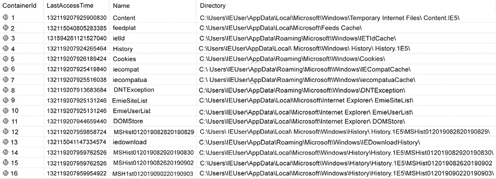

图 9.13：ESE 数据库显示的 Containers 表

数据库中有 16 张表，感兴趣的容器是表 `12`、`14`、`15` 和 `16`。从表名来看，它们以 `MSHist01` 开头，后面跟着数字。

数字告诉我们历史文件是每日文件还是每周文件。在下图中，您可以看到表名的详细分解：

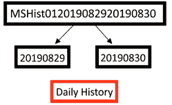

图 9.14：每日历史文件夹命名约定

该名称包含历史记录所涵盖的时间段。如上图所示，它包含的数据从 2019 年 8 月 29 日到 2019 年 8 月 30 日。在下图中，我们可以看到每周时间框架的分解：


图 9.15：每周历史命名约定

该数据涵盖的时间段为 2019 年 8 月 26 日至 2019 年 9 月 2 日。

对于 `MSHist01` 文件，`Directory` 字段下显示的文件路径是为了兼容旧版设置。如果按照该路径访问，您会找到一个名为 `container.dat` 的文件，但该文件不包含任何信息。

**注意**

对于其余条目，文件路径将包含与特定表相关的数据，可能与您的调查有关。

让我们查看表 `12` 的内容，如下图所示：


图 9.16：表 12 的内容

表 `12` 是每日历史文件，显示该日的五条记录。查看 URL 时，它并没有显示为互联网历史，而是显示了用户使用文件资源管理器访问的文件。用户访问了 `Windows Mail` 文件夹和 `Download` 文件夹。路径的末尾列出了具体的文件名。

日期和时间值是 Windows 64 位（大端）十六进制的十进制转换值。

要转换这些值，您需要执行以下操作：

+   获取十进制数字，`132115734791679663`

+   将其转换为十六进制，`1D5 5E8F 917F 6EAF`

接下来，您需要使用 DCode 获取日期/时间戳：


图 9.17：使用 DCode 工具转换 Windows 时间值

我们有用户的历史记录，但这是否表明用户自愿且知情地访问了历史记录中列出的网站？是否可能有些历史记录包含用户从未访问过的网站的引用？这些问题的答案是肯定的。通过弹窗和广告，历史文件中可能存在用户从未访问过的站点的引用。

为了帮助展示用户的意图，我们希望看到一个明确显示用户操作的遗留物。这就是我们接下来要讨论的——输入的 URL。

### 输入的 URL

当用户在地址栏中输入 URL 时，系统会在用户的 `NTUSER.dat` 文件中创建一个记录。以下输出来自 `RegRipper`：

```
TypedURLs 
Software\Microsoft\Internet Explorer\TypedURLs 
LastWrite Time Tue Sep 3 17:29:58 2019 (UTC)  
url1 -> http://bankrobbery.com/  
url2 -> http://yahoo.com/  
url3 -> http://gmail.com/ 
```

最近输入的 URL 是 `url1`。系统只会列出每个 URL 一次。如果用户输入相同的 URL，系统会将该 URL 移到列表顶部，成为最新的 URL。使用 Internet Explorer 10 版本时，最大 URL 数量为 50。

有一个用于输入 URL 时间的注册表项；请参见以下截图中的 `TypedUrlTime`：


图 9.18：TypedURLsTime 注册表项

URL 编号与输入的 URL 对应。十六进制值采用 Windows 文件时间格式；它表示用户在地址栏中输入 URL 的日期和时间。

另一个信息来源是缓存，我们接下来将讨论它。

### 缓存

我们在 *IE 历史* 部分分析的 `WebCacheV01.dat` 文件也处理缓存文件。您可以使用 `ESEDatabaseViewer` 来分析该数据库，但您还可以使用另一个工具——Internet Explorer Cache Viewer（可通过 [`www.nirsoft.net/utils/ie_cache_viewer.html`](https://www.nirsoft.net/utils/ie_cache_viewer.html) 获取）。

以下截图（缓存视图）显示了查看器的输出：


图 9.19：缓存视图的输出

该工具将为您提供文件名和文件来源的 URL，以及日期/时间戳。系统会将这些文件存储在以下路径：

+   对于基于 Windows 7 的系统：

    ```
    %USER%/AppData/Local/Microsoft/Windows/Temporary Internet Files\Content.IE5 
    ```

    ```
    Temporary Internet Files
    ├──Content.IE5
    │  ├──OPDYBC4P
    │  ├──S97WTYG7
    │  ├──Q67FIXJT
    │  ├──4MNQZMD8
    │  ├──SCD1EGFC
    │  ├──34UZLM61
    │  ├──V2I5AL1G
    │  └──5S4OGUTD 
    ```

+   对于基于 Windows 8/10 的系统：

    ```
    %USERS%/AppData/LocalLow/Microsoft/Windows/AppCache 
    ```

    ```
    Windows 
       └──AppCache 
          └──0Z1ZMDEH 
    ```

    ```
    %USERS%/AppData/Local/Microsoft/Windows/INetCache/IE 
    ```

    ```
    INetCache 
    │  ├──Low 
    │  │  ├──IE 
    │  │  │  ├──4TENJ512 
    │  │  │  ├──9SKPYC9A 
    │  │  │  ├──QMIGA2MM 
    │  │  │  └──EP19S3JV 
    ```

+   对于 Microsoft Edge 浏览器：

    ```
    %USER%/AppData/Local/Packages/Microsoft.MicrosoftEdge_8wekyb3d8bbwe/AC 
    ```

    ```
    MicrosoftEdge 
    │  │  ├
    │  │  ├──Cache 
    │  │  │  ├──9CG3K1S3 
    │  │  │  ├──IHCXX8UB 
    │  │  │  ├──OOW222LO 
    │  │  │  └──CENY1YGT 
    ```

系统会随机生成子目录的命名，使用字母数字字符。

我们接下来要讨论的一个遗留物是 cookies。

### Cookies

Edge 和 Internet Explorer 会将 cookie 文件保存为简单的文本文件。`WebCacheV01.dat` 也会跟踪 cookie 文件，如下图所示：


图 9.20：容器表的内容

表格 `5` 包含关于 cookie 的信息，并在下方截图中显示：


图 9.21：Cookies 表格的内容

就像我们检查历史记录时一样，日期/时间戳是 Windows 文件时间的十六进制转换的十进制数值。它还包含 URL 和存储在系统上的文件名。

Cookie 文件存储在以下路径：

+   对于 Internet Explorer：

    ```
    %USER%/AppData/Roaming/Microsoft/Windows/Cookies/ 
    ```

+   对于 Microsoft Edge：

    ```
    %USER%/AppData/Local/Packages/Microsoft.MicrosoftEdge_8wekyb3d8bbwe/AC/MicrosoftEdge/Cookies 
    ```

当我们查看文件夹内容时，我们发现里面充满了文本文件，文件名是 Windows 使用的随机字母数字字符格式。以下输出是你可能会发现的典型内容：

```
Name              Created                    Modified 
06PC9CZM.txt    09/03/2019  17:29:48    09/03/2019  17:29:48 
09BHTXJM.txt    09/02/2019  18:00:59    09/02/2019  18:00:59 
09WSNIHD.txt    09/03/2019  17:29:27    09/03/2019  17:29:27 
0W6YLVUJ.txt    09/02/2019  18:01:08    09/02/2019  18:01:08 
0WBQAB4E.txt    09/02/2019  18:23:51    09/02/2019  18:23:51 
16SUYNBJ.txt    09/03/2019  17:29:51    09/03/2019  17:29:51 
1983DVP6.txt    09/02/2019  18:23:46    09/02/2019  18:23:46 
28Z2GM8G.txt    09/03/2019  17:29:49    09/03/2019  17:29:49 
2CM18GNC.txt    09/03/2019  17:29:38    09/03/2019  17:29:38 
```

为了进行有效分析，你需要处理 `WebCacheV01.dat` 文件，以确定每个数据库条目关联的 cookie 文件。

以下是一个 cookie 文本文件的示例内容：

```
MR 
0 
c.msn.com/
1024 
3308281856 
30796639 
4095225949 
30760429 
```

这个 cookie 来自 MSN 网站，正如我们之前讨论的，它会追踪用户的访问以及在访问时可能启用的任何偏好设置。

检查浏览器的 cookie 永远不会是决定性的证据，但你可以用它来支持你关于调查过程中发生事件的假设。

## 探索 Firefox

Firefox 是由 Mozilla 基金会开发的开源浏览器。Mozilla 在 2004 年发布了 Firefox，它是你在调查过程中可能会遇到的浏览器。我们将介绍一些你在检查中可能会遇到的常见证据。

### 配置文件

Firefox 提供的一个功能是使用多个配置文件。用户可以选择为浏览器创建多个配置文件，以便隔离他们的活动。你可以找到配置文件的路径如下：

```
%USER%/AppData/Local/Mozilla/Firefox 
```

我发现了三个用户配置文件，它们如下所示：

```
Firefox 
└──Profiles 
   ├──tszci9zh.Badguy 
   │  ├──thumbnails 
   │  ├──safebrowsing 
   │  │  └──google4
   │  ├──startupCache 
   │  ├──cache2 
   │  │  ├──entries 
   │  │  └──doomed 
   │  └──OfflineCache 
```

这是 `Badguy` 配置文件：

```
 ├──fd8rnyou.BadGuy Needs Love 
   │  ├──startupCache 
   │  ├──cache2 
   │  │  ├──entries 
   │  │  └──doomed 
   │  ├──thumbnails 
   │  ├──safebrowsing 
   │  │  └──google4 
   │  └──OfflineCache 
```

该配置文件的用户是`BadGuy 需要爱`：

```
 ├──30nh3g6c.default-release 
   │  ├──startupCache 
   │  ├──cache2 
   │  │  ├──doomed 
   │  │  └──entries 
   │  ├──thumbnails 
   │  ├──OfflineCache 
```

最后的配置文件是默认用户。

Firefox 创建配置文件时，会使用一个随机字母数字的八位前缀，后跟用户名。如果用户没有创建任何额外的配置文件，你将只看到 default-release 和默认用户名。这里，用户创建了两个额外的配置文件：

+   `Badguy`

+   `Badguy 需要爱`

在每个文件夹结构中，Firefox 会保存与每个配置文件相关的数据。

还有一个 `profiles.ini` 文件，位于以下路径：

```
%USER%/AppData/Roaming/Mozilla/Firefox/profiles.ini 
```

`profile.ini` 文件的内容如下：

```
[Install308046B0AF4A39CB]
Default=Profiles/fd8rnyou.Badguy Needs Love
Locked=1
[Profile2]
Name=Badguy
IsRelative=1
Path=Profiles/tszci9zh.Badguy
Default=1
[Profile1]
Name=default
IsRelative=1
Path=Profiles/9wofgs9f.default
[Profile0]
Name=default-release
IsRelative=1
Path=Profiles/30nh3g6c.default-release
[General]
Startwithlastprofile=1
Version=2
[Profile3]
Name=Badguy Needs Love
IsRelative=1
Path=Profiles/fd8rnyou.Badguy Needs Love 
```

`Startwithlastprofile` 字段显示应用程序启动时将使用哪个配置文件。这里显示的是 `BadGuy` 配置文件是默认配置文件。

我们现在继续查看缓存。

### 缓存

Firefox 会将缓存文件存储在每个配置文件下。文件路径将保持不变，正如我们在前一部分中讨论的那样：

```
%USER%/AppData/Local/Mozilla/Firefox/Profiles/%Profile% 
```

```
Firefox 
└──Profiles 
   ├──tszci9zh.Badguy 
   │  ├──thumbnails 
   │  ├──safebrowsing 
   │  │  └──google4
   │  ├──startupCache 
   │  ├──cache2 
   │  │  ├──entries 
   │  │  └──doomed 
   │  └──OfflineCache 
```

Firefox 会将缓存存储在 `cache2` 配置文件中。你可以使用开源应用程序 `MZcacheview`（可以在[`www.nirsoft.net/utils/mozilla_cache_viewer.html`](https://www.nirsoft.net/utils/mozilla_cache_viewer.html)下载）查看内容。结果与我们之前在其他浏览器中看到的非常相似。

### Cookies

与 Internet Explorer 不同，Firefox 不会将浏览器的 Cookies 存储在单个文件中。Firefox 使用 SQLite 数据库来存储这些信息。你可以在以下路径找到 Cookies 数据库：

```
%USER%/AppData/Roaming/Mozilla/Firefox/Profiles/%Profile% 
```

注意路径的变化。现在我们不再存储在`Local`文件夹中，而是存储在`Roaming`文件夹中。

你可以使用第三方开源应用程序 MZCookiesView（可以在[`www.nirsoft.net/utils/mzcv.html`](https://www.nirsoft.net/utils/mzcv.html)下载）查看文件，或者使用任何 SQLite 数据库读取器。

接下来我们将讨论的物品是历史记录文件。

### 历史记录

Mozilla Firefox 在名为 `places.sqlite` 的 SQLite 数据库文件中跟踪浏览器历史记录。Firefox 还会在该数据库中记录用户输入的网址。你可以使用任何 SQLite 数据库工具读取该文件，或者使用第三方开源工具 MZHistoryView（可以在[`www.nirsoft.net/utils/mozilla_history_view.html`](https://www.nirsoft.net/utils/mozilla_history_view.html)下载）。你可以在以下路径找到历史数据库：

```
%USER%/AppData/Roaming/Mozilla/Firefox/Profiles/%Profile% 
```

以下截图显示了使用该工具时通常会看到的输出：


图 9.22：Firefox 历史记录显示在 MZHistoryView 中

**注意**

前面的 Firefox 历史文件截图只显示了几条记录。如果这是一次真实的调查，根据用户使用 Firefox 浏览器的时间长短，你可能会在历史记录文件中找到成千上万的记录。

第三条记录中显示了一个输入的网址。如果你双击该条目，将会弹出 `属性` 窗口，如下图所示：

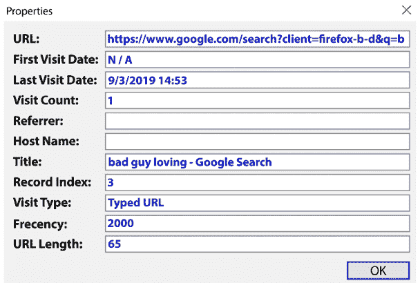

图 9.23：输入的网址显示在第 3 条记录中

从前面的截图中，我们可以判断用户在 2019 年 9 月 3 日搜索了`bad guy loving`这一短语。

密码将是我们接下来讨论的物品。

### 密码

Mozilla Firefox 为用户提供了保存密码的机会。Firefox 使用两个文件，`key#.db`（我见过名为 `key3` 和 `key4` 的文件；需要注意你可能会遇到其他编号的文件）和 `logins.json`，以加密格式存储密码。我们可以使用开源第三方工具 Password Fox（可以在[`www.nirsoft.net/utils/passwordfox.html`](https://www.nirsoft.net/utils/passwordfox.html)下载）解码密码。

你可以在以下路径找到这些文件：

```
%USER%/AppData/Roaming/Mozilla/Firefox/Profiles/%Profile% 
```

在下图中，你可以看到 Password Fox 的典型输出：


图 9.24：在 PasswordFox 中显示的密码

我已在以下截图中删除了密码，但当您获得用户的密码和账户（当然需要适当的授权）时，这是非常有益的。如果您双击记录，它将打开`属性`窗口，如下图所示，显示密码属性：

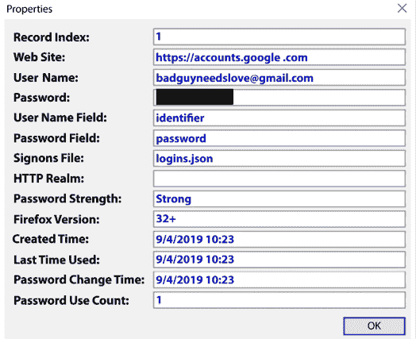

图 9.25：在 PasswordFox 中的密码属性

在我们分析内容时，似乎这是用户的 Gmail 账户，并且我们有密码创建、修改和使用的日期/时间戳。

### 书签

Mozilla Firefox 将用户的书签保存在 SQLite 数据库文件中。您可以在以下路径找到数据库文件：

```
%USER%/AppData/Roaming/Mozilla/Firefox/Profiles/%Profile% 
```

您可以使用第三方开源工具 FavoritesView（可在[`www.nirsoft.net/utils/faview.html`](https://www.nirsoft.net/utils/faview.html)下载）来执行此操作。

以下截图显示了 FavoritesView 应用程序的输出：


图 9.26：在 FavoritesView 中显示的收藏夹

您可以看到 Firefox 浏览器默认的书签。最后三项是用户添加的书签。我们有一个关于`bad boys`的 Google 搜索，一个参考演员威尔·史密斯和马丁·劳伦斯的网页，最后一个是音乐团体 Inner Circle 的 YouTube 视频《Bad Boys》。

这就是我们对浏览器分析的总结。在下一部分，我们将开始查看社交媒体。

# 社交媒体

什么是社交媒体？社交媒体是通过虚拟社区在全球互联网中使用应用程序或程序来创建和分享信息、表达形式、意见、思想等。用户可以通过基于网络的技术，如移动设备应用程序，访问社交媒体。在某些情况下，用户可以将数据从一个平台同步到另一个平台。这些平台/应用程序很少要求用户支付费用，且非常易于使用。

虽然大多数社交媒体用户按照服务提供商的意图使用这些服务，但有些人却将这些新的通信媒介用于不良目的。在调查中，几乎没有社交媒体不发挥作用的情况。

用户的社交媒体交流为调查人员提供了一条数字线索，调查人员可以根据这些线索追踪。调查人员有时能够确定用户在事件发生时的日期/时间位置。或者，他们可能会找到嫌疑人与受害人之间的通信，这些通信导致了正在调查的事件。

作为一名数字取证调查员，你必须意识到社交媒体的存在以及数字证据中可能存在的潜在痕迹。搜索社交媒体时的一个重大挑战是，大多数社交媒体痕迹不会被保存到用户系统中。

这些应用将数据存储在服务提供商的云端，简单来说就是数据会存储在服务提供商的服务器上。

由于社交媒体应用的种类繁多且数量庞大，因此没有一份简单的检查清单可以涵盖所有情况。数字取证调查员在处理新的社交媒体技术或变化中的社交媒体技术时，必须灵活运用调查技巧。

本节的目标是让你熟悉一些当前的社交媒体应用，并为你的调查提供一个大致的计划。请记住，在进行社交媒体分析时，你可能有两个地方可以找到与你的调查相关的数字证据：用户系统和服务提供商。不要忽视向服务提供商送达适当的司法文书；通常情况下，他们会向你提供关于你的调查的广泛信息。

特定社交媒体的流行程度随着用户群体的变化而波动。一些年轻用户不愿与朋友一起使用 Facebook，因为他们的父母和祖父母也使用 Facebook。有些社交媒体应用可能会限制特定的地理位置；例如，KaKaoTalk 在韩国非常流行，但在美国的用户非常少。以下是一些你在调查中可能遇到的流行社交媒体应用的简短描述：

+   Facebook：最广泛的社交媒体应用，拥有近 20 亿用户。它将商业广告商和消费者用户的内容结合起来，使用起来非常简单。用户可以上传图像、录制视频、直播视频，并通过消息应用进行语音/视频/文本聊天。

+   Instagram：一种照片和视频共享社交媒体应用。用户可以分享照片、录制的视频和直播视频。用户还可以通过应用与其他用户聊天和评论。

+   Snapchat：一种视频/照片共享社交媒体应用。最初，当用户发送“快照”后，接收者查看完图像后，图像会从系统中删除。现在，用户可以选择保存“快照”。

+   Twitter：一种用于新闻、政治、体育、娱乐等的社交媒体应用。Twitter 允许最多 280 个字符的推文，较长的推文会通过后续消息链接呈现。

+   WhatsApp：一种允许用户进行语音/视频聊天的消息应用。

+   Tinder：一种基于位置的社交媒体应用，用作约会服务。用户可以“向右滑”或“向左滑”喜欢/不喜欢的个人资料。如果双方都“喜欢”对方，那么他们可以通过应用聊天。

+   GroupMe：这是一款群组消息应用。用户可以使用手机号码、Facebook 或 Twitter 账户登录该应用。用户可以分享照片、视频、位置和文本。

+   Kik：一款即时消息社交媒体应用。该服务提供商总部位于加拿大。它允许个人之间进行匿名通信。用户可以分享文本、照片和视频。据估计，美国约有 40% 的青少年使用该应用。Kik 于 2019 年被 MediaLab 收购。

+   Tumblr：一款博客/社交网络应用。用户可以将图片/视频发布到博客页面。

+   Reddit：这是一个新闻聚合和讨论型社交媒体应用。它涵盖了几乎所有可以想象的主题，包括非法活动。在 2019 年 7 月，它是美国访问量排名第五的网站。

+   TikTok：一款基于视频的社交网络应用。用户可以发布视频并进行“直播”活动。TikTok 在 2020 年是增长最快的第三大社交媒体品牌。

这不是你可能遇到的所有社交媒体应用的完整列表，也不是我会试图创建这样一个列表。随着技术的发展以及用户选择的增加，新的社交媒体应用将不断涌现。作为一名数字取证调查员，你不可能了解社交媒体应用的所有方面。你需要了解当前使用哪些社交媒体应用以及消费者和罪犯如何使用它们。有些社交媒体应用可能无法通过本地服务器访问；服务提供商将限制其仅限于移动设备。那么你如何确定你调查的对象是否正在使用社交媒体平台呢？网页浏览器历史记录将是必不可少的；他们可能通过网页浏览器或用户与服务提供商之间的电子邮件通信访问他们的个人资料/账户。你可能遇到的其中一个更受欢迎的社交媒体应用是 Facebook。

## Facebook

Facebook 是一个用户可以通过网络浏览器访问的社交媒体平台。分析这些数据可能会让你得到用户名或 Facebook 用户 ID。假设你分析了一个网址，如下所示：

[`www.facebook.com/photo.php?fbid=10215539711464494&set=a.1627301761019&type=3&source=11&referrer_profile_id=1190817474`](https://www.facebook.com/photo.php?fbid=10215539711464494&set=a.1627301761019&type=3&source=11&referrer_profile_id=1190817474)

当你查看网址时，相关于我们组织的部分是个人资料 ID，如下所示：

```
profile_id=1190817474 
```

当你在`Facebook.com`的末尾添加数字时，它会将你带到用户的 Facebook 页面。个人资料 ID 是一个唯一的数字，它会将你重定向到用户的 Facebook 用户名，如下图所示：


图 9.27：Facebook URL

一旦你获得了用户的 Facebook 个人资料 ID 号码和用户名，这些信息可以作为司法文书的一部分提供给服务提供商，用于访问存储在服务提供商服务器上的内容。

你还可以使用 Bulk Extractor 工具（我们在*第七章*《*RAM 内存取证分析*》中讨论过）。当你运行 Bulk Extractor 时，它也会找到个人资料 ID 号码，如下图所示：

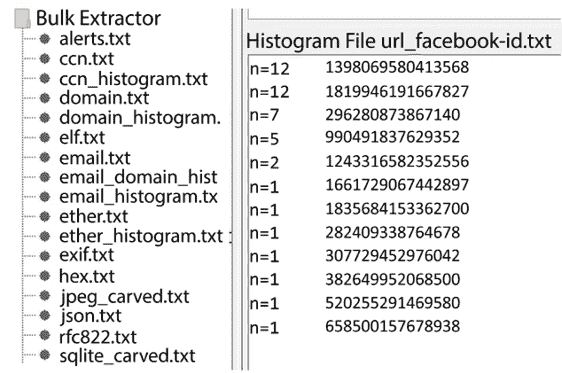

图 9.28：Facebook 的 Bulk Extractor 输出

你可以使用 Bulk Extractor 对取证镜像或捕获的内存文件进行处理，以查找与社交媒体相关的证据。另一个你可能遇到的非常流行的社交媒体应用是 Twitter。

## Twitter

我们可以从域名直方图中过滤结果，如下图所示。在这里，我们可以看到用户访问了 Twitter 网页：


图 9.29：Twitter 的 Bulk Extractor 输出

Twitter 用户在注册时会有一个“用户名”和一个 UID（用户 ID）。用户可以随时更改他们的用户名，但 UID 将保持不变。如果我们有一个用户名为`@badguyneedslove`的用户，然后他们将其更改为`@badguy27`，UID 将保持不变。

在取证镜像中搜索术语`twid`可以识别该账户的 UID。你还可以拿到用户的 Twitter 用户名并使用以下网站：[`gettwitterid.com`](http://gettwitterid.com)。

当你输入 Twitter 用户名时，它将提供 UID，具体如下图所示：

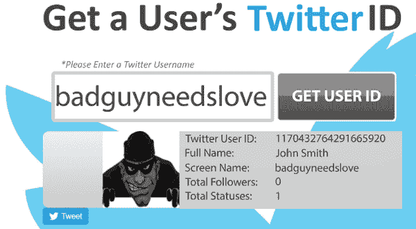

图 9.30：Twitter ID

我们输入了 Twitter 用户名`badguyneedslove`，它为我们提供了 Twitter ID `1170432764291665920`，以及用户的全名（可能准确也可能不准确；请记住这是用户提供的信息）。

你调查所需的所有信息并不一定都能在用户的设备上找到；你可能需要联系服务提供商以获取存储在其服务器上的信息。

## 服务提供商

你调查所需的许多信息将由服务提供商保管。他们将拥有订阅者信息，如姓名、地址、年龄、使用日期/时间和 IP 地址。这些内容存储在服务提供商的服务器上。被扣押的计算机系统或移动设备可能不会包含你在调查中需要的所有信息。请向服务提供商提交适当的司法文书以获取该信息。司法框架将依据服务提供商所在的地区而有所不同。你需要满足该地区司法系统的所有要求。

[Search.org](https://Search.org) 维护一个服务提供商列表和法律部门的联系信息，法律部门会接收完成的司法文件。一些服务提供商也在他们的网站上提供该信息。例如，服务提供商 Kik 创建了一个特定的网页（位于 [`web.archive.org/web/20201224090043/https://lawenforcement.kik.com/hc/en-us`](https://web.archive.org/web/20201224090043/https://lawenforcement.kik.com/hc/en-us)），其中包含调查人员所需的所有信息，以便向他们递交额外的文件。

调查用户在社交媒体上的活动可能会很困难。你可能需要使用第三方软件，或者手动解析存储设备上的十六进制数据。即便付出所有这些努力，最终可能还得依赖于服务提供商的保存政策，才能获得你需要的信息，以使调查成功。互联网的另一个可能被犯罪利用的方面是 P2P 文件共享，这是我们接下来的话题。

# P2P 文件共享

P2P 文件共享允许用户与 P2P 社区中的其他人共享文件。用户会与社区分享视频或音乐文件，但你几乎可以找到任何你能想象的文件类型。P2P 既有合法的用途，也有不合法的用途，具体取决于用户的搜索标准。这是一种广泛用于与其他 P2P 社区用户分享非法图像和视频的方式。用户可以选择多个 P2P 应用程序。我无法详细分析所有潜在的 P2P 应用程序，但我们会讨论一些你在调查中可能遇到的更常见的 P2P 应用程序。

P2P 应用程序允许用户成为网络中的一个节点。当用户安装应用程序时，他们可以指定想要在 P2P 网络上共享的文件/文件夹。然后，应用程序会创建一个共享文件/文件夹的索引，供 P2P 网络共享。当用户搜索 P2P 网络并找到他们想要下载的文件时，应用程序会识别出所有拥有该文件的节点。接着，应用程序会连接到这些节点，并开始从所有可用的节点下载文件片段。

当 P2P 应用程序共享文件/文件夹时，它会跟踪文件名和文件类型，并为文件创建 SHA-1 哈希值。这将是商业和开源取证工具使用的 SHA-1 哈希值的变体。P2P 版的 SHA-1 使用 Base32 编号系统创建哈希值，而取证工具使用 Base16 编号系统。Base16 编号系统使用字母数字字符 0–9 和 A–F，而 Base32 编号系统使用字母数字字符 A–Z 和 2–7。Chris Hurst 发布了如何使用 Python 将 Base32 值转换为 Base16（可在[`github.com/qbittorrent/qBittorrent/wiki/How-to-convert-base32-to-base16-info-hashes`](https://github.com/qbittorrent/qBittorrent/wiki/How-to-convert-base32-to-base16-info-hashes)查看）。

以下是 Chris Hurst 提供的 Python 代码：

```
>>> import base64 
>>> b32Hash = "WRN7ZT6NKMA6SSXYKAFRUGDDIFJUNKI2"
>>> b16Hash = base64.b16encode(base64.b32decode(b32Hash))
>>> b16Hash = b16Hash.lower()
>>> print (b16Hash) 
```

在数字取证领域工作一段时间后，您将了解到，您可能发现的痕迹取决于操作系统、P2P 应用程序以及用户是否修改了任何默认设置。

我们现在将调查一些您在数字取证调查中可能遇到的常见 P2P 应用程序。

## Ares

Ares Galaxy 是一个开源 P2P 应用程序，利用去中心化网络配置（可在[`sourceforge.net/projects/aresgalaxy/`](https://sourceforge.net/projects/aresgalaxy/)获取）。Ares 会在用户的本地配置文件路径中创建条目，如下所示：

```
%USER%\AppData\Local\Ares\ 
```

在`Data`文件夹中，您将找到两个文件，`ShareH.net`和`ShareL.dat`。这些文件跟踪文件名、哈希值、文件下载的日期/时间戳以及文件的共享状态。这些文件已加密，但可以使用 Magnet Forensics AXIOM 取证工具解密（可在[`www.magnetforensics.com`](https://www.magnetforensics.com)获取）。

Ares 会在用户的`NTUSER.dat`文件中创建条目，如下所示：

```
\ntuser (ROOT)\Software\Ares 
```

当我们对`NTUSER.dat`文件运行`RegRipper`时，我们得到如下输出：

```
Software\Ares 
LastWrite Time Sat Sep  7 21:48:04 2019 (UTC)
Stats.LstConnect: Mon Sep  8 15:51:07 2019 UTC 
Personal.Nickname: Badguy27 
General.Language: English 
PrivateMessage.AwayMessage: This is an automatic away message generated by Ares program, user isn't here now.
Search Terms: Badguy movies 
```

该应用程序存储最后一次连接应用程序的日期/时间戳、用户的昵称（这也可以是基于操作系统帐户用户名的自动生成字段），以及用户输入的最后 25 个搜索词。

根据用户安装的 Ares 版本，可能会更改`NTUSER.dat`文件中的`location/`信息。

## eMule

eMule 是一个开源 P2P 应用程序，利用去中心化网络配置，作为 eDonkey2000 的替代方案，于 2002 年发布（可在[www.emule-project.net](https://www.emule-project.net)获取）。当用户安装 eMule 时，它会创建一个`eMule`文件夹，包含两个子文件夹，`incoming`和`temp`，如下所示：

```
Downloads 
└──eMule 
   ├──Incoming 
   └──Temp 
```

在文件下载过程中，文件部分被存储在`temp`文件夹中，当所有部分都下载完毕后，完整的文件将被移动到`incoming`文件夹。这些文件夹默认是共享的，用户无法禁用它们。

eMule 将其配置文件存储在用户的本地配置文件中，如下所示：

```
%USER%\AppData\Local\eMule 
```

在`config`子目录中，您将找到`preferences.ini`文件。该文件包含用户的昵称以及`incoming`和`temp`目录的位置，如下所示：

```
AppVersion=0.50a 
Nick=http://emule-project.net 
IncomingDir=C:\Users\IEUser\Downloads\eMule\Incoming 
TempDir=C:\Users\IEUser\Downloads\eMule\Temp 
```

如果用户未指定昵称，默认昵称为 URL 邮箱，即`project.net`。

另一个值得关注的文件是`shareddir.dat`和`sharedfiles.dat`。`shareddir.dat`将包含用户创建的共享目录，如下所示：

```
%USER%\Downloads\ 
```

在此案例中，用户还在共享他们的`Downloads`文件夹。`sharedfiles.dat`文件将包含当前正在共享的文件列表。输出可能类似于以下所示：

```
C:\Users\IEUser\Downloads\aresregular246_installer.exe
C:\Users\IEUser\Downloads\bad-guy-pictures-145577-3671477.png
C:\Users\IEUser\Downloads\eMule0.50a-Installer.exe
C:\Users\IEUser\Downloads\Shareaza_2.7.10.2_x64.exe 
```

该文件指示用户正在共享三个可执行文件和一个 PNG 图片。

在`preferences.dat`文件中，您将找到分配给每个用户的唯一标识号。它是一个 16 字节的十六进制值，如以下截图所示：


图 9.31：eMule 用户 ID

用户标识号已高亮显示。另外，注意每个标识号的第 6 和第 15 个字节中，您会看到值`x/0E`和`x/6F`。

`AC_SearchStrings.dat`文件将存储用户输入的最后 30 个搜索词。在以下截图中，eMule 搜索词显示用户只搜索了术语`charlie chaplin`：


图 9.32：eMule 搜索词

`known.met`文件包含应用程序已下载的文件列表以及已共享的文件列表。您可能会发现一些文件名表示非法图像，这些图像已不再存在于用户的系统中。随着`.met`文件大小的增加，应用程序将删除条目，以防止文件过大。

在以下截图中，您可以看到`.met`文件的内容：


图 9.33：MetViewer

该文件将包含文件名、文件大小和文件共享的日期/时间戳，以及文件的哈希值。我使用了第三方开源取证工具 eMule MET Viewer（可以在[`www.gaijin.at/en/software/emulemetviewer`](https://www.gaijin.at/en/software/emulemetviewer)下载）。

我们将要查看的最后一个 P2P 应用程序是 Shareaza。

## Shareaza

Shareaza 是一款开源的 P2P 应用程序，利用了去中心化的网络配置，并于 2004 年发布（可以在[`shareaza.sourceforge.net/`](http://shareaza.sourceforge.net/)访问）。该应用程序将在用户的配置文件的`Local`和`Roaming`文件夹中创建一个名为`Shareaza`的文件夹。以下是您将在用户配置文件中看到的文件夹结构：

```
%USER%\AppData\Local\Shareaza
%USER%\AppData\Local\Shareaza\Incomplete
%USER%\AppData\Roaming\Shareaza
%USER%\AppData\Roaming\Shareaza\Collections
%USER%\AppData\Roaming\Shareaza\Data
%USER%\AppData\Roaming\Shareaza\Torrents 
```

在`Data`文件夹中，您会找到一个名为`Profile.xml`的文件，该文件包含用户创建的和应用程序创建的工件。用户可以完成个人信息，例如姓名、位置和性别，这些信息将被包含在 XML 文件中。

Shareaza 还会在用户的`NTUSER.dat`文件中创建条目。它将创建一个 Shareaza 键，并包含许多子键。在`Download`子键中，您将找到`CollectionPath`和`IncompletePath`条目。`CollectionPath`是已完成文件的存储位置；`IncompletePath`是存储未完成文件的位置。

在下面的截图中，我们可以看到以下条目：


图 9.34：Shareaza 路径

您还会在**Search**子键中找到用户输入的搜索词，如下图所示：


图 9.35：Shareaza 搜索

在`Data`文件夹中，有一个名为`Library1.dat`的文件，其中包含共享文件夹、共享文件以及部分下载文件的列表。还有一个适当命名为`Library2.dat`的文件备份，如果第一个文件损坏，它将被使用。

# 云计算

什么是云计算？它是远程存储吗？它是远程服务器吗？它是远程服务吗？以上所有问题的答案都是“是”。基于云的服务每天都在越来越多的企业和用户中流行起来。作为数字取证调查员，您必须了解云计算中可能存在的证据。我们在本章中已经讨论了一些关于云计算工件的内容。现在，我们将讨论云计算的其他不同方面。在进行数字取证调查时，您可能会遇到不同的云计算服务模型。它们如下：

+   **基础设施即服务** (**IaaS**)：远程基础设施提供给客户使用，而服务提供商保持对硬件的所有权和控制。客户只需为所需的硬件/服务付费，并且可以根据需要灵活增加/减少硬件要求。

+   **软件即服务** (**SaaS**)：通过网络向客户提供应用程序。客户支付订阅费用给供应商使用软件。内容和用户文件存储在服务提供商的服务器上，但可以与组织内的其他成员共享使用。

+   **平台即服务**（**PaaS**）：客户的操作系统通过云服务器提供给客户。用户可以安装自己的应用程序并维护软件的设置，而服务提供商负责硬件和操作系统的管理。客户负责其网络内的系统管理。

另一个需要考虑的是云资源的部署方式。共有四种选择：

+   **公有云**：一种云资源，向公众或特定组织成员提供。地方政府、大学或社区的某一部门可以提供公有云资源。

+   **私有云**：一种云资源，仅向特定成员提供。用户必须拥有特定权限才能访问该资源。例如，某个组织可能仅为员工维护一个私有云资源。

+   **社区云**：一种类似于私有云的云资源，用户由多个具有相似目标的组织组成。例如，某云服务提供商可能会限制对仅供多个执法机构使用的云资源的访问，仅限执法机构使用。

+   **混合云**：由两种或更多不同部署方式组成的云资源。

如你所见，云计算的使用可以直接影响你在本地系统上找到或未找到的工件。完全有可能在本地系统上找不到与你调查相关的任何工件，这就引出了一个问题，工件/证据在哪里？

这个问题的答案是：世界上任何地方。你可能在寻找的数据/工件可能存储在距离你一英里远的服务器上，也可能存储在几千英里外的其他司法管辖区内。调查硬件无法物理访问时，会给数字取证调查员带来重大问题。如果你是执法人员，且有搜查令，那么搜查令是否对存储在超出你管辖区范围的服务提供商的数据有效？对于企业调查员来说，搜查令不是一个选择，但如果数据存储在隐私期望与调查所在地不同的司法管辖区，访问数据时可能也会遇到问题。

在美国，这个问题一直争议到 2018 年，并将由美国最高法院决定。最终，问题在立法层面得以解决，国会澄清了《存储通信法》，并现在要求服务提供商提供请求的数据，无论信息“是否位于美国境内或境外。”

对于企业调查员，**服务级别协议**（**SLA**）应明确规定谁可以访问数据，并指明在进行数据采集时是否有任何限制。SLA 还应说明数据可能存储的位置，并解决数据存储在不同司法管辖区时如何解决法律冲突。

不同国家在隐私问题及刑事和/或民事程序方面提供不同的保护。一个司法管辖区内的犯罪行为，在存储数据的服务器所在的司法管辖区可能并不构成犯罪。在**欧盟**（**EU**）中，必须在访问欧盟公民的个人信息之前通知他们，并且必须获得他们的同意。

一旦你获得了进行数字取证调查所需的数据访问权限，你仍然需要遵循最佳证据处理实践。你可能会遇到保全链的问题；如何知道提供者是否使用了取证有效的方法来收集证据？你能验证该方法来证明他们收集了所有相关信息吗？你不希望对方在司法/行政程序中指控没有收集和呈交有利辩护的证据。

在进行数字取证调查时，有一些证据可以检查，以确定用户是否访问过任何基于云的应用程序。在本章中，我们讨论了 Web 浏览器的缓存，以及用户如果通过 Web 浏览器访问基于云的应用程序会发生什么。在*第六章*，*Windows 证据分析*中，我们讨论了检查预取文件。请记住，预取文件用于加速应用程序启动，并包含日期/时间戳，显示用户最后一次访问该资源的时间。

Dropbox 和 Google Drive 是消费者常用的两种基于云的存储选项。当用户安装 Dropbox 或 Google Drive 应用时，系统会创建一个文件夹，用户可以将数据同步到本地计算机和云端存储。当用户更改本地文件时，系统将更新云端存储中的文件。或者，用户可以通过基于 Web 的界面，使用共享或公共计算机上传/更改文件，系统将更新文件或上传到用户个人设备上的文件。

在使用 Dropbox 应用时，有两个数据库对数字取证调查员尤其重要：

+   `config.dbx`：包含用户 ID、账户邮箱地址、账户用户名和`dropbox`文件夹的路径。

+   `filecache.dbx`：包含`file journal`表，其中包括有关在本地主机和云存储之间同步的文件信息。该表将包含文件名、文件路径以及本地主机 ID 中的文件大小。本地主机 ID 是我们识别将文件放入 Dropbox 存储的主机的方法。

如果你正在调查一个使用基于云的存储 Google Drive 的用户，以下数据库可能会引起你的兴趣：

+   `sync_config.db`：将包含本地主机上 Google Drive 文件夹的路径，显示是否正在同步 USB 设备，并显示与 Google Drive 帐户关联的电子邮件帐户。

+   `snapshot.db`：`local_entry`表将包含有关在本地主机和云存储之间同步的文件信息。这将包括卷的序列号、文件名、修改日期/时间戳、文件大小，并显示它是文件还是文件夹。

+   `cloud_entry`表将包含文件名、修改日期/时间戳、文件大小，并显示用户是否将文件共享给其他用户。

+   `Device_db.db`：`external_devices`表将包含设备 ID、USB 设备标签、上传日期/时间戳，并显示用户是否已将设备同步到云存储。

+   `device_files`表将包含 USB 设备的设备 ID、同步文件的文件名、文件路径，以及文件同步到云存储的日期/时间戳。

像大多数技术一样，基于云的计算正在迅速发展和变化。随着使用云技术的消费者数量增加，你在进行数字取证调查时需要检查的证据痕迹数量也将增加。在进行数字取证调查时，你必须始终牢记云计算的潜在使用。

# 总结

在本章中，我们重点讨论了用户使用 Web 浏览器时可能产生的痕迹。我们介绍了不同的 Web 浏览器并分析了社交媒体应用程序。我们讨论了各种社交媒体应用程序及其可能留下的痕迹。用户的系统上可能会留下极少的痕迹，但在用户的移动设备上或服务提供商手中可能会有更多痕迹。

我们还探讨了 P2P 文件共享以及这会在用户系统上留下哪些痕迹。现在你应该能够理解并识别不同的浏览器和可能出现的痕迹。你应该能够理解并识别最流行的社交媒体应用及其可能留下痕迹的常见位置。你还应该能够理解 P2P 文件共享网络的基本结构和操作，并熟悉典型的 P2P 文件共享客户端应用程序和痕迹。

在下一章中，我们将专注于报告写作。你可能能够找到每一个可能的证据，表明某个对象的有罪或无罪。然而，如果你无法编写一份技术性和非技术性读者都能轻松理解的报告，你将失去受众。如果读者无法理解你的报告，他们就永远无法知道你在调查过程中发现了哪些用户活动。

# 问题

1.  Google Chrome 会将书签保存在什么类型的文件中？

    1.  JSON

    1.  文本

    1.  URL

    1.  XML

1.  Google Chrome 历史记录文件是什么文件类型？

    1.  Word 文档

    1.  JPEG

    1.  SQLite 数据库

    1.  XML 数据库

1.  Internet Explorer/Edge 会将输入的 URL 保存在哪个注册表文件中？

    1.  `SOFTWARE`

    1.  `SYSTEM`

    1.  `SECURITY`

    1.  `NTUSER.DAT`

1.  什么是缓存？

    1.  一堆文件

    1.  一堆图片

    1.  网页浏览器存储的文件

    1.  用户存储的文件

1.  什么是 cookies？

    1.  一顿美味的下午茶

    1.  文本文件

    1.  女童军卖的东西

    1.  发送电子邮件时创建的小文件

1.  P2P 应用程序通常使用什么类型的服务器架构？

    1.  集中式

    1.  去中心化

    1.  IMAP 服务器

    1.  SQL 服务器

1.  哪个 P2P 应用程序使用 `ShareH.net` 和 `ShareL.dat` 文件？

    1.  eMule

    1.  Shareaza

    1.  Ares

    1.  eDonkey

# 进一步阅读

Casey, E. (2017). *数字证据与计算机犯罪：法医科学、计算机与互联网。温哥华，B.C.：Langara College.* 本书可在 [`www.amazon.com/Digital-Evidence-Computer-Crime-Computers/dp/0123742684`](https://www.amazon.com/Digital-Evidence-Computer-Crime-Computers/dp/0123742684) 获取。

# 加入我们的 Discord 社区

加入我们社区的 Discord 空间，和作者及其他读者一起讨论：

[`packt.link/CyberSec`](https://packt.link/CyberSec)


