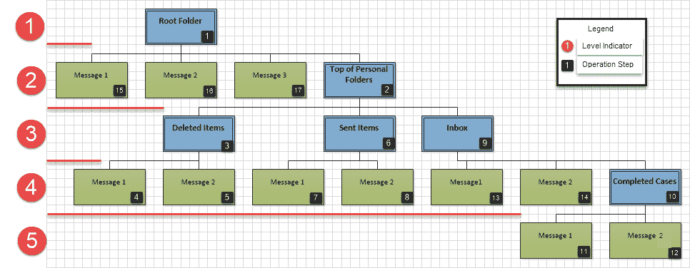
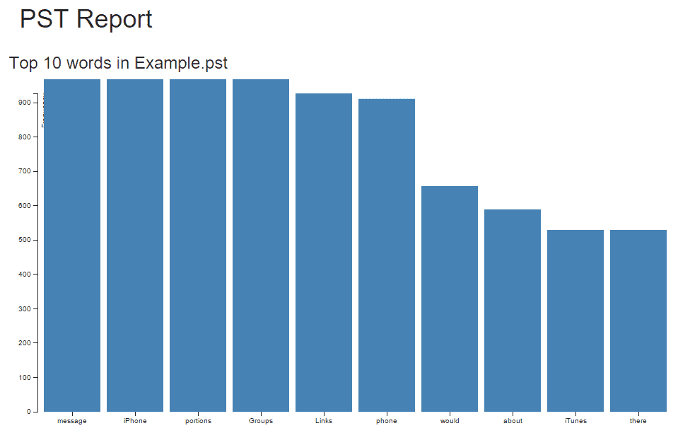
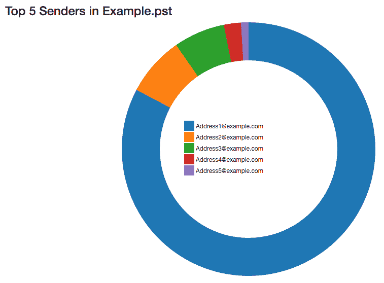
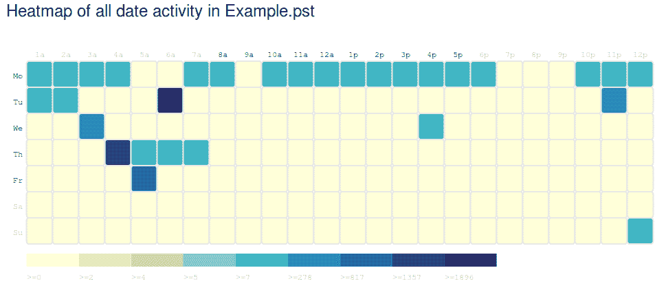
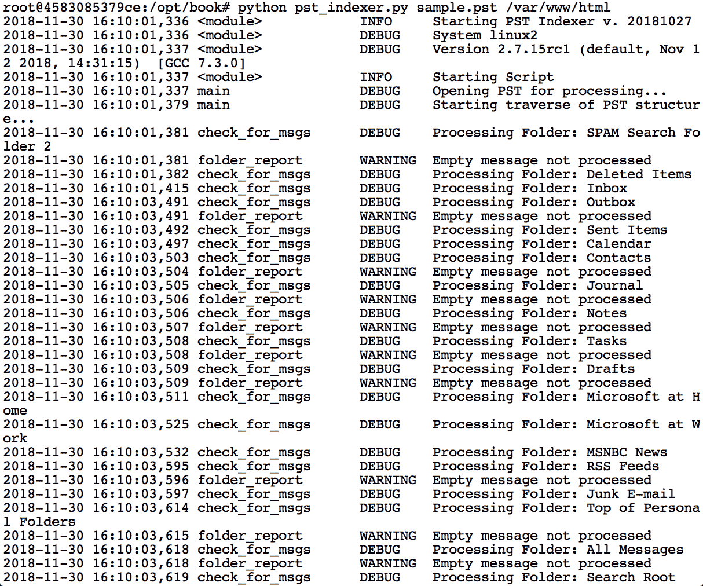

# 解析 Outlook PST 容器

**电子邮件**（**email**）继续是工作场所中最常见的通信方式之一，在当今世界的新通信服务中生存下来。电子邮件可以从计算机、网站和遍布全球口袋的手机发送。这种媒介可以可靠地以文本、HTML、附件等形式传输信息。因此，毫不奇怪，电子邮件在特别是涉及工作场所的调查中扮演了重要角色。在本章中，我们将处理一种常见的电子邮件格式，**个人存储表**（**PST**），由 Microsoft Outlook 用于将电子邮件内容存储在单个文件中。

我们将在本章中开发的脚本介绍了一系列通过 Joachim Metz 开发的`libpff`库可用的操作。这个库允许我们以 Pythonic 方式打开 PST 文件并探索其内容。此外，我们构建的代码演示了如何创建动态的基于 HTML 的图形，以提供电子表格报告的附加背景。对于这些报告，我们将利用第五章中引入的 Jinja2 模块，*Python 中的数据库*，以及 D3.js 框架来生成我们的动态基于 HTML 的图表。

D3.js 项目是一个 JavaScript 框架，允许我们设计信息丰富且动态的图表而不需要太多努力。本章使用的图表是框架的开源示例，与社区共享在[`github.com/d3/d3`](https://github.com/d3/d3)。由于本书不专注于 JavaScript，也不介绍该语言，因此我们不会详细介绍创建这些图表的实现细节。相反，我们将演示如何将我们的 Python 结果添加到预先存在的模板中。

最后，我们将使用一个示例 PST 文件，该文件跨时间包含大量数据，用于测试我们的脚本。与往常一样，我们建议在案件中使用任何代码之前针对测试文件运行以验证逻辑和功能覆盖范围。本章使用的库处于活跃开发状态，并由开发者标记为实验性。

本章涵盖以下主题：

+   理解 PST 文件的背景

+   利用`libpff`及其 Python 绑定`pypff`来解析 PST 文件

+   利用 Jinja2 和 D3.js 创建信息丰富且专业的图表

本章的代码是使用 Python 2.7.15 开发和测试的。

# PST 文件格式

PST 格式是一种**个人文件格式**（**PFF**）的类型。PFF 文件的另外两种类型包括用于存储联系人的**个人通讯录**（**PAB**）和存储离线电子邮件、日历和任务的**脱机存储表**（**OST**）。默认情况下，Outlook 将缓存的电子邮件信息存储在 OST 文件中，这些文件可以在下表中指定的位置找到。如果归档了 Outlook 中的项目，它们将存储在 PST 文件中：

| **Windows 版本** | **Outlook 版本** | **OST 位置** |
| --- | --- | --- |
| Windows XP | Outlook 2000/2003/2007 | `C:\Documents and Settings\USERPROFILE%\Local Settings\Application Data\Microsoft\Outlook` |
| Windows Vista/7/8 | Outlook 2007 | `C:\Users\%USERPROFILE%\AppData\Local\Microsoft\Outlook` |
| Windows XP | Outlook 2010 | `C:Documents and Settings\%USERPROFILE%\My Documents\Outlook Files` |
| Windows Vista/7/8 | Outlook 2010/2013 | `C:\Users\%USERPROFILE%\Documents\Outlook Files` |

来自: [`forensicswiki.org/wiki/Personal_Folder_File_(PAB,_PST,_OST)`](https://forensicswiki.org/wiki/Personal_Folder_File_(PAB,_PST,_OST))。OST 文件的默认位置。

`%USERPROFILE%`字段是动态的，会被计算机上的用户账户名称替换。PFF 文件可以通过十六进制文件签名`0x2142444E`或 ASCII 中的`!BDN`来识别。在文件签名之后，PFF 文件的类型由偏移量 8 处的 2 个字节表示：

| **类型** | **十六进制签名** | **ASCII 签名** |
| --- | --- | --- |
| PST | 534D | SM |
| OST | 534F | SO |
| PAB | 4142 | AB |

来自 [`www.garykessler.net/library/file_sigs.html`](http://www.garykessler.net/library/file_sigs.html)

内容类型（例如 32 位或 64 位）在字节偏移量 10 处定义。PFF 文件格式的结构已经由 Joachim Metz 在多个文献中详细描述，这些文献记录了技术结构以及如何在 GitHub 上的项目代码库中手动解析这些文件：[`github.com/libyal/libpff`](https://github.com/libyal/libpff)。

本章我们只处理 PST 文件，可以忽略 OST 和 PAB 文件的差异。默认情况下，PST 归档有一个根区域，包含一系列文件夹和消息，具体取决于归档时如何创建。例如，用户可能会将视图中的所有文件夹归档，或者只归档某些特定的文件夹。所有选定内容中的项目将导出到 PST 文件中。

除了用户手动归档内容，Outlook 还具有一个自动归档功能，它将在指定时间后将项目存储在 PST 文件中，具体时间根据以下表格定义。一旦达到这个过期时间，项目将会被包括在下一个创建的归档中。自动归档默认将 PST 文件存储在 Windows 7 中的`%USERPROFILE%\Documents\Outlook`、Vista 中的`%APPDATA%\Local\Microsoft\Outlook`，以及 XP 中的`%APPDATA%\Local Settings\Microsoft\Outlook`。这些默认位置可以由用户或在域环境中的组策略设置。这个自动归档功能为调查人员提供了大量的通讯信息，可以在我们的调查中访问和解读：

| **文件夹** | **默认老化周期** |
| --- | --- |
| 收件箱和草稿箱 | 6 个月 |
| 已发送项目和已删除项目 | 2 个月 |
| 发件箱 | 3 个月 |
| 日历 | 6 个月 |
| 任务 | 6 个月 |
| 备注 | 6 个月 |
| 日志 | 6 个月 |

表 11.1：Outlook 项目的默认老化（https://support.office.com/en-us/article/Automatically-move-or-delete-older-items-with-AutoArchive-e5ce650b-d129-49c3-898f-9cd517d79f8e）

# libpff 简介

`libpff`库允许我们以编程方式引用和浏览 PST 对象。`root_folder()`函数允许我们引用`RootFolder`，它是 PST 文件的基础，也是我们递归分析电子邮件内容的起点。在`RootFolder`中包含文件夹和消息。文件夹可以包含其他子文件夹或消息。文件夹有一些属性，包括文件夹名称、子文件夹数量和子消息数量。消息是表示消息的对象，并具有包括主题行、所有参与者的名称以及若干时间戳等属性。

# 如何安装 libpff 和 pypff

安装一些第三方库比运行`pip install <library_name>`更为复杂。在`libpff`和`pypff`绑定的情况下，我们需要采取一些步骤并遵循 GitHub 项目仓库中列出的指示。`libpff`的 wiki（位于[`github.com/libyal/libpff/wiki/Building`](https://github.com/libyal/libpff/wiki/Building)）描述了我们需要采取的步骤来构建`libpff`。

我们将简要介绍如何在 Ubuntu 18.04 系统上构建这个库。在下载并安装 Ubuntu 18.04（最好是在虚拟机中）后，你需要通过运行以下命令来安装依赖项：

```
sudo apt-get update
sudo apt-get install git python-dev python-pip autoconf automake \
 autopoint libtool pkg-config
```

这将安装我们脚本和`pypff`绑定所需的包。接下来，我们需要通过运行以下命令来下载`libpff`代码：

```
git clone https://github.com/libyal/libpff
```

一旦`git clone`命令完成，我们将进入新的`libpff`目录，并运行以下命令来下载其他依赖项，配置并安装我们需要的库组件：

```
cd libpff
./synclibs.ps1
./autogen.ps1
./configure --enable-python
make
make install
```

额外的构建选项在`libpff`的 wiki 页面中有更详细的描述。

到此为止，你应该能够运行以下语句并获得相同的输出，尽管你的版本可能会有所不同：

```
python
>>> import pypff
>>> pypff.get_version()
u'20180812'
```

为了简化这个过程，我们已经预构建了`pypff`绑定，并创建了一个 Dockerfile 来为你运行整个设置。如果你不熟悉 Docker，它是一个虚拟化环境，可以让我们以最小的努力运行虚拟机。虽然 Docker 通常用于托管应用程序，但我们将更多地将它作为传统的虚拟机使用。对我们来说，这种方式的优势在于，我们可以分发一个配置文件，你可以在系统上运行它，从而生成与我们测试的环境相同的环境。

首先，请按照[`docs.docker.com/install/`](https://docs.docker.com/install/)上的说明在你的系统上安装 Docker。安装并运行后，导航到你系统上的`Chapter 11`代码文件夹，并运行`docker build`命令。该命令将根据一系列预配置的步骤生成一个系统：


这将创建一个名为`lpff-ch11`、版本号为 20181130 的新镜像。在 Docker 中，镜像就是它的字面意思：一个基本安装，您可以用它来创建运行中的机器。这样，您可以拥有多个基于相同镜像的机器。每个机器称为容器，为了从这个镜像创建容器，我们将使用`docker run`语句：


`docker run`命令中的`-it`标志要求 Docker 在创建容器后连接到 bash shell。`-P`参数要求 Docker 为我们提供网络连接，在我们的案例中，就是运行在容器中的 Web 服务器。最后，`--name`参数允许我们为容器指定一个熟悉的名称。然后，我们传入镜像名称和版本并运行该命令。如你所见，一旦 Docker 实例完成，我们就会获得一个 root shell。

关于之前提到的 Web 服务器，我们已经包含了`lighttpd`，以便我们能够将 HTML 生成的报告作为网页提供。这不是必需的，不过我们希望强调如何使这些报告在内部系统上可访问。

请不要在公共网络上运行此 Docker 容器，因为它将允许任何能够访问您机器 IP 地址的人查看您的 HTML 报告。

在前面的截图中，我们通过运行`server lighttpd start`启动了 Web 服务器，然后列出了当前目录的内容。如您所见，我们有两个文件，一个是我们即将构建的`pst_indexer.py`脚本，另一个是我们将用来生成报告的`stats_template.html`。现在让我们开始构建 Python 脚本。

# 探索 PST 文件 – pst_indexer.py

在这个脚本中，我们将收集 PST 文件的信息，记录每个文件夹中的邮件，并生成关于词汇使用、频繁发送者以及所有邮件活动的热图统计数据。通过这些指标，我们可以超越初步的邮件收集和报告，探索使用的语言趋势或与特定人员的沟通模式。统计部分展示了如何利用原始数据并构建信息图表以帮助审查员。我们建议根据您的具体调查定制逻辑，以提供尽可能有用的报告。例如，对于词汇统计，我们只查看字母数字且长度大于四个字符的前十个词汇，以减少常见的词汇和符号。这可能不适用于您的调查，可能需要根据您的具体情况进行调整。

# 概览

本章的脚本是为 Python 2.7.15 版本编写的，并且需要上一节中提到的第三方库。请考虑在使用此脚本时同时使用 Docker 镜像。

与我们其他章节一样，本脚本通过导入我们在顶部使用的库开始。在本章中，我们使用了两个新的库，其中一个是第三方库。我们之前已经介绍过 `pypff`，它是 `libpff` 库的 Python 绑定。`pypff` 模块指定了允许我们访问已编译代码的 Python 绑定。在第 8 行，我们引入了 `unicodecsv`，这是一个我们在第五章《Python 中的数据库》中曾使用过的第三方库。这个库允许我们将 Unicode 字符写入 CSV 文件，因为原生的 CSV 库对 Unicode 字符的支持并不理想。

在第 6 行，我们导入了一个名为 `collections` 的标准库，它提供了一系列有用的接口，包括 `Counter`。`Counter` 模块允许我们向其提供值，并处理计数和存储对象的逻辑。除此之外，collections 库还提供了 `OrderedDict`，当你需要按指定顺序创建键的字典时，它非常有用。尽管在本书中没有利用 `OrderedDict` 模块，但当你希望以有序的方式使用键值对时，它在 Python 中确实有其用武之地：

```
001 """Index and summarize PST files"""
002 import os
003 import sys
004 import argparse
005 import logging
006 from collections import Counter
007 
008 import jinja2
009 import pypff
010 import unicodecsv as csv
```

在设定了许可和脚本元数据后，我们将设置一些全局变量。这些变量将帮助我们减少需要传递到函数中的变量数量。第一个全局变量是第 46 行定义的 `output_directory`，它将存储用户设置的字符串路径。第 47 行定义的 `date_dictionary` 使用字典推导式创建了键 1 到 24，并将它们映射到整数 0。然后，我们在第 48 行使用列表推导式将这个字典的七个实例附加到 `date_list`。这个列表被用来构建热图，显示在 PST 文件中按七天 24 小时列划分的活动信息：

```
040 __authors__ = ["Chapin Bryce", "Preston Miller"]
041 __date__ = 20181027
042 __description__ = '''This scripts handles processing and
043     output of PST Email Containers'''
044 logger = logging.getLogger(__name__)
045 
046 output_directory = ""
047 date_dict = {x:0 for x in range(1, 25)}
048 date_list = [date_dict.copy() for x in range(7)]
```

这个热图将建立基线趋势，并帮助识别异常活动。例如，它可以显示在工作日午夜时段活动的激增，或者在星期三业务日开始前的过度活动。`date_list` 包含七个字典，每个字典代表一天，它们是完全相同的，包含一个小时的键值对，默认值为 `0`。

`date_dict.copy()` 在第 48 行的调用是必需的，以确保我们可以在单个日期内更新小时数。如果省略了 `copy()` 方法，所有的日期都会被更新。这是因为字典通过对原始对象的引用相互关联，而在没有使用 `copy()` 方法的情况下，我们生成的是对象的引用列表。当我们使用此函数时，它允许我们通过创建一个新对象来复制值，从而可以创建不同对象的列表。

构建了这些变量后，我们可以在其他函数中引用并更新它们的值，而不需要再次传递它们。全局变量默认是只读的，必须使用特殊的 `global` 命令才能在函数中进行修改。

以下函数概述了我们脚本的操作。像往常一样，我们有`main()`函数来控制行为。接下来是`make_path()`函数，这是一个帮助我们收集输出文件完整路径的工具。`folder_traverse()`和`check_for_msgs()`函数用于迭代可用项并开始处理：

```
051 def main():
...
078 def make_path():
...
089 def folder_traverse():
...
103 def check_for_msgs(): 
```

我们的其余函数专注于处理 PST 中的数据并生成报告。`process_message()`函数读取消息并返回报告所需的属性。第一个报告函数是`folder_report()`函数。此代码为 PST 中找到的每个文件夹创建 CSV 输出，并描述每个文件夹中的内容。

这个函数还通过将消息主体写入单一文本文件来处理其余报告的数据，存储每组日期，并保存发送者列表。通过将这些信息缓存到文本文件中，接下来的函数可以轻松读取文件，而不会对内存产生重大影响。

我们的`word_stats()`函数读取并将信息导入到一个集合中。`Counter()`对象在我们的`word_report()`函数中使用。当生成单词计数报告时，我们将集合的`Counter()`对象读取到 CSV 文件中，该文件将被我们的 JavaScript 代码读取。`sender_report()`和`date_report()`函数也将数据刷新到分隔文件中，供 JavaScript 在报告中进行解释。最后，我们的`html_report()`函数打开报告模板，并将自定义报告信息写入输出文件夹中的 HTML 文件：

```
118 def process_msg():
...
138 def folder_report():
...
193 def word_stats():
...
208 def word_report():
...
235 def sender_report():
...
260 def date_report():
...
277 def html_report():
```

与我们所有的脚本一样，我们在第 302 行的`if __name__ == "__main__":`条件语句下处理参数、日志和`main()`函数调用。我们定义了必需的参数`PST_FILE`和`OUTPUT_DIR`，用户可以指定可选参数`--title`和`-l`，用于自定义报告标题和日志路径：

```
302 if __name__ == "__main__":
303     parser = argparse.ArgumentParser(
304         description=__description__,
305         epilog='Built by {}. Version {}'.format(
306             ", ".join(__authors__), __date__),
307        formatter_class=argparse.ArgumentDefaultsHelpFormatter
308     )
309     parser.add_argument('PST_FILE',
310         help="PST File Format from Microsoft Outlook")
311     parser.add_argument('OUTPUT_DIR',
312         help="Directory of output for temporary and report files.")
313     parser.add_argument('--title', default="PST Report",
314         help='Title of the HTML Report.')
315     parser.add_argument('-l',
316         help='File path of log file.')
317     args = parser.parse_args()
```

在定义了我们的参数后，我们开始处理它们，以便以标准化和安全的方式将它们传递给`main()`函数。在第 319 行，我们将输出位置转换为绝对路径，以确保在脚本中访问正确的位置。注意，我们正在调用`output_directory`全局变量并为其分配一个新值。这只有在我们不在函数内时才可能。如果我们在函数内部修改全局变量，就需要在第 318 行写上`global output_directory`：

```
319     output_directory = os.path.abspath(args.OUTPUT_DIR)
320 
321     if not os.path.exists(output_directory):
322         os.makedirs(output_directory)
```

在修改 `output_directory` 变量后，我们确保路径存在（如果不存在，则创建），以避免后续代码出现错误。完成后，我们在第 331 到 339 行使用标准的日志记录代码片段来配置脚本的日志记录。在第 341 到 345 行，我们记录执行脚本的系统的调试信息，然后再调用 `main()` 函数。在第 346 行，我们调用 `main()` 函数，并传入 `args.PST_FILE` 和 `args.title` 参数。我们无需传递 `output_directory` 值，因为可以全局引用它。在传递参数并且 `main()` 函数执行完成后，我们在第 347 行记录脚本已完成执行。

```
331     logger.setLevel(logging.DEBUG)
332     msg_fmt = logging.Formatter("%(asctime)-15s %(funcName)-20s"
333         "%(levelname)-8s %(message)s")
334     strhndl = logging.StreamHandler(sys.stderr) # Set to stderr
335     strhndl.setFormatter(fmt=msg_fmt)
336     fhndl = logging.FileHandler(log_path, mode='a')
337     fhndl.setFormatter(fmt=msg_fmt)
338     logger.addHandler(strhndl)
339     logger.addHandler(fhndl)
340     
341     logger.info('Starting PST Indexer v. {}'.format(__date__))
342     logger.debug('System ' + sys.platform)
343     logger.debug('Version ' + sys.version.replace("\n", " "))
344 
345     logger.info('Starting Script')
346     main(args.PST_FILE, args.title)
347     logger.info('Script Complete')
```

以下流程图展示了各个函数之间的交互方式。这个流程图可能看起来有些复杂，但它概括了我们脚本的基本结构。

`main()` 函数调用递归的 `folder_traverse()` 函数，该函数依次查找、处理并汇总根文件夹中的消息和文件夹。之后，`main()` 函数生成包含单词、发送者和日期的报告，并通过 `html_report()` 函数生成一个 HTML 报告进行显示。需要注意的是，虚线代表返回值的函数，而实线代表没有返回值的函数：


# 开发 `main()` 函数

`main()` 函数控制脚本的主要操作，从打开和初步处理文件、遍历 PST 文件，到生成报告。在第 62 行，我们使用 `os.path` 模块从路径中分离出 PST 文件名。

如果用户没有提供自定义标题，我们将使用 `pst_name` 变量。在下一行，我们使用 `pypff.open()` 函数创建一个 PST 对象。通过 `get_root_folder()` 方法获取 PST 的根文件夹，从而开始迭代过程，发现文件夹中的项：

```
051 def main(pst_file, report_name):
052     """
053     The main function opens a PST and calls functions to parse
054     and report data from the PST
055     :param pst_file: A string representing the path to the PST
056     file to analyze
057     :param report_name: Name of the report title
058         (if supplied by the user)
059     :return: None
060     """
061     logger.debug("Opening PST for processing...")
062     pst_name = os.path.split(pst_file)[1]
063     opst = pypff.open(pst_file)
064     root = opst.get_root_folder()
```

提取根文件夹后，我们在第 67 行调用 `folder_traverse()` 函数，开始遍历 PST 容器中的目录。我们将在下一部分讨论该函数的具体内容。遍历文件夹后，我们开始使用 `word_stats()`、`sender_report()` 和 `date_report()` 函数生成报告。在第 74 行，我们传入报告名称、PST 名称以及包含最常见单词和发送者的列表，为 HTML 仪表板提供统计数据，如下所示：

```
066     logger.debug("Starting traverse of PST structure...")
067     folder_traverse(root)
068 
069     logger.debug("Generating Reports...")
070     top_word_list = word_stats()
071     top_sender_list = sender_report()
072     date_report()
073 
074     html_report(report_name, pst_name, top_word_list,
075         top_sender_list)
```

# 评估 `make_path()` 辅助函数

为了简化操作，我们开发了一个辅助函数`make_path()`，定义在第 78 行。辅助函数允许我们在脚本中重复利用通常需要多次编写的代码，只需一次函数调用即可。通过这段代码，我们接受一个表示文件名的输入字符串，并根据用户提供的`output_directory`值返回文件在操作系统中的绝对路径。在第 85 行，进行了两项操作；首先，我们使用`os.path.join()`方法将`file_name`与`output_directory`值按正确的路径分隔符连接起来。

接下来，这个值将通过`os.path.abspath()`方法进行处理，该方法提供操作系统环境中的完整文件路径。然后我们将此值返回给最初调用它的函数。如我们在流程图中所见，许多函数会调用`make_path()`函数：

```
078     def make_path(file_name):
079     """
080     The make_path function provides an absolute path between the
081     output_directory and a file
082     :param file_name: A string representing a file name
083     :return: A string representing the path to a specified file
084     """
085     return os.path.abspath(os.path.join(output_directory,
086         file_name))
```

# 使用`folder_traverse()`函数进行迭代

这个函数递归地遍历文件夹，以解析消息项，并间接地生成文件夹的摘要报告。该函数最初通过根目录提供，经过通用开发，可以处理传递给它的任何文件夹项。这使得我们可以在每次发现子文件夹时重用该函数。在第 97 行，我们使用`for`循环递归遍历从我们的`pypff.folder`对象生成的`sub_folders`迭代器。在第 98 行，我们检查文件夹对象是否有任何额外的子文件夹，如果有，则在检查当前文件夹中的新消息之前再次调用`folder_traverse()`函数。只有在没有新子文件夹的情况下，我们才会检查是否有新消息：

```
089 def folder_traverse(base):
090     """
091     The folder_traverse function walks through the base of the
092     folder and scans for sub-folders and messages
093     :param base: Base folder to scan for new items within
094         the folder.
095     :return: None
096     """
097     for folder in base.sub_folders:
098         if folder.number_of_sub_folders:
099             folder_traverse(folder) # Call new folder to traverse
100         check_for_msgs(folder)
```

这是一个递归函数，因为我们在函数内部调用了相同的函数（某种形式的循环）。这个循环可能会无限运行，因此我们必须确保数据输入有一个结束点。PST 应该有有限数量的文件夹，因此最终会退出递归循环。这基本上是我们 PST 特定的`os.walk()`函数，它遍历文件系统目录。由于我们处理的是文件容器中的文件夹和消息，我们必须自己实现递归。递归可能是一个难以理解的概念；为了帮助你理解，在阅读接下来的解释时，请参考以下图示：



在上面的图示中，PST 层次结构中有五个级别，每个级别包含蓝色文件夹和绿色消息的混合。在**第 1**级，我们有`根文件夹`，这是`folder_traverse()`循环的第一次迭代。由于此文件夹有一个子文件夹`个人文件夹顶部`，如**第 2**级所示，我们在探索消息内容之前重新运行该函数。当我们重新运行该函数时，我们现在评估`个人文件夹顶部`文件夹，并发现它也有子文件夹。

在每个子文件夹上再次调用 `folder_traverse()` 函数时，我们首先处理第**3**级的 `Deleted Items` 文件夹。在第 4 级的 `Deleted Items` 文件夹中，我们发现这里只包含消息，并首次调用 `check_for_msgs()` 函数。

在 `check_for_msgs()` 函数返回后，我们回到第 3 级的 `folder_traverse()` 函数的上一调用，并评估 `Sent Items` 文件夹。由于 `Sent Items` 文件夹也没有子文件夹，我们在返回第 3 级之前处理它的消息。

然后，我们到达第 3 级的 `Inbox` 文件夹，并在第 4 级的 `Completed Cases` 子文件夹上调用 `folder_traverse()` 函数。现在我们进入第 5 级，处理 `Completed Cases` 文件夹中的两条消息。处理完这两条消息后，我们返回到第 4 级，处理 `Inbox` 文件夹中的两条消息。完成这些消息的处理后，我们就完成了第 3、4 和 5 级的所有项目，最终可以返回到第 2 级。在 `Root Folder` 中，我们可以处理那里的三条消息项，之后函数执行结束。我们的递归在这种情况下是自下而上的。

这四行代码允许我们遍历整个 PST 并对每个文件夹中的每条消息执行额外的处理。虽然这种功能通常通过 `os.walk()` 等方法提供，但有些库原生不支持递归，要求开发者使用库中的现有功能来实现。

# 使用 `check_for_msgs()` 函数识别消息

该函数会为每个发现的文件夹在 `folder_traverse()` 函数中调用，并处理消息。第 110 行，我们记录文件夹的名称，以提供已处理内容的记录。接下来，我们在第 111 行创建一个列表来附加消息，并在第 112 行开始迭代文件夹中的消息。

在这个循环中，我们调用 `process_msg()` 函数，将相关字段提取到字典中。在每个消息字典被附加到列表后，我们调用 `folder_report()` 函数，该函数将生成该文件夹内所有消息的汇总报告：

```
103 def check_for_msgs(folder):
104     """
105     The check_for_msgs function reads folder messages if
106     present and passes them to the report function
107     :param folder: pypff.Folder object
108     :return: None
109     """
110     logger.debug("Processing Folder: " + folder.name)
111     message_list = []
112     for message in folder.sub_messages:
113         message_dict = process_msg(message)
114         message_list.append(message_dict)
115     folder_report(message_list, folder.name)
```

# 在 `process_msg()` 函数中处理消息

这个函数是调用最频繁的函数，因为它会为每个发现的消息执行。当你考虑如何提高代码库的效率时，这些就是需要关注的函数。即使是对频繁调用的函数进行微小的效率优化，也能对脚本产生很大的影响。

在这种情况下，函数很简单，主要用于去除另一个函数中的杂乱内容。此外，它将消息处理封装在一个函数中，使得排查与消息处理相关的错误更加容易。

第 126 行的返回语句将一个字典传递给调用函数。该字典为每个`pypff.message`对象的属性提供一个键值对。请注意，`subject`、`sender`、`transport_headers`和`plain_text_body`属性是字符串类型。`creation_time`、`client_submit_time`和`delivery_time`属性是 Python 的`datetime.datetime`对象，而`number_of_attachments`属性是整数类型。

`subject`属性包含消息中的主题行，`sender_name`包含发送消息的发件人名称的单一字符串。发件人名称可能反映电子邮件地址或联系人名称，具体取决于接收者是否解析了该名称。

`transport_headers`包含与任何消息一起传输的电子邮件头数据。由于新数据会被添加到头部的顶部，因此应该从底部向上读取这些数据，以便随着消息在邮件服务器之间的移动，我们能够追踪消息的路径。我们可以利用这些信息，通过主机名和 IP 地址可能追踪消息的流动。`plain_text_body`属性返回纯文本形式的正文，虽然我们也可以使用`rtf_body`和`html_body`属性分别以 RTF 或 HTML 格式显示消息。

`creation_times`和`delivery_times`反映了消息的创建时间和接收到的消息被交付到正在检查的 PST 的时间。`client_submit_time`值是消息发送的时间戳。最后显示的属性是`number_of_attachments`属性，它用于查找要提取的额外数据。

```
118 def process_msg(message):
119     """
120     The process_msg function processes multi-field messages
121     to simplify collection of information
122     :param message: pypff.Message object
123     :return: A dictionary with message fields (values) and
124         their data (keys)
125     """
126     return {
127         "subject": message.subject,
128         "sender": message.sender_name,
129         "header": message.transport_headers,
130         "body": message.plain_text_body,
131         "creation_time": message.creation_time,
132         "submit_time": message.client_submit_time,
133         "delivery_time": message.delivery_time,
134         "attachment_count": message.number_of_attachments,
135     }
```

此时，`pypff`模块不支持与附件的交互，尽管`libpff`库可以使用其`pffexport`和`pffinfo`工具提取相关数据。要构建这些工具，我们必须在构建时运行`./configure`命令时，在命令行中包含`--enable-static-executables`参数。

使用这些选项构建后，我们可以运行前面提到的工具，将 PST 附件导出到一个结构化的目录中。开发人员已表示将会在未来的版本中添加`pypff`对附件的支持。如果该功能发布，我们将能够与消息附件进行交互，并对发现的文件执行额外的处理。如果分析需要此功能，我们可以通过`os`或`subprocess`库在 Python 中调用`pffexport`工具来增加支持。

# 在`folder_report()`函数中汇总数据

到此为止，我们已经收集了大量关于消息和文件夹的信息。我们使用此代码块将数据导出为一个简单的报告以供审查。为了创建这个报告，我们需要`message_list`和`folder_name`变量。在 146 行，我们检查`message_list`中是否有条目；如果没有，我们记录一个警告并返回该函数，以防止剩余的代码继续执行。

如果`message_list`中有内容，我们开始创建 CSV 报告。我们首先通过将所需的文件名传入`make_path()`函数来生成输出目录中的文件名，从而获取我们希望写入的文件的绝对路径。使用该文件路径，我们以`wb`模式打开文件，以便写入 CSV 文件，并防止在报告的行与行之间添加额外的空行（见第 152 行）。在接下来的行中，我们定义了输出文档的头部列表。

此列表应反映我们希望报告的列的顺序列表。可以自由修改第 153 行和 154 行，以反映首选顺序或额外的行。所有附加的行必须是`message_list`变量中所有字典的有效键。

在写入头部后，我们在第 155 行启动`csv.DictWriter`类。如果你记得我们脚本开始时导入了`unicodecsv`库，以处理在写入 CSV 时的 Unicode 字符。在这个导入过程中，我们使用`as`关键字将模块从`unicodecsv`重命名为`csv`，以便在脚本中使用。该模块提供与标准库相同的方法，因此我们可以继续使用我们在`csv`库中见过的熟悉的函数调用。在初始化`DictWriter()`时，我们传递了打开的文件对象、字段名称以及一个参数，告诉该类如何处理`message_list`字典中未使用的信息。由于我们并未使用`message_list`列表中字典的所有键，因此我们需要告诉`DictWriter()`类忽略这些值，如下所示：

```
138 def folder_report(message_list, folder_name):
139     """
140     The folder_report function generates a report per PST folder
141     :param message_list: A list of messages discovered
142         during scans
143     :folder_name: The name of an Outlook folder within a PST
144     :return: None
145     """
146     if not len(message_list):
147         logger.warning("Empty message not processed")
148         return
149 
150     # CSV Report
151     fout_path = make_path("folder_report_" + folder_name + ".csv")
152     fout = open(fout_path, 'wb')
153     header = ['creation_time', 'submit_time', 'delivery_time',
154         'sender', 'subject', 'attachment_count']
155     csv_fout = csv.DictWriter(fout, fieldnames=header,
156         extrasaction='ignore')
157     csv_fout.writeheader()
158     csv_fout.writerows(message_list)
159     fout.close()
```

初始化并配置好`csv_fout`变量后，我们可以开始使用第 157 行的`writeheaders()`方法调用来写入头部数据。接下来，我们使用`writerows()`方法将感兴趣的字典字段写入文件。写入所有行后，我们关闭`fout`文件，将其写入磁盘，并释放对象的句柄（见第 159 行）。

在第 119 行到第 141 行之间，我们准备了来自`message_list`的字典，用于生成 HTML 报告统计数据。我们需要调用第 162 行中的`global`语句，以便我们可以编辑`date_list`全局变量。然后我们打开两个文本文件，记录所有主体内容和发件人名称的原始列表。这些文件将在后续部分用于生成我们的统计数据，并以不会消耗大量内存的方式收集这些数据。这两个文本文件（见第 163 和第 164 行）以`a`模式打开，如果文件不存在则会创建该文件，如果文件存在，则会将数据追加到文件末尾。

在第 165 行，我们启动一个`for`循环，遍历`message_list`中的每个消息`m`。如果消息体键有值，则将其值写入输出文件，并使用两个换行符分隔此内容。接着，在第 168 和 169 行，我们对发件人键及其值执行类似的过程。在这种情况下，我们只使用一个换行符，以便稍后在另一个函数中更方便地迭代：

```
162     global date_list # Allow access to edit global variable
163     body_out = open(make_path("message_body.txt"), 'a')
164     senders_out = open(make_path("senders_names.txt"), 'a')
165     for m in message_list:
166         if m['body']:
167             body_out.write(m['body'] + "\n\n")
168         if m['sender']:
169             senders_out.write(m['sender'] + '\n')
```

在收集完消息内容和发件人信息后，我们开始收集日期信息。为了生成热力图，我们将所有三个活动日期合并为一个总计数，形成一个单一的图表。在确认有有效的日期值后，我们获取星期几的信息，以确定在`date_list`列表中的哪个字典需要更新。

Python 的`datetime.datetime`库有一个`weekday()`方法和一个`.hour`属性，它们允许我们以整数形式访问这些值，并处理繁琐的转换。`weekday()`方法返回一个从 0 到 6 的整数，其中 0 代表星期一，6 代表星期天。`.hour`属性返回一个 0 到 23 之间的整数，表示 24 小时制的时间，尽管我们用于热力图的 JavaScript 要求一个 1 到 24 之间的整数才能正确处理。因此，我们在第 175、181 和 187 行中对每个小时值加 1。

现在我们拥有了更新`date_list`中值所需的正确星期几和时间段键。在完成循环后，我们可以在第 189 和 190 行关闭两个文件对象：

```
171         # Creation Time
172         c_time = m['creation_time']
173         if c_time isn't None:
174             day_of_week = c_time.weekday()
175             hour_of_day = c_time.hour + 1
176             date_list[day_of_week][hour_of_day] += 1
177         # Submit Time
178         s_time = m['submit_time']
179         if s_time isn't None:
180             day_of_week = s_time.weekday()
181             hour_of_day = s_time.hour + 1
182             date_list[day_of_week][hour_of_day] += 1
183         # Delivery Time
184         d_time = m['delivery_time']
185         if d_time isn't None:
186             day_of_week = d_time.weekday()
187             hour_of_day = d_time.hour + 1
188             date_list[day_of_week][hour_of_day] += 1
189     body_out.close()
190     senders_out.close()
```

# 理解`word_stats()`函数

在将消息内容写入文件后，我们现在可以使用它来计算单词使用频率。我们使用从 collections 库中导入的`Counter`模块，以高效的方式生成单词计数。

我们将`word_list`初始化为一个`Counter()`对象，这使得我们可以在调用时给它分配新单词，并跟踪每个单词的总体计数。在初始化后，我们在第 200 行启动一个`for`循环，打开文件，并使用`readlines()`方法逐行迭代：

```
193 def word_stats(raw_file="message_body.txt"):
194     """
195     The word_stats function reads and counts words from a file
196     :param raw_file: The path to a file to read
197     :return: A list of word frequency counts
198     """
199     word_list = Counter()
200     for line in open(make_path(raw_file), 'r').readlines():
```

此时，我们需要使用`split()`方法将行拆分成单个单词的列表，以生成正确的计数。通过不向`split()`传递参数，我们将按所有空白字符进行拆分，在这种情况下，这对我们有利。在第 201 行的拆分之后，我们使用条件语句确保只有长度大于四个字符的单词被包含在我们的列表中，以去除常见的填充词或符号。此逻辑可以根据您的环境进行调整，例如，您可能希望包括少于四个字母的单词或其他过滤标准。

如果条件判断为真，我们将单词添加到计数器中。在第 204 行，我们将单词在列表中的值增加 1。遍历完`message_body.txt`文件的每一行和每个单词后，我们将这个单词列表传递给`word_report()`函数：

```
201         for word in line.split():
202             # Prevent too many false positives/common words
203             if word.isalnum() and len(word) > 4:
204                 word_list[word] += 1
205     return word_report(word_list)
```

# 创建 `word_report()` 函数

一旦 `word_list` 从 `word_stats()` 函数传递过来，我们就可以使用提供的数据生成报告。为了更好地控制数据的展示方式，我们将手动生成 CSV 报告，而不依赖 `csv` 模块。首先，在第 216 行，我们需要确保 `word_list` 中有值。如果没有，函数会记录一个警告并返回。在第 220 行，我们以 `wb` 模式打开一个新文件对象以创建 CSV 报告。在第 221 行，我们将 `Count` 和 `Word` 表头写入第一行，并使用换行符确保所有其他数据写入下面的行：

```
208 def word_report(word_list):
209     """
210     The word_report function counts a list of words and returns
211     results in a CSV format
212     :param word_list: A list of words to iterate through
213     :return: None or html_report_list, a list of word
214         frequency counts
215     """
216     if not word_list:
217         logger.debug('Message body statistics not available')
218         return []
219 
220     fout = open(make_path("frequent_words.csv"), 'wb')
221     fout.write("Count,Word\n")
```

然后，我们使用 `for` 循环和 `most_common()` 方法调用每个单词及其对应的计数值。如果元组的长度大于 1，我们就将这些值按相反的顺序写入 CSV 文档，以便正确对齐列与值，并加上换行符。在这个循环完成后，我们关闭文件并将结果刷新到磁盘，正如第 225 行所示：

```
222     for e in word_list.most_common():
223         if len(e) > 1:
224             fout.write(str(e[1]) + "," + str(e[0]) + "\n")
225     fout.close()
```

紧接着这个循环，我们会生成前 10 个单词的列表。通过将整数 10 传递给 `most_common()` 方法，我们只选择 `Counter` 中最常见的前 10 项。我们将结果的字典追加到临时列表中，该列表返回给 `word_stats()` 函数，并随后用于我们的 HTML 报告：

```
227     html_report_list = []
228     for e in word_list.most_common(10):
229         html_report_list.append(
230             {"word": str(e[0]), "count": str(e[1])})
231 
232     return html_report_list
```

# 构建 `sender_report()` 函数

`sender_report()` 函数类似于 `word_report()`，它为发送电子邮件的个人生成 CSV 和 HTML 报告。这个函数展示了另一种将值读取到 `Counter()` 方法中的方式。在第 242 行，我们打开并读取文件的行到 `Counter()` 方法中。

我们可以这样实现，因为输入文件的每一行代表一个单独的发件人。以这种方式统计数据简化了代码，并且通过简化写作，也为我们节省了几行代码。

`word_stats()` 函数并不适用这种方法，因为我们必须将每一行拆分成单独的单词，然后在计数之前执行额外的逻辑操作。如果我们想对发件人统计信息应用逻辑，我们需要创建一个类似于 `word_stats()` 中的循环。例如，我们可能想排除所有来自 Gmail 的项，或是发件人姓名或地址中包含 `noreply` 字样的项：

```
235 def sender_report(raw_file="senders_names.txt"):
236     """
237     The sender_report function reports the most frequent_senders
238     :param raw_file: The file to read raw information
239     :return: html_report_list, a list of the most
240         frequent senders
241     """
242     sender_list = Counter(
243         open(make_path(raw_file), 'r').readlines())
```

在生成发件人计数之后，我们可以打开 CSV 报告并将表头写入其中。此时，我们将在第 247 行看到的 `for` 循环中迭代每一个最常见的项，如果元组包含多个元素，我们就将其写入文件。

这是另一个可以根据发件人姓名过滤值的地方。写入后，文件被关闭并刷新到磁盘。在第 252 行，我们通过生成一个包含元组值的字典列表来为最终报告生成前五名发件人的统计数据。为了在 HTML 报告功能中访问它，我们返回这个列表。请参见以下代码：

```
245     fout = open(make_path("frequent_senders.csv"), 'wb')
246     fout.write("Count,Sender\n")
247     for e in sender_list.most_common():
248         if len(e) > 1:
249             fout.write(str(e[1]) + "," + str(e[0]))
250     fout.close()
251 
252     html_report_list = []
253     for e in sender_list.most_common(5):
254         html_report_list.append(
255             {"label": str(e[0]), "count": str(e[1])})
256 
257     return html_report_list
```

# 使用 `date_report()` 函数完善热力图

本报告提供了生成活动热力图的数据。为了确保其正常运行，文件名和路径必须与 HTML 模板中指定的相同。该文件的默认模板名为`heatmap.tsv`，并与输出的 HTML 报告位于同一目录下。

打开文件并加载第 267 行中的默认设置后，我们写入标题，使用制表符分隔日期、小时和值列，并以换行符结尾。此时，我们可以通过两个 `for` 循环开始遍历我们的字典列表，访问每个包含字典的列表。

在第一个 `for` 循环中，我们使用 `enumerate()` 方法捕获循环的迭代次数。这个数字恰好对应我们正在处理的日期，使我们能够使用该值写入日期值：

```
260 def date_report():
261     """
262     The date_report function writes date information in a
263     TSV report. No input args as the filename
264     is static within the HTML dashboard
265     :return: None
266     """
267     csv_out = open(make_path("heatmap.tsv"), 'w')
268     csv_out.write("day\thour\tvalue\n")
269     for date, hours_list in enumerate(date_list):
```

在第二个 `for` 循环中，我们遍历每个字典，使用 `items()` 方法分别提取小时和计数值，返回的键值对作为元组。通过这些值，我们可以将日期、小时和计数赋值给制表符分隔的字符串，并写入文件。

在第 271 行，我们将日期值加 1，因为热力图图表使用的是 1 到 7 的范围，而我们的列表使用的是 0 到 6 的索引来表示一周的七天。

在遍历小时数据后，我们将数据刷新到磁盘，然后继续处理下一个小时的数据字典。完成七天的数据遍历后，我们可以关闭此文档，它已准备好与我们的热力图图表一起在 `html_report()` 函数中使用：

```
270         for hour, count in hours_list.items():
271             to_write = "{}\t{}\t{}\n".format(date+1, hour, count)
272             csv_out.write(to_write)
273         csv_out.flush()
274     csv_out.close()
```

# 编写 `html_report()` 函数

`html_report()` 函数是将从 PST 中收集的所有信息组合成最终报告的地方，充满期待地生成此报告。为了生成该报告，我们需要传入指定报告标题、PST 名称以及最常见单词和发件人的计数等参数：

```
277 def html_report(report_title, pst_name, top_words, top_senders):
278     """
279     The html_report function generates the HTML report from a
280         Jinja2 Template
281     :param report_title: A string representing the title of
282         the report
283     :param pst_name: A string representing the file name of
284         the PST
285     :param top_words: A list of the top 10 words
286     :param top_senders: A list of the top 10 senders
287     :return: None
288     """
```

首先，我们打开模板文件，并将其内容读取到一个变量中，作为字符串传入我们的 `jinja2.Template` 引擎，处理成模板对象 `html_template`，该操作发生在第 290 行。

接下来，我们创建一个字典，将值传入模板的占位符，并在第 292 行使用 `context` 字典保存这些值。字典创建完毕后，我们在第 295 行渲染模板并提供 `context` 字典。渲染后的数据是 HTML 数据字符串，正如你在网页中看到的一样，所有占位符逻辑都被评估并转化为静态 HTML 页面。

我们将渲染后的 HTML 数据写入用户指定目录中的输出文件，如第 297 到 299 行所示。HTML 报告写入输出目录后，报告完成，并可以在输出文件夹中查看：

```
289     open_template = open("stats_template.html", 'r').read()
290     html_template = jinja2.Template(open_template)
291 
292     context = {"report_title": report_title, "pst_name": pst_name,
293         "word_frequency": top_words,
294         "percentage_by_sender": top_senders}
295     new_html = html_template.render(context)
296 
297     html_report_file = open(make_path("pst_report.html"), 'w')
298     html_report_file.write(new_html)
299     html_report_file.close()
```

# HTML 模板

本书重点介绍 Python 在法医学中的应用。尽管 Python 提供了许多很棒的方法来操作和应用逻辑于数据，但我们仍然需要依赖其他资源来支持我们的脚本。在本章中，我们构建了一个 HTML 仪表板来展示关于这些 PST 文件的统计信息。

在本节中，我们将回顾 HTML 的各个部分，重点关注数据插入模板的部分，而不是 HTML、JavaScript 和其他 Web 语言的复杂细节。如需更多关于 HTML、JavaScript、D3.js 和其他 Web 资源的使用和实现的信息，请访问[`packtpub.com`](http://packtpub.com)查找相关书籍，或访问[`w3schools.com`](http://w3schools.com)查阅入门教程。由于我们不会深入探讨 HTML、CSS 或其他 Web 设计方面的问题，我们的重点将主要放在 Python 脚本与这些部分的交互上。

这个模板利用了几个常见的框架，允许快速设计专业外观的网页。第一个是 Bootstrap 3，它是一个 CSS 样式框架，能够将 HTML 组织和样式化，使其无论在哪种设备上查看页面，都能保持一致和整洁。第二个是 D3.js 框架，它是一个用于图形可视化的 JavaScript 框架。

如前所示，我们将数据插入的模板项包含在双括号`{{ }}`中。我们将在第 39 行和第 44 行插入 HTML 仪表板的报告标题。此外，我们将在第 48 行、第 55 行和第 62 行插入 PST 文件的名称。第 51 行、第 58 行和第 65 行的`div id`标签作为图表的变量名，可以在模板的后续部分通过 JavaScript 插入这些图表，一旦代码处理了输入：

```
...
038   </style>
039   <title>{{ report_title }}</title>
040 </head>
041 <body>
042   <div class="container">
043     <div class="row">
044       <h1>{{ report_title }}</h1>
045     </div>
046     <div class="row">
047         <div class="row">
048           <h3>Top 10 words in {{ pst_name }}</h3>
049         </div>
050         <div class="row">
051           <div id="wordchart">
052           </div>
053         </div>
054         <div class="row">
055           <h3>Top 5 Senders in {{ pst_name }}</h3>
056         </div>
057         <div class="row">
058           <div id="piechart">
059           </div>
060         </div>
061         <div class="row">
062           <h3>Heatmap of all date activity in {{ pst_name }}</h3>
063         </div>
064         <div class="row">
065           <div id="heatmap"></div>
066         </div>
067       </div>
068     </div>
... 
```

在`div`占位符元素就位后，第 69 行到 305 行的 JavaScript 将提供的数据处理为图表。第 92 行放置了第一个位置数据，在该行，`{{ word_frequency }}`短语被字典列表替换。例如，可以替换为`[{'count': '175', 'word': 'message'}, {'count': '17', 'word': 'iPhone'}]`。这个字典列表被转换为图表值，形成 HTML 报告中的垂直条形图：

```
...
088         .attr("transform", "translate(" + margin.left + "," + margin.top + ")");
089
090         data = {{ word_frequency }}
091
092       function processData(data) {x.domain(data.map(function(d) {
093         return d;
094       }
...
```

在第 132 行，我们将上下文字典中的`percentage_by_sender`值插入到 JavaScript 中。此替换将与`word_frequency`插入的例子类似。通过这些信息，甜甜圈图表将在 HTML 报告中生成：

```
...  
129     (function(d3) { 
130       'use strict'; 
131  
132       var dataset = {{ percentage_by_sender }}; 
133  
134       var width = 960; 
...
```

我们将使用一种新的方式来插入热图数据。通过提供上一节中讨论的文件名，我们可以提示代码在与此 HTML 报告相同的目录中查找`heatmap.tsv`文件。这样做的好处是，我们能够一次生成报告，并在像 Excel 这样的程序中以及在仪表板中使用 TSV 文件，尽管缺点是该文件必须与 HTML 报告一起传输，以便正确显示，因为图表将在重新加载时重新生成。

这个图表在某些浏览器上可能无法正常渲染，因为不同浏览器对 JavaScript 的解释方式不同。测试表明，Chrome、Firefox 和 Safari 都能正常查看该图形。请确保浏览器插件不会干扰 JavaScript，并且浏览器没有阻止 JavaScript 与本地文件的交互。如果您的浏览器不允许这样做，可以考虑在 Docker 实例中运行脚本，启动 `lighttpd` 服务，并将输出放置在 `/var/www/html` 中。当您访问 Docker 实例的 IP 地址时，您将能够浏览报告，因为服务器将为您提供对资源的访问：

```
174         times = ["1a", "2a", "3a", "4a", "5a", "6a", "7a", "8a", "9a", "10a", "11a", "12a", "1p", "2p", "3p", "4p", "5p", "6p", "7p", "8p", "9p", "10p", "11p", "12p"];
175
176       datasets = ["heatmap.tsv"];
177
178       var svg = d3.select("#heatmap").append("svg") 
```

模板的其余部分可以在代码库中找到，如果 Web 编程语言是您的强项，或者值得进一步探索，它可以轻松地被引用和修改。D3.js 库使我们能够创建更多的信息图形，并为我们的报告工具箱添加了另一个相对简单且便于移植的工具。以下图形展示了我们创建的三个图表中每个图表的数据示例。

第一个图表表示 PST 文件中使用频率最高的单词。频率绘制在 *y* 轴上，单词则绘制在 *x* 轴上：



以下图表显示了向用户发送电子邮件的前五个账户。请注意，圆形图表有助于识别数据集中最频繁的参与者。此外，文本标签提供了地址的名称和该地址接收到的电子邮件数量：



最后，以下热力图将所有电子邮件聚合为每小时的单元格，按天分组。这对于识别数据集中的趋势非常有用。

例如，在这种情况下，我们可以快速识别出大多数电子邮件是在清晨时分发送或接收的，特别是在每周二的早上 6 点。图形底部的条形图表示电子邮件的数量。例如，周二早上 6 点的单元格颜色表示在该时段内发送或接收了超过 1,896 封电子邮件：



# 运行脚本

代码已经完成，包括脚本和 HTML 模板，我们准备好执行代码了！在我们的 Ubuntu 环境中，我们需要运行以下命令并提供 PST 进行分析。如果您的 Ubuntu 机器已配置了 Web 服务器，则可以将输出放置在 Web 目录中，并作为网站提供给其他用户浏览。

如果您打算使用 Docker 容器方法来运行此代码，则需要使用以下命令将 PST 文件复制到容器中。请注意，以下语法为 `docker cp src_file container_name:/path/on/container`，更多功能请参见 `docker cp --help`：

```
$ docker cp sample.pst pst_parser:/opt/book
```

现在我们的 PST 文件已位于容器中，我们可以按如下方式运行脚本：



上面的截图显示我们使用`/var/www/html`作为输出目录。这意味着如果我们在 Docker 容器中运行`lighttpd`服务，我们将能够浏览到容器的 IP 地址，并在系统的浏览器中查看内容。你需要运行`docker container ls pst_parser`来获取 Web 服务器所在的正确端口。

# 额外的挑战

对于这个项目，我们邀请你实现一些改进，使我们的脚本更加多功能。如本章前面提到的，`pypff`目前并不原生支持提取或直接与附件交互。然而，我们可以在 Python 脚本中调用`pffexport`和`pffinfo`工具来实现这一功能。我们建议查看`subprocess`模块以实现这一目标。进一步扩展这个问题，我们如何将其与上一章中介绍的代码连接起来？一旦我们访问了附件，可能会有哪些数据可用？

考虑一些方法，允许用户提供过滤选项，以便收集感兴趣的特定邮件，而不是整个 PST 文件。一个可能帮助用户提供更多配置选项的库是`ConfigParser`，可以通过`pip`安装。

最后，另一个挑战是通过添加更多的图表和图形来改进 HTML 报告。一个例子是解析`transit_headers`并提取 IP 地址。通过这些 IP 地址，你可以进行地理定位，并使用 D3.js 库将其绘制在地图上。这种信息可以通过从所有潜在数据点提取尽可能多的信息，提升报告的实用性。

# 总结

电子邮件文件包含大量有价值的信息，使得法医检查员能够更深入地了解通讯内容以及用户随时间变化的活动。利用开源库，我们能够探索 PST 文件并提取其中关于邮件和文件夹的信息。我们还检查了邮件的内容和元数据，以收集关于频繁联系人、常用词汇和活动的异常热点的额外信息。通过这一自动化过程，我们可以更好地理解我们审查的数据，并开始识别隐藏的趋势。该项目的代码可以从 GitHub 或 Packt 下载，具体请参见*前言*。

识别隐藏信息在所有调查中都非常重要，这是数据恢复成为法医调查过程重要基石的众多原因之一。

在下一章中，我们将介绍如何从一个难以处理的来源——数据库中恢复数据。通过使用多个 Python 库，我们将能够恢复本来可能丢失的数据，并获得有关那些数据库不再跟踪的记录的宝贵见解。
