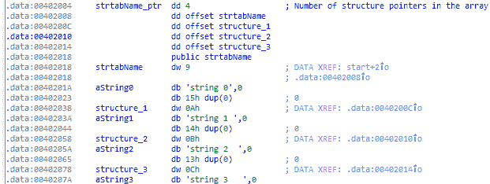
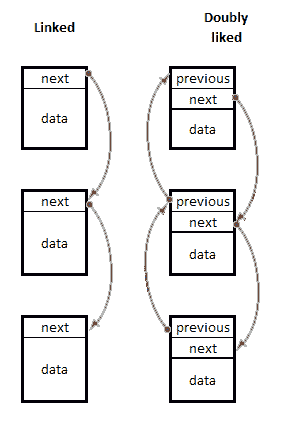
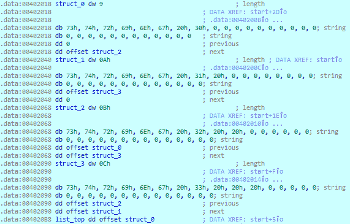
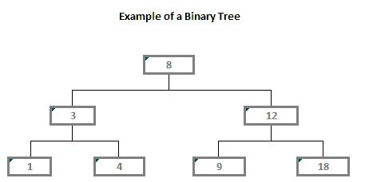
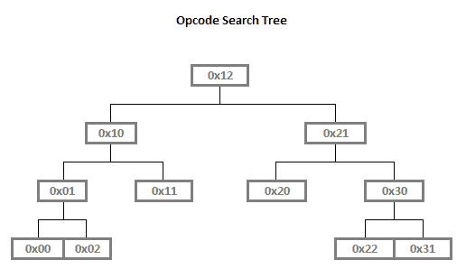
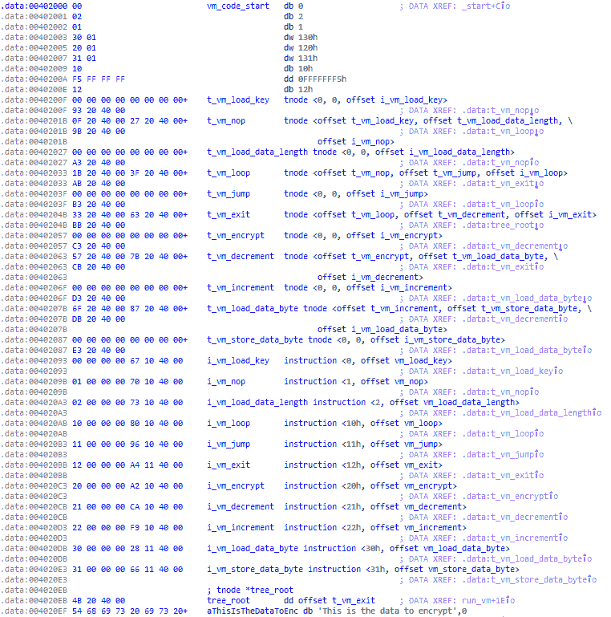
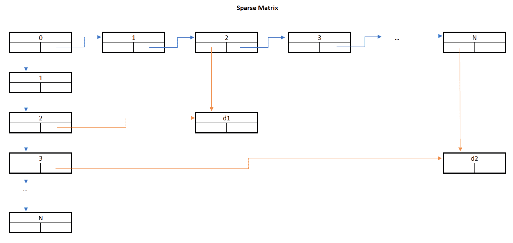
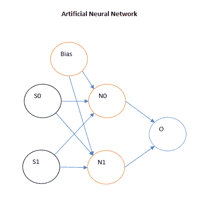

# 数据结构

正如本书中已经多次提到的，汇编语言是关于对数据进行移动和执行某些基本操作，汇编编程是关于知道该将数据移动到哪里，并在此过程中对其应用哪些操作。到目前为止，我们主要集中在对不同类型数据执行的操作上，现在是时候讨论数据本身了。

在基于 Intel 架构的处理器中，最小的数据单元是比特，而最小的可寻址单元是字节（在 Intel 架构中是 8 位）。我们已经知道如何处理这样的数据，甚至是字、双字和单精度浮点值。然而，数据可能比这些更复杂，我指的不是四字、双精度浮点数等。

在本章中，我们将学习如何声明、定义和操作简单以及复杂的数据结构，以及这如何使我们作为汇编开发者的工作变得更加轻松。从简单的数据结构（如数组）开始，我们将逐步探讨包含不同数据类型的更复杂结构，并逐步过渡到链表和树形结构，最终介绍更复杂、更强大的数据排列方法。鉴于你作为开发者已经熟悉不同的数据结构，本章的目的是展示在汇编中使用它们的简便性，特别是使用 FASM 这款功能强大的汇编器。

本章中将讨论以下数据结构（数据排列方案）：

+   数组

+   结构体

+   结构体数组

+   链表及其特殊情况

+   二叉搜索树及其平衡

+   稀疏矩阵

+   图

# 数组

到目前为止，我们已经走了很长一段路，主要处理从字节到四字的基本数据类型，为更复杂的数据相关概念做好准备。接下来我们将深入探讨数组，数组可以被视为相同类型数据的顺序存储。从理论上讲，数组成员的大小没有限制，但实际上我们受到诸如寄存器大小的限制。然而，存在一些变通方法，我们将在本章稍后看到。

# 简单字节数组

一个广泛使用且简单的数组的例子是 AES 算法中使用的正向替代表和/或反向替代表：

```
aes_sbox:
db 0x63, 0x7c, 0x77, 0x7b, 0xf2, 0x6b, 0x6f, 0xc5
db 0x30, 0x01, 0x67, 0x2b, 0xfe, 0xd7, 0xab, 0x76
db 0xca, 0x82, 0xc9, 0x7d, 0xfa, 0x59, 0x47, 0xf0
db 0xad, 0xd4, 0xa2, 0xaf, 0x9c, 0xa4, 0x72, 0xc0
db 0xb7, 0xfd, 0x93, 0x26, 0x36, 0x3f, 0xf7, 0xcc
db 0x34, 0xa5, 0xe5, 0xf1, 0x71, 0xd8, 0x31, 0x15
db 0x04, 0xc7, 0x23, 0xc3, 0x18, 0x96, 0x05, 0x9a
db 0x07, 0x12, 0x80, 0xe2, 0xeb, 0x27, 0xb2, 0x75
db 0x09, 0x83, 0x2c, 0x1a, 0x1b, 0x6e, 0x5a, 0xa0
db 0x52, 0x3b, 0xd6, 0xb3, 0x29, 0xe3, 0x2f, 0x84
db 0x53, 0xd1, 0x00, 0xed, 0x20, 0xfc, 0xb1, 0x5b
db 0x6a, 0xcb, 0xbe, 0x39, 0x4a, 0x4c, 0x58, 0xcf
db 0xd0, 0xef, 0xaa, 0xfb, 0x43, 0x4d, 0x33, 0x85
db 0x45, 0xf9, 0x02, 0x7f, 0x50, 0x3c, 0x9f, 0xa8
db 0x51, 0xa3, 0x40, 0x8f, 0x92, 0x9d, 0x38, 0xf5
db 0xbc, 0xb6, 0xda, 0x21, 0x10, 0xff, 0xf3, 0xd2
db 0xcd, 0x0c, 0x13, 0xec, 0x5f, 0x97, 0x44, 0x17
db 0xc4, 0xa7, 0x7e, 0x3d, 0x64, 0x5d, 0x19, 0x73
db 0x60, 0x81, 0x4f, 0xdc, 0x22, 0x2a, 0x90, 0x88
db 0x46, 0xee, 0xb8, 0x14, 0xde, 0x5e, 0x0b, 0xdb
db 0xe0, 0x32, 0x3a, 0x0a, 0x49, 0x06, 0x24, 0x5c
db 0xc2, 0xd3, 0xac, 0x62, 0x91, 0x95, 0xe4, 0x79
db 0xe7, 0xc8, 0x37, 0x6d, 0x8d, 0xd5, 0x4e, 0xa9
db 0x6c, 0x56, 0xf4, 0xea, 0x65, 0x7a, 0xae, 0x08
db 0xba, 0x78, 0x25, 0x2e, 0x1c, 0xa6, 0xb4, 0xc6
db 0xe8, 0xdd, 0x74, 0x1f, 0x4b, 0xbd, 0x8b, 0x8a
db 0x70, 0x3e, 0xb5, 0x66, 0x48, 0x03, 0xf6, 0x0e
db 0x61, 0x35, 0x57, 0xb9, 0x86, 0xc1, 0x1d, 0x9e
db 0xe1, 0xf8, 0x98, 0x11, 0x69, 0xd9, 0x8e, 0x94
db 0x9b, 0x1e, 0x87, 0xe9, 0xce, 0x55, 0x28, 0xdf
db 0x8c, 0xa1, 0x89, 0x0d, 0xbf, 0xe6, 0x42, 0x68
db 0x41, 0x99, 0x2d, 0x0f, 0xb0, 0x54, 0xbb, 0x16
```

正如我们可以清楚看到的，所有值的大小都是 1 字节，并且是按顺序一个接一个地存储。访问这样的数组非常简单，甚至可以通过 XLAT 指令完成。例如，假设我们正在进行 AES-128 计算，并且需要将每个字节替换为前面表格中的字节。假设以下是该值：

```
needs_substitution db 0, 1,  2,  3,  4,  5,  6,  7\
                      8, 9, 10, 11, 12, 13, 14, 15
```

以下代码将执行替代操作：

```
   lea  ebx, [aes_sbox]
   lea  esi, [needs_substitution] *; Set the source pointer (ESI) and*
   mov  edi, esi                  *; destination pointer (EDI) as we* 
 *; will be storing substituted* 
                                  ; byte back
   mov  ecx, 0x10                 *; Set the counter*
@@:
   lodsb                          *; Load byte from the value*
   xlatb                          *; Substitute byte from the s-box*  
   stosb                          *; Store new byte to the value*
   loop @b                        *; Loop while ECX != 1*
```

我们做的第一件事是将表的基地址（S-box 的地址）加载到 EBX 寄存器中，因为 XLAT 指令正是使用这个寄存器来寻址替代/查找表。然后，我们加载需要的数组地址。

将数据替换到 ESI 寄存器中，以避免计算索引，因为 ESI 寄存器会被 `lodsb` 指令自动递增。将地址复制到 EDI 寄存器中，因为我们将把数据存回。

你也可以通过从最后一个字节到第一个字节处理 16 字节的值，加载 ESI 和 EDI 寄存器为 `lea esi, [needs_substitution + 0x0f]`，将地址复制到 EDI，并使用 `std` 指令设置方向标志。完成后，别忘了使用 `cld` 指令清除方向标志。

然后，我们顺序读取值的每个字节，用 XLAT 指令将其替换为来自 S-box 的字节，并将结果存回。作为 XLAT 指令的替代方案（XLAT 指令限制为 256 字节的表，并且只能在 AL 寄存器依赖的字节值上操作），我们可以写出以下内容：

```
mov al, [aes_sbox + eax] *; aes_sbox is the base and EAX is the index*
```

然而，我们需要在进入循环之前将整个 EAX 寄存器置为 0，而 XLAT 允许 EAX 寄存器的高 24 位在整个操作过程中保持不变。

# 字数组、双字数组和四字数组

之前的简单示例展示了一个简单的字节数组，以及如何访问其成员。对于字数组、双字数组或四字数组，只需要做一些扩展，方法是：

+   我们不能在大于 256 字节的数组上使用 XLAT，也不能在数组成员大于 8 位时使用 XLAT。

+   我们需要使用 SIB 寻址（比例索引基址）来访问大于一个字节的数组成员。

+   在 32 位系统上，我们无法将一个四字节值读入单个寄存器。

为了简单起见，我们考虑使用一个查找表来计算 0 到 12 范围内数字的阶乘（此代码适用于 32 位，较大的数字的阶乘无法适应双字）。虽然阶乘计算的算法相当简单，但即使是如此短的范围，使用查找表要方便得多。

首先，将以下内容放入数据段（你也可以将其放入代码段，因为我们这里不会更改任何值，但让我们把数据与数据放在一起）：

```
ftable  dd  1,\           *; 0!*
            1,\           *; 1!*
            2,\           *; 2!*
            6,\           *; 3!*
            24,\          *; 4!*
            120,\         *; 5!*
            720,\         *; 6!*
            5040,\        *; 7!*
            40320,\       *; 8!*
            362880,\      *; 9!*
            3628800,\     *; 10!*
            39916800,\    *; 11!*
            479001600     *; 12!*
```

这是我们的查找表，包含了 13 个阶乘值，范围从 0 到 12，每个条目是双字（32 位）。现在，让我们编写一个过程来使用这个表。这个过程将按照`stdcall`调用约定实现；它接收一个参数，即我们需要计算阶乘的数字，并返回该数字的阶乘值，如果数字不在允许的范围内，则返回 0（因为 0 不能是阶乘的值）。将以下代码放入代码段：

```
factorial:
   push  ebp
   mov   ebp, esp
   ;-------------
   virtual at ebp + 8             *; Assign a readable name to*
      arg0  dd ?                  *; a location on stack where* 
   end virtual                    *; the parameter is stored*
   ;-------------
   mov   eax, [arg0]              *; Load parameter from the stack*
   cmp   eax, 0x0c                *; Check whether it is in range*
   ja    .oops                    *; Go there if not*
   mov   eax, [ftable + eax * 4]  *; Retrieve factorial from* 
 *; the lookup table*
 @@:
   leave
   ret   4

 .oops:
   xor   eax, eax                 *; Set return value to 0*
   jmp   @b
```

`virtual` 指令允许我们在特定地址虚拟定义数据。在前面的例子中，我们定义了一个指向存储参数的堆栈位置的变量。在`virtual`块内定义的所有内容都被汇编器视为合法标签。在这种情况下，`arg0` 转换为 `ebp + 8`。如果我们有两个甚至更多通过堆栈传递给过程的参数，我们可以这样写：

`virtual at ebp + 8`

`arg0 dd ?`

`arg1 dd ?`

`; 其余部分`

`end virtual`

在这里，`arg1` 会被转换为 `ebp+12`，`arg2`（如果定义了的话）为 `ebp+16`，以此类推。

这个过程确实非常简单，它做的就是这个：

+   检查参数是否适合范围

+   如果参数不符合范围，则返回`0`

+   使用参数作为查找表中的索引，并返回由表的基地址加上索引（我们的参数）乘以表中条目的大小所引用的值

# 结构体

作为开发者，我相信你会同意，大多数时候我们处理的不是统一数据的数组（我绝对不是低估常规数组的强大）。由于数据可以是任何东西，从 8 位数字到复杂结构体，我们需要一种方式来为汇编器描述这些数据，而“结构体”这一术语就是关键。Flat Assembler 和其他任何汇编器一样，允许我们声明结构体，并将其作为额外的数据类型（类似于 C 语言中的`typedef`结构）来使用。

让我们声明一个简单的结构体，即字符串表的一个条目，然后看看它是什么：

```
struc strtabentry [s]
{
   .length dw  .pad - .string         *; Length of the string*
   .string db  s, 0                   *; Bytes of the string*
   .pad    rb  30 - (.pad - .string)  *; Padding to fill 30 bytes*
   .size = $ - .length                *; Size of the structure (valid* 
 *; in compile time only)*
}
```

结构体成员名前面的点符号 (`.`) 表示它们是更大命名空间的一部分。在这个具体的例子中，`*.length*`属于 `strtabentry`。

这样的声明在 C 语言中相当于以下声明：

```
typedef struct
{
   short         length;
   char          string[30];
}strtabentry;
```

然而，在 C 语言中，我们必须初始化类型为`strtabentry`的变量，如下所示：

```
*/* GCC (C99) */*
strtabentry my_strtab_entry = {.length = sizeof("Hello!"), .string = {"Hello!"} };  

*/* MSVC */*
strtabentry my_strtab_entry = {sizeof("Hello!"), {"Hello!"} };              
```

在汇编语言中，或者更准确地说，在使用 Flat Assembler 时，我们会以更简单的方式初始化这样的变量：

```
my_strtab_entry strtabentry "Hello!"
```

无论哪种方式，结构体的大小都是 32 字节（因为字符串缓冲区是静态分配的，大小为 30 字节），并且只有两个成员：

+   `length`：这是包含字符串长度的字长整数，加 1 以包含 null 终止符

+   `string`：这是实际的文本

# 访问结构体成员

关于如何访问结构体的各个成员，需要做一些说明。当结构体是静态分配时，我们可以通过它的标签/名称来引用结构体，这个标签会被转换成结构体的地址。例如，如果我们在数据段中定义了一个名为`se`的`strtabentry`结构，并且我们需要从字符串中读取第*n*个字节，那么我们所需要做的就是：

```
mov  al, [se.string + n]   *; 0 <= n < 30*
```

另一方面，如果我们不能使用标签（例如，在一个过程内，而结构体的指针是其参数），那么我们可以使用强大的`virtual`指令。作为快速演示，这里是一个返回字符串长度的过程，不包括终止的零字符：

```
get_string_length:
   push  ebp
   mov   ebp, esp
   push  ebx
   *;=========*
   virtual at ebp + 8      *; Give a name to the parameter on stack*
      .structPtr dd 0      *; The parameter itself is not modified*
   end virtual
   *;---------*
   virtual at ebx          *; Give local name to the structure*
      .s strtabentry 0     *; The structure is not really defined*
   end virtual             *; so the string is not modified*
   *;=========*
   mov   ebx, [.structPtr] *; Load structure pointer to EBX*
   mov   ax, [.s.length]   *; Load AX with the length*
   movzx eax, ax          * ; Upper 16 bits may still contain garbage*
 *; so we need to clean it*
 *dec   eax               ; Exclude null terminator*
   pop   ebx
   leave
   ret   4
```

为了帮助记忆，我们再看一下从栈中读取指针以及将字符串长度加载到 AX 寄存器的那几行。第一行如下所示：

```
mov   ebx, [.structPtr]
```

前面的代码从栈中加载参数。正如我们所记得的，声明一个虚拟标签可以让我们为那些无法通过其他方式命名的内存位置赋予可读名称，而栈就是一个例子。在这个特定情况下，`.structPtr` 转换为 `ebp + 8`，因此该行代码等价于以下内容：

```
mov   ebx,[ebp + 8]
```

同样，如果有第二个参数，虚拟声明将如下所示：

```
virtual at ebp + 8
   .structPtr   dd 0
   .secondParam dd 0
end virtual
```

在这种情况下，读取第二个参数将如下所示：

```
mov   ecx, [.secondParam]
```

另外，它将转化为以下内容：

```
mov   ecx, [ebp + 12]  *; Which is ebp + 8 + sizeof(.structPtr)*
```

这是我们感兴趣的第二行：

```
mov   ax, [.s.length]
```

在这个特定情况下，我们正在访问结构体的第一个成员—`.length`，这意味着该行代码可以转换为以下内容：

```
mov   ax, [ebx]
```

然而，如果我们需要访问字符串本身，例如，如果我们需要加载一个寄存器以获取字符串的地址，代码将如下所示：

```
lea   eax, [.s.string]
```

这将转化为以下形式：

```
lea   eax, [ebx + 2]
```

# 结构体数组

到现在为止，我们在访问结构体及其成员方面已经没有问题了，但如果我们有多个相同类型的结构体该怎么办？我们自然会将它们组织成一个结构体数组。看起来很简单，部分而言，确实是的。

为了简化访问数组成员的过程，我们可以使用指针数组，并通过某种查找表访问数组中的每个结构体。在这种情况下，我们只需使用以下方式从查找表中读取指针：

```
mov  ebx, [lookup_table + ecx * 4] *; ECX contains the index into array* 
 *; of pointers and 4 is the scale (size* 
 *; of pointer on 32-bit systems)*
```

拥有指向感兴趣结构体的指针后，我们照常继续工作。

我们的示例结构非常方便，因为它的大小仅为 32 字节。如果我们将许多此类结构排列成一个数组，我们将能够轻松地访问一个包含 134,217,727 个成员的数组（在 32 位系统上），该数组占用 4GB 的内存。虽然我们几乎不会需要这么多最大长度为 30 字节的字符串（或者根本不需要这么多字符串），但在这种特定情况下，地址计算非常简单（再次强调，得益于结构体的舒适大小）。我们仍然使用结构体数组中的索引，但是由于不能利用 SIB 寻址的比例部分将索引按 32 字节进行缩放，我们需要在访问数组之前先对索引进行乘法运算。

让我们定义一个宏指令，用来首先创建这样的数组（同时构建指针查找表以供演示）：

```
macro make_strtab strtabName, [strings]
{
   common
   label strtabName#_ptr dword    *; The # operator concatenates strings*
   local c                        *; resulting in strtabName_ptr*
   c = 0

   forward
   c = c + 1                      *; Count number of structures*

   common
   dd c                           *; Prepend the array of pointers with* 
 *; number of entries*

   forward                        *; Build the pointer table*
   local a
   dd a

   common                         *; Build the array of structures*
   label strtabName dword

   forward
   a strtabentry strings
}
```

前面宏的调用，使用以下参数，形式如下：

```
make_strtab strtabName,\          *; Spaces are intentionally appended to*
            "string 0",\          *; strings in order to provide us with* 
            "string 1 ",\         *; different lengths.*
            "string 2  ",\
            "string 3   "
```

这将导致内存中数据的以下排列：



如你所见，`strtabName_ptr` 变量包含数组中的结构体/指针数量，后面跟着四个指针的数组。接下来，在 `strtabName` 处（我们可以在调用宏时选择任何符合命名规则的名称），我们有了四个结构体的实际数组。

现在，如果我们需要检索结构体中索引为 2 的字符串长度（索引从 0 开始），我们将修改 `get_string_length` 程序，使其接受两个参数（结构体数组指针和索引），如下所示：

```
get_string_length:
   push   ebp,
   mov    ebp, esp
   push   ebx ecx

   virtual at ebp + 8
      .structPtr   dd ?      *; Assign label to first parameter*
      .structIdx   dd ?      *; Assign label to second parameter*
   end virtual 

   virtual at ebx + ecx
      .s strtabentry ?       *; Assign label to structure pointer*
   end virtual

   mov   ebx, [.structPtr]   *; Load pointer to array of structures*
   mov   ecx, [.structIdx]   *; Load index of the structure of interest*
   shl   ecx, 5              *; Multiply index by 32*
   mov   ax, [.s.length]     *; Read the length*
   movzx eax, ax
   dec   eax
   pop   ecx ebx
   leave
   ret   8
```

程序调用将如下所示：

```
push  2                 *; push index on stack*
push  strtabName        *; push the address of the array*
call  get_string_length
```

# 指向结构体的指针数组

前一小节向我们展示了如何处理均匀结构体的数组。由于没有特别的理由需要固定大小的字符串缓冲区，因此也没有必要使用固定大小的结构体。首先，我们需要对结构体声明做一点小修正：

```
struc strtabentry [s]
{
   .length dw  .pad - .string         *; Length of the string*
   .string db  s, 0                   *; Bytes of the string*
   .size = $ - .length                *; Size of the structure (valid* 
 *; in compile time only)*
}
```

我们只移除了 `strtabentry` 结构体中的 `.pad` 成员，使其可以具有可变大小。显然，我们不能再使用相同的 `get_string_length` 程序，因为我们没有固定的步长来遍历数组。但你可能已经注意到前面图像中的 `strtabName_ptr` 结构。这个结构就是用来帮助我们解决没有固定步长的问题的。我们可以重写 `get_string_length` 程序，使它接受一个指向结构体数组指针的指针，而不是直接接受数组指针和目标结构体的索引。修改后的程序如下所示：

```
get_string_length:
   push   ebp,
   mov    ebp, esp
   push   ebx ecx

   virtual at ebp + 8
      .structPPtr   dd ?     *; Assign label to first parameter*
      .structIdx   dd ?      *; Assign label to second parameter*
   end virtual 

   virtual at ebx
      .s strtabentry ?       *; Assign label to structure pointer*
   end virtual

   mov   ebx, [.structPPtr]  *; Load pointer to array of structures*
   mov   ecx, [.structIdx]   *; Load index of the structure of interest*
   shl   ecx, 2              *; Multiply index by 4 (size of pointer
*                             *; on a 32-bit platform
*   cmp   ecx, [.structPPtr]  *; Check the index to fit the size of the 
*                             *; array of pointers
*   jae   .idx_too_big        *; Return error if* index exceeds the bounds
   mov   ebx, [ebx + ecx + 4]*; We have to add 4 (the size of int), in 
*                             *; order to skip the number of structure
*                             *; pointers in the array*
   mov   ax, [.s.length]     *; Read the length*
   movzx eax, ax

.return:
   dec   eax
   pop   ecx ebx
   leave
   ret   8

.idx_too_big:
   xor   eax, eax             *; The value of EAX would be -1 upon return*
   jmp   .return
```

完成！我们只需要做一些小的修改，添加这一行，再加上一行，现在我们就能够处理具有可变大小的结构体了。

到目前为止，内容并不复杂，接下来的内容也不难理解。虽然数据类型不多，但它的排列方式却有很多。结构体可以被视为一种数据类型，也可以看作是非均匀数据的排列方法，但为了方便起见，我们将其视为一个可以自由定义的数据类型。到现在为止，我们已经看到了当数据排列在静态内存中且排列不变时的情况，但是如果我们正在处理动态数据，而数据量在编写代码时无法确定该怎么办呢？在这种情况下，我们需要知道如何处理动态数据。这就引出了数据排列的下一个阶段——链表及其类型。

# 链表

链表顾名思义，由通过指针相互连接的数据项（节点）组成。基本上，链表有两种类型：

+   **链表**：每个节点都有指向下一个节点的指针

+   **双向链表**：每个节点有指向下一个节点和前一个节点的指针

以下图表展示了两者之间的区别：



两种类型的链表都可以通过几种方式进行寻址。显然，链表中至少有一个指向第一个节点的指针（称为`top`），可选地伴随有一个指向链表最后一个节点的指针（称为`tail`）。当然，若有需要，还可以添加多个辅助指针。节点中的指针字段通常称为`next`和`previous`。正如我们在图示中看到的，链表的最后一个节点以及双向链表中的第一个和最后一个节点都有`next`、`previous`和`next`字段，这些字段不指向任何地方——这样的指针被视为终止符，表示链表的结束，并且通常会填充`null`值。

在继续示例代码之前，让我们对本章使用的结构体做一个小改动，添加`next`和`previous`指针。结构体应该如下所示：

```
struc strtabentry [s]
{
   .length   dw   .pad - .string
   .string   db   s, 0
   .pad      rb   30 - (.pad - .string)
   .previous dd   ?         *; Pointer to the next node*
   .next     dd   ?         *; Pointer to the previous node*
   .size = $ - .length
}
```

我们将保留`make_strtab`宏不变，因为我们仍然需要一些东西来构建`strtabentry`结构体的集合；然而，我们将不再把它视为结构体数组。同时，我们将添加一个变量（类型为双字）来存储`top`指针。我们把它命名为`list_top`。

我们将不再编写一个宏指令来将四个结构体连接成一个双向链表，而是编写一个过程来向列表中添加新节点。这个过程需要两个参数——指向`list_top`变量的指针和指向我们想要添加到列表中的结构体的指针。如果我们是在 C 语言中编写，则对应函数的原型如下：

```
void add_node(strtabentry** top, strtabentry* node);
```

然而，由于我们并非在编写 C 语言，我们将写下以下代码：

```
add_node:
   push   ebp
   mov    ebp, esp
   push   eax ebx ecx

   virtual at ebp + 8
      .topPtr  dd ?
      .nodePtr dd ?
   end virtual
   virtual at ebx
      .scx strtabentry ?
   end virtual
   virtual at ecx
      .sbx strtabentry ?
   end virtual

   mov    eax, [.topPtr]       *; Load pointer to list_top*
   mov    ebx, [.nodePtr]      *; Load pointer to new structure*
   or     dword [eax], 0       *; Check whether list_top == NULL*
   jz     @f                   *; Simply store the structure pointer*
 *; to list_top if true*

   mov    ecx, [eax]           *; Load ECX with pointer to current top*
   mov    [.scx.next], ecx      *; node->next = top*
   mov    [.sbx.previous], ebx  *; top->previous = node*

 @@:
   mov    [eax], ebx           *; top = node*
   pop    ecx ebx eax
   leave
   ret    8
```

现在，过程已经准备好，我们将从主过程调用它：

```
_start:
   push strtabName + 40    *; Let the second structure be the first*
   push list_top           *; in the list*
   call add_node

   push strtabName + 120   *; Then we add fourth structure*
   push list_top
   call add_node

   push strtabName + 80    *; Then third*
   push list_top
   call add_node

   push strtabName         *; And first*
   push list_top
   call add_node
```

第一、第二、第三和第四个指的是结构体在内存中的位置，而不是双向链表中节点的位置。因此，在执行前面代码的最后一行后，我们得到一个由`strtabentry`结构体组成的双向链表（通过其在链表中的位置显示）`{0, 2, 3, 1}`。让我们通过以下截图来看一下结果的演示：



为了方便起见，结构体按其在内存中出现的顺序命名为`struct_0`、`struct_1`、`struct_2`和`struct_3`。最后一行是`top`指针`list_top`。如我们所见，它指向`struct_0`，这是我们最后添加到列表中的结构体，而`struct_0`反过来只包含一个指向下一个结构体的指针，同时它的`previous`指针的值为`NULL`。`struct_0`结构体的`next`指针指向`struct_2`，`struct_2`结构体的`next`指针指向`struct_3`，而`previous`指针则以相反顺序引导我们返回。

显然，链表（单向链表，无论是前向还是后向）比双向链表要简单一些，因为我们只需要处理节点中的单个指针成员。实现一个描述链表节点（无论是简单链表还是双向链表）的单独结构，并为创建/填充链表、查找节点和删除节点编写一套过程，可能是个好主意。以下结构就足够了：

```
*; Structure for a simple linked list node*
struc list_node32
{
   .next     dd ?    *; Pointer to the next node*
   .data     dd ?    *; Pointer to data object, which*
 *; may be anything. In case data fits*
 *; in 32 bits, the .data member itself*
 *; may be used for storing the data.*
}

*; Structure for a doubly linked list node*
struc dllist_node32
{
   .next     dd ?
   .previous dd ?    *; Pointer to the previous node*
   .data     dd ?
}
```

如果你在编写长模式（64 位）的代码，那么唯一需要做的改变是将`dd`（表示 32 位双字）替换为`dq`（表示 64 位四字），以便能够存储长模式指针。

除此之外，你可能还想或需要实现一个描述整个链表的结构，拥有所有必要的指针、计数器等（在我们的示例中，它是`list_top`变量；虽然不是严格意义上的结构体，但它完成了任务）。然而，谈到链表数组时，使用指向链表的指针数组会更方便，因为这将使访问数组中的成员更加容易，从而使代码更少出错、更简单和更快速。

# 链表的特殊情况

除非你是自学成才的开发者，否则你很可能已经在编程课上听过很多除了数组和链表之外的不同数据结构，在这种情况下，你可能仍然听说过或读过这些内容。这里所指的不同数据结构是堆栈、队列、双端队列和优先队列。然而，作为奥卡姆剃刀原则的拥护者，我相信我们应该面对现实，承认所有这些都只是链表的特殊情况，除非它们的实现是基于数组的（在某些情况下这也可能是可行的）。

# 堆栈

堆栈是**LIFO**（**后进先出**）的数据排列方式。最简单的例子是进程/线程堆栈。尽管这种实现方式主要基于数组，但它很好地展示了这一机制。

然而，大多数时候，我们无法提前知道所需堆栈的大小，可能只能做一个大致估算。更不用说我们几乎不需要只存储双字或四字；我们大多数时候会有更复杂的结构。堆栈的最常见实现是一个仅由`top`指针管理的单向链表。理想情况下，堆栈上只允许进行三种操作：

+   `push`：用于向列表中添加一个新成员

+   `top`：用于查看/读取列表中最后添加的成员

+   `pop`：用于移除列表中最后添加的成员

虽然`push`和`pop`操作类似于在单向链表中添加和删除成员，但`TOP`操作基本上是获取`top`指针的值，从而访问链表中最上面的（最后添加的）成员。

# 队列与双端队列

队列正如名称所示，是一组元素的队列。链表通过两个指针进行访问——一个指向`top`元素，另一个指向`tail`元素。就本质而言，队列是**FIFO**（**先进先出**）的数据排列方式，这意味着最先入队的元素也会最先出队。队列的开始和结束完全由你决定——`top`是队列的开始还是结束，`tail`也是一样。如果我们希望将本章中使用的链表示例转换为队列，只需要添加一个`list_tail`指针。

双端队列是双向队列，这意味着元素可以根据算法从`top`元素或`tail`元素推入队列。同样地，弹出元素时也是如此。

# 优先队列

优先队列是常规队列的一种特例。唯一的区别是，加入其中的元素每个都有一定的优先级，这由算法定义，并根据需求来确定。其思想是，优先级高的元素先被服务，然后是优先级低的元素。如果两个元素具有相同的优先级，那么它们被服务的顺序是根据它们在队列中的位置来决定的，因此至少有两种可能的方式来实现这种排列。

一种实现方式是排序算法，它会根据元素的优先级来添加新元素。这仅仅是将双端队列转换为一个排序列表。

另一个方法是通过双端队列来寻找具有最高优先级的元素并优先服务它们，这使得双端队列与链表没有太大区别。唯一的区别，可能是元素只能被添加到`top`元素或`tail`元素。

# 循环链表

循环链表可能是仅次于单链表最容易实现的。两者之间的唯一区别是，链表的最后一个元素指向链表的第一个元素，而不是其`next`指针指向`NULL`。

# 链表特殊情况总结

正如我们所见，之前提到的链表的特殊情况实际上只是同一思想的不同逻辑范式。在汇编语言的情况下尤其如此，与更高级的语言（如 C 语言以上）不同，汇编语言没有内置的实现这些方法，因此它发挥了奥卡姆剃刀的作用，剔除了多余的概念，展示了低级现实中的事物。

然而，我们需要考虑阿尔伯特·爱因斯坦说过的话：

“一切事物应尽可能简单，但不能更简单。”

在将链表及其特殊情况尽可能简化后，我们需要继续处理更复杂、更强大的数据排列形式。在本章的下一节中，我们将介绍树——一种非常强大且有用的数据存储方法。

# 树

有时，我们已经覆盖的数据排列方案并不适合解决某些问题。例如，当处理一组经常被搜索或修改的数据，并且需要保持排序时，我们可以将它们放入数组或有序链表中，但搜索时间可能不理想。在这种情况下，最好将数据安排成树的形式。例如，二叉搜索树就是在搜索动态（变化的）数据时，最小化搜索时间的最佳方式。实际上，这同样适用于静态数据。

首先，什么是计算机中的树结构？谈到树结构时，人们可能会想到一种特殊类型的图（图将在本章后面简要介绍），它由一些节点组成，每个节点都有一个父节点（根节点除外，根节点通常称为“根节点”），并且可能有零个或多个子节点。在汇编语言中，我们可以像这样声明树节点的结构：

```
struc tnode dataPtr, leftChild, rightChild
{
   .left  dd  leftChild   *; Pointer to left node or 0*
   .right dd  rightChild  *; Pointer to right node or 0*
   .data  dd  dataPtr     *; Pointer to data*
}
```

所以，我们有一个结构，它包含指向左子节点的指针（传统上，左子节点的值较小），指向右子节点的指针（传统上，右子节点的值较大），以及指向节点表示的数据的指针。通常来说，添加指向父节点的指针并不是一个坏主意，这有助于平衡树结构；然而，在本章接下来的例子中，我们并不需要这个指针。上面的节点结构就足够用于构建这样的树结构：



这张图展示了一个理想的平衡二叉搜索树的情况。然而，在实际情况中，这并不常见，而且取决于平衡方法。不幸的是，树的平衡方法稍微超出了本书的范围。不过，主要的思路是将较小的值放在左边，将较大的值放在右边，这通常涉及对子树，甚至是整个树，应用一定的旋转操作。

# 一个实际的例子

够了，别再讲枯燥的解释了。作为开发者，你很可能已经熟悉了树状结构及其平衡方法，或者至少听说过这些方法。相信通过实例学习是理解事物最有效的方式之一，我建议我们看一下下面的例子。

# 示例——简单的加密虚拟机

这个例子的思路广泛应用并且非常著名——一个简单的，不得不说是原始的，虚拟机。假设我们需要实现一个虚拟机，用一个单字节的密钥，通过异或操作来执行简单的字符串加密。

# 虚拟机架构

虚拟处理器的架构相当简单——它有几个寄存器，用于存储当前的执行状态：

| **寄存器名称** | **寄存器功能** |
| --- | --- |
| `register_a` | 一个 8 位通用寄存器。该寄存器可以被虚拟机代码访问。 |
| `register_b` | 一个 8 位通用寄存器，该寄存器可以被虚拟机代码访问。 |
| `register_key` | 一个 8 位寄存器，存储加密密钥字节。 |
| `register_cnt` | 一个 8 位寄存器，存储`vm_loop`指令的计数器。该寄存器可以被虚拟机代码访问。 |
| `data_base` | 一个 32 位寄存器（长模式下为 64 位寄存器）。存储要加密数据的地址。 |
| `data_length` | 一个 32 位寄存器，存储要加密数据的长度（仅使用 8 位，因此数据不能超过 256 字节）。 |

虚拟处理器的指令集非常有限，但它们并不是按顺序编码的：

| **操作码** | **助记符** | **含义** |
| --- | --- | --- |
| 0x00 | `vm_load_key` | 将虚拟机过程的`key`参数加载到虚拟处理器的`key`寄存器中。 |
| 0x01 | `vm_nop` | 这是 NOP 指令，表示不执行任何操作。 |
| 0x02 | `vm_load_data_length` | 将要加密的字符串长度加载到虚拟处理器的`data length`寄存器中。 |
| 0x10 | `vm_loop target` | 如果`counter`寄存器小于`data length`寄存器，则跳转到`target`。 |
| 0x11 | `vm_jump target` | 无条件跳转到`target`地址。 |
| 0x12 | `vm_exit` | 通知虚拟处理器停止运行。 |
| 0x20 | `vm_encrypt regId` | 对`register[regId]`的内容和`key`寄存器的内容进行异或操作。 |
| 0x21 | `vm_decrement regId` | 递减`register[regId]`的内容。 |
| 0x22 | `vm_increment regId` | 递增`register[regId]`的内容。 |
| 0x30 | `vm_load_data_byte regId` | 从`data_base_address + counter_register`加载字节到`register[regId]`中。 |
| 0x31 | `vm_store_data_byte regId` | 将`register[regId]`中的字节存储到`data_base_address + counter_register`中。 |

# 向 Flat Assembler 添加虚拟处理器的支持

我们将跳过为处理器声明单独结构的步骤；相反，处理器的状态将存储在堆栈中。不过，我们需要做一些准备工作。首先，我们需要让 Flat Assembler 理解我们的助记符并生成适当的二进制输出。为此，我们将创建一个附加的源文件，并命名为`vm_code.asm`。由于该文件将包含宏指令的声明和虚拟机代码（它们将作为数据处理），因此要在主源文件中包含此文件，可以通过添加以下内容：

```
include 'vm_code.asm'
```

在数据部分的某个位置添加这一行。下一步，我们必须定义可以转换为虚拟处理器理解的二进制输出的宏指令。这是 FASM 的一个非常强大的功能，因为人们可以通过一组宏指令为几乎任何架构添加支持（顺便提一下，这正是 Flat Assembler G 的核心思想）：

```
macro vm_load_key
{
   db 0x00
}

macro vm_nop
{
   db 0x01
}

macro vm_load_data_length
{
   db 0x02
}

macro vm_loop loopTarget
{
   db 0x10
   dd loopTarget - ($ + 4)
}

macro vm_jump jumpTarget
{
   db 0x11
   dd loopTarget - ($ + 4)
}

macro vm_exit
{
   db 0x12
}

macro vm_encrypt regId
{
   db 0x20
   db regId
}

macro vm_decrement regId
{
   db 0x21
   db regId
}

macro vm_increment regId
{
   db 0x22
   db regId
}

macro vm_load_data_byte regId
{
   db 0x30
   db regId
}

macro vm_store_data_byte regId
{
   db 0x31
   db regId
}

*; Let's give readable names to registers*
register_a   = 0
register_b   = 1
register_cnt = 2
```

# 虚拟代码

显然，我们写前面的所有代码不是为了好玩；我们需要为虚拟处理器编写一些代码。由于架构非常有限且专门针对特定任务，因此代码的形式选择不多：

```
*; Virtual code                     ; Binary output*
vm_code_start:
   vm_load_key                     *; 0x00*
   vm_load_data_length             *; 0x02*
   vm_nop                          *; 0x01*
 .encryption_loop:    
   vm_load_data_byte register_b    *; 0x30 0x01*
   vm_encrypt register_b           *; 0x20 0x01*
   vm_store_data_byte register_b   *; 0x31 0x01*
   vm_loop .encryption_loop        *; 0x10 0xf5 0xff 0xff 0xff*

   vm_exit                         *; 0x12*
```

# 虚拟处理器

到目前为止，一切似乎都很清楚，除了一个问题——这一切与树有什么关系？我们快到了，因为我们必须实现虚拟处理器本身，这就是我们在这里要做的。

虚拟处理器最简单且可能最常见的实现是`while()`循环，它通过读取虚拟机内存中的指令运行，并通过实现为**间接跳转**和**跳转表**（跳转目标地址表）的`switch()`语句来选择合适的执行路径。尽管我们的示例可能在这种方式下运行效果最好，而且下面描述的架构更适合复杂指令集，但它故意简化以避免讨论那些与树形结构明显无关的方面。

如指令/操作码表所示，我们的操作码都是 1 字节大小，再加上一个 1 字节或 4 字节的操作数（对于需要操作数的指令），范围从`0x00`到`0x31`，并且有相对较大的间隔。然而，操作码的数量使我们可以将它们安排成一个几乎完美的二叉搜索树：



我们说“几乎”是因为如果每个表示操作码`0x11`（`vm_jump`）和`0x20`（`vm_encrypt`）的节点都有两个子节点，那么它将是一个理想的二叉搜索树（但谁说我们不能再添加四个指令呢？）。

图中的每个节点代表一个`tnode`结构，包含所有必要的指针，包括一个指向小结构的指针，该结构将操作码映射到虚拟处理器循环中的真实汇编代码：

```
struc instruction opcode, target
{
   .opcode dd opcode
   .target dd target
}
```

因此，首先要做的就是建立一个将所有操作码映射到汇编代码的表格。表格的格式相当简单。每行包含以下内容：

+   双字操作码

+   一个指向汇编代码的指针（32 位模式为双字，64 位模式为长模式）。

在代码中实现表格相当简单：

```
 i_load_key         instruction 0x00,\
                                run_vm.load_key
 i_nop              instruction 0x01,\
                                run_vm.nop
 i_load_data_length instruction 0x02,\
                                run_vm.load_data_length
 i_loop             instruction 0x10,\
                                run_vm.loop
 i_jump             instruction 0x11,\
                                run_vm.jmp
 i_exit             instruction 0x12,\
                                run_vm.exit
 i_encrypt          instruction 0x20,\
                                run_vm.encrypt
 i_decrement        instruction 0x21,\
                                run_vm.decrement
 i_increment        instruction 0x22,\
                                run_vm.increment
 i_load_data_byte   instruction 0x30,\
                                run_vm.load_data_byte
 i_store_data_byte  instruction 0x31,\
                                run_vm.store_data_byte
```

最后，我们已经到达了树。我们跳过树的构建和平衡过程，因为树是静态分配的，而且我们特别关注的是结构本身。在下面的代码中，我们实际上创建了一个`tnode`结构的数组，这些结构并不是通过`base+index`来访问，而是通过树进行连接。最后一行定义了一个指向树根节点`tree_root`的指针，它指向`t_exit`：

```
 t_load_key         tnode i_load_key,\              ; 0x00 <-\
                          0,\                       ;          |
                          0                         ;          |     
 t_nop              tnode i_nop,\                   ; 0x01     | <-\
                          t_load_key,\              ; ---------/   |
                          t_load_data_length        ; ---------\   |
 t_load_data_length tnode i_load_data_length,\      ; 0x02   <-/   |
                          0,\                       ;              |
                          0                         ;              |
 t_loop             tnode i_loop,\                  ; 0x10         | <-\
                          t_nop,\                   ; -------------/   |
                          t_jmp                     ; --------\        |
 t_jmp              tnode i_jump,\                  ; 0x11  <-/        |
                          0,\                       ;                  |
                          0                         ;                  |
 t_exit             tnode i_exit,\                  ; 0x12             |
                          t_loop,\                  ; -----------------/
                          t_decrement               ; --------\
 t_encrypt          tnode i_encrypt,\               ; 0x20    | <-\  
                          0,\                       ;         |   |
                          0                         ;         |   |
 t_decrement        tnode i_decrement,\             ; 0x21  <-/   |
                          t_encrypt,\               ; ------------/
                          t_load_data_byte          ; --------\
 t_increment        tnode i_increment,\             ; 0x22    | <-\
                          0,\                       ;         |   |
                          0                         ;         |   |
 t_load_data_byte   tnode i_load_data_byte,\        ; 0x30  <-/   |
                          t_increment,\             ; ------------/
                          t_store_data_byte         ; --------\
 t_store_data_byte  tnode i_store_data_byte,\       ; 0x31  <-/
                          0,\
                          0 

tree_root dd t_exit
```

编译后，执行文件的数据部分看起来是这样的：



# 搜索树

我们需要处理一个过程，该过程会在开始实现虚拟处理器循环之前从树中提取虚拟指令的汇编实现的正确地址。

`tree_lookup`过程需要两个参数：

+   `tree_root`变量的地址

+   将字节操作码转换为双字（double word）。

当此过程被调用时，它会按照树排序的规则逐个节点地“遍历”树，并将操作码参数与当前节点所引用的指令结构中的操作码值进行比较。该过程返回操作码的汇编实现地址，若未定义该操作码，则返回零：

```
tree_lookup:
   push ebp
   mov  ebp, esp
   push ebx ecx

   virtual at ebp + 8
      .treePtr dd ?               *; First parameter - pointer to tree_root*
      .code dd ?                  *; Second parameter - opcode value*
   end virtual
   virtual at ecx
      .node tnode ?,?,?           *; Lets us treat ECX as a pointer* 
                                  *; to tnode structure*
   end virtual
   virtual at eax
      .instr instruction ?, ?     *; Lets us treat EAX as a pointer* 
 *; to instruction structure*
   end virtual

   mov  ecx, [.treePtr]           *; Load the pointer to tree_root*
   mov  ecx, [ecx]                *; Load the pointer to root node*
   mov  ebx, [.code]              *; Read current opcode*
   movzx ebx, bl                  *; Cast to unsigned int*

@@:
   or   ecx, 0                    *; Check whether ECX points to a node*
   jz   .no_such_thing            *; and return zero if not*

   mov  eax, [.node.data]         *; Load pointer to instruction structure*
   cmp  ebx, [.instr.opcode]      *; Compare opcode value*
   jz   @f
   ja   .go_right                 *; If node contains lower opcode, then*
                                  *; continue searching the right subtree*
   mov  ecx, [.node.left]         *; Otherwise continue searching the* 
   jmp  @b                        *; left subtree*

.go_right:
   mov  ecx, [.node.right]
   jmp  @b

@@:
   mov  eax, [.instr.target]      *; Relevant instruction structure has*
                                  *; been found, so return the address*
                                  *; of instruction implementation*
@@:                    
   pop  ecx ebx                   *; We are done*
   leave
   ret  8

.no_such_thing:                   *; Zero out EAX to denote an error*
   xor  eax, eax
   jmp  @b 
```

# 循环

循环的实现稍微有些长，并且我们有许多其他有趣的内容填充本章的空间，因此请参考附带的源代码获取完整版本。不过，在这里我们将检查实现的某些部分：

+   **创建栈帧和参数标记**：该过程的前导代码和往常一样——我们在栈上分配一些空间，并保存那些我们希望在过程执行过程中不受影响的寄存器，也就是过程中的所有寄存器：

```
        run_vm:
           push  ebp
           mov   ebp, esp
           sub   esp, 4 * 3           *; We only need 12 bytes for storing* 
 *; the state of virtual cpu*
           push  eax ebx ecx edx esi  *; We will use these registers*

           virtual at ebp + 8         *; Assign local labels to parameters*
              .p_cmd_buffer_ptr  dd ? *; Pointer to VM code*
              .p_data_buffer_ptr dd ? *; Pointer to data we want to 
                                      ; encrypt*
              .p_data_length     dd ? *; Length of data in bytes*
              .p_key             dd ? *; Key value cast to double word*
           end virtual

           virtual at ebp - 0x0c      *; Assign local labels to stack 
                                      ; variables*
              .register_a        db ? *; Register A of virtual processor*
              .register_b        db ? *; Register B of virtual processor*
              .register_key      db ? *; Register to hold the key*
              .register_cnt      db ? *; Counter register*
              .data_base         dd ? *; Pointer to data buffer*
              .data_length       dd ? *; Size of the data buffer in size*
           end virtual
```

+   **准备虚拟处理器循环**：该循环本身首先从当前虚拟代码的位置读取操作码（opcode），然后调用`tree_lookup`过程，若`tree_lookup`返回错误（零），则跳转至`.exit`，否则跳转至`tree_lookup`返回的地址：

```
        virtual_loop:
           mov   al, [esi + ebx]  *; ESI - points to array of bytes 
                                  ; containing* 
 *; virtual code*
 *; EBX - instruction pointer (offset
                                  ; into virtual code)*
           movzx eax, al          *; Cast opcode to double word*
           push  eax
           push  tree_root
           call  tree_lookup      *; Get address of opcode emulation 
                                  ; code*
           or    eax, 0           *; Check for error*
           jz    .exit
           jmp   eax              *; Jump to emulation code*
```

上述代码后面是模拟代码片段的指令集，如附带源代码中所示。

`run_vm`过程的最后几行实际上是`vm_exit`操作码的仿真：

```
        .exit:
           pop   esi edx ecx ebx eax  *; Restore saved registers*
           add   esp, 4 * 3           *; Destroy stack frame*
           leave
           ret   4 * 4
```

# 树平衡

现在，当我们知道了二叉搜索树在汇编编程级别上的样子时，若不回到二叉搜索树平衡的问题上就是不正确的。这个问题有几种解决方法，但我们只考虑其中一种——Day-Stout-Warren 算法（包含在附带的代码中）。该算法非常简单：

1.  分配一个树节点，并将其作为树的“伪根”，使得原始根节点成为伪根的右子节点。

1.  通过中序遍历将树转换为排序的链表（此步骤还会计算原树中的节点数量）。不需要额外的分配，因为此步骤会重用树节点中已有的指针。

1.  将链表重新转换为完整的二叉树（其中最底层的节点从左到右严格填充）。

1.  使伪根的右子节点成为树的根。

1.  处理伪根节点。

将此算法应用于我们的操作码树将会得到以下结构：


结构几乎保持不变——四个层级，包括根节点，以及最底层的四个节点。操作码的顺序有所变化，但在这个特定的例子中，这并不太重要。然而，如果我们设计一个期望承载更大负载的更复杂系统，我们可以将操作码的编码设计成这样：最常用的操作码使用上层的值进行编码，而最不常用的操作码则使用底层的值。

# 稀疏矩阵

稀疏矩阵很少被讨论，如果有的话，是因为它们的实现和维护相对复杂；然而，在某些情况下，它们可能是一个非常方便和有用的工具。基本上，稀疏矩阵在概念上与数组非常相似，但它们在处理稀疏数据时效率更高，因为它们节省内存，从而使得可以处理更大规模的数据。

以天文摄影为例。对于我们这些不熟悉这个领域的人来说，业余天文摄影意味着将数码相机连接到望远镜，选择夜空中的某个区域并拍摄照片。然而，由于拍摄是在没有手电筒或任何其他辅助设备的情况下进行的（其实用手电筒照亮天体是很愚蠢的做法），所以需要拍摄几十张相同物体的照片，然后使用特定算法将这些图像堆叠在一起。在这种情况下，存在两个主要问题：

+   噪声抑制

+   图像对齐

缺乏专业设备（即没有配备冷却 CCD 或 CMOS 矩阵的大型望远镜），就会面临噪声问题。曝光时间越长，最终图像中的噪声就越多。当然，有许多噪声抑制算法，但有时，某些真实的天体可能会被错误地当作噪声，并被噪声抑制算法去除。因此，处理每一张图像并检测潜在的天体是个好主意。如果某个“光点”，如果没有被认为是噪声，至少在 80%的图像中出现（很难相信任何噪声能够在没有变化的情况下存活这么长时间，除非我们在谈论坏点），那么这个区域需要不同的处理。

然而，为了处理图像，我们需要决定如何存储结果。当然，我们可以使用一个结构数组来描述每一个像素，但这样做在内存方面的开销太大。另一方面，即使我们拍摄的是夜空中人口密集的区域，天体所占的区域也远小于“空白”空间。相反，我们可以将图像划分成较小的区域，分析这些较小区域的某些特征，并且只考虑那些看起来被填充的区域。下图展示了这个想法：


该图（展示了梅西耶 82 天体，也被称为*雪茄星系*）被划分为 396 个较小的区域（一个 22 x 18 的矩阵，每个区域为 15 x 15 像素）。每个区域可以通过其亮度、噪声比以及许多其他方面来描述，包括它在图中的位置，这意味着它可能占用相当可观的内存。如果将这些数据存储在一个二维数组中，并同时存储超过 30 张图像，可能会产生数兆字节的无意义数据。正如图中所示，只有两个感兴趣的区域，它们共同构成约 0.5%的数据（这更完美地符合稀疏数据的定义），这意味着如果我们选择使用数组，我们将浪费 99.5%的内存。

利用稀疏矩阵，我们可以将内存的使用减少到仅存储重要数据所需的最小值。在这种特定情况下，我们将有一个 22 列头节点、18 行头节点的链表，并且只有 2 个数据节点。以下是这种排列的一个非常粗略的示例：



前面的示例非常粗略；实际上，实施中还会包含一些其他链接。例如，空列头节点的`down`指针会指向它自身，空行头节点的`right`指针也会指向它自身。行中的最后一个数据节点的`right`指针会指向行头节点，同样，列中的最后一个数据节点的`down`指针会指向列头节点。

# 图

图的一般定义是，图是由一组顶点（V）和边（E）组成的数据结构。顶点可以是任何东西（任何东西意味着任何数据结构），边则由它连接的两个顶点-*v*和*w*来定义。边有方向，这意味着数据从顶点*v*流向顶点*w*，并且有*权重*，表示流动的难度。

最简单且可能是最常见的图结构示例是感知机——一种人工神经网络范式：



传统上，感知机是从左到右绘制的，因此我们有三个层：

+   输入层（传感器）

+   隐藏层（大多数处理发生的地方）

+   输出层（形成感知机的输出）

尽管人工神经网络的节点被称为**神经元**，但由于我们讨论的是图，因此我们将它们称为顶点，而不是 ANN（人工神经网络）。

在前面的图中，我们看到一个典型的多层感知机布局，用于解决 XOR 问题的人工神经网络。

人工神经网络中的 XOR 问题是指使得一个 ANN 实现能够接收两个在 *{0, 1}* 范围内的输入并产生一个结果，仿佛两个输入进行了异或操作。单层感知机（其中隐藏层也是输出层）无法找到该问题的解决方案，因此需要添加额外的层。

顶点**S0**和**S1**不执行任何计算，它们作为顶点**N0**和**N1**的数据源。正如所述，边具有权重，在这个示例中，来自**S0**和**S1**的数据会与边的权重进行相乘，边的权重包括 *[s0, n0]*、*[s0, n1]*、*[s1, n0]* 和 *[s1, n1]*。同样的操作适用于通过 *[bias, n0]*、*[bias, n1]*、*[n0, o]* 和 *[n1, o]* 传输的数据。

然而，图形可以是任意形状，边缘可以将数据传递到任何方向（甚至传递到同一顶点），具体取决于它们要解决的问题。

# 摘要

在本章中，我们简要介绍了几种数据结构（不要与汇编中的 `struc[tures]` 混淆）并回顾了它们的一些可能应用。然而，由于数据结构的主题非常广泛，可能需要为这里简要描述的每种结构及其变种单独开设章节，这不幸超出了本书的范围。

从下一章（第八章，*将汇编语言编写的模块与高级语言编写的模块混合*）开始，我们将解决更多实际问题，并开始应用迄今为止所学的知识，力求找到优雅的解决方案。

在下一章中，我们将看到如何将为 32 位和 64 位 Windows 及 Linux 操作系统编写的汇编代码与现有的汇编或高级语言编写的库链接。我们甚至会讨论.NET 与汇编代码的互操作性（在 Linux 和 Windows 上均适用）。
