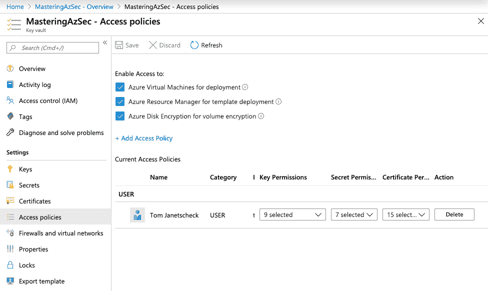
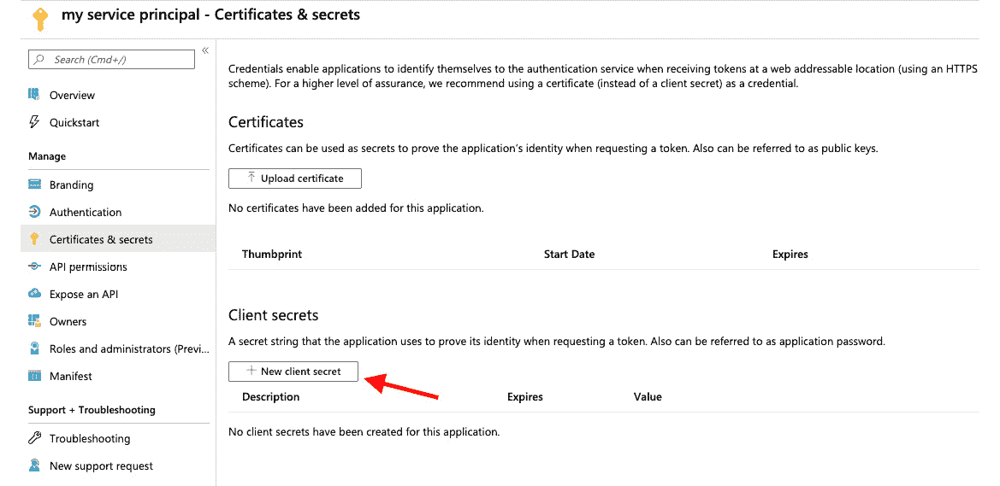
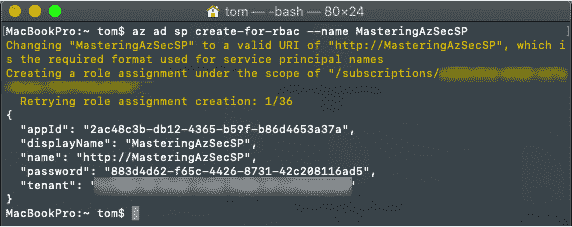
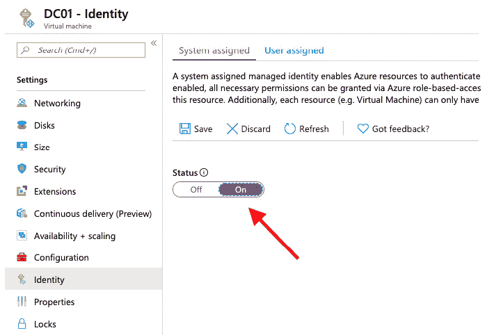
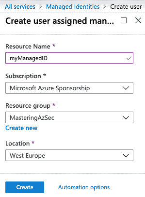

# *第五章*：Azure 密钥保管库

谈到云计算时，讨论往往集中在数据保护、加密、合规性、数据丢失（和数据丢失预防）、信任和其他围绕相同主题的流行词。它们的共同点是需要一个可信的服务，帮助它们在不让云供应商访问您的数据和相应加密密钥的情况下保护云数据。假设您想创建一个 Azure 资源，如虚拟机，需要管理员凭据。在这种情况下，您不希望在部署脚本或模板中硬编码用户名和密码，对吧？这就是 Azure 密钥保管库发挥作用的场景。在本章中，我们将涵盖以下主题：

+   理解 Azure 密钥保管库

+   理解服务对服务的身份验证

+   在部署场景中使用 Azure 密钥保管库

# 理解 Azure 密钥保管库

Azure 密钥保管库是用于密钥、秘密和证书的安全云存储解决方案。令牌、密码、证书、API 密钥和其他秘密可安全存储，并且可以使用 Azure 密钥保管库精细控制对它们的访问。该服务还可用作密钥管理解决方案。Azure 密钥保管库可以轻松创建和控制用于加密数据的加密密钥。另一个使用场景是安全套接字层/传输层安全性 (SSL/TLS) 证书的注册和管理。您可以使用 Azure 密钥保管库管理 Azure 和内部连接资源的证书生命周期管理。存储在 Azure 密钥保管库中的秘密和密钥可以通过软件或已通过 FIPS 140-2 Level 2 验证的 HSM（硬件安全模块）进行保护。

正如您已经了解的那样，您可以使用 Azure 密钥保管库来管理密钥、秘密和证书。

+   加密密钥用于数据加密。Azure 密钥保管库将密钥表示为**JSON Web Key**（**JWK**）对象，它们声明为软密钥或硬密钥。硬密钥在**硬件安全模块**（**HSM**）中处理，而软密钥由 Azure 密钥保管库在软件中处理。软密钥仍然在静态状态下使用存储在 HSM 中的硬密钥进行加密。客户端可以请求 Azure 密钥保管库生成密钥或导入现有的 RSA 或**椭圆曲线**（**EC**）密钥。RSA 和 EC 是 Azure 密钥保管库支持的算法。

+   Azure 密钥保管库是在 Azure Key Vault 中加密和存储的字符串。秘密可用于安全存储密码、存储帐户密钥和其他高价值字符串。

+   Azure Key Vault 中的证书是由 **公钥基础设施**（**PKI**）颁发的 x509 证书。你可以让 Azure Key Vault 向支持的公 **认证机构**（**CA**）请求证书，目前支持的认证机构有 DigiCert 和 GlobalSign，或者你可以在 Azure Key Vault 中创建 **证书签名请求**（**CSR**），然后手动让你选择的任何公认证机构签署该 CSR。

本章将教你如何操作密钥库实体。但在此之前，我们先来看看 Azure Key Vault 中的服务到服务认证，这是在部署或资源管理操作中使其他 Azure 服务能够利用 Azure Key Vault 所需的认证方式。

访问 Azure Key Vault 是通过 RBAC（角色基础访问控制）授予的。也就是说，你需要拥有一个 Azure AD 账户才能访问该服务，这意味着你可以使用所有在*第三章*中讨论的交互式身份验证保护选项，*管理云身份*。此外，访问 Azure Key Vault 保护的项目可以限制为仅访问 Azure Key Vault 的单个方面。例如，可以只授予某个账户访问机密的权限，而不授予访问密钥或证书的权限，或者你可以只授予某个账户部分权限，但允许其访问密钥库中存储的所有实体。这种细粒度的权限管理，除了 RBAC 只能授予对 Azure Key Vault（作为 Azure 资源）的访问外，是通过访问策略实现的。接下来的部分将更详细地讨论这些策略。

## 理解访问策略

通过访问策略，你可以精细地定义谁可以获得 Azure Key Vault 单个实例的哪些级别的访问权限：



图 5.1 – Azure Key Vault 访问策略

如前面的截图所示，名为 Tom 的用户账户被授予了在 Azure Key Vault **MasteringAzSec** 部分的 **访问策略** 设置中访问密钥、机密和证书的多个权限。除此之外，你还可以为 Azure 虚拟机、ARM 和 Azure 磁盘加密启用密钥和机密的访问权限。如果你希望在虚拟机部署期间允许你租户中的 Azure 虚拟机读取机密（以便在部署时检索），或者希望允许 Azure 资源管理器检索机密以便在模板部署中使用，那么这些选项是必要的。第三个选项指定是否允许 Azure 磁盘加密服务——该服务使用 BitLocker 或 dm-crypt（根据 Azure 虚拟机中使用的操作系统）对虚拟机的磁盘进行加密——从 Azure Key Vault 检索机密并解密存储在密钥中的值。

在我们继续学习如何使用 Azure Key Vault 实现服务到服务的认证之前，首先让我们更深入地了解一下 Azure Key Vault 中的各个单独实体。

# 理解服务到服务认证

正如我们之前提到的，访问 Azure 密钥库及其实体通常是按用户授予的。也就是说，为了启用服务到服务的身份验证，您可以创建一个 Azure AD 应用及其凭证，并使用此服务主体为您的应用获取访问令牌。这是一个非常简单的过程：

1.  转到 **Azure Active Directory** | **应用注册**，在 Azure 门户中选择 **新建注册** 以启动向导：

    ](img/Fig_5.2.jpg)

    图 5.2 – 创建新的应用注册

1.  输入名称并确认您的选择。

1.  通过导航到应用注册中的**证书与密钥**选项，然后选择**新建客户端密钥**来创建客户端密钥：

    ](img/Fig_5.3.jpg)

    图 5.3 – 创建新的客户端密钥

1.  输入描述并决定密钥是将在 1 年或 2 年后过期，还是始终有效。确认选择并退出向导后，系统将显示新的客户端密钥及其值，您可以复制该值并用于身份验证：


](img/Fig_5.4.jpg)

图 5.4 – 您的客户端密钥

一种更快捷的方法是使用 Azure CLI。通过以下命令，您可以轻松创建一个名为 `MasteringAzSecSP` 的新服务主体：

```
Az ad sp create-for-rbac --name MasteringAzSecSP
```

引擎将使用默认设置进行账户创建，完成后，您将在 CLI 窗口中找到用户名 `appId` 和客户端密钥密码，如下截图所示`：`



](img/Fig_5.5.jpg)

图 5.5 – 使用 Azure CLI 创建新的服务主体

服务主体在访问管理方面类似于用户账户，这意味着您可以将用户名（应用或客户端 ID）作为主体，在授予对密钥库及其实体的访问权限时使用。

尽管这种方法效果很好，但也有两个缺点：

+   在创建应用凭据时，您将获得应用 ID 和客户端密钥，这些通常是硬编码在源代码中的。这是一个两难问题，因为您无法将这些凭据存储在 Azure 密钥库中，因为在授予对密钥库的访问权限之前需要进行身份验证。

+   应用凭证会过期，续订过程可能会导致应用停机。您不希望使用一个永不过期并且硬编码在源代码中的客户端密钥。

因此，对于自动化部署，我们需要另一种方法，这就是**Azure 资源的托管标识**服务的作用所在。那么，让我们进一步了解此服务如何解决这一难题。

## 理解 Azure 资源的托管标识

经常会遇到需要凭据才能访问服务的常见问题。Azure Key Vault 是应用程序设计的重要组成部分，因为您可以使用它安全地存储和管理其他服务的凭据。但是 Azure Key Vault 本身是一个在授予权限之前需要进行身份验证的服务。通过 *Azure 资源的托管身份*，Azure Active Directory 的一个免费功能，您可以解决这个困境。该服务为其他 Azure 服务提供在 Azure AD 中自动管理的身份。

服务中有两种不同类型的托管身份：

+   系统分配的托管身份直接启用在 Azure 服务实例上。启用托管身份时，Azure AD 自动在 Azure AD 中为特定服务创建一个身份，该身份自动由创建服务实例的 Azure 订阅信任。身份创建后，凭据将自动提供给服务实例。身份的生命周期直接与服务的生命周期相关联，这意味着当服务被删除时，系统分配的托管身份将自动从 Azure AD 中删除。

+   用户分配的托管身份是手动创建的 Azure 资源。创建用户分配的托管身份时，Azure AD 将在 Azure AD 租户中创建一个服务主体，该主体由当前使用的 Azure 订阅信任。创建身份后，可以将其分配给一个或多个 Azure 服务实例。用户分配的托管身份的生命周期与分配给身份的服务的生命周期分开管理。换句话说，当具有用户分配的托管身份的 Azure 资源被删除时，托管身份不会自动从 Azure AD 中删除。

系统分配的托管身份与 Azure 资源之间的关系是 1:1，这意味着一个 Azure 资源只能有一个系统分配的托管身份，并且此身份只能由其创建的特定服务使用。

用户分配的托管身份与 Azure 资源之间的关系是 `n:n`，这意味着您可以同时使用多个用户分配的托管身份与一个 Azure 资源，并且一个单独的用户分配的托管身份可以被多个不同的 Azure 资源使用。

重要说明

Microsoft 提供了一个 Azure 服务列表，当前支持系统分配、用户分配或两种类型的托管身份，详见 [`docs.microsoft.com/en-us/azure/active-directory/managed-identities-azure-resources/services-support-managed-identities.`](https://docs.microsoft.com/en-us/azure/active-directory/managed-identities-azure-resources/services-support-managed-identities)

在 Azure 门户中创建系统分配的托管身份的过程非常简单。所有当前支持托管身份的 Azure 资源，在资源的**设置**部分都会有一个**身份**选项：



图 5.6 – 为 Azure 虚拟机激活系统分配的托管身份

以下步骤展示了如何为 Azure 虚拟机激活系统分配的托管身份：

1.  在**设置**页面，你可以选择是要激活系统分配的托管身份，还是要分配用户分配的托管身份。要激活系统分配的托管身份，你只需将**状态**切换按钮设置为**开启**，然后保存你的选择，如前面的截图所示。

1.  然后你将被告知，一旦你确认此配置，你的资源的托管身份将会注册到 Azure AD，且一旦该过程完成，你可以授予该托管身份权限。在前面的示例中，我已为名为 `DC01` 的 Azure 虚拟机启用了系统分配的托管身份。

1.  在创建新的密钥库访问策略时，我们现在可以选择具有相同名称的身份，授予其访问密钥库实体的权限。

如果你想创建一个新的用户分配的托管身份，你需要在 Azure 门户中导航到托管身份服务：

1.  为此，请前往**所有资源**，然后搜索**托管身份**。

1.  一旦找到对话框，你可以选择创建一个新的用户分配的托管身份。如前所述，这是一个新的 Azure 资源，因此需要在 Azure 订阅中创建并存储在 Azure 资源组中：

    图 5.7 – 创建用户分配的托管身份

1.  一旦用户分配的托管身份创建完成，你可以将其分配给你的 Azure 资源，就像我们在前述场景中使用的虚拟机一样。

托管身份还可以用于 Azure DevOps 或 Terraform 对你的 Azure 环境进行身份验证。

重要提示

你也可以使用 Azure CLI、PowerShell、ARM 模板和 Terraform 来在 Azure 中创建托管身份。你可以在为本书创建的 GitHub 仓库中找到这些方法的示例，地址为 [`github.com/PacktPublishing/Mastering-Azure-Security`](https://github.com/PacktPublishing/Mastering-Azure-Security)。

假设你只想通过 DevOps 管道来允许创建 Azure 资源，并包括所有相关的过程，比如拉取请求、编写等。从技术角度来看，Azure DevOps 无非是一个需要被授权访问 Azure 订阅（或管理组）的应用程序。因此，Azure DevOps 需要一个服务主体，可以手动管理为应用程序注册，并承担所有缺点，或者可以通过托管身份进行自动管理。同样适用于 Terraform，它也只是一个需要在 Azure 环境中具有权限的应用程序。

重要提示

你可以使用托管身份进行 Terraform 身份验证以访问 Azure AD；然而，在这种情况下，托管身份是为 Azure 虚拟机创建的，而 Terraform 需要从虚拟机内部启动，以便可以使用该身份。

现在你已经了解了托管身份的工作原理，以及服务间身份验证的选项，让我们向前迈进一步，看看如何在部署场景中使用 Azure Key Vault。

# 在部署场景中使用 Azure Key Vault

Azure Key Vault 是一个很好的服务，用于安全地存储和检索在资源创建过程中需要的凭据。它还帮助你使用自己的加密密钥对 Azure 资源（如 Azure 存储账户或虚拟机磁盘）进行加密。

在本节中，我们将介绍几种在部署场景中使用 Azure Key Vault 的选项。你将找到 PowerShell、ARM 模板和 Terraform 的示例，因为这些是创建 Azure 资源时最常见的部署工具。

重要提示

你需要经历的第一步是通过一个在 Azure 环境中已经分配了适当访问权限的主体进行 Azure AD 身份验证，具体取决于你要执行的任务和受其影响的资源。

你准备好了吗？那么我们从创建一个新的 Azure 密钥保管库开始，并创建一个可以在接下来的虚拟机部署场景中使用的机密。

## 创建 Azure 密钥保管库和机密

和所有 Azure 资源一样，你可以使用 Azure 门户来创建和管理 Azure 密钥保管库。尽管通过门户点击操作可能很方便，但使用脚本或模板语言来做这件事会是更好的选择。Azure Key Vault 是自动化部署中的一个关键资源。现在，还没有办法在同一个密钥保管库中对相同类型的单个项授予细粒度的访问权限。你可以管理密钥、机密和证书的访问级别，但只能在密钥保管库级别管理，而不能在项级别管理。因此，你可能希望在同一个 Azure 订阅中创建多个密钥保管库。通过使用部署自动化，你可以确保环境中的所有密钥保管库都遵循你定义的规则和策略。

### 在 PowerShell 中创建密钥保管库

由于 PowerShell 是一种命令式脚本语言，你需要按正确的顺序定义所有必要的步骤：

1.  首先，你需要使用具有适当访问权限的帐户登录，以便在你的 Azure 订阅中创建一个新的资源组和 Azure 密钥保管库实例：

    ```
    # Login to your Azure subscription
    Login-AzAccount
    ```

1.  然后，你将被提示输入 Azure 登录凭据，PowerShell 将使用这些凭据执行后续步骤。登录后，你可以创建一个新的资源组，或引用一个现有的资源组。

1.  现在我们假设将使用以下代码片段创建一个新的资源组。在此之前，先定义所有变量的值，然后再在后续脚本部分中使用：

    ```
    # Define variable values
    $rgName = "myResourceGroup"
    $azRegion= "WestEurope"
    $kvName = "myAzKeyVault"
    $secretName = "localAdmin"
    $localAdminUsername = "myLocalAdmin"
    # Create a new resource group in your Azure suscription
    $resourceGroup = New-AzResourceGroup `
    -Name $rgName `
    -Location $azRegion
    ```

1.  现在，你可以继续创建一个新的 Azure 密钥保管库：

    ```
    VaultName defines the name of the Azure key vault. We are using the $kvName variable, which is defined at the beginning of the script.
    ```

1.  `ResourceGroupName` 定义了密钥保管库将要创建的 Azure 资源组。

1.  `Location` 定义了密钥保管库将要创建的 Azure 区域。

还有一些可选参数，在前面的部分中已经定义：

+   `EnabledForDeployment` 使 `Microsoft.Compute` 资源提供者能够在资源创建过程中从 Azure 密钥保管库中检索机密——例如，在部署新虚拟机时。

+   `EnabledForTemplateDeployment` 使 **Azure 资源管理器**（**ARM**）能够在模板部署中引用 Azure 密钥保管库时获取机密，例如，在使用 ARM 或 Terraform 时。

+   `EnabledForDiskEncryption` 使 **Azure 磁盘加密** 服务能够从 Azure 密钥保管库获取机密并解开密钥，以便在磁盘加密过程中使用。

+   `SKU` 定义了 Azure 密钥保管库的 SKU（标准或高级）。

1.  在 Azure 密钥保管库创建完成后，你需要创建一个访问策略。在以下示例中，我们为当前登录的用户帐户授予对新 Azure 密钥保管库中机密的访问权限：

    ```
    # Grant your user account access rights to Azure Key Vault secrets
    Set-AzKeyVaultAccessPolicy `
    	-VaultName $kvName `
    	-ResourceGroupName $rgName `
    	-UserPrincipalName (Get-AzContext).account.id `
    	-PermissionsToSecrets get, set
    ```

1.  然后，你可以创建一个新的密钥保管库机密。在以下代码片段中，你将在 PowerShell 会话中将机密作为安全字符串输入：

    ```
    # Create a new Azure Key Vault secret
    $password = read-host -assecurestring
    Set-AzKeyVaultSecret ` 
    	-VaultName $kvName `
    	-Name $secretName `
    	-SecretValue $password
    ```

恭喜！你刚刚使用 PowerShell 创建了你的第一个 Azure 密钥保管库和一个机密。现在，你已经了解了如何为你的部署场景创建 Azure 密钥保管库和密钥保管库机密，我们可以进入下一部分——*Azure 虚拟机部署*，在这里你将学习如何在更复杂的场景中使用你刚创建的资源。

## Azure 虚拟机部署

在部署 Azure 虚拟机时，你总是需要在部署过程中传递本地管理员凭据。通过 Azure 门户部署虚拟机的缺点是，你需要手动输入相应的本地管理员凭据，而不是使用存储在 Azure 密钥保管库中的机密。这只是基础设施即代码部署在企业环境中显得特别有意义的原因之一。在本节中，你将学习如何引用存储在 Azure 密钥保管库中的凭据，而不是将信息硬编码在部署脚本或模板中。

我们将从使用 PowerShell 引用虚拟机部署的密钥保管库机密开始。

### 使用 PowerShell 部署虚拟机

你可以通过 PowerShell 轻松访问 Azure 密钥保管库中的机密，也可以通过 ARM 模板和 Terraform 进行访问。接下来，我们将通过以下步骤演示如何做到这一点：

1.  在你获取到机密后，需要创建一个新的 `PSCredential` 对象，该对象可以在虚拟机部署中使用，如下所示：

    ```
    # retrieve an Azure Key Vault secret
    $secret = Get-AzKeyVaultSecret `	-VaultName $kvName `
    	-Name $secretName
    # Create a new PSCredential object
    $cred = [PSCredential]::new($localAdminUsername,$secret.SecretValue)
    ```

1.  后续，你可以在部署中相应的位置使用这个 `PSCredential` 对象。它看起来类似于以下代码片段：

    ```
    $myVM = Set-AzVMOperatingSystem ` 
    	-VM $myVM `
    	-Windows `
    	-ComputerName $vmName `
    	-Credential $cred `
    	[…]
    ```

在 PowerShell 脚本中使用变量总是一个好主意。通过这样做，你可以在脚本的开头创建一个变量部分，在其中定义根据需求和脚本所用环境而变化的值。

提示

由于完整的 PowerShell 虚拟机部署脚本包含近 200 行，我们没有在书中打印出来，而是将其发布在了本书的 GitHub 仓库中。

PowerShell 是一种很好的部署 Azure 资源的方式，但由于它是一种命令式脚本语言，因此并不适合在 DevOps/CI/CD 场景中使用。这就是为什么我们将在下一节中解释如何在 Terraform 中引用密钥保管库机密。

### 在 Terraform 中引用密钥保管库机密

在 Terraform 中，你可以通过数据源引用现有的 Azure 对象。对于密钥保管库机密，数据源被称为 `azurerm_key_vault_secret`：

```
# Azure Key Vault data source to access local admin password
data "azurerm_key_vault_secret" "mySecret" {
	name = "secretName"
	key_vault_id = "/subscriptions/GUID/resourceGroups/RGName/providers/Microsoft.KeyVault/vaults/VaultName"
}
```

然后，可以在 Terraform 部署模板的 `os_profile` 部分引用该对象，如下图所示：

```
os_profile {
	computer_name = "myVM"
	admin_username = "myLocalAdminUserName"
	admin_password = "$(data.azurerm_key_vault_secret.mySecret.value)"
}
```

Terraform 是一种相对简单的 Azure 资源部署和引用方式。如前面的例子所示，你只需定义一个数据源，然后在部署模板的相应资源部分引用它。

提示

我们在本书的 GitHub 仓库中发布了一个完整的 Terraform 虚拟机部署示例：[`github.com/PacktPublishing/Mastering-Azure-Security`](https://github.com/PacktPublishing/Mastering-Azure-Security)

ARM 模板是微软在 DevOps 管道中使用自动 Azure 资源部署的方式。这个例子将在以下章节中详细描述。

### 在 ARM 模板中引用密钥保管库机密

ARM 模板可能是引用密钥保管库机密的最复杂方式，因为在这种情况下需要使用链接模板。也就是说，你需要有两个不同的模板文件，分别用于不同的目的。

主要模板作为引用现有 Azure 资源的参考，例如 Azure 密钥保管库及其机密。在其中，有一个 `parameters` 部分，包含的值可以直接在主模板中定义，或者通过外部调用（如 Azure CLI 或 PowerShell 调用）传递到模板中，然后直接传递给链接模板。

如果 `parameters` 部分由管道输入填充，它将只包含参数的定义：

```
"parameters": {
	"vaultName": {
		"type": "string"
	},
	"vaultResourceGroup": {
		"type": "string"
	},
	"secretName": {
		"type": "string"
	}
}
```

如果参数值在主模板中定义，那么这一部分将如下所示：

```
"parameters": {
	"vaultName": {
		"type": "string",
		"defaultValue": "<default-value-of-parameter>"
	},
	"vaultResourceGroup": {
		"type": "string",
		"defaultValue": "<default-value-of-parameter>"
	},
	"secretName": {
		"type": "string",
		"defaultValue": "<default-value-of-parameter>"
	}
}
```

在 `parameters` 部分之后，有一个 `resource` 部分，其中定义了密钥保管库的引用：

```
"parameters": {
	"adminPassword": {
		"reference": {
			"keyVault": {
				"id": "[resourceId(subscription().subscriptionId,  parameters('VaultResourceGroup'), 'Microsoft.KeyVault/vaults', parameters('vaultName'))]"
			},
			"secretName": "[parameters('secretName')]"
		}
	}
}
```

*链接模板* 用于实际的资源部署。在这个文件中，定义了本地管理员用户名，但密码值是从主模板传递过来的，具体如下：

```
"resources": {
"parameters": {
		"adminUsername": {
			"type": "string",
			"defaultValue": "localAdminUsername",
			"metadata": {
				"description": ""
			}
		},
		"adminPassword": {
			"type": "securestring"
		}
}
}
```

使用 ARM 模板引用密钥保管库的秘密稍微复杂一些，但在 DevOps 管道中也能很好地工作。

提示

我们在本书的 GitHub 仓库中发布了一个完整的 VM 部署示例，使用了 ARM 模板：[`github.com/PacktPublishing/Mastering-Azure-Security`](https://github.com/PacktPublishing/Mastering-Azure-Security)

你现在已经学会了如何在自动化的 Azure 资源部署中使用 Azure 密钥保管库和密钥保管库的秘密，包括使用 PowerShell、Terraform 和 ARM 模板。请务必查看本书的 GitHub 仓库，那里有我们在本章中概述的步骤示例，供你参考。

# 总结

Azure Key Vault 是 Azure 中许多被低估但在安全方面非常有价值的服务之一。在这一章中，你学习了如何通过 Azure 门户、脚本和部署语言创建 Azure 密钥保管库及其实体。现在你知道如何为个人用户和 Azure 资源授予对 Azure 密钥保管库的访问权限，并且知道如何引用已安全存储在密钥保管库中的项目。

在下一章中，我们将讨论数据安全和加密这两个高度依赖 Azure Key Vault 的主题，因此在继续阅读之前，请确保你已阅读并理解了本章内容。

# 问题

1.  Azure Key Vault 用于保护……

    A. 密钥

    B. 秘密

    C. 证书

    D. 以上所有

    E. 以上都不是

1.  我们如何控制谁可以访问 Azure Key Vault 信息？

    A. 密钥保管库权限

    B. 访问策略

    C. 条件访问

1.  服务到服务的认证是通过……

    A. 服务主体

    B. 证书

    C. 直接链接

1.  为了使用 Azure Key Vault 进行 `启用部署`

    B. `启用模板部署`

    C. `启用磁盘加密`

1.  为了使用 Azure Key Vault 进行 `启用部署`

    B. `启用模板部署`

    C. `启用磁盘加密`

1.  为了使用 Azure Key Vault 进行虚拟机加密，我们需要启用哪个选项？

    A. `启用部署`

    B. `启用模板部署`

    C. `启用磁盘加密`

1.  为了在部署过程中保护秘密，我们需要……

    A. 提供密码

    B. 加密密码

    C. 引用 Azure 密钥保管库
