# *第六章*：数据安全

像其他一切一样，云中的数据必须与本地环境中的数据不同对待。由于数据离开了我们的本地环境，并通常可以通过互联网访问，我们需要格外小心。我们已经提到过，所有数据在静态时都进行了加密，大多数通信也通过 **HTTPS**（**超文本传输协议安全套接字层**）进行，并在传输过程中加密。然而，我们可以采取多种措施来确保额外的安全性，并满足合规性和不同的安全要求。

在本章中，我们将广泛使用 Azure Key Vault。我们已经看到 Azure Key Vault 如何用于机密和密码管理，但我们还将看到它如何用于增强数据安全性。

本章将涵盖以下主题：

+   理解 Azure 存储

+   理解 Azure 虚拟机磁盘

+   在 Azure SQL 数据库上工作

# 技术要求

本章需要以下内容：

+   Windows 上的 PowerShell 5.1 或更高版本（或在任何其他平台上，包括 Windows 的 PowerShell Core 6.x 及更高版本）

+   Azure PowerShell 模块

+   Visual Studio Code

+   一个 Azure 订阅

# 理解 Azure 存储

Azure 存储是微软的云存储服务，具有高可用性、安全性和可扩展性，此外，它还支持多种编程语言。通常，当用户开始使用 Azure 时，Azure 存储是他们首先接触到的数据服务。

所有 Azure 数据中心内部的通信都通过 HTTPS 进行，但当我们从外部访问数据时会发生什么呢？根据共享责任模型（在*第一章*，*Azure 安全简介*中有解释），这属于用户的责任。由于不同用户的需求，微软默认不强制要求流量通过 HTTPS，但用户可以启用一个选项，强制要求流量加密。

在 **配置** 下，有一个选项叫做 **要求安全传输**。为了确保所有流量都加密并通过 HTTPS 进行，我们需要启用此选项，如下图所示：

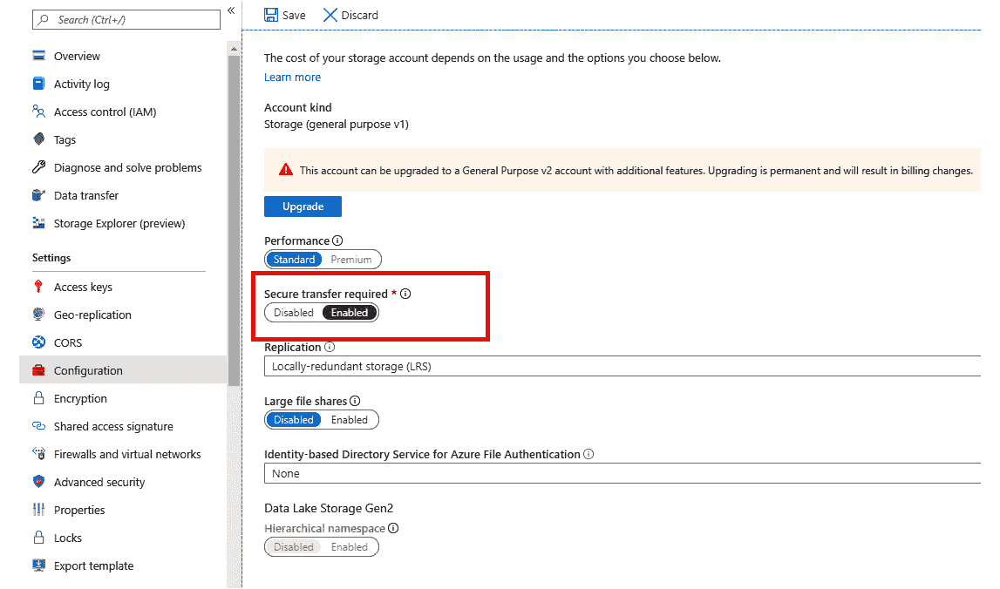

图 6.1 – Azure 存储安全传输

当启用 **要求安全传输** 时，所有不是通过 HTTPS 的请求将被拒绝，即使它们具有有效的访问参数（如访问签名或令牌）。这通过仅允许通过安全连接发起的请求来增强传输安全性。

重要提示

需要记住的是，Azure 存储不支持自定义域名的 HTTPS，因此在使用自定义域名时此选项不适用。

我们还需要考虑的是，当文件被意外删除时会发生什么。这可能有多种原因，例如用户错误地删除了文件，或者多个应用程序使用相同的 Azure 存储，导致一个应用程序删除了另一个应用程序需要的文件。当然，这种情况也可能是恶意攻击所致，旨在造成损害。为了避免此类情况，我们可以在**数据保护**设置中启用**Blob 软删除**选项。

以下截图展示了一个示例：

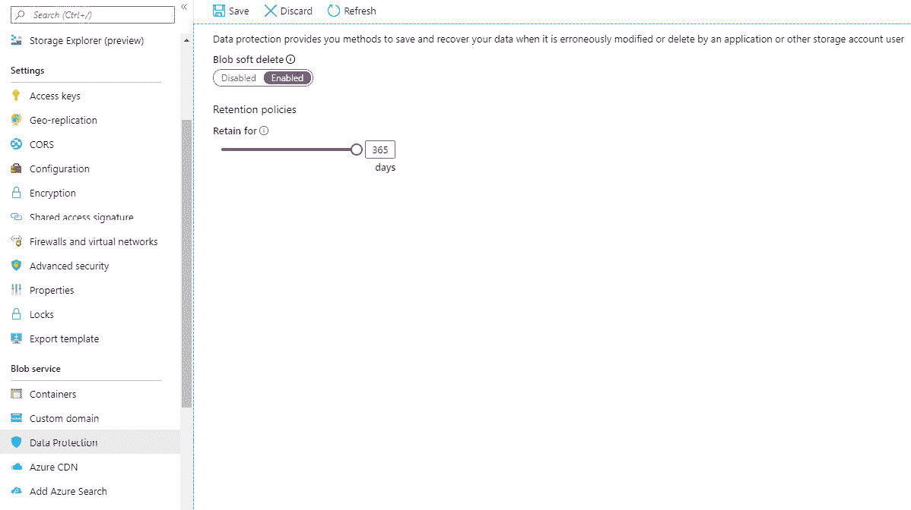

图 6.2 – Blob 软删除

`7`天和`365`天。除了恢复已删除的文件外，**Blob 软删除**还使我们能够恢复文件的以前版本。如果文件被意外修改，或者我们因其他原因需要文件的先前版本，**Blob 软删除**可以帮助我们将文件恢复到任何时间点，只要它在有效保留期的时间范围内。

重要说明

**Blob 软删除**和保留期限从设置的那一刻起生效，并且无法追溯使用。例如，如果我们发现丢失了文件，然后启用此选项，它将无法帮助我们恢复丢失的文件。为了能够恢复文件，我们需要在事件发生之前就启用此选项。

Azure 中的数据是静态加密的，Azure 存储也不例外。但数据是使用 Microsoft 管理的密钥进行加密的，这在某些情况下可能不可接受。由于合规性和安全要求，我们必须控制用于加密的密钥。为了解决这些需求，微软启用了**使用您自己的密钥**（**BYOK**）选项。您可以在**加密**选项下启用使用您自己的密钥，如下图所示：


图 6.3 – Azure 存储加密选项

通过使用 Azure 密钥库启用 BYOK，其中用于存储加密的密钥存储在密钥库中。

一旦我们启用**使用您自己的密钥**，新的设置将会出现，我们需要提供密钥库信息。以下截图展示了一个示例：

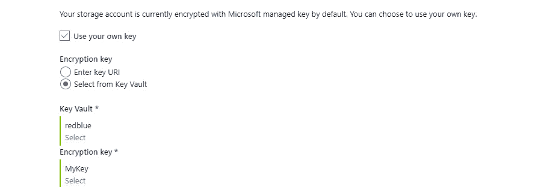

图 6.4 – 使用自定义密钥的存储加密

我们可以提供一个**统一资源标识符**（**URI**），该 URI 包含有关将用于加密的密钥库和密钥的信息，或者我们可以使用第二个选项，允许我们从列表中选择可用的密钥库和密钥。这两种选项的结果是相同的，存储将会被加密。任何新增的文件将自动加密。任何现有的文件将通过后台加密过程进行追溯加密，但这个过程不会立即完成，现有数据的加密过程需要一些时间。

在 Azure 密钥库中可以轻松创建密钥，但我们也可以从**硬件安全模块**（**HSM**）导入现有密钥。这是为了进一步的安全性和合规性要求，并启用最终的密钥管理，其中加密密钥由专用的加密处理器保护。

Azure 存储中的加密不仅可以通过 Azure 门户提供，还可以通过使用 Azure PowerShell 实现。以下脚本将创建一个新的 Azure 存储帐户、密钥库和密钥，然后使用所有提供的资源来加密刚刚创建的 Azure 存储帐户：

```
New-AzResourceGroup -Name 'Packt-Encrypt' -Location 'EastUS'
$storageAccount = Set-AzStorageAccount -ResourceGroupName 'Packt-Encrypt' `
    -Name packtstorageencryption `
    -AssignIdentity
New-AzKeyvault -name 'Pact-KV-01' -ResourceGroupName 'Packt-Encrypt' `
-Location 'EastUS' `
-EnabledForDiskEncryption `
-EnableSoftDelete `
-EnablePurgeProtection
$KeyVault = Get-AzKeyVault -VaultName 'Pact-KV-01' -ResourceGroupName 'Packt-Encrypt'
Set-AzKeyVaultAccessPolicy `
    -VaultName $keyVault.VaultName `
    -ObjectId $storageAccount.Identity.PrincipalId `
    -PermissionsToKeys wrapkey,unwrapkey,get,recover
$key = Add-AzKeyVaultKey -VaultName $keyVault.VaultName -Name 'MyKey' -Destination 'Software'
Set-AzStorageAccount -ResourceGroupName $storageAccount.ResourceGroupName `
    -AccountName $storageAccount.StorageAccountName `
    -KeyvaultEncryption `
    -KeyName $key.Name `
    -KeyVersion $key.Version `
    -KeyVaultUri $keyVault.VaultUri 
```

另一个需要考虑的 Azure 存储问题是**高级威胁保护**（**ATP**）。此选项在**高级安全性**下启用，它将我们的安全性提升到一个新的水平。它利用安全智能来检测任何对我们数据的威胁，并提供建议以提高安全性。

存储帐户下的**高级威胁保护**刀片示例如下图所示：


图 6.5 – Azure 存储 ATP

ATP 将我们的安全设置与推荐的基准进行比较，并为我们提供可以实施的额外安全选项。第二部分是检测异常和潜在有害的访问或利用 Azure 存储的尝试。ATP 与 Azure 安全中心紧密相关，Azure 安全中心将在*第七章*中讨论，*Azure 安全中心*。但存储帐户并不是唯一与存储相关的 Azure 服务，几乎所有 Azure 服务都使用某种形式的存储。在这些服务中，我们有 Azure **虚拟机**（**VM**）磁盘，接下来我们看看如何使这些更加安全。

# 理解 Azure 虚拟机磁盘

Azure 虚拟机是微软**基础设施即服务**（**IaaS**）的一部分，是很多用户在云端旅程初期遇到的服务。当用户需要对环境进行更多控制时，通常会选择 Azure 虚拟机，而其他服务无法提供如此控制。但更多的控制也意味着更多的责任。

除了在*第四章*中讨论的网络管理，*Azure 网络安全*，我们还需要解决如何处理 Azure VM 中的数据，主要是指磁盘。与所有其他数据一样，Azure 虚拟机的磁盘在静态时会进行加密，并且虚拟机使用 Azure 服务结构来安全访问这些磁盘上存储的内容。

但如果我们决定下载或导出这些机器使用的磁盘会发生什么呢？一旦磁盘离开 Azure，它将处于未加密状态，并且可以被任何方式使用。这就暴露了某些需要解决的安全漏洞。如果有人获得 Azure 访问权限（但没有虚拟机的访问权限）并下载磁盘会怎么样？如果有人决定将所有磁盘备份到不安全的地方呢？这些只是可能导致未经授权和恶意访问 Azure 虚拟机磁盘的一些情景。

幸运的是，我们可以选择使用 Azure 密钥库并启用进一步的磁盘加密。以这种方式加密的磁盘即使在导出、下载或以任何方式离开 Azure 数据中心后，依然保持加密状态。

如果我们进入 Azure 虚拟机并查看我们的磁盘，我们可以看到，默认情况下，磁盘加密没有启用。下面的截图展示了一个示例：


图 6.6 – Azure 虚拟机磁盘加密选项

我们需要使用 Azure 密钥库，并且需要将密钥存储在密钥库中。

我们可以使用 Azure PowerShell 启用 Azure 虚拟机磁盘的加密。这里提供了一个示例脚本：

```
New-AzResourceGroup -Name "Packt-Encrypt" -Location "EastUS"
$cred = Get-Credential 
New-AzVM -Name 'Packt-VM-01' `
-Credential $cred `
-ResourceGroupName 'Packt-Encrypt' `
-Image win2016datacenter `
-Size Standard_D2S_V3
New-AzKeyvault -name 'Pact-KV-01' `
-ResourceGroupName 'Packt-Encrypt' `
-Location EastUS `
-EnabledForDiskEncryption `
-EnableSoftDelete `
-EnablePurgeProtection
$KeyVault = Get-AzKeyVault -VaultName 'Pact-KV-01' -ResourceGroupName 'Packt-Encrypt'
Set-AzVMDiskEncryptionExtension -ResourceGroupName 'Packt-Encrypt' `
-VMName 'Packt-VM-01' `
-DiskEncryptionKeyVaultUrl $KeyVault.VaultUri `
-DiskEncryptionKeyVaultId $KeyVault.ResourceId
Get-AzVmDiskEncryptionStatus -VMName Packt-VM-01 -ResourceGroupName Packt-Encrypt 
```

该脚本创建了一个新的 Azure 虚拟机（VM）、一个新的密钥库以及一个新的密钥。创建的资源随后用于为刚创建的 Azure 虚拟机启用磁盘加密。最后，我们可以检查磁盘的状态，并验证它是否已成功加密。我们可以在 Azure 门户中验证磁盘是否已加密，如下图所示：

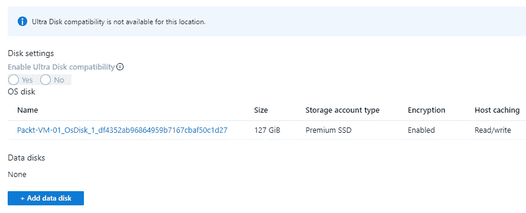

图 6.7– Azure 虚拟机门户

Azure 虚拟机的磁盘未加密：可以访问该磁盘，用于创建新的虚拟机（无论是 Azure 还是本地 Hyper-V），或者将其附加到现有的虚拟机。加密磁盘将阻止这种访问，除非用户可以访问在加密过程中使用的密钥库。

在 Azure SQL 数据库上工作

Azure SQL 数据库是微软的关系数据库云服务，属于平台即服务（PaaS）模型，通常被称为**数据库即服务**（**DBaaS**）。它具有高可用性并提供高性能的数据存储层。正因为如此，它通常是选择云数据库时的首选。

Azure SQL 数据库的设置中有一整节与安全性相关的功能。有四个不同的选项：

+   **高级数据安全性**

+   **审计**

+   **动态数据掩码**

+   **透明数据加密**

如果我们启用**高级数据安全性**，我们将获得一些优势：

+   **漏洞评估设置**

+   **高级威胁防护设置**

+   **数据发现与分类**

启用**高级数据安全性**的选项显示在以下截图中：

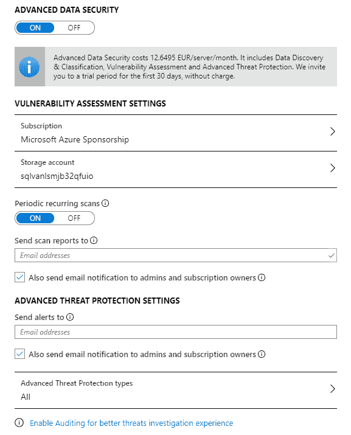

图 6.8 – Azure SQL 数据库高级数据安全性

这些选项中的每一个都有额外的配置，我们需要在使用**高级数据安全性**之前进行设置：

1.  **漏洞评估设置**需要 Azure 存储，数据将保存在此处，并根据当前状态提供安全建议。评估将手动执行，我们可以选择报告是否发送给特定用户，或者发送给所有管理员和订阅所有者。评估报告的格式如下：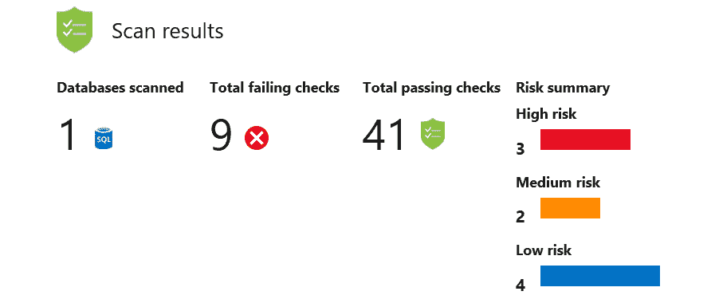

    图 6.9 – Azure SQL 数据库评估结果

    漏洞评估将我们当前的设置与基准进行比较，并提供未满足的检查项列表。它还根据风险级别对检查项进行分类：**高风险**、**中风险**和**低风险**。

1.  **高级威胁防护设置**与 Azure 存储中的此选项非常相似：它能够检测任何异常和潜在的有害因素。与 Azure 存储相比，我们有一些额外的设置：我们可以选择要检测的威胁类型，并定义在检测到威胁时通知的对象。

    我们可以监控的威胁列表如下图所示：

    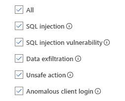

    图 6.10 – Azure SQL 数据库高级威胁防护设置

    类似于**漏洞评估设置**，关于威胁的通知可以发送给特定用户或所有管理员和订阅所有者。

1.  **高级数据安全性**下的最终选项是**数据发现与分类**。此选项进行数据评估，并对任何应该保密的数据提供分类。评估是根据各种合规性和安全要求进行的，数据根据一个或多个标准被分类为保密。例如，我们可能有一些用户信息，需要根据**通用数据保护条例**（**GDPR**）进行分类。但在用户信息中，我们可能有社会安全号码或信用卡号码，这些信息根据许多其他合规性要求进行分类。**数据发现与分类**仅提供有关分类数据类型的信息，但由用户决定如何处理以及如何进行。

这引出了 Azure SQL 数据库中的下一个安全设置——**动态数据屏蔽**。过去，我们可以根据不同的层级，如数据库、模式、表或行，提供用户访问权限。但我们无法根据列提供访问权限。**动态数据屏蔽**改变了这一点，使我们可以为用户提供对表的访问权限，同时屏蔽用户不应访问的某些列。

例如，假设我们希望提供对客户表的访问权限，但用户不应能够访问客户的电子邮件地址。我们可以在电子邮件列上创建数据掩码，用户将能够看到所有信息，除了被掩码的列，该列将显示为掩码（对于常见数据类型有默认的掩码，但也可以创建自定义掩码）。对于被掩码的列，我们可以排除某些用户。所有管理员默认被排除，并且无法排除。下面的截图展示了**动态数据掩码**的一个示例：

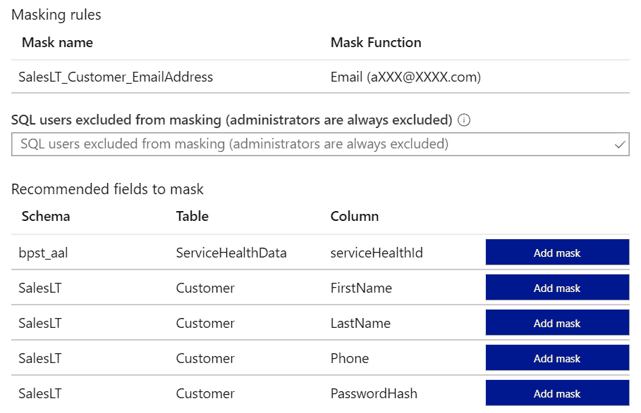

图 6.11 – 动态数据掩码

**动态数据掩码**与**数据发现与分类**相连接。用户将根据**数据发现与分类**提供的信息获得数据掩码建议。

**审计**选项使我们能够定义各种日志的存储位置。有三个不同的选项可用：

+   **存储**

+   **日志分析**

+   **事件中心**

由于许多法规和安全合规标准要求存储访问和事件日志，这个选项使我们不仅能够保留审计日志，还能在需要时帮助我们理解和追踪事件。审计可以针对单个数据库或服务器级别启用。如果启用了服务器级审计，日志将会为该服务器上的所有数据库保留。

Azure SQL 数据库的最后一个安全设置是**透明数据库加密**（**TDE**）。TDE 是一种对静态数据进行加密的方法，它在页面级别对数据和日志文件进行实时加密和解密。它使用**数据库加密密钥**（**DEK**）对数据、相关备份和事务日志进行加密。

对于较旧的数据库，此设置未启用，TDE 状态为**关闭**，**加密** **状态**为**未加密**。下面的截图展示了一个示例：

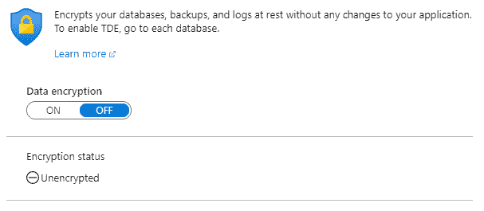

图 6.12 – Azure SQL 数据库 TDE 设置

对于较新的数据库，TDE 已经启用，且加密状态为加密，如下图所示：

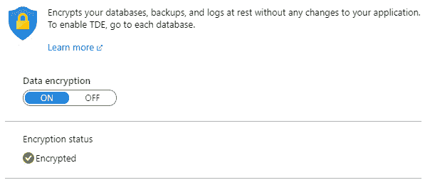

图 6.13 – 使用 TDE 加密的 Azure SQL 数据库

我们可以通过为较旧的数据库开启 TDE 达到相同的效果。然而，这种方法使用 Microsoft 提供的密钥进行加密。如果我们需要遵循法规和安全合规标准，并且自行管理密钥，我们必须再次转向 Azure **密钥保管库**。要使用来自 Azure **密钥保管库**的自定义密钥启用 TDE，我们必须在服务器级别启用此设置。在 TDE 设置下，**服务器**下，我们可以开启**使用您自己的密钥**，如以下截图所示：

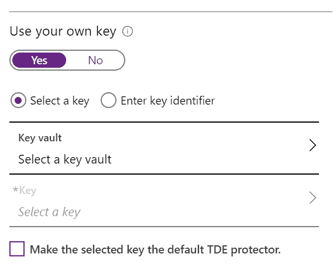

图 6.14 – 使用自定义密钥进行 TDE

一旦启用此选项，我们需要提供将使用的密钥保管库和密钥。可选地，我们可以将所选密钥设置为默认的 TDE 保护器。

启用使用来自密钥保管库的密钥来进行 TDE 不会在选定服务器上的每个数据库上启用 TDE。必须为每个数据库单独启用 TDE。如果服务器上未设置此选项，则启用数据库上的 TDE 将使用微软管理的密钥。如果在服务器级别启用此选项，则在数据库上启用 TDE 时，将使用已定义的来自密钥保管库的密钥。

可以使用 Azure PowerShell 设置加密，如以下示例脚本所示：

1.  我们需要定义执行的参数。这些参数将在整个脚本中使用，基本上在每一条执行的命令中都会用到：

    ```
    $RGName = 'Packt-Encrypt'$servername = 'packtSQL'$DBName = 'test'
    ```

1.  接下来我们需要登录到我们的 Azure 订阅：

    ```
    $cred = Get-Credential 
    ```

1.  我们将创建资源组、Azure SQL 服务器和 Azure SQL 数据库。

    ```
    $RG = New-AzResourceGroup -Name $RGName -Location 'EastUS'
    $server = Set-AzSqlServer -ResourceGroupName $RG.ResourceGroupName `
    -ServerName $servername `
    -AssignIdentity
    $server = New-AzSqlServer -ResourceGroupName $RG.ResourceGroupName  `
    -Location 'EastUS' `
    -ServerName $server.ServerName `
    -ServerVersion "12.0" `
    -SqlAdministratorCredentials $cred `
    -AssignIdentity
    $database = New-AzSqlDatabase  -ResourceGroupName $RG.ResourceGroupName `
    -ServerName $server.ServerName `
    -DatabaseName $DBName `
    -RequestedServiceObjectiveName "S0" `
    -SampleName "AdventureWorksLT"
    ```

1.  接下来，我们需要创建 Azure 密钥保管库，该密钥保管库将在数据加密过程中使用：

    ```
    New-AzKeyvault -name 'Pact-KV-01' -ResourceGroupName $RG.ResourceGroupName`
    -Location 'EastUS' `
    -EnabledForDiskEncryption `
    -EnableSoftDelete `
    -EnablePurgeProtection
    $KeyVault = Get-AzKeyVault -VaultName 'Pact-KV-01' `
    -ResourceGroupName $RG.ResourceGroupName
    ```

1.  现在我们需要设置密钥保管库访问策略，以启用加密并添加将用于加密数据的密钥：

    ```
    Set-AzKeyVaultAccessPolicy `
    -VaultName $keyVault.VaultName `
    -ObjectId $storageAccount.Identity.PrincipalId `
    -PermissionsToKeys wrapkey,unwrapkey,get,recover
    $key = Add-AzKeyVaultKey -VaultName $keyVault.VaultName `
    -Name 'MyKey' `
    -Destination 'Software'
    ```

1.  最后，我们将向 Azure SQL 服务器分配一个密钥，使用来自密钥保管库的自定义密钥启用 TDE，并使用该密钥加密数据库：

    ```
    Add-AzSqlServerKeyVaultKey -ResourceGroupName $RG.ResourceGroupName  `
    -ServerName $server.ServerName `
    -KeyId $key.Id
    Set-AzSqlServerTransparentDataEncryptionProtector -ResourceGroupName $RG.ResourceGroupName  `
    -ServerName $server.ServerName `
    -Type AzureKeyVault `
    -KeyId $key.Id
    Get-AzSqlServerTransparentDataEncryptionProtector -ResourceGroupName $RG.ResourceGroupName  `
    -ServerName $server.ServerName
    Set-AzSqlDatabaseTransparentDataEncryption -ResourceGroupName -ResourceGroupName $RG.ResourceGroupName  `
    -ServerName $server.ServerName `
    -DatabaseName $database.DatabaseName `
    -State "Enabled" 
    ```

如果数据库启用了 TDE，且使用的是 Microsoft 管理的密钥，那么在服务器级别启用我们自己的密钥时，系统不会自动将加密从 Microsoft 管理的密钥转移到我们自己的密钥。我们必须执行解密操作，并重新启用加密，以便使用来自密钥保管库的密钥。

# 总结

在完成网络和身份验证层的所有工作后，我们仍然需要做更多的工作并加密我们的云数据。但这就足够了吗？通常来说，这还不够，随后我们会发现自己需要做更多的事情。威胁变得越来越复杂，我们需要找到提升安全性的方式。在本章中，我们简要提到了 Azure 安全中心。它可能是能帮助我们创建安全云环境并在威胁和攻击发生之前将其阻止的唯一工具。

在下一章中，我们将讨论 Azure 安全中心如何利用安全智能成为 Azure 中的中央安全防护。

# 问题

1.  **Secure transfer required** 选项会做什么？

    A. 强制数据加密

    B. 强制 HTTPS

    C. 强制 FTPS

1.  为了保护数据免于意外删除，需要启用什么？

    A. 数据保护

    B. 回收站

    C. Blob 软删除

1.  Azure 存储中的数据是否默认加密？

    A. 是

    B. 否

1.  Azure **虚拟机**（**VM**）磁盘是否默认加密？

    A. 是

    B. 否

1.  Azure SQL 数据库是否默认启用加密？

    A. 是

    B. 否

1.  Azure 中的数据可以通过以下方式加密……

    A. 微软提供的密钥

    B. 用户提供的密钥

    C. 以上两者

1.  Azure SQL 数据库中的数据可以通过以下方式进行限制……

    A. 数据分类

    B. 动态数据屏蔽

    C. 透明数据库加密（TDE）
