# *第八章*: 提升你的网络防御技能

*“数字经济和知识社会依赖于在网络空间中流动的大量数据，这些数据使得系统、人类与企业之间能够互动。因此，连接的人类的未来依赖于电信网络的投资、韧性和网络安全。”*

*– 路易斯·阿德里安·萨拉萨尔，前哥斯达黎加科学技术与电信部长*

网络安全策略的基础应建立在对网络中传输数据的了解之上。

你会对流经你网络的大量开销感到惊讶。

但最重要的是，你会对即使在你不使用网络时，网络中流动的数据量感到惊讶。程序请求更新、程序向其服务器发送编码数据（这是我们在安装像 TikTok 和 Facebook 这样的社交媒体应用时同意的），还有许多其他原因，都是这种持续数据流动的根源。

现在，让我们来看看本章等待你探索的精彩内容：

+   理解*网络攻击的各个阶段*。

+   深入探索你防御安全工具箱中最好的工具之一：**Nmap**。

+   一系列引导实例，帮助你获得**Nmap**的实操经验。

+   走进无线网络上*最大安全漏洞和弱点*。

+   我们将为无线用户创建一份行业最佳的*安全指南*。

+   我们还将回顾另一个优秀的网络分析工具：*强大的 Wireshark*。

+   我们将研究一些易受攻击的协议，以及一些*引导演示，展示如果这些协议在使用中，攻击者如何轻松捕获敏感数据*。

+   你还将学习关于**IPS**和**IDS**的基础知识，它们的相似性与差异，并快速了解最好的免费 IPS 和 IDS。

+   此外，本章还有一个**附加内容**——没错，就是附加内容！——你将学会如何*通过 Telnet 玩复古游戏、参观古老的虚拟博物馆，甚至免费观看 ASCII 电影*。

# 技术要求

为了最大限度地利用本章内容，你需要安装 Kali Linux。这样，你可以玩转我们将要介绍的工具。

Kali Linux 非常轻便，所以你几乎可以在任何有互联网连接的老旧电脑上安装它。

另一个选择是使用虚拟机，但那时你可能需要调整一些设置（尤其是网络设置），以确保所有工具能够按预期工作。

所有的图像，包括为虚拟机预建的虚拟镜像，都可以在这里找到：[`www.kali.org/downloads/`](https://www.kali.org/downloads/)。

# 使用网络映射的主力工具——Nmap

首先，让我们从理解*网络映射工具*的重要性开始。

网络攻击通常由五个阶段组成，其中第二阶段的核心是网络映射，也称为**扫描**。为了更好地理解这一点，让我们快速浏览一下网络攻击的五个阶段。

## 网络攻击的阶段

这些阶段并不是作为攻击者必须遵循的一套最佳实践创建的；相反，它们是由网络安全专业人士设计的，用于对攻击者在进行网络攻击时最有可能遵循的常见步骤进行分类。

让我通过讲述一个攻击者的故事来解释这些阶段，故事中的攻击者想要从一家名为**Bravix**的虚构公司获取一些数据。

### 第一阶段 – 侦察

首先，攻击者需要获取一些关于 Bravix 的基本信息，如网页名称、安全类型、基本结构、使用的网络服务等。此外，攻击者还可能希望获得公司其他公开的信息，如公司位置以及关于员工的信息，这些都可以在后续的定向社交工程攻击中使用。

通常，所有数据都是通过简单的 Google 搜索等公共来源手动收集的。

### 第二阶段 – 扫描

现在攻击者已经知道了与 Bravix 相关的网页（`bravix.com`、`store.bravix.com`和`mail.bravix.com`），是时候*扫描它们*以收集更多将在攻击过程中使用的技术信息了：

+   操作系统版本。

+   IP 地址。

+   使用的网络服务。

+   开放端口。

+   **内容管理系统**（**CMS**）的版本。如今大多数网页都使用 CMS 作为平台来运行它们的网页。

如前所述，这一阶段比前一阶段更具技术性，攻击者将利用漏洞扫描器和网络扫描器等工具来收集这些数据（*我们很快就会看到*）。

### 第三阶段 – 获取访问权限

拥有所有这些信息后，攻击者可以确定受害者网页（或网络资源）中的漏洞，并利用它们来获取数据。

### 第四阶段 – 维持访问

这是一个可选阶段，通常在更复杂的攻击中执行，攻击者希望从受害者那里收集更多数据；然而，在这个例子中，攻击者可能只从 Bravix 的网络服务器上获取所需的信息并离开。

### 第五阶段 – 掩盖或删除踪迹

当然，这次入侵是非法的，因此为了避免监禁，攻击者将尽力删除任何可能作为此犯罪证据的日志，以清除任何数据外泄的痕迹。

以下图显示了网络攻击的五个阶段；然而，非常重要的一点是，这些阶段并不总是按顺序进行，事实上，它们很多时候是重叠的。例如，攻击者可能从第一阶段开始就通过使用 VPN 来掩盖自己的踪迹，以避免被发现：

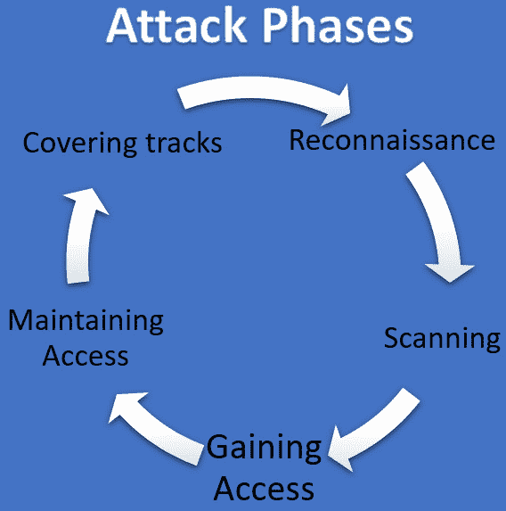

图 8.1 – 网络攻击的阶段

好的；基于我们刚刚学到的内容，我们可以确定*扫描阶段*的重要性，因为攻击者在这里收集的信息越多，攻击的风险就越高。

因此，让我们理解如何利用攻击者可能用来攻击我们的相同工具，主动保护我们的系统免受攻击。

## Nmap

Nmap 是*网络发现*和*安全审计*的*必备*工具，允许我们执行以下操作：

+   对我们的网络进行清单盘点。

+   收集服务或主机的正常运行时间数据。

+   确定给定网络上的主机。

+   确定这些主机提供（或启用）的服务。

+   确定所述主机的操作系统版本。

+   确定使用的任何数据包过滤器或防火墙。

基本上，Nmap 利用 IP 数据包收集所有这些数据，并通过命令行界面或名为 Zenmap 的 GUI 清晰地呈现这些信息。

Nmap 适用于大多数操作系统，包括 Windows、Linux 和 macOS，并可以从[`nmap.org/`](https://nmap.org/)免费下载。

警告

在许多国家，没有得到所有者书面授权扫描某人的系统或网络是*非法的*，因此在进一步操作之前，确保你只对那些你被授权的系统进行这些扫描。

好消息是，如果你想测试自己的知识，或者仅仅是想通过 Nmap 进行练习，你可以使用 Nmap 背后的人们慷慨创建的一个系统，供教育用途。该页面为[`scanme.nmap.org/`](http://scanme.nmap.org/)。

现在，让我们通过在测试服务器上执行基本的`nmap`命令来看看这如何工作：

```
nmap scanme.nmap.org
```

如*图 8.2*所示，基本命令提供了关于服务器的非常有价值的信息。

在这里，你可以看到哪些端口是开放的，以及与每个端口关联的服务。

在审计你的基础设施以确认*仅打开必要的端口和服务*时，这非常有用。如果发现不一致，应该立即采取措施修复漏洞，防止坏人发现它。


图 8.2 – nmap 基本输出

现在，通过添加`-A`参数，让我们变得更加*激进*：

```
nmap -A scanme.nmap.org
```

如*图 8.3*所示，`-A`参数为我们提供了一些额外且有用的信息，例如以下内容：

+   **端口上运行的服务的名称和版本**：这是一个非常重要的审计工具，它能让你轻松识别过时且易受攻击的服务，从而可以联系服务器所有者尽快进行修补。此外，根据漏洞的严重性（例如，可能危及整个基础设施的非常旧的版本），你可以制定政策，如果服务在*X*天内没有修复，那么该服务器将被从网络中移除。这不仅可以保护你的基础设施免受暴露的服务影响，还能向系统管理员施加压力，确保他们尽快修复相关服务。

+   **操作系统版本**：这将帮助你确定你的基础设施中是否存在不受支持的操作系统。


图 8.3 – nmap -A 输出

如前所述，`Nmap` 是一个非常适合审计的工具，你可能需要将这些结果发送给服务器所有者，以便他们采取行动。好消息是，你可以使用这个简单的命令将 `nmap` 结果导出到 `.txt` 文件中，这样你就可以轻松地将其作为附件发送给服务器所有者：

```
nmap -A scanme.nmap.org >> server_audit.txt
```

如下图所示，前面提到的 `nmap` 命令生成了一个名为 `server_audit.txt` 的文档，并将其保存在你的工作目录中，准备将其包含在审计结果中：

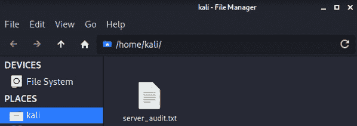

图 8.4 – nmap 结果导出到 .txt 文件

你还可以通过使用 IP 范围来定位网络的特定部分。例如，以下命令将扫描从`192.168.0.1`到`192.168.0.100`的所有 IP：

```
nmap -A -v 192.168.0.1-100
```

请注意，我们还包括了 `-v`（表示*详细*）参数，它会输出有关扫描过程的更多信息。

提示

默认情况下，`Nmap`扫描 1,000 个端口，但你可以通过使用如 `-F`（快速扫描较少的端口）、`-p`（指定要扫描的端口）或 `-r`（按连续顺序扫描所有端口）等参数来增加、减少或指定端口数量。

你可以使用更多的参数来与 `nmap` 一起使用。要探索它们，只需键入以下命令：

```
nmap --help
```

*但还有更多！* `nmap` 支持社区创建的脚本来增强其功能，具体内容将在下一节中讲解。

## Nmap 脚本

让我们回顾一下你可以在防御性安全中利用的一些最佳 `nmap` 脚本。

### vulners

这个脚本会让你的生活更轻松。它将提供所有 `Nmap` 扫描的结果。

什么是 CVE？

在 *第二章* 中，*管理威胁、漏洞和风险*，我们谈到了一个寻找漏洞的最佳地点：**CVE 网站**，网址为 [`cve.mitre.org/`](https://cve.mitre.org/)。

这个神奇的脚本叫做 `vulners`，你可以在以下链接找到它：[`github.com/vulnersCom/nmap-vulners`](https://github.com/vulnersCom/nmap-vulners)。

这个脚本默认加载到标准**Nmap 脚本引擎**（**NSE**）库中，因此无需额外安装。

命令结构非常简单，下面让我们来解释一下：

```
nmap -sV --script vulners [--script-args mincvss=<arg_val>] <target>
```

首先，我们使用标准的 `nmap` 命令，然后使用 `-sV` 参数，因为脚本需要版本信息才能正确收集 CVE。

然后，我们使用`--script {script_name}`参数来调用该脚本。

我们可以选择使用 `mincvss` 脚本参数来限制结果为 CVE 分数大于提供的值。示例如下：

```
nmap -sV --script vulners scanme.nmap.org
```

现在，脚本将查找与该 `nmap` 结果相关的所有 CVE。请注意，脚本使用一个超过 250 GB 的巨大数据库，因此扫描可能需要几分钟才能完成。

下图显示了与服务器上运行的 Apache 版本相关的大量漏洞列表：

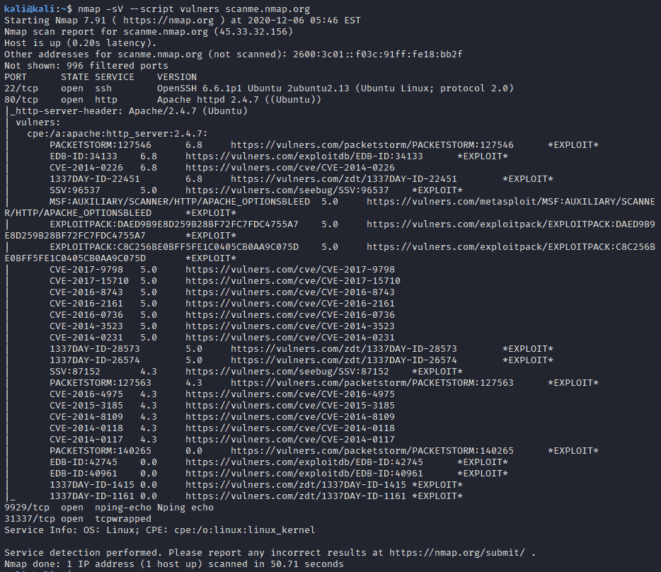

图 8.5 – vulners 脚本结果

还请注意，脚本提供了一个关于 CVE 的网页链接，方便你进一步了解漏洞的详细信息。

如前所述，你可以使用`>> {file_name}`选项，将前一个命令的结果导出到`.txt`文件中，这样更方便发送给服务器所有者（以便尽快修复漏洞）。另外，将文件导出为`.txt`格式也是为审计保留证据的好方法。

### vulscan

这是另一个非常酷的脚本，它将根据在`nmap`结果中找到的版本，搜索相关的漏洞。

默认情况下，脚本会在以下数据库中查找漏洞：

+   **scipvuldb.csv** - [`vuldb.com`](https://vuldb.com)

+   **cve.csv** - [`cve.mitre.org`](https://cve.mitre.org)

+   **securityfocus.csv** - [`www.securityfocus.com/bid/`](https://www.securityfocus.com/bid/)

+   **xforce.csv** - [`exchange.xforce.ibmcloud.com/`](https://exchange.xforce.ibmcloud.com/)

+   **expliotdb.csv** - [`www.exploit-db.com`](https://www.exploit-db.com)

+   **openvas.csv** - [`www.openvas.org`](http://www.openvas.org)

+   **securitytracker.csv** - [`www.securitytracker.com`](https://www.securitytracker.com)（已停止维护）

+   **osvdb.csv** - [`www.osvdb.org`](http://www.osvdb.org)（已停止维护）

不幸的是，默认情况下没有加载此脚本。不过不用担心，以下是在 Kali Linux 中轻松安装它的步骤：

1.  导航到 `nmap` 的 `scripts` 目录：

    ```
    cd /usr/share/nmap/scripts/
    ```

1.  创建一个目录来安装文件：

    ```
    sudo mkdir vulscan
    ```

1.  访问目录：

    ```
    cd vulscan
    ```

1.  安装文件：

    ```
    git clone https://github.com/scipag/vulscan scipag_vulscan
    sudo ln -s `pwd`/scipag_vulscan /usr/share/nmap/scripts/vulscan/scipag_vulscan
    ```

1.  安装完成后，运行该脚本非常简单：

    ```
    nmap -sV –script vulscan/scipag_vulscan/vulscan.nse scanme.nmap.org
    ```

在这种情况下，如下图所示，脚本未在这些数据库中找到与当前 OpenSSH 版本相关的漏洞：

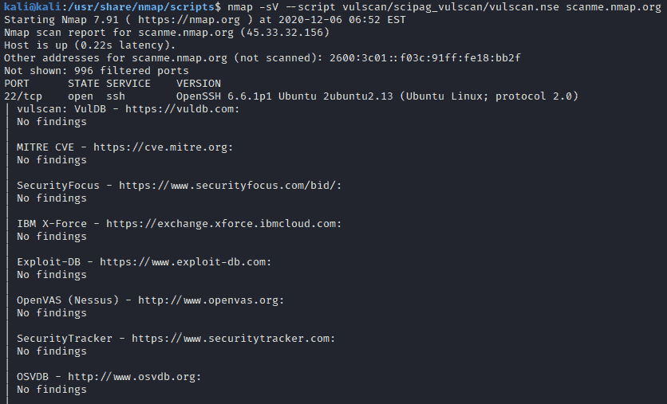

图 8.6 – vulscan 脚本结果

此脚本还可以针对其他数据库运行。为此，只需添加以下参数：

```
--script-args vulscandb=your_own_database
```

如前所述，`nmap` 的一个酷功能是你可以创建自己的脚本。

如果你想了解更多关于如何创建脚本的知识，我强烈推荐*Paulino Calderon*的《Mastering the Nmap Scripting Engine》一书，由*Packt*出版。

# 提高无线网络的保护

为了更好地解释这一点，我们将此部分分为两部分。

在第一部分，我们将*深入探讨最危险的无线网络漏洞*，这是你需要知道的。

第二部分将重点关注用户，因此它基本上是一个*用户指南，帮助他们在使用家庭无线连接时保持安全*。记住，这类指南是减少基础设施和数据最大风险的最佳选择，即*不小心的用户*。

## 无线网络漏洞

如前所述，我们将在这里讨论代表无线网络顶级漏洞的协议、特性和实践。由于最近远程办公用户的增加，本指南将涵盖影响企业和家庭系统的漏洞。

### Wi-Fi 保护设置（WPS）– 问题

这是安全性与可用性（或便利性）之间权衡的完美例子。原因是**WPS**的创建是为了让非技术用户更容易将智能电视、游戏机和笔记本电脑等新设备连接到网络。

问题在于该协议极为不安全，存在多个漏洞，降低了网络的安全性。

WPS 有两种主要的实现方式：一种是**基于 PIN 码**，另一种被称为**按键控制（PBC）**。

**PBC**实现包括两种方法。一种方法是通过按下两台设备上的 WPS 按钮来启动，如*图 8.7*所示。通常，你需要先按下 Wi-Fi 上的 WPS 按钮，然后按下设备上的 WPS 按钮来建立连接。


图 8.7 – 按下按钮进行 WPS 连接

还有一种混合模式，在这种模式下，你需要先在设备上打开一个应用程序以扫描 WPS 启用的设备，然后按下路由器上的 WPS 按钮来建立连接，如*图 8.8*所示。

一些路由器还提供通过路由器的网页接口触发 WPS 的选项，但这个选项仅在少数型号中可用，而且使用的人很少（因为它缺乏解决方案的可用性部分）。

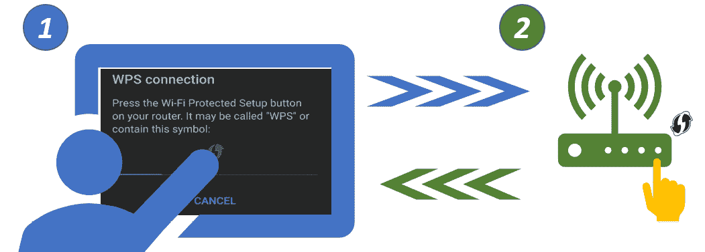

图 8.8 – WPS 混合连接模式

另一种 WPS 实现方式是使用**PIN 码**，这种方式比起你那超长且安全的密码，记起来要容易得多。

但等等……如果我们还要启用不安全的 PIN 访问，那拥有一个超级安全的密码又有什么意义呢？这就像有一个超级安全的百万美元大门，但你却可以通过一扇开着的窗户轻松绕过。

为什么 PIN 方法不安全？

PIN 码是一个 8 位数字，这意味着它的熵（可能的密码组合数）相比于包含大小写字母的字母数字密码非常小，从而大大降低了安全性。事实上，使用现代破解引擎，攻击者可以在不到 8 小时的时间内破解一个 8 位数字的 PIN 码。

但这并不是 WPS 中唯一存在的漏洞。研究人员还发现了加密协议中的几个漏洞。其中之一与 PIN 码的一些数字是校验和（可以计算）有关，这减少了破解密码所需的时间。

另一个漏洞与协议验证 PIN 码的机制有关，这个过程叫做*密码舞*，其中验证步骤之一没有被正确加密，导致攻击者能够轻松获取 PIN 码。

此外，研究人员还发现了路由器的 MAC 地址和/或序列号之间的某些关联，攻击者可以基于这些值计算 PIN 码。

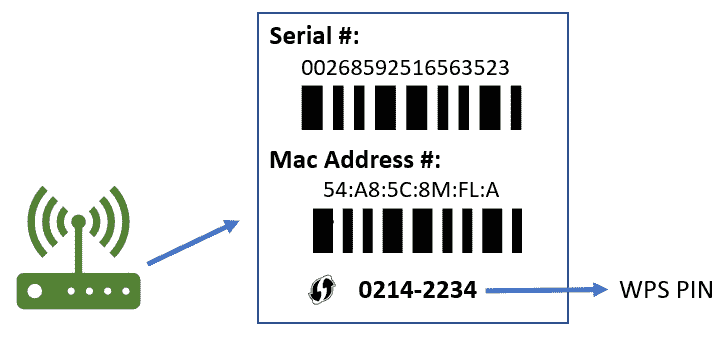

图 8.9 – WPS 数据贴在路由器背面

如前图所示，这些值可以在路由器背面的贴纸上找到，但攻击者可以通过利用探测请求包的漏洞远程收集它们。由于这些请求包是未加密并由路由器广播的，因此任何人都可以接收并读取它们，而且它们可能包含 MAC 地址以及序列号。如果你想了解更多关于探测请求漏洞的内容，请参阅*第五章*，*网络安全技术与工具*，在*网络安全高级无线工具*部分下。

### WPS – 解决方案

你可能会惊讶地发现，大多数路由器默认*启用 WPS*，因此你家里可能已经存在这个漏洞，却未曾察觉。

所以，这里最好的建议是*完全禁用 WPS*（逐步操作说明会在*无线网络用户安全指南*部分提供）。

如果出于某种原因，你需要启用 WPS，那么可以保持**PCB** *启用*，并确保你*禁用 PIN 选项*（因为它更容易受到攻击）。

同时确保你*更新路由器的固件*，以确保你的路由器包含最新的 WPS 修复和安全更新。

有一些旧版路由器不允许你禁用 WPS。在这些情况下，你有两个选择：

1.  更新路由器固件，看看新的更新是否提供禁用 WPS 的选项。

1.  立即更换你的路由器。

现在，我们来看一个鲜为人知的无线功能，它可能会给你的网络带来一些安全漏洞：**通用即插即用**（**UPnP**）。

### UPnP – 问题

**UPnP**的创建初衷是为了简化用户操作，它允许设备之间在同一网络中共享数据。

问题在于，这一功能最初是为在家庭网络中共享数据而设计的，通常共享的设备是*受信任*的设备，因此 UPnP 不进行身份验证，攻击者知道如何利用这一点。

UPnP 的其中一个功能是端口转发，攻击者可以利用这一漏洞控制计算机，并将其作为 DDoS 攻击中的代理。这就是著名的*Mirai*攻击中的情况，该攻击使用此技术防止安全系统识别指挥和控制服务器，因为全球数千台被感染的机器被用作“僵尸”机器与真实的指挥和控制服务器之间的代理。

利用 UPnP 漏洞的其他恶意木马实例包括银行木马*Pinkslipbot*，也被称为*QakBot*或*QBot*。这些木马非常危险，因为它们使用键盘记录器来捕获按键并将财务信息和凭证发送到远程指挥控制服务器。

### UPnP - 解决方案

保护这些漏洞的最佳方法是*禁用 UPnP*（详细步骤将在*无线网络用户安全指南*部分提供）。然而，如果你真的需要 UPnP（以提升某设备的体验），那么你必须遵循以下这些建议：

+   检查你的路由器型号在网上，并确认制造商是否发布了最新的 UPnP 相关漏洞补丁。事实上，在 2020 年底，研究人员发现了一种叫做**CallStranger**的漏洞，攻击者可以利用这个漏洞从你的系统中窃取数据；因此，如果你需要启用 UPnP，你必须持续检查漏洞，并确保修补它们。要查找当前漏洞的列表，请访问[`cve.mitre.org`](https://cve.mitre.org)。

+   过滤所有尝试使用 UPnP 的外部流量。

+   监控网络流量，发现 UPnP 的滥用情况。

你在办公室可能有很多技术和管理控制措施来保护你的无线网络，但在家工作的用户呢？他们在家中的无线连接是否有相同级别的安全性？

这应该是你主要关注的事项，因为现在甚至大部分用户可能都在家工作，因此，制定并分发清晰的指导方针（管理控制）给用户，确保他们拥有可接受的安全级别，从而避免对商业数据和系统的额外风险，是至关重要的。

## 无线网络用户安全指南

作为组织的安全负责人，你必须为用户提供指导，减少攻击风险。

考虑到大多数用户通过 Wi-Fi 连接互联网，那么为你来说，创建一份*无线网络使用最佳实践手册*并分发给所有员工，将是一个很好的主意。

提示

此外，请记住，这里关键是确保所有用户都熟悉这些指导方针，因此一些好的建议是，创建图文并茂的资料通过邮件分享，或者制作一些有趣的视频吸引人们关注这个活动。此外，你还可以指定一些有影响力的员工作为*安全冠军*，帮助你将这些策略传播给所有员工。

大多数安全设置是在 Wi-Fi 路由器上配置的，因此让我们首先展示如何登录到 Wi-Fi 的管理控制台。

### 访问你的路由器

这是访问路由器设置所需的五个简单步骤：

1.  打开 Google，输入你的路由器名称（品牌和型号）和短语`admin password`。例如，`Linksys E1200 admin password`。

1.  然后点击制造商提供的相关链接（在这种情况下是 [linksys.com](http://linksys.com)）。

1.  如下图所示，链接将我们带到制造商的支持页面，确认该路由器的默认用户名和密码是 `admin`/`admin`：

    图 8.10 – 默认的管理员用户名和密码

1.  *要访问路由器，您只需要在互联网浏览器中输入路由器的 IP 地址*。在这种情况下，支持页面提到了默认的 IP 地址；然而，这个地址可能会改变。但别担心，以下步骤可以很简单地确认：

    a. 按下  + *R* 启动 `cmd` 并按 *Enter* 打开命令提示符。

    b. 在命令提示符中，键入 `ipconfig` 并按 *Enter*。

    c. 然后查找名为 `192.168.0.1` 的值：

    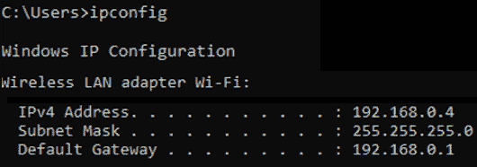

    图 8.11 – 路由器的 IP 地址

1.  一旦您在浏览器中输入 IP 地址，它应该会提示您输入登录页面，要求您提供凭证。在这个例子中，用户名和密码都是 `admin`。

    提示

    所有的网页界面都是不同的（取决于制造商），但信息应该是相同的，因此请花一些时间探索界面并熟悉它。Linksys 提供了一个模拟器，您可以使用它来熟悉界面，链接为 [`ui.linksys.com/E1200/1.0.00/`](http://ui.linksys.com/E1200/1.0.00/)。

现在，让我们看看您需要更改哪些属性，以使无线路由器更加安全。

### 管理员密码

如您刚才看到的，*路由器的密码可能非常弱*（并且是众所周知的），所以第一步就是通过更改密码来保护路由器。根据路由器的不同，这个选项可能会出现在一个名为 **管理**、**安全**、**登录** 或 **用户** 的标签下。

提示 – 使用密码短语

密码越长，攻击者破解的难度就越大，因此使用一个您可以轻松记住的短语作为密码，例如 `I.Love.my.wife.since.2014`，或者像 `I.am.sure.I.will.get.my.masters.in.2021` 这样激励性的短语。当然，这些只是示例，您可以创建一个具有至少 25 个字符、独一无二的密码。像其他任何密码一样，使用特殊字符、俚语和流行短语更好，因为这样您的密码能够抵御暴力破解和字典攻击。

### 管理员用户

攻击者知道，连接路由器的默认用户名通常是 `admin`，然而某些路由器允许您更改该用户名。所以，如果您有这个选项，强烈建议您更改用户名，因为这将防止大多数攻击，因为它们将针对一个不存在的用户。

### 无线密码

如前一节所述，建议为您的无线网络使用强密码（长密码）。另外，好的做法是至少每 6 个月更换一次密码。

### 无线安全（安全模式）

这里有三个加密选项：**WEP**（极不安全）、**WPA**（有漏洞）、**WPA2**（推荐）。

### 无线网络名称（SSID）

默认情况下，SSID 可能是你无线路由器的品牌加上一些随机数字。这不仅丑陋，而且危险，因为每个人都能知道你的路由器型号，这样攻击它就会更容易。所以，第一步是，*将你的 SSID 名称更改为你喜欢的名称*。同时避免在 SSID 中使用你自己的名字，因为这可能会让你成为更容易的攻击目标。因此，像*Harper Family*这样的 SSID 应该避免使用。

提示 – 2.4 GHz 和 5 GHz

大多数现代路由器具有两个频段（2.4 GHz 和 5 GHz），在大多数情况下，你需要将它们配置成两个不同的路由器（即不同的 SSID、不同的安全模式、不同的密码、不同的客户账号等）。因此，请确保两个网络上的所有设置相同，以避免在其中一个网络中留下漏洞。

### 客户账号

假设你的邻居需要连接你的 Wi-Fi 一分钟来发送一封紧急邮件。这意味着你需要透露你的超级安全密码，但现在密码已经保存在他们的设备上，他们可以随时连接。现在，如果你改变密码以避免这种情况，那就意味着你必须在所有设备上重新输入新密码。因此，为了避免所有这些麻烦，你可以启用**客户账号**。客户账号允许你为外部人员创建账户，这有很多优点，包括以下几点：

+   它们可以临时启用，然后禁用以防止进一步访问。

+   你可以随时更改密码，而不会影响其他设备。

+   由于你可以将其用作*临时*账户，因此每次使用时都可以创建一个新密码，使得破解几乎不可能。

### 远程访问

一些路由器提供远程访问管理控制台的选项（通过互联网）。这非常不安全，因为它为攻击者提供了访问你路由器（进而访问你的网络和数据）的途径。因此，*始终禁用远程访问功能。*

### 禁用 WPS（包括按钮和 PIN 版本）

如前一节所述，WPS 是一个高度脆弱的协议，必须禁用（并且通常默认启用）。

这样做非常简单——只需在路由器上找到**WPS 设置**（如下图所示），然后点击禁用 WPS：


图 8.12 – WPS 设置

#### 禁用 UPnP

类似于 WPS，**UPnP** 是高度脆弱的，最糟糕的是它在大多数路由器上默认启用，因此为了防止这种漏洞，强烈建议禁用它，如下图所示：


图 8.13 – UPnP 设置

### Fing 应用

**Fing** 是一款移动应用程序，它可以让你查看所有连接到你网络的设备。

这是一个很好的工具，可以确认是否有未经授权的用户连接到你的网络，如果有，立即更改路由器密码。

如 *图 8.14* 所示，**Fing** 提供了许多关于连接设备的有用信息，如下所示：

+   设备名称

+   设备类型

+   设备型号

+   IP 地址

+   制造商或品牌


图 8.14 – Fing 应用

### 使用 NFC 标签

另一个很酷的想法是，你可以使用 **NFC 卡** 来存储你的无线设置，这样你就不需要输入你的安全（长）密码，只需将标签靠近手机，它就会自动连接到你的 Wi-Fi。

这种方法的另一个优点是，你不需要记住密码，这样你就可以使用像这样的超安全密码短语：

*ds9*e-sd4SDF-#ta+Dua-43v3r00-#D/*#ef#sfM.?$-#iD2#l¡GE.#d-9#a*

正如你在本指南中看到的，一旦你掌握了路由器的正确知识，保护你的无线网络就变得非常简单。

现在，让我们来看看最著名的网络安全工具之一：**Wireshark**。

# 介绍 Wireshark

Wireshark 是用于监控和保护网络的最佳网络安全工具之一。

本章旨在向你概述该工具以及你可以用它实现的主要功能。然而，如果你想深入了解 Wireshark，可以阅读 *Lisa Bock* 编写的《Learn Wireshark》一书，该书由 *Packt* 出版，内容超过 400 页，充满了有助于你成为该工具专家的知识。

Wireshark 的主要特点是能够收集通过给定网络适配器传输的所有网络流量，并 *解码* 捕获的比特为人类可读的格式。这是通过使用解码器或分析器实现的，这些解码器和分析器由社区不断更新。

Wireshark 可以安装在任何操作系统上，但如你所知，它在 **Kali Linux** 上预装，因此在这个示例中，我们将使用 Kali 上的版本，当前版本是 **3.2.7**。

开始捕获第一个数据包的第一步是 *选择我们想要“监听”的网卡*。如以下图所示，Wireshark 启动页面已经显示了可用的网卡，以便我们可以轻松选择一个并开始捕获数据包：

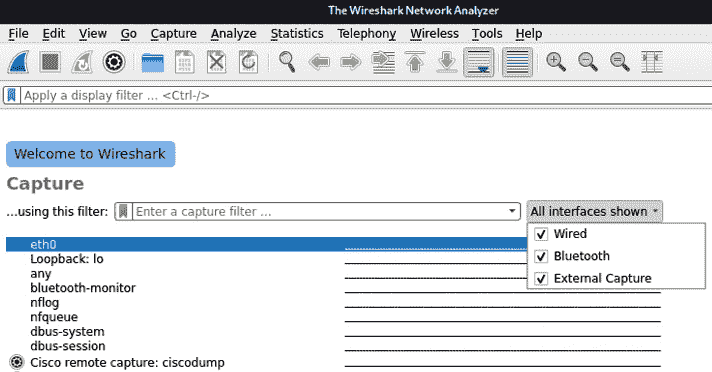

图 8.15 – Wireshark 初始界面

然而，如果你有多个网卡（接口），可能会让你困惑，不知道该选择哪个。

这里的技巧是点击 **Interfaces**，它会显示一个窗口，提供有关所有网络接口的详细信息。从那里，你可以通过查看流量列来确定哪个是你的活动接口。

如果流量栏没有活动，那么只需 ping 一个服务器，例如，`ping` [www.google.com](http://www.google.com)，如下面的图所示，你将开始看到流量栏在你活动的网络接口上移动。在这种情况下，我们可以确定我们的活动网络接口是**eth0**，因此我们可以点击它，然后点击**开始**来开始捕获数据包：  

  

图 8.16 – Wireshark 上的活动接口  

好的，现在我们开始监控，让我们看看打开网页时会发生什么。  

提示  

大多数网页都有大量广告，这会使扫描结果非常*嘈杂*，因此为了避免所有噪音，我们将打开一个大学的网页作为本示例。此外，使用 Kali 的虚拟机非常好，因为它没有 Windows 系统所带来的网络负担（如果你在 Windows 机器上运行 Wireshark，即使你*理论上*没有使用网络，也会看到很多数据包）。  

以下图展示了我们对一个网页进行扫描的结果，帮助你熟悉工具的输出并更好地理解它们：  

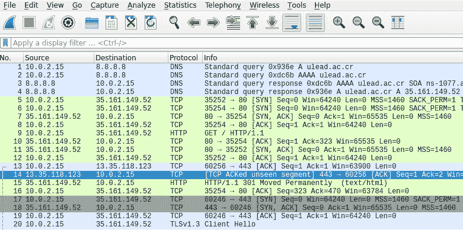  

图 8.17 – Wireshark 扫描结果  

让我们从分析前面图形顶部的输出开始。你会看到，第一个数据包是你的计算机向 DNS 服务器请求网页 IP 地址。在这里，例如，你可以验证请求是否发送到了所需的 DNS 服务器——在我们的例子中，它请求的是`8.8.8.8`（Google 的 DNS）。如果你发现请求是发往另一个 DNS，那么你可能遇到了 DNS 攻击，攻击者可能会将你的流量重定向到恶意网站。

一旦我们从 DNS 服务器获取到 IP 地址，就会开始看到一些基本的 TCP 数据包交换。之后，我们收到一些 HTTP 数据包（这基本上就是我们请求的网页），最后，我们看到一些 TLS 数据包，这意味着网页是通过 SSL 证书加密的（HTTPS）。  

提示  

你可以通过点击列名来轻松按列对结果进行排序。例如，你可以点击协议标签，按协议对捕获的所有数据包进行排序。  

好的，现在让我们回顾一下利用 Wireshark 增强安全性的一些更高级的方式。  

## 查找使用不安全协议的用户  

正如你所知道的，用户总是会找到创造性的方法绕过你的管理和技术控制。在这种情况下，使用像 Wireshark 这样的监控工具是发现并阻止这些不法分子的好方法。  

### Telnet 漏洞  

Telnet 是一种用于机器间通信的旧版客户端/服务器协议。  

问题在于它没有提供加密，因此所有通信都会以明文形式传输。  

由于这个风险，Telnet（包括服务器和客户端）在大多数系统中默认被禁用，包括 Windows 系统和 Kali Linux。  

因此，由于这一风险，*你必须确保你已具备所有技术和管理控制措施，以防止使用 Telnet 进行服务器登录和通信*。

好消息是，你可以通过 Wireshark 轻松检测是否有人使用 Telnet，只需通过协议过滤结果即可。

### 实时捕获 Telnet 数据

要执行此示例，我们首先需要使用以下命令在 Kali Linux 上安装 Telnet 客户端：

```
sudo apt-get install telnet
```

现在，**Telnet 客户端**已安装，我们可以连接到 **Telnet 服务器**，在本示例中我们将使用一个开放的（且有趣的）Telnet 服务器。

等等，你不是说 Telnet 不安全吗？

是的，Telnet 服务器和 Telnet 通信存在多个漏洞，然而安装 Telnet 客户端并不代表系统存在漏洞。

让我们回到 Wireshark，设置它以捕获所有 Telnet 数据，这是一项非常简单的任务。如下面的图所示，你只需在 **过滤器** 栏中输入 `telnet`，就能实时查看所有 Telnet 连接：


图 8.18 – Wireshark 过滤器字段

现在，让我们导航到一个测试 Telnet 服务器并创建一个账户，看看我们能否捕获到它。

要做到这一点，只需在我们的 Kali Linux 上打开一个终端，并输入以下命令以访问 Telnet 服务器：

```
telnet telehack.com
```

如下图所示，我们现在已连接到 **telehack** Telnet 服务器：

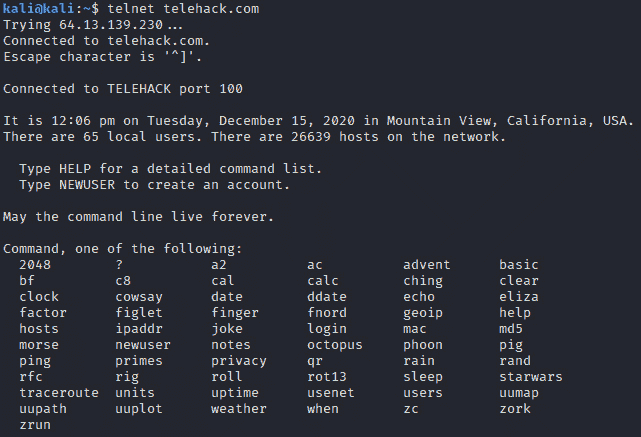

图 8.19 – 与 telehack.com 服务器建立的 Telnet 连接

现在，让我们回到 Wireshark 看看我们捕获了什么。

结果非常有趣，正如 *图 8.20* 中所强调的，我们成功地以明文捕获了 Telnet 服务器发送的所有信息（这与我们在 *图 8.19* 的命令行中看到的信息相同）。

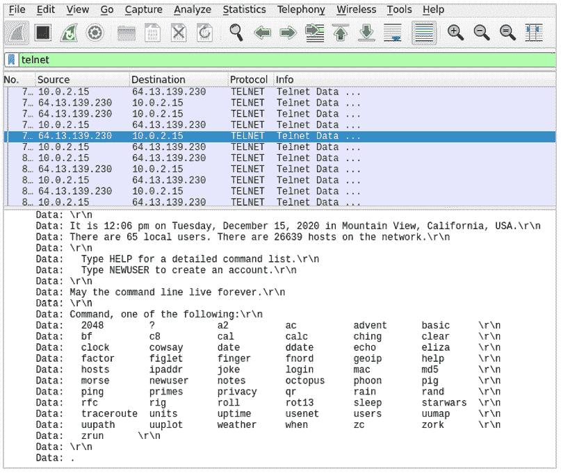

图 8.20 – 捕获 Telnet 数据包

所以，我们已经证明了 Telnet 通信不安全，并且很容易被捕获。现在，让我们看看是否也能捕获一些登录详情。

为了实现这一目标，让我们使用 `login` 命令创建一个账户。然后系统会要求输入用户名，我们需要回复 `Y` 以确认创建新账户（见 *图 8.21*）。


图 8.21 – 在 Telnet 服务器上创建账户

现在，如下图所示，系统会要求输入密码，我们输入一个随机密码并按 *Enter* 键完成账户创建：


图 8.22 – 通过 Telnet 设置密码

好的，现在让我们回到 Wireshark，看看它是否捕获了我们刚刚在服务器上创建的密码。

你可能会注意到有太多的包，有时看起来每个字母都对应一个包。但不用担心 – 为了让我们的生活更轻松，Wireshark 提供了一个叫做 **TCP 流** 的选项，它以非常友好的方式展示所有数据。要访问该选项，只需右键点击其中一个数据包并选择 **Follow | TCP Stream**（如以下图所示）：

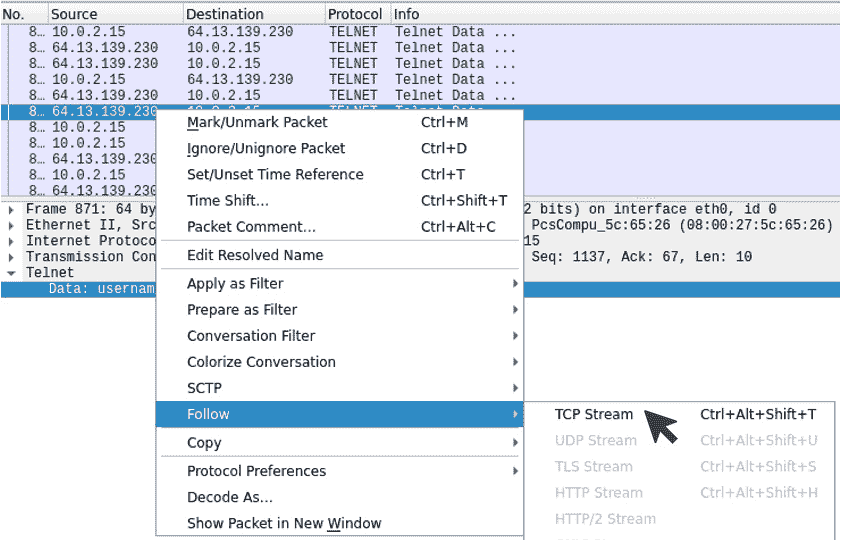

图 8.23 – Wireshark 中的 TCP 流选项

现在，Wireshark 会展示一个像 *图 8.24* 中的窗口，显示客户端和服务器之间的所有通信。我们可以有效地看到密码以 *明文* 形式展示。

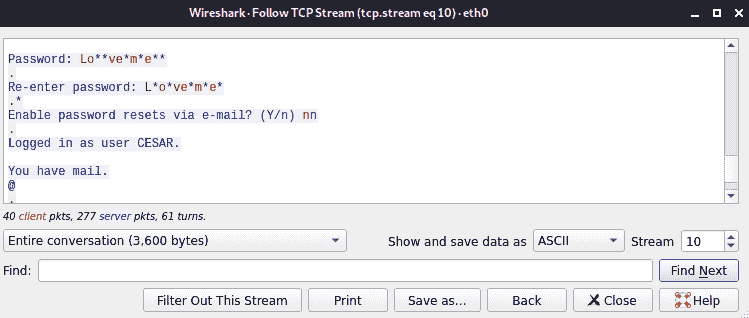

图 8.24 – 密码以明文形式被捕获

挑战

尝试在 SSH 连接上做同样的练习。那样你会注意到，所有包含数据的包都会被加密，因此信息是安全的。

在进入下一节之前，让我们休息一下，向你展示如何利用刚刚安装的 **Telnet 客户端** 来玩得开心（也许还可以给一些朋友留下深刻印象）。

### 奖励（玩 Telnet）

目前有很多有趣的 Telnet 服务器供你探索（没有风险）。它们有三种类型：

+   **Muds**：老式游戏

+   **公告板系统** (**BBSes**)：一种古老的信息共享系统（Facebook 的史前祖先？）

+   **Talkers**：配置为 *讲述* 特定话题的服务器，如讲笑话（聊天机器人的失落祖父）

现在，这里为你整理了一些有趣的 Telnet 服务器，你可以通过连接它们来玩得开心（*只要记住，你输入的所有内容都可能被捕获，因此如果你创建了一个用户，使用一个虚拟密码*）：

+   **星际大战 ASCII 动画（如果 Netflix 崩溃了）**：

    ```
    telnet towel.blinkenlights.nl 23
    ```

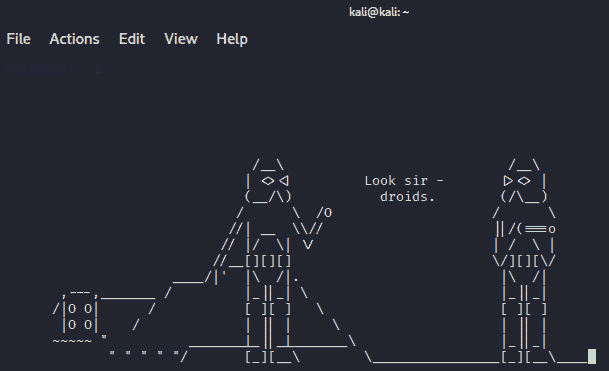

图 8.25 – 通过 Telnet 玩《星际大战》电影

+   **NASA JPL HORIZONS 太阳系数据**：

    ```
    telnet horizons.jpl.nasa.gov 6775
    ```

+   **通过 Telnet 获取天气**：

    ```
    telnet rainmaker.wunderground.com 3000
    ```

+   **Telehack** **（我们在前面的示例中使用的那个，被认为是一个互联网博物馆）**：

    ```
    telnet telehack.com 23
    ```

+   **Achaea, 梦想中的神圣之地（游戏）**：

    ```
    telnet achaea.com
    ```

+   **免费国际象棋游戏**：

    ```
    telnet freechess.org 5000
    ```

以下图像展示了一种非常酷的复古方式来玩国际象棋… 酷！

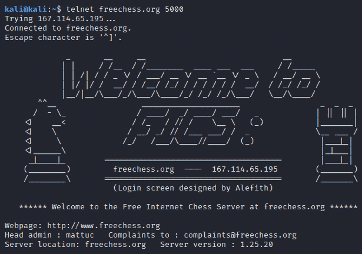

图 8.26 – Telnet 国际象棋游戏

好了，今天的游戏就到这里，接下来我们继续学习其他不安全的协议。

## FTP、HTTP 和其他未加密的流量

Telnet 不是唯一的不安全协议 – 其他未加密的协议，如 FTP 和 HTTP，也会发送未加密的数据，容易被捕获。

如下图所示，在登录 FTP 服务器时，用户名和密码以明文形式发送：


图 8.27 – FTP 用户名和密码以明文形式被捕获

因此，确保你在组织内推广使用更安全的协议，如**安全 FTP**（**SFTP**）和**安全 HTTP**（**HTTPS**）。

## 用于防御安全的 Wireshark

现在你已经了解了 Wireshark 的基础知识，接下来让我们看看如何在你的防御性安全角色中利用 Wireshark。

### 意识提升活动

正如你刚刚看到的，之前的示例是向用户和系统管理员展示*不遵循政策并使用不安全的渠道传输敏感信息*（例如用户名和密码）*的危险*的一个非常好的方式。

通过在公司的年度网络安全周等活动中向员工进行这种现场演示，有助于减少许多风险，同时将这些用户从安全对立者转变为安全推广者。

另一种传递方式是通过制作前面演示的录像，并将其分发给你的团队，作为员工必须完成的年度网络安全强制培训的一部分。

### 高级网络审计

Wireshark 使你能够对网络进行深入分析，以帮助你实现以下目标：

+   合规审计

+   内部安全审计

+   性能分析

+   网络风险评估

+   恶意流量分析

+   漏洞评估

+   数据外泄识别

+   网络加固分析

这些任务可以由内部的网络安全专业人员或服务提供商（第三方公司或外部网络安全专家）来执行。

### 咨询工作

Wireshark 是一个非常好的工具，可以供独立顾问使用，提供基于数据的建议，帮助公司改善其数据、系统和网络的安全性。

### 网络故障排除

尽管你可能不是直接负责故障排除，但了解在许多情况下，网络专家会使用 Wireshark 来排除网络问题，如延迟、可用性和稳定性，是非常重要的。

提示

Wireshark 不是**入侵检测系统**（**IDS**），这意味着它不会在入侵者访问你的网络时发出警报，但它是调查入侵事件的一个极好工具。

不用担心，在下一部分我们将介绍**入侵检测系统**（**IDSes**）和**入侵防御系统**（**IPSes**）的基础知识，甚至对比它们之间的差异。

# 使用 IPS/IDS

在这一部分，我们将解释**IDS**和**IPS**是什么，提供这些系统的一些示例，并考虑这两种相似技术之间的差异。

## 什么是 IDS？

**IDS**是一种被动监控解决方案，用于检测网络中的不良入侵。

一旦检测到入侵，IDS 会向安全分析员发送警报，以便进一步调查和处理（如以下图所示）：

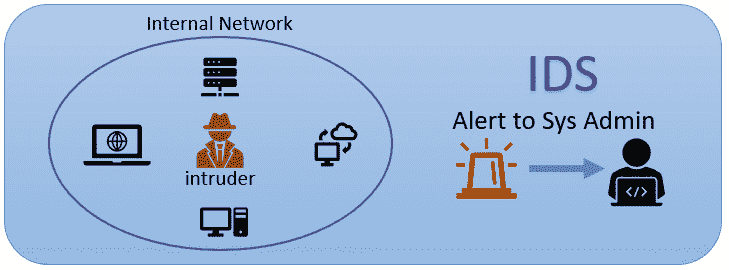

图 8.28 – IDS 示意图

就部署而言，入侵检测系统（IDS）可以在主机级别（HIDS）或网络级别（NIDS）进行部署。

有两种主要的 IDS 引擎，一种基于签名（例如经典的杀毒软件使用签名数据库来检测恶意软件），另一种是基于异常的，通过检测偏离既定模式的行为来识别入侵。在后者类别中，还有一些系统利用认知计算来增强这些模式的识别与识别能力。

## 什么是 IPS？

**IPS**是一种主动系统，可以防止未经授权的用户访问你的网络。

如下图所示，IPS 会自动阻止任何可能被认为是对你的网络构成威胁的流量：

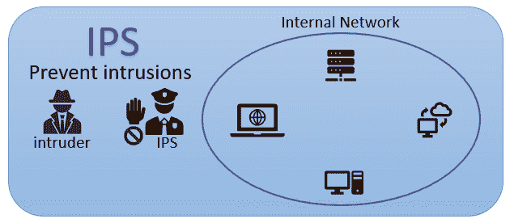

图 8.29 – IPS 表示

在部署和 IPS 的后台（引擎）方面，这些与 IDS 提到的非常相似。

## 免费 IDS/IPS

没有理由不使用 IDS/IPS——事实上，这里有一些免费的 IDS/IPS，你可以在你的基础设施中实现。

### Snort

可能是最著名的 IPS/IDS，Snort 的引擎主要基于签名。该系统附带一组基本的策略，但你可以通过创建自己的策略来扩展它。

你还可以将 Snort 与 Wireshark 集成，为 Wireshark 提供警报功能。

Snort 支持 Windows、Fedora、CentOS、FreeBSD 和 Kali Linux。

如需更多信息，请访问[`www.snort.org/`](https://www.snort.org/)。

### Security Onion

这是一个 Linux 发行版，包含 IPS 和 IDS 引擎，并使用 OSSEC 进行基于主机的 IDS/IPS，使用 Snort 和 Suricata 进行基于网络的 IDS/IPS。

如需更多信息，请访问他们的 GitHub 仓库：[`github.com/Security-Onion-Solutions/security-onion`](https://github.com/Security-Onion-Solutions/security-onion)。

## IPS 与 IDS

下图突出显示了 IPS 和 IDS 之间的主要区别，以及它们的某些共同特征：

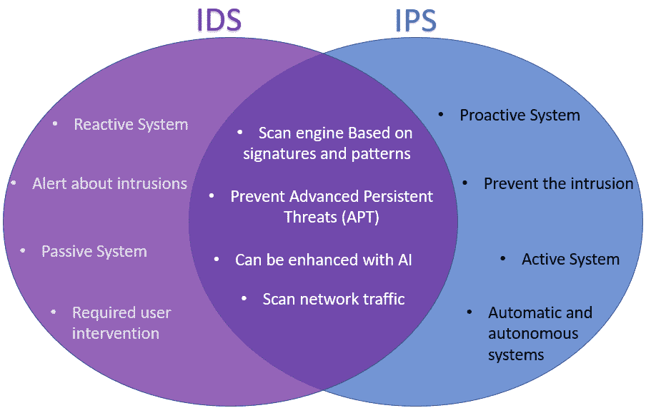

图 8.30 – IDS 与 IPS 的区别

大多数专家一致认为，每个系统是互补的，因此最佳的实施方式是并行部署它们，以增强你的网络安全性。

# 总结

在本章中，我们首先回顾了*网络攻击的不同阶段*。然后，我们学习了*如何使用 Nmap 检查基础设施中的漏洞*，并使攻击的扫描阶段对攻击者更具挑战性。

然后我们回顾了*最常见的 Wi-Fi 漏洞*及其解决方法。此外，我们还学习了*如何创建 Wi-Fi 用户安全指南*，以减少使用无线网络时的风险。这是你可以利用的一个重要资产，有助于支持你的*网络安全策略*并教育用户。

在那之后，我们转向了一个更技术性的主题，学习了*如何使用 Wireshark*来发现漏洞，甚至做了几个实验，实时查看*攻击者如何在你使用不安全协议时捕获你的数据*（包括密码）。

最后，我们通过对 IDS 和 IPS 的*概述*来结束了这次网络安全之旅，讲解了它们是什么，提供了一些例子，并进行了它们之间的比较，帮助你更好地理解这两项技术的区别。

现在，做好准备，因为在下一章我们将学习*关于物理安全你需要知道的一切*，它的相关威胁，以及如何掌握防御技巧（工具、系统和方法）来保护自己免受这些威胁。
