# *第九章*：深入探讨物理安全

*"拥有正确的工具和几秒钟的物理访问权限，一切都不再受控制……"*

*– 达伦·基钦 – Hak5 创始人*

物理安全常常被忽视，作为网络安全专业人士，我们通常回避这项责任。然而，事实是，物理安全漏洞可能暴露我们的系统，这对我们的基础设施和数据构成了*巨大的*风险。

因此，在本章中你将学习到*在物理安全方面最危险的漏洞*，同时也会了解一套控制措施和方法，用以降低这些风险。

这里是我们将在本章中涵盖的主题的详细信息：

+   深入探讨物理安全中最危险的工具和攻击，包括以下内容：强大的 LAN Turtle、隐秘的 Plunder Bug LAN Tap、危险的 Packet Squirrel、便携式 Shark Jack、令人惊叹的 Screen Crab、先进的 Key Croc 以及其他 USB 威胁

+   探讨与设备盗窃相关的风险和成本（以及为何你必须防止这种情况发生）

+   物理控制类型的定义

+   与访问控制相关的最佳实践列表

+   一项非常酷的访客控制技术概述——自动过期的徽章

+   介绍你在物理安全方面最强大的盟友：清洁桌面政策

+   对进行物理安全审计时最佳实践的回顾

# 技术要求

你不需要额外的软件或硬件来享受本章内容，然而，如果你能够测试我们在这里回顾的设备，以便更熟悉它们，那将是很棒的（你越了解敌人的工具，就能越好地防御它们）。

所以，这里是一个链接，你可以在该网页找到本章中列出的多数设备：[`hak5.org/`](https://hak5.org/)。

# 理解物理安全及其相关威胁

我们经常投入大量时间来保护我们的虚拟环境，然而，一名拥有物理访问权限的攻击者可以轻松绕过许多安全机制和系统，从而轻松访问我们的系统和数据。

因此，熟悉与你的组织可能面临的最常见的物理安全漏洞或威胁将对你有很大帮助。

## 强大的 LAN Turtle

这个看似无害的物件使攻击者能够在单一设备上进行远程访问工具包和中间人攻击。该设备看起来像是一个通用的 USB 转以太网适配器，所以一旦连接，它会很难被察觉。

这个攻击非常简单但巧妙。如图所示，设备位于目标计算机和网络之间，使攻击者能够对网络和计算机执行多个远程攻击：

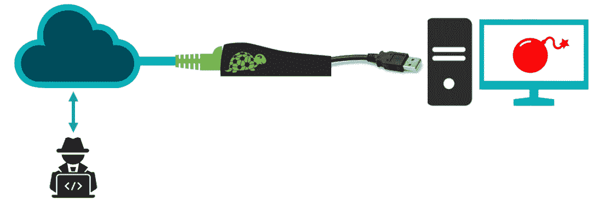

图 9.1 – LAN Turtle 攻击

为了执行攻击，攻击者可以通过**SSH**连接到 LAN Turtle，选择并执行多个预配置的攻击。

图 9.2 – LAN Turtle 模块

如前图所示，LAN Turtle 配备了一套强大的预加载模块，允许攻击者设置反向 shell 实现持久的远程访问，执行 DNS 欺骗攻击，执行 Metasploit 有效负载等！

## 隐秘的 Plunder Bug LAN Tap

LAN Tap 是一个非常小（但功能强大）的设备，它使攻击者能够捕获所有经过网络的包。

它配有 USB Type-C 连接，能够实时下载所有`*.pcap`文件到智能手机中，供后续分析。

`pcap` 文件

这是用于捕获网络流量的文件格式，被`pcap`文件等嗅探工具广泛使用，这使得这种类型的攻击更加危险。

如下图所示，攻击者可以悄无声息地将该设备连接在两个端点之间，记录所有通过电缆的活动，这突显了在网络中避免此类威胁的强大物理安全性的重要性：

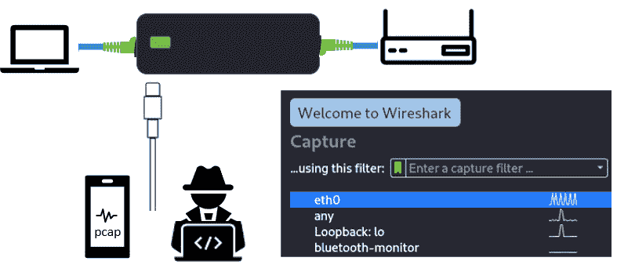

图 9.3 – Plunder Bug LAN Tap

此外，攻击者还可以使用数据包分析工具，如 Wireshark，实时分析这些数据包。

## 危险的 Packet Squirrel

这个小巧且强大的小工具具有与著名的 LAN Turtle 类似的功能——远程访问、中间人攻击、数据包嗅探、安全隧道和网络侦察。主要的区别在于硬件（接口和外观），如下面的图所示，以及软件（模块与有效负载），下文将详细解释：

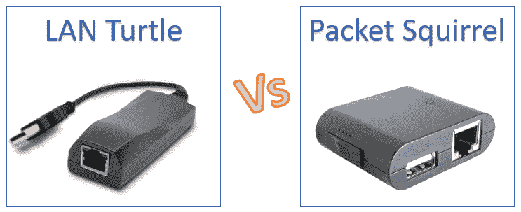

图 9.4 – LAN Turtle 与 Packet Squirrel 硬件对比

让我们详细了解这些区别：

**模块**通过*空中下载*到设备，并且自带配置界面。

**有效负载**通过*手动*或通过更新器应用程序下载到设备中，作为一个或多个文本文件。配置有效负载的过程包括编辑文本文件并更改值。多个有效负载可以携带并分配给一个开关按钮，但一次只能运行一个有效负载。

## 便携式 Shark Jack

这是一个超级便携的网络攻击工具，允许攻击者连接到网络端口，并即时运行高级侦察、数据外泄、攻击和自动化有效负载。

开箱即用，它配备了一个超快速的**nmap**有效负载，提供快速简便的网络侦察功能。它使用一种非常简单的脚本语言，再加上攻击/武装开关，这使得这个工具对你的网络安全构成严重威胁。

下图展示了**Shark Jack**硬件特性，同时也让你了解它的便携性，以及攻击者如何轻松携带并连接该设备：

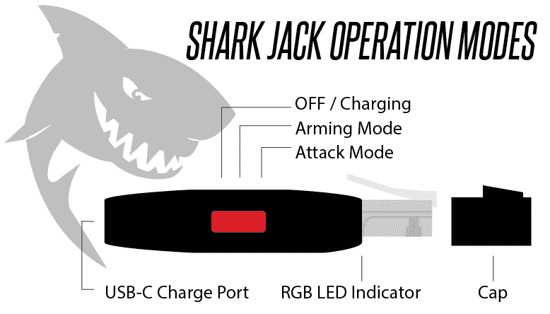

](img/Figure_9.5_B16290.jpg)

图 9.5 – Shark Jack 硬件

但更厉害的是——Shark Jack 配备了一个基于云的远程访问工具，攻击者可以利用它实时获取数据！

## 令人惊叹的屏幕螃蟹

*这可能是有史以来* *最酷的黑客设备之一*。这*基本上是一个 HDMI 中间人攻击* *设备*，它会实时传送受害者机器的视频流。

这意味着（如*图 9.6*所示），一个具有物理访问权限的攻击者可以将该设备连接到 HDMI 投影仪，并*获取屏幕上显示的所有机密信息。这使他们能够捕获如客户数据、合同、投标、公司机密、知识产权等信息*：

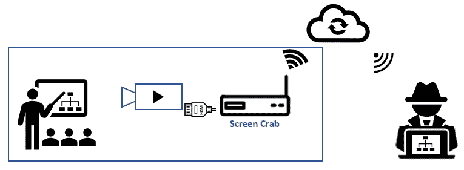

](img/Figure_9.6_B16290.jpg)

图 9.6 – 屏幕螃蟹攻击

如果房间没有互联网连接，设备配备了 micro-SD 卡槽，可以将录音或截图保存到此卡槽中，如下图所示：

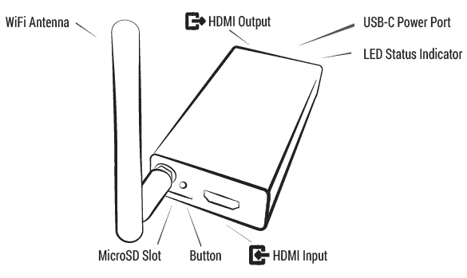

](img/Figure_9.7_B16290.jpg)

图 9.7 – 屏幕螃蟹硬件

从防御安全的角度来看，值得注意的一点是，这个设备需要电源才能工作（可以通过 USB 提供电源），因此，在会议室中固定设备（如显示器和电视）上阻止 USB 端口的使用，可能是降低此类环境风险的良好做法。

## 高级 Key Croc

基于硬件的键盘记录器可能是最常见的物理网络攻击示例。硬件键盘记录器非常紧凑，容易连接和伪装，使其成为一种极其危险的威胁。

但还有一个更危险的设备叫做**Key Croc**——更危险的原因是，这个强大的键盘记录器拥有以下特性：

+   **人机接口设备** (**HID**) 仿真

+   预定的 HID 按键注入

+   HID 按键注入的远程提交

+   一个*监听器*，在执行预定动作时触发按键操作

+   能够几乎实时地将数据发送到云端

+   执行有效负载（来自大量现有有效负载的库）

+   通过 SSH 实现远程访问

+   配备 Metasploit 执行远程攻击和漏洞利用

+   通过按一个按钮将其转换为 USB 存储设备

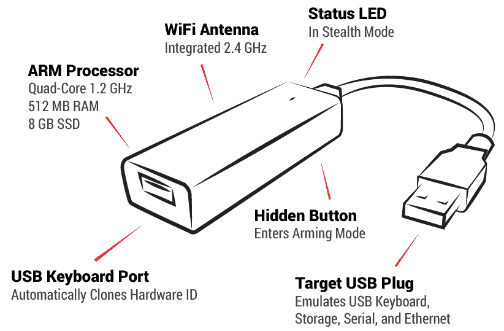

](img/Figure_9.8_B16290.jpg)

图 9.8 – 关键 Croc

如前图所示，该设备具有非常强大的硬件（四核处理器、512MB RAM 和 8GB 内存），如果连接到任何企业系统或计算机，将构成巨大的安全威胁。

## USB 威胁

如在*第二章*中所见，*管理威胁、漏洞和风险*，许多恶意 USB HID 设备在连接后可以用于执行多种攻击。

正如该章节中提到的，大多数计算机系统易受这些攻击，因为它们利用了*HID 驱动程序的固有信任*，因此大多数防病毒系统甚至 USB 操作系统限制都无法检测到这些攻击（因为这些限制适用于大容量存储设备，而非 HID 设备）。

这些 USB 设备的一些示例如下：

+   **USB Rubber Ducky**

+   **Bash Bunny**

+   **O.MG 键盘记录器电缆**

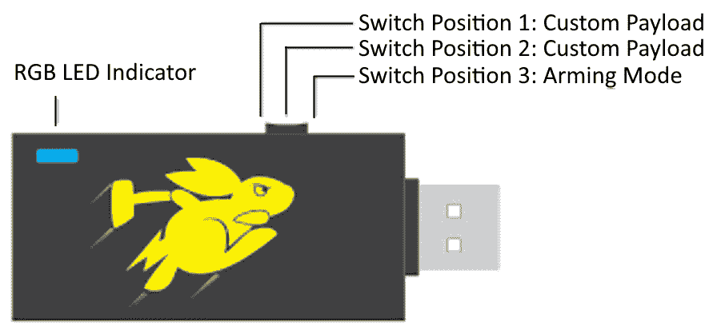

图 9.9 – Bash Bunny

在*第二章*中，*管理威胁、漏洞和风险*，我们学到了如何保护环境免受这些*USB 威胁*。不过，让我们做一个简短的回顾：

+   使用**Windows Defender**检测 USB HID 威胁。

+   实施脚本检测脚本攻击（例如**DuckHunt**）。

+   安装**USB 物理阻断器**以防止 USB 设备连接。

+   创建*专有软件*，根据 USB 描述符或元数据（如制造商、型号、类型等）来阻止可疑的 USB 设备。

+   避免在客户服务机器上暴露 USB 端口（外部人员可以轻松接触）。

但在所有这些机制之上，最好的保护措施是防止外部人员进入受控的公司空间（例如会议室、工位、办公室等）。我们将在下一节中介绍这些物理保护机制——*物理安全机制*。

## 设备盗窃

有时在进行高级风险分析时，非技术团队可能只考虑替换被攻破设备的成本，因此在简单分析中，他们可能会决定不投资于物理安全，因为其成本高于设备替换成本。然而，在这些情况下，你需要向他们展示，这不仅仅是设备（硬件）的价值问题，还涉及到其他更昂贵的相关风险。这些风险可能包括以下几个方面：

+   *丢失设备数据*的成本（由于缺少最新备份）

+   *暴露机密数据*的成本

+   *暴露客户数据*的成本

+   对*服务可用性*的影响（例如，如果设备正在托管系统，或者系统管理员可能暂时失去支持生产系统的能力）

+   对*交付日期*的影响（一些项目交付物或代码与设备一同丢失）

+   *设置设备*的成本（使用某些特定工具设置设备可能会带来额外的成本，包括 IT 人员所需的时间和设备所有者的生产力损失）

+   易受*离线破解攻击*的影响（攻击者可以对被窃取的设备进行离线攻击，这些攻击速度更快且更容易）

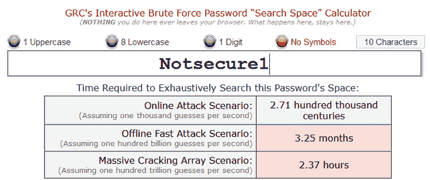

图 9.10 – 在线与离线密码破解时间

如前图所示，在线和离线密码破解时间差异显著，这将把攻击场景从不可行变为现实。

## 环境风险

提醒一下，您需要确保系统、服务器和备份受到环境风险（如飓风、洪水、地震等）可能带来的威胁的保护。

现在，让我们了解一些可以用来提高公司物理安全性的机制和工具。

# 物理安全机制

有多种机制和控制手段可以用来降低与物理安全相关的风险，通常它们分为以下几类：

+   **侦探**：这些是用来*检测入侵*的控制手段——例如，安全摄像头、警报、运动传感器等。

+   **预防性**：这些控制手段旨在*防止某人进入*安全或受限区域——例如，围栏、徽章控制门、密码控制门、人脸识别系统等。

+   **威慑**：这些是用来*阻止攻击者*进入受限区域的控制手段——例如，保安、警报，或者如下一图所示的多种控制手段的组合：

图 9.11 – 威慑控制样本

现在，让我们回顾一些技术来增强我们的物理安全性：

+   **访问控制**：以下是与访问控制相关的一些最佳实践：

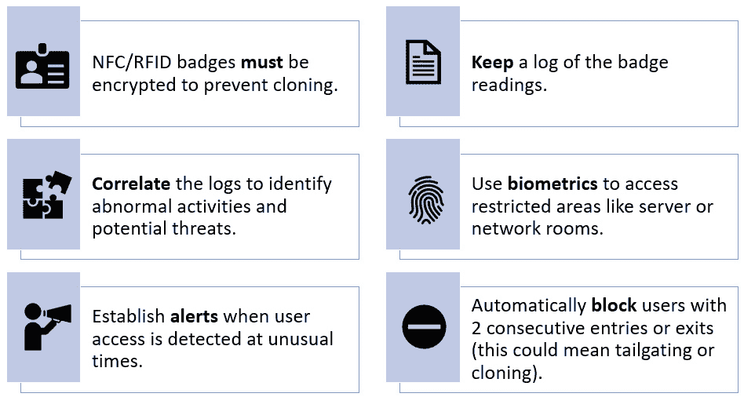

图 9.12 – 与访问控制相关的最佳实践

+   **访客访问控制 – 自动失效徽章**：这是一种非常有趣的技术，用于*安全管理访客*。

图 9.13 – 自动失效徽章样本

该技术基于一种特殊的纸张，经过 24 小时后会显示单词*VOID*，以使徽章失效，如*图 9.13*所示。

这将防止某人使用过期的徽章进入，因其会明确显示该徽章已经失效。

提示

避免使用通用徽章访问建筑物的所有区域。相反，像 IT 机房这样的敏感区域应有不同的访问机制——例如，不同的徽章、键盘、 biometrics 或这些的组合。

现在是时候看看一些额外的提示和好做法，帮助你成为*物理安全*的高手了。

# 精通物理安全

如前所见，物理安全中的主要安全机制基于*防止未经授权的用户获取系统的物理访问权限*。

然而，你可以利用一些额外的机制来*增强你的物理防御安全性*。这些额外的机制和策略将在以下章节中讨论。

## 清洁桌面政策

这项政策不是关于清除桌面上的灰尘和食物，而是关于限制员工在工作站上可以留下的无人看管物品。以下是一些需要考虑的例子：

+   文件柜在用户不在桌面时必须始终锁好。

+   不得将文件、笔记或其他数据源放在桌面上无人看管。

+   不得将可移动设备（如 USB 驱动器）单独放置（无论是连接还是断开连接于计算机）。

+   不得将**敏感**的**个人信息**（**SPI**）或**个人身份信息**（**PII**）放置在桌面上无人看管。

图 9.14 – 清洁桌面政策示例

这项政策对你和公司都非常重要，因为它作为一层额外的安全防护，防止外部攻击者入侵。事实上，成功实施此政策的公司，还能减少其他公司风险，例如入侵、盗窃等。

提示

这些政策必须配合人力资源部门的严厉制裁，以确保每个人都在遵守。此外，如果你指派审计员进行每日检查，这项政策最终将成为组织文化的一部分。

就所有权和实施而言，最佳做法是由人力资源部门负责实施并拥有此政策，因为他们可能拥有更多的资源来确保该政策在整个公司内的正确执行。然而，请记住，你可能需要成为主要的推广者，以确保政策最初得以制定。

## 物理安全审计

这个机制通常会被忽视，但它应该是你防御策略的重要组成部分。

现在，让我们回顾一下物理安全审计的最佳实践：

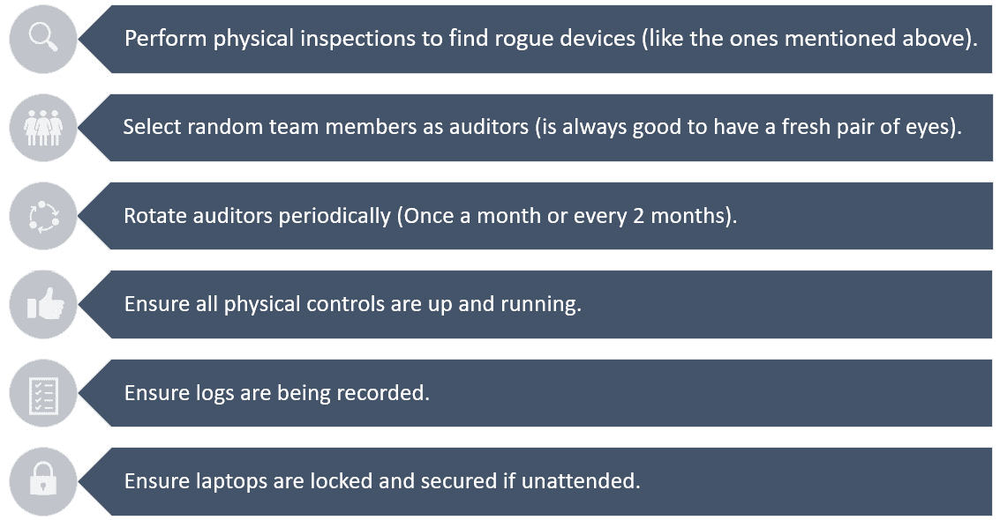

图 9.15 – 物理安全审计的最佳实践

一些公司可能将这些审计作为年度审计的一部分进行。然而，并非所有公司都有预算来执行这一点，因此在这种情况下，建议选择一组志愿者来担任物理安全审计员。你只需要确保他们经过培训，知道如何执行安全审计，并且对相关政策有深入理解。此外，由于这些不是正式的审计，你可以更频繁地进行，例如每周五或每个月的最后一个星期一，等等。

此外，正如在*第三章*《理解政策、程序、合规性与审计》中提到的那样，*在推出任何类型的审计之前，你需要确保获得高级管理层、人力资源和法律部门的批准。*

# 总结

在本章中，你学到了许多关于攻击者如果获得物理访问权限后，可能用来攻击你的基础设施和系统的最新、最先进的设备。

这些知识将帮助你更好地理解当前的威胁环境，你也将能够轻松识别这些设备，并在对你的基础设施和数据造成重大影响之前将其移除。

事实上，我知道每次你进入会议室时，第一件事就是查看投影仪，确保周围没有**屏幕蟹**。

此外，所有这些知识将帮助你创建更好的技术和管理控制措施，以改善你的物理安全性，并增强整体防御安全策略。

此外，你也学到了物理审计的价值，现在你可以实施或强制执行它们，或者如果你还没有执行，可以开始实施。

现在，为下章做准备，我们将探讨如何保护**物联网**（**IoT**）设备的激动人心的世界，并学习如何将这些设备转换为*下一代*防御性安全工具。

# 进一步阅读

如果你想了解更多关于我们刚刚回顾的那些惊人的工具（如 LAN Turtle、Plunder Bug、Packet Squirrel、Shark Jack、Screen Crab 和 Key Croc），那么只需访问以下链接：[`docs.hak5.org/hc/en-us`](https://docs.hak5.org/hc/en-us)。
