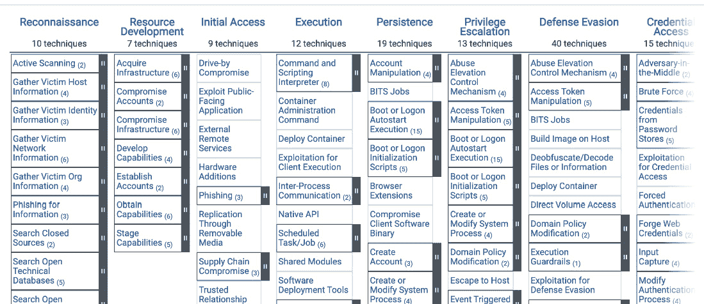
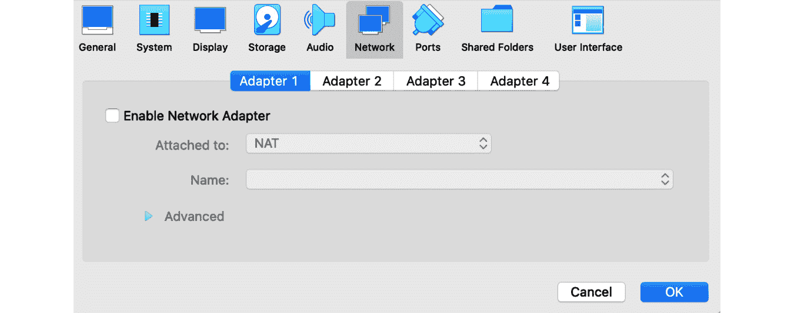

# 1

# 网络犯罪、APT 攻击与研究策略

我们的现代世界越来越依赖各种 IT 系统。能够控制这些系统以及它们可能包含和处理的信息，是一种强大的力量，吸引了各种类型的犯罪分子。

在本章中，我们将讨论至今为止网络犯罪格局的演变，以及恶意软件分析在对抗其中的角色。然后，我们将深入探讨各种类型的攻击及其相关恶意软件，以了解可能的攻击阶段及其背后的逻辑。此外，我们还将学习不同的研究策略和方法，这些方法对于所有平台都具有普遍性，帮助恶意软件分析师完成工作，从收集相关的遥测数据和样本，到执行**逆向工程**（**RE**）任务，并回答具体问题。

在本章中，将涵盖以下主题：

+   为什么进行恶意软件分析？

+   探索恶意软件的类型

+   MITRE ATT&CK 框架解析

+   APT 和零日攻击以及无文件恶意软件

+   选择你的分析策略

+   环境设置

# 为什么进行恶意软件分析？

网络攻击无疑在增加，目标包括政府、军事和公私部门。实施这些攻击的行为者可能有多种动机，比如作为间谍活动的一部分窃取有价值的信息，通过勒索等多种方式获取金钱，或以破坏资产和声誉的方式进行破坏活动。

对数字系统的依赖日益增加，这种趋势在 COVID-19 大流行期间急剧加速，近年来，恶意软件，尤其是勒索软件相关事件也呈现大幅上升。

随着对手变得越来越复杂，并执行越来越先进的恶意软件攻击，能够迅速检测和应对此类入侵对于网络安全专业人员至关重要，而分析恶意软件所需的知识、技能和工具对于高效完成这些任务至关重要。

在本节中，我们将讨论作为恶意软件分析师，你在应对此类攻击、寻找新威胁、创建检测方法或生成威胁情报信息方面的潜在影响，旨在帮助你和其他组织更好地准备迎接即将到来的威胁。

## 恶意软件分析在收集威胁情报中的作用

威胁情报（也称为网络威胁情报，通常缩写为威胁情报或**CTI**）是信息，通常以**入侵指标**（**IoC**）的形式存在，供网络安全社区用于识别和匹配威胁。它有多个目的，包括攻击检测和防御，以及归因，使研究人员能够将线索连接起来，识别可能来自同一攻击者的当前和未来威胁。**IoC**的例子包括样本哈希（最常见的是 MD5、SHA-1 和 SHA-256）和网络痕迹（主要是域名、IP 地址和 URL）。**IoC**在社区中的交换方式有很多种，包括专门的共享计划和出版物。**攻击指标**（**IoA**）通常也用于描述很可能与恶意活动相关的异常行为。一个典型的例子是位于**非军事区**（**DMZ**）的机器突然开始与多个内部主机进行通信。如我们所见，与需要额外背景信息的原始**IoC**不同，**IoA**更能揭示攻击的意图，因此可以轻松地映射到特定的**战术、技术和程序**（**TTP**）。

与其他方法（如日志分析或数字取证）相比，恶意软件分析提供了一个非常准确和全面的**IoC**列表。这些**IoC**中的一些可能很难通过其他数字调查或取证方法来识别。例如，它们可能包括合法网站（如 Twitter、Dropbox 等）上的特定页面、帖子或帐户。追踪这些**IoC**最终有助于更快地摧毁相关的恶意活动。

恶意软件分析还为每个**IoC**所代表的含义提供了宝贵的背景信息。如果在组织中检测到这些**IoC**，理解其背景可能有助于优先处理相应的事件。

## 恶意软件分析在事件响应中的作用

一旦在组织内检测到攻击，响应过程就会启动。首先是对受感染的机器进行隔离，并进行取证调查，旨在了解恶意活动的原因和影响，从而采取正确的修复和预防策略。

当恶意软件被识别后，恶意软件分析过程就开始了。首先，通常涉及到查找所有相关的**IoC**（入侵指标），这有助于发现其他受感染的机器或被妥协的资产，并找到其他相关的恶意样本。其次，恶意软件分析有助于理解载荷的功能。恶意软件是否会在网络中传播？它是否窃取凭证和其他敏感信息，或者是否包含针对未打补丁漏洞的攻击？所有这些信息都有助于更精确地评估攻击的影响，并找到合适的解决方案，以防止未来发生类似事件。

此外，恶意软件分析还可以帮助解密和理解攻击者与受感染机器上的恶意软件之间发生的网络通信。一些企业网络安全产品，如**网络检测响应**（**NDRs**），可以记录可疑的网络流量，供后续调查。解密这些通信可能使恶意软件分析和事件响应团队更好地理解攻击者的动机，并更准确地识别被攻击的资产和被窃取的数据。

正如您所看到的，恶意软件分析在应对网络攻击中发挥着重要作用。它可能涉及组织中的一个独立团队，或者是具备相关恶意软件分析技能的事件响应团队成员。

## 恶意软件分析在威胁狩猎中的作用

与事件响应相比，威胁狩猎是主动寻找**攻击迹象**（IOAs）。它可以更加主动，发生在安全警报触发之前，或者是反应性地解决现有问题。在这种情况下，理解可能的攻击者战术和技术至关重要，因为它可以让网络安全专业人员获得更高层次的视角，更有效地导航潜在的攻击面。这个领域的一个重大进展是 MITRE ATT&CK 框架的创建，我们稍后将详细讨论它。

恶意软件分析知识帮助网络安全工程师成为更专业的威胁猎人，深入理解攻击者的技术和战术，并充分了解其背景。特别是，它有助于理解攻击是如何实施的，例如，恶意软件是如何与攻击者/**指挥与控制**（**C&C**）服务器进行通信、伪装自己以绕过防御、窃取凭证和其他敏感信息、提升权限等，这将指导威胁狩猎过程。掌握这些知识后，您将更好地理解如何在日志或系统的易失性和非易失性数据中高效地搜索这些技术。

## 恶意软件分析在创建检测中的作用

全球多家公司开发并分发网络安全系统，以保护其客户免受各种类型的威胁。检测恶意活动的方法有很多种，涵盖了攻击的不同阶段，例如，监控网络流量、检查系统日志和注册表项，或静态和执行时检查文件。在许多情况下，这需要开发某种规则或签名，用以区分恶意模式和良性模式。恶意软件分析在这方面是不可替代的，因为它帮助安全专业人员识别这些模式并创建出不产生误报的强大规则。

在下一部分，我们将讨论如何根据恶意软件的功能对其进行分类。

# 探索恶意软件的类型

在本节中，我们将讨论恶意软件存在的一般原因，它与其他计算机程序的不同之处，以及我们在现实世界中可能遇到的不同种类。

## 恶意软件发展的简史

在个人电脑崛起之前，只有非常少数的软件开发者。它们的目标是最大限度地利用当时可用的硬件，改善人们的生活，无论是会计软件、将人类送入太空的软件，还是游戏。迅速发展的网络将多台计算机连接在一起，使计算机和人们能够进行远程通信。大约在同一时期，随着计算机的进一步普及，使普通大众能够更负担得起，全球范围内的第一个黑客社区开始出现。然而，正是在学术界，出现了一个具有重大影响的最臭名昭著的恶意软件事件——莫里斯蠕虫。它能够通过网络传播到其他计算机，利用多个漏洞，主要是`sendmail`和`fingerd`软件中的漏洞。然而，蠕虫没有检查目标计算机是否已被感染，从而在每台计算机上生成多个副本，迅速消耗受害者的所有系统资源，使其无法使用。它仅仅出于纯粹的兴趣而创建，向世界展示了几行代码可能带来的后果，并导致了第一次因恶意软件开发而被定罪的案件。此后，许多其他类型的恶意软件开始出现。那时，创作者们的主要目标是展示他们在社区中的技能。

随后，焦点慢慢转向了赚钱。编程变得越来越流行，学校和大学开始教授编程，而新型高级编程语言的出现使得经验较少的人也能开始编写自己的代码，包括恶意代码。最终，职业化的网络犯罪团伙开始出现，明确分工，使得恶意软件开发成为一个非常有利可图的有组织的非法活动。这些团伙利用了所有可能的洗钱手段，包括最初的“金钱驮运者”以及后来的加密货币，以避免追踪和随后的逮捕。这些团体通常被称为“以财务为动机的行为者”。

在过去几年里，以财务为动机的团体逐渐将焦点从攻击消费者转向攻击大型组织，并通过一次攻击在一个地方赚取大笔钱。最常见的例子是使用勒索软件加密受害者的文件，然后要求赎金以恢复访问权限。在许多情况下，还使用了双重勒索方案，犯罪分子威胁要将敏感材料公开。

政府也开始寻求利用恶意软件进行网络间谍活动和破坏的可能性。正是 Stuxnet 攻击真正引起了公众对其存在及其初步毁灭性能力的关注。参与这一过程的恶意软件开发团队通常是由国家资助的。除此之外，还有一些公司公开开发并出售先进的监控恶意软件给政府。例子包括 NSO 集团，销售 Pegasus 威胁；Hacking Team 公司，提供 Da Vinci 和 Galileo 平台；以及 Lench IT Solutions（Gamma 集团的一部分），销售 FinFisher 间谍软件。

毫不奇怪的是，恶意软件会跟随最常用的平台，以获得尽可能广泛的覆盖范围。因此，基于 Windows 的恶意软件仍然在工作站中最为普遍。在移动市场中，Android 仍然是市场领导者，因此也是最多恶意软件家族的攻击目标。最后，**物联网** (**IoT**) 恶意软件也在上升，目标是历史上保护较少的智能设备（大多基于 Linux）。当然，这并不意味着平台不常见就更安全，没有恶意软件。

## 恶意软件类别

恶意软件类别通常是根据其影响或传播方式来定义的。不同的杀毒公司可能会在定义或命名上稍有不同。以下是一些最常见的例子：

+   **特洛伊木马**：最常见的恶意软件类别，简单定义为在用户未察觉的环境中执行恶意活动，得名于用于征服特洛伊城的传奇特洛伊木马：

    +   **下载器**：这里的主要目标是下载并以某种方式执行外部负载（无论是明确地还是通过将其添加到自动运行中）。

    +   **投放器**：这里，额外的负载并不是通过下载获取，而是从特洛伊木马的主体中提取出来。

    +   **后门程序**，也叫**远程访问木马** (**RAT**)：在这种情况下，恶意软件可以接收远程指令，执行一系列操作。

    +   **勒索软件**：在这种情况下，攻击者通过某些手段阻止用户进行日常活动，并要求支付赎金以恢复这些活动。这通常是通过锁定整个系统或锁定系统中特定文件的访问来实现的。另一种常见的情况是，攻击者指控个人犯有某种罪行，并要求支付“罚款”，威胁如果不支付就会升级或公开此事。

    +   **信息窃取者，也叫** **密码窃取者** (**PWS**)：这里的主要目标是窃取敏感信息，例如各种已保存的凭据（来自其他机器、金融机构、社交网络、电子邮件和即时消息账户、视频游戏等）。

    +   **间谍软件**：尽管间谍软件的目的是与信息窃取者类似，但这一类别更广泛，也可能包括视频和音频录制功能，或通过 GPS 追踪受害者的位置。

    +   **银行木马**：这一类通常属于信息窃取者，但目的更为狭窄，潜在功能范围更广。在这种情况下，恶意软件可能特别集中在获取金钱上，因此它也可能支持截取银行发送的**两因素认证**（**2FA**）的一次性令牌，修改财务信息以重定向支付，或注入脚本来拦截输入的银行凭证。

    +   **DoS**：这里的主要目标是**拒绝服务**（**DoS**），使目标系统或服务无法使用；通常用于破坏、黑客行为或恶意破坏目的。

    +   **清除器**：在这种情况下，恶意软件用于删除对系统操作至关重要或敏感的信息，从而成为拒绝服务攻击的另一个工具。

    +   **DDoS**：在这种情况下，发起了**分布式拒绝服务**（**DDoS**）攻击，其中多个机器人通过网络攻击受害者。

    +   **垃圾邮件发送者，也叫** **垃圾邮件怪物**：这个威胁可以代表受害者发送垃圾邮件。

    +   **点击者**：在这种情况下，攻击者可能模拟真实用户的点击，以从广告中获利，进行搜索引擎污染，或推广虚假账户。

    +   **矿工**：在这种情况下，受害者不知情的计算机被用于挖掘加密货币，消耗计算机的宝贵资源。

    +   **打包**：这个名字并不指代相关威胁的实际目的，通常意味着相应的样本使用了某种恶意打包工具进行保护。

    +   **注入器**：这个名字并不指代威胁的实际目的，而是指相应的样本由于某种原因使用了进程注入（关于潜在使用案例的更多信息，请参见专门的*第五章*，*检查进程注入和 API 钩子*）。

+   **蠕虫**：这一类威胁的定义是能够在不同机器之间自我传播。根据它们传播所使用的协议（例如 IRC）或媒介（即时消息、电子邮件等），蠕虫有多种变体。

+   **病毒**：与在机器之间传播的蠕虫不同，文件感染者的主要目标是在当前系统中传播，通过感染其他可执行文件和文档。在这种情况下，当受害者打开/启动合法文件时，控制权也会转交给恶意代码。它的使用方式有几种变体，包括实际将恶意代码和数据写入可执行文件并将宏模板添加到文档中，或只是将受害者文件替换为自己的文件，并将原始文件的副本存储在其他地方以便稍后执行。

+   **Rootkit**：如今，这个名称没有单一的定义。最初用来定义提升权限的工具（赋予 root 访问权限），但现在最常用的定义是用于隐藏其他威胁或仅在内核模式下运行的威胁。更多信息请参见*第七章*，*理解内核模式 Rootkit*。

+   **引导木马**：这类威胁会将自己插入到启动过程中（例如，通过修改启动扇区或启动加载器），以便在操作系统加载之前获得访问权限。

+   **漏洞利用**：在此，恶意软件利用受害者软件中的漏洞来实现其目标（提升权限、访问敏感信息、执行**任意代码执行**（**ACE**）等）。请参阅 *第八章*，*处理漏洞利用和 Shellcode*，以获取更多有关漏洞利用的信息。

+   **假冒防病毒**：这类威胁向用户展示各种关于系统 allegedly 严重问题的警告，并强烈要求购买其“完整版”以解决问题。

+   **骗局**：通常作为一个玩笑或恶作剧创造，这类威胁旨在仅仅通过吓唬用户，让他们担心某个“严重”的但实际上并不存在的问题。

+   **PUAs**：即**潜在不需要的应用程序**，这些威胁通常涉及较少破坏性但依然烦人的活动，例如默默安装合法但未经请求的应用程序。

+   **广告软件**：在这种威胁下，受害者会看到未经请求的广告，许多情况下这些广告会非常侵入且难以移除。

+   **黑客工具**：这是一个大类别，涉及多种工具，既可以被攻击者使用，也可以被网络安全专业人员使用，例如用于红队演练的目的。

+   `psexec` 工具由 Sysinternals 提供，可以用于在远程机器上执行命令，以及各种远程管理工具。

在许多情况下，样本会同时属于多个类别。例如，一个样本可以通过窃取凭证并下载附加有效载荷来传播为蠕虫，而另一个样本可能会执行像后门这样的自定义命令；这些命令包括信息窃取、通过利用漏洞提升权限，以及组织 DDoS 攻击。最终选择的单一类别通常由每个杀毒公司政策决定，其中某些类别优先于其他类别，通常是基于潜在影响。

有时，软件可能会落入所谓的灰色软件类别。在这种情况下，可能并不完全清楚该软件是合法的还是恶意的。例如，一些形式的 PUAs 和广告软件，或类似假冒防病毒程序的安全软件，提供的好处与其要求的价格相比极其有限。通常，是否将其识别为病毒由每个杀毒公司决定。

## 命名约定

不幸的是，网络安全社区尚未就恶意样本命名达成统一的通用规范，每个杀毒软件厂商都可以自由使用自己的命名方式。通常，检测名称会包括目标平台、恶意软件类别和家族，有时还会包括版本和检测技术。以下是基于**VirusTotal**结果，不同厂商对于同一个恶意软件样本 9e0a15a4318e3e788bad61398b8a40d4916d63ab27b47f3bdbe329c462193600 使用的检测名称：

+   Avast：*ELF:CVE-2017-17215-A [Expl]*

+   DrWeb：*Linux.Packed.1037*

+   卡巴斯基实验室：*HEUR:Backdoor.Linux.Mirai.b*

+   微软：*Trojan:Win32/Ceevee*

+   索福斯：*Linux/DDoS-CI*

+   思杰：*Trojan.Gen.NPE*

如我们所见，不同厂商通常会为同一个恶意软件家族指定不同的名称。此外，许多公司有默认名称，如果识别或创建恶意软件家族名称太昂贵，或者根本不值得这样做，它们会使用这些名称；例如 Agent、Generic、Gen 等。在许多情况下，当某些威胁的源代码被泄露到公开渠道、在黑客团体之间交换，或被同一作者在另一个项目中重用时，情况变得更加复杂，这导致了结合多个恶意软件家族代码和功能的威胁的产生。选择恶意软件家族名称时，可以遵循公司政策，或者如果你需要一个与厂商无关的名称，可以考虑使用 MITRE ATT&CK 的命名方式。

# MITRE ATT&CK 框架解释

如我们之前所提到的，不同的网络安全厂商通常会给黑客团体和恶意软件家族起不同的名称。因此，知识交流变得更加复杂，最终影响到社区的表现。MITRE ATT&CK 框架的创建就是为了应对这一问题以及其他类似的问题，并让安全专家能够使用统一的语言。这个框架是一个与厂商无关的全球知识库，涵盖了多种攻击技术，并按战术进行分组，同时提供了利用这些技术的攻击者和恶意软件示例，从而为这些战术赋予了广泛接受的名称。

## 基本术语

以下是该领域中使用的一些最重要的术语：

+   **Tactic（战术）：** 代表攻击者的高层次目标，说明为什么执行相应的动作

+   **Technique（技术）：** 实现高层次目标的实际方式

+   **Sub-technique（子技术）：** 更详细和更具体的描述，说明某一特定行为是如何执行的

+   **Procedure（过程）：** 技术/子技术的实际实现

+   **TTPs（战术、技术和程序）：** 代表攻击者使用的方法的总结，并解释通过使用这些方法可以实现的目标

+   **Group（团体）：** 代表一组可能由单个实体执行的相关对抗性活动，通常通过该名称识别

+   **Mitigation（缓解）：** 用于绕过或防止攻击的技术和概念

+   **软件**：可以用于实施对抗行动的代码，结合了公开的工具和恶意软件。

+   **矩阵**：与特定行业领域相关的 TTP（技术、战术和程序）组合。

在该框架中，针对企业、**工业控制** **系统**（**ICSs**）和移动领域有多个矩阵。最常用的是企业矩阵，因此我们将详细讨论它。

## 企业矩阵

目前，企业框架定义了以下策略：

+   **侦察**：此阶段涉及收集关于受害者的相关信息，以便执行成功的攻击，例如，关于某个组织的基础设施和人员。

+   **资源开发**：在此阶段，攻击者根据收集的信息建立所有所需的依赖项。可以通过多种方式实现：购买/租赁、创建或窃取前提条件（例如，托管或软件）。

+   **初始访问**：在此阶段，攻击者尝试在受害者的环境中建立第一个立足点。此策略最常见的一个例子是发送网络钓鱼邮件（主要是电子邮件）。

+   **执行**：在此阶段，攻击者在受害者的环境中执行任何形式的代码，以实现他们的目标。

+   **持久性**：包括攻击者为保持其在受害环境中的存在所做的所有事情。常见的例子包括将恶意代码添加到自动运行项中或将 SSH 密钥添加到授权条目的列表中。

+   **特权升级**：由于初始访问在许多情况下是通过入侵低权限账户实现的，攻击者在此阶段试图获取更高的权限，以便对受影响的环境进行更多的控制。

+   **防御规避**：攻击者在此阶段的主要目标是避免被发现，直到他们的目标达成。常见的例子包括混淆恶意代码或将相关文件标记为隐藏。

+   **凭证访问**：此策略涉及窃取凭证并稍后滥用它们。这里一些最常见的技术包括转储保存的凭证和拦截凭证，例如通过记录按键来获取。

+   **发现**：在此阶段，攻击者收集有关受害者环境内部的信息，从网络和本地系统开始。这些信息通常用于促进其他策略，如横向移动。

+   **横向移动**：在这个阶段，攻击者向其他机器传播，直到到达感兴趣的系统。

+   **收集**：涉及从受影响的系统中收集各种感兴趣的信息。常见的例子包括窃取专有源代码和文档。

+   **指挥与控制**：此策略涵盖了攻击者可能与被入侵系统进行远程通信的各种方式。

+   **信息外泄**：攻击者可能利用的技术，将敏感信息从被入侵的环境中转移出去。

+   **影响**：最后，这一策略描述了攻击者可能对被攻陷系统造成负面影响的其他方式。常见的例子包括操控、干扰或摧毁关键系统和数据。

图 1.1 – MITRE ATT&CK 企业矩阵的网页表示

值得一提的是，框架并不是静态的，它不断演化，融入用户反馈并解决行业面临的新挑战。每个版本的框架都附带有一个 **结构化威胁信息表达**（**STIX**）格式的表示：[`github.com/mitre-attack/attack-stix-data`](https://github.com/mitre-attack/attack-stix-data)。它支持与各种软件产品的高效集成，并使得在引入变更时能够平衡稳定性和高效监督。STIX 是一种多用途格式，网络安全社区也广泛用于交换 IoC（入侵证据），其中版本 1 基于 XML，版本 2 基于 JSON。

# APT 和零日攻击及无文件恶意软件

在这里，我们将解释一些在白皮书和与恶意软件相关的新闻文章中常见的术语。

## APT 攻击

**APT** 代表 **高级持续性威胁**。通常，恶意软件被赋予这一名称是因为攻击者将其定制化以针对特定实体，无论是组织还是个人。这意味着攻击者选择了一个特定的受害者，并且如果某一种方法不起作用，他们不会轻易放弃。除此之外，威胁应当是相对先进的——例如，它应该有复杂的结构，使用非标准技术或零日漏洞等。

在许多情况下，重复使用 IoC 来进行检测对 APT 恶意软件来说是无效的，因为攻击者会为每个受害者注册新的网络基础设施并重新编译样本。

事实上，没有严格的客观标准来评估某一威胁的高级程度。因此，新闻媒体和受影响的组织通常倾向于过度使用这个术语，使得攻击看起来比实际情况更复杂。通过这种方式，几乎任何相对较新的攻击或导致成功入侵的攻击都可以被称为 APT。

## 零日攻击

许多攻击都涉及利用针对特定漏洞的漏洞利用技术来实现特定目标，如获取初始访问权限或执行特权升级。通常，一旦漏洞被公众知晓，软件供应商会解决该问题并发布补丁，以便最终用户更新系统，从而保护自己免受此类攻击。零日攻击涉及利用零日漏洞，这些漏洞是之前未知的，因此定义了一个“零日”，即漏洞首次被利用的那一天。这对最终用户的意义在于，他们没有办法更新易受攻击的系统，从而解决这一威胁。在这种情况下，用户通常会被提供一些部分解决方法，以暂时减少潜在的影响，直到补丁准备好发布，但这些方法通常有各种缺点，影响系统的性能。

## 无文件恶意软件

恶意软件保持低调有很多原因。首先，它确保恶意软件能够成功进入受害者的环境，并执行所有必要的攻击阶段。其次，它将复杂化检测和修复过程，延长感染时间并增加成功的机会。

**事件响应** (**IR**) 工程师利用所有可能记录恶意活动的地方来构建完整的图像，高效地消除威胁，并防止事件再次发生。这其中的数据科学被称为数字取证。在这个过程中，分析师将收集系统中的各种指标，包括文件痕迹。

所谓的无文件恶意软件应运而生，以防止恶意活动并绕过传统的防病毒产品，后者通常专注于检测以文件形式出现的恶意样本。其理念是，恶意代码没有独立的样本可以检测和删除。相反，它使用的是外壳和内联脚本命令。此类威胁的一个例子是 Poweliks，它将恶意命令存储在注册表键中，提供自动运行功能。

现在所有重要的术语都已经明确，我们可以开始讨论如何处理新的逆向工程任务。

# 选择你的分析策略

逆向工程是一个耗时的过程，很多时候，工程师没有足够的资源去深入挖掘自己想要的内容。优先考虑最重要的事项，并集中精力进行处理，将确保每次都能在规定时间内产生最佳结果。以下是一些可能对这项具有挑战性的任务有所帮助的建议。

## 了解你的受众

根据谁将使用你的工作结果，可操作的交付物可能会有很大的不同。逆向工程的潜在使用案例包括以下几个方面：

+   **威胁情报**：在这里，重点将主要放在获取 IoC（指纹），如哈希值、文件名和网络遗留物。因此，提取嵌入的有效载荷、下载远程样本、查找其他相关模块以及从中提取 C&C 信息，可能是最优先的任务。

+   **AV 检测**：在这种情况下，重点将放在任何独特的元素上，这些元素足够独特，能够创建出稳健的检测机制，并且不会产生**误报**（**FPs**）。例如，与恶意功能相关的独特代码片段和字符串，以及任何自定义加密算法。理解主要逻辑将有助于选择正确的类别，而代码和数据的相似性将有助于确定恶意软件家族。

+   **技术文章或会议演讲**：在这里，最重要的部分将是与功能相关的有趣的新技术细节、与其他恶意软件家族的相似性，以及攻击者的归属分析。

+   **面向大众的文章**：对于非技术人员，通常提供功能的高层次描述，而不涉及太多技术细节，主要集中在影响上。

## 回答观众的问题

回答受众提出的主要问题非常重要。确保在分析报告中明确并易于查找答案。

以下是你的受众在报告中可能需要回答的几个问题：

只要这一部分清晰明确，我们就可以开始优先处理具体的主题。

## 定义你的目标

一旦确认了受众，基于可用的资源（首先是时间和技能）仔细定义你的目标。在此之后，优先考虑选择的目标，并首先集中精力处理最重要的部分。在进行静态分析时，很容易迷失在汇编代码中，因此列出需要完成的任务和优先顺序的清单将帮助你重新回到正轨。

## 避免不必要的技术细节

无论谁将消费你的工作成果，过多的额外细节不会展示你的专业水平，反而会让理解工作变得更加复杂，并浪费时间。常见的例子包括执行的指令、使用的 WinAPI、访问的标准注册表键，或创建的互斥体。因此，你应该执行以下操作：

+   根据目标受众选择所需的详细程度。

+   如果某个事实对读者没有帮助，避免详细阐述。

+   不要仅仅提到技术细节——要解释它们的高级目的，以及攻击者为何必须明确使用它们。

最后，确保覆盖所有重要的部分，并且内容详细且正确。绝不要仅凭直觉或事先知识做出断言，而没有任何与当前样本相关的实际事实。如果你发现了某些信息，但没有时间深入挖掘，可以使用适当的措辞（例如：“有迹象表明……但需要更多的工作来确认”）。

## 示例结构

以下是通常根据格式和受众包含在最终工作中的一些细节。

### 技术文章

在大多数情况下，以下信息将是有用的：

+   样本详情：

    +   哈希值（MD5、SHA1、SHA2）

    +   编译时间戳

    +   文件类型和大小

    +   **在实际环境中** (**ITW**) 文件名

    +   AV 厂商的检测

+   模块间关系（如果涉及多个模块）

+   对于每个模块：

    +   主要功能的描述

    +   持久性机制

    +   网络通信：

        +   协议

        +   加密算法和密钥

        +   C&C 详情（IP 地址、域名、URL、独特的 whois 信息、主机所在国家等）

    +   反逆向工程技术

+   IoCs

+   检测规则（YARA、Snort 等）

### 面向大众的文章

+   以影响为重点的高级功能描述

+   攻击规模

+   受害者概况：

    +   目标组织类型

    +   受害者的地理位置

    +   损失估算

+   行为者归属：

    +   样本相似性

    +   匹配的 IoCs（哈希值、网络工件、文件名等）

    +   使用的语言代码页和字符串

    +   编译时间戳

## 典型的分析工作流程

现在我们知道应该关注什么，接下来的问题是：我们如何组织工作，以在及时的情况下产出最佳结果？以下步骤建议你遵循：

+   **初步筛查**：在此阶段，收集关于样本的最大可用信息：

    +   分析 PE 头部。

    +   检查样本是否可能被打包（高熵块）。

    +   检查公共资源中的已知 IoCs（哈希值、网络工件、AV 检测名称等）。

+   **行为分析**：大多数信息将通过文件、注册表和网络操作获取。通过这种方式，我们可以了解潜在样本的能力。

+   **解包（如有必要）**：在样本解包之前无法进行静态分析，因为实际的恶意代码和数据尚未完全揭示。

+   **静态分析**：通过反汇编器和反编译器进行：

    +   从可用字符串和常见误用的 WinAPI 开始。

+   **动态分析**：通过调试器进行。设置和执行可能会非常昂贵，因此仅在需要时使用：

    +   确认某些功能

    +   处理字符串/API/嵌入载荷/通信加密

# 设置环境

能够安全地分析恶意样本是任何进行反向工程的工程师的前提条件，无论是一次性任务还是日常工作。通常，为此目的使用**虚拟机**（**VM**），因为虚拟机很容易复制、应用任何更改，并保存快照以恢复某些先前的机器状态。另一种选择是使用与关键网络隔离的专用物理机；在这种情况下，通常使用一些备份软件来快速恢复机器的先前状态。本节将讨论为恶意软件分析设置安全环境以及需要关注的最重要步骤。

## 选择虚拟化软件

当你准备好创建新的虚拟机时，首要任务是选择将用于此目的的软件。通常，反向工程师的首选包括以下几种：

+   **VMware**：一种非常流行的商业解决方案，还提供一个免费的播放器来运行已经存在的虚拟机

+   **VirtualBox**：一个免费的功能齐全的替代方案，允许创建和运行虚拟机

以上两种选项都提供类似的面向终端用户的功能和特性，例如快照管理、共享端口、设备、文件夹、剪贴板和网络访问的仿真。

**QEMU**是另一种选择，但该项目历来更多关注仿真而非虚拟化，其**用户界面**（**UI**）对于日常反向工程工作可能不够友好。其他值得一提的项目包括**基于内核的虚拟机**（**KVM**）虚拟化模块，通常与 QEMU 一起使用，以及 Xen 和 Hyper-V 虚拟机监控程序。

无论你选择什么软件，对应的虚拟机（VM）镜像通常可以从一种类型转换为另一种类型。然而，每种虚拟化软件都有自己独特的来宾工具，使得能够使用共享剪贴板等功能——在这种情况下，需要单独安装并进行设置。

最后，还有一些预构建的虚拟机镜像，已经预安装了一套反向工程工具：

+   **FLARE VM**：一个免费的开源基于 Windows 的解决方案，受到 Mandiant/FireEye 支持

+   **REMnux**：一个免费的开源基于 Linux 的发行版，也提供预构建的虚拟机

## 安全特性

以下是创建针对反向工程（RE）虚拟机实验室时应遵守的顶级安全特性：

+   **禁用网络**

如我们所知，许多恶意软件类别可能会滥用网络进行恶意活动。无论是发送垃圾邮件、传播到其他机器，还是窃取工程师的专有许可证，基本原则是在默认情况下禁用网络。可以使用很多技术和软件来模拟网络连接以进行分析，例如 INetSim 和 FakeNet。

图 1.2 – 在 VirtualBox 虚拟机设置中禁用网络

+   **无共享设备**

许多虚拟化软件默认将连接的外部物理设备映射到虚拟机。这可能非常危险，例如在 USB 驱动器的情况下。在这种情况下，恶意软件可能通过这些设备传播，并逃脱安全环境。因此，所有此类设备都应该禁用。

图 1.3 – 在 VirtualBox 虚拟机设置中禁用 USB 控制器

+   **小心共享文件夹**

共享文件夹将主机机器上的一些文件夹映射到来宾（虚拟）机器上的文件夹，便于文件传输。主要问题是病毒可能感染存放在这些文件夹中的文件（例如可执行文件或文档），或用恶意文件替换现有文件。这样，恶意软件就找到了进入主机机器的途径。因此，共享文件夹应该谨慎使用。一个方法是避免将任何文件存放在这些文件夹中过长时间：将文件复制到主机机器上的共享文件夹后，在来宾虚拟机上将其移出，并确保文件夹空置，直到下一个任务。将共享文件夹设置为仅读模式也是一个选择。

一旦我们准备好实验室虚拟机，接下来的问题是——如何将恶意样本复制到虚拟机中进行分析？有多种方法可以做到这一点：

+   **私有网络**：理想情况下，应避免使用私有网络，因为在来宾机上运行的恶意软件可能也会访问主机机器的网络。

+   **共享文件夹**：如前所述，请谨慎使用。

+   **共享剪贴板**：这是最安全的解决方案之一。需要在虚拟机上安装来宾附加功能才能使用。

关于将文件从虚拟机（VM）移回生产 PC 的操作，基本原则是要极其小心。考虑仅将包含你工作成果的文本文件和类似文件进行转移。如果必须转移任何包含恶意代码和数据的文件（包括内存转储和网络 PCAP 文件），考虑使用密码保护的压缩档案来存储这些文件，并确保不要在主机上解压它们。

# 总结

在这一章中，我们了解了各种现代威胁类型，并解释了网络安全社区中使用的一些重要术语。我们讨论了 MITRE ATT&CK 框架，概述了它的功能，并突出了其中一些重要特点。我们还提供了如何设置安全环境以分析恶意软件的指导。最后，我们提供了关于如何通过多种方式组织处理恶意样本工作的建议。

在下一章中，我们将介绍各种汇编语言的基础知识，这将为我们理解恶意软件功能以及进行静态和动态分析不同类型威胁提供必要的基础知识。
