# 3

# x86/x64 的基本静态和动态分析

在本章中，我们将介绍分析 Windows 平台上 32 位或 64 位恶意软件所需掌握的核心基础知识。我们将介绍**Windows 可执行文件头**（**PE 头部**），并了解它如何帮助我们回答不同的事件响应和威胁情报问题。

我们还将讲解静态和动态分析的概念和基础，包括进程和线程、进程创建流程以及 WOW64 进程。最后，我们将介绍进程调试，包括设置断点和修改程序执行。

本章将帮助你通过解释理论和提供实用知识来执行恶意软件样本的基本静态和动态分析。通过这样做，你将学习到恶意软件分析所需的工具。

在本章中，我们将涵盖以下主题：

+   使用 PE 头部结构

+   静态和动态链接

+   使用 PE 头部信息进行静态分析

+   PE 加载和进程创建

+   使用 OllyDbg 和 x64dbg 进行动态分析基础

+   调试恶意服务

+   行为分析要点

# 使用 PE 头部结构

当你开始对文件进行基本的静态分析时，首要的有价值的信息来源将是 PE 头部。PE 头部是任何可执行 Windows 文件遵循的结构。

它包含各种信息，例如支持的系统、包含代码和数据（如字符串、图像等）的段的内存布局，以及各种元数据，帮助系统正确加载和执行文件。

在本节中，我们将探讨 PE 头部结构，学习如何分析 PE 文件并读取其信息。

## 为什么选择 PE？

可执行文件结构能够解决之前结构中出现的多个问题，例如用于 MS-DOS 可执行文件的 MZ 格式。它代表了任何可执行文件的完整设计。PE 结构的一些特点如下：

+   它将代码和数据分隔到不同的段中，使得数据可以与程序分开管理，并能够在汇编代码中重新链接任何字符串。

+   每个部分都有独立的内存权限，作为对每个程序虚拟内存的安全层。这些权限旨在允许或拒绝对特定内存页面的读取、对特定内存页面的写入或对特定内存页面的代码执行。一页内存通常为*0x1000*字节，即十进制的*4,096*字节。

+   文件在内存中展开（在硬盘上占用较少的空间），这使得您可以为未初始化的变量（应用程序使用前没有分配特定值的变量）创建空间，同时节省硬盘空间。

+   它支持动态链接（通过导入导出目录），这是一项非常重要的技术，我们将在本章稍后讨论。

+   它支持重定位，允许程序在内存中加载到不同的位置，而不是它设计时要加载的位置。

+   它支持资源部分，可以存储任何额外的文件，例如图标。

+   它支持多个处理器、子系统和文件类型，这使得 PE 结构可以在许多平台上使用，例如 Windows CE 和 Windows Mobile。

现在，让我们谈谈 PE 结构的样子。

## 探索 PE 结构

在本节中，我们将深入探讨 Windows 操作系统中典型可执行文件的结构。微软使用这种结构表示 Windows 操作系统中的多个文件，例如应用程序或库，适用于多种设备类型，如个人电脑、平板电脑和移动设备。

### MZ 头部

在 MS-DOS 早期，Windows 和 DOS 共存，并且两者都使用相同扩展名的可执行文件，`.exe`。因此，每个 Windows 应用程序都必须以一个小的 DOS 应用程序开始，该程序打印一条消息，表示`该程序无法在 DOS 模式下运行`（或任何类似的消息）。这样，当 Windows 应用程序在 DOS 环境中执行时，开始的这个小 DOS 应用程序会执行并向用户打印消息，提示在 Windows 环境中运行。下图展示了 PE 文件头的高级结构，其中**DOS 程序的 MZ 头**位于开始部分：


图 3.1 – 示例 PE 结构

该 DOS 头部以`MZ`魔术值开始，并以一个叫做`e_lfanew`的字段结束，该字段指向**可移植执行文件**（**PE 头**）的开始。

### PE 头部

PE 头部以两个字母`PE`开始，后跟两个重要的头部，即文件头和可选头。接下来，所有附加结构都由数据目录数组指向。

### 文件头

本头部的一些重要值如下：


图 3.2 – 文件头解释

高亮显示的值如下：

1.  `Machine`：此字段表示处理器类型——例如，0x14c 表示 Intel 386 或更高版本的处理器。

1.  `NumberOfSections`：该值表示头部之后的节的数量，例如代码节、数据节或资源节（用于文件或图像）。

1.  `TimeDateStamp`：这是该程序编译的确切日期和时间。它对于威胁情报和创建攻击时间线非常有用。

1.  `Characteristics`：该值表示可执行文件的类型，并指定它是程序还是动态链接库（我们将在本章后面讨论）。

现在，让我们来谈谈可选头部。

### 可选头部

在文件头之后，可选头部带来了更多的信息，如下所示：


图 3.3 – 可选头部解释

以下是该头部中的一些最重要的值：

1.  `魔术值`：此值标识 PE 文件支持的平台（是否是 x86 或 x64）。

1.  `入口点地址`：这是我们分析中非常重要的字段，它指向程序执行的起始点（程序中要执行的第一个汇编指令），相对于其起始地址（基址）。这种类型的地址被称为**相对虚拟地址**（**RVA**）。

1.  `镜像基址`：这是程序设计为加载到虚拟内存的地址。所有使用绝对地址的指令将期望该值作为程序基址。如果程序有重定位表，它可以加载到不同的基址。在这种情况下，所有这类指令将由 Windows 加载器根据该表进行更新。

1.  `节对齐`：每个节和所有头部的大小在加载到内存时应该与此值对齐（通常此值为 0x1000）。

1.  `文件对齐`：PE 文件中每个节的大小（以及所有头部的大小）必须与此值对齐（例如，对于一个大小为 0x1164 的节，如果文件对齐值为 0x200，则该节的大小将变更为 0x1200）。

1.  `主要子系统版本`：表示运行该应用程序所需的最低 Windows 版本，如 Windows XP 或 Windows 7。

1.  `镜像大小`：这是整个应用程序在内存中的大小（通常由于未初始化数据、不同的对齐方式以及其他原因，它大于硬盘上的文件大小）。

1.  `头部大小`：这是所有头部的大小。

1.  `子系统`：指示该程序可能是一个 Windows UI 应用程序、控制台应用程序或驱动程序，或者它也可能运行在其他 Windows 子系统上，例如 Microsoft POSIX。

可选头部以数据目录列表结束。

### 数据目录

数据目录数组指向可能包含在可执行文件中的其他结构列表，并非每个应用程序中都必定包含这些结构。

它包含了以下格式的 16 个条目：

+   `地址`：指向内存中结构的开始位置（从文件的起始部分）。

+   `大小`：这是对应结构的大小。

数据目录包含了许多不同的值；并非所有的值对于恶意软件分析来说都非常重要。以下是一些需要提及的重要条目：

+   **导入目录**：表示程序中没有包含但希望从其他可执行文件或库（DLL）中导入的函数（或 API）。

+   **导出目录**：表示程序中包含在代码中的函数（或 API），并希望导出以供其他应用程序使用。

+   **资源目录**：此目录始终位于资源部分的开始，其作用是表示程序中的包文件，例如图标、图片等。

+   **重定位目录**：它总是位于重定位节的起始位置，用于在 PE 文件加载到内存中的其他位置时修复代码中的地址。

+   **TLS 目录**：**线程局部存储**（**TLS**）指向在入口点之前会执行的函数。它可以用来绕过调试器，稍后我们将详细讨论这一点。

数据目录之后，有一个节表。

### 节表

在数据目录数组的 16 个条目之后，便是节表。每个节表条目代表 PE 文件中的一个节。节的总数是存储在`FileHeader`中的`NumberOfSections`字段中的数字。

这里是一个例子：


图 3.4 – 节表示例

这些字段用于以下目的：

+   `Name`：节的名称（最大 8 字节）。

+   `VirtualSize`：节的大小（在内存中）。

+   `VirtualAddress`：指向内存中节的起始位置的指针（作为 RVA）。

+   `SizeOfRawData`：节的大小（在硬盘上）。

+   `PointerToRawData`：指向硬盘上文件中节的起始位置的指针（相对于文件的起始位置）。这种类型的地址称为偏移量。

+   `Characteristics`：内存保护标志（主要有`EXECUTE`、`READ`或`WRITE`）。

现在，让我们讨论一下 Rich 头。

### Rich 头

这是 MZ-PE 头部中一个鲜为人知的部分。它位于小 DOS 程序之后，该程序会打印`This program cannot be run in DOS mode`字符串，以及 PE 头，如下图所示：

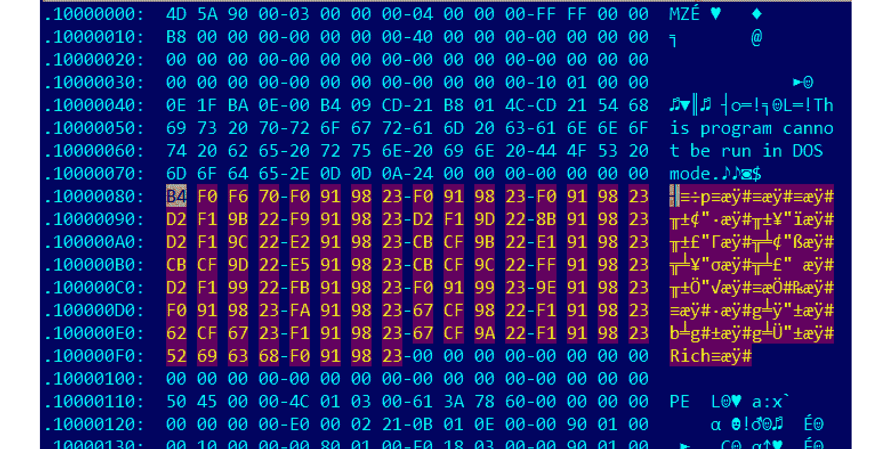

图 3.5 – 原始 Rich 头

与其他头部结构不同，它应该从`Rich`魔法值所在位置的末尾开始读取。其后跟随的值是根据 DOS 头和 Rich 头计算出的自定义校验和，它还作为 XOR 密钥，用于加密该头部的实际内容。一旦解密，它将包含关于用于编译该程序的软件的各种信息。解密后的第一个字段将是`DanS`标记：

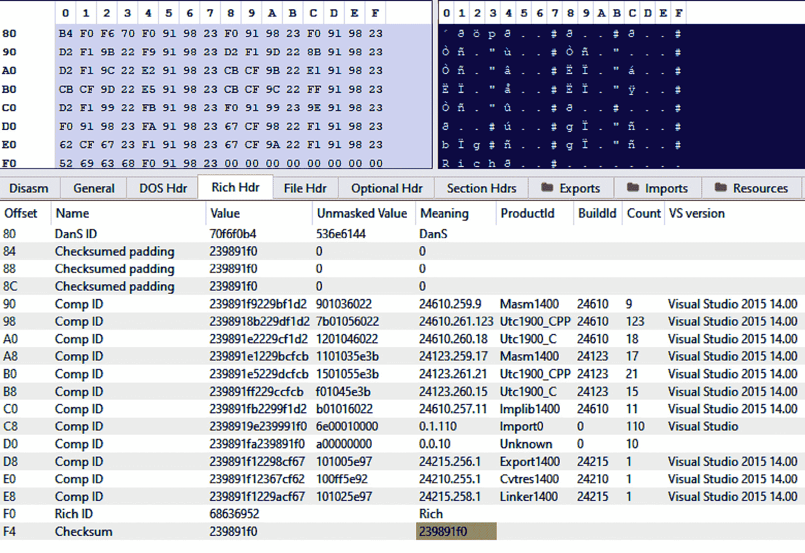

图 3.6 – 在 PE-Bear 工具中解析的 Rich 头

这些信息可以帮助研究人员识别用于创建恶意软件的软件，以便选择正确的分析工具和行为者归因。

如你所见，PE 结构是恶意软件分析人员的宝贵资源，因为它提供了关于恶意功能和创建者的无价信息。

## PE+（x64 PE）

在这一点上，你可能会认为所有 x64 PE 文件的字段相比 x86 PE 文件需要 8 字节，而不是 4 字节。但事实是，PE+头与经典的 PE 头非常相似，只有极少的变化，具体如下：

+   `ImageBase`：它是 8 字节，而不是 4 字节。

+   `BaseOfData`：此字段已从可选头中删除。

+   `Magic`：这个值从 0x10B（表示 x86）更改为 0x20B（表示 x64）。PE+ 文件的最大大小保持在 2 GB，而所有其他 RVA 地址，包括 `AddressOfEntrypoint`，仍然保持为 4 字节。

+   其他一些字段，如 `SizeOfHeapCommit`、`SizeOfHeapReserve`、`SizeOfStackReserve` 和 `SizeOfStackCommit`，现在占用 8 字节，而不是 4 字节。

现在我们已经了解了 PE 头部是什么，接下来让我们讨论一些可以帮助我们提取和可视化这些信息的工具。

## PE 头部分析工具

一旦我们熟悉了 PE 格式，我们需要能够解析不同的 PE 文件（例如 `.exe` 文件）并读取它们的头部值。幸运的是，我们不需要在十六进制编辑器中自己完成这项工作；有许多工具可以帮助我们轻松地读取 PE 头部信息。以下是一些最著名的免费工具：

+   **CFF Explorer**：这个工具非常适合解析 PE 头部，因为它可以正确地分析并呈现所有存储在其中的重要信息：

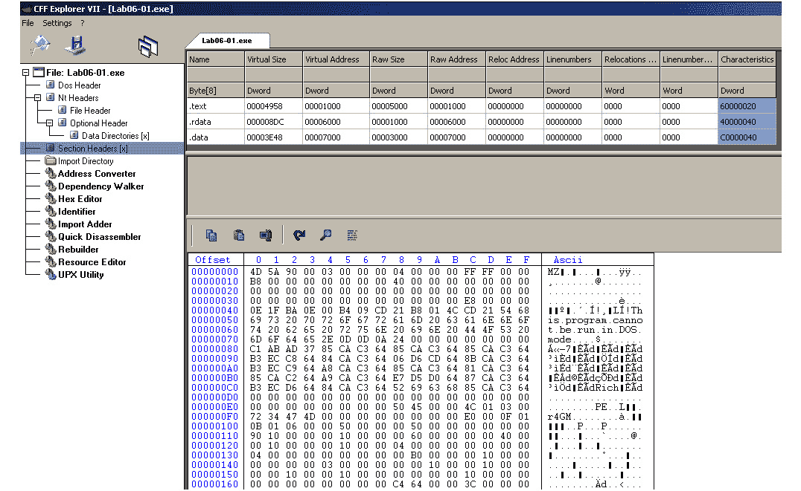

图 3.7 – CFF Explorer 用户界面

+   **PE-bear**：与 CFF Explorer 相比，这个工具的一个巨大优势是它还可以解析 Rich 头部，正如我们所知，它包含了许多关于开发工具的有用信息，这些工具用于创建该样本。

+   **Hiew**：虽然演示版本仅显示 PE 头部信息的一小部分，但完整版则可以让研究人员完全查看，并且可以编辑其中的任何字段。

+   **PEiD**：虽然它主要用于检测编译器（例如 Visual Studio）或用于打包恶意软件的打包工具，它通过应用程序中存储的静态签名进行识别（这一点将在*第四章*，*解包、解密与去混淆*中详细讲解），研究人员可以使用 **>** 按钮从 PE 头部获取大量信息：

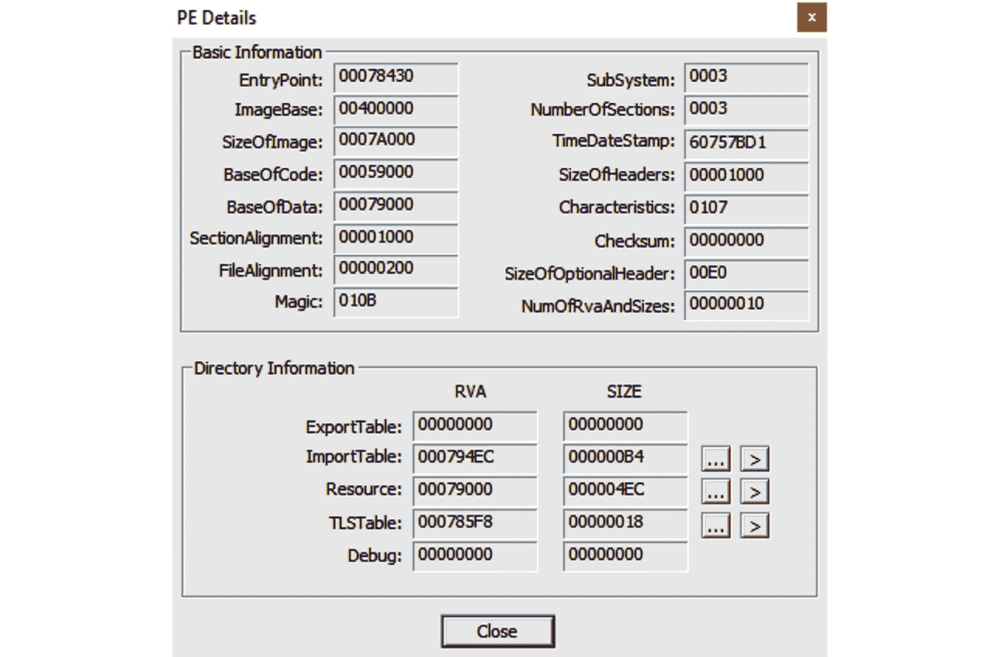

图 3.8 – PEiD 用户界面

在接下来的部分，我们将进一步扩展我们的知识，探索静态和动态链接的细节。

# 静态和动态链接

在本节中，我们将介绍为加速软件开发过程、避免代码重复以及提高公司内不同团队之间协作而引入的代码库。

这些库是恶意软件家族的已知目标，因为它们可以轻松地被注入到不同应用程序的内存中，并冒充它们以掩盖其恶意活动。

首先，让我们讨论一下库的不同使用方式。

## 静态链接

随着不同操作系统上应用程序数量的增加，开发人员发现很多代码被重复使用，相同的逻辑被反复编写，以支持程序中的某些功能。由于这一点，代码库的发明变得非常有用。让我们来看一下下面的图示：


图 3.9 – 从编译到加载的静态链接

代码库 `(.lib` 文件) 包含许多功能，在需要时将其复制到程序中，因此无需重新发明轮子并重新编写这些函数（例如，任何处理数学方程的应用程序中用于数学运算（如 sin 或 cos）的代码）。这是通过一个名为链接器的程序来完成的，其工作是将所有所需的函数（指令组）放在一起，并生成一个单独的自包含可执行文件。这个方法被称为静态链接。

## 动态链接

静态链接的库导致相同的代码在每个需要它的程序中被重复复制，这反过来导致硬盘空间浪费，并且增加了可执行文件的大小。

在像 Windows 和 Linux 这样的现代操作系统中，有数百个库，每个库包含数千个用于 UI、图形、3D、互联网通信等的函数。正因为如此，静态链接显得有限。为了解决这个问题，动态链接应运而生。整个过程在下图中展示：

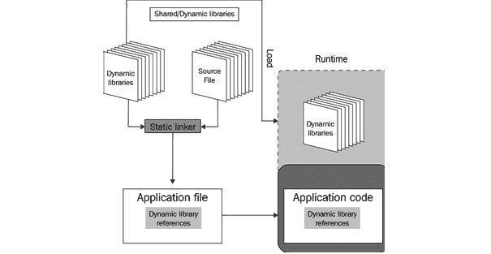

图 3.10 – 从编译到加载的动态链接

与其将代码存储在每个可执行文件中，不如将所需的库加载到每个应用程序旁边的相同虚拟内存中，这样应用程序就可以直接调用所需的函数。这些库被称为**动态链接库**（**DLLs**），如前图所示。我们接下来将详细介绍它们。

## 动态链接库

DLL 是一个完整的 PE 文件，包含所有必要的头文件、段落，最重要的是，导出表。

导出表包括此库导出的所有函数。并非所有库函数都被导出，因为其中一些是供内部使用的。然而，被导出的函数可以通过其名称或*序号*（索引号）访问。这些被称为**应用程序编程接口**（**APIs**）。

Windows 为开发者提供了大量的库，供他们创建面向 Windows 的程序来访问其功能。以下是一些这样的库：

+   `kernel32.dll`：这个库包含所有程序的基本和核心功能，包括读取文件和写入文件。在 Windows 的最新版本中，函数的实际代码已经移至 `KernelBase.dll`。

+   `ntdll.dll`：这个库导出 Windows 本地 API；`kernel32.dll` 使用此库作为其功能的后端。一些恶意软件作者试图访问此库中未记录的 API，以使逆向工程师更难理解恶意软件的功能，例如 `LdrLoadDll`。

+   `advapi32.dll`：这个库主要用于操作注册表和加密。

+   `shell32.dll`：这个库负责与外壳相关的操作，例如执行和打开文件。

+   `ws2_32.dll`：该库负责所有与互联网套接字和网络通信相关的功能，对于理解自定义网络通信协议非常重要。

+   `wininet.dll`：该库包含 HTTP 和 FTP 功能等。

+   `urlmon.dll`：该库提供类似于`wininet.dll`的功能，用于处理 URL、网页压缩、下载文件等。

现在，是时候讨论一下到底什么是 API 了。

## 应用程序编程接口（API）

简而言之，API 在库中导出函数，任何应用程序都可以调用或与之交互。此外，API 也可以像 DLL 一样由可执行文件导出。这样，一个可执行文件可以作为程序运行，或者被其他可执行文件或库加载为库。

每个程序的导入表包含该程序所需的所有库的名称，以及该程序使用的所有 API。在每个库中，导出表包含 API 的名称、API 的序号和该 API 的 RVA 地址。

重要提示

每个 API 都有一个序号，但并非所有 API 都有名称。

### 动态 API 加载

在恶意软件中，使用动态 API 加载隐藏库和 API 的名称，避免静态分析，是一种非常常见的做法。

Windows 通过两个非常著名的 API 来支持动态 API 加载：

+   `LoadLibraryA`：此 API 将一个动态链接库加载到调用程序的虚拟内存中，并返回其地址（变体包括`LoadLibraryW`、`LoadLibraryExA`和`LoadLibraryExW`）。

+   `GetProcAddress`：此 API 返回指定名称或序号值的 API 的地址，以及包含该 API 的库的地址。

通过调用这两个 API，恶意软件可以访问未在导入表中列出的 API，这意味着它们可能会被逆向工程师隐藏。

在一些高级恶意软件中，恶意软件作者还通过加密或其他混淆技术来隐藏库和 API 的名称，这将在*第四章*中讨论，*解包、解密和去混淆*。

这些 API 并不是唯一能支持动态 API 加载的 API；其他技术将在*第八章*中探讨，*漏洞利用和 Shellcode 处理*。

拥有这些知识之后，让我们更深入地了解如何将其付诸实践。

# 使用 PE 头信息进行静态分析

现在我们已经了解了 PE 头、动态链接库和 API，接下来要问的问题是，*如何在静态分析中利用这些信息？* 这取决于你想要回答的问题，接下来我们将讨论这些问题。

## 如何使用 PE 头进行事件处理

如果发生事件，PE 头的静态分析可以帮助你回答报告中的多个问题。以下是问题及 PE 头如何帮助你解答这些问题：

+   *这个恶意软件是经过打包的吗？*

PE 头可以帮助你判断该恶意软件是否经过打包。打包器倾向于将常见的段名（`.text`、`.data`和`.rsrc`）更改为其他名称，例如`UPX0`或`.aspack`。

此外，打包器通常会隐藏大部分原本应存在于导入表中的 API。因此，如果你看到导入表中包含的 API 非常少，这可能是打包行为的另一个迹象。我们将在本书的*第四章*中详细讨论解包，*解密与去混淆*。

+   *这个恶意软件是投放器还是下载器？*

很常见的投放器会在其资源中存储额外的 PE 文件。多个工具，如**Resource Hacker**，可以检测到这些嵌入的文件（或者例如，包含它们的 ZIP 文件），你将能够找到被投放的模块。

对于下载器，通常可以看到一个名为`URLDownloadToFile`的 API，来自名为`urlmon.dll`的 DLL 文件，通过这个 API 可以下载文件，还有`ShellExecuteA` API 用来执行文件。其他 API 也可以实现相同的目标，但这两个 API 是最著名的，并且是恶意软件作者最容易使用的。

+   *它是否连接到指挥与控制服务器（C&C，或攻击者的网站）？是如何连接的？*

有许多 API 可以告诉你恶意软件是否使用互联网，例如`socket`、`send`和`recv`，它们可以告诉你是否连接到充当客户端的服务器，或者是否监听端口，例如`connect`或`listen`。

一些 API 甚至可以告诉你它们使用的协议，例如`HTTPSendRequestA`或`FTPPutFile`，这两个 API 都来自`wininet.dll`。

+   *这个恶意软件还有哪些功能？*

一些 API 与文件搜索相关，例如`FindFirstFileA`，这可能是该恶意软件是勒索软件或信息窃取者的线索。

它可能会使用诸如`Process32First`、`Process32Next`和`CreateRemoteThread`等 API，这可能意味着它具备进程注入的功能，或者使用`TerminateProcess`，这可能意味着该恶意软件试图终止其他应用程序，例如杀毒软件或恶意软件分析工具。

我们将在本书的后面更详细地介绍这些内容。本节为你提供了线索和思路，帮助你在下次进行静态恶意软件分析时思考，并帮助你找到 PE 头中你需要寻找的内容。

通常，专注于报告中应该回答的主要问题是一个好主意。也许基于字符串和 PE 头进行基本静态分析就足以帮助你处理这些问题。

## 如何利用 PE 头进行威胁狩猎

到目前为止，我们已经讨论了 PE 头如何帮助你回答与事件处理或正常战术报告相关的问题。现在，让我们讨论以下与威胁情报相关的问题，以及 PE 头如何帮助你回答这些问题：

+   *这个样本是什么时候创建的？*

有时，威胁研究人员需要知道样本的年龄。它是旧样本还是新变种，攻击者到底何时开始策划他们的攻击？

PE 头部包含一个名为 `TimeDateStamp` 的值，该值位于文件头部。它包括该样本编译的准确日期和时间，这有助于回答这个问题，并帮助威胁研究人员构建攻击时间线。然而，值得提到的是，它也可以被伪造。另一个较少为人知的字段，具有类似的功能，是导出目录（如果存在）的 `TimeDateStamp` 值。

+   *这些攻击者的来源国家是哪个？*

这些攻击者属于哪个国家？这个问题能够揭示出关于他们动机的许多信息。

回答这个问题的一种方法是再次查看 `TimeDateStamp`，它会查看多个样本及其编译时间。在某些情况下，它们符合特定时区的工作时间（9-5），这可能有助于推测攻击者的国家来源，如下图所示：

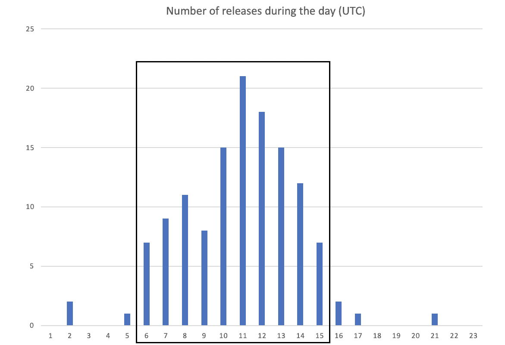

图 3.11 – 编译时间戳的模式

Rich 头部也可以用于归属目的，因为用于编译样本的不同版本的组合通常在特定设置下变化不大。

+   *恶意软件是否使用了被盗的证书？这些样本之间是否有关联？*

数据目录中的一个条目与证书有关。某些应用程序由其制造商签名，以提供额外的信任，确保用户和操作系统该应用程序是安全的。但是这些证书有时会被盗用，并被不同的恶意软件行为者使用。

对于所有使用特定被盗证书的恶意样本，所有样本很可能都是同一行为者所生产的。即使它们的目的不同，或者攻击的目标不同，仍然可能是同一攻击者执行的不同活动。

如我们之前所提到的，PE 头部如果仔细查看其字段中的细节，它是一个信息宝库。在这里，我们介绍了一些最常见的使用场景。它的潜力远不止这些，接下来由你进一步探索。

# PE 加载与进程创建

到目前为止，我们所讨论的内容都与硬盘上存在的 PE 文件相关。我们尚未涉及的是当 PE 文件加载到内存中时，它是如何变化的，以及这些文件的整个执行过程。在本节中，我们将讨论 Windows 如何加载 PE 文件、执行它，并将其转化为一个活跃的程序。

## 基本术语

要理解 PE 加载与进程创建，我们必须先了解一些基本术语，例如进程、线程、**线程环境块**（**TEB**）、**进程环境块**（**PEB**）等，然后才能深入了解加载和执行可执行 PE 文件的流程。

### 什么是进程？

进程不仅仅是内存中正在运行的程序的表示，它还是包含所有关于正在运行的应用程序信息的容器。这个容器存储着与该进程相关的虚拟内存信息，所有加载的 DLL、打开的文件和套接字、作为该进程一部分的线程列表（我们稍后会详细介绍）、进程 ID 等信息。

进程是内核中的一个结构，包含所有这些信息，作为一个实体表示正在运行的可执行文件，如下图所示：

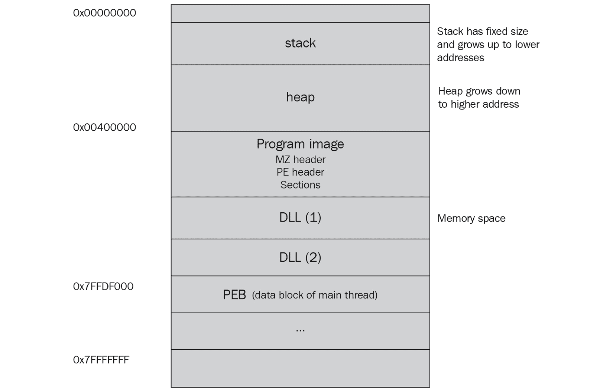

图 3.12 – 32 位进程内存布局示例

我们将在下一节中比较虚拟内存和物理内存的各个方面。

### 虚拟内存到物理内存的映射

虚拟内存就像是为每个进程提供的一个容器。每个进程都有自己的虚拟内存空间来存储其镜像、相关库以及所有为栈、堆等分配的辅助内存区域。这个虚拟内存与相应的物理内存有映射关系。并非所有虚拟内存地址都会映射到物理内存，每个被映射的地址都有一个权限（*READ|WRITE*、*READ|EXECUTE*，或者可能是 *READ|WRITE|EXECUTE*），如以下图所示：

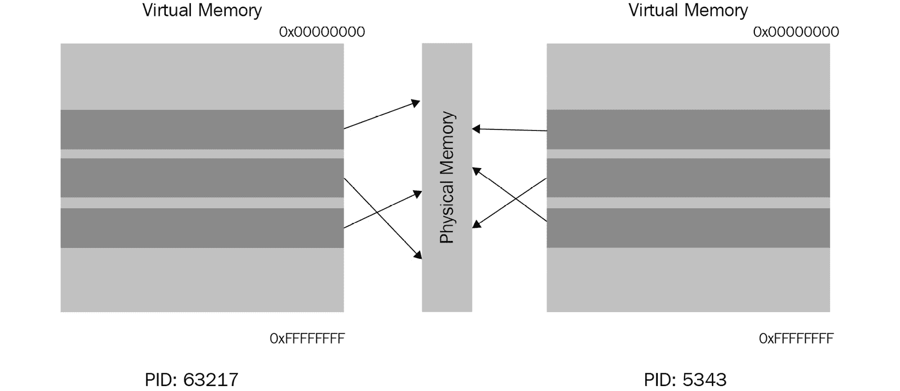

图 3.13 – 物理内存与虚拟内存之间的映射

虚拟内存允许在不同进程之间创建一个安全层，并允许操作系统管理不同的进程，暂停一个进程并将资源分配给另一个进程。

### 线程

线程不仅仅是表示进程内部执行路径的实体（每个进程可以有一个或多个线程同时运行）。它还是内核中的一个结构，保存着该执行路径的整个状态，包括寄存器、栈信息和最后的错误。

Windows 中的每个线程都有一个小的时间片在执行，然后被暂停以恢复另一个线程（因为处理器核心的数量远小于整个系统中运行的线程数）。当 Windows 在一个线程与另一个线程之间切换时，它会对整个执行状态（寄存器、栈、指令指针等）进行快照，并将其保存到线程结构中，以便从暂停的地方恢复执行。

在一个进程中运行的所有线程共享该进程的相同资源，包括虚拟内存、打开的文件、打开的套接字、DLL、互斥锁等，并在访问这些资源时相互同步。

每个线程都有一个栈、指令指针、用于错误处理的代码函数（SEH，详见*第六章*，*绕过反向工程技术*）、线程 ID 和一个名为 TEB 的线程信息结构，如下图所示：

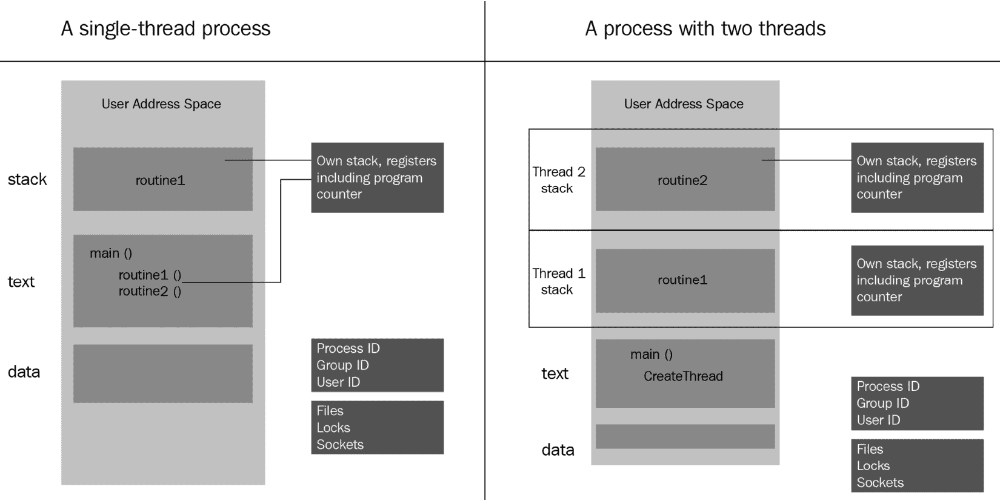

图 3.14 – 示例进程，包含一个线程和多个线程

接下来，我们将讨论理解线程和进程所需的关键数据结构。让我们开始吧。

### 重要的数据结构——TIB、TEB 和 PEB

与进程和线程相关的最后一项内容是 TIB、TEB 和 PEB 数据结构。这些结构存储在进程内存中，其主要功能是包含有关进程和每个线程的所有信息，并使代码能够轻松访问这些信息，以便轻松获取进程文件名、已加载的 DLL 和其他相关信息。

它们可以通过一个特殊的段寄存器访问，分别是 FS（32 位）或 GS（64 位），就像这样：

```
mov eax, DWORD PTR FS:[XX]
```

这些数据结构具有以下功能：

+   **线程信息块（TIB）**：该结构包含有关线程的信息，包括用于错误处理的函数列表等。

+   **线程环境块（TEB）**：该结构以 TIB 开始，后跟其他与线程相关的字段。在许多情况下，TIB 和 TEB 这两个术语可以互换使用。

+   **进程环境块（PEB）**：该结构包含有关进程的各种信息，例如其名称、ID（PID）和模块列表（包括所有已加载到内存中的 PE 文件——主要是程序本身和 DLL 文件）。

在接下来的章节中，以及本书的整个过程中，我们将介绍这些结构中存储的不同信息，这些信息用于帮助恶意代码实现其目标——例如，检测调试器。

## 逐步创建进程

现在我们已经了解了基本术语，可以深入探讨 PE 加载和进程创建的过程。我们将按顺序调查它，如下所示的步骤所示：

1.  `calc.exe`，另一个名为`explorer.exe`的进程（即 Windows 资源管理器的进程）调用一个 API，`CreateProcessA`，该 API 向操作系统发出请求，以创建此进程并开始执行。

1.  `EPROCESS`，为该进程设置唯一的 ID（`ProcessID`），并将`explorer.exe`文件的进程 ID 设置为新创建的`calc.exe`进程的父 PID。

1.  `EPROCESS`结构。接着，它创建 PEB 结构，包含所有必要的信息，并加载 Windows 应用程序始终需要的两个主要 DLL：`ntdll.dll`和`kernel32.dll`（有些应用程序运行在其他 Windows 子系统上，例如 POSIX，并不使用`kernel32.dll`）。

1.  **加载 PE 文件**：然后，Windows 开始加载 PE 文件（我们将在下一节解释），它加载所有必需的第三方库（DLL），包括这些库所需要的所有 DLL，并确保从这些库中找到所需的 API，并将其地址保存到已加载 PE 文件的导入表中，以便代码能够轻松访问并调用它们。

1.  **启动执行**：最后但同样重要的是，Windows 在进程中创建第一个线程，执行一些初始化工作，并调用 PE 文件的入口点以启动程序执行。之前提到的 TLS 回调（如果有的话）将在入口点之前执行。

现在，让我们更深入地探讨这一过程中的 PE 加载部分。

## PE 文件加载步骤

Windows PE 加载器在将可执行的 PE 文件加载到内存中（包括动态链接库）时遵循以下步骤：

1.  `ImageBase`：将 PE 文件加载到其虚拟内存中的此地址（如果可能的话）。

1.  `NumberOfSections`：用于加载各个节。

1.  `SizeOfImage`：因为这是整个 PE 文件在内存中加载后的最终大小，所以这个值将用于最初的空间分配。

1.  `NumberOfSections` 字段解析 PE 文件中的所有节，确保获取所有必要的信息，包括它们在内存中的地址和大小（分别是 `VirtualAddress` 和 `VirtualSize`），以及硬盘上节的偏移和大小，用于读取数据。

1.  `SectionAlignment`，加载器复制所有头部信息，然后根据 `VirtualAddress` 和 `VirtualSize` 值（如果 `VirtualAddress` 或 `VirtualSize` 与 `SectionAlignment` 不对齐，加载器会先进行对齐，然后使用这些值）将每个节移动到新位置，如下图所示：

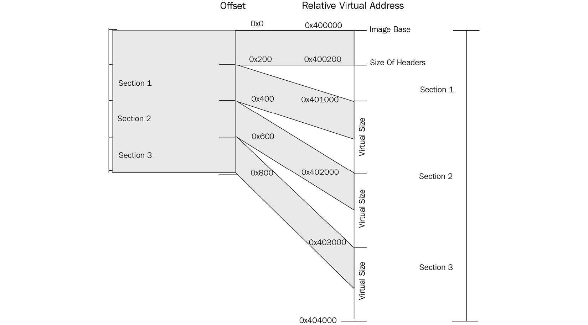

图 3.15 – 将节从磁盘映射到内存

1.  **处理第三方库**：在这一步骤中，加载器加载所有需要的 DLL 文件，反复递归地执行这个过程，直到所有 DLL 文件都被加载完成。之后，它获取所有导入的 API 的地址，并将它们保存到已加载 PE 文件的导入表中。

1.  `ImageBase`，加载器使用程序/库的新地址（新的 `ImageBase`）修复代码中的所有绝对地址。

1.  **启动执行**：最后，就像进程创建一样，Windows 创建第一个线程，从程序的入口点开始执行程序。一些反调试技术可能会强制它从其他地方开始，我们将在 *第六章* *绕过反调试技术* 中讨论这一点。

我们还需要了解的一点是 WOW64。

## WOW64 进程

在这一点上，你应该了解如何将 32 位进程加载到 x86 环境中，以及如何将 64 位进程加载到 x64 环境中。那么，在 64 位操作系统中如何运行 32 位程序呢？

对于这种特殊情况，Windows 创建了所谓的 WOW64 子系统。它主要通过以下 DLL 文件实现：

+   `wow64.dll`

+   `wow64cpu.dll`

+   `wow64win.dll`

这些 DLL 创建了一个模拟的 32 位进程环境，其中包括它可能需要的 32 位版本的库。

这些 DLL 文件并不是直接连接到 Windows 内核，而是调用一个 API，`X86SwitchTo64BitMode`，该 API 会切换到 x64 模式并调用 64 位的 `ntdll.dll`，然后直接与内核通信，如下图所示：

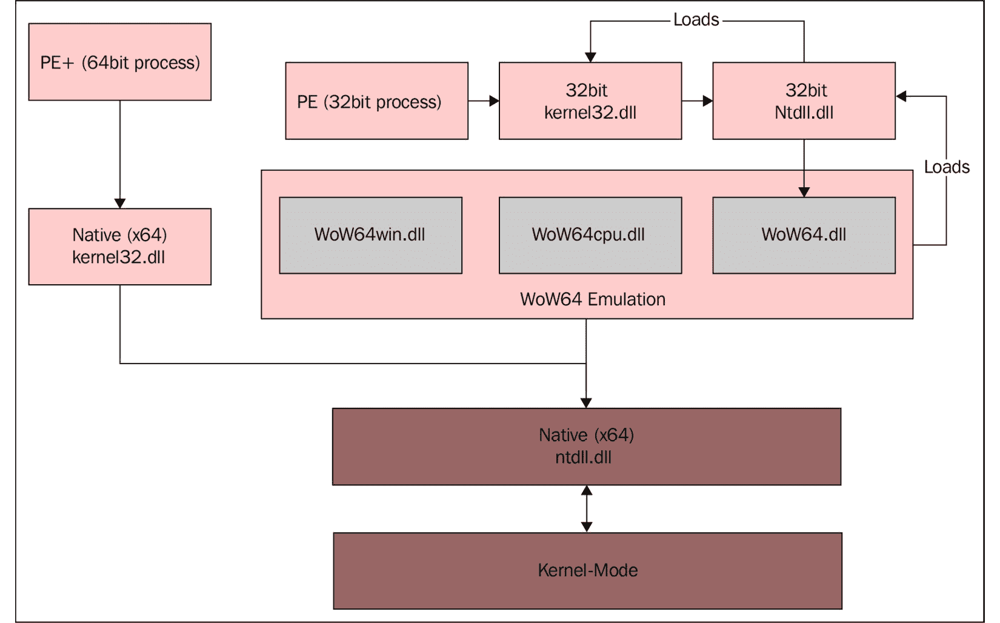

图 3.16 – WOW64 架构

此外，对于基于 WOW64 的进程（在 x64 环境中运行的 x86 进程），引入了新的 API，例如 IsWow64Process，恶意软件通常使用该 API 来判断它是以 32 位进程在 x64 环境中运行，还是在 x86 环境中运行。

# 使用 OllyDbg 和 x64dbg 进行动态分析的基础

现在我们已经解释了进程、线程以及 PE 文件的执行过程，接下来是时候开始调试一个正在运行的进程，并通过追踪运行时的代码来理解它的功能。

## 调试工具

我们可以使用多种调试工具。在这里，我们将介绍三种在界面和功能上非常相似的工具：

+   **OllyDbg**：这可能是 Windows 平台上最著名的调试器。以下截图展示了它的用户界面，已经成为大多数 Windows 调试器的标准：

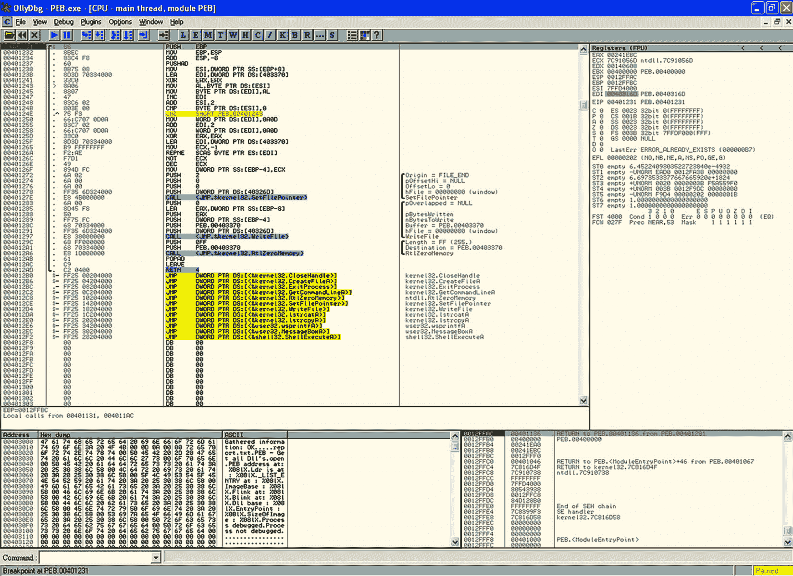

图 3.17 – OllyDbg 用户界面

+   **Immunity Debugger**：这是一个可脚本化的 OllyDbg 克隆，专注于利用和漏洞挖掘：

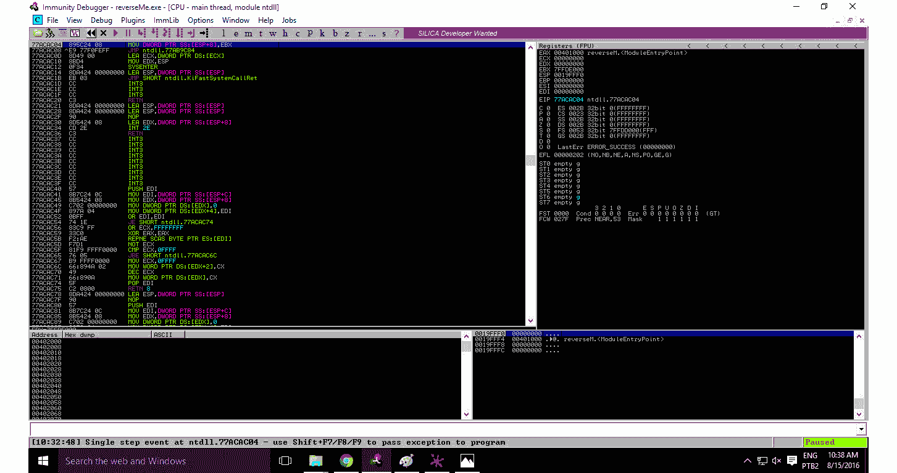

图 3.18 – Immunity Debugger 用户界面

+   **X64dbg**：这是一个支持 x86 和 x64 可执行文件的调试器，界面与 OllyDbg 非常相似。它也是一个开源调试器：

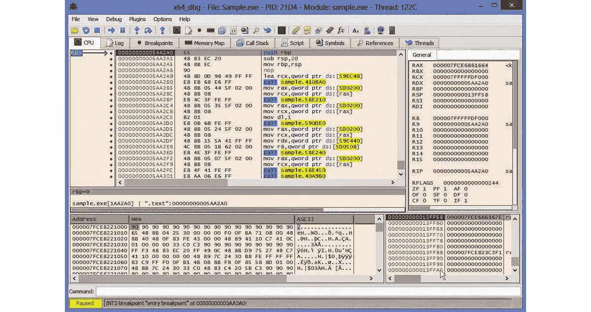

图 3.19 – x64dbg 用户界面

我们将详细介绍 OllyDbg 1.10（OllyDbg 最常用的版本）。相同的概念和快捷键可以应用于这里提到的其他调试器。

## 如何使用 OllyDbg 分析样本

OllyDbg 用户界面非常简洁，易于学习。在这一部分，我们将介绍帮助你进行分析的步骤和不同的窗口：

1.  **选择一个样本进行调试**：你可以直接通过 **文件** | **打开** 来打开样本文件，选择一个 PE 文件进行打开（它也可以是一个 DLL 文件，但请确保它是 32 位样本）。另外，你还可以将其附加到一个正在运行的进程，如下所示：


图 3.20 – OllyDbg 附加对话框

1.  **CPU 窗口**：这是你的主窗口。在调试过程中，你大部分时间都会待在这个窗口。此窗口包含左上角的汇编代码，并提供通过双击地址设置断点或修改程序汇编代码的选项。

在右上角，你也可以看到寄存器。只要执行被暂停，就可以随时修改它们。在底部，你可以看到堆栈和十六进制格式的数据，这些也可以修改。

你可以在以下两种视图中轻松修改内存中的任何数据：

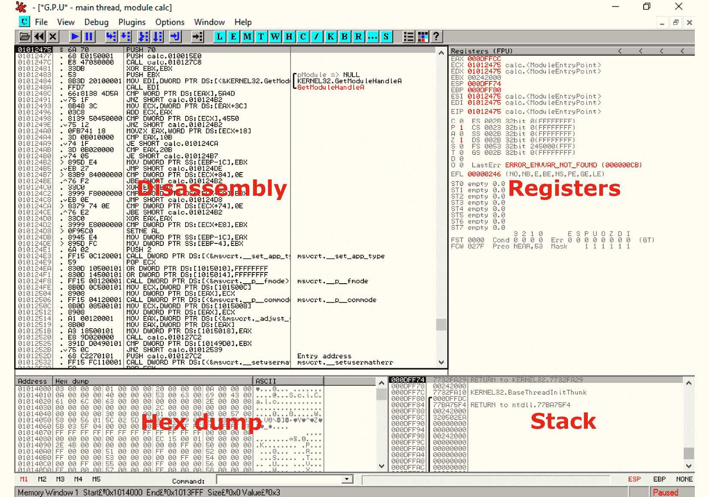

图 3.21 – OllyDbg 默认窗口布局解释

1.  **可执行模块窗口**：OllyDbg 中有多个窗口可以帮助你进行分析，例如**可执行模块**窗口（你可以通过进入**视图** | **可执行模块**来访问它），如下图所示：


图 3.22 – OllyDbg 可执行模块对话框

这个窗口将帮助你看到该进程虚拟内存中加载的所有 PE 文件，包括恶意样本和与之一起加载的所有库或 DLL。

1.  **内存映射窗口**：在这里，你可以看到进程虚拟内存中的所有分配的内存。分配的内存是代表物理（RAM）内存或者**页面文件**的内存，用于在内存不足时存储 RAM 中的内容。你可以看到它们代表的内容及其内存保护状态（读取、写入和/或执行），如下图所示：

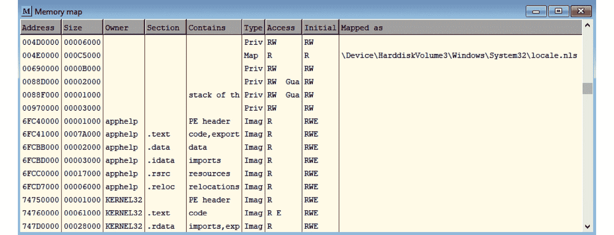

图 3.23 – OllyDbg 内存映射对话框

1.  **调试示例**：在**调试**菜单中，你有多种选项来运行程序的汇编代码，例如通过**运行**完全执行示例，直到遇到断点，或者直接使用*F9*。

另一个选项是直接单步跳过。**单步跳过**执行一行代码。然而，如果这行代码是对另一个函数的调用，它会完全执行该函数，并在函数返回后停止。这使得它与**单步进入**不同，后者会进入函数内部并在函数开始时停止，如下图所示：


图 3.24 – OllyDbg 调试菜单

它包括设置硬件断点并查看它们的选项，我们将在本章后面介绍。

1.  **更多功能**：OllyDbg 允许你修改程序的代码；更改其寄存器、状态和内存；转储内存中的任何部分；并将 PE 文件内存中的更改保存回硬盘，以便后续的静态分析（如果需要）。

现在，让我们来讨论一下断点。

## 断点类型

为了能够动态分析样本并理解其行为，你需要能够控制它的执行流程。你需要能够在满足条件时停止执行，检查其内存，并修改其寄存器的值和指令。有几种类型的断点可以实现这一点。

### 单步进入/单步跳过断点

这个断点非常简单，允许处理器仅执行程序的一条指令，然后返回调试器。

这个断点修改了寄存器中的一个标志，叫做**EFlags**。虽然不常见，但恶意软件可能会通过检测这个断点来识别调试器的存在，我们将在第*6 章*《绕过反向工程技巧》中讨论这一点。

### 软件（INT3）断点

这是最常见的断点，你可以通过双击 OllyDbg 中 CPU 窗口中的汇编行的十六进制表示或按下*F2*轻松设置这个断点。之后，你会看到该指令的地址上出现红色高亮，如下图所示：


图 3.25 – OllyDbg 中的反汇编

好吧，这就是你通过调试器的界面看到的内容，但你看不到的是该指令的第一个字节（在此例中是 0xB8）已被修改为 0xCC（INT3 指令），这会在处理器到达时停止执行并将控制权返回给调试器。这个 0xCC 字节在调试器界面中是不可见的，因为它始终显示原始字节和它们所代表的指令，但如果我们决定将此内存转储到磁盘并使用十六进制编辑器查看它，则可以看到。

一旦调试器获取了这个 INT3 断点的控制权，它会将 0xCC 替换为 0xB8，以正常执行此指令。

这个断点的主要问题是它会修改内存。如果恶意软件尝试读取或修改此指令的字节，它会将第一个字节读取为 0xCC，而不是 0xB8，这可能会破坏一些代码或检测到调试器的存在（我们将在*第六章*中讨论，*绕过反向工程技术*）。此外，它可能会影响内存转储，因为这样生成的转储会因为这些修改而损坏。解决这个问题的方法是在转储内存之前移除所有软件断点。

### 内存断点

内存断点用于不是为了停止特定指令的执行，而是在任何指令尝试读取或修改特定内存区域时停止。许多调试器设置内存断点的方式是通过向页面的原始保护添加*PAGE_GUARD*（0x100）保护标志，并在断点被触发后移除*PAGE_GUARD*。

这些可以通过右键点击**断点** | **内存，读取时**或**内存，写入时**来访问，如下图所示：


图 3.26 – OllyDbg 断点菜单

另一个需要注意的重要事项是，内存断点的精度较低，因为只能更改内存页面的保护标志，而不能更改单个字节的保护标志。

### 硬件断点

硬件断点基于六个特殊用途寄存器：**DR0-DR3**、**DR6**和**DR7**。

这些寄存器允许你设置最多四个断点，每个断点都有特定的地址，可以从给定地址开始读取、写入或执行 1、2 或 4 个字节。它们非常有用，因为它们不会像 INT3 断点那样修改指令字节，而且通常更难被检测到。然而，它们仍然可能会被恶意软件检测并移除，我们将在*第六章*中讨论，*绕过反向工程技术*。

你可以通过进入**Debug**菜单并选择**Hardware breakpoints**来查看它们，如下图所示：

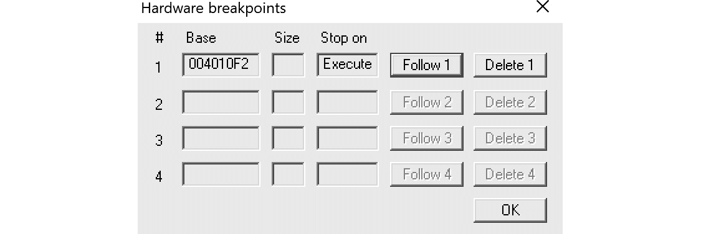

图 3.27 – OllyDbg 硬件断点对话框

如你所见，每种类型的断点都有其特定的用途，并且有各自的优缺点，因此了解它们并根据任务需求使用它们非常重要。

## 修改程序的执行

为了绕过反调试技巧，强制恶意软件与 C&C 通信，甚至测试恶意软件执行的不同分支，你需要能够改变恶意软件的执行流程。让我们来看一下可以用来改变执行流程和任何线程行为的不同技巧。

### 修改程序的汇编指令

你可以通过更改汇编指令来修改代码执行路径。例如，你可以将条件跳转指令更改为相反条件，如下图所示，强制执行本不该执行的特定分支：


图 3.28 – 在 OllyDbg 中使用汇编

除了代码之外，还可以更改寄存器的内容。

### 更改 EFlags

与其修改条件跳转指令的代码，你也可以通过更改 EFlags 寄存器来修改其比较结果。

在右上角的寄存器之后，你可以看到多个可以更改的标志。每个标志表示任何比较的特定结果（其他指令也会改变这些标志）。例如，ZF 表示两个值是否相等，或某个寄存器是否变为零。通过更改 ZF 标志，你可以强制条件跳转（如`jnz`和`jz`）跳到相反的分支，从而强制改变执行路径。

### 修改指令指针值

你可以通过简单地修改指令指针 (**EIP**/**RIP**) 来强制执行特定的分支或指令。你可以通过右键点击感兴趣的指令并选择**New origin here**来做到这一点。

### 更改程序数据

就像你可以更改指令代码一样，你也可以更改数据值。在左下角的视图（十六进制视图）中，你可以通过右键点击**Binary** | **Edit**来更改数据的字节。你还可以复制/粘贴十六进制值，如下图所示：


图 3.29 – 在 OllyDbg 中的数据编辑

现在，让我们来讨论如何有效地搜索重要的信息片段，以便于分析。

## 列出字符串、API 和交叉引用

在进行逆向工程时，字符串和 API 是非常重要的信息来源，因此了解如何高效地浏览它们非常重要。

要在 OllyDbg 中获取字符串列表，右键点击 CPU 窗口的反汇编部分的任意位置，选择 **搜索** | **所有引用的文本字符串**。弹出的对话框将显示所有候选的 C 风格字符串，包括 ANSI 和 Unicode（UTF16-LE），以及使用这些字符串的指令。

要获取 API 列表，执行相同的操作，但这次选择 **搜索** | **所有模块间调用**。

交叉引用是标记，显示研究人员该代码或数据的访问位置。这是一个极其重要的信息，它能有效地帮助我们连接各个点。要找到特定指令的引用，右键点击它并选择 **查找引用到** | **选定命令** 选项。对于十六进制转储窗口中的数据，只需选择 **查找引用**。

## 设置标签和注释

在分析任何类型的样本时，保持标注准确非常重要，这样你就能始终清晰地了解已经审查过的代码或数据的含义。为函数和引用赋予恰当的名称是确保你在一段时间后不会再次分析相同代码的好方法。

要给函数或某些数据命名，右键点击其首个指令并选择 **标签** 选项（或者直接按 *:* 热键）。现在，所有引用它们的地方将使用这个标签，而不是地址，如下截图所示：


图 3.30 – 在 OllyDbg 中使用标签和注释

要跟踪地址，在选中指令后按 *Enter* 键。要返回，按 *-* 热键。要添加注释，使用 *;* 热键。

现在，让我们来谈谈 x64dbg。

## OllyDbg 和 x64dbg 之间的差异

如我们之前提到的，这些调试器有许多相似之处。它们使用相同的布局，界面选项和热键几乎相同——甚至默认的颜色方案也相似。然而，它们之间也有一些差异，其中有些值得一提：

+   与 OllyDbg 不同，x64dbg 支持 32 位和 64 位的可执行文件。

+   默认情况下，x64dbg 会在系统断点处停止（这是一个初始化待调试应用程序的系统功能），而 OllyDbg 会在入口点处停止。

+   x64dbg 支持对话窗口的标签页，这在许多情况下非常方便，例如，当必须同时使用多个 **十六进制转储** 窗口时。

+   x64dbg 显示更多的寄存器，包括 DR0-3、DR6 和 DR7 调试寄存器。

+   OllyDbg 可能在 **内存映射** 窗口中显示不正确的保护标志；而 x64dbg 通常更为准确。

+   x64dbg 将所有类型的断点显示在同一个 **断点** 窗口中，而 OllyDbg 将其分为 **视图** | **断点** 和 **调试** | **硬件断点**。

+   x64dbg 没有调用 DLL 导出函数的菜单选项；必须手动执行此操作。

这里和那里还有其他一些小差异，因此可以随意尝试这两款工具，并选择最适合你的那个。

现在，让我们谈谈如何调试服务。

# 调试恶意服务

虽然加载单个可执行文件和 DLL 进行调试通常是一个相当直接的任务，但当我们讨论调试 Windows 服务时，事情变得有些复杂。

## 什么是服务？

服务是通常应在后台执行某些逻辑的任务，类似于 Linux 上的守护进程。因此，恶意软件作者常常利用它们来实现可靠的持久性，这一点并不令人意外。

服务由 `%SystemRoot%\System32\services.exe` 控制。所有服务都有相应的 `HKLM\SYSTEM\CurrentControlSet\services\<service_name>` 注册表项。它包含描述服务的多个值，其中包括：

+   `ImagePath`：指向相应可执行文件的文件路径，可包含可选参数。

+   `Type`：`REG_DWORD` 值指定服务的类型。让我们看一些此类支持的值的示例：

    +   `0x00000001` (内核)：在这种情况下，逻辑是在驱动程序中实现的（驱动程序的详细内容将在*第七章*《理解内核模式根套件》一章中介绍，该章节专门讨论内核模式威胁）。

    +   `0x00000010` (独立)：服务在其自己的进程中运行。

    +   `0x00000020` (共享)：服务在共享进程中运行。

+   `Start`：这是另一个 `REG_DWORD` 值，用于描述服务应如何启动。以下选项是常用的：

    +   `0x00000000` (启动) 和 `0x00000001` (系统)：这些值用于驱动程序。在这种情况下，它们将分别由启动加载程序或内核初始化过程中加载。

    +   `0x00000002` (自动)：每次机器重启时，服务会自动启动。这是恶意软件的明显选择。

    +   `0x00000003` (按需)：这指定应手动启动的服务。此选项在调试时特别有用。

+   `0x00000004` (禁用)：服务不会启动。

让我们看看服务可以设计的几种方式：

+   `ImagePath` 将包含其完整的文件路径。

+   `rundll32.exe`）。完整的命令行存储在 `ImagePath` 键中，和之前的情况一样。

+   `svchost.exe` 进程。为了加载，恶意软件通常会在 `HKLM\SOFTWARE\Microsoft\Windows NT\CurrentVersion\Svchost` 注册表项中创建一个新的组，并使用 `-k` 参数将此值传递给 `svchost.exe`。DLL 的路径将不会像之前那样在服务注册表项的 `ImagePath` 值中指定（在这里，它将包含 `svchost.exe` 路径以及服务组参数），而是会在 `HKLM\SYSTEM\CurrentControlSet\services\<service_name>\Parameters` 注册表项的 `ServiceDll` 值中指定。服务 DLL 应包含 `ServiceMain` 导出函数（如果使用了自定义名称，则应在 `ServiceMain` 注册表值中指定）。如果存在 `SvchostPushServiceGlobals` 导出，它将在 `ServiceMain` 之前执行。

一个带有专用可执行文件（或带有自有加载器的 DLL）的用户模式服务，可以使用标准的 `sc` 命令行工具注册，如下所示：

```
sc create <service_name> type= own binpath= <path_to_executable>
```

对于基于 svchost DLL 的服务，过程稍微复杂一些：

```
reg add "HKLM\SOFTWARE\Microsoft\Windows NT\CurrentVersion\Svchost" /v "<service_group>" /t REG_MULTI_SZ /d "<service_name>\0" /f
reg add "HKLM\SYSTEM\CurrentControlSet\Services\<service_name>\Parameters"
/v ServiceDll /t REG_EXPAND_SZ /d <path_to_dll> /f sc create <service_name> type= share binpath="C:\Windows\System32\svchost.exe -k <service_group>"
```

使用这种方法，可以在需要时按需启动已创建的服务，例如，使用以下命令：

```
sc start <service_name>
```

或者，可以使用以下命令：

```
net start <service_name_or_display_name>
```

现在，我们来谈谈如何附加到服务。

## 附加到服务

一旦服务启动后，有多种方法可以立即附加到服务：

+   `HKLM\SOFTWARE\Microsoft\Windows NT\CurrentVersion\Image File Execution Options\<filename>`，其中包含相应的 `Debugger` 字符串数据值，该值包含调试器的完整路径，一旦指定的 `<filename>` 程序启动，就会附加到该服务。这里的问题是，如果服务不是交互式的，附加的调试器窗口可能不会出现。可以通过以下几种方式来解决：

    +   打开 `services.msc`，打开 `HKLM\SYSTEM\CurrentControlSet\services\<service_name>` 注册表键，并用与当前值进行按位或运算的结果替换其数据，运算结果为 `0x00000100` DWORD（`SERVICE_INTERACTIVE_PROCESS` 标志）。例如，`0x00000010` 将变为 `0x00000110`。

    +   此外，当使用 `sc` 工具并带有 `type= interact type= own` 或 `type= interact type= share` 参数时，它可以交互式创建。另一种选择是使用远程调试。

+   **使用 GFlags**：**全局标志编辑器**（**GFlags**）工具是 **Windows 调试工具**（与 **WinDbg** 相同）的一部分，提供了多个选项用于调整候选应用程序的调试过程。要附加调试器，它会修改之前提到的注册表键，因此在这种情况下，可以几乎交替使用这两种方法。通过其 UI 来操作时，必须将目标程序的文件名（不是完整路径）设置为 **Image File** 标签和 **Image** 字段，然后使用 *Tab* 键刷新窗口，并在 **Debugger** 字段上勾选，指定首选调试器的完整路径。与前面的情况一样，必须确保服务是交互式的。

+   使用调试器支持子进程创建时的断点，启用它（例如，在 WinDbg 中使用 `.childdbg 1` 命令），然后启动感兴趣的服务。

+   在分析样本的入口点上，` \xEB\xFE ` 字节表示 `JMP` 指令，将执行重定向到自身的开始位置，从而形成一个无限循环。然后，可以找到相应的进程（它会消耗大量的 CPU 资源），用调试器附加到该进程，恢复原始字节，并继续正常执行，同时确保恢复的指令能够成功执行。

一旦调试器附加，可以在样本的入口点设置断点，以便在那里停止执行。

调试服务时常见的问题是超时。默认情况下，如果服务没有成功执行并发送信号，它将在大约 30 秒后被终止，这可能会使调试过程变得复杂。例如，WinDbg 在尝试执行任何命令时，可能会意外地显示 *No runnable debuggees* 错误。要延长此时间间隔，必须在 `HKLM\SYSTEM\CurrentControlSet\Control` 注册表键中创建或更新 DWORD 类型的 `ServicesPipeTimeout` 值，并设置新的超时时间（以毫秒为单位），然后重新启动计算机。

服务 DLL 的导出项，如 `ServiceMain`，可以使用之前提到的任何方法进行调试。在这种情况下，可以在创建对应的 `svchost.exe` 进程后立即附加到该进程，并启用在 DLL 加载时中断（例如，使用 WinDbg 中的 `sxe ld[:<dll_name>]` 命令），或者通过无限循环指令修补 DLL 的入口点或任何其他感兴趣的导出项，并在 `svchost.exe` 启动后随时附加。

最后，让我们解释一下什么是行为分析以及它如何帮助我们理解恶意软件的功能。

# 行为分析要点

首先，值得提到的是，有些资源将动态分析和行为分析这两个术语互换使用。动态分析是指在调试器中执行指令的过程，而行为分析则涉及一种黑箱方法，即在各种监控工具下执行恶意软件，记录它所引入的变化。这种方法可以帮助研究人员快速了解恶意软件的功能。然而，它也有多个局限性，具体如下：

+   恶意软件可能只执行其部分功能

+   如果恶意软件发现正在被分析，它的行为可能会有所不同。

在大多数情况下，行为分析工具可以通过以下各种特征轻松被检测到：文件、进程或目录名称、注册表键值、互斥体、窗口名称等。

现在，让我们看看最常用的工具，并按类型将它们分组。

## 文件操作

这里的目标是监控恶意软件在文件系统级别引入的所有变化：

+   **Process Monitor (Filemon)**：Sysinternals 套件的一部分，Process Monitor 将多个之前独立的工具结合在一起。其中一个，前身为 Filemon，允许你记录所有进程执行的文件系统操作：

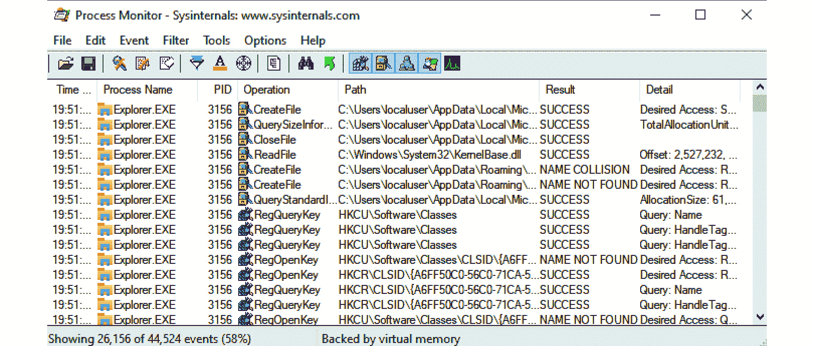

图 3.31 – 由进程监视器记录的各种操作

+   **Sandboxie**：此工具的主要目的是不仅记录文件操作，还为研究人员提供访问已创建/修改文件的权限。如果恶意软件丢弃或下载其他模块并随后删除它们，这将非常有用。

除了文件操作，监控注册表操作是另一种经过时间验证的技术，它能够帮助我们了解恶意软件的目的。

## 注册表操作

在这种情况下，我们关注的是记录对 Windows 注册表所做的所有更改，Windows 注册表是一个层级数据库，存储了操作系统和已安装应用程序的各种设置：

+   **进程监视器（Regmon）**：该部分进程监视器允许研究人员记录所有在注册表中执行的操作类型。

+   **Regshot**：这个工具的概念非常简单——研究人员可以在恶意软件执行前后创建注册表快照，并比较它们，以查看引入的任何差异：

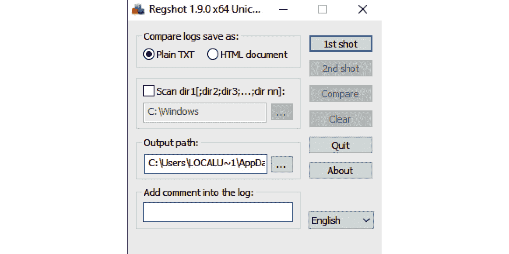

图 3.32 – Regshot 用户界面

+   **Autoruns**：这是 Sysinternals 套件中的另一个极好工具，对于找出恶意软件引入的持久性机制非常有价值。它展示了研究人员系统启动后将加载或执行的所有模块。

现在，让我们来讨论进程操作。

## 进程操作

除了监控注册表和文件系统的变化外，任何创建或终止的进程都是从恶意软件分析角度来看重要的证据。以下工具可以帮助我们追踪这些操作：

+   **进程监视器（Procmon）**：在这里，研究人员可以监控所有与进程相关的操作——主要是它们的创建和终止。

+   **进程资源管理器**：该工具也作为 Sysinternals 套件的一部分进行分发。简而言之，这是任务管理器的高级版本，显示进程层级（父子关系）以及更多信息。

了解恶意软件目的的另一种方法是追踪其使用的 API。

## WinAPIs

在这里，研究人员可以选择特定的 Windows API 进行监控，通过功能分组选择任何 API，而不专注于某一特定类型的活动。为了实现这一点，可以使用以下工具：

+   **API Monitor**：这是一个非常棒的工具，允许研究人员选择单个 API 或其组，并查看恶意软件调用了哪些 API，以及调用的顺序。以下是它的用户界面：

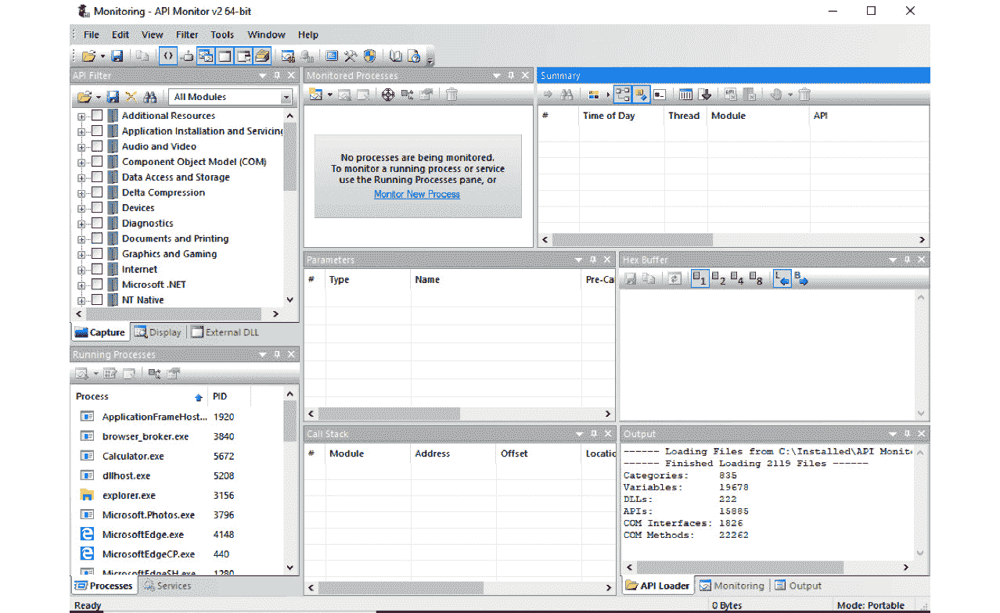

图 3.33 – API Monitor 按类别分组 WinAPIs

最后，让我们来谈谈网络操作。

## 网络活动

以下是一些最受欢迎的工具，它们可以帮助我们深入了解恶意软件的网络相关功能：

+   **Tcpview**：这是一个相当基础的工具，能够显示研究人员所有打开的端口以及已建立的连接和它们相关的进程。

+   **Wireshark**：网络流量分析的王者，这个工具提供了对所有发送和接收的数据包的宝贵洞察，并允许根据 OSI 模型对其进行解剖，并将它们分组为流。其丰富的过滤语法使其成为分析恶意网络活动时不可或缺的工具。以下截图展示了它的界面：

a


图 3.34 – Wireshark 解剖网络数据包

与手动使用单独的工具监控各个操作不同，还可以使用沙箱进行监控。

## 沙箱

沙箱是记录恶意软件执行后所有操作的机器（通常是虚拟机），为研究人员提供了对其功能的快速而详细的洞察。它们可能支持多种平台、操作系统和文件类型。其他沙箱还可能记录生成的流量并收集内存转储。

像任何行为分析工具一样，它们也存在多种局限性，具体如下：

+   沙箱对恶意软件预期的环境了解有限，无法自动模拟，例如，所需的命令行参数。

+   它们很容易被检测到。在这种情况下，恶意软件可能会立即终止或显示一些虚假的活动。

+   它们的可见性有限，因为通常只显示恶意软件功能的一部分。

使用沙箱有两种选择：

+   **在线沙箱服务**

在这个市场上有几个大公司，其中一些仅限商业使用，或提供订阅选项的公共服务。以下是一些最著名的免费公共沙箱服务：

+   [`any.run`](https://any.run)

+   [`www.hybrid-analysis.com`](https://www.hybrid-analysis.com)

+   [`virustotal.com`](https://virustotal.com)（**行为**选项卡）

重要提示

在撰写本文时，VirusTotal 支持多种不同的沙箱，建议尝试几种不同的沙箱，找到合适的报告。

+   **自管理沙箱**

在这里，研究人员需要自行托管、设置和管理软件，伴随而来的是相应的优缺点。以下是一些最著名的选项：

+   **Cuckoo**（免费）：可能是最著名的沙箱软件，拥有多个分支版本，如**CAPE**。

+   **DRAKVUF 沙箱**（免费）：基于 DRAKVUF 虚拟化技术的较新沙箱市场参与者。

+   **VMRay**（商业版）：与前两个不同，这款是仅限商业使用的，但提供了卓越的结果。

根据使用案例和可用资源，每种选择都有其优缺点，应该根据实际情况使用。

本章到此结束。现在，让我们快速回顾一下我们所学的内容以及在*第四章*中将要讨论的内容——*解包、解密与去混淆*。

# 总结

在本章中，我们讨论了 Windows 可执行文件的 PE 结构。我们逐字段地讲解了 PE 头部，并研究了它在静态分析中的重要性，最后给出了 PE 头部能够帮助我们回答的与事件处理和威胁情报相关的主要问题。

我们还讨论了 DLL 和 PE 文件如何通过所谓的 API 在同一虚拟内存中相互通信并共享代码和函数。我们还讲解了导入表和导出表是如何工作的。

接着，我们从基础开始讲解动态分析，例如什么是进程，什么是线程。我们提供了详细的步骤指导，讲解了 Windows 如何创建一个进程并加载 PE 文件，从在 Windows 资源管理器中双击应用程序到程序在你面前运行的全过程。

最后，我们讨论了如何使用 OllyDbg 进行恶意软件的动态分析，通过这款工具最重要的功能来监控、调试甚至修改程序的执行过程。我们讲解了不同类型的断点，如何设置断点，它们如何在内部工作，从而帮助你理解恶意软件如何检测它们以及如何绕过其反逆向工程技术。最后，我们讲解了 Windows 服务及其调试方法。

在这一点上，你应该已经掌握了进行基本恶意软件分析的基础，包括静态分析和动态分析。你也应该了解在每个步骤中需要回答的问题以及你需要遵循的流程，以便全面理解这个恶意软件的功能。

在*第四章*《解包、解密与去混淆》中，我们将把讨论拓展到恶意软件的解包、解密和去混淆。我们将探索恶意软件作者为绕过检测和欺骗经验不足的逆向工程师而采用的不同技巧。我们还将学习如何绕过这些技巧并应对它们。
