# 逆向不同类型的文件

到目前为止，我们一直在处理二进制可执行文件。在本章中，我们还将查看代码执行的其他方式。访问网站（HTML）和接收包含文档的电子邮件是恶意软件轻松进入目标系统的一些途径。

在本章中，我们将学习以下主题：

+   在 HTML 中调试脚本

+   理解 Office 文档中的宏

+   执行 PDF 分析

+   SWF 分析

# HTML 脚本分析

几乎我们访问的每个网站都包含脚本。最常见的是包含 JavaScript 代码，这些代码通常会在点击网站上的“OK”按钮时触发，或者是在鼠标指针周围游动的那些艺术泡泡和星星。JavaScript 是站点开发者可以使用的最强大工具之一。它可以控制互联网浏览器所包含的元素。

除了 JavaScript，Visual Basic 脚本（VBScripts）也可以嵌入到 HTML 网站中。然而，VBScript 在最近的网络浏览器中已被默认禁用。这是因为 VBScript 在过去曾暴露出许多安全漏洞。此外，JavaScript 是许多互联网浏览器默认使用的语言。

网站的工作有两个方面，即服务器端和客户端。当访问一个网站时，我们看到的是客户端页面。所有后台脚本都在服务器端运行。例如，当访问一个网站时，服务器端程序发送 HTML 内容，包括文本、脚本、图像、Java 小应用程序和 Flash 文件。只有浏览器元素，如 HTML、JavaScript、Java 小应用程序和 SWF Flash，能够被互联网浏览器支持，才是服务器端程序创建并发送的对象。从本质上讲，我们可以分析的就是这些浏览器元素。

幸运的是，脚本是可读的文本文件。我们可以对 HTML 脚本进行静态分析。但像其他代码一样，逆向工程需要我们了解所使用的脚本语言。归根结底，我们需要学习 JavaScript 编程语言的基础。

让我们尝试逆向一个简单的 HTML 文件。你可以通过以下链接下载此 HTML 文件：[`github.com/PacktPublishing/Mastering-Reverse-Engineering/blob/master/ch13/demo_01.html`](https://github.com/PacktPublishing/Mastering-Reverse-Engineering/blob/master/ch13/demo_01.html)。

只有在你有时间的时候才做这个。当逆向 HTML 文件时，建议你设置它的运行方式，像是在网站中查看，而不是作为一个 HTML 文件。

使用文本编辑器，如记事本，我们可以对 HTML 文件进行静态分析。其他文本编辑器，如 Notepad++ ([`notepad-plus-plus.org/`](https://notepad-plus-plus.org/))，会更好，因为它可以显示脚本语法的颜色。这有助于我们区分脚本函数和数据，如以下截图所示：

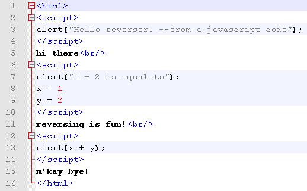

要理解这段代码，互联网上有很多关于 HTML 编程的参考资料。以下是其中一个参考网站：[`www.w3schools.com/html/default.asp`](https://www.w3schools.com/html/default.asp)。我们需要关注的是在 `script` 标签内定义的脚本。在这里共有三个 JavaScript 脚本代码。第一个脚本包含以下代码：

```
alert("Hello reverser! --from a javascript code");
```

`alert` 函数用于显示消息框。消息内容应放在引号内。

第二个脚本包含以下代码：

```
alert("1 + 2 is equal to");
x = 1
y = 2
```

再次，脚本显示一个消息，然后将 `1` 赋值给变量 `x`，将 `2` 赋值给变量 `y`。

最后一个脚本包含以下代码：

```
alert("x + y");
```

这显示了另一个消息。这次，消息是 `x` 和 `y` 变量的和，结果应该是 `3`。即使脚本代码位于不同的标签中，最后运行的脚本中的变量值也应该会在后续脚本中得到反映。

为了证明这个行为，让我们通过在浏览器中运行该文件来动态分析它。

打开 Internet Explorer。我们也可以使用 Firefox 或 Chrome。将 `demo_01.html` 文件拖放到 Internet Explorer 中。加载完成后，应该会显示以下消息框：

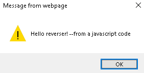

如果浏览器禁用了 JavaScript 内容的运行，消息可能不会显示。通常会弹出安全提示，询问是否允许运行脚本代码。只需允许脚本运行即可：


随后将弹出以下消息框：

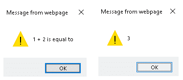

现在页面已经完全加载，按 `F12` 打开调试器控制台。选择调试器面板。这时应该会显示 HTML 脚本，如下所示：

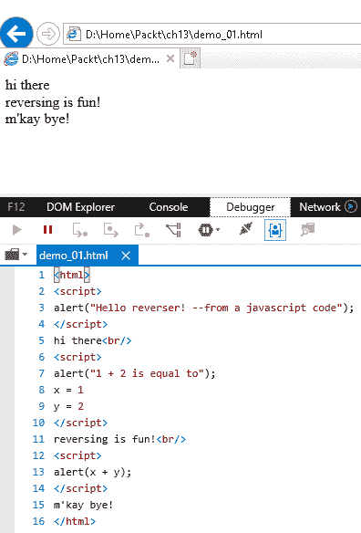

在调试器中，将断点放在第 `3` 行，这是第一个 `alert` 函数。要设置断点，请点击行号左侧的空白区域。这样应该会创建一个红点，表示断点行。以下截图展示了三个脚本及其第一行标记的断点：


通过将焦点放在浏览器页面上并按下 F5 键来刷新浏览器。我们可能会调试 `browsertools` 脚本，这是一个 Internet Explorer 初始化脚本。以下截图展示了这一过程：

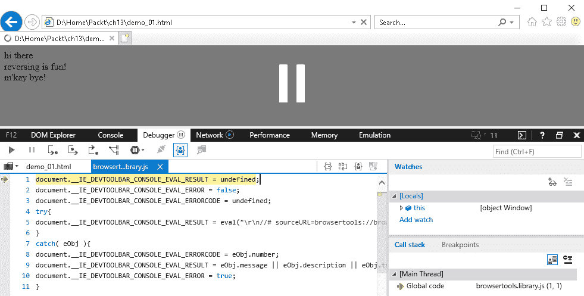

再次按下 *F5* 键，让调试器继续执行，直到我们到达断点。此时，我们应该已经到达第一个 `alert` 函数，如下所示：


我们可以按 *F11* 键进入脚本，或按 F10 键跳过当前行。这样做应该会弹出第一个消息框。继续按 *F10* 键，跳过接下来的脚本行。下一个脚本是另一个 `alert` 函数：

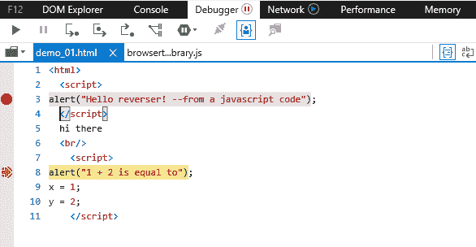

以下几行将`1`赋值给`x`，将`2`赋值给`y`。我们可以通过将这些变量添加到监视列表中来监控这些变量的变化，监视列表位于右侧面板。点击“添加监视”来添加我们可以监控的变量：

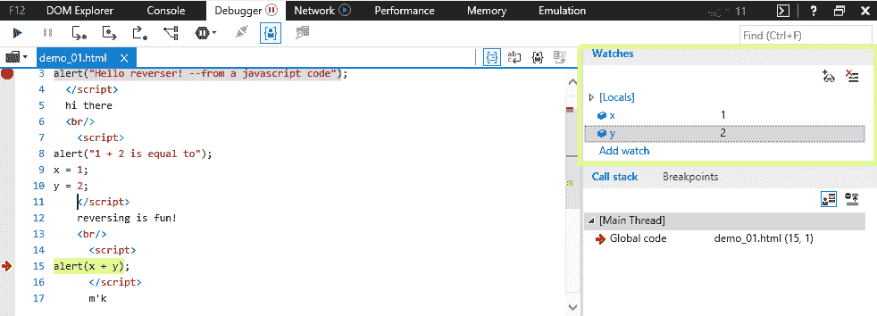

最后的函数是另一个`alert`函数，用于显示`x`和`y`的和。

让我们尝试用`demo_02.html` ([`github.com/PacktPublishing/Mastering-Reverse-Engineering/blob/master/ch13/demo_02.html`](https://github.com/PacktPublishing/Mastering-Reverse-Engineering/blob/master/ch13/demo_02.html))。

如果我们调试这个，它执行的行为与我们在`demo_01.html`中遇到的一样。不同之处在于，当我们从文本编辑器查看时，它看起来是被混淆的：

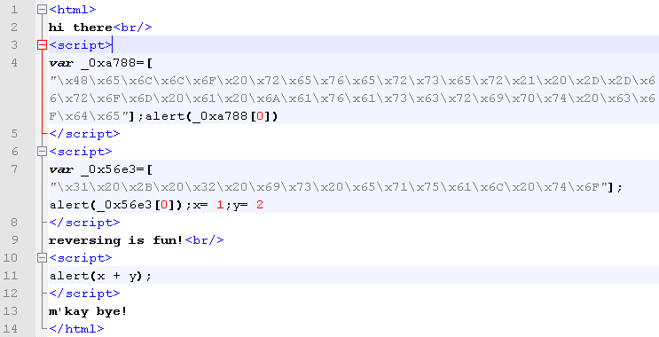

消息被转换为转义格式，使用每个 ASCII 字符的十六进制等价物。在上一章中，我们学习了`Cyberchef`，这是一种在线工具，可以用来去混淆这些类型的数据。由于这些数据是转义的，我们应该使用`unescape`操作来解码这些数据。在`Cyberchef`中，搜索`unescape`操作，然后将转义数据复制并粘贴到输入窗口中。我们应该得到一个解码后的输出，显示我们在消息中看到的确切文本，像这样：


分析 HTML 脚本并不复杂，尤其是因为几乎所有内容都可以被人类读取。我们需要理解的只是语法和脚本语言的功能。此外，这是使用调试工具动态分析脚本的一种方法，而这些工具在网络浏览器中是可以使用的。

# MS Office 宏分析

Microsoft Office 有一种方法可以自动化一些简单的任务，例如创建格式化的表格或插入信头。这叫做 MS Office 宏。MS Office 宏利用了 Visual Basic for Application 语言，它与 Visual Basic 脚本使用相同的语言。然而，这些也可以被滥用来做更多的事情，比如下载文件、创建文件、添加注册表条目，甚至删除文件。

首先，我们需要静态工具来读取信息并从给定的 Office 文件中提取宏源代码。要打开 MS Office 文档，我们需要安装 Microsoft Office。另一个可以使用的工具是 OLE 工具，可以从[`www.decalage.info/en/python/oletools`](http://www.decalage.info/en/python/oletools)下载。这些工具集是 Python 脚本，需要在系统上安装 Python 2.7。Python 安装程序可以从[`www.python.org/`](https://www.python.org/)下载。

我们要分析的第一个文件是 [`github.com/PacktPublishing/Mastering-Reverse-Engineering/blob/master/ch13/demo_01.doc`](https://github.com/PacktPublishing/Mastering-Reverse-Engineering/blob/master/ch13/demo_01.doc)。在命令行中输入以下代码，使用 `olevba.py` 分析 `demo_01.doc`：

```
python olevba.py demo_01.doc
```

这将提取有关`VBA`源代码及其源信息：

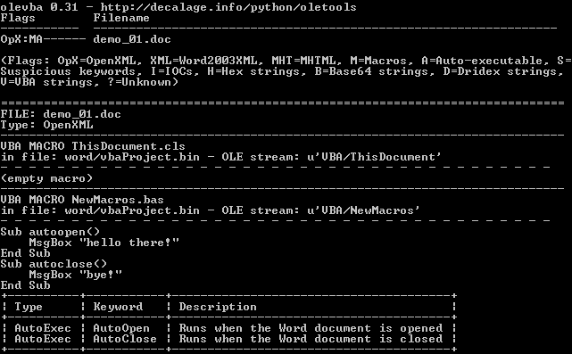

从上面的截图中我们可以看到，源代码包含两个子程序：`autoopen()` 和 `autoclose()`。`olevba.py` 也描述了这些与文档打开和关闭时事件绑定的子程序。

该源包含弹出消息的代码。现在，让我们尝试在 Microsoft Word 中打开文档。通过这样做，我们可能会看到 Microsoft Word 显示有关文档包含代码的安全警告。点击启用内容，以便查看宏可以做什么：


第一个消息立刻出现：

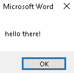

要调试代码，我们需要打开 VBA 编辑器。选择查看 -> 宏，这将打开宏对话框，您可以在其中选择任何宏名称并点击编辑按钮：


我们当前使用的是 Microsoft Office 2013，因此 `VBA` 编辑器的用户界面在其他版本中可能有所不同。在 `VBA` 编辑器中，我们现在应该可以看到源代码。按下*F9*键可以启用或禁用断点。按*F8*键进行逐步调试。*F5*用于继续运行代码。我们可以从任何子程序开始调试。选择调试菜单查看更多可用的调试功能：

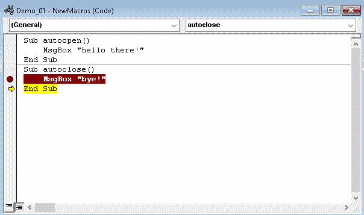

关闭文档将弹出以下消息框：

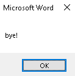

现在，尝试分析 demo_02.doc。由于我们将研究如何推导出密码，这将是一个相当大的挑战。

记住，VBA 编辑器是宏开发者的控制台。在这里，宏程序被开发和调试。因此，为了逆向我们正在寻找的内容，我们可以操作源代码。

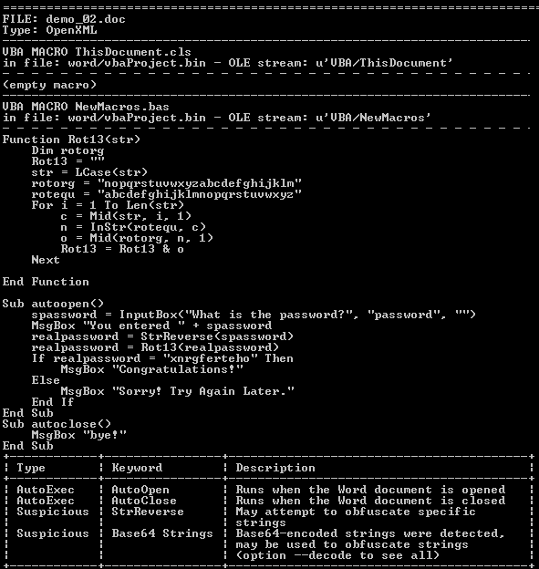

`demo_02.doc`的密码可以在本章的摘要部分找到。

# PDF 文件分析

PDF 文件已经发展到可以运行特定操作并允许执行 JavaScript。对于 PDF 分析，我们可以提取事件信息并分析 JavaScript 将执行的操作。我们可以使用 Didier Stevens 的 PDF 工具集来帮助分析 PDF。这一工具集是基于 Python 的，因此我们需要安装 Python。PDF 工具可以从 [`blog.didierstevens.com/programs/pdf-tools/`](https://blog.didierstevens.com/programs/pdf-tools/) 下载。如果你访问该网站，可以看到有关每个工具的描述。

让我们尝试使用工具分析 [`github.com/PacktPublishing/Mastering-Reverse-Engineering/blob/master/ch13/demo_01.pdf`](https://github.com/PacktPublishing/Mastering-Reverse-Engineering/blob/master/ch13/demo_01.pdf)。使用 `pdfid.py` 执行以下命令：

```
python pdfid.py demo_01.pdf
```

以下截图显示了 `pdfid` 在 `demo_01.pdf` 上的结果：

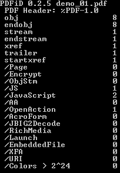

在这里，我们可以看到它嵌入了 JavaScript 代码。现在让我们尝试使用 `pdf-parser.py` 文件，以便提取更多信息。PDF 文件中的某些元素可能已压缩，无法读取。`pdf-parser` 工具能够解压这些流。执行以下命令将 `pdf-parser` 的输出重定向到 `demo_01.log` 文件：

```
python pdf-parser.py demo_01.pdf > demo_01.log
```

`pdf-parser` 给出的输出与 `demo_01.pdf` 的内容基本相同。原因是没有 PDF 对象被解压缩。如果我们仔细查看输出内容，可以轻松识别出脚本代码的位置：

```
  <<
    /JS (app.alert({cMsg: "Reversing is fun!", cTitle: "Mastering Reverse Engineering"})
    ; )
    /S /JavaScript
  >>
```

因此，使用 Chrome 作为我们的 PDF 阅读器时，PDF 会显示以下消息框：


要调试 JavaScript，我们需要将其复制到一个单独的 JavaScript 或 HTML 文件中。我们可能还需要修复运行 JavaScript 运算符的语法。PDF 中的 JavaScript 代码可以转换为以下 HTML 代码：

```
<html>
<script>
    alert("Reversing is fun!", "Mastering Reverse Engineering");
</script>
</html>
```

# SWF 文件分析

ShockWave Flash 文件也可以包含代码。基本上，Flash 文件是合法编写的，按照一系列任务的顺序执行。但就像任何其他代码一样，它也可能被滥用来执行恶意活动。

我们要分析的 SWF 文件可以从 [`github.com/PacktPublishing/Mastering-Reverse-Engineering/blob/master/ch13/demo01.swf`](https://github.com/PacktPublishing/Mastering-Reverse-Engineering/blob/master/ch13/demo01.swf) 下载。

在撰写本书时，用于分析 SWF 的主要工具是 JPEXS SWF 反编译器。除此之外，我们先来谈谈其他可以解析 SWF 文件的现有工具。这些工具如下：

+   SWFTools

+   FLASM

+   Flare

+   XXXSWF

# SWFTools

SWFTools 是一套用于读取和构建 SWF 文件的工具。它可以从 [`www.swftools.org/`](http://www.swftools.org/) 下载。要成功安装 SWFTools，应该以管理员身份运行。工具在命令行中使用。这里有两个可以提取 SWF 文件信息的工具：`swfdump` 和 `swfextract`。这是 `swfdump` 给出的结果：

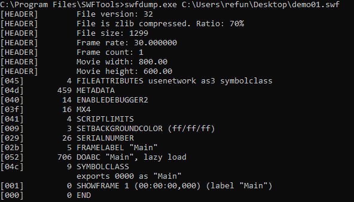

结果告诉我们该文件是 `zlib` 压缩的。还有一个名为 `Main` 的 `DOABC` 方法。`DOABC` 的存在也意味着嵌入了动作脚本。使用 `HxD`，我们可以验证文件是否被压缩。魔法头 `CWS` 表明 `SWF` 文件确实是压缩的。未压缩的 `SWF` 文件以 `FWS` 魔法字节开头：

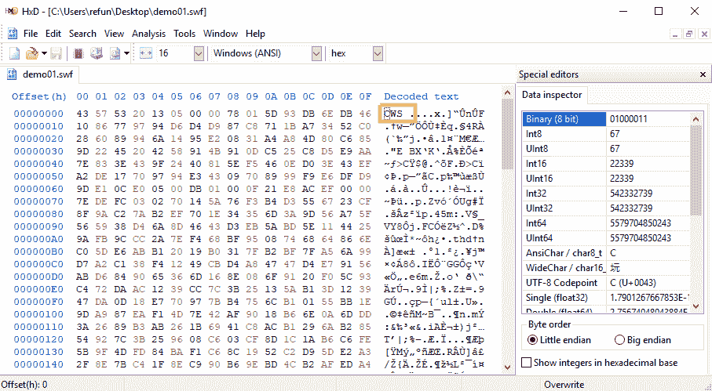

另一个工具，`swfextract`，能够提取嵌入的视频或图像。`demo01.swf`不包含任何媒体，正如我们从以下截图中看到的：


`SWFTools`中的其他工具用于从 PDF、图像和视频构建`SWF`文件。

# FLASM

`FLASM`是一个能够解压和反汇编`SWF`文件的工具。它可以从[`nowrap.de/flasm.html`](http://nowrap.de/flasm.html)下载。我们使用`-x`参数解压了`demo01.swf`，并得到了以下输出：


之后，我们使用`-d`参数反汇编文件，并显示了关于`SWF`结构的信息：

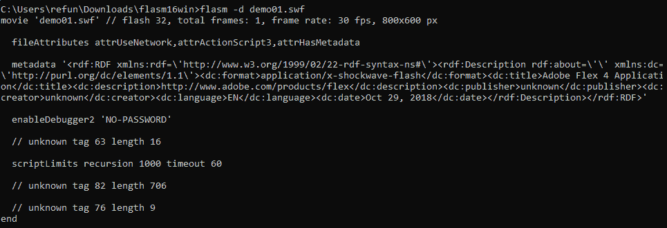

我们在这里看不到任何反汇编或反编译的动作脚本。

# Flare

这是一个能够反编译 ActionScript 代码的工具。它可以从[`nowrap.de/flare.html`](http://nowrap.de/flare.html)下载。然而，它可能无法完全支持`AS2`和`AS3`代码。只需将`SWF`文件传递给 Flare 工具，它将生成一个`FLR`文件。我们可以使用以下命令执行 Flare：

```
flare.exe demo01.swf
```

结果保存在`demo01.flr`中，包含以下输出：

```
movie 'demo01.swf' {
// flash 32, total frames: 1, frame rate: 30 fps, 800x600 px, compressed, network access alowed

  metadata <rdf:RDF xmlns:rdf=\'http://www.w3.org/1999/02/22-rdf-syntax-ns#\'><rdf:Description rdf:about=\'\' xmlns:dc=\'http://purl.org/dc/elements/1.1\'><dc:format>application/x-shockwave-flash</dc:format><dc:title>Adobe Flex 4 Application</dc:title><dc:description>http://www.adobe.com/products/flex</dc:description><dc:publisher>unknown</dc:publisher><dc:creator>unknown</dc:creator><dc:language>EN</dc:language><dc:date>Oct 29, 2018</dc:date></rdf:Description></rdf:RDF>

  // unknown tag 82 length 706

  // unknown tag 76 length 9
}
```

它的结果与`FLASM`相同，没有反汇编任何动作脚本。

# XXXSWF

该工具可以从[`github.com/viper-framework/xxxswf`](https://github.com/viper-framework/xxxswf)下载。它是一个 Python 脚本，接受以下参数：

```
Usage: xxxswf.py [options] <file.bad>

Options:
  -h, --help show this help message and exit
  -x, --extract Extracts the embedded SWF(s), names it MD5HASH.swf &
                        saves it in the working dir. No addition args needed
  -y, --yara Scans the SWF(s) with yara. If the SWF(s) is
                        compressed it will be deflated. No addition args
                        needed
  -s, --md5scan Scans the SWF(s) for MD5 signatures. Please see func
                        checkMD5 to define hashes. No addition args needed
  -H, --header Displays the SWFs file header. No addition args needed
  -d, --decompress Deflates compressed SWFS(s)
  -r PATH, --recdir=PATH
                        Will scan a directory for files that contain SWFs.
                        Must provide path in quotes
  -c, --compress Compress SWF using Zlib
  -z, --zcompress Compress SWF using LZMA
```

我们尝试使用这个工具处理`demo01.swf`。在使用`-H`参数后，工具告诉我们该文件已被压缩。然后我们使用`-d`选项解压了文件，得到了一个解压后的`SWF`版本，保存在`243781cd4047e8774c8125072de4edb1.swf`文件中。最后，我们对解压后的文件使用了`-H`参数：

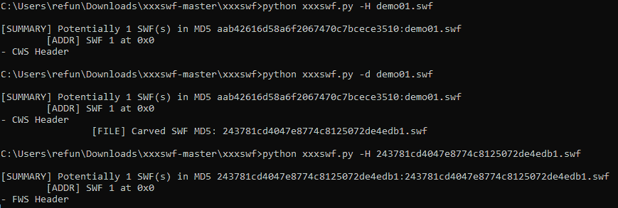

到目前为止，在没有`yara`和`md5`功能的情况下，最有用的功能是它能够搜索嵌入的 Flash 文件。这在检测包含嵌入 SWF 的`SWF`恶意软件时非常有用。

# JPEXS SWF 反编译器

最常用的 SWF 文件分析工具之一是`JPEXS` SWF 反编译器。夜间版本可以从[`github.com/jindrapetrik/jpexs-decompiler`](https://github.com/jindrapetrik/jpexs-decompiler)下载。该工具能够反编译支持`AS3`的`ActionScript`。以下截图显示了`JPEXS`控制台：

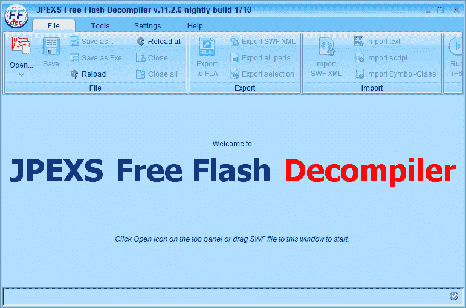

除了能够反编译，它还具有一个可以与 Adobe Flash Player 的调试器进行设置的界面。安装 JPEXS 后，我们需要从[`www.adobe.com/support/flashplayer/debug_downloads.html`](https://www.adobe.com/support/flashplayer/debug_downloads.html)下载*flash player projector 内容调试器*。

打开 JPEXS，然后选择设置->高级设置->路径。接着，浏览到下载的 Flash 可执行文件，填写 Flash Player 投影仪内容调试器路径。完成后点击确定：

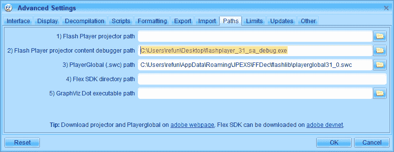

这是一个重要的设置，它使我们能够调试反编译后的 ActionScript。你也可以通过从[`www.adobe.com/support/flashplayer/debug_downloads.html`](https://www.adobe.com/support/flashplayer/debug_downloads.html)下载 Flash Player 投影仪来填写 Flash Player 投影仪路径。

打开 SWF 文件并展开左侧窗口中的对象树。在`scripts`对象下选择 Main。这样就会显示反编译后的 ActionScript，如下图所示：

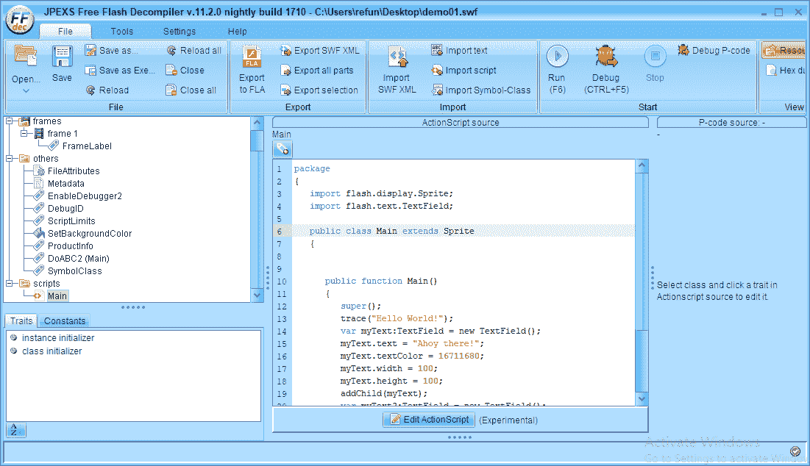

这里是`demo01.swf`的反编译代码：

```
package
{
   import flash.display.Sprite;
   import flash.text.TextField;

   public class Main extends Sprite
   {

      public function Main()
      {
         super();
         trace("Hello World!");
         var myText:TextField = new TextField();
         myText.text = "Ahoy there!";
         myText.textColor = 16711680;
         myText.width = 100;
         myText.height = 100;
         addChild(myText);
         var myText2:TextField = new TextField();
         myText2.text = "Reversing is fun!\n--b0yb4w4n9";
         myText.y = 100;
         addChild(myText2);
      }
   }
}
```

点击调试按钮或*Ctrl+F5*，这应该会带我们进入调试控制台。在最左边的窗口中，显示的是反编译后的 ActionScript 的字节码等效物。

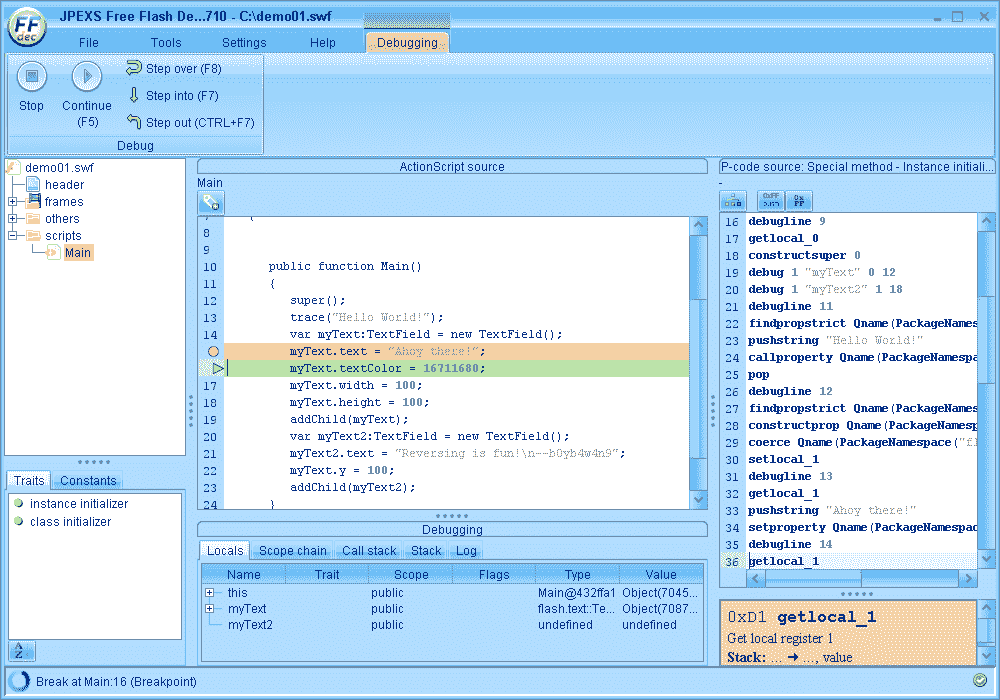

代码的作用是创建两个 TextFields，包含显示在 SWF 显示空间上的文本。

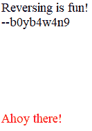

JPEXS 是一款具有我们希望用来分析 Flash 文件中代码的关键功能的工具。它具备字节码反汇编器、源代码反编译器和调试器。

# 总结

分析各种文件类型也采用与逆向工程相同的概念。在本章中，我们学习了文件格式所使用的脚本语言。如果我们有兴趣理解文件的头部和结构，我们还可以收集更多的信息。我们还了解到，只要可执行代码可以嵌入到文件中，就一定有方法可以分析它。虽然可能无法轻松进行动态分析，但至少可以进行静态分析。

我们讨论了如何调试嵌入在 HTML 脚本中的 JavaScript。实际上，我们可以分析我们访问的任何网站。我们还了解了可以用来提取 Microsoft Office 文档中宏代码的工具。恰好，我们也可以使用 VBA 编辑器调试这些宏代码。我们还研究了多种工具，用于从 PDF 文件中提取 JavaScript 代码。然后，我们使用 JPEXS 分析了 SWF 文件，这是一个强大的工具，具备反汇编器、反编译器和调试器。

逆向工程软件是一个实践中的概念。我们研究软件是什么以及它是如何工作的。我们还学习了执行文件中代码背后的低级语言。学习这门语言可能需要时间，但从中获得的知识和经验是值得的。

祝你逆向工程愉快！

P.S. `demo_02.doc`的密码是 burgersteak。

# 深入阅读

[`www.w3schools.com/html/default.asp`](https://www.w3schools.com/html/default.asp)：一个学习 HTML 脚本的优秀教程网站

[`www.javascriptobfuscator.com`](http://www.javascriptobfuscator.com) [-](http://www.javascriptobfuscator.com) 这是一个可以混淆 JavaScript 代码的在线网站
