# 设置渗透测试环境

继续我们的书籍的第一部分，这是最实用的章节之一。显然，没有必要的工具包，进行高质量的渗透测试是不可能的。我们将在这里讨论一些可能性以及一些可以帮助你日常 API 渗透测试的工具。你将找到安装我在构建练习中应用的所有主要工具的说明，这些工具也是你在实际的 API 入侵测试中将使用的工具。还有一些关于操作系统和**集成开发环境**（**IDE**）的决策需要你做出。通过克隆本书的代码仓库，你可以节省相当多的时间。我分享了所有出现在后续章节中的代码和一些工具。

本章将涵盖以下主要话题：

+   选择工具和框架

+   建立测试实验室

+   配置测试环境

# 技术要求

虽然一些渗透测试人员有几台笔记本电脑，每台都安装一个最常见操作系统的版本（Linux、macOS 和 Windows），但其他人则倾向于将他们的测试环境托管在某个公共或私有云上。我以前也从事过取证分析。在那里，操作系统的家族确实很重要，特别是在进行深度分析时，因为文件系统的内部结构或其他一些固有特性，如库、命令工具或内核。如今，我属于使用本地虚拟机的团队。

因此，我在本书接下来的所有章节中都使用了虚拟机。为了获得良好的体验，建议你至少具备以下硬件配置：

+   一些 Intel Core i7 处理器或相应的 AMD 芯片，或者一些苹果自研芯片的电脑。

+   16 GB 内存。

+   1 TB 硬盘。

# 选择工具和框架

在接下来的章节中，我们将涵盖相当数量的 API 话题。所以，我们应该从选择合适的工具开始，这些工具将减少我们的工作量。既然我们将使用虚拟机，我们必须从选择一个虚拟机监控器开始。这个部分有多种选择和章节：

+   **Windows**

    +   **VMware Workstation**：该产品最近（2024 年）已变为**个人**使用免费。它非常稳定，更新频繁，并且可以将所有 CPU 标志转发到客机操作系统。如果你使用 Windows 作为主机操作系统，我一定推荐这个。

    +   **Oracle Virtualbox**：这是由 Oracle 控制的开源跨平台虚拟机监控器。它有扩展包，几乎可以在任何 Windows 版本上顺利运行。然而，在本章写作时（并且该问题在该产品历史上持续了一段时间），最大的限制是缺少虚拟化寄存器来支持客机操作系统。

    +   **Microsoft Hyper-V**：这是 Windows 内嵌的虚拟机监控器。可以在桌面版和服务器版操作系统上使用。它有一个名为**Windows Subsystem for Linux**（**WSL**）的子集，目前已经是第二个版本，允许部署一些无头的 Linux 发行版。

+   **macOS**

    +   **VMware Fusion**：这款产品最近（2024 年）变为**个人**免费使用。它的更新生命周期与 Windows 版本类似，如果你使用的是 Apple 主机操作系统，这也是一个应该考虑的选项。

    +   **Oracle Virtualbox**：它也适用于 macOS，但自从 Apple Silicon 芯片（M1、M2、M3…）发布以来，它一直处于 beta 阶段。不幸的是，在编写本章时，使用这种芯片启动 Linux 来宾操作系统并不成功。

    +   **UTM**：这是我在研究产品选项和功能时的一个意外发现。由于对 VMware Fusion 授权的疑虑以及 Virtualbox 在 ARM/Apple Silicon 上的限制和不稳定性，我选择了 UTM。它是一个轻量级的、低端功能的开源虚拟化程序，基于 QEMU，在为来宾操作系统模拟硬件方面做得很好。因此，如果你在 Apple Silicon 上运行 macOS，它是我的推荐选择。

+   **Linux**

    +   **VMware Workstation**：这个软件包足够稳定，可以在任何主要发行版上运行。结合了易用性、强大的功能和免费的授权，它是我推荐的在 Linux 主机操作系统上运行的工具。

    +   **Oracle Virtualbox**：当然，这里也可以下载。你可以轻松下载一些主要发行版的二进制文件，例如 Fedora、Debian、Ubuntu 和 openSUSE。如果使用其他发行版，可以尝试其源代码。

    +   **QEMU-KVM**：如果你满意只通过命令行管理虚拟机，这是一个不错的选择。所有 Linux 发行版都有实现这些工具中的一个或两个。虽然有一些重要且有效的工具，但它最终可能会变得乏味，特别是当你需要频繁在来宾操作系统和主机操作系统之间切换时。建议将其作为最后的资源。

本书中演示的所有工具都可以在 Linux 上运行。它们中的一些也有其他系统的版本，还有一些可以作为 Docker 容器运行。为了保持章节间的一致性，我选择了 Linux。我使用了一台搭载 Apple Silicon 的 Apple 计算机来编写本书的大部分内容。只有少数实验无法在该平台上运行，原因是所使用工具的限制，且通过另一台运行 Windows 的 Intel 计算机来解决了这个问题。在这两种情况下，我选择了作为虚拟机运行的 Ubuntu Desktop 发行版。对于 Apple 机器，我选择了 UTM 作为虚拟化管理程序，而对于 Windows 计算机，我选择了 VMware Workstation。

下一步，虽然是可选的，但可以帮助你完成编码部分。它是关于选择一个集成开发环境（IDE）。在这方面，你可以考虑以下几个选项：

+   `vi`，以及它可能的一个更强大的功能——快捷键。与 Emacs 相反，它可能在一些发行版上预安装。然而，`vim` 有一种模态的工作方式（编辑与可视化），对新手来说可能有些繁琐。除此之外，几乎没有任何图形化的表示。默认情况下，你只能看到你正在编辑的文本，其他什么也看不见。

+   **图形化**：

    +   在这个类别中有很多图形化的 IDE，比如 Atom、PyCharm 和 Sublime。在本书中，我们将主要使用 Python 或 Golang 进行示例和练习。因此，不需要消耗太多资源或具备复杂功能的工具。我只会向你推荐一个，它就是 **Visual Studio Code**（简称 **VScode**）。它甚至有一个开源版本，叫做 **VSCodium**。当我需要编写代码时，这个产品显示出了非常实用的功能：语法高亮、代码补全、内联帮助、调试器、内联终端，等等。

最后我选择了 VScode（非开源版本），因为之前提到的功能，还有一些扩展（即它所称的插件）在 VSCodium 上运行不太顺畅。

一旦你了解了实验室的选项，就该开始构建它了。让我们开始吧！

# 构建测试实验室

现在你已经选择了你的工具和框架，让我们开始构建一个能够支持我们实验室的环境。我不会展示虚拟化软件或 Ubuntu 的安装步骤，因为它们非常简单。不过，如果在安装过程中遇到问题，你可以随时查阅官方文档，例如 https://help.ubuntu.com/20.04/installation-guide/index.html、https://docs.fedoraproject.org/en-US/fedora/latest/getting-started/ 和 https://download.virtualbox.org/virtualbox/7.0.18/UserManual.pdf。本节所提到的工具的顺序大致按照它们在接下来的章节中出现的顺序排列。它们中的一些只包含了几张截图，并没有在整本书中使用，所以它们的安装过程在这里不做覆盖。

## 安装 Docker

让我们先从安装 Docker 开始吧。

1.  在虚拟机完全加载后，打开命令提示符并检查是否安装了`curl`。一些较新的 Bash 版本在缺少该命令时会提示安装软件。无论如何，如果没有安装`curl`，你可以轻松地通过以下命令安装：

    ```
    $ sudo apt update && sudo apt install curl
    ```

1.  接下来我们需要的工具是 Docker。官方文档提供了一个详尽的分步指南，链接在这里（https://docs.docker.com/engine/install/ubuntu/）。

1.  在安装之前，你需要执行一些准备步骤，比如添加官方仓库并安装签名密钥：

    ```
    # Add Docker's official GPG key:
    sudo apt-get update
    sudo apt-get install ca-certificates curl
    sudo install -m 0755 -d /etc/apt/keyrings
    sudo curl -fsSL https://download.docker.com/linux/ubuntu/gpg -o /etc/apt/keyrings/docker.asc
    sudo chmod a+r /etc/apt/keyrings/docker.asc
    # Add the repository to Apt sources:
    echo \
      "deb [arch=$(dpkg --print-architecture) signed-by=/etc/apt/keyrings/docker.asc] https://download.docker.com/linux/ubuntu \
      $(. /etc/os-release && echo "$VERSION_CODENAME") stable" | \
      sudo tee /etc/apt/sources.list.d/docker.list > /dev/null
    sudo apt-get update
    ```

1.  然后你可以通过以下命令安装 Docker：

    ```
    sudo apt-get install docker-ce docker-ce-cli containerd.io docker-buildx-plugin docker-compose-plugin
    ```

1.  不要忘记赋予你的用户名所有必要的权限以便运行它。

    ```
    $ sudo groupadd docker
    $ sudo usermod -aG docker $USER
    docker run hello-world.
    ```

1.  我们将首先安装的容器是 WebGoat，它包含了 WebWolf。只需运行以下命令，你就能获得运行这两个软件所需的一切：

    ```
    CTRL + D to exit it and check the current images:

    ```

    $ docker images

    仓库                   标签               镜像 ID       创建时间         大小

    webgoat/webgoat              最新版本            cea483e51e8f   6 个月前    404MB

    ```

    ```

现在 Docker 已经安装完毕，让我们为实验室添加更多的软件。

## 安装 OWASP 软件

以下子章节介绍 OWASP 项目的安装。OWASP 是一个将不同背景的公认专业人士联合在一起的组织。他们讨论并制定全球采纳的标准，并创建帮助安全专业人员和爱好者练习和实践其角色的软件和工具，尤其是在进攻性安全方面。

### 安装 crAPI

我们将从安装 crAPI 开始，这是 OWASP 的另一个项目，充满了漏洞。

1.  首先克隆位于 https://github.com/OWASP/crAPI 的仓库。

1.  我们将使用`docker-compose`来启动它。

1.  使用`sudo apt install docker-compose`安装它，然后输入以下命令：

    ```
    $ git clone https://github.com/OWASP/crAPI
    $ cd crAPI/deploy/docker
    $ docker compose -f docker-compose.yml --compatibility up -d
    ```

    这将下载一些镜像并启动所有容器。

1.  检查你现在拥有的内容：

    ```
    $ docker images
    REPOSITORY              TAG       IMAGE ID       CREATED        SIZE
    crapi/mailhog           latest    b090a6f374ad   13 days ago    21.3MB
    crapi/crapi-community   latest    9c9fc54c2eec   13 days ago    32.1MB
    crapi/crapi-workshop    latest    452648f7cdb1   13 days ago    186MB
    crapi/crapi-identity    latest    abb5e226020f   2 weeks ago    491MB
    crapi/gateway-service   latest    ed9fd107e30a   2 weeks ago    78MB
    crapi/crapi-web         latest    464f1efe9fd4   2 weeks ago    133MB
    postgres                14        08fca857484c   4 weeks ago    444MB
    mongo                   4.4       80d502872ebd   3 months ago   408MB
    webgoat/webgoat         latest    cea483e51e8f   6 months ago   404MB
    ```

1.  还有容器：

    ```
    $ docker ps -a
    CONTAINER ID   IMAGE                          COMMAND                  
    CREATED          STATUS                        PORTS                   
                              NAMES
    96c3570a0ccf   crapi/crapi-web:latest         "/bin/sh -c /etc/ngi…"   26 minutes ago   Up 26 minutes (healthy)       127.0.0.1:8888->80/tcp, 127.0.0.1:8443->443/tcp   crapi-web
    b2fbe3d479bb   crapi/crapi-workshop:latest    "/bin/sh -c /app/run…"   26 minutes ago   Up 26 minutes (healthy)                          
                                   crapi-workshop
    f687427de9f6   crapi/crapi-community:latest   "/bin/sh -c /app/main"   27 minutes ago   Up 27 minutes (healthy)       6060/tcp                
                              crapi-community
    8c4d891f420a   crapi/crapi-identity:latest    "/entrypoint.sh"         
    27 minutes ago   Up 27 minutes (healthy)       10001/tcp              
                               crapi-identity
    3753ffa0052f   mongo:4.4                      "docker-entrypoint.s…"   27 minutes ago   Up 27 minutes (healthy)       27017/tcp                                         mongodb
    1a531c4fae21   crapi/mailhog:latest           "MailHog"                
    27 minutes ago   Up 27 minutes (healthy)       1025/tcp, 127.0.0.1:8025->8025/tcp                mailhog
    8cecff3f9661   crapi/gateway-service:latest   "/app/server"            27 minutes ago   Up 27 minutes (unhealthy)     443/tcp                                           api.mypremiumdealership.com
    0448ced9db02   postgres:14                    "docker-entrypoint.s…"   27 minutes ago   Up 27 minutes (healthy)       5432/tcp                                          postgresdb
    ee8043011c70   webgoat/webgoat                "java -Duser.home=/h…"   32 minutes ago   Up 33 minutes (healthy)       127.0.0.1:8080->8080/tcp, 127.0.0.1:9090->9090/tcp                               
                   stoic_gate
    ```

crAPI 已启动。是时候安装 Zed Attack Proxy 了。

### 安装 OWASP ZAP

让我们继续安装 OWASP ZAP。这是一个图形化的过程。

1.  首先从这里下载 Linux 安装程序（https://www.zaproxy.org/download/）。

1.  你需要安装 Java 才能运行 ZAP。当你在命令提示符中输入`java`时，Bash 会建议你几个选项。你必须安装至少版本为 11 的 Java 虚拟机：

    ```
    $ sudo apt install openjdk-11-jre-headless
    ```

1.  然后以 root 权限运行安装程序：

    ```
    $ sudo ./ZAP_2_14_0_unix.sh
    ```

    结果，会显示欢迎界面（*图 2**.1*）。

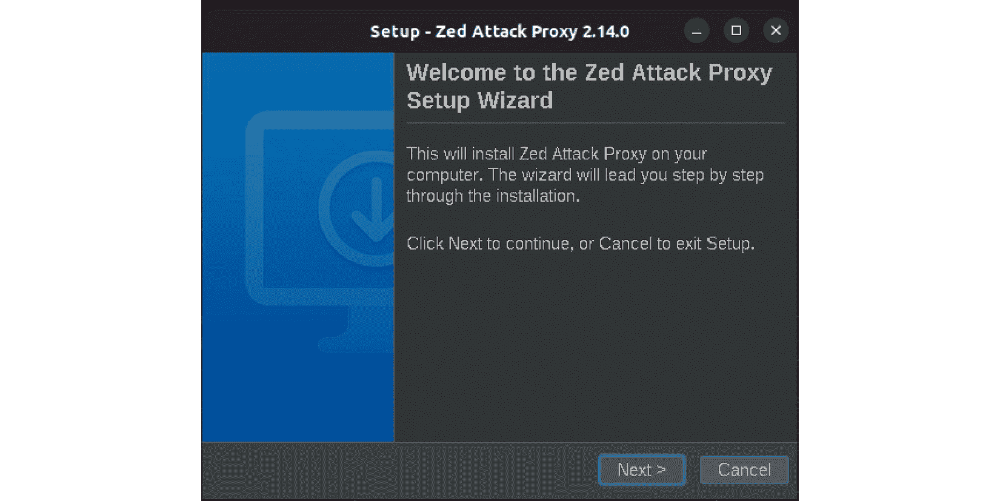

图 2.1 – ZAP 安装程序欢迎界面

1.  点击**下一步**按钮，你将看到两个选项（*图 2**.2*）。由于我们是高级用户，让我们选择**自定义安装**。

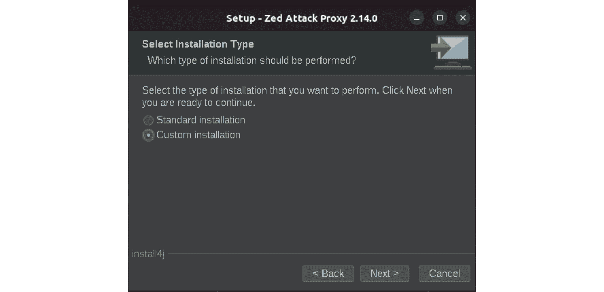

图 2.2 – 选择自定义安装

1.  这意味着会接下来问你一些问题。第一个问题是安装目录。你可以选择默认值，除非你有一个分区拥有更多的磁盘空间。你还会看到需要多少磁盘空间以及剩余多少空间（*图 2**.3*）。

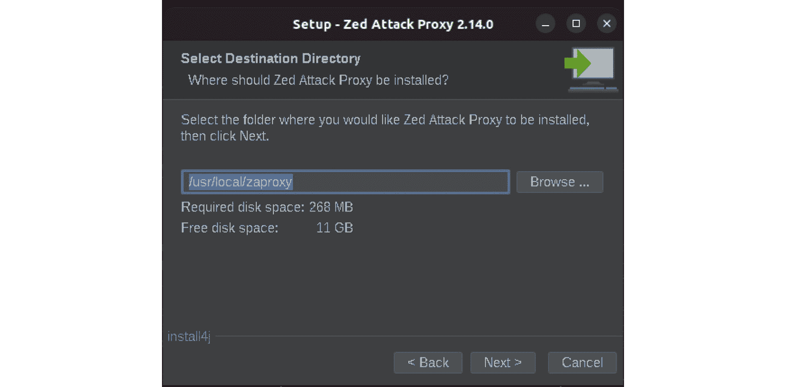

图 2.3 – 选择安装目录

1.  然后，你需要告知安装程序将在哪个位置创建符号链接。这样可以确保软件及其内部组件在你从命令行或窗口管理器中调用时正常工作。选择默认选项，因为它指向一个系统 PATH 中的目录（*图 2**.4*）。

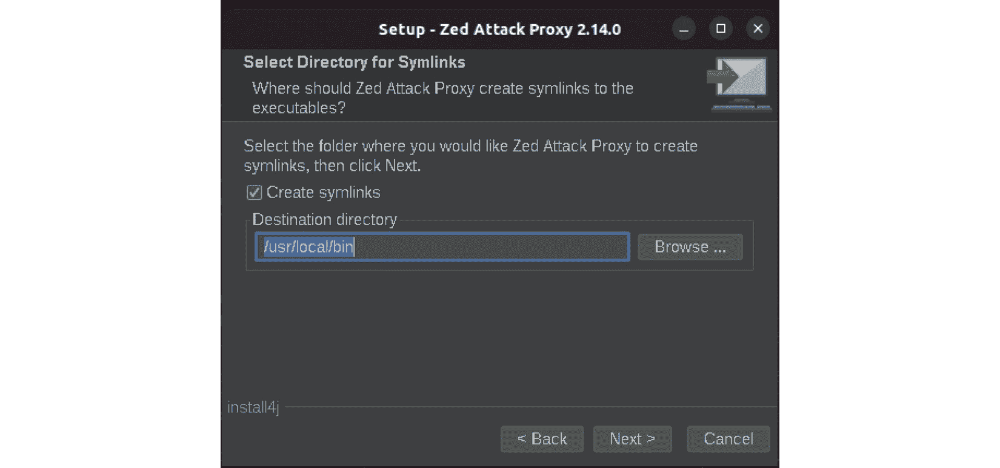

图 2.4 – 选择安装程序将在哪里创建二进制文件的符号链接

1.  接下来，你需要决定是否需要桌面图标。虽然这是外观设置，但在某些情况下也很有用。它无妨，所以我选择了它（*图 2**.5*）。

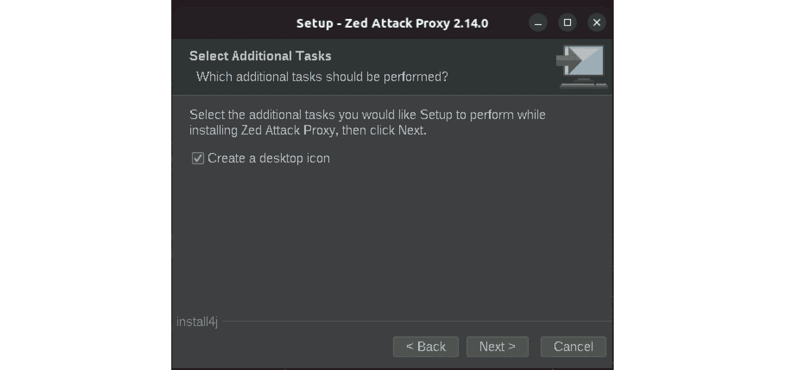

图 2.5 – 为应用程序创建桌面图标

1.  下一步是关于更新的内容。不要忘记勾选启动时检查更新的复选框，但不要选择安装新的 ZAP 版本的复选框。像这种复杂的软件，在考虑安装新版本之前，您应先阅读其发布说明。其他软件可能与之冲突。因此，首先进行检查是安全的（*图 2.6*）。

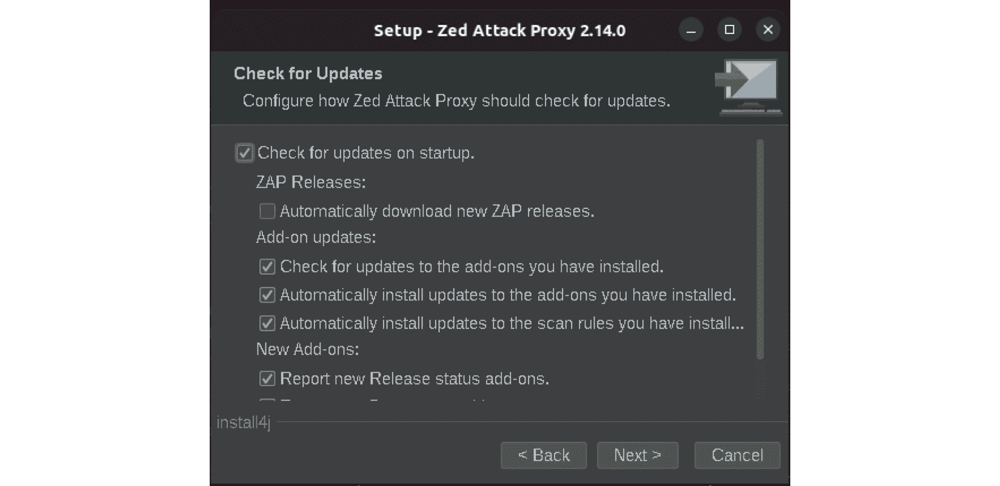

图 2.6 – 一些更新选项

1.  完成此操作后，安装就完成了。尝试从图形界面启动应用程序。可能会发现没有图标显示出来（*图 2.7*）。


图 2.7 – ZAP 的图标未显示应用程序的实际图标

这不是问题。它可能与 JVM 配置或您的 Linux 发行版有关。

1.  每次加载时，ZAP 会询问您是否要保持会话。如果您愿意保存您的活动，请选择相关选项。对于您在这里进行的大部分操作，实际上没有必要这样做（*图 2.8*）。


图 2.8 – 是否保持会话

1.  点击**开始**后，工具最终加载完毕。您可能已看到*图 2.9*中的窗口。ZAP 拥有合理数量的插件，并且它们遵循独立的更新周期。可能会弹出一些推荐，确认后继续过程。请不要忽视它们（*图 2.9*）。


图 2.9 – ZAP 插件的可选但推荐的更新

下图显示了 ZAP 的一些插件的截图，并且可以一键按顺序更新它们（*图 2.10*）。

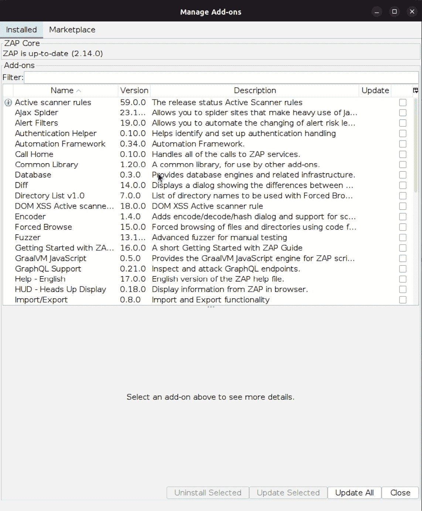

图 2.10 – ZAP 的插件更新界面

OWASP 软件已经安装。接下来我们加入另一个工具项。

## 安装 Burp Suite

我们将大量使用的另一个工具是 Burp Suite。该工具有几个版本可供选择，但我们将使用社区版。

1.  下载安装程序：https://portswigger.net/burp/releases/community/latest。然后直接执行它：

    ```
    $ ./burpsuite_community_linux_arm64_v2023_12_1_3.sh
    Unpacking JRE ...
    Starting Installer ...
    ```

    和往常一样，第一屏是欢迎界面（*图 2.11*）。

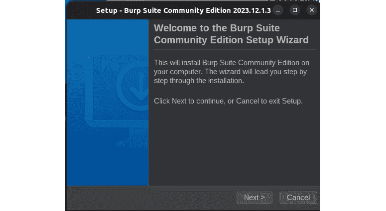

图 2.11 – Burp 安装欢迎界面

1.  选择**下一步**，然后系统会提示您选择安装目录（*图 2.12*）。

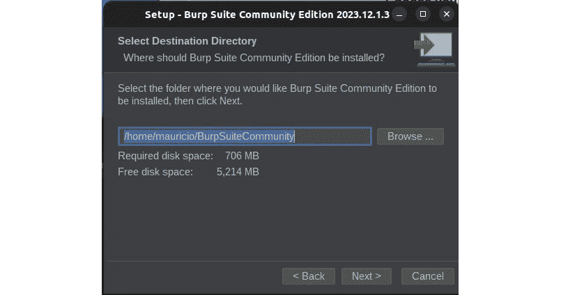

图 2.12 – Burp 的安装目录

1.  和 ZAP 一样（*图 2.4*），安装程序会询问应该在哪创建符号链接。请按照前图所示，选择默认值，除非您有其他空间更大的区域（*图 2.13*）。

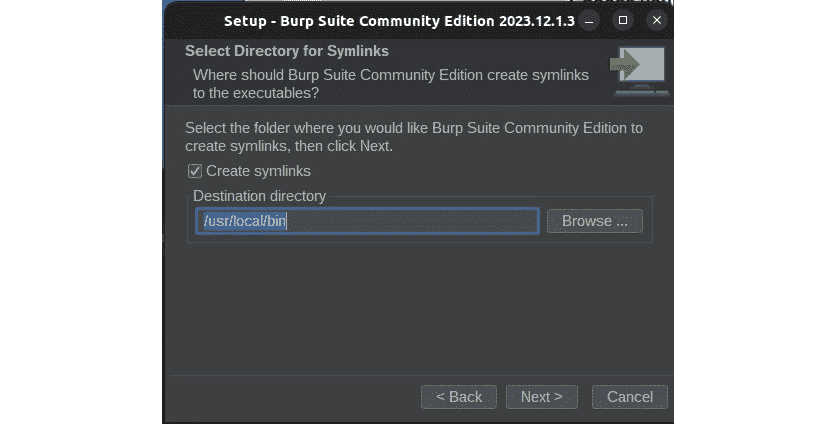

图 2.13 – 应该创建 Burp 二进制文件链接的位置

1.  等待安装程序解压并将文件放置到正确的位置。根据当前版本和你的虚拟机硬件配置，这可能需要一些时间（*图 2**.14*）。

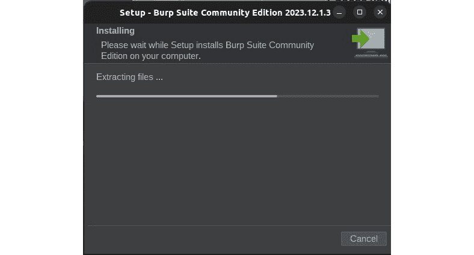

图 2.14 – 文件正在安装

1.  只需完成设置，你就可以开始了（*图 2**.15*）。

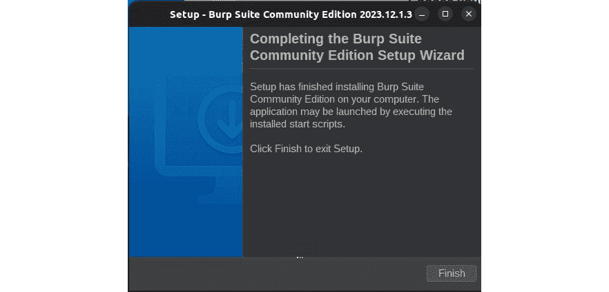

图 2.15 – 安装结束

1.  至少，Burp 配备了正确的图标。当你在 Linux 的窗口管理器中输入它的名称时，你会看到它。加载它来验证安装是否一切正常（*图 2**.16*）。

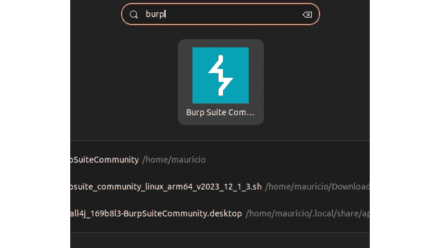

图 2.16 – 通过 GUI 调用 Burp

1.  每次打开应用程序时，你将被提示是否要在内存中启动一个临时项目，或者是否希望加载之前保存的项目。在本书的所有练习中，我们将只创建临时项目，所以只需选择第一个选项并点击**下一步**（*图 2**.17*）。

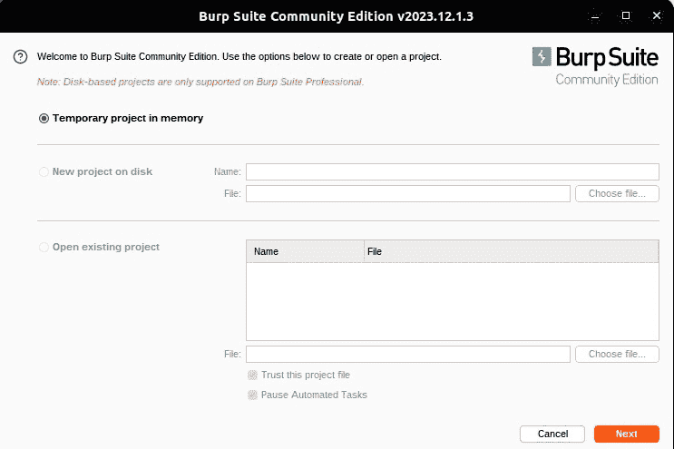

图 2.17 – 选择 Burp 启动方式

1.  最后，你将被提示选择加载 Burp 时使用的参数。你可以通过应用程序的 GUI 或直接编辑配置文件来配置其中的几个参数。如果你之前做过这一步，你可以浏览配置文件并通过相应的对话框加载它。否则，只需点击默认选项并点击**下一步**（*图 2**.18*）。

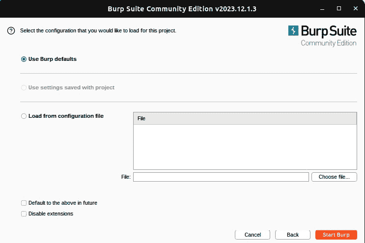

图 2.18 – 加载 Burp 参数

就这样，Burp 安装完成。让我们继续。

## 安装 Postman 和 Wireshark

接下来的安装步骤极其简单：Postman 和 Wireshark。

### 安装 Postman

根据官方文档，Postman 当前（2024）支持 Ubuntu、Fedora 和 Debian。其他发行版可能也可以使用，但你需要查看你所在发行版的文档以及该工具本身的文档进行确认。使用厂商推荐的 snap，你可以通过以下方式在系统中安装它：

```
$ sudo apt update
$ sudo apt install snapd
$ sudo snap install postman
```

完成。通过 GUI 或 CLI 调用它（*图 2**.19*）。


图 2.19 – 调用 Postman

### 安装 Wireshark

对于 Wireshark，如果你在命令提示符下输入 wireshark，Bash 会建议通过 APT 安装它。所以只需照做：

```
$ sudo apt install wireshark-qt
```

你需要做出一个决定。默认情况下，非 root 用户不能从网络设备捕获数据包。如果你选择**否**（默认），你必须以 root 身份运行 Wireshark 才能使用它，特别是当你捕获来自回环接口的数据包时（*图 2**.20*）。


图 2.20 – 选择非 root 用户是否能够捕获数据包

我选择了`/etc/group`文件，并将我的用户名添加到包含`wireshark`组的那一行，然后注销并重新登录：

```
wireshark:x:137:mauricio
```

之后，我终于能够加载软件并捕获数据包了。Wireshark 现在准备就绪，开始工作了（*图 2.21*）。


图 2.21 – 调用 Wireshark

如前所述，本书中创建的许多代码是用 Python 或 Golang 编写的。Python 在这种环境中有一个非常有用的模块，叫做 `pip`。有时，它并不会随着主语言一起预装：

```
$ python3 -m venv testdir
The virtual environment was not created successfully because ensurepip is not available.  On Debian/Ubuntu systems, you need to install the python3-venv package using the following command.
    apt install python3.10-venv
You may need to use sudo with that command.  After installing the python3-venv package, recreate your virtual environment.
Failing command: /home/mauricio/Downloads/testdir/bin/python3
```

从这里，你有两个选择。你可以运行前面提到的命令，只安装所需的模块，或者安装`pip`和模块。第二个选项更为灵活，因为在后续的章节中你会需要`pip`：

```
$ sudo apt install python3-pip
$ sudo apt install python3-venv
$ python3 -m venv testdir
$ ls -alph testdir
total 24K
drwxrwxr-x 5 mauricio mauricio 4.0K Jun  8 15:53 ./
drwxr-xr-x 4 mauricio mauricio 4.0K Jun  8 15:53 ../
drwxrwxr-x 2 mauricio mauricio 4.0K Jun  8 16:20 bin/
drwxrwxr-x 2 mauricio mauricio 4.0K Jun  8 15:53 include/
drwxrwxr-x 3 mauricio mauricio 4.0K Jun  8 15:53 lib/
lrwxrwxrwx 1 mauricio mauricio    3 Jun  8 15:53 lib64 -> lib/
-rw-rw-r-- 1 mauricio mauricio   71 Jun  8 16:25 pyvenv.cfg
```

根据 Python 版本和 Ubuntu 发布版本，上面块中的第一个命令可能默认安装许多模块。你可以通过`pip3 list`检查已安装的模块。

尽管我已经提到我选择了 VScode 作为 IDE，但我还没有展示如何安装它。可以选择几种不同的方法，具体描述请参见 https://code.visualstudio.com/docs/setup/linux。我个人下载了二进制文件并通过 APT 安装了它（`sudo apt install ./code`），就这样（*图 2.22*）：


图 2.22 – 调用 VS Code

这就是开发环境的部分。接下来，让我们看看其他工具。

## 安装其他工具

我们需要各种类型的工具来完成后续章节中的不同活动。其中一些工具会帮助你进行模糊测试（你将在*第四章和第六章*中详细学习），其他一些则帮助进行负载/压力测试，或伪造日志生成、日志分析，最后还有源代码验证，除了 Golang 包本身。在这一节中，我们将看一下其中的一些工具。为了方便你使用，就像本章中展示的所有可下载工具一样，我已经将其 Intel 和 ARM Linux 版本上传到本书的 GitHub 仓库。该仓库地址是 [`github.com/PacktPublishing/Pentesting-APIs`](https://github.com/PacktPublishing/Pentesting-APIs)。书中使用的所有主要代码摘录都可以在那里找到。此外，这些工具的大小都比较大，因此，请查看该仓库中的`README.md`文件，里面包含了进一步的安装和使用说明。

### Anaconda

另一个与 Python 配合使用的优秀工具是**Anaconda**。你可以创建额外的环境来进行工作，并在其中安装额外的软件包，就像使用虚拟环境一样。然而，它的一个最大优势是，你可以通过一个命令更新所有组件和依赖项。我没有在我的系统上安装它，但你可以按照 https://docs.anaconda.com/free/anaconda/install/linux/上的步骤进行安装。

### Hydra

在某些章节中，将会有一个非常有用的工具是 **Hydra**，它通常用于执行某种暴力破解攻击。为了让我们高兴的是，它的二进制版本在一些 Ubuntu 默认的仓库中可以找到，因此我们可以轻松地通过以下方式进行安装：

```
$ sudo apt install hydra
$ hydra
Hydra v9.2 (c) 2021 by van Hauser/THC & David Maciejak - Please do not use in military or secret service organizations, or for illegal purposes (this is non-binding, these *** ignore laws and ethics anyway).
Syntax: hydra [[[-l LOGIN|-L FILE] [-p PASS|-P FILE]] | [-C FILE]] [-e nsr] [-o FILE] [-t TASKS] [-M FILE [-T TASKS]] [-w TIME] [-W TIME] [-f] [-s PORT] [-x MIN:MAX:CHARSET] [-c TIME] [-ISOuvVd46] [-m MODULE_OPT] [service://server[:PORT][/OPT]]
Output omitted for brevity
```

### Patator

**Patator** 也在我们的工具箱中。当你需要对某些目标进行模糊测试攻击时，这个工具非常强大。然而，它的占用空间可能相当大：

```
$ sudo apt install patator
$ patator
Patator 0.9 (https://github.com/lanjelot/patator) with python-3.10.12
Usage: patator module –help
Output omitted for brevity
```

### Radamsa

接下来，我们将安装一个灵活且强大的工具，名为 **Radamsa**。在进行模糊测试时，它将非常有用。安装文档很简洁（https://gitlab.com/akihe/radamsa）：

```
$ sudo apt-get install gcc make git wget
$ git clone https://gitlab.com/akihe/radamsa.git && cd radamsa && make && sudo make install
$ radamsa --version
Radamsa 0.8a
```

是的，你将从源代码进行安装，因为这个过程需要下载一些根据你运行的平台而变化的文件。

### Apache Bench

接下来，工具是 **Apache Bench** (**ab**)，这是一个非常有用的负载测试工具：

```
$ sudo apt install apache2-utils
$ ab -V
This is ApacheBench, Version 2.3 <$Revision: 1879490 $>
Copyright 1996 Adam Twiss, Zeus Technology Ltd, http://www.zeustech.net/
Licensed to The Apache Software Foundation, http://www.apache.org/
```

### hping3

还没有完成，肯定的。接下来我们来安装 `hping3`，它是一个使用除 ICMP 以外的其他协议发送 ECHO 数据包的工具。再次选择 APT 作为你的工具：

```
$ sudo apt install hping3
$ /usr/sbin/hping3 –version
hping3 version 3.0.0-alpha-2 ($Id: release.h,v 1.4 2004/04/09 23:38:56 antirez Exp $)
This binary is TCL scripting capable
```

### flog

下一个工具是一个伪日志生成器。当你需要对大量日志进行某些配置测试或开发中的某个工具时，它非常有用。这个工具由 `flog` 代表，也可以通过 APT 安装：

```
$ sudo apt install flog
$ flog
Usage: pipeline| flog [options] {logfile|-}  # SIGHUP will reopen logfile (v1.8)
	-t           prepend each line with "YYYYMMDD;HH:MM:SS: "
	-T <format>  prepend each line with specified strftime(3) format
	-l <number>  log file length limit (force truncation)
	-F <fifo>    fifo name
	-p <pidfile> pid file
	-z           zap (truncate) log if disk gets full (default: grow buffer
```

在 *第八章* 中，你将使用一个名为 `filebeat` 的工具，它会持续将文件的变化推送到外部 Elastic 服务（如它们的云服务）。当你必须对某些资源进行持续监控时，这个工具非常重要。针对主要发行版，有专门的包。在我们的情况下（Ubuntu），你可以按照下面的步骤进行。第一行与官方文档中的稍有不同，因为现在 `apt-key` 用于添加仓库密钥的方法已经被弃用。

```
$ wget -qO - https://artifacts.elastic.co/GPG-KEY-elasticsearch | sudo tee /etc/apt/trusted.gpg.d/elastic.asc
$ sudo apt-get install apt-transport-https
$ echo "deb https://artifacts.elastic.co/packages/8.x/apt stable main" | sudo tee -a /etc/apt/sources.list.d/elastic-8.x.list
$ sudo apt-get update && sudo apt-get install filebeat
$ filebeat version
filebeat version 8.14.0 (arm64), libbeat 8.14.0 [de52d1434ea3dff96953a59a18d44e456a98bd2f built 2024-05-31 15:22:46 +0000 UTC]
```

`wget` 和 `echo` 命令是单行的。这个包支持 Intel 和 ARM 处理器。为了方便起见，书中的 GitHub 仓库提供了这两个平台的 `.deb` 包副本。

### ripgrep

另一个快速且有趣的工具，你将用它来搜索日志文件中的内容，叫做 `ripgrep`。它同样通过 APT 安装，但它的二进制文件名是 `rg`：

```
$ sudo apt install ripgrep
$ rg –-version
ripgrep 13.0.0
-SIMD -AVX (compiled)
```

### Safety

本书中你将使用的一些工具和实用程序是作为 Python 模块发布的。这就是 `Safety` 的情况，它是一个扫描器，用于查找源代码文件中的漏洞：

```
$ pip install safety
Collecting safety
  Downloading safety-3.2.2-py3-none-any.whl (146 kB)
     ━━━━━━━━━━━ 146.3/146.3 KB 1.1 MB/s eta 0:00:00
...Output omitted for brevity...
$ safety –-version
safety, version 3.2.2
```

### Golang

`snap`。这是我为其简洁性选择的：

```
$ sudo snap install go –classic
$ go version
go version go1.22.4 linux/arm64
```

现在，让我们看看如何创建独立的环境，以避免影响我们的主要安装，并开始使用代码进行实验。

# 配置测试环境

我给出的第一个建议是始终使用 Python 的 **虚拟环境**。**Anaconda** 很好且功能强大，但在这里并不是必需的。如果你打算将本书中看到的代码与我们已经创建的其他工具或环境结合使用，那么 Anaconda 可以成为一个有效的选择。

至于你应该有多少个虚拟环境，这取决于你。例如，你可以为每一章创建一个虚拟环境，以便更好地组织整个内容，但这意味着会占用更多磁盘空间，因为相同的 Python 模块会被多次安装。或者，你可以创建一个单一的环境，假设叫做 `pentest`，并在其中创建每一章的代码子目录，遵循本书仓库中提议的结构。

我选择了上面第二个选项，因为虚拟机的磁盘空间并不大，多个重复的模块并没有太大意义。你肯定至少需要以下模块来进行练习：`Flask`、`Flask-GraphQL`、`Graphene`、`Flask-JWT-Extended`、`Pandas`、`Scapy`。如前所述，`safety` 工具是你可能想尝试的另一个 Python 模块。

```
$ python3 -m venv pentesting
$ source pentesting/bin/activate
(pentesting) $ pip install Flask Flask-GraphQL graphene Flask-JWT-Extended
Collecting Flask
  Downloading flask-3.0.3-py3-none-any.whl (101 kB)
     ━━━━━━━━━━━━━━━━━━━━━━━ 101.7/101.7 KB 796.2 kB/s eta 0:00:00
...Output omitted for brevity...
(pentesting) $ pip install pandas
Collecting pandas
  Downloading pandas-2.2.2-cp310-cp310-manylinux_2_17_aarch64.manylinux2014_aarch64.whl (15.6 MB)
     ━━━━━━━━━━━━━━━━━━━━━━━━━ 15.6/15.6 MB 35.2 MB/s eta 0:00:00
...Output omitted for brevity...
$ pip install scapy
Collecting scapy
  Downloading scapy-2.5.0.tar.gz (1.3 MB)
     ━━━━━━━━━━━━━━━━━━━━━━━━━━━ 1.3/1.3 MB 5.0 MB/s eta 0:00:00
...Output omitted for brevity...
```

还需要其他辅助模块，如 `flask-oauth`、`flask-oauthlib`、`jsonify`、`requests` 和 `scrapy`：

```
$ sudo apt install python-wheel-common
$ pip install jsonify
Collecting jsonify
  Downloading jsonify-0.5.tar.gz (1.0 kB)
  Preparing metadata (setup.py) ... done
...Output omitted for brevity...
$ pip install flask-oauth flask-oauthlib jsonify requests scrapy
Collecting flask-oauth
  Downloading Flask-OAuth-0.12.tar.gz (6.2 kB)
  Preparing metadata (setup.py) ... done
...Output omitted for brevity...
Collecting flask-oauthlib
  Downloading Flask_OAuthlib-0.9.6-py3-none-any.whl (40 kB)
     ━━━━━━━━━━━━━━ 40.2/40.2 KB 632.0 kB/s eta 0:00:00
...Output omitted for brevity...
Collecting jsonify
  Downloading jsonify-0.5.tar.gz (1.0 kB)
  Preparing metadata (setup.py) ... done
...Output omitted for brevity...
Collecting requests
  Downloading requests-2.32.3-py3-none-any.whl (64 kB)
     ━━━━━━━━━━━━━━ 64.9/64.9 KB 779.9 kB/s eta 0:00:00
...Output omitted for brevity...
Collecting scrapy
  Downloading Scrapy-2.11.2-py2.py3-none-any.whl (290 kB)
     ━━━━━━━━━━━━━━ 290.1/290.1 KB 1.5 MB/s eta 0:00:00
...Output omitted for brevity...
Now, let's clone the book's repository inside the pentesting directory:
(pentesting) $ cd pentesting
(pentesting) $ git clone https://github.com/PacktPublishing/Pentesting-APIs.git
Cloning into 'Pentesting-APIs...
remote: Enumerating objects: 1234, done.
remote: Counting objects: 100% (403/403), done.
remote: Compressing objects: 100% (71/71), done.
remote: Total 1234 (delta 346), reused 332 (delta 332), pack-reused 831
Receiving objects: 100% (1234/1234), 359.68 KiB | 359.00 KiB/s, done.
Resolving deltas: 100% (760/760), done.
```

你现在可以继续前进，开始探索本书的其余部分。享受阅读吧！

# 总结

本书的 *第一部分* 到此结束。我们已经介绍了将在后续章节中使用的所有工具和实用程序。这里的目的是为你提供便利，特别是当你对我们将要使用的软件不太熟悉时。

在下一章中，我们将开始 *第二部分*，你将学习有关渗透测试 API 的初步步骤，包括侦察活动。到时见！

# 进一步阅读

+   UTM 官方文档：[`docs.getutm.app/`](https://docs.getutm.app/)

+   VMware Workstation 文档：[`docs.vmware.com/VMware-Workstation-Pro/index.html`](https://docs.vmware.com/VMware-Workstation-Pro/index.html)

+   Oracle Virtualbox 文档：[`www.virtualbox.org/wiki/Documentation`](https://www.virtualbox.org/wiki/Documentation)

+   Visual Studio Code 官方文档：[`code.visualstudio.com/docs`](https://code.visualstudio.com/docs)

+   Docker 官方文档：[`docs.docker.com/`](https://docs.docker.com/)

+   OWASP WebGoat 和 WebWolf：[`owasp.org/www-project-webgoat/`](https://owasp.org/www-project-webgoat/)

+   OWASP crAPI：[`owasp.org/crAPI/docs/challenges.html`](https://owasp.org/crAPI/docs/challenges.html)

+   OWASP ZAP 文档：[`www.zaproxy.org/docs/`](https://www.zaproxy.org/docs/)

+   Burp Suite 官方文档：[`portswigger.net/burp/documentation`](https://portswigger.net/burp/documentation)

+   Postman 官方文档：[`learning.postman.com/docs/introduction/overview/`](https://learning.postman.com/docs/introduction/overview/)

+   Wireshark 文档: [`www.wireshark.org/docs/`](https://www.wireshark.org/docs/)

+   Tshark 手册页面: [`www.wireshark.org/docs/man-pages/tshark.html`](https://www.wireshark.org/docs/man-pages/tshark.html)

+   Python 虚拟环境: [`docs.python.org/3/library/venv.html`](https://docs.python.org/3/library/venv.html)

+   Anaconda 官方文档: [`docs.anaconda.com/`](https://docs.anaconda.com/)

+   Hydra 文档: [`hydra.cc/docs/intro/`](https://hydra.cc/docs/intro/)

+   Patator 仓库: [`github.com/lanjelot/patator`](https://github.com/lanjelot/patator)

+   Radamsa 仓库: [`gitlab.com/akihe/radamsa`](https://gitlab.com/akihe/radamsa)

+   Apache Bench 手册页面: [`httpd.apache.org/docs/2.4/en/programs/ab.html`](https://httpd.apache.org/docs/2.4/en/programs/ab.html)

+   Hping3 手册页面: [`linux.die.net/man/8/hping3`](https://linux.die.net/man/8/hping3)

+   Flog 仓库: [`github.com/mingrammer/flog`](https://github.com/mingrammer/flog)

+   Filebeat 官方文档: [`www.elastic.co/guide/en/beats/filebeat/current/index.html`](https://www.elastic.co/guide/en/beats/filebeat/current/index.html)

+   Ripgrep 文档: [`github.com/BurntSushi/ripgrep/blob/master/GUIDE.md`](https://github.com/BurntSushi/ripgrep/blob/master/GUIDE.md)

+   Safety 官方文档: [`docs.safetycli.com/safety-2`](https://docs.safetycli.com/safety-2)

+   Python Flask 文档: [`flask.palletsprojects.com/en/3.0.x/`](https://flask.palletsprojects.com/en/3.0.x/)

+   Python Scapy 文档: [`scapy.readthedocs.io/en/latest/`](https://scapy.readthedocs.io/en/latest/)

+   Python Scrapy 文档: [`docs.scrapy.org/en/latest/`](https://docs.scrapy.org/en/latest/)

# 第二部分: API 信息收集与身份验证/AuthN/AuthZ 测试

这一部分涵盖了你在确定目标 API 后需要做的工作：收集更多关于它的信息。你将学习发现目标信息的技巧，包括对其进行扫描，这将帮助你为攻击做好准备。你还将学习到 API **身份验证** (**AuthN**) 和 **授权** (**AuthZ**) 的相关知识，它们是成功探索目标所必须了解的两个基础组件，每个组件都有其独特之处。

本节包含以下章节：

+   *第三章*, *API 侦察与信息收集*

+   *第四章*, *身份验证与授权测试*
