# 1

# 使用 Wazuh 的入侵检测系统（IDS）

各种规模的组织越来越关注保护其数字化环境。随着技术的不断发展，数字系统变得愈加重要，网络威胁也在快速升级。组织必须采取主动的网络安全策略，部署机制和适当的可视性控制，不仅要防止威胁的入侵，还要能够检测到威胁或入侵。预防技术的主要目标是防止威胁进入网络或系统。例如，部署边界安全解决方案，如防火墙、**入侵防御系统**（**IPS**）基础设施、可视性与控制，最重要的是端点保护和内部威胁。它们的目的是设置屏障，使恶意人员无法进入或发起任何网络攻击。

检测技术与预防措施一起，涉及时刻监控系统，发现任何入侵迹象或异常行为，并采取必要的措施以减轻恶意活动/行为的执行。为了这个目的，**入侵检测系统**（**IDS**）是其中一个常用工具。Wazuh 可以帮助组织检测潜在威胁或正在进行的攻击，IDS 还允许安全团队及早发现潜在的安全漏洞或可疑活动，进而使安全团队能迅速响应，减轻潜在的损害。Wazuh 是一个流行的 IDS 工具，能在多个层面上工作，包括主机级可视性，并能够收集、聚合、索引和分析来自多个源的日志，不论是在边界还是基础设施层面；它还提供终端用户活动监控和保护功能。它具有大量的功能，包括日志收集。除了日志收集外，它还内置了多个模块，包括漏洞管理、文件完整性、恶意软件检测、自动化事件响应以及各种外部集成。另一个流行的开源 IDS/IPS 解决方案是**Suricata**，它在网络层面工作，帮助安全团队检测异常的网络行为。在本书中，我们将实操 Wazuh 的能力和特性，但在这一章中，我们将重点讲解如何将 Suricata IDS/IPS 与 Wazuh 集成。这将帮助我们检测任何网络异常行为。

在这一章中，我们将学习以下内容：

+   什么是 IDS？

+   在 Ubuntu 和 Windows Server 上配置 IDS

+   开始使用 Wazuh 和 Suricata

+   检测网络扫描探针

+   测试基于网页的攻击与**极易漏洞网页** **应用程序**（**DVWA**）。

+   使用**tmNIDS**测试**基于网络的 IDS**（**NIDS**）

# 什么是 IDS？

IDS 通过监控网络流量、系统日志和其他相关信息来识别和分析与已知威胁或异常行为相关的模式和特征。IDS 的主要目标是检测并警告安全管理员潜在的威胁或漏洞。当 IDS 识别到可疑行为或模式时，它会生成警报，通知安全团队采取适当的措施。

## IDS 类型

IDS 有两种主要类型：NIDS 和 **基于主机的 IDS**（**HIDS**）。NIDS 和 HIDS 之间的主要区别在于监控范围和它们检测的活动类型。请查看下表以了解它们之间的差异：

|  | **NIDS** | **HIDS** |
| --- | --- | --- |
| 范围 | 它在网络层工作，监控进出不同设备的数据，寻找可能表明入侵的异常行为或事件。 | 它直接安装在主机上，监控日志文件、系统调用、文件完整性和其他主机特定文件中的任何异常活动。 |
| 位置 | 在网络基础设施中的一个或多个中心位置运行，监控并分析通过这些点的流量。 | 在单个主机或设备上本地运行，关注与该机器特定的操作。 |
| 检测重点 | NIDS 检测网络攻击和异常。它可以检测端口扫描、DoS 攻击、入侵尝试和其他网络基础设施威胁。 | HIDS 监控主机活动。它检测未经授权的访问、文件系统更改、关键系统文件修改以及可能表明主机已被入侵的可疑进程或行为。 |
| 流行工具 | Suricata, Snort | Wazuh, OSSEC |

表 1.1 – NIDS 与 HIDS

在下图中，你可以看到一个 NIDS 被安装用来监控网络流量，而一个 HIDS 则监控单个设备。

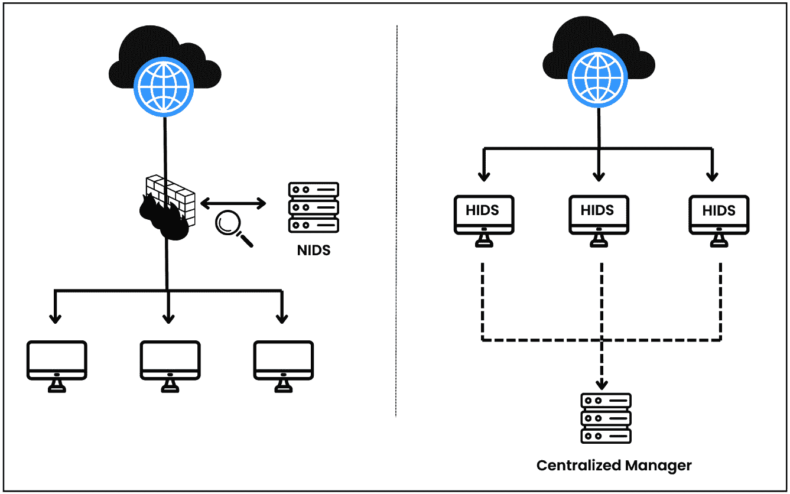

图 1.1 – NIDS 与 HIDS

# 什么是 Suricata？

**Suricata** 是一个开源网络 **入侵检测与防御系统**（**IDS/IPS**）。它旨在监控网络流量，并检测各种威胁，包括恶意软件、入侵尝试和网络异常。使用基于规则的语言，Suricata 实时分析网络数据包，使其能够识别并响应可疑或恶意活动。非营利组织 **OISF**（**开放信息安全基金会**）拥有并开发 Suricata。

Suricata 也可以作为 IPS 部署，以便检测和阻止恶意流量进入组织。虽然部署 IPS 听起来是显而易见的选择，但不幸的是，它并不那么友好；如果配置不当，它往往也会阻止合法流量。是的，这就是为什么有时检测方法比预防方法更好的原因。

你可以通过以下链接下载 Suricata：[`suricata.io/download/`](https://suricata.io/download/)。

Suricata IDS 有多种用例；以下是一些重要的用例：

+   **网络流量监控**：Suricata 分析实时网络流量以检测威胁和异常。组织需要在网络中的各个关键点智能部署 Suricata，以分析进出的流量。这种用例可以帮助我们检测恶意软件、**分布式拒绝服务**（**DDoS**）攻击、端口扫描、侦察数据外泄等。

+   **签名和异常检测**：Suricata 通过检查网络流量与已设置的规则和模式库匹配来检测已知的攻击模式或签名。在本章中，我们将使用**Emerging Threats**（**ET**）社区创建的 Suricata 规则集。该规则集可以帮助我们检测已知的恶意软件、病毒、基于 Web 的攻击（SQL 注入、跨站脚本攻击等）、已知的网络攻击签名等。

+   **协议分析**：Suricata 可以深入检查诸如 HTTP、DNS 和 TLS 等多种网络技术。这有助于我们发现协议的异常行为，例如不寻常的 HTTP 请求、DNS 隧道和意外的 SSL/TLS 握手。

+   **日志记录和警报**：Suricata 保留日志并在检测到可能的威胁时发送警报。这些警报可用于促使安全团队立即采取行动，或者被添加到**安全信息与事件管理**（**SIEM**）系统中，以便进一步分析并与其他安全事件关联。Wazuh、Splunk、Elastic 等所有流行的 SIEM 解决方案均支持与 Suricata IDS 的集成。

让我们了解一下 Suricata IDS 的部署方法。

## 组织如何将 Suricata 用作 IDS

有几种部署 Suricata IDS 的方式，以下是一些重要和流行的部署方法：

+   **网络周界的内联部署**：Suricata 位于外部互联网连接与内部网络之间，实时监控和审查网络流量。它可以作为物理设备或**虚拟机**（**VM**）部署。网络流量经过 Suricata 分析数据包，并根据已定义的标准采取行动。


+   **内部网络监控**：Suricata 传感器被战略性地放置在内部网络中，以捕获各个段或部门之间的网络流量。这些传感器可以是物理设备或虚拟设备。它们分析捕获的流量，并将警报或记录传输到集中管理系统进行进一步分析和响应。正如您在以下图表中看到的那样，传感器将数据导出到一个集中服务器。

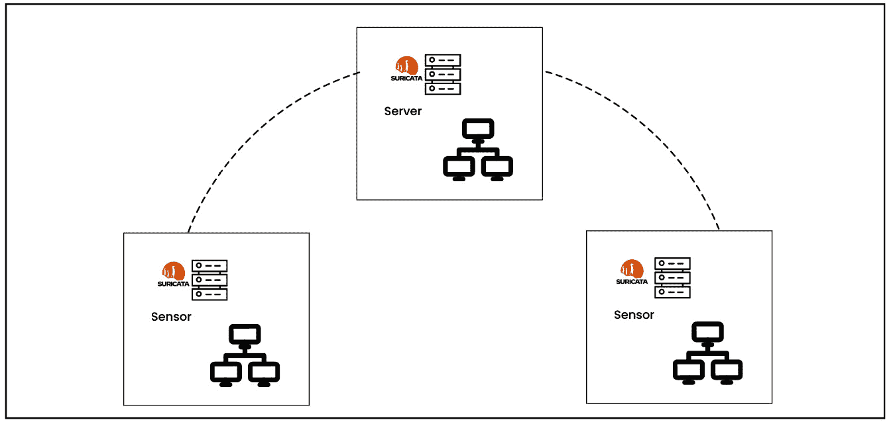

图 1.3 – 内部网络监控

+   **云环境监控**：Suricata 可以部署为虚拟设备或容器在 AWS 和 Azure 云环境中。它安装在云基础设施内部，监控虚拟网络和云资源之间的网络流量。捕获的流量被传输到中央分析系统进行响应检测。


图 1.4 – 云安全监控 (AWS)

+   **网络抓包部署**：Suricata 与 **网络抓包** 或 **端口镜像** 结合使用。抓包设备被战略性地放置在关键的网络节点上，捕获网络流量的副本，然后将其发送到 Suricata 进行分析。这种部署确保了准确和全面的网络活动可见性。


图 1.5 – 网络抓包部署

我们已经了解了不同的 Suricata 部署方法。在下一节中，我们将学习 Wazuh，它的核心组件和部署方法，然后我们将学习如何在 Ubuntu 服务器上安装 Suricata IDS。

# 开始使用 Wazuh 和 Suricata

Wazuh 是一个提供 **扩展检测和响应** (**XDR**) 和 SIEM 功能的开源安全监控平台。Wazuh 的功能包括日志分析、入侵检测、漏洞检测和实时警报，帮助组织增强其安全姿态并有效应对威胁。在本节中，我们将首先对 Wazuh 平台及其核心组件和部署方法进行基本了解，然后设置 Wazuh 代理并与 Wazuh 平台连接。接下来，我们将设置 Suricata IDS 并与 Wazuh 代理集成。我们将探讨的一些主要点包括：

+   Wazuh 的核心组件

+   Wazuh 的部署选项

+   Wazuh 的核心功能

+   Wazuh 模块

+   Wazuh 管理

+   安装 Wazuh 服务器

+   安装 Wazuh 代理

+   在 Ubuntu 服务器上安装 Suricata

+   设置 Windows Server 上的 Suricata

## Wazuh 的核心组件

Wazuh 提供了一个集中式平台，用于跨组织的 IT 基础设施监控和管理安全事件。Wazuh 收集、分析并连接来自不同来源（如终端点、网络设备、防火墙、代理服务器和云实例）的日志数据。一旦日志被收集，Wazuh 提供多种功能给安全团队，如文件完整性监控、恶意软件检测、漏洞检测、命令监控、系统清单、威胁狩猎、安全配置评估和事件响应。Wazuh 解决方案由三个主要部分组成：Wazuh 服务器、Wazuh 索引器和 Wazuh 仪表板。Wazuh 代理安装在需要监控的终端上。

### Wazuh 服务器

这个中央组件也用于管理代理并分析从它们那里接收到的数据：

+   它从多个来源收集日志，如主机、网络设备、防火墙、代理服务器和 syslog 服务器。

+   将收集的日志和事件标准化，并统一格式化以进行分析和关联。它利用 Wazuh 解码器解析日志，并以统一格式展示日志。

+   Wazuh 服务器能够整合来自多个数据源的日志，如 syslog、Windows 事件日志、Windows Sysmon、Docker 日志、Palo Alto 防火墙日志和 Check Point 防火墙日志。

+   Wazuh 服务器还提供了一个 API 供交互使用，允许远程服务器或系统进行交互和查询，例如，查询活动的 Wazuh 代理数量、漏洞信息、Wazuh 规则验证等。

### Wazuh 索引器

它负责索引和存储由 Wazuh 服务器生成的警报：

+   Wazuh 索引器存储由 Wazuh 服务器发送的警报，并作为主要存储库。

+   它被设计用来处理大量的安全警报，确保随着系统的增长，存储和索引的工作能够正常进行。

注意

索引是将数据整理和安排的过程，以实现有效且快速的检索。它涉及创建一个称为**索引**的数据结构。

+   Wazuh 索引器提供强大的搜索功能，使得可以通过特定的标准或模式快速而全面地搜索保存的警报。

+   Wazuh 索引器使用四个索引模式来存储数据：

    +   `wazuh-alerts-*`：这是由 Wazuh 服务器生成的警报的索引模式。

    +   `wazuharchives-*`：这是所有发送到 Wazuh 服务器的事件的索引模式。

    +   `wazuh-monitoring-*`：此模式用于监控 Wazuh 代理的状态。

    +   `wazuh-statistics-*`：用于关于 Wazuh 服务器的统计信息。

### Wazuh 仪表板

Wazuh 仪表板是一个 Web 界面，允许你进行可视化和分析。它还允许你创建规则、监控事件、监控合规性（如 PCI DSS、GDPR、CIS、HIPPA 和 NIST 800-53）、检测漏洞应用程序等。

### Wazuh 代理

Wazuh 代理安装在如服务器、桌面、笔记本电脑、云计算实例或虚拟机等端点上。Wazuh 使用 OSSEC HIDS 模块收集所有端点事件。

注意

OSSEC 是一个流行的开源**基于主机的 IDS**（**HIDS**）。它是一个强大的关联和分析模块，集成了日志分析、文件完整性监控、Windows 注册表监控、集中策略执行、Rootkit 检测、实时警报和主动响应等功能。它可以安装在大多数**操作系统**（**OS**）上，如 Linux、OpenBSD、FreeBSD、MacOS 和 Windows。Wazuh 部署选项

Wazuh 以其全面监控安全性和检测威胁的能力而闻名。它还提供了多种灵活的部署选项。根据您的需求，您可以在本地服务器、云环境、Docker 容器、Kubernetes 或其他环境中部署 Wazuh。对于生产环境，Wazuh 核心组件（即 Wazuh 服务器、Wazuh 索引器和 Wazuh 仪表盘）应以集群模式进行安装。集群模式部署涉及设置多个 Wazuh 服务器节点进行协同工作。通过在集群中的多个节点之间分配工作和任务，该配置旨在提高速度、可扩展性和弹性。接下来，我们将介绍一些重要的部署选项：

+   **服务器**：将 Wazuh 部署在专用服务器上可以提供更强大的性能，并让您根据自己的系统进行相应的修改。您可以使用本地服务器或云实例。请记住，您需要多个服务器实例来以集群模式部署 Wazuh。

+   **VM 镜像**：Wazuh 为您提供了一个已经设置好的 **Open Virtual Appliance**（**OVA**）格式的虚拟机镜像。您可以直接将其导入 VirtualBox 或任何其他支持 OVA 文件的虚拟化软件中。此选项仅适用于实验室用途。您可以使用此部署选项测试本书中提到的所有场景。请从以下链接下载 OVA 文件：[`documentation.wazuh.com/current/deployment-options/virtual-machine/virtual-machine.html`](https://documentation.wazuh.com/current/deployment-options/virtual-machine/virtual-machine.html)。

+   **Docker 容器**：Docker 是一个开放平台，用于在隔离的软件容器内构建和运行应用程序。Docker 容器是快速且轻松地在独立环境中设置 Wazuh 组件的最佳方式。此选项通常用于测试、开发，或需要快速搭建和拆卸的场景。您可以从以下链接下载 Docker 镜像：[`hub.docker.com/u/wazuh`](https://hub.docker.com/u/wazuh)。

+   **在 Kubernetes 上部署**：Kubernetes 是一个开源的容器编排平台。当您管理多个容器的大规模部署时，可以选择此方法。此方法提供更高的可扩展性、自动化部署和资源优化。您可以通过以下链接查看 Wazuh Kubernetes 仓库：[`github.com/wazuh/wazuh-kubernetes`](https://github.com/wazuh/wazuh-kubernetes)。

如果您想测试本书中的所有用例，建议您通过下载 OVA 文件使用 Wazuh VM 部署选项；然而，对于生产级部署，您可以选择其他任何部署选项。Wazuh 社区在文档编写方面做得非常出色，您可以参考以下链接获取逐步帮助：[`documentation.wazuh.com/current/installation-guide/index.html`](https://documentation.wazuh.com/current/installation-guide/index.html)。

## Wazuh 模块

Wazuh 拥有一套模块，它们协同工作，帮助组织处理安全事件、发现威胁、确保遵循规则，并保护系统和数据的安全。一旦访问 Wazuh 管理器，最上方的选项是 **模块**。默认情况下，您可以找到多个模块，这些模块按照下图所示的四个部分进行分类：

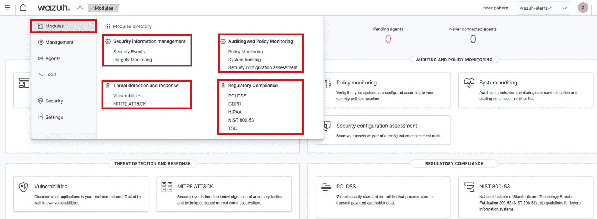

图 1.6 – 默认 Wazuh 模块

让我们详细了解一下这四个部分：

+   **安全信息管理**：这一部分包含 **安全事件** 和 **完整性监控** 模块。安全警报将根据预定义的 Wazuh 规则为已识别的安全事件触发并显示。完整性监控模块监控对关键系统文件和目录的任何未经授权的更改。

+   **威胁检测与响应**：默认情况下，这一部分有两个模块：**漏洞** 和 **MITRE ATT&CK®**。不过，您也可以添加 Osquery、VirusTotal 等。**漏洞** 模块识别并跟踪系统或软件中已知的漏洞。**MITRE ATT&CK** 模块将检测到的威胁或事件映射到 **MITRE** **ATT&CK** 框架。

注意

**ATT&CK** 代表 **对抗性战术、技术和常识**。**MITRE** 是一个由政府资助的研究机构，位于马萨诸塞州贝德福德和弗吉尼亚州麦克林。MITRE ATT&CK 是一个框架，帮助组织使用攻击者的战术、技术和程序来测试他们的安全控制。

+   **审计与政策监控**：这一部分包含三个模块：**政策监控** 模块、**系统审计** 模块和 **安全配置** **评估** 模块。

    +   **政策监控** 模块监控系统，确保安全策略得到妥善建立。

    +   **系统审计** 模块跟踪和审计使用活动，包括登录尝试、文件访问和终端的权限变更。

    +   **安全配置评估** 模块是一个非常流行的功能，它检查系统配置是否符合最佳实践或预定义的安全标准。Wazuh 利用 CIS 基准来进行大多数安全配置检查。

注意

**互联网安全中心** (**CIS**) 基准是一套全球知名的最佳实践，基于共识。它们旨在帮助安全专业人员设置和管理他们的网络安全防御。

+   **合规性监管**：这一部分包含多个模块，包括 PCI DSS 合规性、GDPR、HIPPA、NIST 800-53 和 TSC 模块。Wazuh 规则根据这些合规性创建并标记。当其中的任何规则被触发时，我们会看到警报。这就是如何将安全合规性与 Wazuh 对接的方式。

接下来，我们来谈谈 Wazuh 管理部分，在这里我们将讨论 Wazuh 管理器的一些核心功能。

## Wazuh 管理

在 Wazuh 仪表盘的**管理**部分下，我们有**管理**部分。如下面的示意图所示，**管理**部分包括**规则**、**解码器**、**CDB 列表**、**组**和**配置**等功能。

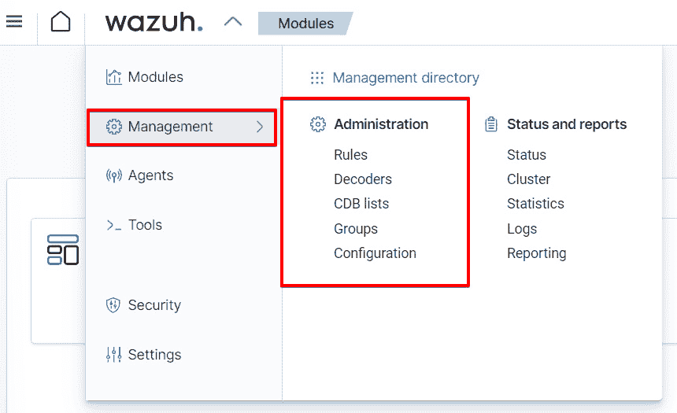

图 1.7 – Wazuh 管理

在**管理**选项卡下提到的所有功能都在确保 Wazuh 平台在实时监控和威胁检测中的有效性方面发挥着至关重要的作用。我们将在接下来的部分中详细了解每个功能。

### 解码器

**解码器**负责读取传入的日志条目，提取重要信息，并将其转换为 Wazuh 系统可以轻松理解和分析的标准格式。原始日志条目可以是不同的格式，如 syslog、JSON、XML 或自定义文本格式。解码器的任务是弄清楚这些日志是如何构成的，并提取有意义的字段和值。Wazuh 中有许多预构建的解码器，例如 syslog 解码器、OpenSSH 解码器、Suricata 解码器和 Cisco ASA 解码器。为了理解解码器是什么以及它们是如何工作的，我们来看一下 Barracuda **Web 应用防火墙**（**WAF**）的日志是如何处理的：

```
<decoder name="barracuda-svf1">
    <parent>barracuda-svf-email</parent>
    <prematch>^\S+[\S+]|</prematch>
    <prematch>^\S+</prematch>
    <regex>^\S+[(\S+)] (\d+-\w+-\w+) \d+ \d+ |</regex>
    <regex>^(\S+) (\d+-\w+-\w+) \d+ \d+ </regex>
    <order>srcip, id</order>
</decoder>
```

让我们分解一下这个 Wazuh 解码器的部分：

+   `decoder name`：这表示解码器的名称。

+   `parent`：这给出了父解码器的名称。父解码器会在子解码器之前处理。

+   `prematch`：这就像一个必须匹配的条件，以应用该解码器。它使用正则表达式来查找匹配项。

+   `regex`：这表示用于提取数据的正则表达式。在前面的解码器中，我们有两个`regex`实例。

+   `order`：这表示提取的信息或值将存储的字段列表。

解码器有许多其他可用的配置选项。访问*解码器语法*页面（[`documentation.wazuh.com/current/user-manual/ruleset/ruleset-xml-syntax/decoders.html`](https://documentation.wazuh.com/current/user-manual/ruleset/ruleset-xml-syntax/decoders.html)）以查看所有可用选项。

### 规则

Wazuh 规则帮助系统在早期阶段检测到攻击，如入侵、软件滥用、配置问题、应用程序错误、恶意软件、rootkit、系统异常和安全策略违规。Wazuh 提供了几个预构建的规则和解码器，但也允许您添加自定义规则。让我们来看一个 Wazuh 规则的示例：

```
<rule id="200101" level="1">
    <if_sid>60009</if_sid>
    <field name="win.system.providerName">^PowerShell$</field>
    <mitre>
      <id>T1086</id>
    </mitre>
    <options>no_full_log</options>
    <group>windows_powershell,</group>
    <description>Powershell Information EventLog</description>
  </rule>
```

让我们分解一下这段代码：

+   `rule id`：这表示 Wazuh 规则的唯一标识符。

+   `level`：规则的分类级别介于 0 和 15 之间。根据 Wazuh 文档中的规则分类页面（[`documentation.wazuh.com/current/user-manual/ruleset/rules-classification.html`](https://documentation.wazuh.com/current/user-manual/ruleset/rules-classification.html)），每个数字表示一个独特的值和严重性。

+   `if_sid`：这指定了另一个规则的 ID（在我们的例子中是`60009`），它触发当前规则。“if”条件被视为必须首先检查的“父”规则。

+   `field name`：这指定了从解码器中提取的字段名称。该值通过正则表达式进行匹配。在本例中，我们查找字段名称为`win.system.providerName`，其值为`PowerShell`。

+   `group`：用于组织 Wazuh 规则。它包含规则所属类别的列表。我们已经将规则组织到 `windows_powershell` 组中。

Wazuh 规则有很多其他选项。我建议你查看 Wazuh 文档中的 *规则语法* 页面，链接如下：[`documentation.wazuh.com/current/user-manual/ruleset/ruleset-xml-syntax/rules.html`](https://documentation.wazuh.com/current/user-manual/ruleset/ruleset-xml-syntax/rules.html)。

### CDB 列表

**常量数据库**（**CDB**）列表使得根据 IP 地址和域名的特征进行分类和管理。这些列表可以包括已知的恶意 IP 地址、可疑域名、受信任的 IP 地址、白名单域名等。管理员通过根据声誉或风险等级添加或删除条目来维护这些列表。要了解更多关于 CDB 列表的信息，可以访问官方 Wazuh 文档中的 CDB 列表： [`documentation.wazuh.com/current/user-manual/ruleset/cdb-list.html`](https://documentation.wazuh.com/current/user-manual/ruleset/cdb-list.html)。

### 组

可以根据操作系统或功能使用组来对代理进行分组；例如，所有 Windows 代理可以被分为一个名为“Windows Agents”的组。这在你想一次性将配置更改从 Wazuh 管理器推送到所有 Windows 代理时非常有用。这变成了一个简单的单步解决方案。要了解更多关于分组代理的信息，你可以访问官方 Wazuh 文档： [`documentation.wazuh.com/current/user-manual/agents/grouping-agents.html`](https://documentation.wazuh.com/current/user-manual/agents/grouping-agents.html)。

### 配置

这帮助安全团队精细调整 Wazuh 的主要配置，如集群配置、警报和输出管理、日志数据分析、云安全、漏洞、库存数据、主动响应、命令、Docker 监听器和监控（Amazon S3、Azure 日志、Google Cloud、GitHub、Office 365 等）。所有这些功能甚至可以通过命令行选项进行自定义。你需要在 Wazuh 管理器或 Wazuh 代理的 `/var/ossec/etc` 目录中找到 `ossec.conf` 文件。

现在，让我们开始在 Ubuntu 机器上部署 Wazuh 代理，然后在同一台机器上安装 Suricata。

## 安装 Wazuh 服务器

Wazuh 服务器是 Wazuh 安全平台的核心组件。它由两个重要元素组成：Wazuh 管理器和 Filebeat。Wazuh 管理器收集并分析来自 Wazuh 代理的数据，当检测到任何威胁时，它会触发警报。Filebeat 将警报和事件转发到 Wazuh 索引器。Wazuh 服务器可以通过多种方式安装，但我建议在生产环境中使用多节点集群方法，在实验环境中使用虚拟机方法。你可以在以下章节中找到这两种方法的指导。

### 适用于生产环境

为了在生产环境中设置 Wazuh，建议将 Wazuh 服务器和 Wazuh 索引器部署在不同的主机上。这有助于处理来自大量终端的流量，并实现高可用性。安装 Wazuh 服务器、索引器和仪表板的逐步指南请参考此处：[`documentation.wazuh.com/current/installation-guide/index.html`](https://documentation.wazuh.com/current/installation-guide/index.html)。

### 适用于实验环境

你可以使用 Wazuh VM OVA 文件作为实验环境，因为它部署起来非常简单。所有 Wazuh 组件，包括 Wazuh 服务器、索引器和仪表板都是统一的。使用 OVA 文件安装 Wazuh，按照以下步骤进行：

1.  **下载 OVA 文件**：首先从官方 Wazuh 网站下载 Wazuh OVA 文件：[`documentation.wazuh.com/current/deployment-options/virtual-machine/virtual-machine.html`](https://documentation.wazuh.com/current/deployment-options/virtual-machine/virtual-machine.html)。

1.  **导入 OVA 文件**：使用你喜欢的虚拟化平台（例如 VMware Workstation、VirtualBox 等），导入下载的 OVA 文件。

1.  **配置虚拟机设置**：在启动虚拟机之前，根据需要调整虚拟机设置：

    +   **CPU** **核心数**：4

    +   **内存**：8 GB

    +   **存储**：50 GB

1.  **访问 Wazuh Web 界面**：你可以启动虚拟机。接着，使用虚拟机的 IP 地址打开浏览器，并输入默认的用户名和密码，如图所示。

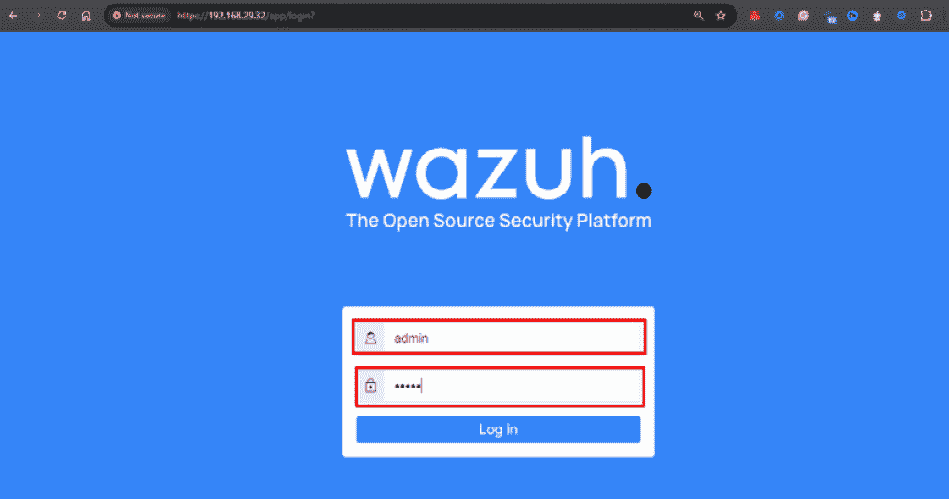

图 1.8 – 访问 Wazuh Web 界面

你需要输入以下内容：

+   用户名：`admin`

+   密码：`admin`

## 安装 Wazuh 代理

一个 Wazuh 代理兼容多个操作系统。一旦安装 Wazuh 代理，它将与 Wazuh 服务器通信，实时推送信息和系统日志，使用加密通道。

### 在 Ubuntu Server 上安装 Wazuh 代理

要在 Ubuntu Server 上部署 Wazuh 代理，你需要安装代理并配置部署变量。要开始安装，你需要登录到 Wazuh 仪表盘，导航到**Agents**，点击**Deploy an agent**，然后按照以下步骤操作：

1.  **选择操作系统、版本和架构**：如以下图所示，导航到**LINUX**框并选择适合 AMD 架构的**DEB amd64**或适合 ARM 架构的**DEB aarch64**。

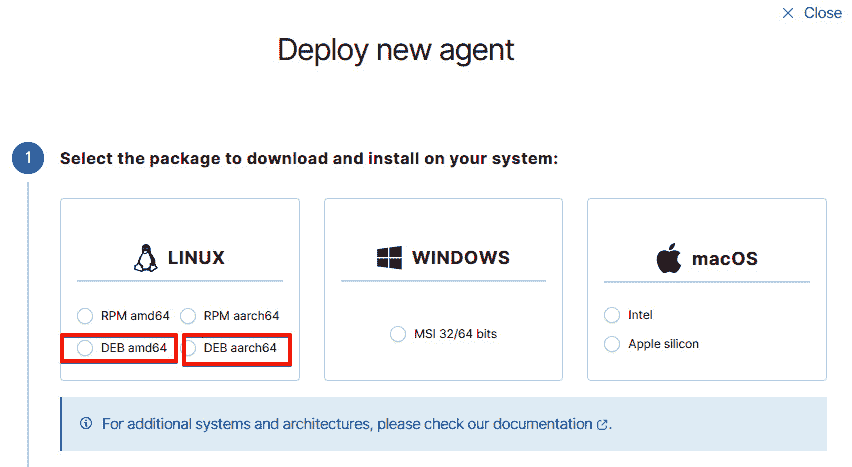

图 1.9 – 部署新代理

1.  **输入服务器地址和其他可选设置**：输入 Wazuh 服务器地址和代理名称，并选择代理组。请确保在添加新代理之前已创建所需的代理组。

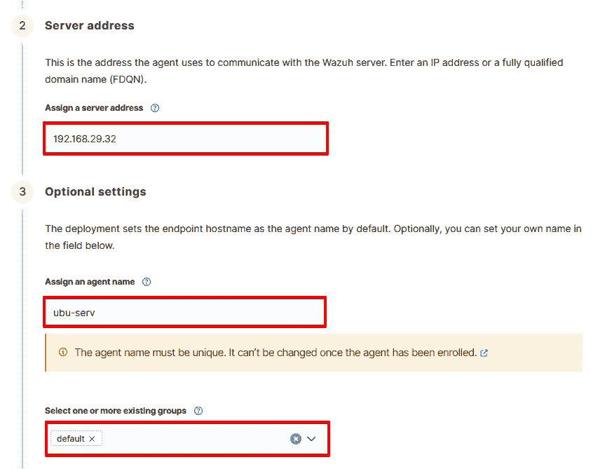

图 1.10 – 选择服务器地址和可选设置

让我们来拆解一下我们输入的内容：

+   `192.168.29.32`：这是 Wazuh 服务器的 IP 地址。

+   `ubu-serv`：这表示 Wazuh 代理的名称。

+   `default`：它代表 Wazuh 代理组。

1.  使用`curl`命令下载 Wazuh 模块并启动 Wazuh 代理服务，如以下图所示。


图 1.11 – 获取下载并安装 Wazuh 代理的命令

注意

请确保没有防火墙规则阻止代理与 Wazuh 管理器之间的通信。代理应该能够通过配置的端口（默认是`1514`/`514`用于 syslog）与管理器通信。

最后，你可以通过登录到 Wazuh 管理器并导航到**Agents**来验证代理是否已连接并激活。

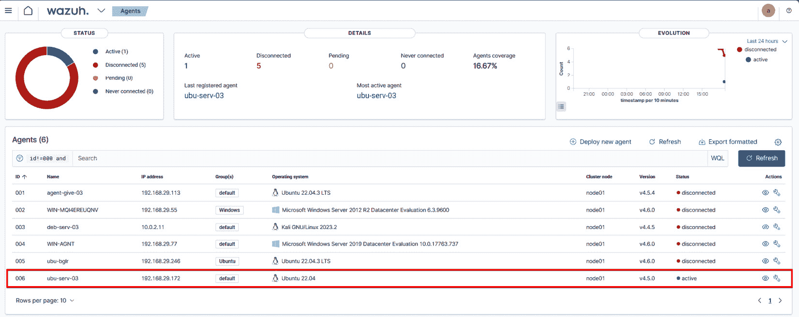

图 1.12 – 可视化 Wazuh 代理

如你在前面的图中所见，`ubu-serv-03`代理已连接至以下内容：

+   `006`

+   `192.168.29.172`

+   **组**：**default**

+   **操作系统**：**Ubuntu 22.04**

+   **状态**：**active**

现在，让我们在 Windows Server 上安装 Wazuh 代理。Windows 桌面的安装过程也是一样的。

### 在 Windows Server 上安装 Wazuh 代理

你可以通过使用**命令行界面**（**CLI**）或**图形用户界面**（**GUI**）来监控 Windows Server 或桌面上的实时事件，前提是你已经登录到 Wazuh 服务器。要开始安装，你需要登录到 Wazuh 仪表盘，导航到**Agents**，点击**Deploy an agent**，然后按照以下步骤操作：

1.  **选择操作系统、版本和架构**：如下面的图示所示，导航到 **WINDOWS** 框，选择 **MSI 32/64 位** 包，然后输入 Wazuh 服务器的 IP 地址。

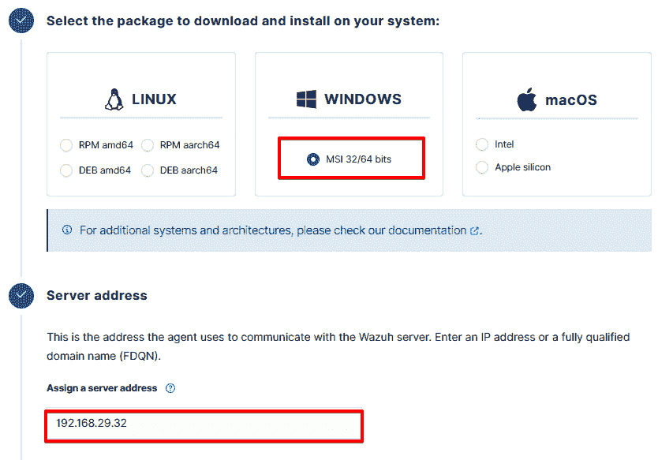

图 1.13 – 选择 Windows 版 Wazuh 代理

1.  **输入服务器地址和其他可选设置**：输入 Wazuh 服务器地址和代理名称，并选择组。请确保在添加任何新代理之前，已创建所需的代理组。

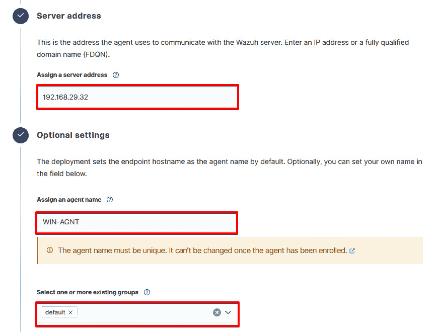

图 1.14 – 输入服务器地址和可选设置

1.  **下载包并启用服务**：复制 PowerShell 命令以下载 Wazuh 模块并启动 Wazuh 代理服务，如下图所示。以下命令需要在 Windows PowerShell 终端中输入。

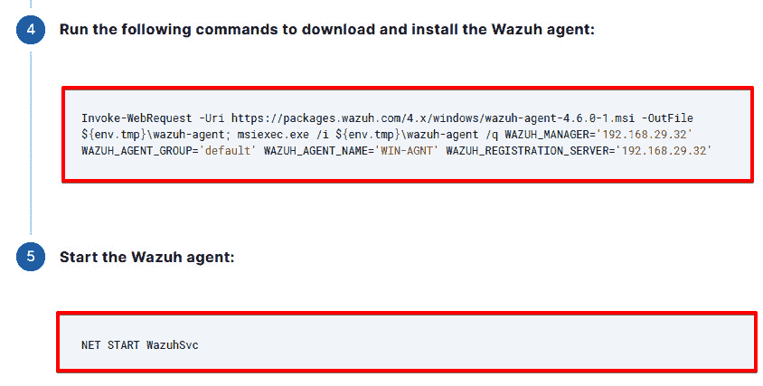

图 1.15 – 获取用于下载和安装 Wazuh 代理的命令，在 Windows 机器上执行

最后，你可以通过登录 Wazuh 管理器并导航到 **Agents** 来验证代理是否已连接并激活。

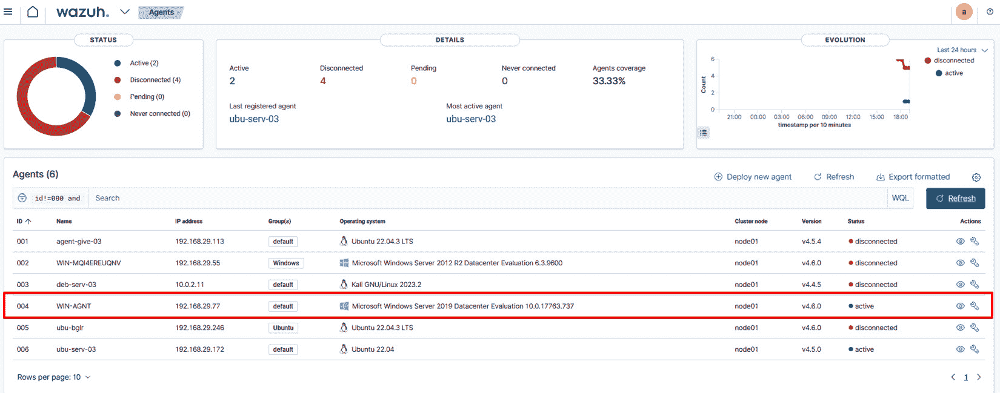

图 1.16 – 可视化安装在 Windows 机器上的 Wazuh 代理

如前面的图示所示，`WIN-AGNT` 代理连接如下：

+   `004`

+   `192.168.29.77`

+   **组**：**默认**

+   **操作系统**：**Microsoft Windows Server 2019 数据中心版** **评估版 10.0.17763.737**

+   **状态**：**激活**

我们已经成功学习了如何在 Ubuntu 服务器和 Windows 服务器上部署 Wazuh 代理。在接下来的章节中，我们将学习如何在 Ubuntu 服务器上设置 Suricata IDS。

## 在 Ubuntu 服务器上安装 Suricata

通过实时检测恶意或可疑活动，Suricata 是一个 NSM 工具，具有作为 IPS/IDS 工作的潜力。它的目标是阻止入侵、恶意软件和其他类型的恶意行为利用网络。在本节中，我们将学习如何在 Ubuntu 服务器上安装 Suricata。首先让我们了解一下前提条件。

### 前提条件

在 Ubuntu 服务器上安装 Suricata IDS 的前提条件如下：

+   你需要安装 Ubuntu Server（版本 20.04 或更高版本）

+   Sudo 权限

### 安装

此过程涉及使用 `apt-get` 命令行工具安装 Suricata 包，然后我们需要安装由 ET 社区创建的免费开源 Suricata 规则。ET 规则集中包含广泛的威胁类别，包括恶意软件、漏洞利用、政策违反、异常、僵尸网络等。完成安装的步骤如下：

1.  **安装 Suricata**：登录到 Ubuntu 服务器的终端，并使用以下命令安装 Suricata IDS 包：

    ```
    sudo add-apt-repository ppa:oisf/suricata-stable
    sudo apt-get update
    /etc/suricata/rules directory:

    ```

    cd /tmp/ && curl -LO https://rules.emergingthreats.net/open/suricata-6.0.8/emerging.rules.tar.gz

    sudo tar -xvzf emerging.rules.tar.gz && sudo mv rules/*.rules /etc/suricata/rules/

    sudo chmod 640 /etc/suricata/rules/*.rules

    ```

    ```

注意

如果规则目录不存在，您可以使用`mkdir /etc/suricata/`命令创建一个目录，然后输入前面提到的命令。

1.  `/etc/suricata/suricata.yaml`：

    ```
    HOME_NET: "<AGENT_IP>"
    EXTERNAL_NET: "any"
    default-rule-path: /etc/suricata/rules
    rule-files:
    - "*.rules"
    # Linux high speed capture support
    af-packet:
    HOME_NET: This is a variable that needs to be set with the agent IP address.
    ```

1.  `EXTERNAL_NET`：此变量需要设置为`"any"`，以确保 Suricata 监控来自任何外部 IP 地址的流量。

1.  `default-rule-path`：这是我们 Suricata 规则的路径设置。

1.  `af-packet`：这是一种数据包捕获方法，用于直接从 `ifconfig` 命令捕获网络流量，并更新 `af-packet` 设置。

1.  **重启 Suricata 服务**：为了使配置更改生效，我们需要使用以下命令重启 Suricata 服务：

    ```
    ossec config file located at /var/ossec/etc/ossec.conf. Suricata stores all the logs at /var/log/suricata/eve.json. You are required to mention this file under the <location> tag in the ossec.conf file:

    ```

    <ossec_config>

    <localfile>

    <log_format>json</log_format>

    <location>/var/log/suricata/eve.json</location>

    </localfile>

    </ossec_config>

    ```

    ```

1.  **重启 Wazuh 代理服务**：为了使当前的更改生效，您需要使用以下命令重启 Wazuh 代理服务：

    ```
    $ sudo systemctl restart wazuh-agent
    ```

这完成了 Suricata 与 Wazuh 的集成。Suricata IDS 已经在 Ubuntu 服务器上安装，并附带了 ET 规则集。如果匹配任何 ET 规则集中的恶意流量，您的终端设备将触发警报。在进入一些实际的用例之前，让我们首先基本了解 Suricata 规则以及如何创建规则。

# 理解 Suricata 规则

当你有一套强大的规则时，Suricata 的威力会更强大。尽管网上有成千上万的 Suricata 规则模板可用，但学习如何从零开始创建自定义的 Suricata 规则仍然很重要。在本节中，我们将学习基本的 Suricata 规则语法以及一些常见的攻击和防御用例。

## Suricata 规则语法

Suricata 使用规则来检测不同的网络事件，当某些条件满足时，它可以被配置为执行例如警报或阻止等操作。

下面是 Suricata 规则语法的概述：

```
action proto src_ip src_port -> dest_ip dest_port (msg:"Alert message"; content:"string"; sid:12345;)
```

让我们来分解这段代码：

+   `action`：这表示当规则成立时应该执行的操作。可以是`alert`（发送警报）、`drop`（停止流量）或其他支持的操作。

+   `proto`：这表示匹配的流量类型，如 `tcp`、`udp` 和 `icmp`。

+   `src_ip`：这是源 IP 地址或源 IP 地址范围，表示流量来自哪里。

+   `src_port`：这是源端口或源端口范围，表示流量来自哪里。

+   `dest_ip`：这是目标 IP 地址或目标 IP 地址范围，表示流量将去往哪里。

+   `dest_port`：这是目标端口或目标端口范围，表示流量将去往哪个端口。

+   `msg`：当规则成立时，显示为警报的消息。

+   `content`：这是一个可选字段，用于检查数据包负载中是否包含某个字符串或内容。

现在，基于我们当前的 Suricata 配置，我们有 `$HOME_NET` 和 `$EXTERNAL_NET` 网络变量。让我们通过一个示例规则来了解如何检测 SSH 连接：

```
alert tcp $EXTERNAL_NET any -> $HOME_NET 22 (msg:"SSH connection detected"; flow:to_server,established; content:"SSH-2.0-OpenSSH"; sid:100001;)
```

让我们来解析一下：

+   `alert`：该规则指定当满足指定条件时应生成警报。

+   `tcp`：这指的是基于 **传输通信协议**（**TCP**）的流量。

+   `$EXTERNAL_NET any -> $HOME_NET 22`：流量流向通过将流量从任何外部网络 IP 地址（`$EXTERNAL_NET`）定向到任何主机或本地网络 IP（`$HOME_NET`），并通过端口 `22`（SSH）进行传输。

+   `(msg:"检测到 SSH 连接";)`：这指定了要添加到警报中的详细信息消息。它表明该规则已经识别到了一个 SSH 连接。

+   `flow:to_server,established`：这定义了触发规则的流量方向。它正在寻找服务器（本地网络）与服务器（外部网络）之间的已建立连接。此规则部分可防止初始连接尝试生成警报。

+   `content:"SSH-2.0-OpenSSH"`：这部分会检查数据包的负载中是否包含特定字符串（`"SSH-2.0-OpenSSH"`）。它搜索流量负载中的此特定字符串，表示使用了 OpenSSH 协议和 SSH 协议。

+   `sid:100001`：这是某个规则的唯一标识符。

现在我们已经学习了如何创建一些基本的 Suricata 规则，接下来让我们了解一些结合 Wazuh 平台的 Suricata IDS 使用案例。

## 网络扫描探测攻击与检测

**网络扫描**是大多数黑客攻击的初始阶段，而最强大的工具就是**Nmap**扫描器。Nmap 是一款免费的开源 Linux 命令行工具。Nmap 帮助我们扫描任何主机以发现开放端口、软件版本、操作系统等。它被安全专业人员用于安全测试、网络探索和漏洞检测。威胁行为者也会进行网络扫描，以发现开放端口、软件版本或漏洞包。在这一部分，我们将使用 Nmap 工具对我们的 Wazuh 代理（运行 Suricata 服务）进行网络扫描探测。ET 规则集中已包含检测基于 Nmap 的扫描探测的规则。我们将通过此攻击场景来验证它。

我们将遵循以下章节中的内容：

+   实验环境设置

+   攻击模拟

+   在 Wazuh 管理器上可视化

### 实验环境设置

在此迷你实验环境中，我们需要三部分：一台攻击者机器（Kali Linux 或 Ubuntu），一台安装有 Wazuh 代理的 Ubuntu 或 Windows 机器，最后是我们的 Wazuh 服务器。如果您使用 Kali Linux 机器，Nmap 是预装的；但是，如果您使用 Ubuntu 机器，您可以使用 `sudo apt-get install` `nmap` 命令来安装 Nmap 软件包。

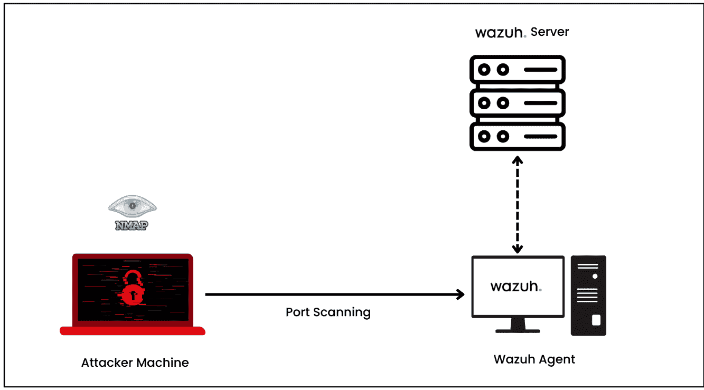

图 1.17 – 使用 Nmap 进行网络扫描探测的实验室设置

### 攻击模拟

如果你使用 Kali Linux 或 Ubuntu 作为攻击机器，可以打开终端并输入`nmap`命令，使用`-sS`关键字进行 SYN 扫描，并使用`-Pn`跳过主机发现。Nmap SYN 扫描是一种半开放扫描方式，通过向目标机器（Wazuh 代理）发送 TCP SYN 数据包来工作。如果端口开放，目标设备将响应一个`-sS`，并且，第二步，使用`-sV`（版本扫描）检查软件版本：

```
# nmap -sS -Pn 10.0.2.5\. // Port Scanning
# nmap -sS -sV -Pn 10.0.2.5 // Version Scanning
```

一旦运行上述命令，你将知道所有开放的端口，并且可以知道目标机器上安装的包的版本。让我们看看 Nmap 端口扫描命令的输出：

```
nmap -sS -Pn 10.0.2.5
Starting Nmap 7.94 ( https://nmap.org ) at 2023-12-10 02:53 IST
Nmap scan report for 10.0.2.5
Host is up (0.0037s latency).
Not shown: 998 closed tcp ports (reset)
PORT   STATE SERVICE
22/tcp open  ssh
80/tcp open  http
Nmap done: 1 IP address (1 host up) scanned in 1.45 seconds
```

如你所见，端口`22/tcp`和`80/tcp`的状态为开放。现在，让我们看看 Nmap 版本检查命令的输出：

```
nmap -sV -Pn 10.0.2.5
Starting Nmap 7.94 ( https://nmap.org ) at 2023-12-10 02:59 IST
Nmap scan report for 10.0.2.5
Host is up (0.0024s latency).
Not shown: 998 closed tcp ports (reset)
PORT   STATE SERVICE VERSION
22/tcp open  ssh     OpenSSH 8.9p1 Ubuntu 3ubuntu0.3 (Ubuntu Linux; protocol 2.0)
80/tcp open  http    Apache httpd 2.4.52 ((Ubuntu))
Service Info: OS: Linux; CPE: cpe:/o:linux:linux_kernel
Service detection performed. Please report any incorrect results at https://nmap.org/submit/ .
Nmap done: 1 IP address (1 host up) scanned in 7.59 seconds
```

从输出中，你可以看到`VERSION`列中，目标正在运行两个软件包：`OpenSSH 8.9`和版本为`2.4.52`的 Apache。

### 在 Wazuh 仪表板上可视化

要可视化 Suricata 警报，登录 Wazuh 管理器并导航到**安全事件**。接下来，选择代理。你将看到如图所示的安全警报。

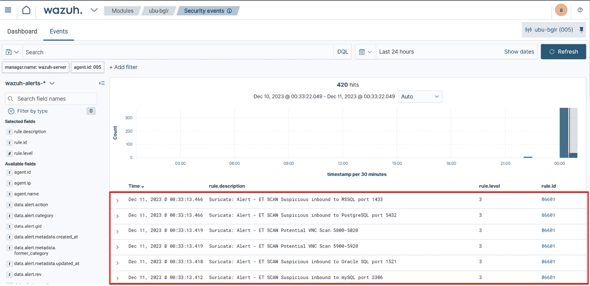

图 1.18 – 在 Wazuh 仪表板上可视化网络扫描探测

你也可以应用一个过滤器，使用`rule.group: suricata`。

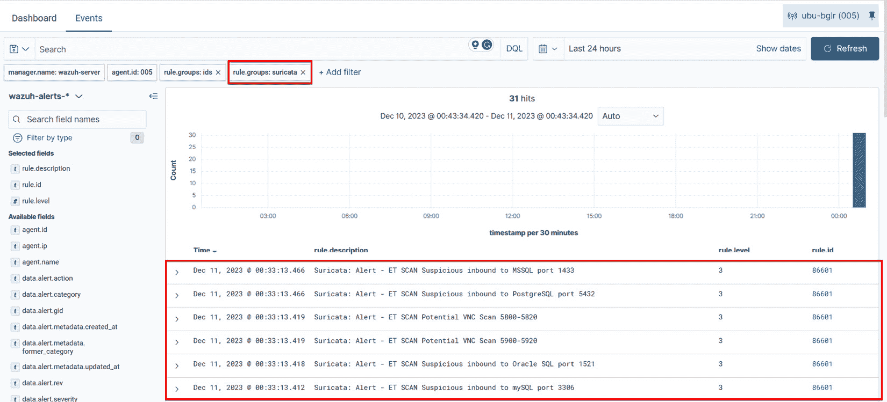

图 1.19 – 使用 Suricata 过滤器可视化网络扫描探测

让我们展开其中一个警报，如下所示。

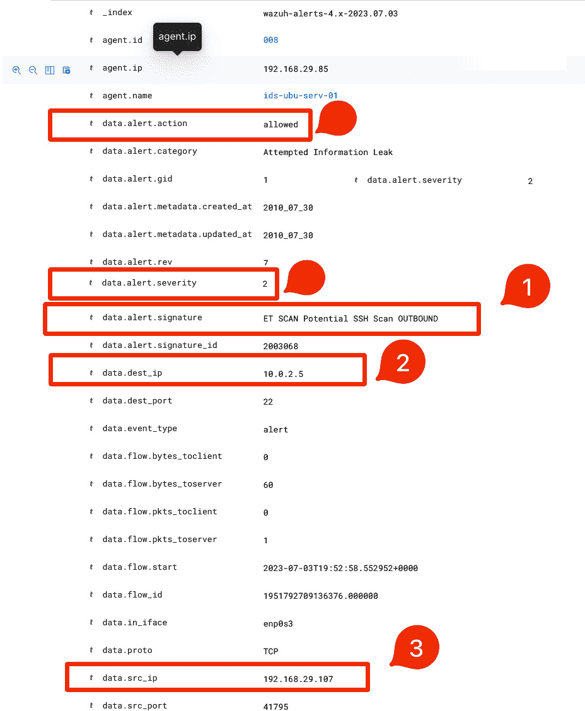

图 1.20 – ET SCAN 潜在 SSH 扫描外向警报

让我们分解以下内容：

+   `data.alert.signature`：此字段描述了检测到这种异常流量的`ET SCAN 潜在 SSH 扫描外向` Suricata 规则。`ET`代表 ET 规则集。

+   `data.dest_ip`：此字段提供受害者的 IP 地址。

+   `data.src_ip`：此字段提供攻击者的 IP 地址。

+   `data.alert.action`：此字段表示 Wazuh 在检测到安全事件后采取的行动。

+   `alerts.severity`：此字段表示 Wazuh 为安全事件分配的严重性级别。

这是 Suricata 如何检测网络扫描探测以及 Wazuh 如何在仪表板上可视化它的简单用例。在下一节中，我们将学习如何检测我们故意设置漏洞的应用程序 DVWA 上的基于 Web 的攻击。

# 使用 DVWA 测试基于 Web 的攻击

根据 CDNetworks 的报告，2022 年共检测并阻止了约 451.27 亿个 Web 应用程序攻击，相较于 2021 年增长了 96.35% ([`www.cdnetworks.com/news/state-of-waap-2022/`](https://www.cdnetworks.com/news/state-of-waap-2022/))。对 Web 应用程序的攻击已变得如此普遍，以至于它们现在成为数据泄露的主要原因。一些最常见的 Web 应用攻击类型包括**跨站脚本**（**XSS**）、DDoS、**跨站请求伪造**（**CSRF**）、**XML 外部实体**（**XXE**）和 SQL 注入。Suricata 结合 ET 规则集可以通过解析数据包有效载荷并检查 HTTP/HTTPS 协议头中的异常或异常流量模式来检测此类攻击。在这一部分中，我们将使用一个故意感染的 Web 应用程序——DVWA。DVWA 是一个基于 PHP 的应用程序，在渗透测试人员和道德黑客中非常受欢迎，因为它帮助他们实践安全漏洞和漏洞利用。我们将在以下小节中讨论这些内容：

+   实验环境设置

+   使用 DVWA 设置受害者服务器

+   测试 SQL 注入攻击

+   测试一个反射型 XSS 攻击

## 实验环境设置

在此实验环境设置中，我们需要四个部分：攻击者机器（Kali Linux 或 Ubuntu）、受害者服务器（DVWA 运行在 Debian 服务器上）、TAP 服务器（Wazuh 和 Suricata 代理运行在 Ubuntu 上）以及 Wazuh 服务器。实验设计如图所示：

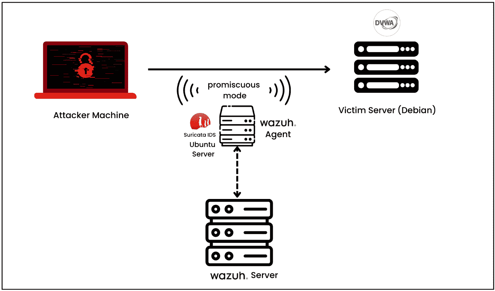

图 1.21 – 使用 Suricata 检测基于 Web 的攻击的实验环境设置

让我们进一步分解：

+   攻击者机器是 Kali Linux，但你也可以使用其他任何机器。

+   DVWA 应用程序已经安装在基于 Debian 的服务器上。

+   Ubuntu Server 部署在混杂模式下（网络设置），并运行 Suricata IDS 和 Wazuh 代理。混杂模式允许网络适配器拦截并读取它接收到的所有网络流量。

+   Wazuh 服务器以虚拟机（VM）形式部署。

## 使用 DVWA 设置受害者服务器

我们将在基于 Debian 的 Linux 发行版上安装 DVWA 应用程序。你可以从以下链接下载：[`www.debian.org/distrib/`](https://www.debian.org/distrib/)。我们的 DVWA 应用程序有一些依赖项，如`php`、`apache2` web 服务器和 MySQL 数据库：

1.  首先，使用以下命令安装所有组件：

    ```
    yes and then create a user and set its privileges:

    ```

    创建用户 'dvwa'@'localhost' 并设置密码为 'password'; 赋予 'dvwa'@'localhost' 在 dvwa.* 上的所有权限，命令如下：`CREATE USER 'dvwa'@'localhost' IDENTIFIED BY 'password'; GRANT ALL PRIVILEGES ON dvwa.* TO 'dvwa'@'localhost' IDENTIFIED BY 'password';`

    ```

    ```

+   接下来，安装 DVWA 应用程序。DVWA 的源代码可在 GitHub 上获取。你可以在`/var/www/html`目录下输入以下命令：

    ```
    cd /var/www/html
    sudo git clone <https://github.com/digininja/DVWA.git>
    /var/www/html/config directory. You will find the config.inc.php.dist file. Just make a copy of this file:

    ```

    config.inc.php 文件。将 db_user 更改为 dvwa，db_password 更改为 password。

    ```

    ```

    +   启动`mysql`服务：

    ```
    php file and go to /etc/php/x.x/apache2/ to open the php.ini file.
    ```

    +   搜索 `allow_url_include` 并设置为 **开启**。* 启动 DVWA。* 打开 DVWA，访问 [`localhost/DVWA/setup.php`](http://localhost/DVWA/setup.php)，然后重置数据库。* 现在，用默认凭据登录 DVWA：

    ```
    username: admin
    password: password
    ```

这完成了我们对 DVWA 应用程序的安装。接下来，我们可以开始从 Kali Linux 测试 DVWA 应用程序，针对 SQL 注入和 XSS 漏洞进行测试，如下一节所述。

## 测试 SQL 注入攻击

SQL 注入，或 **SQLi**，是一种网络攻击类型，恶意 SQL 代码被注入到应用程序中。这允许攻击者提取或修改数据库的内容。此攻击通过欺骗程序执行本不应执行的 SQL 命令来修改数据库。为了测试 DVWA 应用程序是否存在 SQL 注入漏洞，我们需要将恶意有效载荷直接插入到 HTTP 请求中：

```
http://<DVWA_IP_ADDRESS>/DVWA/vulnerabilities/sqli/?id=a' UNION SELECT "Hello","Hello Again";-- -&Submit=Submit
```

让我们逐步分析：

+   `UNION SELECT "Hello","Hello Again"`：`UNION SELECT` 语句用于将两个或多个 `SELECT` 查询的结果合并为一个结果集。在这种情况下，攻击者希望将自己的信息添加到查询结果中。`"Hello"` 和 `"Hello Again"` 是攻击者想要注入到查询结果中的文本信息。

+   `-- -`：这是 SQL 中的注释。该行后面的所有内容都被视为注释，并会被 SQL 处理器忽略。

+   `&Submit=Submit`：这一部分表明查询可能是表单提交的一部分，其中 `Submit` 参数与 `Submit` 值一起发送。

现在，让我们在 Wazuh 仪表板上查看相关的安全警报。


图 1.22 – 可视化 SQL 注入警报

当你展开单个安全警报时，你将看到有关警报、Suricata ET 规则以及类别的详细信息，如下图所示：

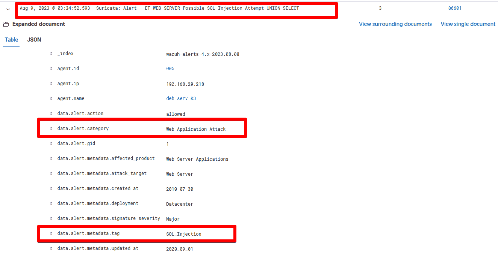

图 1.23 – Wazuh 仪表板上的 Suricata SQL 注入警报

让我们逐步分析：

+   `Suricata: Alert - ET WEB_SERVER Possible SQL Injection Attempt UNION SELECT`：这表示安全警报的名称。

+   `data.alert.category` `Web Application Attack`：这显示了规则在 Suricata ET 规则集中指定的类别

+   `Data.alert.metadata.tag: SQL_Injection`：这显示了 Suricata ET 规则集的元数据，用于 Web 应用攻击

当我们继续滚动警报信息时，我们将看到更多信息，如下图所示。

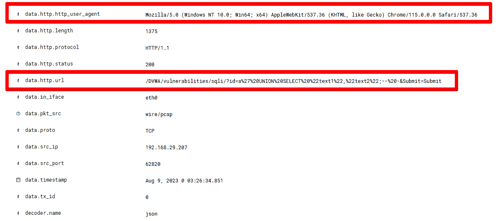

图 1.24 – Suricata 针对 SQL 注入的警报详细信息

让我们逐步分析：

+   `data.http.http.user_agent`：这表示发起攻击的浏览器信息

+   `data.http.url: /DVWA/vulnerabilities/sqli/?id=a%27%20UNION%20SELECT%20%22text1%22,%22text2%22;--%20-&Submit=Submit`：这表示 DVWA 的 URL 查询字符串，专门针对 SQL 注入漏洞。

现在，我们已经了解了如何使用 Suricata IDS 检测 SQL 注入攻击并在 Wazuh 仪表板上可视化它们。在接下来的章节中，我们将测试 DVWA 应用程序的 XSS 漏洞。然后，我们将检测并在 Wazuh 仪表板上可视化它们。

## 测试反射型 XSS 攻击

XSS 是一种代码注入攻击，目标是网站，并向用户的 web 浏览器发送恶意脚本进行执行。在**反射型 XSS**攻击中，攻击者将恶意脚本插入到网站或应用程序中，随后从 web 服务器将其反射到用户的浏览器。当用户向应用程序输入信息，且应用程序在没有足够清理或验证的情况下将其反射回用户时，就可能发生这种攻击。为了测试我们故意设计成易受攻击的应用程序 DVWA 是否存在反射型 XSS 漏洞，我们可以提交一段 JavaScript 代码，并验证它是否会反射数据回到我们的浏览器。

你可以打开 DVWA 应用程序并导航到**XSS（反射型）**标签。接下来，输入一段示例 JavaScript 代码，如下所示：

```
<script>alert("Hello");</script>
```

让我们分解一下：

+   `<script>标签`：这表示一段应该由浏览器执行的 JavaScript 代码。

+   `Alert("Hello")`：这是一个函数，它告诉浏览器在脚本执行时显示一个包含**Hello**文本的弹出框。

如下图所示，你可以输入 JavaScript 代码并点击**提交**按钮。

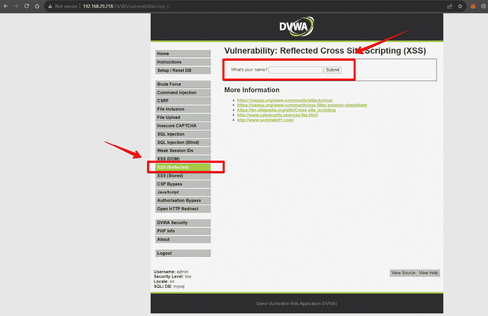

图 1.25 – 发起反射型 XSS 攻击在 DVWA 上

DVWA 应用程序没有对用户输入进行清理检查，使其容易受到反射型 XSS 攻击。因此，我们将看到**Hello**文本如以下图所示反射回我们的浏览器。


图 1.26 – 可视化 DVWA 上的反射型 XSS

所以，攻击成功了。让我们在 Wazuh 仪表板上可视化这个警报。导航到**安全警报**并选择代理。


图 1.27 – Suricata 针对 XSS 攻击的警报

让我们分解一下：

+   `Security Alert – ET WEB_SERVER Script tag in URI Cross Site Scripting Attempt`：这表示安全警报名称和签名名称。

+   `data.alert.category` `Web Application Attack`：这是基于 Suricata ET 规则集的警报类别。

+   `data.alert.metadata.tag` `Cross_Site_Scripting, XSS`：这表示安全警报的元数据。在我们的例子中，它是 `Cross_Site_Scripting` 和 `XSS`。

在这一部分，我们成功地在故意设计为易受攻击的应用程序 DVWA 上发起了 SQL 注入攻击和反射型 XSS 攻击。最后，我们通过 Suricata ET 规则检测到这些攻击，并在 Wazuh 仪表板上进行了可视化展示。

在下一部分中，我们将使用 tmNIDS 项目在 Ubuntu 机器上模拟多个攻击，并将其在 Wazuh 管理器上进行可视化展示。

# 使用 tmNIDS 测试 NIDS

**tmNIDS** 是一个由 *3CoreSec* 维护的 GitHub 项目。tmNIDS 是一个简单的框架，旨在测试 NIDS（如 Suricata 和 Snort）的检测能力。tmNIDS 中的测试旨在与 ET 社区兼容的规则集对齐。ET 社区构建并分享 Suricata 规则，以检测各种攻击，如基于 Web 的攻击、网络攻击和 DDoS 攻击。在这一部分，我们将学习如何使用 tmNIDS 模拟攻击，并将在 Wazuh 仪表板上进行可视化展示。我们将在以下小节中讨论这些内容：

+   实验设置

+   在 Ubuntu 服务器上安装 tmNIDS

+   测试恶意用户代理

+   测试 Tor 连接

+   一次性测试所有内容

## 实验设置

在这个实验设置中，我们有两个设备：一个是运行 Wazuh 代理、Suricata IDS 和 tmNIDS 的 Ubuntu 服务器，另一个是通过虚拟机 OVA 文件安装的 Wazuh 服务器。实验设计如下图所示。


图 1.28 – 使用 tmNIDS 测试 Suricata IDS 规则的实验设置

## 在 Ubuntu 服务器上安装 tmNIDS

tmNIDS 项目的源代码发布在 GitHub 上 ([`github.com/3CORESec/testmynids.org`](https://github.com/3CORESec/testmynids.org))。要安装 tmNIDS，我们可以运行 `curl` 命令来下载软件包：

```
curl –sSL https://raw.githubusercontent.com/3CORESec/testmynids.org/master/tmNIDS> -o /tmp/tmNIDS && chmod +x /tmp/tmNIDS && /tmp/tmNIDS
```

让我们来解析一下：

+   `curl`：这是一个工具，用于发起请求从特定的 URL 下载数据。

+   `-sSL`：在这里，`-s` 表示显示进度但不输出任何内容。`S` 标志会在 `curl` 遇到问题时显示错误，`L` 标志表示重定向。

+   `-o /tmp/tmNIDS`：这告诉 `curl` 将下载的文件保存在 `/tmp` 目录。

+   `chmod +x /tmp/tmNIDS`：它将下载的文件的权限更改为可执行。

一旦执行了该包，你将看到如下图所示的 12 个 Suricata IDS 测试。

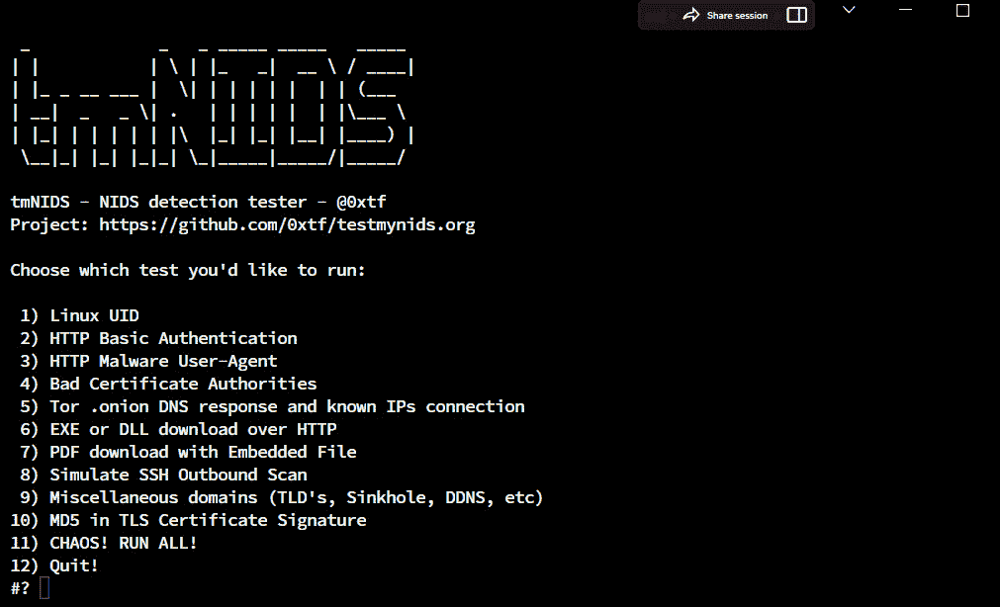

图 1.29 – 可视化 tmNIDS 检测测试器

现在，tmNIDS 已经准备好，我们可以开始对运行 Suricata IDS 的 Ubuntu 服务器进行多个攻击测试，详细内容将在接下来的部分中讲解。

## 测试恶意用户代理

在此场景中，我们将执行 tmNIDS 测试中的第 3 项，即 `HTTP 恶意软件用户代理`。每个 HTTP 请求都有一个 `User-Agent` 头部，描述了用户的浏览器、设备和操作系统。当一个 HTTP 网络浏览器向 Web 服务器发送请求时，它会插入此头部以向服务器标识自己。`User-Agent` 字符串通常包含诸如浏览器名称和版本、操作系统、设备类型以及有时的额外数据（如渲染引擎细节）。如果你使用 Google 开发者模式仔细查看 HTTP 头部，你会发现 `User-Agent` 信息：

```
User-Agent: Mozilla/5.0 (Windows NT 10.0; Win64; x64) AppleWebKit/537.36 (KHTML, like Gecko) Chrome/96.0.4664.45 Safari/537.36
```

该 `User-Agent` 字符串表示浏览器运行在一个 Windows 10 64 位系统上，使用的是 Chrome 浏览器（版本 `96.0.4664.45`），其渲染引擎与 WebKit（Safari）和 Gecko（Firefox）都相关联。

要测试 Ubuntu 服务器（运行 Suricata IDS）对 `HTTP 恶意用户代理测试`，请在 `tmNIDS` 提示符下输入 `3`。

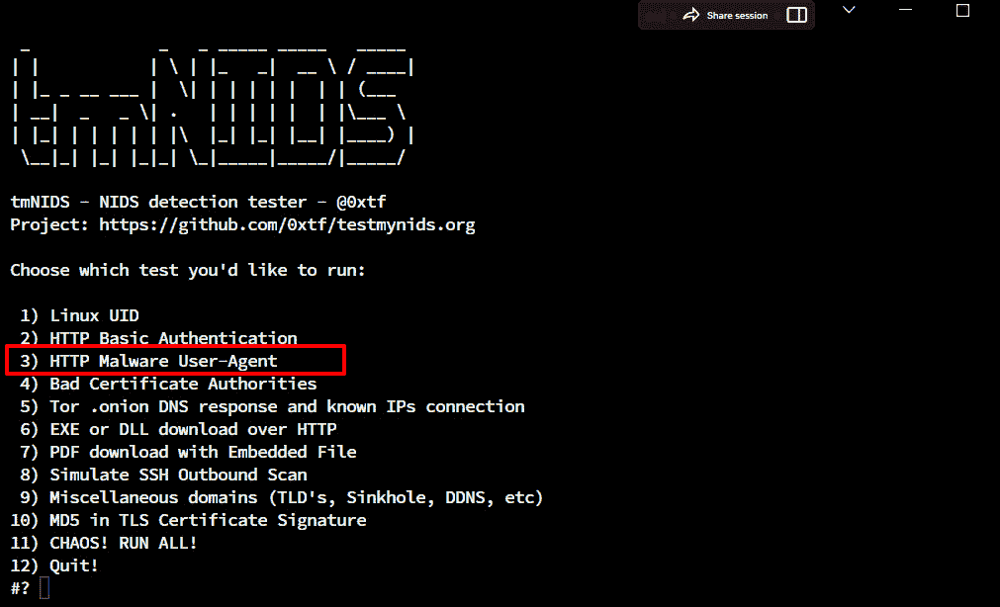

图 1.30 – 从 tmNIDS 检测测试器中选择选项 3

现在，让我们在 Wazuh 仪表盘上可视化警报。你可以导航到 **安全警报** 模块并选择终端节点。你可以找到如下图所示的警报。

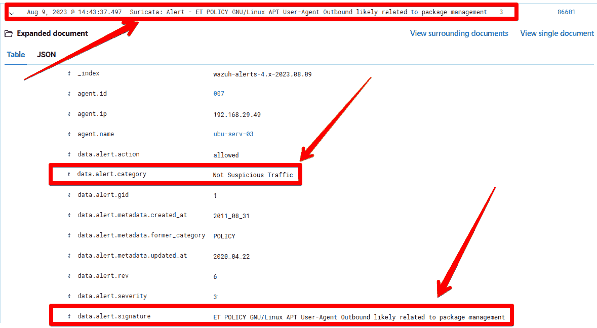

图 1.31 – Suricata 对可疑 User-Agent 的警报

让我们分解一下以下内容：

+   `Suricata: Alert – ET POLICY GNU/LINUX APT User-Agent Outbound likely to package management`：这表示 **安全警报** 的名称和签名。

+   `data.alert.category : Not Suspicious Traffic`：这表示 ET 规则集的类别。

+   `data.alert.signature : ET POLICY GNU/Linux APT User-Agent Outbound likely related to package management`：这表示可能与 APT 相关的出站网络活动，可能与软件包管理有关。

在成功测试 `HTTP 恶意用户代理` 并在 Wazuh 仪表盘上可视化警报后，我们将在下一部分测试 Tor 连接。

## 测试 Tor 连接

在这个场景中，我们将执行测试 5，即 `Tor`。**Tor** 是一个去中心化的匿名网络，用户可以利用它私密且安全地浏览互联网。然而，它也常被黑客、恶意行为者和网络犯罪分子用来访问暗网，销售被盗数据和非法商品。它的匿名功能能保护攻击者的身份，使政府难以追踪他们的行动，因此，对于每个组织来说，阻止来自 Tor 服务的任何流量都显得尤为重要。最受欢迎的 Tor 应用程序是 **Tor Browser**。当任何人通过 Tor Browser 访问网站时，流量会经过代理节点，这使得任何人都难以拦截。从网络安全的角度来看，我们可以列出这些节点的 IP 地址，并最终将其封锁，或者根据其签名来封锁基于 Tor 的应用程序。

要测试这个场景，请返回 tmNIDS 提示并输入 `5`。Tor 攻击将在我们运行 Suricata IDS 的 Ubuntu 服务器上执行。

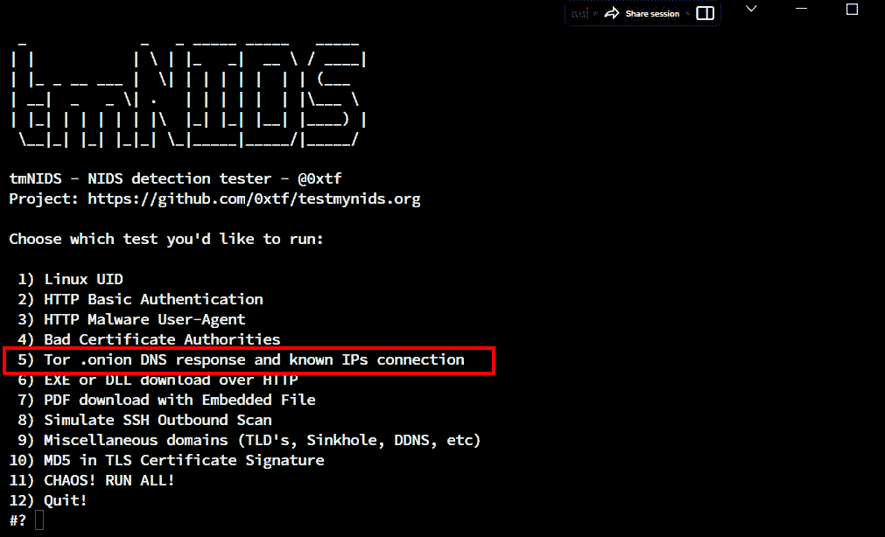

图 1.32 – 从 tmNIDS 检测测试器中选择选项 5

要可视化警报，请导航到 Wazuh 的 **安全警报** 模块，并检查以下图示中显示的相关警报。


图 1.33 – Suricata 针对 Tor 隐藏流量的警报

这两者都已被 Suricata ET 规则集检测到。以下是两个规则描述：

+   `Suricata: 警报 - ET 政策 DNS 查询 TOR 隐藏域 .onion 可通过 TOR 访问`

+   `Suricata: 警报 - ET 恶意软件 Cryptowall .onion` `代理域`

我们已经成功测试了 Tor .onion DNS 响应测试，并在 Wazuh 管理器上可视化了警报。在接下来的部分中，我们将一次性运行所有测试并可视化警报。

## 一次性测试所有内容

现在，这就像是一把不停发射的步枪。你基本上是一次性启动所有测试。首先，在 tmNIDS 测试提示下输入 `11`，并监控 Wazuh 管理器上的事件。

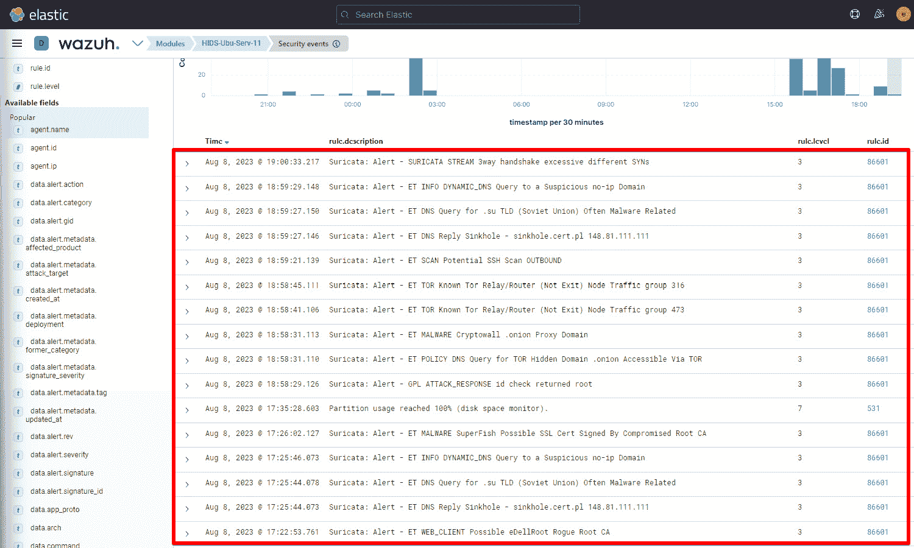

图 1.34 – Suricata 针对所有 tmNIDS 测试的警报

如你所见，我们收到了针对 tmNIDS 检测测试器中列出的所有测试的警报。这表明我们的 Suricata IDS 与 ET 规则集对于 tmNIDS 项目发起的攻击是有效的。

# 总结

在本章中，我们了解了 Wazuh 及其与 Suricata IDS 的集成，以有效检测异常流量行为。我们首先探索了 Suricata IDS 及其部署方式。然后，我们介绍了 Wazuh 的设置、Suricata 规则的配置，以及使用 DVWA 进行的实际威胁检测。接着，我们了解了如何使用 tmNIDS 测试器测试 Suricata 规则集。

在下一章中，我们将学习 Wazuh 平台的不同恶意软件检测能力。我们还将探索第三方集成，以便检测高级恶意软件文件和特征。
