### 数字取证与事件响应过程

到目前为止，我们主要研究了云原生工具，用于调查人员查看日志和进行分析。在接下来的章节中，我们将介绍一些补充云原生工具的第三方工具——这些工具可以帮助收集和分析取证证据，结合云原生和第三方工具集，每个调查人员在处理云取证案件之前都应该熟悉。具体而言，本章将重温数字取证和事件响应过程的基础知识。我们还将介绍一些核心概念，并介绍我们通常在云取证案件中使用的工具。

本章我们将学习以下内容：

+   事件响应过程的基础

+   常用的主机和内存取证工具与技术

+   执行实时取证的选项

+   网络取证

+   恶意软件分析复习

+   传统取证与云取证

本章假设你已经熟悉大多数这些主题；这只是对常见的事件响应技术和工具的复习，这些工具通常在案件中使用。

# 事件响应过程的基础

事件响应过程是一个全面的流程，它允许调查人员以结构化的方式处理事件响应案件。事件响应过程中的七个阶段使调查人员能够理解每个阶段所需的行动。以下图示概述了事件响应过程中的关键步骤：

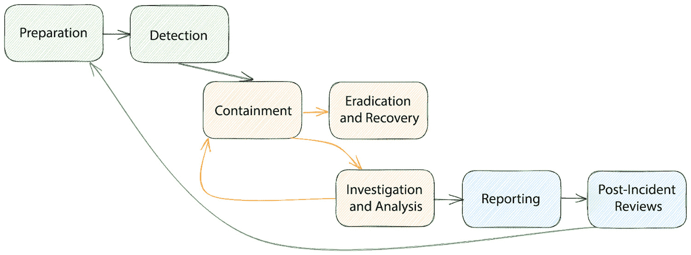

图 8.1 – 事件响应过程

这里是关键阶段：

+   **准备阶段**：这是事件前的阶段，组织与事件响应团队合作，记录并规划在事件发生时的活动。通常，组织会建立其处理事件的目标，并通过**事件响应计划**的形式，解决事件引发的关键网络安全问题。

    事件响应计划通常包括事件发生期间各个行动的角色和责任、需要通知的关键利益相关者等内容。事件响应计划还会包括组织在处理多个事件时的目标。一旦计划被文档化，组织会定期开展演练，以便进行训练、测试，并定期更新其计划。

+   **检测**：此阶段明确指的是安全团队利用工具识别事件的过程。通常，这将是组织的**安全事件和事件监控**（**SIEM**）工具或其**终端检测与响应**（**EDR**）工具。这些工具由专门的团队进行监控，以提供有关事件发生的早期警告。组织会设置常规的安全监控和警报系统，以便立即识别漏洞或事件。这也是安全团队一旦收到通知，必须对事件进行分类的阶段。**分类**是指**数字取证与事件响应**（**DFIR**）团队评估漏洞、漏洞的范围以及由此带来的影响，并决定是否需要进一步调查的过程。这是安全团队将漏洞识别为**事件**的步骤。

注意

安全团队需要正确界定事件的范围，识别有多少系统受到影响，漏洞传播的规模大小等等；否则，调查中可能会缺少关键元素。

+   **遏制**：在安全团队确认发生了事件并重新组织各安全团队后，典型的第一步是遏制事件。想象一下一个水管爆裂，水流如洪水般涌出；你的第一步行动就是在修复之前先堵住漏水点。在网络安全事件的情况下，第一步总是先遏制漏洞或泄露，接着确定发生了什么，事件是如何发生的，等等。安全团队可以部署特定的安全工具来遏制事件，或者使用已经在组织 IT 环境中部署的工具。

    示例包括断开主机与网络的连接、使用 EDR 工具对主机进行网络隔离，以及关闭某些服务（不允许用户访问）。这一阶段也是安全团队必须在证据被消除之前保存任何证据的阶段。我们在*第二章*中学习了证据保存及其在调查和潜在法律行动中的重要性。在大多数情况下，缺乏保存证据能力的组织通常依赖提供 DFIR 服务的第三方专业人员。

+   **根除与恢复**：在我们看来，根除与恢复以及调查与分析阶段是并行进行的，前提是必要的法医证据已经被保存。在根除与恢复阶段，事件响应团队与组织内的其他安全团队或授权的第三方协作，以修复事件。这可能包括配置更改、打补丁或从备份或零起点重新构建整个系统。修复完成后，这些系统将恢复正常运行。

+   **调查与分析**：一旦事件不再进一步升级，调查团队将接手案件。调查团队负责分析发生了什么；这包括审查日志和取证证据，了解事件是如何发生的，哪些数据受到影响，损害的程度等。这一阶段还为检测、根除和恢复阶段提供输入，以便发现任何相关事件并采取额外的补救措施或进行安全加固，确保恢复活动的顺利进行。通常，在这一阶段，调查团队会识别事件的根本原因。在事件响应术语中，我们称之为**零号病人**。调查团队将利用威胁情报来识别威胁行为者、他们的动机，并识别可能指向其他调查方向的**入侵指示器**（**IoCs**）。

+   **报告**：一旦调查结束，关键事实被确定，并且根本原因已经明确，调查团队进入报告阶段。理想情况下，事件报告会涵盖所有事件的各个方面、审查过的证据、事件发生的时间线、已执行的操作等内容。报告完成后，将会发送给各相关利益相关者。根据事件的性质和严重程度，事件报告可能只会与有限的群体共享，有时还包括一个突破教练（外部法律顾问），以支持和帮助组织应对由事件引发的潜在诉讼风险。

+   **事后回顾**：一旦一切处理完毕，组织恢复到正常运营阶段，组织和安全团队通常会进行一次总结，或者称为事后回顾。安全团队会回顾在事件发生期间及之后准备的文档和调查笔记，并识别出在检测或缓解此类事件再次发生的过程中存在的程序性漏洞。安全团队会根据他们从处理此次事件中获得的经验教训，更新其事件响应计划。

在建立了事件响应过程的基本方面之后，让我们深入探讨在数字取证调查中使用的实际工具和技术。这些工具在揭示数字证据、分析易失性内存、剖析文件系统以及拼凑事件时间线方面发挥着至关重要的作用。

# 数字取证调查的工具和技术

在任何事件调查中，获取证据并以取证合规的方式快速完成是一个挑战。在某些情况下，调查人员可能需要收集证据以进一步调查事件并确定根本原因。快速收集证据和相关材料对于调查至关重要。本节将探讨一些在调查中有价值的主机和内存证据。

## 先决条件

在调查人员开始从云控制台收集日志之前，我们可以利用上一章节中探讨的一些先决条件（启用日志、审计轨迹等），以及此处列出的条件。这些先决条件将帮助调查人员更加顺利地进行事件响应工作：

+   **实例保护**：一些云服务提供商在事件声明后允许对实例进行保护。例如，在 AWS 中，你可以配置实例以防止其被终止。这样可以确保在实例关闭后你不会终止或删除实例，并且所有的证据和相关的卷都会被保存供调查使用。调查人员甚至可以应用标签作为视觉标记，提醒安全管理员不要更改或更新其配置。

+   **停用**：在可能的情况下，将实例从自动扩展组中取消注册并停用。

+   **隔离实例**：在可能的情况下，如果有必要，调查人员应更新主机防火墙（云服务提供商的防火墙），以限制流量仅限于外部 IP 和端口。调查人员可以通过云控制台访问实例，而无需从互联网连接。

+   **盘点相关卷**：当事件被声明时，且调查人员已确定实例后，需盘点附加到主机的卷，因为可能需要为所有连接的卷创建快照。

+   **在隔离实验室中重建**：如果情况需要，根据调查线索，调查人员应考虑制作实例的副本或快照，然后在云中托管的专用隔离取证实验室中重新启动该实例，以捕获必要的证据。

## 云主机取证

主机取证或数字取证涉及收集、处理、分析和保存基于主机的数字证据。它要求发现通常无法通过安全工具获取的证据、痕迹和信息，并且这些信息通常对普通用户是隐藏的。主机取证在网络安全和执法调查中起着至关重要的作用，提供了有关攻击者或用户采取的某些行动、活动时间线等的洞察。它在知识产权盗窃、数据泄露、恶意软件感染和内部威胁等案件中非常有用，并且在勒索软件案件中也得到了广泛应用。

认识到本书是为 DFIR 专业人员编写的，我们将探讨调查人员可以在高水平上执行的各种取证元素。我们还将花时间识别在调查过程中可能有用的关键工件来源。收集来自云实例的工件类似；工件和事件日志在部署模型中是一致的。因此，数据中心中部署的物理主机与运行在云上的主机之间没有区别。

### 关键工件来源

我们想了解一些在调查中有时可以参考的关键工件来源。这些来源通常提供证据，揭示用户或威胁行为者（调查对象）在系统中可能执行的活动。通过查询这些工件存储库，你将了解威胁行为者以及操作系统在用户操作计算系统时通常保留的大量信息。

然而，请注意，随着每次 Windows、Linux 或任何其他操作系统的迭代，工件或工件存储库本身收集的信息可能会发生变化，或者可能不再可用。务必注意操作系统的版本，包括主版本和次版本，以便为调查人员做好准备，了解给定版本可用的工件。

在下一小节中，我们将研究两个重要且常用的操作系统，这些操作系统通常用于服务器和 IT 基础设施环境。你还将在云中看到类似的部署（无论云提供商如何）。

#### Windows 操作系统

Windows 是最受欢迎的操作系统之一，它收集了大量可以在调查中非常有帮助的工件。以下是 Windows 通常记录的工件存储库列表。然而，如前所述，根据操作系统的主要版本和次要版本，某些工件可能会出现在不同的文件夹路径中，或不再可用。请注意，以下日志并非详尽无遗，第三方工具可能会收集额外的记录和工件，这些对于调查可能至关重要：

+   `C:\Windows\System32\Tasks\*`：包含与任务调度程序相关的 XML 文件，记录了任务定义、任务作者、触发条件以及任何任务定制。它们是根据特定条件或时间触发的自动化进程。威胁行为者使用任务调度程序隐藏并规避检测，同时保持持久性。在一些遗留系统中，你可能还会看到与任务调度程序相关的文件，创建在 `C:\Windows\Tasks\*` 下。

+   `C:\Windows\Prefetch\*`：Prefetch 是 Windows 的一项功能，允许应用程序通过预加载常用的数据文件和库来优化加载时间。它提供了法医证据或证明，表明某个应用程序曾被执行过，包括是否有任何代码或脚本在应用程序中被注入（例如，通过 PowerShell 执行代码）。当一个应用程序第一次执行时，它会创建一个预取文件，记录所有可以在执行前从磁盘加载到内存中的文件和库。Prefetch 包括诸如可执行文件名、执行次数和次数等信息。

+   `C:\Windows\System32\winevt\Logs\*`：Windows 事件日志是每个调查员最需要查看的日志来源。不同类别的日志有专门的日志文件，用于记录相关事件。以下是一些重要的日志文件：

    +   `Security.evtx`：登录/注销、目标主机名和 IP 地址、备用用户名、登录会话 ID 和登录类型。

    +   `System.evtx`：Windows 系统的启动/关闭时间、服务安装、驱动程序故障/安装、硬件更改以及任何与系统相关的活动。

    +   `Windows PowerShell.evtx`：PowerShell 脚本执行和 cmdlet 调用，通常与`Microsoft-Windows-WinRM%4Operational.evtx`一起核对，用于获取远程会话身份验证和会话信息，及与`Microsoft-Windows-PowerShell%4Operational.evtx`一起核对，用于获取脚本块日志。

    +   `Microsoft-Windows-PowerShell%4Operational.evtx`：记录 PowerShell 执行的详细信息，包括脚本块、模块加载和脚本策略。

    +   `Microsoft-Windows-TerminalServices-RDPClient%4Operational.evtx`：`Security.evtx`。

    +   `Microsoft-Windows-TerminalServices-RemoteConnectionManager%4Operational.evtx`：RDP 源 IP 地址和用户名的证据（证明横向移动发生的位置）。这可以与`Microsoft-Windows-TerminalServices-LocalSessionManager%4Operational.evtx`、`Microsoft-Windows-RemoteDesktopServices-RdpCoreTS%4Operational.evtx`和`Security.evtx`进行核对。

    +   `Microsoft-Windows-TaskScheduler%4Operational.evtx`：关于计划任务执行、创建和注册的信息，并与`Security.evtx`核对，以提供管理员权限使用的证据。

    +   `Microsoft-Windows-WMI-Activity%4Operational.evtx`：`Microsoft-Windows-WinRM%4Operational.evtx`：`C:\Windows\System32\Logfiles\W3SVC1\*`：包含关于`C:\Windows\appcompat\Programs\Amcache.hve`的信息：`Amcache.hve`记录应用程序的安装和执行情况。它包括完整的应用程序元数据和可执行文件的 SHA1 哈希值。

    +   `C:\Windows\System32\config\SAM`：Windows 的`SAM`数据库及在主机上创建的任何本地帐户。访问`SAM`数据库需要提升权限，威胁行为者通常会尝试攻击`SAM`数据库，以窃取凭证并利用其进行其他形式的攻击。

    +   `C:\Windows\System32\config\SOFTWARE`：这是一个重要的注册表文件，用于收集关于系统状态、已安装软件以及 Windows 各种其他配置元素的信息。调查人员可以使用`SOFTWARE`注册表文件调查是否安装、修改或删除了未经授权的软件。调查人员还可以识别是否修改了任何核心元素，例如启动程序（以保持持久性）、系统配置（以降低防御）等。

    +   `C:\Windows\System32\config\SECURITY`：`SECURITY`注册表文件负责记录与操作系统安全相关的所有配置。这包括用户帐户、关联的帐户组、密码哈希、注册表项的权限以及安全策略。调查人员可以分析这个注册表文件，以重建威胁行为者、未经授权的用户活动和安全策略违规行为。与`SAM`数据库类似，`SECURITY`文件也受到 Windows 操作系统内核的保护，需要提升权限才能进行修改。

    +   `C:\Windows\System32\config\*.LOG1`：`LOG1`文件是一个事务日志文件，确保相关注册表文件（包括`SOFTWARE`、`SAM`和`SECURITY`）的完整性。当系统配置发生更改时，更改会被写入相关的事务日志`LOG1`文件，并且当更改被提交到注册表文件时，事务日志会标记为已完成。

+   `C:\Users\*\AppData\Roaming\Microsoft\Windows\PowerShell\PSReadline\ConsoleHost_history.txt`：提供用户在 PowerShell 控制台执行命令的历史记录。

+   `C:\Users\*\NTUser.DAT`：Windows 会自动为每个用户创建一个`NTUser.DAT`文件，包含关于用户特定配置或偏好、用户与各种应用程序的交互、采取的行动以及最近访问的资源的信息。

+   `C:\Users\*\NTUser.DAT.LOG1`：类似于注册表文件，这个事务日志文件记录所有事务（更改），在将更改提交到`NTUser.DAT`文件之前。调查人员可以利用该日志文件进一步关联用户活动。

+   `%SYSTEMDRIVE%\$Recycle.Bin\**`：`%SYSTEMDRIVE%`指的是根驱动器分区的命名方式，其中包含`RecycleBin`文件夹。该文件夹包含所有标记为删除的文件和子文件夹。调查人员可以利用这一点来确定用户或威胁行为者是否尝试删除任何文件。*   `%SYSTEMDRIVE%\$LogFile`：`$LogFile`是与文件系统相关的特殊 Windows 文件，特别是`$LogFile`记录元数据，以及目录和文件的创建、修改和删除。调查人员可以解析`$LogFile`来识别系统随时间变化的变动，并获取允许从文件存储中恢复与调查相关的信息。*   `%SYSTEMDRIVE%\$MFT`：指的是 NTFS 文件系统的**主文件表**（**MFT**）。它提供与文件和目录相关的元数据，包括时间戳、文件大小以及目录与文件之间的关系。调查人员可以使用 MFT 来重建与文件系统变化相关的事件顺序。

#### Linux 操作系统

鉴于大多数 Linux 生态系统是开源的，并且在各个行业领域中得到广泛应用，包括在云中的应用，Linux 为调查人员提供了极大的取证价值。在收集 Linux 的取证证据或执行实时取证时，应该优先考虑以下证据：

+   `/etc/passwd`：一个纯文本文件，包含诸如**用户名**、**用户 ID**（**UID**）、**组 ID**（**GID**）、**主目录路径**和**默认** **Shell**应用程序等信息。

+   `/etc/group`：与`/etc/passwd`文件类似，它存储有关系统中用户组的信息。

+   `/etc/crontab`：Cron 是一个作业调度程序，它按照预定义的时间表自动执行命令或脚本。威胁行为者可以利用 Cron 作业在环境中维持持久性。

+   `/etc/fstab`：包含有关文件系统、驱动器和分区的信息，包括设备如何在启动时挂载。

+   `/etc/rc.d/**`：包含服务的启动和关闭脚本。威胁行为者可以利用该目录保持持久性并避免检测。

+   `/etc/init.d/**`：类似于`/etc/rc.d/**`，该目录包含**初始化** **脚本**或系统服务的初始化脚本。威胁行为者可以利用该目录在系统初始化过程中注入恶意脚本。

+   `/etc/systemd.d/**`：包含用于初始化脚本的额外配置。它还允许您覆盖或扩展脚本的范围和服务。

+   `/var/log/**`：该目录包含由系统进程和应用程序生成的事件日志文件，具有重要的价值。

+   `/home/<username>/*`：主目录是用户的目录（在`/etc/passwd`中定义），允许用户存储文件、配置和用户特定数据。

+   `/home/*/.ssh/known_hosts`：包含用户之前使用过的远程服务器的公钥列表，提供关于通过 SSH 连接这些远程服务器的尝试的证据。

+   `/home/*/.ssh/authorized_keys`：它包含了允许通过公钥认证进行远程访问的公钥列表。当用户想要使用基于 SSH 密钥的认证登录远程服务器时，他们的公钥会被添加到服务器上的 `authorized_keys` 文件中。

### 其他证据/元数据

一旦我们收集了特定于主机的证据，调查云实例的调查人员还应收集 **实例元数据**，包括实例配置、IP 地址分配、VPC 子网分配、策略配置等。

如我们所见，主机取证涉及对计算机或设备的存储、操作系统和文件进行仔细检查，以识别并收集关键的数字证据。这个过程会揭示出诸如日志文件、用户配置文件、注册表项和系统日志等信息，帮助重建事件、用户活动和潜在的安全漏洞。

将注意力从主机取证转移，我们来讲讲内存取证。内存取证通过检查系统的易失性内存，揭示出重要的线索，提供对正在进行的进程、活跃应用程序和可能被隐藏的证据的深入了解。

### 快速取证采集工具

快速取证是指在数字取证调查中使用精简高效的方法和工具。传统的取证过程可能非常耗时，导致调查延迟。快速取证旨在通过优先考虑速度，而不妥协调查的完整性来解决这个问题。调查人员应考虑采用快速取证方法，以提高响应速度，快速识别和缓解网络威胁，及时响应事件，并最小化事件的影响。

一些工具已经被开发出来以支持快速取证。快速取证通常在处理大型跨地区组织的终端时非常实用。以下是一些著名的快速取证工具：

+   **CyLR**：CyLR 是一个实时响应工具，可以从多个来源收集证据，并创建一个可以离线分析的包。CyLR 包可以通过 Magnet Axiom 或 Sleuthkit Autopsy 工具进行分析。CyLR 可以通过 EDR 或流行的脚本部署技术进行自动化采集。它可以用于从 Windows 和 Linux 操作系统收集数据。

+   **KAPE**：由 Eric Zimmerman 开发的**Kroll Artifact Parser and Extractor**（**KAPE**）以其模块化和可扩展的框架而闻名，使其能够灵活应对各种数字取证场景。该工具特别受到重视，因为它能够从操作系统中的各个来源收集证据，帮助调查人员高效提取关键证据。KAPE 利用配置文件定义特定的证据和相关位置，允许取证专家根据特定调查的需求定制数据收集。

+   **PowerForensics**：另一方面，PowerForensics 是一个专门用于取证的 PowerShell 模块。它提供了一套 cmdlet，允许用户与 NTFS 文件系统进行交互，从 Windows 机器中提取有价值的取证信息。PowerForensics 可用于分析文件元数据、文件内容及其他文件系统结构。

+   **Kansa**：Kansa 是一个开源的事件响应和威胁狩猎框架，使用 PowerShell 编写。它简化了从 Windows 系统收集和分析证据的过程，帮助安全调查。Kansa 提供了一套 PowerShell 脚本和模块，可以自动化事件响应过程的各个方面。该框架允许安全专业人员和事件响应人员在多个终端上运行预定义或自定义的 PowerShell 脚本。

我们在*进一步* *阅读*部分中包含了更多细节。

## 内存取证

内存取证是一种高级数字调查技术，它分析计算机或设备的易失性内存（**随机访问内存** – **RAM**）。与传统的主机取证不同，后者主要检查存储和文件，内存取证深入研究系统的实时状态，揭示活跃的进程、运行的应用程序以及隐藏的遗留物，这些都能为网络攻击、恶意活动和可能未存储在磁盘上的易失性数据提供宝贵的线索。在主机的操作系统中执行的所有内容都必须经过主机的内存。这种方法为数字环境提供了独特的视角，使调查人员能够发现本可能被隐藏的关键证据。

内存取证捕获的信息包括：正在运行的进程和线程、恶意软件或根套件、打开的文件句柄、缓存和剪贴板内容、加密密钥、硬件和软件配置、注册表键、访问过的网站和在控制台上输入的命令。

云环境中的内存取证呈现出一系列独特的挑战和机遇。随着组织越来越多地将系统迁移到云平台，理解和分析易失性内存对于检测安全漏洞、内部威胁和未授权访问变得至关重要。

尤其是在云环境中，内存取证面临的挑战包括资源共享、动态配置和对物理硬件的有限访问。虚拟化和容器化增加了复杂性，使得必须调整传统的内存取证方法。然而，云环境也提供了一些优势，如日志集中化、可扩展性和能够同时捕获多个实例的内存快照。这有助于识别可能针对云环境中多个实例或用户的复杂攻击。

让我们看看一些调查人员通常应该收集和分析的主要证据。这些证据类似于在云中或服务器上运行的 Windows 操作系统。鉴于内存取证值得单独成书，我们假设你已经熟悉计算机内存及其各种元素和功能的基本知识。

### 内存获取工具

在云取证的背景下，调查人员有几种选择：收集和分析实时系统的内存映像，或收集和分析离线主机写入磁盘的内存遗迹。下图展示了实时系统和死机系统之间的区别以及用于从中收集内存映像的工具：

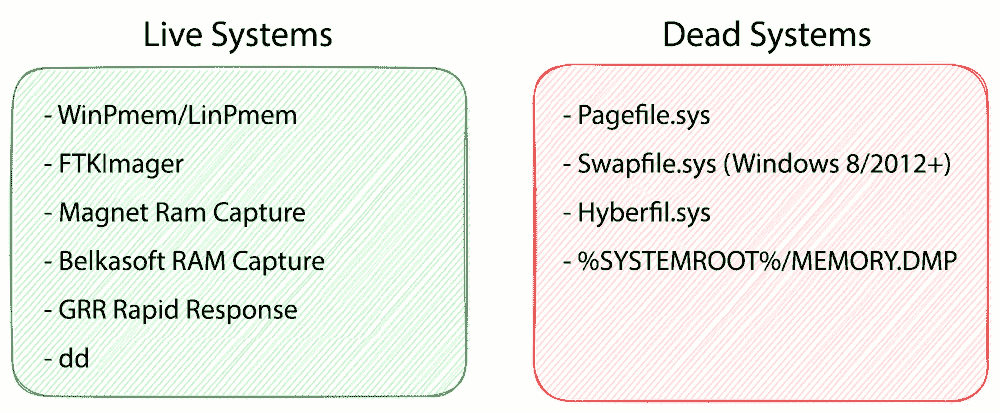

图 8.2 – 内存获取来源/工具

让我们看看一些可以在实时系统中获取内存的工具集，同时查看可以为取证调查收集的死机系统的内存遗迹：

+   `dd` 是一个在 Linux/Unix 平台上常用于低级数据复制和转换的命令。在数字取证的背景下，`dd` 被用于在 Linux/Unix 系统中获取内存或 RAM 的副本。请注意，由于潜在的风险和挑战，通常不推荐使用它。错误使用 `dd` 进行内存获取可能导致内存捕获不准确或不完整，并可能干扰目标系统的操作。

+   `pagefile.sys`) 是虚拟内存扩展，允许内存使用此存储来临时存储数据。在较旧的 Windows 版本中，此文件被称为 `swapfile.sys`。通常，当物理 RAM 空间达到上限并且应用程序排队等待执行时，Windows 会通过 `pagefile.sys` 自动将内存页卸载到磁盘。从取证的角度来看，`pagefile.sys` 可能包含敏感或有价值的信息的残留数据，包括文件碎片、注册表数据，甚至是密码。这些残留数据可能在主内存或传统磁盘存储中不存在，因此页面文件可能成为潜在的证据来源。请注意，页面文件是易失性的，这意味着其内容在系统关闭或重启后不会保留。然而，如果系统进入休眠状态，页面文件的内容可以保留在休眠文件（`hiberfil.sys`）中，供潜在恢复使用。在进行内存获取时，捕获页面文件是一个好习惯。* `MEMORY.DMP` 位于 Windows 操作系统的 `%SystemRoot%` 文件夹中。根据转储文件的大小，调查人员可以确定它是完整的内存转储（也称为 **内核内存转储**）还是在崩溃时转储的内存页面快照（**活动内存转储**）。无论如何，现有的内存分析工具应该能够让调查人员解析和分析这些崩溃转储。请注意，在 Linux 系统中，写入磁盘的内存页称为 **交换文件**，仅在分配的内存不足时才会使用。调查人员只能收集交换文件。当 Linux 系统重新启动时，交换文件不会保留在磁盘上。请注意，如果 Linux 系统处于休眠状态，调查人员可能会在磁盘上看到交换文件，但这种情况很少发生；Linux 系统通常不会进入休眠状态。

尽管有许多收集内存映像（无论是活跃系统还是死机系统）的方法，但需要注意的是，从云取证的角度来看，收集磁盘上的内存交换文件或页面与死机系统中的收集方法没有区别。调查人员必须收集与各个云实例相关的正确磁盘副本。现在，我们已经获得了内存快照或映像，让我们来看看分析这些映像的工具。

### 内存分析工具

在本节中，我们将介绍一些在调查中常用的工具，尤其是用于分析系统内存伪影的工具。一旦收集了内存映像，就有一些特殊工具可以从内存中提取信息：

+   **Volatility**：Volatility 是最受欢迎的开源内存取证框架之一，也是调查人员进行内存分析的首选工具。它完全用 Python 编写，允许分析内存快照，并支持多种操作系统。它提供多个插件，用于提取有关正在运行的进程、网络活动、注册表数据等的信息。Volatility 支持多种内存转储格式，广泛应用于该领域的专业人士。Volatility 还可以本地分析较旧版本 Windows 中的**hiberfil.sys**和**pagefile.sys**。然而，为了解决挑战并处理随着 Windows 操作系统变化的休眠文件，开发了各种其他特定工具，从而以更好的方式应对这些变化。

+   **Velociraptor**：Velociraptor 是一个开源的终端监控和数字取证平台，旨在提供跨网络终端的高保真数据收集和分析能力。Velociraptor 的一个关键特性是能够在终端上执行实时内存分析，以揭示洞察、检测异常并收集事件响应和取证调查的证据。分析人员可以根据特定的调查需求定制内存分析任务，支持自定义查询和插件。除了内存分析，Velociraptor 还通过预定义的指示器和模式促进主动威胁检测。其集中管理、工作流自动化、可扩展性和活跃的用户社区使其在不同环境（物理、虚拟和云环境）中表现出色。

+   **Rekall**：Rekall 是 Volatility 的一个分支，增强了其通过启用实时内存取证的功能。与 Volatility 类似，Rekall 包括 Volatility 的大部分功能，并能分析不同操作系统中的**hiberfil.sys**、**pagefile.sys**和交换文件。

+   **GRR**：GRR 是另一个基于代理的开源事件响应平台。调查员必须部署一个代理来捕获遥测数据或进行实时内存取证。虽然有更强大的内存分析工具可用，如 Velociraptor 和 Volatility，但由于 GRR 独特的优势和能力，它仍然是任何组织 DFIR 工具库中的一个有价值的工具。GRR 明确设计用于收集终端数据，包括对内存文件的实时分析，使其成为任何网络安全团队的多功能工具。

+   **Magnet AXIOM**：Magnet AXIOM 是由 Magnet Forensics 开发的一款商业工具，专为帮助执法机构、企业调查员和数字取证与事件响应（DFIR）专业人士设计。它是一款基于许可的工具，专注于高效地从各种来源收集、分析和展示数字证据。Magnet AXIOM 支持从计算机、智能手机和云服务等多种来源进行数据采集。它还支持分析文件、电子邮件和聊天信息等文物。Magnet AXIOM 支持从各种操作系统捕获的内存映像，包括**hiberfil.sys**、**pagefile.sys**和交换文件。它还能够解析通过多个第三方工具收集的快速取证包。Magnet AXIOM 支持时间轴分析，并能重建来自数字证据的事件。它还支持关键词搜索、数据雕刻和高级过滤功能，帮助调查员迅速定位相关信息。最后，它简化了报告生成、支持协作，并专注于移动设备分析。

总结来说，主机和内存取证是数字调查中不可或缺的支柱。对操作系统中的文物进行分析，并结合提取挥发性内存数据，使数字取证调查员能够重建数字痕迹，揭示隐藏证据，并解密网络事件背后的故事。主机取证全面解释了系统的历史和用户活动。

相比之下，内存取证可以捕捉实时快照，揭示进程的内部工作原理和潜在威胁。与先进的工具和方法相结合，这些学科共同推动了在数字取证领域追求真相与正义的努力。我们将在*第十章*中学习如何从云端获取磁盘和内存映像。以下部分将重点介绍使用各种工具进行实时取证分析和威胁狩猎的技术，因为威胁行为者已经演变，采用复杂的技术将恶意软件隐藏在明面上。

# 实时取证分析和威胁狩猎

数字取证调查员的操作原则是恶意软件必须始终在内存中运行；它们没有可以隐藏的地方。然而，近年来，技术的发展使内存变得更加庞大且不易挥发，从而催生了无文件恶意软件——即不接触磁盘的恶意软件——它在执行前保持隐蔽。以下各节将介绍一些现代企业调查员用来识别恶意软件并进行威胁狩猎的工具，帮助你了解恶意软件使用的常见持久性机制。

## 基于 EDR 的威胁狩猎

计算技术、云基础设施的进步以及对大规模磁盘和内存容量的支持，使得有必要推出一系列新工具，这些工具能够持续监控主机并收集磁盘和内存上的实时遥测数据，捕获每个应用程序的痕迹，发现恶意软件，并在攻击变得更严重之前阻止它。这个被称为 **EDR** 的技术是一类新的安全工具（商业工具），它收集高级遥测数据，并使用超越标准基于签名的检测的多种技术来识别和检测恶意软件，并战术性地响应威胁。我们通常将 EDR 称为“超级增强版的杀毒软件”，因为它能做的事情远超过简单的杀毒软件，而后者往往很容易被威胁者关闭或躲避，难以被检测到。

EDR 通常在操作系统内核级别运行，并能够识别磁盘和内存上的各种活动，超出用户能看到的范围。EDR 能追踪进程调用、子进程信息、Windows **应用程序编程接口**（**API**）的使用情况、传递给每个进程的命令行、网络连接、进程线程信息、**动态链接库**（**DLLs**）、文件句柄、注册表句柄等等。

请注意，EDR 并不是法医工具。然而，EDR 通过提供高保真遥测数据来增强法医调查，如果在组织内没有部署 EDR，这些信息通常会被错过。大多数流行的 EDR 还允许法医团队对主机进行实时查询。你可以使用预设的命令行参数查询主机系统，甚至运行自定义脚本以收集更多的信息或证据。法医调查员通常使用实时查询来下载证据、日志，或甚至快速的法医包进行离线分析。

### 深入探索 EDR 追踪

假设我们作为调查员，部署了 EDR 工具来响应安全事件。我们正在使用 **SentinelOne Singularity 平台**（经许可使用）来展示使用此方法进行的威胁追踪。

一旦 SentinelOne 代理安装到受感染的系统上，它通常会扫描系统并启动漏洞隔离，意味着任何检测到的恶意软件都会被隔离。警报会在中央 Singularity 控制台上触发。这成为调查或追踪的起点，调查员可以通过这个 EDR 工具继续进行他们的调查。在以下截图中，注意到在 **Threats** 仪表板下有更多的详细信息，同时提供了启动威胁追踪的选项。**SHA1** 哈希值还允许调查员查看其他威胁情报来源，如 VirusTotal：


图 8.3 – SentinelOne EDR 上的示例警报（经许可发布）

一旦调查人员能够获得足够的关于威胁情况的信息，他们就可以开始执行威胁狩猎。SentinelOne 提供了多种方式来进行威胁狩猎。最简单的一种方式是通过其 Singularity `tgt.file.sha1 = "41e8db9bb005fce152e08c20e6392e0a5d44bb6e"` SHA1 条目：


图 8.4 – 基于 SHA1 哈希的 SentinelOne Singularity XDR 模块狩猎

请注意，每个结果都有一个复选框，提供有关收集到的数据的更多信息。这包括事件本身的信息、执行该事件的账户、SentinelOne 代理的名称和终端构成、以及检测的详细信息，包括进程信息和提供的命令行参数。每个条目还可以进一步用于深入狩猎，这在复杂的威胁场景中尤其有用。

SentinelOne Singularity XDR 本地呈现所有遥测数据字段的集合。**字段**视图使调查人员能够快速进入并调查，而无需浪费时间去适应界面。以下是字段列表的示例，它是导航选项的一部分。它还为调查人员提供了聚合的字段结果，以便识别任何异常。每个结果都可以点击，应用相关的搜索过滤器进行狩猎：

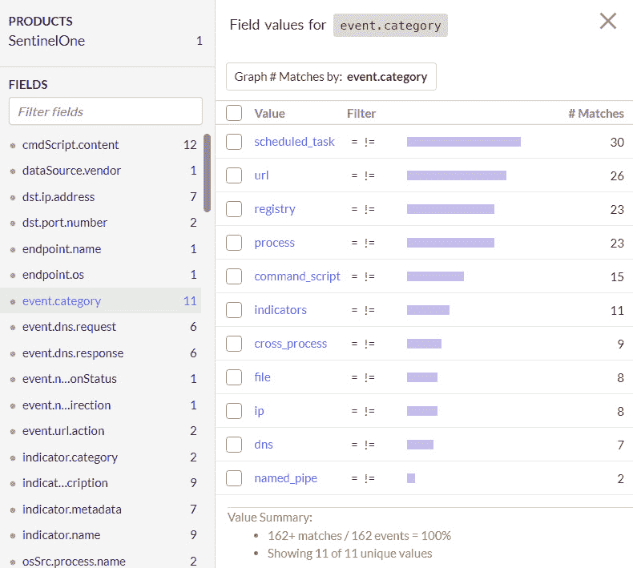

图 8.5 – SentinelOne Singularity XDR 的字段

一旦使用 Singularity XDR 模块执行了初步的狩猎，调查人员可以基于结果快速转换，以获取更多关于检测到的威胁活动的信息。通过遥测数据，我们知道威胁行为者使用 PowerShell 尝试访问并执行恶意软件。样本截图显示了识别该威胁行为者行为的事件数据，使得调查人员能够进一步获取有关该事件的更多情况信息。

调查人员可以在访问相关事件条目时使用**事件详情**标签（参见*图 8.3*）。**事件详情**提供有关事件的更多信息，包括调用恶意软件的命令：

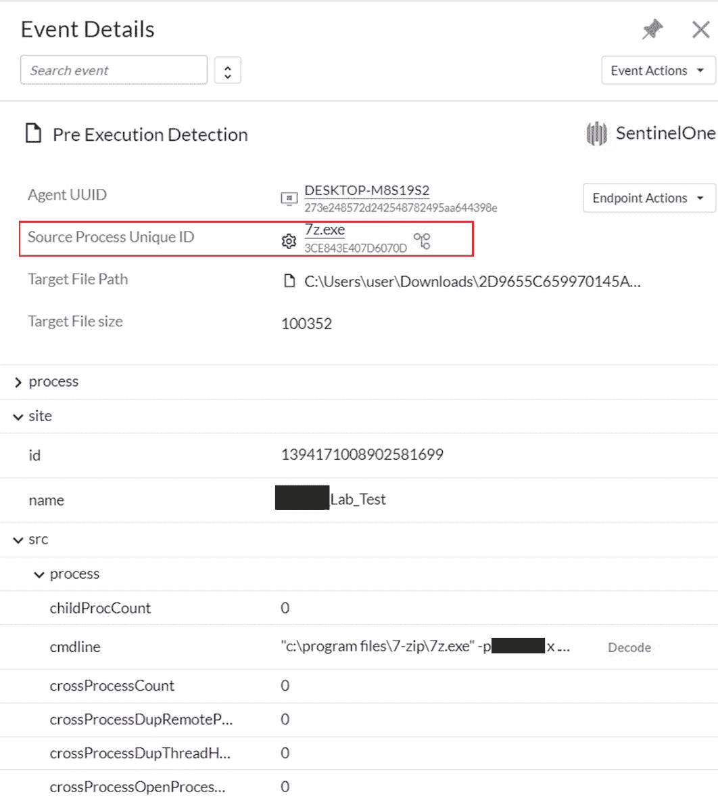

图 8.6 – 基于 SingularityXDR 搜索结果的事件详情

如我们所见，EDR 增强了检测和防止恶意软件执行的过程。在云取证的背景下，拥有一个 EDR/XDR 工具来调查云端终端并结合在云控制台生成的日志，可以增强调查人员分析和识别威胁发生方式的能力。此外，从法律角度来看，这使得调查人员能够从不同来源 corroborate 事件，确保已识别的调查在法医上是可靠的，并且在法律上是可接受的。

## 恶意软件狩猎

寻找恶意软件是一种主动发现宿主中恶意应用程序/软件的方法。这种技术超越了传统的安全措施，通过主动寻找妥协迹象、识别根本原因并防止未来的事件。事件响应人员分析系统行为，利用威胁情报和内存分析来揭示妥协的迹象。通过仔细审查日志、进行沙箱测试以及利用自动化工具，他们可以检测与恶意软件相关的异常和模式。以下是一些恶意软件常用的躲避检测的方法：

+   **服务劫持**：服务劫持指的是恶意行为者控制系统服务，从而在合法进程的上下文中执行任意代码。通过攻陷受信任的服务，攻击者可以执行恶意命令或有效载荷，绕过检测。一个实际案例是**Zeus**银行木马，它利用 WMI 服务执行恶意代码，并在感染的系统上保持持久性。

+   **进程注入**：进程注入是一种恶意软件将其代码插入到合法进程中的技术，有效地将其隐藏在受信任应用程序的内存空间中。常见的注入方法包括 DLL 注入、反射 DLL 注入和进程空洞注入。检测进程注入涉及监控内存区域的意外修改，分析进程内存中的代码不一致性，并检查 API 调用以识别注入代码执行的迹象。**TrickBot**恶意软件使用了反射 DLL 注入等进程注入技术，将恶意代码注入到合法进程中，从而避开了安全解决方案的检测。

+   **备用数据流** (**ADS**)：ADS 提供了一种通过附加额外数据流将数据隐藏在合法文件中的方法。恶意软件可以利用 ADS 存储其代码或配置，从而使检测变得困难。寻找 ADS 涉及分析文件元数据、检查文件内的多个数据流，并监控异常的数据流关联。

+   **Web Shell**：Web Shell 是嵌入在 Web 应用程序或服务器中的恶意脚本或代码片段，允许攻击者获得远程访问和控制权限。**Shellshock**漏洞允许攻击者将恶意代码注入到 Web 服务器环境中，从而有效部署 Web Shell 并获得未经授权的访问。

+   **打包**：打包涉及压缩或加密恶意软件文件，以掩盖其内容并防止直接分析。恶意软件通常在运行时在内存中解包，这使得调查人员很难对其进行采样并识别其真实性质。检测打包技术包括识别打包的可执行文件头，分析文件的熵值，并利用解包工具或技术揭示原始代码。一个常见的应用打包工具是**UPX**，它被合法应用程序和恶意软件广泛使用。

+   **代码签名**：恶意软件作者可能使用窃取或欺骗获取的数字证书对其代码进行签名，以显示合法性并避免安全软件的检测。检测用有效证书签名的代码涉及检查证书的真实性，检查证书链，并监视吊销的证书或证书使用中的异常。最近的历史中有多个例子，攻击者窃取组织的代码签名证书，用于签署恶意软件，并用于下游供应链攻击。

+   **无文件恶意软件**：无文件恶意软件在内存中运行，不在磁盘上留下痕迹，使检测变得困难。这种技术通常涉及利用脚本语言或利用系统工具。检测这些技术需要收集特定的日志，如 PowerShell，并获取内存镜像。EDR（终端检测与响应）是检测这些攻击的好方法，因为它们监视和跟踪文件系统变化和内存活动。流行的无文件恶意软件方法使用 PowerShell 的**IEX** cradle，在内存中下载应用程序或额外脚本，并在运行时执行，从未接触磁盘。最近，威胁行为者已被发现使用 PowerShell Empire，这是一个允许无文件恶意软件交付技术的框架。

正如我们所见，威胁行为者可以以各种方式隐藏和逃避主机上的检测。虽然我们讨论了最常见和明显的方式，但高级威胁行为者组织使用创新技术。在某种程度上，云基础设施中运行的恶意软件可能会使调查员的工作更加轻松，因为云服务提供商已经集成了各种安全工具，用于识别和检测恶意活动。

此外，大多数云服务提供商与多个安全供应商合作，提供工具和对主机的可见性，从而帮助调查员比传统调查方法更快速地识别恶意软件。例如，AWS GuardDuty 可以直接扫描虚拟机而无需任何代理安装，并提供恶意软件检测能力的可见性。同时，GCP 的 CloudSCC 和 Azure 的安全中心具有类似功能，监视虚拟机并通知管理员有关恶意程序的信息。在任何情况下，这些检测都是由云服务提供商的合作伙伴提供的，但可在各自的云服务提供商安全控制台中供调查员使用。我们将在*第 4*、*5*和*6*章中详细介绍这些工具。

## 常见的持久化机制

我们现在将研究恶意软件通常可以采用的常见持久化机制。无论云环境下的基础设施如何，恶意软件都会运行：

+   Windows 注册表的`Run`键在每次用户登录时启动应用程序或脚本，允许特定用户应用程序自动启动。一些常见的注册表键包括：

    ```
    Computer\HKEY_CURRENT_USER\Software\Microsoft\Windows\CurrentVersion\Run
    Computer\HKEY_CURRENT_USER\Software\Microsoft\Windows\CurrentVersion\RunOnce
    Computer\HKEY_LOCAL_MACHINE\SOFTWARE\Microsoft\Windows\CurrentVersion\Run
    Computer\HKEY_LOCAL_MACHINE\SOFTWARE\Microsoft\Windows\CurrentVersion\RunOnce
    ```

+   **启动文件夹**：放置在用户或系统的启动文件夹中的应用程序会在用户登录时自动启动，从而实现用户特定的启动行为定制。威胁行为者最常用来保持持久性的文件夹之一如下所示：

    ```
    %AppData%\Roaming\Microsoft\Windows\Start Menu\Programs\Startup
    ```

+   **计划任务**：在系统启动或用户登录时配置的计划任务由 Windows 任务计划程序管理，可以执行各种操作，例如更新或维护任务。

+   **组策略对象**（**GPOs**）：GPOs 是威胁行为者在组织内部保持持久性的最常见方式之一。它们通过在公司域控制器上创建恶意 GPO 来准备和派发恶意软件副本以保持持久性并执行。此外，威胁行为者可以调整 GPO 来控制恶意软件如何在企业中集中部署。威胁行为者还可以在满足特定条件时创建计划任务，下载脚本或触发恶意软件执行。大多数勒索软件运营商使用 GPOs 来集中控制和部署勒索软件，确保安全管理员没有时间阻止攻击。* **DLL 劫持**：DLL 劫持是攻击者通过操控 Windows 加载 DLL 的方式来实现恶意软件持久性的技术。在 DLL 加载过程中，Windows 按特定顺序定位所需的 DLL，包括应用程序文件夹和系统目录等标准目录。攻击者识别出一个易受攻击的应用程序，并将一个与所需 DLL 同名的恶意 DLL 放入应用程序搜索的路径中。当应用程序启动时，恶意 DLL 会代替合法的 DLL 被加载，从而在应用程序的上下文中执行攻击者的代码。这使得攻击者能够建立持久性，运行任意代码，并可能获得对受感染系统的控制。由于目标应用程序的常规使用，恶意代码会持续执行，确保即使系统重启后仍能保持持久性。*   **WMI 事件消费者**：通过 WMI 事件消费者实现恶意软件持久性，涉及利用 WMI 的功能，在特定触发事件发生时执行恶意操作。以下是攻击者可能采取的步骤，以实现这种形式的持久性。这些步骤最终存储在 **管理对象格式**（**MOF**）文件中，该文件用于在 WMI 库中注册新类：

    1.  **创建恶意事件消费者**：攻击者创建一个 WMI 事件消费者，一个脚本或可执行文件，旨在在特定 WMI 事件发生时执行。系统事件，如启动、登录或其他自定义触发事件，都可能触发此事件。恶意事件消费者包含执行攻击者负载的指令。

    1.  **事件过滤器和绑定**：攻击者创建一个事件过滤器，定义恶意事件消费者执行的条件。这个过滤器与特定的触发事件相关联。接着，攻击者将事件过滤器绑定到恶意事件消费者，从而在过滤器和包含脚本或可执行文件的有效载荷之间建立连接。

    1.  **触发事件执行**：当定义的触发事件发生时，相关的事件过滤器将评估条件是否满足。如果条件符合，WMI 事件消费者将执行有效载荷，可能是恶意软件、脚本或可执行文件。这个有效载荷在 WMI 服务的上下文中运行，使攻击者能够建立持久性、执行任意代码，并可能控制被攻陷的系统。

    调查人员应参考以下命令查询 WMI 存储库并确定恶意 WMI：

    ```
    > Get-WmiObject -Class __FilterToConsumerBinding -Namespace root\subscription
    > Get-WmiObject -Class __EventFilter -Namespace root\subscription
    > Get-WmiObject -Class __EventConsumer -Namespace root\subscription
    strings -q C:\windows\system32\wbem\repository\objects.data
    ```

总结来说，现场取证、EDR 解决方案、主动恶意软件狩猎和高级持久性机制的结合，强调了一种全面的现代网络安全方法。借助先进的工具和技术，现场取证可以实时洞察正在进行的威胁，从而实现快速的事件响应。

我们现在正在进入网络取证的领域。网络取证在揭示网络威胁方面至关重要，因为它允许我们检查网络活动、流量模式和通信行为。通过深入分析网络数据，我们将获得对潜在安全漏洞、恶意活动以及敌对方使用的更广泛战术的宝贵洞察。在云取证的背景下，这尤为重要。

# 网络取证

正如本节标题所示，网络取证是一种对网络协议、数据包和线缆上的任何证据进行取证分析的方法。在云环境中进行网络取证，涉及分析网络流量、通信模式和 CSP 服务与外部用户之间的数据流，以揭示潜在的安全漏洞、数据外泄和未授权访问。通过检查云基础设施中的网络数据，我们可以绘制事件的全面图景，识别异常，并检测网络威胁留下的痕迹。从根本上讲，调查人员必须访问网络数据才能进行此类分析。这种深入的审查让我们能够有效应对事件，降低风险，并保持强大的云安全防御能力。

## 基本网络概念

在网络取证中，调查人员必须始终记住，任何网络通信都可以分解为网络通信模型所定义的层次结构，模型可以是**开放系统互联（OSI）**模型或**传输控制协议/互联网协议（TCP/IP）**模型。这些模型为调查人员提供了明确的视图，帮助他们了解威胁行为者如何访问主机以及威胁行为者使用了哪些协议。让我们更详细地了解这两种模型。请注意，我们假设你对该领域已有一定了解，以下内容仅为复习：

+   **OSI 模型**：该模型是一个框架，用于标准化各种网络协议的功能和交互，作为设计和理解不同网络技术如何通信的指南。该模型被分为七层，每一层负责特定的任务和功能。下图概述了七层及其所使用的协议。在云环境中，较低层由 CSP 进行管理，包括**物理层**和**数据链路层**。相对而言，**网络层**是云客户和 CSP 的共同责任，因为该层允许客户创建他们的 VPC。某种程度上，**传输层**也是共同责任，例如如果需要配置特定的 IPsec。另一方面，**会话层**、**表示层**和**应用层**则由云客户负责。虽然 CSP 扮演使能者的角色，但云客户需要负责配置和确保这些层的安全性：

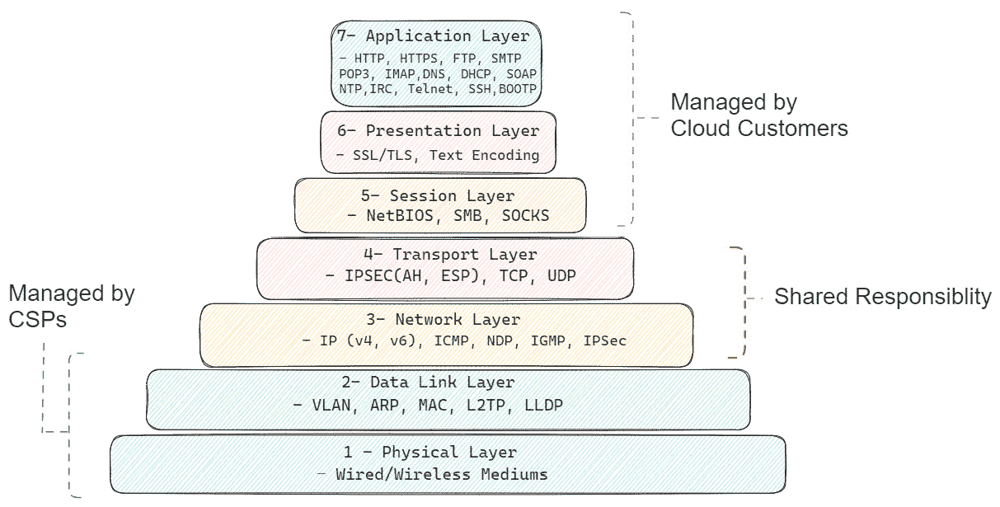

图 8.7 – OSI 模型与云责任

+   **TCP/IP 参考模型**：该模型是一个广泛使用的框架，用于理解和描述支持互联网以及许多其他网络的网络协议功能。与七层的 OSI 模型不同，TCP/IP 模型由四层组成，每层有自己的协议和责任；然而，它与 OSI 模型紧密对齐。下图展示了 TCP/IP 参考模型的层级划分以及支持的协议。在云环境中，参考模型的较低层，即**链路层**和**CSP**，通常处理**互联网层**。相对而言，客户和 CSP 共同负责**传输层**，允许客户创建他们的 VPC 子网。通常，管理**应用层**是客户的责任：


图 8.8 – TCP/IP 参考模型与云责任

在下一部分中，我们将探讨对于调查目的至关重要的日志来源，并且还将介绍一些方便的网络分析工具。

## 云网络取证 – 日志来源与工具

让我们来看一下可以从 CSP 和云实例中获取的一些网络痕迹：

+   **VPC 流日志**：在前几章（*第四章*、*第五章* 和 *第六章*）中，我们讨论了如何开启和启用 VPC 流日志。这些是调查人员可以访问的最重要的网络调查日志。虽然 VPC 流日志不会捕获完整的网络流量数据包，但分析和确定恶意活动的源节点和目标节点是至关重要的。

+   **tcpdump 输出**：在 VPC 流日志无法提供帮助的情况下，例如在检查数据外泄和揭示威胁行为者导出的数据时，调查人员需要完整的数据包转储。tcpdump 是一个广泛使用的网络捕获框架，用于收集完整的网络数据包，对于识别网络中的威胁行为者活动至关重要。通过 tcpdump 输出，调查人员可以追踪威胁行为者的活动和会话，确定传输的文件或恶意软件，甚至可以从数据包捕获中重建文件或恶意软件进行进一步分析。通过完整的数据包，调查人员还可以重播并识别环境中被利用的漏洞。

+   **来自云防火墙和 Web 应用防火墙（**WAF**）的日志**：大多数基于云的组织也可能部署云防火墙，即虚拟防火墙实例，或者使用 CSP 的原生防火墙功能（其功能有限）。云防火墙生成详细的网络流量日志，包括允许和拒绝的连接，而 WAF 主要关注与 Web 应用相关的流量，过滤掉恶意请求。分析这些日志可以帮助识别未授权访问、攻击和潜在的漏洞。通过将防火墙和 WAF 日志与其他取证数据（如系统日志和数据包捕获）关联，调查人员可以重建事件，确定漏洞，并了解攻击者的战术。这些日志是云网络取证中的重要证据来源，能够促进迅速、准确的事件检测、响应和缓解措施。

现在我们已经了解了可以用来捕获网络流量信息的工具，让我们来看一个使用其中一种流行网络调查工具的示例。

## 网络调查工具

DFIR 中的网络调查工具是必不可少的资源，它们使得调查员能够深入分析网络活动、分析流量模式并发现潜在的安全漏洞。例如，调查员可以通过网络识别数据外泄或在云实例上使用恶意代码。这些工具为调查员提供了审查网络数据、识别异常、追踪威胁来源以及重建安全事件发生过程的手段，而无需在事件发生中期直接访问主机。

网络调查不仅可以深入挖掘，还能提供关键的 IoC（Indicators of Compromise，妥协指示器），使调查员能够将其与多个来源进行关联，例如通过使用威胁行为者控制的远程服务器的 IP 地址来进行数据外泄，这些信息随后可以在 SIEM（安全信息和事件管理）工具中追踪，以确定是否存在任何其他的外泄证据。让我们来探索那些在现代 DFIR（数字取证与事件响应）实践中不可或缺的多样化网络调查工具和技术。

### Arkime

Arkime（前身为 Moloch）是一个强大的开源网络调查工具，旨在捕获、存储和分析大量网络流量数据。Arkime 为调查员和事件响应人员提供了一个全面的平台，帮助他们调查和理解网络活动、检测异常，并发现潜在的安全威胁。由于其注重可扩展性和灵活性，Arkime 特别适用于在本地和云环境中分析大量的网络流量。

Arkime 提供了多个关键功能，使其成为网络调查中的宝贵工具：

+   **数据包捕获和存储**：Arkime 以可扩展和高效的方式捕获和存储网络数据包，使得可以保留大量的历史流量数据供后续分析。

+   **搜索和分析**：该工具提供了先进的搜索和过滤功能，允许用户根据各种属性（如 IP 地址、端口、协议和时间范围）查询和分析网络数据。

+   **会话重建**：Arkime 可以从捕获的数据中重建网络会话，提供网络节点之间的对话和交互的全面视图，并帮助理解通信的背景。

+   **元数据提取**：Arkime 从网络流量和数据包中提取元数据，提供更高级别的通信概览，并促进高效的数据分析。

+   **可视化和报告**：该工具可视化网络流量模式，帮助分析师识别趋势和异常。它还支持定制化报告，用于记录调查结果。

+   **定制化和可扩展性**：Arkime 允许用户开发自定义插件和解析器，以适应特定的网络协议或应用程序，增强了灵活性和适应性。

+   **与其他工具的集成**：Arkime 可以与其他网络和安全工具集成，实现信息的无缝共享和增强的分析能力。

Arkime 能够处理大规模数据分析，并专注于帮助网络调查，使其成为 DFIR 工具包中不可或缺的工具。通过利用其功能，调查人员可以有效地检测、响应并缓解与网络相关的威胁，从而最终增强组织的网络安全态势。让我们来看一个使用 Arkime 从云实例摄取并分析一个示例完整数据包捕获的案例。

#### 使用 Arkime

使用 Arkime 非常简单；它有一个直观的`http://<Arkime.ipAddress>:8005`：

1.  下图展示了与 Arkime 一起提供的二进制文件，该文件专门用于离线 PCAP 文件导入——`capture`：

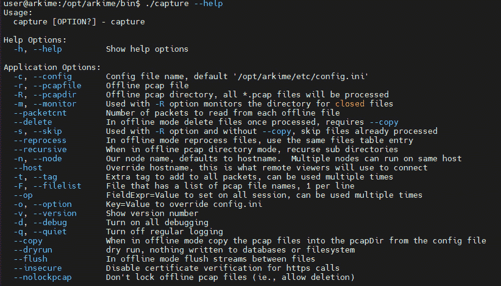

图 8.9 – Arkime “捕获”用于离线处理 PCAP 文件

1.  基于可用选项，我们将使用以下命令行参数将 PCAP 文件上传到 Arkime 进行进一步处理：

    ```
    ipv4-address-space.csv (representing IPv4 address space ranges per Regional Internet Registries (RIR)) and manuf files (list of MAC address allocations per the Network Interface Controller (NIC) manufacturers). MAC addresses are unique identifiers that are assigned to NICs for network communication. In incident response, the MAC address helps identify the make of the NIC controller and ultimately determine what computing systems this may have been used, taking it a step closer to the threat actor device.
    ```

1.  一旦上传到 Arkime，我们可以进入 web 浏览器进行调查。下图展示了一个实际的勒索软件攻击案例，该攻击被捕获在云实例上。组织通过镜像其主机的网络流量并将其发送到另一台主机进行记录，捕获了网络流量数据包。下图概述了 UI 和一般功能集。我们可以看到每个会话的活动高峰；你可以按时间切片条目并执行额外的搜索。在页面下半部分的每个条目中，都有一个**+**选项，可以让你深入挖掘特定的 TCP 会话。它还提供了整个 TCP 流的对话（前提是 TCP 流量是明文的，而不是通过 SSL 流量）：

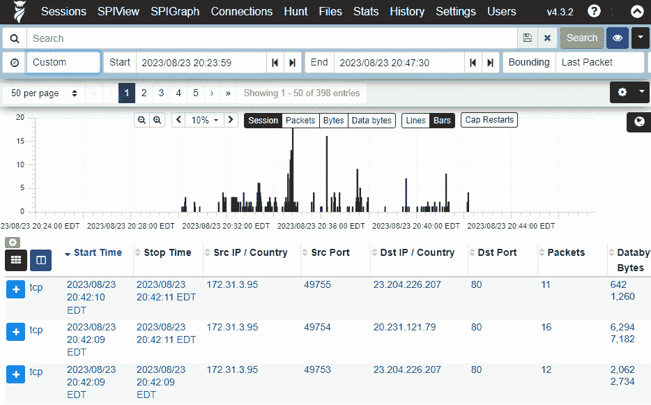

图 8.10 – Arkime 主界面 – PCAP 文件导入和处理后

1.  如下截图所示，调查人员还可以根据要求或流量本身的性质选择解析数据包。它还提供了对数据包进行解码的机会：

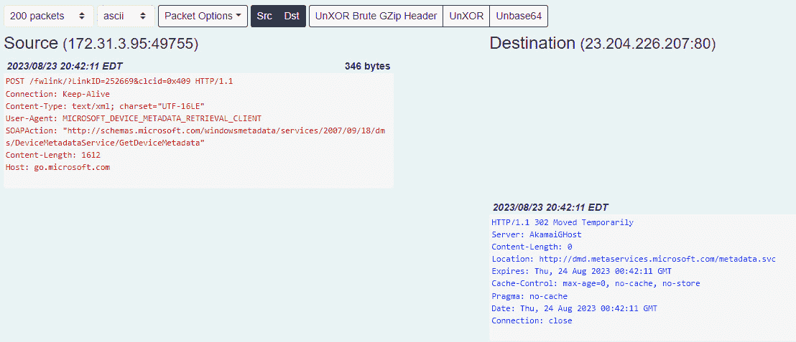

图 8.11 – Arkime TCP 会话详情（对话）

如我们从会话的详细视图中看到的，调查人员通常可以查看构成该会话的单个数据包。这包括有关数据包大小、时间戳和数据包负载的信息，这种详细程度对安全分析人员调查网络活动至关重要。现在，让我们转到 Arkime 中的会话感知和过滤功能。

#### 会话感知 – 过滤

本节将介绍会话感知和过滤功能。Arkime 具有 **会话和协议信息**（**SPI**）视图。该视图是 Arkime 基于 Web 的界面的关键组成部分，允许用户分析和解析网络会话及其相关协议。以下是调查人员可以利用 SPI 视图的一些用例：

+   **会话列表**：SPI 视图提供了 Arkime 捕获并索引的网络会话列表。会话表示源 IP 地址和目标 IP 地址及端口之间的网络数据包序列。

+   **会话详情**：点击列表中的特定会话，可以查看该会话的详细信息。这些信息包括源和目标 IP 地址、源和目标端口、使用的协议、数据包捕获细节等。

+   **协议分析**：Arkime 的 SPI 视图通常提供协议特定的信息。这意味着你可以根据协议分析网络会话，包括 HTTP、DNS 和 FTP。这有助于识别可疑或恶意活动。

+   **过滤器和搜索**：就像 Arkime 的其他视图一样，SPI 视图允许你应用过滤器和搜索条件来缩小你感兴趣的会话范围。当你处理大量捕获的网络数据时，这非常有用。通过 SPI 视图和 IP 地址列表，调查人员可以导出属性的详细信息，并对每个指标执行威胁情报搜索，以获得更多信息。以下是一些过滤功能：

    +   **简单过滤器**：你可以基于简单的属性（如 IP 地址、端口、协议和时间戳范围）来过滤会话。例如，你可以过滤出涉及特定 IP 地址的所有会话，或者过滤出发生在特定时间范围内的会话。

    +   **组合过滤器**：Moloch 的查询语言允许你使用逻辑运算符（AND、OR、NOT）组合多个条件，以创建更复杂的过滤器。这帮助你将注意力集中在特定场景上。

    +   **正则表达式**：你可以使用正则表达式匹配会话属性中的模式。例如，你可能希望过滤出包含特定关键字的 URL 会话。

    +   **自定义字段**：Arkime 允许你定义并使用自定义字段，这些字段可以从会话数据中提取，或在数据导入过程中添加。然后，你可以根据这些自定义字段过滤会话。

    +   **保存的查询**：一旦你构建了一个有用的过滤器，你可以将其保存为一个命名查询，以便将来轻松重用。

+   **会话图**：根据 SPI 视图的功能，你可能还可以访问会话数据的可视化表示，例如显示主机间通信流的图表。

+   **威胁检测**：安全分析人员经常使用 Arkime 的 SPI 视图来检测网络流量中的潜在威胁或异常。异常模式、意外协议或可疑有效载荷可能表明恶意活动。

以下截图显示了一个示例 PCAP 文件。这里，Arkime 会分解会话和协议，并深入分析每个数据包。如我们所见，SPI 视图分解了目标 IP 和其他协议。每个结果都可以点击，进行进一步分析：


图 8.12 – Arkime 的 SPI 视图，用于会话和协议分析

总结来说，Arkime 是一个强大的工具，可以帮助调查人员解析网络流量。它还具备强大的数据增强功能。例如，Arkime 可以集成 IP 地理位置数据库来确定源 IP 的位置。Arkime 还允许与其他威胁情报源进行集成。另一个特点是，它提供内容提取功能，意味着你可以从 Arkime 下载文件进行进一步的人工分析。

### Wireshark/tcpdump

tcpdump 和 Wireshark 是在 DFIR 中常用的强大工具，用于捕获和分析网络流量。这两款工具具有相似的用途，但在特性和使用场景上有所不同。通常，这些工具用于从网络调查的角度反向工程网络协议。

#### tcpdump

tcpdump 是一个命令行数据包分析工具，能够实时捕获网络数据包或从先前捕获的文件中提取数据包。它在网络栈的较低层运行，能够以非常细致的方式捕获数据包，包括以太网帧、IP 数据包、TCP/UDP 段等。它通常用于网络监控、故障排除和安全分析。在 DFIR 中，tcpdump 对于事件响应期间的实时数据包捕获特别有用，能够捕获网络流量并供后续分析。

从网络调查的角度来看，有时调查人员没有完整的云访问权限来设置数据包镜像服务，无法将受感染的云实例的所有数据包镜像到该组织租户下的另一实例。如果对这些工具有了解，确实有助于在访问配置元素受到限制时准备和启动网络捕获。

调查人员可以使用 `sudo tcpdump` 命令启动完整的数据包转储（你需要管理员权限）。*图 8.13* 显示了没有任何过滤器的 tcpdump 转储的示例输出，展示了以下字段：

+   `HH:MM:SS.微秒`。

+   `t2.lan.ssh` 是发送数据到 `dfirlab.lan.27018` 的源 IP/端口，而 `dfirlab.lan.27018` 是发送数据到 `t2.lan.ssh` 的源 IP，作为响应。

+   `[P.]` 表示数据包携带应用数据（PUSH 标志已设置），而 `[.]` 表示常规确认（ACK 标志已设置）。

+   `seq 188:440` 表示数据包中数据的序列号范围从 `188` 到 `440`。这个序列号用于跟踪数据包的顺序。`seq 6000:6256` 表示后续的序列号范围。

+   `ack 1` 表示下一个预期字节的确认号。`ack 1148` 是已接收数据的确认。

+   `win 4097` 和 `win 501` 表示接收窗口大小，即接收方可以缓冲的数据量。

+   `length 252` 表示数据包的负载长度。

请注意，你必须明确指定文件名，将数据包捕获到磁盘中的 PCAP 格式文件中以供离线分析：


图 8.13 – tcpdump 实际操作

+   **TCP dump 过滤器**：调查人员应熟悉 tcpdump 过滤器。当在捕获过程中应用这些过滤器时，它们将仅收集符合过滤条件的网络数据包。对于 tcpdump，使用的是 **Berkeley 数据包过滤器**（**BPF**），它允许进行低级过滤，并指定捕获特定数据包的要求。

    下图展示了使用 BPF 过滤器捕获特定网络数据包的示例——即，`sudo tcpdump -i <interface_name> proto 17`。在这个示例中，我们根据协议号 17 过滤数据包，协议号 17 指的是 UDP 流量：

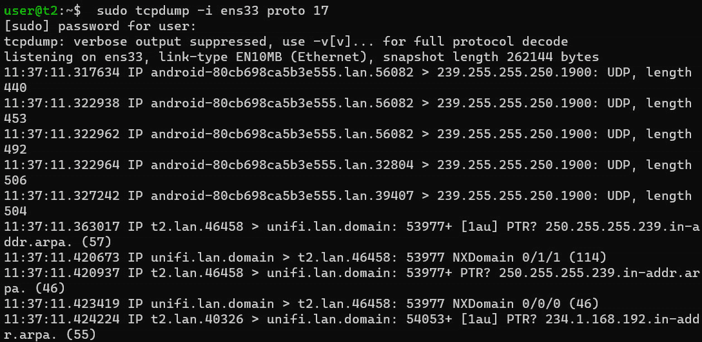

图 8.14 – 使用 BPF 过滤器的 tcpdump

让我们来看一下一个更直观的数据包捕获软件——Wireshark。它具有非常相似的功能；然而，你可以在捕获数据包时进行实时分析。

#### Wireshark

另一方面，Wireshark 是一个用户友好的图形化网络协议分析工具。它提供了详细、丰富的视觉界面，用于检查捕获的数据包。Wireshark 可以直接打开并分析 tcpdump 捕获文件和来自网络接口的数据包。它比 tcpdump 在更高的抽象层次上操作，以更易于理解的格式呈现解剖和解码后的网络协议。调查人员广泛使用 Wireshark 来分析网络流量，寻找恶意活动、网络异常和数据泄露的证据。下图展示了 Wireshark 用户界面的简易视图：

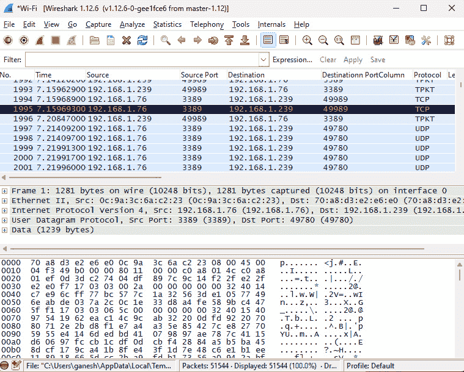

图 8.15 – Wireshark 用户界面

Wireshark 提供了许多功能来过滤数据包并通过其 UI 解析它们，且有清晰的信息说明如何处理和过滤数据包信息。某些备忘单已在本章的 *进一步阅读* 部分提到。

### CyberChef

CyberChef 是一个强大的基于 Web 的工具，广泛应用于各种数据处理任务，尤其在网络安全和数字取证中有着重要作用。它提供了一个用户友好的界面，并包含用于编码、解码、转换和分析各种格式数据的配方。在网络调查的背景下，CyberChef 对于处理和分析与网络相关的数据非常有用。以下是 CyberChef 在网络调查中的应用：

+   **数据转换**：网络调查人员经常会在网络流量中遇到编码或混淆的数据。CyberChef 提供了多种数据转换操作，例如 base64 编码/解码、URL 编码/解码、XOR 操作等。这些转换可以帮助调查人员揭示网络数据包中隐藏的信息。

+   `grep` 函数可以在流量中搜索特定的模式、头信息或关键词。这有助于识别重要的细节，如 IP 地址、域名或文件路径。

+   **哈希和加密**：CyberChef 支持各种哈希和加密/解密技术。调查人员可以对字符串或文件进行哈希处理，检查是否与已知的恶意哈希匹配。此外，如果能够访问所需的密钥，他们还可以尝试解密加密的数据。

+   **解析和解码协议**：通过自定义配方，CyberChef 的功能可以扩展。调查人员可以创建配方，解析和解码网络协议，如 HTTP、DNS 和 SMTP。这有助于从协议头信息和负载中提取有意义的信息。

+   **文件切割**：如果网络流量包含文件传输，CyberChef 可以用于检索和重建文件。这在调查潜在的数据外泄或恶意软件传播时特别有用。

+   **数据可视化**：CyberChef 可以帮助可视化数据转换和处理，使我们更容易理解数据在网络中传输过程中是如何变化的。数据可视化有助于识别异常或可疑的模式。

+   **自动化工作流**：CyberChef 允许用户创建并保存配方，从而实现重复数据处理任务的自动化。这可以显著加快调查过程，并确保数据处理的一致性。

+   **协作与共享**：CyberChef 配方可以在调查人员之间共享，允许团队成员之间进行协作和知识共享。这可以帮助经验较少的团队成员从其他成员的专业知识中受益。

+   **快速分析**：对于小规模数据的快速分析，CyberChef 的简易界面可以提供即时的洞察，无需复杂的脚本或编程。

下图展示了 CyberChef 使用的一个示例。如前所述，CyberChef 提供了预定义的食谱（算法）来解析给定的数据集。它是网络调查人员和数字取证调查人员的一个有用工具。在这个示例中，我们从 AWS 导出了日志，并在 CyberChef 中解析它。日志导出为 JSON 格式；如果导出的数据需要正确格式化，阅读起来可能会有些棘手。一旦定义了食谱，调查人员可以拖放证据并查看输出结果：

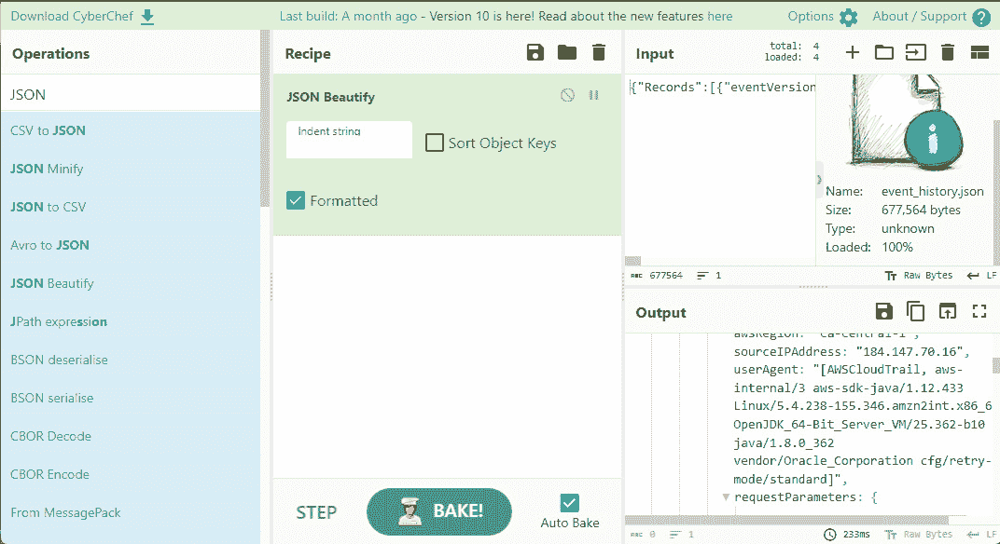

图 8.16 – CyberChef 使用示例

正如我们所看到的，CyberChef 是一个使调查人员能够扩展其能力和创造力的工具，用于解决调查挑战。CyberChef 自带预定义的食谱，而其他调查人员也发布了一些食谱组合，可以应用于应对复杂的取证情况。我们在本章的*进一步阅读*部分中为您提供了备忘单，供参考。

在接下来的部分，我们将转向恶意软件调查。虽然关于这个话题可以写一本书，但下一部分的目的是为恶意软件调查概念提供一个快速复习，并说明如何在通过主机或网络取证调查捕获一些证据后，探索其中的部分信息。我们将介绍如何设置实验室环境，以及一些在调查过程中可能会用到的基本工具。

# 恶意软件调查

恶意软件调查是任何事件响应中的关键组成部分，涉及识别、分析和应对环境中恶意软件的系统化过程。恶意软件调查的主要目标是了解恶意软件的性质、潜在影响及其渗透的程度。这些信息对于做出有关隔离、根除和恢复的决策至关重要。

恶意软件分析师进行深入分析，剖析恶意软件的代码和行为，以揭示其功能、通信方式以及可能被利用的漏洞。这些信息有助于了解危害的程度，并帮助制定相应的对策。影响评估评估恶意软件造成的损害，包括被侵害的数据和受影响的系统，以便优先处理响应行动。

随后是消除阶段，即使用定制的病毒特征码清除恶意软件、删除文件和修补漏洞。消除后，恢复工作开始，并对事件响应过程进行评估，将经验教训整合到未来的策略中。对于需要法律行动或更深入理解的情况，法医分析保留证据，记录攻击细节，并促进与执法部门的潜在合作。这个全面的过程确保了对恶意软件事件的彻底和有效应对，保护了组织的完整性和安全性。

在云环境中，恶意软件分析引入了独特的挑战和考虑因素，因为云计算具有分布式和动态的特性。基于云的恶意软件分析是在云平台上托管的虚拟化或容器化环境中检查恶意软件。

如我们所见，恶意软件分析紧跟事件响应过程，提供对遏制和消除威胁至关重要的关键指标。

然而，为了进行恶意软件分析，你需要一套专门的工具和完全隔离的环境，以确保调查人员不会在其设备上引爆恶意软件，从而泄露调查信息的工作文件。因此，恶意软件分析总是在实验室环境中进行。

## 搭建你的恶意软件分析实验室

在本节中，我们将讨论如何搭建恶意软件分析实验室的基本架构。对于本地实验室，恶意软件分析师通常使用虚拟基础设施，以便于拆除和重建新的设置。一旦恶意软件在实验室中被引爆，它会留下痕迹或遗留物，必须仔细研究。同样，调查人员也可以在云中搭建恶意软件实验室。然而，如果你在云中引爆恶意软件，必须确保它不会危及到其他租户，并确保恶意软件实验室是被封锁的。

以下图示展示了搭建恶意软件分析实验室的示例和一些关键组件。如前所述，调查人员在处理恶意软件及其相关遗留物时必须格外小心。恶意软件是活跃的，也可能感染或危及调查人员的计算机。因此，大多数调查人员将在实验室中操作恶意软件。这类似于处理炸药并确保它不会造成损害。在下图中，每个连接都通过防火墙进行保护，并且不允许直接访问引爆虚拟机。这是逆向工程师可以探索恶意软件并理解其功能的地方：

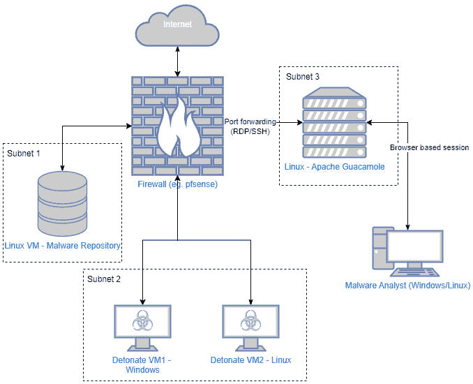

图 8.17 – 恶意软件分析实验室架构

以下是实验室的一些关键组成部分：

+   **防火墙**：任何防火墙，无论是物理的还是虚拟的，都应该是有效的。所有通往恶意软件托管虚拟机的网络连接都应得到安全保护和过滤。在我们的示例中，我们使用 pfSense，它是一个流行的防火墙设备，也可以进行虚拟部署。如果你计划在云中设置实验室，可以部署类似的防火墙。在此示例中，防火墙及其子网确保恶意软件实验室仅能通过特定的端口转发访问，而不能在内部网络中广泛访问。

+   **恶意软件库**：一个专用的应用程序，带有一个数据库，可以安全地存储恶意软件。我们使用基于 Python 的 Viper 框架应用程序，它支持文件和静态恶意软件分析。它还包含一个数据库，用于存储恶意软件，并帮助整理恶意软件和漏洞样本。

+   **引爆虚拟机**：这些是专用虚拟机，托管在一个独立的子网中，用于引爆恶意软件或允许逆向工程师探索恶意软件的内部工作原理。需要注意的是，调查人员必须安全配置恶意软件虚拟机，所有网络连接都必须小心允许。例如，在引爆恶意软件时，如果需要连接到互联网，在允许互联网访问恶意软件时必须谨慎。引爆虚拟机可以是预先构建的；你可以使用任何免费的开源恶意软件分析虚拟机，例如基于 Linux 的**Remnux**或**SANS SIFT 工作站**，或者你可以根据自己的工具来构建一个。你还可以基于 Windows 构建，如 Mandiant 的**Flare VM**，它提供脚本来设置必要的软件并加强虚拟机的安全性。你还可以直接从微软下载 Windows 10 或 Windows 11 的限时版本，免费提供 90 天许可证，到期后可以重新安装。这样可以确保你的 Windows 和恶意软件分析工具始终保持最新。

+   **Apache Guacamole**：Apache Guacamole 是一个开源的远程桌面网关，提供基于 Web 的远程桌面和应用程序访问。它允许用户通过网页浏览器会话访问桌面环境和应用程序，而无需在客户端安装额外的软件。Guacamole 支持多种远程桌面协议，如 VNC、RDP 和 SSH。使用 Apache Guacamole 的最大好处是可以实施额外的控制措施，例如限制复制粘贴以及限制网络驱动器和打印机的访问权限。这一点至关重要，因为你不希望恶意软件扩散或跳出虚拟机的安全网络区域。

+   **恶意软件分析虚拟机**：这是专门用于通过 Apache Guacamole 通过网页浏览器会话安全访问恶意软件网络的。访问恶意软件实验室时，始终建议使用专用工作站来访问该实验室环境，并且不得用于其他任何目的。

调查人员还可以选择通过利用免费的开源工具，在云中部署类似架构进行恶意软件分析。如果需要搭建一个更大的恶意软件分析工作台，也可以部署不同版本的恶意软件分析架构。一个例子是日本的 JPCERT 团体，他们开发了一种架构，将实验室部署到云端进行内存取证和分析。JPCERT 的内存取证实验室的链接可在 *进一步* *阅读* 部分找到。

让我们深入探讨一些调查人员在处理打包恶意软件及同一恶意软件的多个版本时经常遇到的常见特征。

## 处理打包恶意软件

恶意软件逆向工程师遇到的主要挑战之一就是打包恶意软件。打包工具是企业和威胁行为者用来压缩和加密代码的工具。在威胁背景下，恶意软件代码被打包并部署在一个环境中，使得逆向工程师更难分析。请注意，我们使用了 *更难* 而不是 *不可能*。威胁行为者的目标是让检测和研究变得更加困难，从而使得调查人员无法在威胁对组织造成严重影响之前，创建出检测包。这些打包工具有助于混淆代码，使得理解恶意软件的功能变得困难。历史上，一些打包工具被调查人员频繁观察到，并且是威胁行为者的首选：

+   **Ultimate Packer for eXecutables**（**UPX**）：这是一款非常流行且广为人知的可执行文件打包工具。UPX 是一个开源工具，可以保护可执行文件包。解包 UPX 打包的可执行文件相对简单。任何常用的 **便携式可执行文件**（**PE**）分析器都能检测到一个给定的可执行文件是否被打包。以下图示展示了一个现实世界恶意软件的左右对比；左侧是 UPX 打包的文件，右侧则是未打包或未压缩的文件。请注意每个部分的大小。记住，UPX 会压缩恶意软件二进制文件；因此，未打包的二进制文件的大小和内存地址位置会有所不同。虽然这是一个简化的版本，但复杂的威胁行为者可以通过应用多个打包层次或多种打包工具使其变得更加复杂：


图 8.18 – UPX 打包与未打包恶意软件对比

+   **Armadillo**: Armadillo 是一种商业打包工具，采用了代码加密、虚拟化、反调试措施和动态解包等技术，以防止可执行代码被逆向工程和分析。尽管其目的是用于合法用途，但威胁行为者利用其功能来模糊恶意软件，使得安全研究人员的研究和检测工作变得更加具有挑战性。

+   **Themida**：Themida 是一款商业软件保护工具，通常由软件开发人员用于保护他们的应用程序免受逆向工程和未经授权的访问。像 Armadillo 一样，它采用了复杂的技术，如代码混淆、加密和反调试措施，使研究人员很难破解打包代码的功能。此外，Themida 还提供了反篡改机制和虚拟化技术，进一步增强了保护功能。尽管最初是为了合法目的设计的，但我们已经看到威胁行为者将 Themida 重新用于隐藏恶意软件并使安全解决方案的检测更加复杂。

尽管处理恶意软件打包工具可能会很棘手，但调查人员必须记住，无论什么样的代码在内存中执行，打包过的代码总有一个解包和解码的过程，然后才会在内存中运行。无论威胁行为者使用什么打包工具，逆向工程师可能选择手动调试打包的恶意软件，揭示其解包后的代码，并调整其他相关参数，以便进一步分析恶意软件。

调查人员常常遇到的另一个具有挑战性的情况是同一二进制文件的多个版本。这引发了关于威胁行为者可能部署了多少版本以逃避检测的担忧；处理同一二进制文件的不同版本增加了调查的复杂性。

## 二进制比较

二进制比较是计算机科学和软件工程中用于确定两个二进制文件之间差异的过程，这些文件包含编译后的代码或机器可读的数据。此比较涉及分析文件的各个字节或位，以识别内容、结构和代码序列的变化，或通过评估**控制流图**（**CFG**）来进行比较。二进制比较通常用于版本控制、软件调试、恶意软件分析和数字取证等任务。通过识别二进制文件之间的差异，开发人员、分析师和研究人员可以了解代码的变化、跟踪修改、检测篡改，并发现恶意软件能力的潜在变化。以下屏幕截图展示了一个 Windows 程序的 CFG 格式示例，展示了程序中的各种决策树、跳转点、网络访问和复杂性。我们使用一款名为 **ProcDot** 的免费开源工具来进行此操作。以下截图仅供说明，展示代码的复杂性：

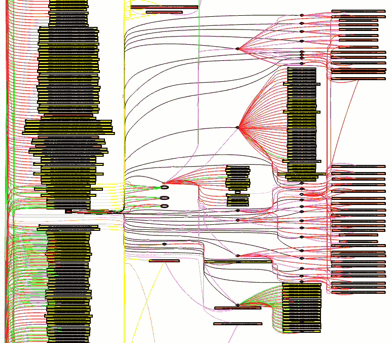

图 8.19 – 应用程序 CFG 的压缩视图，包含读写路径

CFG 是计算机科学和软件工程中用于可视化程序或软件应用程序中控制流的图形表示。它通过描绘程序的基本块（具有单一入口点和单一出口点的代码段）及其之间的连接，展示程序执行可能采取的各种路径。每个基本块通常对应一系列按顺序执行且没有分支的指令。CFG 使用节点表示基本块，使用边表示基本块之间的控制流，指示程序可以根据条件或循环结构在不同的代码部分之间进行分支或跳转。CFG 特别有助于理解程序行为、分析代码路径、检测潜在的错误或漏洞，尤其在比较可执行文件的相似版本时非常有用。它们通常用于程序分析、优化、调试和安全研究。接下来，我们将看看一些用于比较二进制文件的专业工具。

### BinDiff

**BinDiff** 是由 **Zynamics** 开发的软件比较工具，Zynamics 是一家被 Google 收购的公司。BinDiff 主要用于分析和比较二进制文件，如可执行文件、库文件以及其他编译后的代码。它广泛应用于逆向工程和恶意软件分析，用于识别软件版本之间的相似性与差异，或在不同的二进制文件中寻找共同的代码模式。

总结来说，虽然我们回顾了一些用于恶意软件调查的基本工具，研究人员开发了各种工具，调查人员必须保持与时俱进，以便在发现需要专门工具的复杂恶意软件时能够利用它们。了解市场上有这些工具，比单纯了解工具本身更为重要。鉴于威胁行为者不断改变恶意软件的创建方式以使我们难以应对，保持对恶意软件开发者所使用的技术、方法和概念的跟进非常重要。在接下来的部分，我们将比较传统取证与云取证，并揭穿一些常见的误解。

# 传统取证与云取证

传统取证与云取证在事件响应中扮演着关键角色，但由于其所针对的环境不同，它们在重点和方法上存在差异。

它们的相似之处如下：

+   **证据收集**：传统和云取证都涉及收集和保存数字证据，以重建导致事件的过程。这可能包括收集内存转储、日志文件、网络流量和文件系统痕迹。调查人员通常使用云存储来存储大量的痕迹，无论底层的 CSP 是什么，因为大多数数据泄露事件都涉及 CSP 的云租户。在怀疑底层 CSP 已被攻破的情况下，建议调查人员将所有必要的痕迹保存到不同 CSP 的存储中或离线进行分析。

+   **分析技术**：这两个领域采用类似的技术来分析数字证据，如检查文件结构、元数据、时间戳和内存内容，以了解事件的时间线和范围。

+   **证据链**：在两种情况下，维护证据链至关重要，以确保证据的完整性和在法律程序中的可接受性。

以下是它们的区别：

+   **环境**：传统取证涉及物理设备，如计算机、服务器和移动设备。与此不同，云取证侧重于虚拟化和分布式环境，包括**基础设施即服务**（**IaaS**）、**平台即服务**（**PaaS**）和**软件即服务**（**SaaS**）。

+   **证据位置**：在传统取证中，证据通常存储在物理设备上。云取证中，证据可能分布在多个虚拟实例和存储服务中，需要采用不同的收集和保存技术。

+   **数据所有权**：由于云中的共享资源，数据的所有权和控制可能变得复杂。确定哪一方负责维护和提供证据访问可能更加具有挑战性。

+   **数据驻留**：数据可能存储在云中的不同地理位置，这可能影响不同司法管辖区的法律和监管考虑。

+   **网络流量**：在传统取证中，捕获网络流量相对简单。由于虚拟化网络和第三方服务的存在，在云环境中可能更难访问网络流量。

+   **日志和审计**：云环境通常提供广泛的日志记录和审计功能，提供更详细的活动信息。然而，访问和解读这些日志可能会很复杂。

+   **资源共享**：在云环境中，多个租户可能共享相同的物理硬件，这会影响证据的隔离和保存。

+   **事件响应工具**：由于架构差异以及需要专门针对云取证定制的工具，传统事件响应工具可能无法完全适用于云环境。

+   **法律和合规性**：由于司法管辖区问题、跨境数据传输和不同云服务提供商的条款，云取证可能涉及额外的法律和合规性挑战。

总结来说，尽管传统取证和云取证在证据收集和分析的基本原则上是相似的，但云取证引入了与云环境虚拟化和分布式特性（如容器化和无服务器架构）、共享资源以及与云相关的法律问题等方面的复杂性。事件响应人员和数字取证专家必须调整他们的实践，以有效应对传统系统和基于云的系统中的事件。

# 总结

正如我们在本章中所见，事件响应过程和威胁狩猎的基本原则大致相同，主要集中在寻找环境中的恶意行为。根据操作系统的不同，调查人员可以自定义应该收集哪些日志和证据，以及必须调查哪些内容。我们还看到，EDR（端点检测与响应）部署如何加速安全事件的控制和响应过程。请记住，事件响应过程是一项严谨的工作，调查人员需要严格遵循，以确保执行所有调查步骤。与此同时，事件被控制，并且不会对组织或被调查的终端设备带来进一步的风险。虽然本章的目的是介绍各种数据泄露调查的要素，但无疑建议调查人员保持对最新调查工具和技术的了解。

在下一章中，我们将探讨如何从云环境中收集这些证据。考虑到从云环境中收集必要证据的难度，我们将查看各种云服务提供商及其对收集取证包的支持。我们还将探讨在云中导出完整磁盘镜像与快速取证收集的选项。

# 深入阅读

+   *PE* *块*：[`archive.org/details/windowsntfilesys00naga/page/129`](https://archive.org/details/windowsntfilesys00naga/page/129)

+   *Windows 的内存转储文件选项概述*：[`learn.microsoft.com/en-us/troubleshoot/windows-server/performance/memory-dump-file-options`](https://learn.microsoft.com/en-us/troubleshoot/windows-server/performance/memory-dump-file-options)

+   *内核模式转储文件的种类*：[内核模式转储文件的种类 - Windows 驱动程序](https://blog.cloudflare.com/bpf-the-forgotten-bytecode/) | [Microsoft Learn](https://andreaskaris.github.io/blog/networking/bpf-and-tcpdump/)

+   *极好的威胁* *狩猎*：[`github.com/0x4D31/awesome-threat-detection/tree/master`](https://github.com/0x4D31/awesome-threat-detection/tree/master)

+   *BPF – 被遗忘的* *字节码*：[`blog.cloudflare.com/bpf-the-forgotten-bytecode/`](https://blog.cloudflare.com/bpf-the-forgotten-bytecode/)

+   *BPF 与* *tcpdump*：[`andreaskaris.github.io/blog/networking/bpf-and-tcpdump/`](https://andreaskaris.github.io/blog/networking/bpf-and-tcpdump/)

+   *传输控制协议*: [`datatracker.ietf.org/doc/html/rfc793`](https://datatracker.ietf.org/doc/html/rfc793)

+   *Wireshark Cheat Sheet*: [`cdn.comparitech.com/wp-content/uploads/2019/06/Wireshark-Cheat-Sheet-1.jpg.webp`](https://cdn.comparitech.com/wp-content/uploads/2019/06/Wireshark-Cheat-Sheet-1.jpg.webp)

+   *CyberChef*: [`gchq.github.io/CyberChef/`](https://gchq.github.io/CyberChef/)

+   *CyberChef Recipes*: [`github.com/mattnotmax/cyberchef-recipes`](https://github.com/mattnotmax/cyberchef-recipes)

+   *Flare VM*: [`github.com/mandiant/flare-vm`](https://github.com/mandiant/flare-vm)

+   *REMnux：用于恶意软件分析的 Linux 工具包*: [`remnux.org/`](https://remnux.org/)

+   *SIFT Workstation*: [`www.sans.org/tools/sift-workstation/`](https://www.sans.org/tools/sift-workstation/)

+   *JPCERT Coordination Center-Memory Forensics*: [`github.com/JPCERTCC/MemoryForensic-on-Cloud`](https://github.com/JPCERTCC/MemoryForensic-on-Cloud)

+   *构建自定义恶意软件分析实验室环境*: [`www.sentinelone.com/labs/building-a-custom-malware-analysis-lab-environment/`](https://www.sentinelone.com/labs/building-a-custom-malware-analysis-lab-environment/)

+   *获取 Windows 11 开发环境*: [`developer.microsoft.com/en-us/windows/downloads/virtual-machines/`](https://developer.microsoft.com/en-us/windows/downloads/virtual-machines/)

+   *利用 Microsoft Graph API 进行内存取证*: [`medium.com/comae/leveraging-microsoft-graph-api-for-memory-forensics-7ab7f9ea4d06`](https://medium.com/comae/leveraging-microsoft-graph-api-for-memory-forensics-7ab7f9ea4d06)

+   *数字取证 - 最常用的工具*: `medium.com/@KhalilAfridii/digital-forensic-most-commonly-used-tools-4a9dbb98f926`

+   *CyLR*: [`github.com/orlikoski/CyLR`](https://github.com/orlikoski/CyLR)

+   *Kansa*: [`github.com/davehull/Kansa`](https://github.com/davehull/Kansa)

+   *PSHunt*: [`github.com/Infocyte/PSHunt`](https://github.com/Infocyte/PSHunt)

+   *PowerForensics*: [`github.com/Invoke-IR/PowerForensics`](https://github.com/Invoke-IR/PowerForensics)
