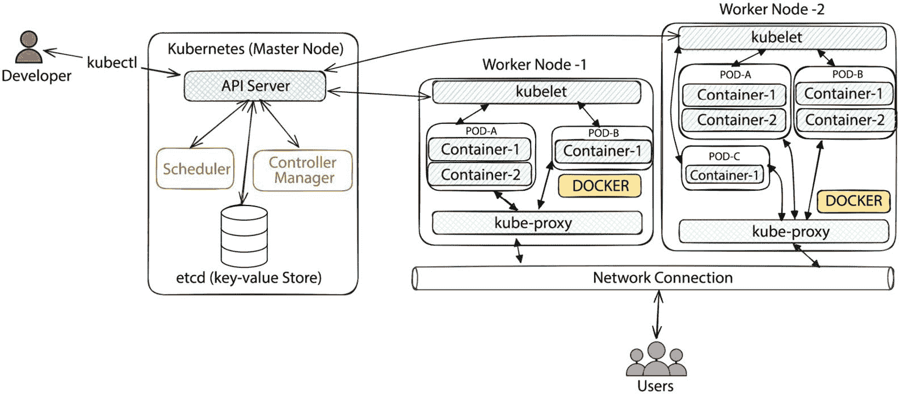
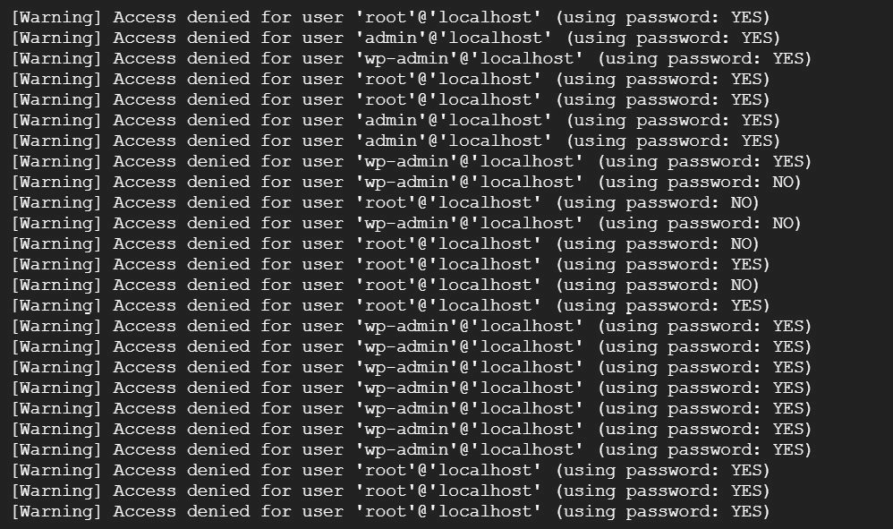

### 分析受损容器

到目前为止，我们已经了解了一些标准方法和技术，用于获取和分析 **虚拟机**（**VM**）和云服务的取证镜像。然而，开发和分析一个容器化环境带来了全新的挑战。

在今天的技术环境中，容器化和 Kubernetes 协调已成为现代应用程序部署的基础；因此，确保这些容器的安全至关重要。容器在效率和可扩展性方面提供了巨大的好处，但也带来了新的挑战，其中安全性是最重要的关注点。

本章旨在了解容器的架构以及如何通过 Kubernetes 管理和协调容器。

在本章中，我们将讨论以下主题：

+   什么是容器？

+   检测和分析受损容器

# 什么是容器？

**容器**是轻量级的、独立的、可执行的包，包含运行软件所需的所有内容，包括代码、运行时、系统工具、库和设置。它们被设计用来在不同的计算环境中提供一致性，从开发和测试到生产部署，通过将应用程序及其依赖项封装在容器化环境中。

容器化部署的一些关键优势包括以下几点：

+   **隔离性**：容器使用操作系统级虚拟化来创建隔离的环境。每个容器与主机共享相同的操作系统内核，但独立运行，确保与同一系统上其他容器的隔离。

+   **可移植性**：容器具有高度的可移植性，允许你在各种平台上（如 Linux 发行版或云服务提供商）一致地运行相同的应用程序。Docker 和容器运行时等容器化技术实现了这种可移植性。

+   **轻量级**：与传统虚拟机相比，容器更加轻量。它们消耗更少的系统资源，因为它们不需要完整的操作系统，只包含应用程序及其依赖项。

+   **资源效率**：容器启动和停止速度快，使得它们在根据工作负载变化动态地扩展和缩减应用程序时更为高效。

+   **不可变基础设施**：容器通常是从预定义的镜像创建的。当你需要更新应用程序时，可以构建一个新的容器镜像并加入更改，从而确保基础设施的一致性和可重复性。

+   **协调**：像 Kubernetes 这样的容器协调平台提供了容器化应用程序的自动化管理，包括扩展、负载均衡和自愈，使其适用于部署和管理基于微服务的架构。

+   **版本控制**：容器镜像可以进行版本控制，这使得在出现问题时可以轻松回滚到之前的版本。这支持更可控的软件开发和部署过程。

+   **安全隔离**：容器提供一定程度的安全隔离。然而，正确配置和管理容器是至关重要的，只有这样才能确保遵循适当的安全实践。

+   **DevOps 与 CI/CD**：容器是**DevOps**实践中的基础工具，因为它们促进了**持续集成与持续部署**（**CI/CD**）流程，使软件开发和交付过程更加高效和自动化。

+   **微服务**：容器通常用于微服务架构，其中应用被拆分成小型、独立的服务，能够单独部署和扩展。

## Docker 与 Kubernetes

尽管 Docker 和 Kubernetes 是最流行的容器化技术，但它们各自服务于不同的目的：

+   **Docker**：**Docker** 是一个容器化平台，允许开发者将应用及其依赖打包成一个单一、可移植的容器单元。容器轻量且高效，为在不同系统上运行应用提供了一致的环境。Docker 通过封装应用运行所需的一切，简化了开发过程，确保应用从开发者的笔记本电脑到生产服务器的运行一致性。

    Docker 的易用性和用户友好的**命令行界面**（**CLI**）使得它在开发者和运维团队中极为流行。它是本地开发、创建容器镜像以及通过 Docker Hub 或私有注册表共享镜像的宝贵工具。Docker 的主要关注点是应用打包和分发，通常被用作构建可以在不同环境中运行的容器镜像的基础。

+   **Kubernetes**：**Kubernetes**，常简称为**K8s**，是一个开源的容器编排平台，负责管理容器化应用的部署、扩展和运行。虽然 Docker 主要关注单个容器的打包和运行，Kubernetes 则通过将多个容器编排成组或服务，采用更高层次的方式进行管理。它自动化了负载均衡、扩展、滚动更新和自愈等任务，非常适合复杂和分布式的应用架构。

    Kubernetes 对于基于微服务的应用特别有价值，尤其是在多个容器需要无缝协作的情况下。它抽象了底层基础设施，并提供了一个统一的 API 来管理不同环境中的容器，比如本地服务器、公有云或混合环境。Kubernetes 确保**高可用性**（**HA**）、**容错性**（**FT**）和资源效率，使其成为现代容器化应用部署的基石。

简而言之，Docker 和 Kubernetes 是相辅相成的技术。Docker 非常适合创建和打包单个容器，而 Kubernetes 是用于协调、扩展和管理这些容器在更大生态系统中的理想解决方案。它们可以一起使用，Docker 提供的容器镜像由 Kubernetes 部署和协调，帮助组织构建和管理具有弹性、可扩展且高效的容器化应用。选择 Docker 还是 Kubernetes 主要取决于你的具体需求以及你所处的应用生命周期阶段。

容器已经彻底改变了应用程序的开发、部署和管理方式，提供了一种一致且高效的方式来打包和运行跨多个环境的软件。在下一节中，我们将深入探讨容器的类型及其应用场景。

## 容器类型及其使用场景

如前一节所示，容器是以各种形式打包的应用程序。接下来是一些容器的形式及其潜在的使用场景：

+   **Docker 容器**：Docker 容器可能是最著名且最广泛使用的类型。Docker 提供了一个平台，用于开发、传输和运行容器应用。Docker 容器具有高度的可移植性且易于管理，使其适用于各种使用场景。

+   **Linux 容器（LXC）**：LXC 是一种操作系统级虚拟化方法，利用 Linux 内核的组和命名空间来创建隔离的环境。LXC 容器不如 Docker 容易使用，但提供更多的灵活性和控制，因此适合需要定制的特定场景。

+   `rkt`（发音为 *rocket*）是一个侧重于安全性和简洁性的替代容器运行时。它设计得比 Docker 更加安全和轻量，在某些 Kubernetes 部署中被使用。

+   `containerd` 是一种行业标准的核心容器运行时，广泛应用于各种容器平台和编排系统。它旨在成为一个简单且可靠的容器运行时。

+   **Podman 容器**：Podman 是一款开源容器管理工具，兼容 Docker，但提供更安全、无 root 权限的容器体验。它适用于需要 Docker 兼容性并且增加了安全性的场景。

+   **OpenVZ 容器**：OpenVZ 是一种提供轻量级虚拟化的容器化技术。它与传统容器不同，因为它使用共享内核，提供比典型容器更多的隔离性，但比完全虚拟化少。

+   **FreeBSD Jail**：FreeBSD Jail 与 Linux 容器类似，但它是专为 FreeBSD 操作系统设计的。它为 FreeBSD 系统提供了轻量级的虚拟化。

+   **Windows 容器**：Windows Server 也支持容器化，尽管大多数容器与 Linux 相关联。Windows 容器能够在隔离的环境中运行基于 Windows 的应用程序。

+   `systemd-nspawn`是`systemd init`系统提供的一种容器化工具。它提供轻量级的操作系统级虚拟化，通常用于 Linux 系统中的开发和测试环境。

+   **Kata 容器**：Kata 容器是一个开源项目，它结合了虚拟机的安全性优势和容器的高效性与速度。它旨在处理需要高等级隔离的工作负载。

以下是企业通常利用容器化环境部署的一些使用案例：

+   **应用打包和分发**：容器将应用程序及其所有依赖项打包成一个单一的、可移植的单元。这确保了在不同环境中（从开发到生产）的应用程序部署的一致性和可靠性。

+   **微服务架构**：容器是微服务的核心，在微服务架构中，应用程序被拆分成小的、独立的服务。每个微服务都在自己的容器中运行，从而实现可扩展性、灵活性和易于维护。

+   **开发和测试**：开发人员使用容器创建隔离的开发和测试环境，以模拟生产条件。这确保了应用程序按预期运行，并消除了“*在我* *的机器上工作*”的问题。

+   **CI/CD**：容器支持流畅的 CI/CD 管道。开发人员将代码及其依赖项打包到容器中，进行自动化测试、部署和扩展，从而提高软件交付速度和可靠性。

+   **多云和混合云部署**：容器可以在不同的云服务提供商和本地环境中保持一致的运行。这使得容器适用于多云和混合云策略，从而实现云无关的应用程序部署。

+   **隔离和安全性**：容器提供了轻量级的应用程序隔离，增强了安全性，并减少了应用程序之间发生冲突或出现漏洞的风险。

+   **传统应用程序现代化**：容器可以封装传统应用程序，使其更加可移植且易于管理。这帮助组织在不重写代码的情况下实现现有系统的现代化。

+   **可扩展性和负载均衡**：容器可以根据工作负载的变化快速进行扩展或缩减，这使它们非常适合需要弹性扩展和高效资源利用的应用程序。

+   **有状态和无状态**：容器可以用于有状态和无状态应用程序。像数据库这样的有状态应用程序可以在容器中运行，而无状态服务可以水平扩展。

+   **资源效率**：容器是轻量级的，相比传统虚拟机（VM），它们需要更少的系统资源，从而提高了资源利用率并节省了成本。

+   **编排**：如 Kubernetes 等容器编排平台提供了容器的自动化管理。它们处理扩展、负载均衡和自我修复，非常适合复杂的应用程序架构。

+   **高可用性（HA）和灾难恢复（DR）**：容器可以在多个节点和数据中心之间进行编排，以确保 HA 和 DR 能力，从而减少停机时间和数据丢失。

+   **服务发现和负载均衡**：容器可以轻松与服务发现和负载均衡解决方案集成，以确保服务之间的高效通信和流量分配。

+   **内容交付和内容交付网络（CDNs）**：CDN 使用容器来缓存和全球分发内容，从而减少延迟并提升内容交付性能。

+   **数据处理和分析**：容器用于运行数据处理和分析工作负载，为与数据相关的任务提供可扩展和隔离的环境。

+   **物联网（IoT）和边缘计算**：容器可以用于在边缘设备和物联网设备上部署和管理应用程序，将计算带到数据源附近。

+   **桌面虚拟化**：容器可用于桌面虚拟化，使用户能够运行具有特定应用程序和配置的隔离桌面环境。

在接下来的几节中，我们将探讨如何分析被破坏的容器，所需的步骤，以及可以应用于安全地收集容器化环境取证镜像的取证收集机制。

# 检测和分析被破坏的容器

大多数组织通过 Kubernetes 运营容器架构，因为它提供了更多可扩展的选项和灵活性。在深入探讨容器分析之前，理解 Kubernetes 的组成部分至关重要，因为它们在调查过程中将发挥关键作用。

## 关于 Kubernetes 编排平台

以下截图展示了 Kubernetes 集群的基本架构；总的来说，正如我们所知，Kubernetes 是一个编排框架，管理一个或多个运行容器的节点：



图 11.1 – 简单的 Kubernetes 架构

对于 Kubernetes 集群，你需要一个主节点来控制和协调集群的操作，以及运行由主节点分配的 Pod 和任务的工作节点。以下是 Kubernetes 集群中的一些关键组件：

+   `kubectl` 命令。API 服务器作为 RESTful API 服务器运行，这意味着它是一个无状态协议，服务器不会保留之前请求的信息。

+   **调度器**：调度器负责确定将 Pod 调度到集群中可用节点的最优位置。其主要功能是根据资源需求、节点亲和性以及用户定义的约束条件做出智能调度决策。通过评估每个节点上可用的资源，调度器旨在平衡集群中的工作负载，确保资源的高效利用。调度器还支持 Pod 优先级、抢占、亲和性规则和污点/容忍等功能，为工作负载分配提供灵活性和定制化。此外，Kubernetes 还允许创建自定义调度器，以满足特定的部署需求。

+   **控制器管理器**：Kubernetes 架构的核心组件之一，负责管理各种控制器，这些控制器调节集群的状态。每个控制器是一个独立的进程，负责监控并调和集群对象的实际状态与其在 Kubernetes API 服务器中定义的期望状态。控制器管理器管理的关键控制器包括以下内容：

    +   **复制控制器**，确保指定数量的 Pod 副本正在运行

    +   **节点控制器**，负责节点生命周期和服务账户

    +   **令牌控制器**，管理服务账户和 API 访问令牌的生命周期

    控制器管理器通过持续监控并调整集群以保持期望配置，从而增强 Kubernetes 的自愈能力，确保容器化应用的高可用性和弹性。

+   `etcd` 是一个分布式键值存储，Kubernetes 的核心，作为集群配置和状态的主要数据仓库。使用`etcd`可以确保跨分布式节点的强一致性和高可用性（HA），提供可靠性和容错（FT）。它在集群协调中扮演着至关重要的角色，允许 API 服务器和控制器管理器等组件同步并共享实时信息。`etcd`还支持数据备份、安全通信以及动态更新的监视机制，为 Kubernetes 集群的弹性和效率做出贡献，是管理容器化应用的关键基础。

+   `containerd`）用于管理节点上的容器，实施 Pod 规格中描述的期望状态。此外，kubelet 会对容器进行健康检查，并在必要时重启失败的容器，同时将节点的状态报告回控制平面。

+   `localhost`。这一设计使得它们可以轻松共享数据和依赖关系。Pods 是在 Kubernetes 上部署应用程序的基本构建块，它们封装一个或多个容器，包含共享的存储资源以及如何运行这些容器的选项。Kubernetes API 服务器管理 Pods，并可以根据容器化应用程序的动态需求对其进行复制、扩展和更新。

+   `kube-proxy` 是 Kubernetes 中一个至关重要的组件，负责网络代理和负载均衡。它在服务层面运行，通过维护网络规则并根据集群服务和端点的变化进行更新，促进 Pods 和服务之间的通信。`kube-proxy` 具备服务发现、负载均衡和管理 NodePort 服务的功能，确保集群内的高效和可靠的网络连接。它抽象了网络的复杂性，在 Kubernetes 环境中，`kube-proxy` 扮演着实现容器化应用程序各个组件之间无缝通信的关键角色。

你可以通过运行以下命令来探索 Kubernetes 架构：

```
kubectl get pods -n kube-system --show-labels
see various parts of Kubernetes architecture, such as the kube-dns, kube-proxy, the gke for Google Kubernetes Engine (GKE):
```


图 11.2 – 与 GKE 集群系统相关的 Pods 列表（无应用程序 Pods）

在下一节中，我们将重点讨论如何提取日志进行调查。现在我们已经了解了 Kubernetes 架构，访问这些日志将变得更加容易和简便。

## 获取法医数据和容器日志进行分析

现在我们已经了解了 Kubernetes 架构的关键组件，让我们看看调查人员如何从集群中获取日志/证据。

### 容器日志

Kubernetes 集群内通常可以找到各种日志；其中一些是操作日志，意味着它们与集群的健康状态相关，而另一些则与容器内运行的应用程序相关。这些日志对于**数字取证与事件响应**（**DFIR**）团队来说特别有用，可以帮助调查涉及 Kubernetes 集群的恶意活动。

为了理解日志，我们将其分为两类——操作日志和安全日志——以及它们的使用场景。你会注意到，有些日志提供了操作性见解，安全日志则：

**操作日志**：

+   **API 服务器日志**：从 Kubernetes 架构的角度来看，API 服务器在确保 Kubernetes 集群高效运行中起着至关重要的作用。API 服务器日志提供有关 API 活动的见解，包括请求、响应和身份验证详细信息。具体而言，API 服务器日志有助于监控 API 服务器的健康状态、跟踪用户活动并排查与 API 相关的问题。

    你可以使用以下命令访问 API 服务器日志：

    ```
    kubectl logs -n kube-system <api-server-pod-name>
    ```

+   **控制器管理器日志**：提供与控制器活动相关的日志，如节点、复制和集群交互。对于监控控制器健康状况、跟踪控制器决策和理解复制及服务相关事件非常有用。您可以通过以下命令访问与控制器管理器相关的事件：

    ```
    kubectl logs -n kube-system <controller-manager-pod-name>
    ```

+   **调度器日志**：记录与 Kubernetes 调度器所做调度决策相关的日志，如 Pod 放置。此日志有助于理解和监控工作负载分配、调度决策和节点利用率。您可以通过以下命令访问 Kubernetes 控制器的特定日志：

    ```
    kubectl logs -n kube-system <scheduler-pod-name>
    ```

+   **kubelet 日志**：提供有关 Pod 生命周期事件、容器运行时交互和心跳的详细信息；与 kubelet 相关的日志提供关于 Pod 健康状况和运行时问题的见解。您可以通过以下命令访问与特定 Pod 相关的日志；请注意，此命令将获取与运行 Pod 相关的操作事件，而不是 Pod 内运行的应用程序日志：

    ```
    kube-proxy contains logs associated with proxying operations, network rules, and load-balancing activities. kube-proxy logs help monitor network-related issues and understand load-balancing issues. To access kube-proxy logs, the following command is utilized:

    ```

    etcd 节点。etcd 日志为监控 etcd 健康状况、跟踪集群状态变化以及理解与 etcd 相关的问题提供了关键的见解。您可以使用类似的命令访问 etcd 日志：

    ```
    journalctl -u docker or journalctl -u containerd. However, if you are running Kubernetes on a cloud platform such as GCP, the best way to access container runtime logs is via Logs Explorer or an equivalent log viewer offered by the cloud service provider (CSP).
    ```

    ```

    ```

+   `kubectl` 命令：

    ```
    kubectl logs -n kube-system <network plugin pod name>
    ```

+   **Ingress 控制器日志**：在外部网络流量无法连接到预期的 Kubernetes Pod 时，调查问题非常重要。常见原因可能是 ingress 控制器本身的配置错误。Ingress 控制器还负责终止 SSL/TLS 连接；监控这些事件可以提供关于因证书过期导致的服务中断的重要信息。类似于访问其他日志，您可以通过以下命令访问 Ingress 控制器日志：

    ```
    kubectl logs -n kube-system <ingress controller pod name>
    ```

**安全日志**：

+   **API 服务器日志**：从 DFIR 的角度来看，调查人员可以查看 API 服务器日志，以识别未经授权的访问尝试或身份验证失败。您还可以使用 API 服务器日志监控关键资源（如通过 API 服务器日志的 Pods）的可疑变化。

+   **kubelet 日志**：您可以使用 kubelet 日志来查找容器异常。kubelet 日志可以提供有关意外行为或网络活动的见解。您还可以使用 kubelet 日志来调查节点级别的活动、资源耗尽或异常活动。

+   使用 `etcd` 日志来识别数据损坏或不一致性。

+   使用 `tcpdump` 命令来验证网络流量活动：

    ```
    kubectl exec -it <pod-name> -- tcpdump -i eth0
    ```

    网络插件日志提供有关 Pod 之间恶意网络流量的见解，并识别横向移动的证据。

总的来说，Kubernetes 提供了一个框架，可以访问每个 Pod 内的日志；然而，如果集群运行在云平台上，调查人员还可以利用每个 CSP 提供的原生日志查看器，快速访问日志，而无需直接通过集群访问日志。在接下来的部分，我们将从两个角度来看待访问日志：通过集群直接访问和使用 CSP 的日志控制台访问 Kubernetes 集群日志进行调查。

### 检查容器运行时

假设你现在有一个运行在云上的 Kubernetes 集群和一个暴露给互联网、接受用户连接的 Pod（应用程序）设置。为了说明调查方法，我们定义一个场景。我们在 Google Cloud 上部署了一个 Kubernetes 集群，WordPress 和 MySQL 服务器作为 Pod 部署。正如下图所示，我们有三个 Pod 组成了应用的一部分：


图 11.3 – GKE 集群下的 Pod

这些 Pod 被配置为 MySQL 存储 WordPress 博客的内容和认证信息。作为调查人员，我们的任务是调查 MySQL 服务器上的暴力破解尝试。

现在，有多种方法可以解决这个问题。最流行的方法是使用 Google 的 Log Explorer。在我们使用云工具进行调查时，你也可以使用其他 CSP 执行类似的任务，只要 Kubernetes 日志被配置为在 CSP 的云日志工具中获取。目前，有两种方法可以调查/访问日志。一种是通过 Log Explorer，另一种是通过命令行。调查人员可以选择提取日志并进行分析。我们将探索这两种方法并确定结果。在调查 Kubernetes 之前，调查人员必须了解组织是如何部署 Kubernetes 集群及其架构的。

#### 选项 1 – Log Explorer

1.  一旦调查人员可以访问 Log Explorer，我们就可以直接开始定位与 WordPress 和 MySQL 服务器相关的活动。请记住，WordPress 是一个前端工具，而 MySQL 服务器提供后端数据库，是完整应用栈的一部分。

1.  通过初步筛查，我们知道发生了暴力破解尝试；资源使用仪表板可以验证这一点。以下是一个示例屏幕截图，显示了与 Kubernetes 集群相关的总体资源度量，突出了资源使用的增加：


图 11.4 – Kubernetes 集群资源使用

1.  一旦我们建立了基础知识，我们就进入 Log Explorer 页面。如果你熟悉查询 Log Explorer，你可以查询集群中 `default` 命名空间的日志，并且容器名称不是 `wordpress`。接下来是收集所有与 WordPress 无关的日志的搜索查询代码：

    ```
    resource.labels.namespace_name="default"
    -resource.labels.container_name="wordpress"
    ```

1.  通常，暴力破解尝试可以通过一系列失败的登录尝试后跟成功的登录尝试来识别。我们将修改前面的查询，以准确定位调查员失败的 MySQL 访问尝试。作为调查员，如果我们不熟悉 Google 的 Log Explorer 查询功能，我们可以随时点击并选择适当的过滤器，查询会自动更新：

    ```
    resource.labels.namespace_name="default"
    -resource.labels.container_name="wordpress"
    --Show similar entries
    textPayload=~"(\d{4}-(0[1-9]|1[0-2])-(0[1-9]|[12][0-9]|3[01])) ((\d{2}):(\d{2})(?::(\d{2}(?:\.\d*)?))?(?:(+-:?(?:\d{2})?|Z)?)) ((?:\d[,.]?)*\d) \[Warning\] Access denied for user '[^ =\t\n\r\f\"\(\)\[\]\|']+'@'localhost' \(using password: [^ =\t\n\r\f\"\(\)\[\]\|']+"
    --End of show similar entries
    ```

1.  一旦过滤掉日志，你可以迅速定位到与暴力破解攻击相关的日志。下一张截图展示了使用 Log Explorer 分析的结果。在截图中，你可以看到多次对 MySQL 的失败登录尝试后，才有一次成功登录。根据所部署的容器，某些日志还可能收集更详细的信息。在这种情况下，我们可以看到攻击者尝试使用不同的用户名进行登录，直到成功通过 `wp-admin` 账户连接到服务器。


图 11.5 – Kubernetes Pod 上暴力破解攻击的分析

接下来，我们将探讨如何通过命令行直接访问日志。

#### 选项 2 – 直接命令行访问（kubectl）

在无法访问 CSP 日志服务的情况下，作为调查员，你可以始终使用 `kubectl` 来访问这些独立的基于 Pod 的日志。

从 Pod 中访问日志相对容易。一旦列出了所有的 Pod，你可以使用`kubectl logs <pod name>`来访问完整的日志。日志默认打印到控制台；然而，你也可以将日志写入磁盘以供离线分析。在这种情况下，让我们提取与 MySQL Pod 相关的日志——`kubectl logs wordpress-1-mysql-0`。接下来的截图展示了与暴力破解攻击相关的日志：



图 11.6 – MySQL Pod 的日志摘录，证明暴力破解攻击

作为调查员，我们了解日志的重要性；在 Kubernetes 中，每个 Pod 都会有与其运行的应用程序相关的日志，以及其他操作日志。然而，了解如何访问这些日志至关重要，因为调查员对 CSP 日志控制台的访问也会极大地帮助他们，因为这些日志通常会保存得比查找 Pod 本身更久。

# 总结

本章探讨了 Docker 和 Kubernetes 之间的区别，强调了它们在全面的容器管理中的协作使用。我们深入研究了各种类型的容器及其具体应用场景，突出了它们在微服务架构等场景中的高效性。

此外，我们还研究了在 Kubernetes 环境中获取取证数据和日志以供分析，重点介绍了日志机制、工具和最佳实践，便于实际的取证分析，包括识别安全漏洞和事件调查。然而，访问 Kubernetes 日志是最直接的调查之一。如果 Kubernetes 部署在云端，云服务提供商（CSP）对于提供集中式日志浏览器进行长期日志访问至关重要。

在我们下一章中，我们将回顾 Microsoft 365 和 Google Workspace 托管的云生产力套件的分析。本章的重点是了解如何分析生产力套件中的常见威胁向量，以及调查人员可以访问哪些日志。

# 深入阅读

+   *Raft 一致性* *算法*： [`raft.github.io/`](https://raft.github.io/)

+   *集群* *网络*： [`kubernetes.io/docs/concepts/cluster-administration/networking/`](https://kubernetes.io/docs/concepts/cluster-administration/networking/)

+   *Kubernetes* *取证*： `medium.com/@cloud_tips/kubernetes-forensics-c1e558b10d53#:~:text=This%20can%20involve%20looking%20for,command%2Dline%20interface%20for%20Kubernetes`

+   *事件响应和* *取证*： [`aws.github.io/aws-eks-best-practices/security/docs/incidents/?source=post_page-----c1e558b10d53`](https://aws.github.io/aws-eks-best-practices/security/docs/incidents/?source=post_page-----c1e558b10d53)

+   *镜像* *安全性*： [`aws.github.io/aws-eks-best-practices/security/docs/image/`](https://aws.github.io/aws-eks-best-practices/security/docs/image/)

+   *CIS Kubernetes* *基准*： [`www.cisecurity.org/benchmark/kubernetes`](https://www.cisecurity.org/benchmark/kubernetes)

+   *2023 年十大* Kubernetes *安全工具*： `medium.com/@pdevsecops/10-top-kubernetes-security-tools-in-2023-df26642f995a`

+   *2023 年顶级 Kubernetes 安全工具*： [`www.armosec.io/blog/kubernetes-security-tools/`](https://www.armosec.io/blog/kubernetes-security-tools/)
