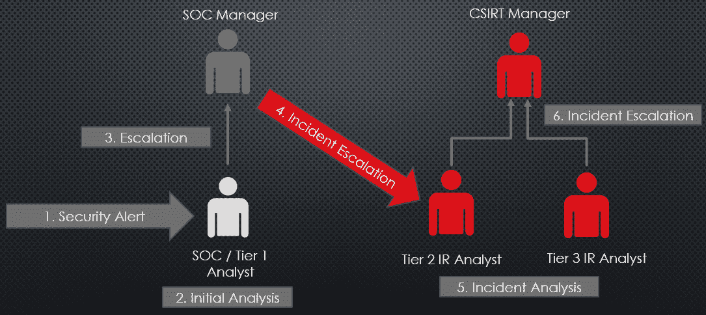
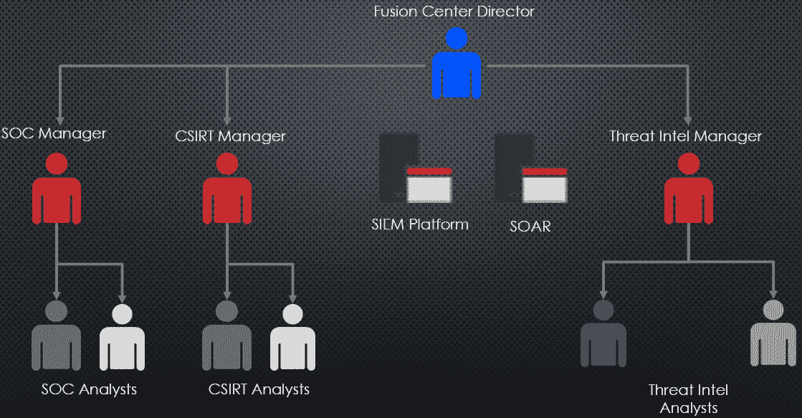
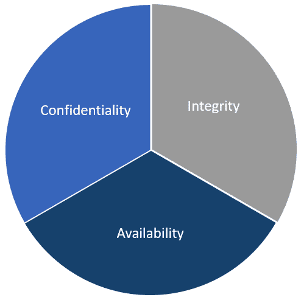
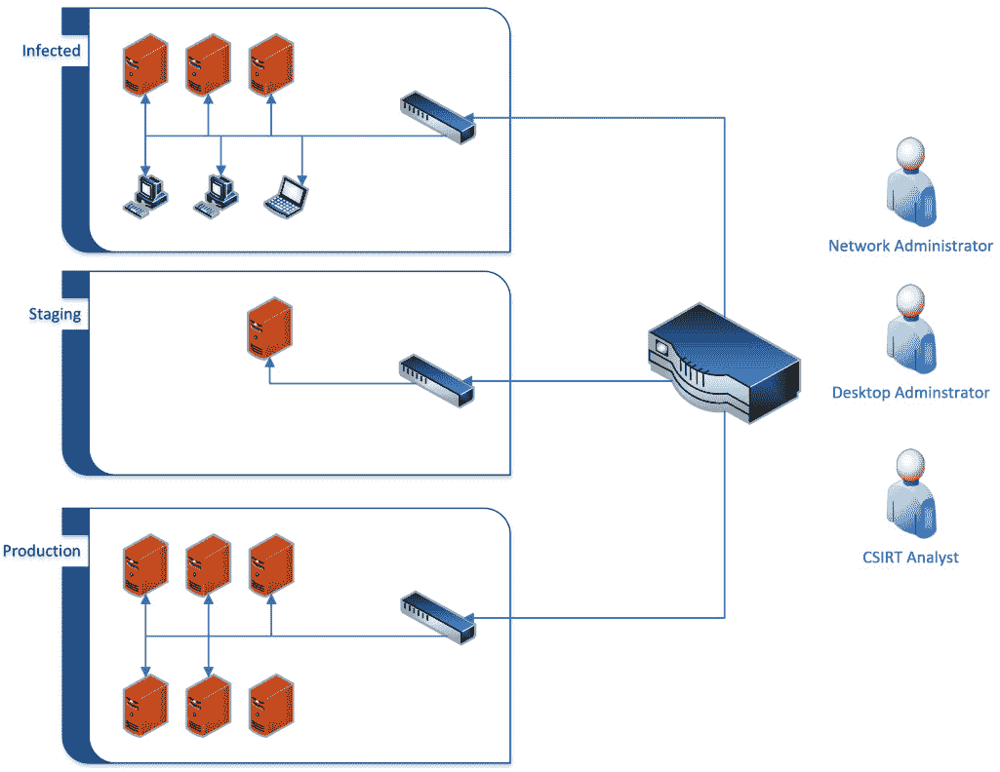

# 管理网络事件

上一章中详细介绍的事件响应框架提供了 **计算机安全事件响应团队**（**CSIRT**）的具体结构，并解释了 CSIRT 如何与其他业务部门进行互动。本章进一步扩展了组织应采取的必要计划和准备工作，以应对网络事件。不幸的是，计划和准备无法解决网络事件中固有的所有变量和不确定性。

本章将重点执行在 *第一章* 中详细阐述的计划和框架，以正确管理网络事件。对网络事件管理的坚实基础和理解可以帮助组织更高效地付诸实践，与关键利益相关者及时沟通，并且最重要的是，减少网络事件可能造成的损失或停机时间。

本章将讨论如何管理网络事件，涵盖以下主题：

+   参与事件响应团队

+   安全编排、自动化和响应

+   融入危机沟通

+   融入遏制策略

+   恢复正常 – 根除、恢复和事件后的活动

参与 CSIRT，就像联系消防部门一样，需要一个明确的升级路径。在以下章节中，有三个 CSIRT 模型，描述了在选择合适的升级路径时的一些选项。

# 参与事件响应团队

CSIRT 的功能与消防部门类似。消防部门有经过专门训练的专业人员，负责使用专门设备响应紧急情况，以遏制并根除火灾。为了联系消防部门，公民必须联系紧急服务并提供关键信息，如紧急情况的性质、位置以及是否有人命危险。然后，这些信息会传递给消防部门，消防部门派遣资源到紧急地点。

参与 CSIRT 的过程非常类似于联系消防部门。内部或外部人员需要将网络安全事件的指示升级到适当的人员。此后，资源会被派遣到适当的地点，在现场的人员将主导控制事件并消除或限制可能的停机时间或数据丢失。为了使这个过程尽可能高效，以下是参与过程中的关键组成部分：

+   CSIRT 模型提供了一个框架，将 CSIRT 和相关的升级程序纳入组织结构中

+   **战情室** 描述了 CSIRT 管理事件的地点

+   沟通解决 CSIRT 正确沟通的能力

+   人员轮换管理了在长期事件中需要休息人员的需求

## CSIRT 参与模型

组织如何使用其 CSIRT 能力，很大程度上取决于其结构。组织根据自身结构和资源配置 CSIRT，以便最好地促进快速升级，同时尽可能多地捕捉事件的细节，从而进行适当的调查。

### 安全操作中心升级

在这种组织模型中，**安全操作中心**（**SOC**）负责处理初步的事件检测或调查。一般来说，SOC 负责管理监控网络基础设施的安全工具。它可以直接访问事件管理、入侵防御和检测以及杀毒系统。在这里，它可以查看事件、接收和审查警报，并处理其他与安全相关的数据。

SOC 升级是拥有专门 SOC 的组织中常见的一种模式，无论是通过内部人员、第三方**托管安全服务提供商**（**MSSP**）还是**托管检测与响应**（**MDR**）提供商。在这种模式中，从初始通知到 CSIRT 的介入都有明确的步骤，具体如下：

1.  SOC 或一级分析员接收警报或检测。

1.  SOC 或一级分析员进行初步分析，然后确定警报或检测是否符合事件的标准。

1.  如果有必要，分析员将把事件上报给 SOC 经理。

1.  在 SOC 经理审核后，事件将被升级到值班的事件响应分析员。

1.  CSIRT 分析员将审查警报或检测，并根据事件的严重性判断是否需要启用整个 CSIRT 能力。

1.  根据事件的严重性，CSIRT 分析员将处理该事件或将其升级到 CSIRT 经理以启用整个 CSIRT 能力。

下图展示了从检测到升级至 CSIRT 经理的事件升级流程：

图 2.1 – SOC 参与模型

在此模型中，CSIRT 和 SOC 人员需要解决的几个关注问题如下：

+   首先，以这种方式介入 CSIRT 会导致在 CSIRT 完全介入之前有多个个人参与处理同一事件。这会增加从检测到 CSIRT 响应之间的时间，可能会增加事件的潜在影响。

+   其次，如果事件升级未被适当记录，CSIRT 经理将不得不与 SOC 经理进行沟通，澄清或获取更多信息，从而增加妥善处理事件所需的时间。

+   第三，SOC 人员需要接受培训，以确定哪些观察到的事件构成了事件，哪些可能是误报。CSIRT 可能会因 SOC 不断追踪误报而感到倦怠。

+   最后，SOC 与 CSIRT 之间的沟通需要清晰简洁。任何在实时共享信息能力上的差距都会导致额外的混乱。

这种模型的另一种变体，在没有专门 SOC 的组织中较为常见，是初步的安全事件由帮助台或网络运营中心接收。这增加了及时联系 CSIRT 的复杂性，因为这种人员通常没有接受处理此类事件的培训。

提示

在这种情况下的最佳实践是让这些团队中的几名人员接受网络安全分析培训，以应对初步的分类和适当的升级。

### SOC 集成模型

为了限制 SOC 升级模型的一些缺点，一些组织将 SOC 嵌入到整体 CSIRT 中。将 SOC 放入这种结构中可能更有效，因为 SOC 负责初步的警报和分类功能，而这些功能与 CSIRT 直接相关。

在此模型中，SOC 分析员充当第一层级。如前所述，他们首先看到安全事件或安全控制警报。处理并分类警报后，他们能够立即将事件升级到第二层级分析员，而无需与经理接触，然后再由经理将其升级到 CSIRT 经理。该过程在下图中有详细展示：

图 2.2 – SOC 集成模型

这个模型相较于之前的模型有一些明显的优势。首先，CSIRT 对 SOC 所看到和所做的事情有更大的可见性。此外，将 SOC 嵌入到 CSIRT 中使得 CSIRT 经理及其团队能够制定更有效的与事件相关的政策和程序。第二个明显的优势是，事件升级的速度更快，且更可能具有更高的精确性。由于 SOC 分析员直接向下一级 CSIRT 人员进行升级，整个过程更快，且最终会进行更详细的分析。

这种方法在拥有专门内部 SOC 且未外包的组织中运行良好。对于那些使用网络运营中心或帮助台，且没有专门 SOC 的组织而言，这种方法并不现实，因为这些功能通常由 CSIRT 或甚至网络安全团队之外的部门管理。另一个问题是，根据 SOC 和 CSIRT 的规模，可能需要额外的 CSIRT 经理来处理 SOC 和 CSIRT 的日常工作量。

### 融合中心

随着威胁情报在日常安全操作中扮演越来越重要的角色，一种应对这一趋势的组织结构就是 CSIRT 融合中心。在这种情况下，CSIRT 分析师、SOC 分析师和威胁情报分析师会在一个团队结构中合作。这种结构将 SOC 和 CSIRT 结合结构与专职威胁情报分析师的元素融合在一起。在这种情境下，威胁情报分析师将负责通过与事件相关的外部和内部资源来增强事件调查。他们还可以在与事件相关的其他领域提供详细分析。以下图表展示了从融合中心主管到负责事件管理的各个人员的工作流程：

图 2.3 – 融合中心模型

随着组织在其安全操作中不断发展威胁情报资源，这种模型使得 CSIRT 能够利用该能力，而无需创建新的流程。在*第十七章*中，我们将深入讨论威胁情报，并解释这一能力如何增强事件调查。

除了增加人员外，融合中心模型还使用了额外的技术。SOC 模型通常会使用**安全信息和事件管理**（**SIEM**）系统，通过日志和警报源提供网络可视性并检测入侵。融合中心还通常会使用**安全编排、自动化和响应**（**SOAR**），这一部分将在本章后续内容中讨论。这两个工具提供网络可视性，并在事件发生时能迅速切换到关键系统。

CSIRT 融合中心尚未广泛部署，主要是因为威胁情报整合是一种相对较新的方法论，且资源消耗较大。很少有组织具备足够的技术或人员资源来使这种结构有效运作。引入全职威胁情报分析师，以及各种付费和开源数据源（及其支持技术），往往会增加高昂的成本。因此，能够将全职威胁情报分析师作为 CSIRT 能力的一部分的组织并不多。

## 调查事件

一旦 CSIRT 介入，其主要任务之一就是调查事件。本部分的主要内容讲述了在调查事件时可以采用的各种方法。CSIRT 的主要目标是利用遵循系统分析的方法来处理事件的以下关键方面：

+   **确定范围**：在一些事件中，实际范围可能在初步检测阶段并不明确。例如，执法机构可能联系某个组织，表示已关闭一个 C2 服务器。在对该系统进行分析时，发现该组织的外部 IP 地址。从这一数据点开始，范围首先被定义为整个网络。然后，CSIRT（计算机安全事件响应小组）会分析防火墙或 Web 代理的数据，找出与 C2 服务器进行通信的内部系统。根据这些数据，他们将把事件的初步范围缩小到那些受到影响的系统。

在尝试确定事件的范围时，通常会试图找到“零号病人”，即第一个被攻破的系统。在某些事件中，这可能很容易发现。比如，包含 PDF 文档的网络钓鱼邮件，在打开后执行恶意软件，用户或安全控制措施通常能轻松识别。其他攻击可能就不那么明显了。虽然找到零号病人对于根本原因分析提供了大量数据，但更重要的是首先确定事件的范围，而不是只关注一个系统。

+   **确定影响**：另一个关键考虑因素是评估事件的影响。那些接触过信息安全基本概念的人，对**CIA 三元组**应该十分熟悉。CIA 三元组代表信息系统中的安全要素：**保密性**、**完整性**和**可用性**。任何安全漏洞或违反都将对这些要素中的一个或多个产生影响。例如，影响 15 台生产服务器的勒索软件事件，会影响这些系统中数据的可用性。与事件相关的可用性影响，无论是由于对手行为的直接结果，还是响应和修复所需的时间，都是决定事件影响的重要因素。其他事件，例如知识产权盗窃，则会影响数据的保密性。最后，涉及未经授权的源代码或其他数据篡改的事件，则会影响数据的完整性。下图突出显示了 CIA 三元组：

图 2.4 – CIA 三元组

了解事件的潜在影响对于决定分配响应资源的决策至关重要。针对网络上非关键服务的**分布式拒绝服务**（**DDoS**）攻击，不需要像发现零售支付基础设施中存在窃取信用卡信息的恶意软件时那样进行响应。影响也直接关系到合规性与法律和其他法规的遵守。了解事件对合规性的潜在影响，对于确保进行适当的响应至关重要。

+   **识别根本原因**：IT 专业人员和管理者在事件发生期间，尤其是在事件发生后，都会问的核心问题是：这到底是怎么发生的？组织在保护其基础设施上投入了大量的资金和资源。如果发生了影响性事件，就需要了解事件是如何发生的。事件调查的目标是确定导致事件及其影响的一系列事件、漏洞或其他条件。通常，事件的根本原因并非一个简单的漏洞，而是一系列事件和条件，它们使对手能够突破安全系统并进行攻击。通过调查，这些事件和条件可以被识别出来，以便进行修正或采取其他控制措施。

+   **事件归因**：事件调查中的一个争论点是事件归因。通过归因，CSIRT 或调查机构试图确定背后发动攻击的组织。事件可能归因于国家级行为者、犯罪团伙或其他网络对手。

尽管从威胁情报的角度来看，归因有一定的重要性（*第十七章*将讨论与事件响应相关的归因问题），但更好的资源应当用于调查或控制事件。试图查明负责攻击的团体是非常耗时的，且很少能得到积极的回报。如果组织的领导层坚持要确定归因，最好的方法是全面记录事件，并将数据交给专门处理归因的第三方。这类组织通常会将来自多个事件调查的数据结合起来，构建某些团体的档案。如果提供的数据与其中某个团体的活动相符，他们可能能够提供一些归因方面的背景信息。

## CSIRT 战情室

另一个在与 CSIRT 合作时需要考虑的因素是需要有一个单一的地点，供 CSIRT 操作。关于 CSIRT 操作的物理位置，有多个术语可以使用，如 SOC 或危机处理室，但更简单的术语是战情室。战情室可以根据需要设置；在某些情况下，也可以专门设置一个战情室。在前一种情况下，现有的会议室将作为战情室，持续整个事件期间。这通常是那些事件发生频率不高，且无需专门战情室的组织的首选方案。而对于那些发生较多事件或更复杂事件的组织，可能需要创建一个专用的战情室。

战情室应具备以下能力，以促进更有序的事件响应：

+   **工作空间**：CSIRT 核心团队的每个成员都应该有一个专用的工作空间，用于执行分析和其他与事故相关的任务。工作空间应包括网络连接、电源、显示器以及专业的数字取证工具。

+   **团队展示**：CSIRT 成员在事故发生时可能遇到的一大难题是无法共享分析结果。通过使用投影仪或大屏幕，可以更好地在整个团队中共享数据。

+   **笔记共享**：与通过团队展示共享数据相似，可能还需要在地理分散的团队之间共享信息。这可以通过使用像 OneNote、SharePoint 或为该事故创建的 wiki 等协作工具来实现。

+   **白板**：在战情室内会有大量信息流动。与任务分配和受影响系统的运行列表相关的数据最好写在白板上，以确保每个人都能清楚地看到。

+   **有限访问**：CSIRT 应将战情室的访问权限限制为只有那些有正当理由进入的人员。限制访问可以防止敏感信息落入不当之手。

## 通讯

组织常常忽视的一个考虑因素是，在事故发生时如何在大型组织内部进行沟通。虽然电子邮件、即时消息和语音电话等工具似乎可以满足组织内部的沟通需求，但在用户凭证、电子邮件系统或其他基于云的协作平台受到影响时，这些沟通平台可能需要被搁置。例如，一个常见的攻击是 Office 365 基于云的电子邮件系统被入侵。如果攻击者已经获得了电子邮件系统的访问权限，他们可能还会入侵与之关联的即时消息应用程序，如 Skype。鉴于此，在事故发生时依赖这些应用程序实际上可能会让攻击者洞察 CSIRT 的行动。

如果怀疑这些应用程序已经被入侵，那么拥有一个次级甚至三级的通讯选项就显得尤为重要。商业购买的手机通常是一个安全的替代方案。此外，CSIRT 成员可以在短时间内使用免费的或低成本的协作工具，直到确认常规通讯平台已经可以安全使用为止。

## 轮换工作人员

长时间的事件调查会对 CSIRT 人员的身体和心理产生影响。虽然在事件得到处理之前将团队投入工作看似谨慎，但这会对团队的功能造成不利影响。研究表明，长期工作且休息时间很少会对认知产生负面影响。因此，**事件指挥官**（**IC**）必须在大约 12-24 小时后将响应人员安排轮班。

例如，在事件调查开始大约 24 小时后，必须开始轮换人员，以确保他们有 8 小时的休息时间。这也包括**事件指挥官**（**IC**）。在长时间的事件处理中，应指定替代事件指挥官，以确保工作的持续性，并确保每位指挥官都能得到适当的休息。

另一种策略是在事件的非活跃期间进行支持。非活跃期通常发生在事件被遏制且潜在的**指挥与控制**（**C2**）流量得到处理时。可以利用支持人员监控网络中的任何变化，从而为 CSIRT 提供休息时间。

# SOAR

CSIRT（计算机安全事件响应团队）要求将一个大而多样化的团队汇集在一起，以便正确处理事件。无论组织选择哪种模式来整合 CSIRT 的职能，仍然需要进行大量的协调和信息分析与报告。

注释

SOAR 技术通常出现在安全态势更成熟的组织中。这些组织通常拥有专门的 SOC（安全运营中心）或融合中心。其他使用此技术的主要客户是 MSSP（托管安全服务提供商）或 MDR（托管检测和响应）提供商。这是因为购买商业 SOAR 产品的成本以及其持续维护的费用。大多数组织如果每年处理的事件较少，则不需要这种平台。本材料是为了帮助熟悉此技术而提供的。

技术研究公司 Gartner 定义 SOAR 为：

结合事件响应、编排与自动化以及威胁情报（TI）管理功能的解决方案，这些解决方案集成在一个平台中。SOAR 工具也用于记录和实施流程（即剧本、工作流和过程）；支持安全事件管理；并为人类安全分析师和操作员提供基于机器的帮助。

SOAR 平台是三种独立工具的结合。第一种工具是 **事件响应平台**（**IRP**）。该工具用于管理事件响应工作流、案件管理以及 CSIRT 的知识库。第二种工具是 **安全编排与自动化**（**SOA**）。该工具用于管理事件剧本、工作流和流程。SOA 还会自动化一些低级任务，如响应恶意软件检测时隔离端点，然后通知 SOC 或 CSIRT 分析师。构成 SOAR 的最后一个工具是 **威胁情报平台**（**TIP**）。TIP 用于聚合来自内部或外部来源的 **妥协指标**（**IOC**）。TIP 还可以用于丰富来自 **入侵检测系统**（**IDS**）的警报，为检测提供更多的背景信息。

例如，某个恶意软件检测工具与组织的事件管理系统相连接。检测到某些问题后，相关信息被转发到 SIEM。随后，SIEM 将数据传送到 SOAR。根据参数，SOAR 的剧本会立即将系统与网络隔离。文件的哈希值会与威胁情报信息源进行比较，结果表明该文件属于 BazarLoader 家族。最后，通知被发送到 CSIRT 的 Slack 渠道，团队能够及时响应感染并清理系统，然后再重新连接到网络。

市面上有各种商业和开源的 SOAR 解决方案。即便有如此多的选择，大部分这些 SOAR 解决方案（包括开源版本）都具备以下功能：

+   **警报优先级**：CSIRT 和 SOC 团队常常需要处理来自各种来源、不同严重程度的警报。SOAR 平台能够将各种警报来源（如 **端点检测与响应**（**EDR**）工具、IDS 和 **入侵防御系统**（**IPS**）、以及 **漏洞管理系统**（**VMS**））整合为一个单一来源。通过这样，SOC 和 CSIRT 可以为这些警报分配优先级，确保最关键的警报得到优先处理。

+   **自动化**：SOAR 平台具备执行通常由 CSIRT 或 SOC 人员处理的低级任务的能力。在前面的例子中，SOAR 平台在检测到恶意软件后被配置为隔离端点，并通知 CSIRT。其他操作包括阻止文件哈希和切断网络连接。

+   **协作**：SOAR 的聚合警报及其他事件数据的能力，为 SOC 和 CSIRT 人员提供了一个理想的协作平台。事件可以在一个中央位置进行调查和记录，操作得到妥善指导和沟通。此外，事件中的所有相关人员都能看到其他团队成员的操作，从而避免潜在的冲突。

+   **威胁情报增强**：有多种外部和内部的威胁情报来源提供关于 IOC（入侵指标）的额外背景信息。SOAR 可以用来增强检测并为指标提供背景。例如，IPS 检测到的 IP 地址可以被引入 SOAR，从而指示该 IP 地址与后期利用工具 Cobalt Strike 相关，增强威胁情报，为 CSIRT 提供更多信息，并提醒他们可能存在严重的入侵。

+   **报告**：SOAR 平台也是管理多个事件之间所有数据并提供广泛报告的优秀方式，涵盖事件及其性能指标。它们通常具有根据不同受众（如分析员、经理和董事）定制报告的能力。

需要记住的是，SOAR 不是专业安全分析员的替代品。相反，SOC 和 CSIRT 人员应将该工具集视为一种增强功能，使他们能够在大规模的情况下进行调查和响应。即便是对一个规模适中的企业网络，几乎也不可能做到完全可视化。SOAR 平台执行了许多低级活动，从而使得 CSIRT 和 SOC 人员能够集中精力进行更高层次的事件调查和响应活动。

# 纳入危机沟通

认为严重的安全事件可以被保密的观念已经过时。像 Target 和 TJX 这样的大型安全事件已经被公开曝光。加上新出台的数据泄露通知法，这些法律影响全球范围内的组织。**通用数据保护条例**（**GDPR**）第 33 条规定有一个 72 小时的泄露通知要求。

其他法规或合规框架，如**健康保险流通与责任法案**（**HIPAA**）第 45 条 CFR，§ § 164.400-414，规定在数据泄露事件发生时必须进行通知。法律和合规通信的压力需要传达给内部业务部门和外部利益相关者。尽管在事件发生期间制定和发布通信计划可能看起来是浪费资源，但在当今的法律和合规环境下，这已成为一种必要性。在审视危机沟通时，以下三个重点领域需要得到解决：

+   内部通信

+   外部通信

+   公共通知

这些都代表了特定的受众，每个受众都需要不同的内容和语气来传达信息。

## 内部通信

内部通信是指仅限于公司或组织内部人员及其报告结构之间的通信。多个业务单元需要参与沟通。法律部门需要随时了解事件进展，因为他们通常需要确定报告要求和其他监管要求。营销和公关部门可以用于撰写面向外部的沟通内容。最好的做法是尽早将他们纳入过程，以便他们能全面理解事件及其影响。如果事件涉及任何内部员工，人力资源部门也应作为内部沟通的一部分。

在事件展开过程中，C-suite，特别是 CEO，是一个关键的群体，他们需要随时了解情况。CSIRT 通常会低于高级领导的视线范围，直到出现重大事件。在这种情况下，CEO 将非常关注 CSIRT 的工作以及他们如何应对事件。

鉴于所有这些相关方需要保持信息畅通，确保有序的沟通并限制误信息的传播至关重要。为了避免混淆，IC 或 CSIRT 负责人应作为唯一的联系点。这样，法律部门就不会直接联系 CSIRT 分析员，获取当时还在推测阶段的调查信息。依赖此类信息可能导致严重的法律后果。为了让每个人都保持信息更新，CSIRT 负责人或 IC 应在事件发生的每一天定期更新信息。这些沟通的频率取决于事件的类型和严重程度，但每 4 小时进行一次更新，并在早上 6 点到晚上 10 点的工作时间内召开电话会议，将确保每个人都能及时获得最新信息。

除了常规的电话会议外，CSIRT 负责人或 IC 应准备一份每日状态报告，并将其发送给高级领导层。该每日状态报告不需要像数字取证报告那样详尽全面，但应该记录采取的重大行动、任何已获取的与事件相关的数据，以及可能限制 CSIRT 功能的潜在因素。至少应与此报告一起进行每日状态会议，会议对象包括高级领导层和事件过程中需要在场的其他人员。

## 外部沟通

事件可能会对遭遇事件的组织以外的其他外部实体产生下游影响。这些外部实体可能包括供应商、客户、交易处理设施或服务提供商。如果这些组织与受影响组织之间有直接连接—例如**虚拟专用网络**（**VPN**）—外部合作伙伴需要尽早得知此情况，而非拖延。这是为了限制攻击者利用这一连接入侵其他组织的可能性。

注意事项

在处理**托管服务提供商**（**MSP**）的事件管理和外部沟通时，主要的关注点是攻击者首先针对 MSP，并意图通过已建立的 VPN 将其作为跳板，进入其他组织。

这一点的完美例子就是 Target 泄露事件，攻击者通过侵入**供暖、通风与空调**（**HVAC**）供应商作为初始入侵点。攻击者正在使用这一行之有效的攻击 MSP 的方法，利用勒索软件进行攻击，并且现在每次攻击的目标是多个组织。

至少，组织应通知外部各方他们正在处理一个事件，并且作为预防措施，直到事件处理完毕之前，将会封锁该连接。此后可以提供更多信息。就像内部沟通一样，设定一个常规的沟通频率可能会大大有助于平稳化因事件导致的合作关系损害。在某些情况下，值得信任的外部各方可能会成为常规日常状态更新的一部分。

## 公共通知

如前所述，在通知客户或公众有关事件时，需要考虑多个法律和合规要求。组织可能必须在遵守如 HIPAA 等规定的要求与不披露仍在调查中的事件的操作细节之间保持微妙平衡。加重这一压力的是股价变化或潜在的业务损失。面对这些压力，至关重要的是制定一条在法律或合规要求内，同时能够限制组织声誉、收入或股价损害的信息。

尽管与当前事件直接相关，CSIRT 不应负责起草公共通知声明。相反，CSIRT 应提供事件调查的见解，并回答相关问题。涉及起草消息的两个最佳业务部门是法律部门和市场部门。市场部门的任务是制定一条消息，以减少客户可能的负面反应。法律部门的任务是制定符合法律或监管要求的消息。CSIRT 应尽可能提供建议，但这两个业务部门应作为与媒体或公众问题相关的联络点。

# **纳入遏制策略**

**遏制策略**是在事件发生时采取的行动，旨在将损害限制在特定的系统或网络区域内。组织必须提前准备这些策略，以应对可能发生的事件。随着勒索软件的崛起，它结合了病毒和蠕虫的特性，能够迅速通过组织传播，这突显了在影响过多系统之前，快速遏制爆发的必要性。遏制的挑战之一是，许多企业 IT 系统采用*扁平*拓扑结构，这使得大多数系统能够相互通信。在这种环境中，勒索软件和其他蠕虫可以通过合法协议，如`https://cve.mitre.org/cgi-bin/cvename.cgi?name=CVE-2017-0144`，迅速传播。

为了有效应对遏制，组织应清楚了解其网络拓扑结构。这类网络意识可以通过网络发现工具的输出、最新的网络图、系统清单和漏洞扫描来实现。该数据应与 CSIRT 共享，以便形成网络的整体视图。从这里，CSIRT 应与网络运营人员协调遏制计划，以制定整体的遏制策略，限制事件可能造成的损害。将网络运营人员纳入技术支持团队，对于确保该过程的流畅进行和尽快实现遏制至关重要。

另一个直接影响事件管理的基础设施管理方面是变更管理。成熟的 IT 基础设施通常会有一个完善的文档化和管理的变更管理流程。然而，在事件发生时，CSIRT 和支持人员不能等待变更管理授权以及合适的变更窗口来实施变更。在执行遏制策略时，IT 和组织领导应充分理解，基于事件会进行变更。这并不意味着 CSIRT 和 IT 人员可以忽视谨慎操作，他们仍然需要确保变更得到妥善记录。

在应对恶意软件爆发（如勒索软件攻击）方面，可以采取多种策略。理想情况下，组织应该具备一定的能力将网络的不同部分隔离开，但如果这不可行，CSIRT 和 IT 人员可以采取以下一种或多种措施：

+   **物理隔离**：在这种情况下，系统与网络的物理连接被断开。简单来说，这可以通过拔掉网络电缆、禁用无线访问或通过操作系统禁用连接来实现。尽管这听起来很简单，但实际上有几个因素使得即便是最小的组织也很难采用这种策略。首先是定位受影响系统的能力。在数据中心内，受影响的系统可能在同一机架上，因此定位会更简单，但在企业环境中，要在众多桌面系统中定位 20 到 30 台受影响的计算机需要付出很大努力。在断开 20 台系统与网络连接的过程中，恶意软件可能已经扩散到其他系统。物理隔离的另一个难点是如何处理地理分布广泛的系统。如果数据中心或其他操作地点距离一个小时车程，便需要派遣人员到现场进行物理隔离。正如你所想，若事件的范围超出 CSIRT 的能力，物理隔离恶意软件爆发或其他事件会非常困难。物理隔离应当仅限于那些事件范围较小、CSIRT 人员能够迅速将系统从网络中移除的情况。

+   **网络隔离**：网络隔离策略在很大程度上依赖于网络工程师或架构师的专业知识。因此，他们通常会作为 CSIRT 技术支持人员的一部分，并应参与任何隔离策略的规划。在这种隔离策略下，网络管理员将负责修改交换机配置，以限制来自受感染系统的流量在子网内与网络其他部分的交换。该策略可能需要修改单个交换机上的配置或使用管理控制台。需要解决的一个方面是组织如何处理变更控制。在许多组织中，通常会将交换机配置变更作为正常变更控制流程的一部分进行审查。此流程中必须有一个例外条款，以便在声明事件时能够快速部署交换机配置变更。网络管理员还应确保对所做的任何更改进行适当的文档记录，以便在事件恢复阶段时能够撤销或修改这些更改。

+   **边界隔离**：边界防火墙是一个非常适合用于隔离的资产。在某些情况下，边界防火墙可以与网络隔离结合使用，采取类似俄罗斯套娃的方法，CSIRT 在边界进行网络流量隔离，并逐步深入到具体的子网以隔离受影响的系统。例如，恶意软件常常通过 PowerShell 等工具下载额外的代码或其他程序包。如果 CSIRT 已识别出恶意软件用来下载附加程序包的外部 IP 地址，可以在防火墙上阻止该 IP，从而防止进一步的损害。之后，CSIRT 可以从边界向内逐步追踪到受影响的系统。组织可以在此期间保留该规则，直到不再需要为止。与网络隔离一样，重要的是要解决更改防火墙规则集可能带来的任何变更控制问题。

+   **虚拟化隔离**：随着云计算和虚拟化技术的兴起，许多组织已经将包括服务器在内的系统从物理系统迁移到虚拟化系统中。虚拟化在正常操作中为组织提供了极大的灵活性，但在发生事件时，它也具有很大的优势，可以有效地进行隔离。首先，可以利用如 VMware 的 ESXi 平台等虚拟化管理软件一次性断开多个系统的网络连接。组织还可以通过虚拟交换机实现类似物理交换机的隔离功能。最后，虚拟化软件允许在事件发生时暂停系统。这是首选方法，因为在事件发生时暂停虚拟机可以保留大量后续可以检查的证据。

一旦事件被妥善隔离，CSIRT 和其他相关人员就有时间组织并开始调查该事件。他们也可以开始从网络中移除入侵者及其工具的工作。

# 恢复正常 – 清除、恢复和事件后的活动

一旦事件得到了适当且全面的调查，就该进入清除和恢复阶段。此时可能会有很大的紧迫感，因为大家都希望尽快恢复正常操作。虽然这里可能存在业务驱动的因素，但急于进行清除和恢复可能会重新引入未被发现的已被攻陷的系统。在其他情况下，可能会错过对之前已被攻陷系统的修复，使其再次暴露在同样的漏洞下，或者更糟，可能会将仍被感染的系统重新连接到网络。因此，我们将彻底讨论清除和恢复策略。

### 清除策略

现代恶意软件的一个不幸现实是，没有万无一失的方法可以确保所有恶意代码已被移除。在过去，组织可以简单地通过杀毒程序扫描系统来追踪恶意代码。然而，现在由于恶意软件技术如进程注入或 DLL 劫持，即使原始代码被移除，系统仍有可能被感染。此外，还有可能会有其他下载的代码被安装并且无法被检测到。因此，大多数消除策略依赖于将感染的机器重装为已知良好的镜像，或者恢复到已知良好的备份。

在恶意软件和勒索软件的情况下，常用的策略是利用三个独立的**虚拟局域网**（**VLAN**）段并对感染的机器进行重装。首先，所有被感染的机器会被放置到各自独立的 VLAN 中。从这里，CSIRT 或系统管理员会将其中一台感染的系统移到一个二级临时 VLAN 中。然后，系统会使用一个已知的良好镜像进行重装，或者使用已知的良好备份。从此，一旦系统被重装或备份恢复后，它将被移动到生产 VLAN，在那里进行额外的监控，以确保没有剩余的感染或安全漏洞。下图展示了一个简化的网络结构，支持这种恢复策略：

图 2.5 – 系统的消除与恢复架构

尽管这种方法可能很耗时，但它是确保所有受影响系统得到处理的极好方式。

对于虚拟系统，如果之前讨论过的隔离策略已被使用，被感染的虚拟系统将没有网络连接。接下来，最直接的消除策略是将系统恢复到最后已知的良好快照。一旦系统重启，它应该连接到一个有增强监控的 VLAN。值得注意的是，在恢复快照的情况下，CSIRT 需要对时间线有很高的信心。如果 CSIRT 不确定攻击的时间线，那么快照也有可能被感染。这在定期进行快照的组织中尤为真实。

### 恢复策略

在恢复方面，CSIRT 需要管理几个任务，以使操作恢复正常。第一个任务是确保所有系统——不仅是那些经过消除阶段的系统，而是所有系统——都已正确打上最新的补丁。这在攻击者利用零日漏洞或相对较新的漏洞时至关重要。在制造商没有及时提供补丁的情况下，CSIRT 应建议采取额外的安全控制措施，以减少任何剩余的风险。

恢复阶段的第二部分是 CSIRT 与 IT 和信息安全人员合作，制定额外的检测和预防警报。在确定根本原因时对证据进行检查，或在隔离阶段，CSIRT 可能已经提供了检测和预防控制的数据。CSIRT 应与其他人员合作，增补这些控制，增加更多的侦测和预防规则。这些额外的规则可能是针对特定事件，也可能与已识别的特定漏洞相关。

第三，所有对基础设施的变更应当进行审查。这些变更可以由 CSIRT 和 IT 人员初步审查，以确定是否仍然需要这些变更，或者是否可以移除。如果这些变更在长期内仍然需要，应该由组织的变更控制进行评估，并按照变更控制流程进行批准。

第四，在事件结束之前，最好进行全系统的漏洞扫描。这一点至关重要，因为它可以确保任何已经被攻破的系统得到处理。此外，这一步骤还可以处理那些未受安全事件影响的系统，确保它们已被修补以防范任何安全漏洞。

最后，在事件结束时，进行**事后回顾**（**AAR**）是非常重要的。该回顾会回顾整个事件的全过程。对 CSIRT 人员所采取的所有行动进行审查。此外，使用的计划和应急预案也会根据事件的实际操作进行审查。任何不足之处，如缺乏特定工具、培训或流程，都应提出来进行改进。此 AAR 的输出应作为整体事件文档的一部分进行记录。

### 事件后活动

从事件调查以及与事件响应相关的活动中，往往可以汲取很多教训。这些来之不易的教训应该在组织恢复正常运营后尽快记录下来。解决这个问题的最佳方法是通过**事后回顾**（AAR）。所有参与事件的人员应聚集在一起，无论是通过虚拟方式，还是如果可能的话，亲自聚集在同一地点。通常，IC 负责领导此项工作，另一名担任记录员的人员则负责记录所有相关细节。

总体来说，事件的 AAR 应当检查事件中不仅做得对的方面，还应关注那些做得不好的地方，从而找出需要改进的地方。以下是 AAR 中可以提问的一些示例问题：

+   事件是如何被检测到的，且该检测是否及时？

+   最初指示的严重性是什么？

+   升级程序是否足以捕捉到所需的信息？

+   实施了哪些隔离策略？它们的效果如何？

+   是否有足够的证据/时间来确定事件的根本原因？

+   CSIRT 各个元素之间的沟通是否清晰、简洁、及时？

该列表应作为总体 AAR 的起点。根据事件的严重性和持续时间，AAR 可能需要几分钟到几个小时来处理所有关键点并识别组织能力的缺口。这里的目标是捕捉这些信息，并将其融入到 CSIRT 政策和程序的改进中。

# 总结

事件规划至关重要。同样关键的是正确管理事件。这涉及到 CSIRT 在事件生命周期中必须处理的多个要素。

适当的后勤支持为 CSIRT 的运作提供了必要的要素。拥有与领导层、第三方和客户沟通事件信息的策略，可以保持相关方的知情，减少猜测，并确保满足合规要求。事件调查使得 CSIRT 能够正确识别攻击，确定范围并通过适当的遏制策略限制损害。最终，这些要素都是消除对手访问网络的能力并帮助组织恢复正常的重要部分。正如我们在本书开头所说的，每个人都有一个计划，直到被击中面部。CSIRT 对组织的真正价值不在于计划和手册，而在于在事件发生时的表现。

下一章将通过提供数字取证框架，进一步扩展事件管理中的事件调查部分，供 CSIRT 人员遵循。

# 问题

1.  以下哪种遏制策略最难执行？

    1.  物理

    1.  网络

    1.  边界

    1.  虚拟

1.  网络安全漏洞可能会对以下哪些方面产生影响？

    1.  保密性

    1.  完整性

    1.  可用性

    1.  上述所有

1.  归因是至关重要的，必须完成归因才能成功进行事件调查。

    1.  正确

    1.  错误

# 进一步阅读

+   *NIST SP 800-61 Rev 2, 计算机安全事件处理指南*，网址：[`csrc.nist.gov/publications/detail/sp/800-61/rev-2/final`](https://csrc.nist.gov/publications/detail/sp/800-61/rev-2/final)

+   *ENISA 现场角色扮演中的事件处理手册*，网址：`https://www.enisa.europa.eu/topics/trainings-for-cybersecurity-specialists/online-training-material/documents/incident-handling-in-live-role-playing-handbook/view`

+   *事件处理手册*，由 Patrick Kral 编写，SANS 阅读室，网址：[`www.sans.org/reading-room/whitepapers/incident/incident-handlers-handbook-33901`](https://www.sans.org/reading-room/whitepapers/incident/incident-handlers-handbook-33901)

+   *MITRE 世界级网络安全运营中心的十大战略*，见 [`www.mitre.org/sites/default/files/publications/pr-13-1028-mitre-10-strategies-cyber-ops-center.pdf`](https://www.mitre.org/sites/default/files/publications/pr-13-1028-mitre-10-strategies-cyber-ops-center.pdf)

+   *安全编排自动化与响应（SOAR）* [`www.inquisitllc.com/wp-content/uploads/2020/05/White-Paper-Security-Orchestration-Automation-and-Response.pdf`](https://www.inquisitllc.com/wp-content/uploads/2020/05/White-Paper-Security-Orchestration-Automation-and-Response.pdf)
