# 第三章 获取 – 接近 Android 设备

大约 82% 的移动设备（2016 年第一季度）运行 Android 操作系统。活跃的 Android 设备总数约为 14 亿（尽管并非所有这些设备都是 Google 设备）。

类似于 iOS，数据并不是仅存储在移动设备上。在 Android 6 中，Google 正式引入了云备份选项，允许用户在 Google Drive 上为 Android 设备保持有限的自动备份。了解 Google 知道用户的哪些信息对于调查至关重要。

有一个很好的资源，包含大量详细的（但不是过于技术化的）信息，可以帮助法医专家更好地理解 Android 法医分析。**免费 Android 法医**博客（[`freeandroidforensics.blogspot.com`](http://freeandroidforensics.blogspot.com)）提供了对 Android 平台、成像工具和技术的深刻洞察。该博客主要讨论使用免费法医工具和获取技术，而在我们看来，这可能会限制可用的获取选项，并需要比检查员可能有的时间和精力更多的投入。然而，博客中提供的信息是理解获取工具在获取移动设备信息时到底做了什么的极好阅读材料。

在接下来的部分中，我们将讨论从 Android 设备获取信息以及从 Google 服务器提取相关数据的可用选项。在本章中，我们将涵盖以下主题：

+   Android 平台碎片化及其重要性

+   AOSP 和 GMS 解析

+   通过 ADB 备份进行逻辑获取

+   处理未分配空间

+   高级获取方法概述

# Android 平台碎片化

Android 是一个高度碎片化的平台。近 1,300 家制造商和超过 24,000 款设备型号带来了极大的差异性：

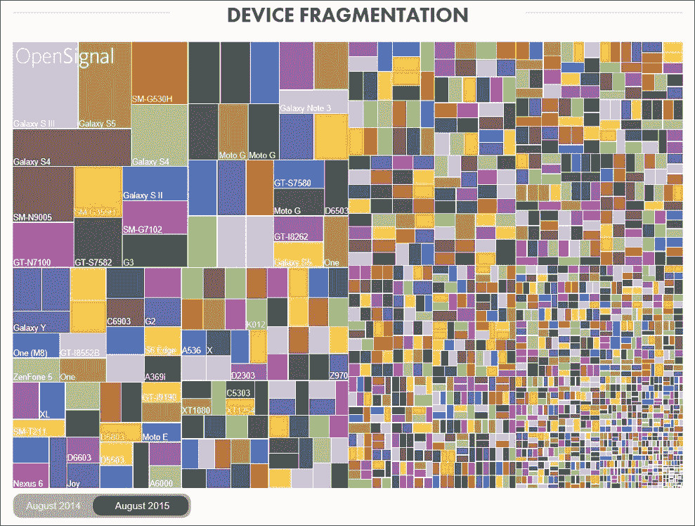

来源：[`opensignal.com/reports/2015/08/android-fragmentation/`](http://opensignal.com/reports/2015/08/android-fragmentation/)

硬件规格在屏幕大小、分辨率、显示比例、CPU、SoC 甚至架构（ARMv7、ARMv8 和 Intel 的 x86/x64 是最流行的 Android 平台之一）上表现出极大的差异。Android 设备在核心操作系统的版本和可用 API 上也有所不同。与苹果的 iOS 相比：

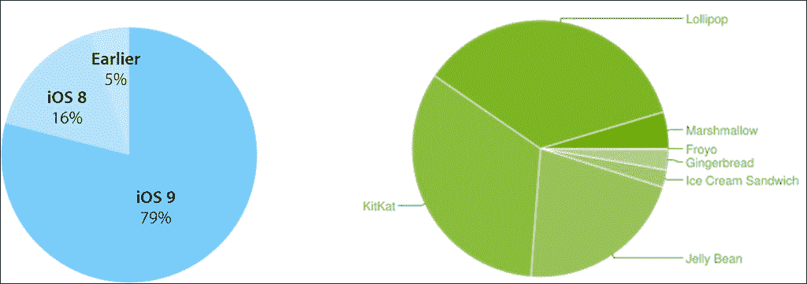

iOS 和 Android 分布图（2016 年 4 月）

Android 设备有许多不同版本的 Android 操作系统和不同的 API 级别，这些版本和级别在任何时候都可能存在。对于移动法医分析来说，这意味着必须熟悉所有版本的 Android 的获取和保护细节，或者转而使用专门的 Android 获取产品。

关于 Android 碎片化的更多信息可在以下链接查看：

+   **Google Play 服务的独特之处：一举解决 Android 分裂、恶意软件和分支问题** [在此查看](http://www.androidcentral.com/genius-google-play-services)

+   OpenSignal Android 分裂报告 [在此查看](http://opensignal.com/reports/2015/08/android-fragmentation/)

+   **另一份 Android '分裂'报告忽略了关键点** [在此查看](http://www.androidcentral.com/another-android-fragmentation-report-misses-point)

# AOSP、GMS 及其取证影响

Android 和 Google 并不是同义词。核心 Android 操作系统由 Google 开发和维护，并通过**Android 开源项目**（**AOSP**）以开放源代码发布。AOSP Android 是免费提供给任何人使用的，无需签署合同，并且制造商在使用和修改时没有任何限制。制造商具有（技术和法律上的）能力创建所谓的 Android 分支版本，这是经过高度修改的 Android 版本，可能与所有 Android 应用兼容，也可能不兼容。AOSP Android 不包括任何专有的 Google 服务（稍后我们会讨论更多相关内容）。

中国大陆出售的大多数智能手机基于 AOSP Android，而一些手机则运行定制的操作系统版本（例如，小米 MIUI 或魅族 FlyMe）。

Android 设备在西半球如此受欢迎的原因在于 Google 提供的生态系统。Google Play 商店提供了数百万款游戏和应用的访问。Google 地图提供了便捷的地图服务，包括免费的导航和实时交通信息。Gmail（Google 邮件）、Google Drive、Google Photos、Google Keep（便签）、Google Chrome（浏览器）等，以及其他许多 Google 产品，构成了一个在**Google 移动服务**（**GMS**） umbrella 下运作的封闭源生态系统。

为了在设备上预装 GMS，制造商必须加入**开放手机联盟**（**OHA**）并签署一份非常严格的协议。该协议不允许 OHA 成员制造基于 Android 分支的设备，这使得制造商只能在没有 Google 服务的 AOSP 设备和启用 GMS 的设备之间做出选择。只能选择其一。

Google 移动服务几乎包含了所有在西半球销售的 Android 智能手机。Google 使用其服务从启用 GMS 的设备收集大量信息。位置报告、Google 帐号详情、便签、搜索和浏览历史、存储的表单和密码、同步的应用数据，以及其他许多信息，都会由 GMS 启用的设备自动传输到 Google 服务。

这些数据中的大部分可以通过 Google 获取或请求。没有 Google 移动服务的基于 AOSP 的设备不会将其使用情况报告给 Google 服务器，因此，它们更不容易受到空中下载技术的影响。

在美国，亚马逊是基于 Android 分叉系统开发设备的最大公司。亚马逊的定制 Android 系统——Fire OS，驱动着该公司推出的 Fire 平板，包括原版 Kindle Fire、Kindle Fire HD、Kindle Fire HDX 7、Kindle Fire HDX 8.9（2013 年版）、Fire HDX 8.9（2014 年版）以及整个 2015 年系列。唯一的亚马逊智能手机 Amazon Fire Phone 也基于 Fire OS。Amazon Fire OS 用亚马逊自家的替代品替代了 Google 移动服务，提供了替代的地图、推送和同步服务以及自家的应用商店。较旧版本的 Fire OS 与原生 Android 相差甚远，以至于 Google Play Store 无法在平台上运行。最新版本（Fire OS 5）在外观和操作体验上与原生 Android 更为相似，并且与 Google 服务兼容性大大增强。

Google Play 服务通过向所有版本的 Android（自 2.3 Gingerbread 起）用户提供及时的后台更新，帮助克服平台分裂问题。

### 注意

**Google Play 服务的天才之处：一举解决 Android 分裂、恶意软件和分叉问题** 见 [`www.androidcentral.com/genius-google-play-services`](http://www.androidcentral.com/genius-google-play-services)。

## 安卓逻辑获取

纯粹的 Android 操作系统对 ADB 离线备份的支持有限。Google 在 Android 4.0 冰激凌三明治版本中实现了 ADB 备份功能。ADB 备份功能允许检查员通过 ADB 将应用程序数据提取到本地 PC。这一过程不需要 root 权限，也不需要自定义恢复模式或解锁引导加载程序；然而，它提取的信息非常有限，应该仅作为最后的手段使用。此外，使用 ADB 备份功能需要解锁手机并启用 **ADB 调试** 选项。

XDA 开发者发布了一个完整的指南，用于通过 ADB 备份手机：

[`forum.xda-developers.com/galaxy-nexus/general/guide-phone-backup-unlock-root-t1420351`](http://forum.xda-developers.com/galaxy-nexus/general/guide-phone-backup-unlock-root-t1420351)

额外信息请参见：

[`android.stackexchange.com/questions/28481/how-do-you-extract-an-apps-data-from-a-full-backup-made-through-adb-backup`](http://android.stackexchange.com/questions/28481/how-do-you-extract-an-apps-data-from-a-full-backup-made-through-adb-backup)

以下命令应生成设备的完整备份，包含所有 APK 文件，包括系统应用和共享 (`/sdcard`) 存储的内容：

```
adb backup -apk -shared -system -all -f C:\fullpath\backup.ab 
```

完整的语法如下：

```
adb backup [-f ] [-apk|-noapk] [-shared|-noshared] [-all][-system|-nosystem] [<packages...>]</packages...>
```

各选项解释如下：

+   将设备的数据写入归档文件。如果没有提供 `-f` 选项，则数据将写入当前目录下的 `backup.ab` 文件。

+   `-apk|-noapk` 将启用/禁用备份 `.apks` 文件本身到归档文件中；默认值为 `noapk`。

+   `-shared|-noshared` 将启用/禁用设备共享存储 / SD 卡内容的备份；默认值为 `noshared`。

+   `-all` 表示备份所有已安装的应用程序。

+   `-system|-nosystem` 切换是否将 `-all` 自动包含系统应用；默认情况下会包含系统应用。

+   `<packages...></packages...>` 是待备份的应用程序列表。如果传递了 `-all` 或 `-shared` 标志，则包列表是可选的。命令行中明确指定的应用程序将被包含，即使 `-nosystem` 通常会导致它们被排除。

为了使其正常工作，手机必须启用 **ADB 调试** 并解锁。手机可能会显示提示，要求您确认操作。

### 注意

在实际操作中，指定某些选项可能会导致备份失败。例如，当我们尝试使用 `-noapk` 选项备份 Motorola Nexus 6 时，备份失败。然而，使用 `adb backup –all –f c:\temp\nexus6.ab` 命令成功完成备份。

在没有 root 权限的情况下，通过 ADB 备份提取的功能是有限的。ADB 备份无法获取设备上安装的所有应用程序。开发人员可以选择是否允许他们的应用程序进行备份。尽管默认设置为 `on`，但一些开发者选择禁用备份。值得注意的是，ADB 备份无法捕获应用程序缓存的内容。ADB 备份功能与 Android 6.0 Marshmallow 引入的新云备份功能是分开的。

尽管通过使用制造商特定的驱动程序和 **Android 调试桥** (**ADB**) 可以在没有任何特定移动取证工具的情况下进行 Android 设备的逻辑采集，但如果您已经拥有商业化的移动取证工具，您可能更愿意使用它。例如，以下是使用 Oxygen Forensic Suite 执行 Android 设备逻辑采集的步骤：

1.  打开并解锁设备。

1.  确保在 **开发者选项** 中启用了 **USB 调试**，如下面的截图所示：

1.  通过 USB 电缆将设备连接到计算机。在某些设备上，您可能需要将 USB 连接模式从 **仅充电** 切换到 **PTP** 或 **MTP**。

    ### 注意

    Android 提供了多种连接选项。您可能会看到 **充电**、**文件传输（MTP）**、**照片传输（PTP）** 等选项。只有选择 **MTP**（媒体传输协议，用于在 Android 设备和 Windows 或 Mac 之间传输文件）或 **PTP**（照片传输协议，通常由打印机和相机等设备用于传输照片）后，才能建立 ADB 连接。在我们的测试中，选择 **PTP** 选项的成功率更高。

    

1.  选择 **连接设备** | **快速备份/镜像提取...**，如下面的截图所示：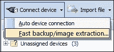

1.  选择 **Android 备份** 并点击 **下一步**：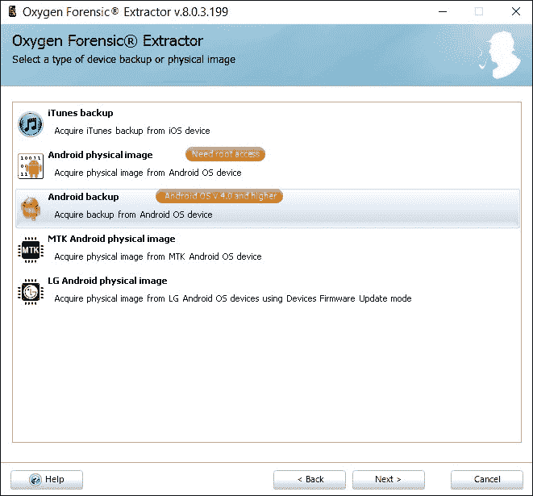

1.  连接设备并按照指示操作：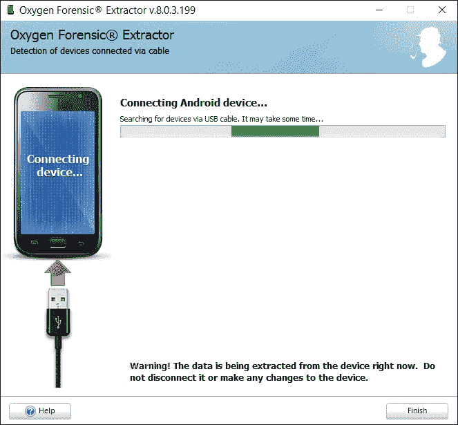

1.  在 Android 设备上，您可能需要授权您的 PC 作为调试桥接：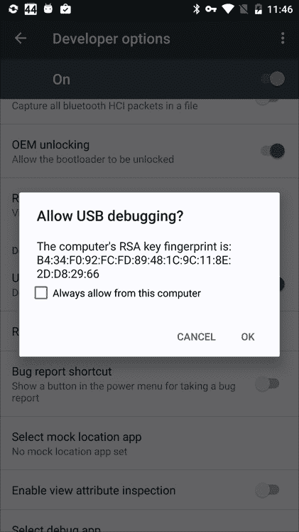

1.  Oxygen Forensic Extractor 将自动与设备建立连接并开始提取备份。

关于 ADB 备份的更多信息，请参见第四章，*Android 获取的实际步骤*。

### OEM 软件

一些制造商提供配套软件以启用手机与 PC 之间的通信。最常见的例子是苹果 iTunes，法医专家在进行逻辑获取时经常使用它。例如，SONY PC 伴侣提供完整的备份和恢复功能，支持 Xperia 设备，无需 root 或解锁引导加载程序。尽管使用 SONY PC 伴侣需要用户用正确的方法解锁设备（PIN 码、图案等），但我们已经见过一些绕过这种锁定措施的证据：

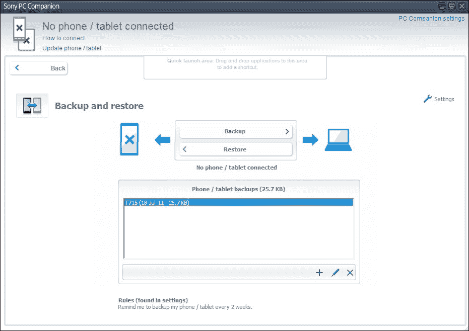

索尼 PC 伴侣备份

此外，一些 OEM（如 LG、华硕等）提供自己的专有软件，用于备份和恢复设备的全部内容。然而，使用这些工具需要设备已解锁，在这种情况下，可能还有其他获取方法可用。

从 ASUS ZenPad S 8.0 平板提取的备份包含以下所有文件：

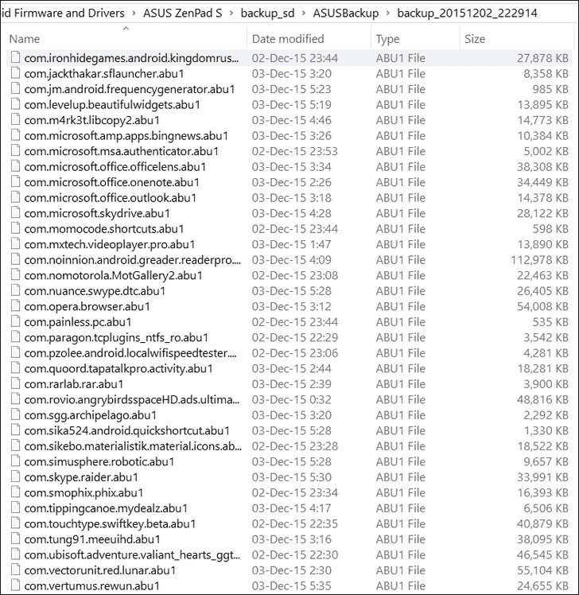

ASUS ZenPad S 8.0 备份的内容

使用专有工具制作的备份通常包含设备设置、密码（或在某些情况下，身份验证令牌，这些令牌可能已过期，或者恢复时仍有效）、已安装的应用程序列表，以及应用程序数据（通常还包括应用程序二进制文件）。这些备份不包括访问未分配空间的功能。

## Android 获取 – 特殊注意事项

用户试图销毁的信息会发生什么？已删除的证据仍然可以恢复——至少在 Android 智能手机中是这样。Android 设备很少加密，容易受到各种获取技术的攻击，其中许多技术能够访问已删除的数据。我们来看看 Android 如何删除信息，以及如何恢复已删除的数据。

### 未分配空间

在 Android 中，未分配空间通常可以与文件系统一起提取（而苹果设备则不行，因为 iOS 采用全盘加密）。然而，需要意识到的是，Android 设备支持修整（trim）功能，每次设备关闭时，未分配磁盘空间的内容都会被擦除。这也是为什么标准的获取技术不建议在任何时候关闭手机的原因；相反，建议将设备连接到充电器并放入法拉第袋中。

那么，Android 手机中的未分配（或释放）空间会发生什么呢？

#### eMMC 存储

让我们来看看最近的智能手机和平板电脑是如何存储信息的。自 2011 年以来，大多数安卓智能手机都使用 eMMC 闪存芯片进行非易失性存储。与*普通*闪存芯片不同，eMMC 存储将闪存内存和控制器集成到一个单芯片中，植入到手机的主板上。内建控制器负责执行特定于闪存的操作，以维护数据完整性，同时确保 NAND 单元的最佳性能和使用寿命。控制器执行的操作包括修剪未使用的数据块、将逻辑地址映射到物理芯片等。此外，控制器还负责在请求时执行安全数据擦除。

#### 重新映射与超额预留

在内部，内建控制器负责在可寻址（逻辑）存储空间与闪存芯片中的物理块之间建立链接。换句话说，每个逻辑块都会通过 eMMC 控制器映射到一个对应的物理块。然而，反过来却不成立——我们不能说每个物理块都有一个对应的可寻址逻辑块。

eMMC 芯片的实际存储容量要比它对外宣称的要多。因此，额外的物理数据块在被 eMMC 控制器调用服务之前是不可寻址的。这个特性被称为超额预留。超额预留的数据块没有逻辑地址。任何*坏块*（不稳定或不可读的数据块）将永久性地被放置到超额预留区域。它们将永远不会被分配逻辑地址，也不会对操作系统或其他任何系统可见，只有内建的 eMMC 控制器可以访问它们。

### 注意

**重要**：没有可行的方法可以提取超额预留区域中的信息。整个区域对逻辑或物理获取工具不可见，因为这些数据块没有映射到可用的地址空间。这些数据块只能由内部控制器访问，外部没有接口可以故意访问其内容。因此，即使进行芯片拆除提取，也无法访问超额预留区域中的物理块，因为 eMMC 芯片的芯片拆除提取仍然是通过向 eMMC 控制器发送命令进行的。

#### 磨损均衡

闪存有一些该类型存储特有的特点。NAND 闪存芯片的使用寿命有限，只能支持有限次数的写入-擦除循环。达到有效使用寿命的终点后，闪存芯片可能仍然能够继续工作，但数据保持期可能会受到严重影响（在闪存存储断电一段时间后，数据可能会损坏或完全消失）。因此，嵌入式 eMMC 控制器将尽力将写入循环均匀地分配到可用的数据块中，这被称为磨损均衡。

#### 修剪

闪存存储的另一个独特特性是它们写入信息的方式。块必须先被擦除才能写入。擦除一个*脏*闪存单元所需的时间比写入到一个已经空闲的块所需的时间要长得多。为了绕过这个问题，eMMC 控制器将在空闲时通过修剪（擦除）已释放的块进行后台垃圾回收。为了使某个逻辑地址在其内容被删除后立即可写（而且该块已被标记为可用，但尚未擦除），控制器可能会通过将该逻辑块指向一个已经空闲的物理单元来执行地址重映射。与擦除不同，重映射是瞬时发生的，使得曾经包含已删除数据的块可以无需等待擦除过程即可被写入。

由于 Android 平台的碎片化，Android 的修剪支持在不同版本之间以及不同 OEM 之间有所不同。完全修剪支持直到 Android 版本 4.3 Jelly Bean 才开始支持。此外，完全修剪支持仅保证在原本搭载 Android 4.3 或更新版本的设备上，这意味着从早期 Android 版本升级的设备不在此范围内。虽然一些制造商在更新设备到新版本 Android 时实现了修剪支持，但其他一些 OEM 从未处理过此问题。因此，许多最初搭载 Android 4.2 并更新到 Android Kit Kat 或甚至 Lollipop 的设备，始终没有获得正确的修剪支持。

早期没有完全修剪支持的 Android 版本曾经包含一种基本的修剪形式。在旧版 Android 中没有*实时*修剪的情况下，每次设备关机时都会执行清理（修剪）。这也是 ACPO 要求保持设备开机而不是关机的原因之一。顺便说一句，仅仅移除电池并不会触发清理阶段。

如果你正在处理一台 Android 设备，并且它是旧版设备，你可能能够导出其 eMMC 芯片的物理镜像，并访问其未分配空间的信息。

#### 删除的数据会发生什么？

那么，操作系统释放的块中的信息会发生什么呢？Android 操作系统（取决于版本）会向 eMMC 控制器发送一个`trim`命令，告诉它某个逻辑块不再使用。控制器将给与该逻辑地址对应的物理块一个特殊状态，标记为*无所谓*，将该物理块添加到*待擦除*列表，并将逻辑地址重新映射到一个干净的物理块（可以是现有地址空间中的，或者是超额配置区域中的）。

值得注意的是，控制器可能会或可能不会决定将新发布的物理块从可寻址空间推送到超配区域。因此，已删除的逻辑块的内容可能会在可寻址空间中保留一段时间。这个现象使得法医专家能够从未分配的区域中恢复信息。

如果你需要了解关于 Android 设备上删除的信息会发生什么，请参考*Laurent Simon* 和 *Ross Anderson*（*剑桥大学*）发布的《*Android 工厂重置的安全分析*》论文，论文可通过 [`www.cl.cam.ac.uk/~rja14/Papers/fr_most15.pdf`](http://www.cl.cam.ac.uk/~rja14/Papers/fr_most15.pdf) 获取。在这篇论文中，科学家研究了多款运行 Android 2.3.x 至 4.3 版本的 Android 智能手机上的工厂重置实现，回顾了 Android 智能手机如何处理已删除文件，并发现，在许多情况下，由于许多设备制造商对该功能的实现不当，用户数据在工厂重置后仍然可以访问。

### JTAG 取证

JTAG 取证是一种先进的数据获取程序，使用**联合测试行动小组**（**JTAG**）协会标准化的**测试接入端口**（**TAP**）。这些端口可以用于访问连接设备中存储的原始数据等内容。获取过程涉及使用设备电路板上现有的焊接点。通过使用专用设备和与设备匹配的 JTAG 电缆，专家可以从兼容设备中提取整个闪存内容（去除 eMMC 超配区，但包括可寻址的未分配空间）。值得注意的是，即使是被锁定、损坏或其他无法访问的设备，JTAG 获取仍然是可行的。JTAG 获取适用于许多 Android 设备，以及一些功能手机和 Windows Phone 7 和 8 设备。

JTAG 取证是一个劳动密集型且耗时的过程，要求专家在设备齐全的实验室中操作。因此，法医专家往往在其他方法无效后尝试 JTAG 获取数据。

#### 何时进行 JTAG 取证

JTAG 是一种侵入式获取方法，因为它需要将设备拆解到一定程度，并将电线焊接到测试端口的接触点上。尽管具有侵入性，但许多专家认为 JTAG 并不是一种破坏性的方法。如果操作得当，JTAG 过程前设备处于正常工作状态时，设备在 JTAG 处理后仍会继续工作——这正是测试端口的设计初衷。尽管如此，JTAG 操作有时仍会导致设备无法使用。因此，JTAG 取证通常用于商业法医工具无法提取设备数据，或者设备软砖化或无法启动时。这包括被锁定且密码未知的设备，以及未启用**USB 调试**选项且无法绕过保护的设备。

JTAG 采集会生成设备内存的完整映像，包括未分配的空间。这就是 JTAG 采集在实验室中的样子：

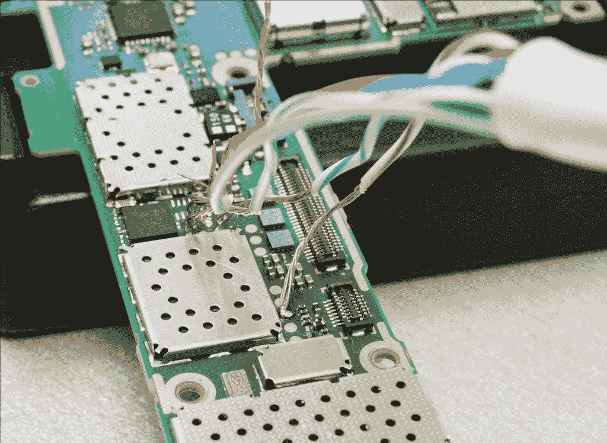

诺基亚 Lumia 920 的 JTAG 采集。图片来源：SYTECH 数字取证，http://sytech-consultants.com/.

#### JTAG 取证的限制

JTAG 提取是一种低级别的采集方法，它返回设备存储的原始内容。如果启用了全盘加密，JTAG 将提取原始加密映像。是否能够破解加密取决于制造商（例如三星以*与众不同*而闻名）、手机型号和 Android 版本。

为了提取解密的映像，必须使用更高级别的 API。不过，这可能需要用正确的密码解锁设备（或采用其他方法，如图案或敲击密码）。某些三星设备、运行 Android 5 的谷歌制造设备（如 Nexus 6 和 Nexus 9）以及一些其他由领先制造商销售的旗舰手机，开箱即启用全盘加密。

JTAG 过程的文档资料极为有限，并且需要专家级检查员。有些制造商在设备出厂后会禁用 TAP 端口，因此即使设备上有 TAP 端口，JTAG 采集可能也无法进行。

通过 JTAG 提取的完整映像不包括过度配置区域。JTAG 不会绕过控制器，只能访问设备控制器允许的设备内存区域，除非检查员使用一种被称为**边界扫描**的高级 JTAG 形式。换句话说，未使用边界扫描技术时，标准 JTAG 方法无法访问过度配置区域。然而，即便使用边界扫描技术，检查员也只能访问从嵌入式存储中提取的信息。如果设备使用 eMMC 内存，所有提取请求仍会通过集成在 eMMC 芯片中的嵌入式控制器进行路由，而该控制器又不允许直接访问闪存芯片的内容。因此，边界扫描技术仅在设备配备普通闪存芯片时有效，而当前的设备大多使用 eMMC 芯片（例如，大多数 Android 智能手机自 Android 2.3 以来一直使用 eMMC 芯片）。值得注意的是，一些入门级的无品牌中国智能手机仍然使用普通闪存芯片而非 eMMC。

尽管存在一些限制，JTAG 仍然是兼容设备的一种可行获取方法。谷歌决定放弃对新 Android 5.0 设备进行加密（[`arstechnica.com/gadgets/2015/03/google-quietly-backs-away-from-encrypting-new-lollipop-devices-by-default/`](http://arstechnica.com/gadgets/2015/03/google-quietly-backs-away-from-encrypting-new-lollipop-devices-by-default/)），取消了要求在升级到 Android 5.0/5.1 的现有设备中强制执行全盘加密的要求，以及新发布的 Lollipop 系统手机的默认加密。只有当手机没有使用全盘加密时，您才能对兼容的手机使用 JTAG 取证。

#### 步骤逐步的 JTAG 获取

本书面向移动取证专家，因此我们不会详细讨论 JTAG 提取。将手机送往专门从事低级提取的实验室可能是您最好的选择。在实验室中，他们将执行以下步骤：

1.  专家将尝试通过研究特定设备型号的服务文档来识别 TAP。如果没有服务文档可用，检查员将打开设备并检查其 PCB，寻找潜在的 TAP，然后手动探测以识别 TAP 连接器引脚。

1.  专家随后将通过焊接连接器或使用无焊接夹具，将电线引线连接到正确的连接器引脚。

1.  电线引线将连接到支持正在分析设备的适当 JTAG 仿真器。

1.  通过向展品设备发送适当的命令，专家将使设备转储其闪存内容。原始转储将由 JTAG 仿真器捕获，并保存为二进制文件。

1.  包含内存芯片原始内容的二进制文件将提供给您进行分析。该转储可能已加密，也可能未加密，即使知道锁屏密码，也可能无法在当时解密其内容。

1.  此时，您可以使用您选择的移动取证工具加载 JTAG 转储的内容并解析和分析其内容。

### Chip-off 获取

Chip-off 获取是一种高度先进的破坏性提取技术，需要将电线引线连接到 PCB 接触点或物理移除（拆焊）手机的闪存芯片。与 JTAG 相比，Chip-off 被认为更困难；然而，通过 Chip-off 获取到的信息量与通过 JTAG 提取设备获得的数据量相似。由于大多数智能手机使用标准的 eMMC 闪存模块，过程是标准化的，通常不会给检查员带来意外。

在移动取证的世界中，最低级别的访问并不总是最好的。虽然直接读取芯片可以生成内存芯片的完整原始转储，但调查员可能会面对一个加密分区，而加密密钥并未存储在任何地方。在苹果设备、许多三星手机以及一些其他设备（例如，Android 5 Nexus 系列）的情况下，加密是开箱即用的，并且即使知道正确的密码，也无法在芯片卸载采集过程中绕过加密。芯片卸载采集在未加密设备上使用时能获得最佳结果。

#### 芯片卸载与加密

芯片卸载通常涉及从电路板上移除内存芯片，并使用特殊的 eMMC 适配器制作内存芯片的原始转储。如果设备启用了全盘加密，在许多 Android 5.0 Lollipop 之前的 Android 版本中（使用默认加密方案），就可以尝试在原始数据转储中进行数据雕刻，以便定位并提取加密元数据。如果成功提取了加密元数据，分析员可以尝试暴力破解密码并解密镜像。

芯片卸载提取是可用的最低级别采集方法。如果物理采集和 JTAG 提取都失败，芯片卸载通常作为最后的手段。如果使用了全盘加密，芯片卸载采集将导致一个加密的镜像，可能无法解密。

请注意，这项技术在许多具有较新固件的三星手机上不起作用，也在大多数运行 Android 5.0 及以后版本的 Android 设备上无法使用。近期的三星设备（以及所有 Android 5.x 智能手机）使用主密钥加密元数据，而主密钥本身存储在一个无法通过芯片卸载访问的受保护区域中。

### 系统编程取证

系统编程取证是芯片卸载采集的一种非破坏性变体。ISP 是一种高级采集过程，介于 JTAG 和芯片卸载之间。在采集过程中，检查员可以尝试不移除芯片就转储 eMMC 内存的内容。ISP 采集仅适用于使用 eMMC 或 eMCP 样式 BGA 芯片的设备。通过 BGA 芯片周围的接入点获取对内存的访问。这个采集过程被认为是非破坏性的，因为如果一切顺利，设备在提取后可以重新组装并启动。这是实验室中 ISP 采集的样子：

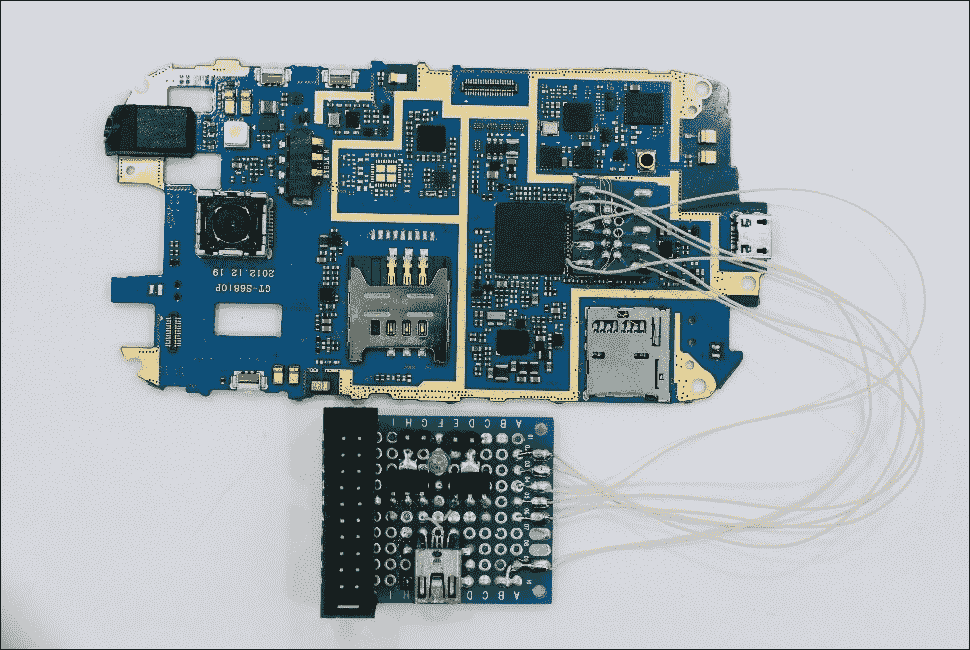

连接到智能手机 PCB 的 eMMC 适配器。来源：http://easy-jtag.com/。

以下是 JTAG eMMC 引脚图的示意图（感谢 Easy Jtag 提供）：

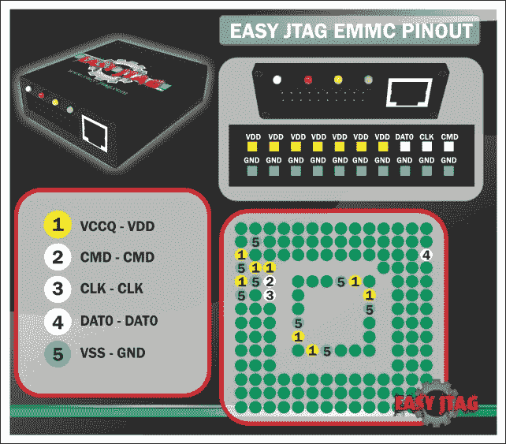

Easy JTAG eMMC 盒子。来源：http://easy-jtag.com/。

Teel Technologies（[`www.teeltech.com/mobile-device-forensics-training/in-system-programming-for-mobile-device-forensics/`](http://www.teeltech.com/mobile-device-forensics-training/in-system-programming-for-mobile-device-forensics/)）列出了 ISP 采集的以下优点：

+   使检查员能够绕过锁码，从不支持 JTAG 或商业工具的手机中恢复完整的数据集

+   一种非破坏性的操作方法，能够实现与芯片拆除相同的结果，同时保持原始证据完好无损

+   比 JTAG 快得多，能够更快速地收集数据，使检查员能够更高效地处理更多手机

+   执行 ISP 下载所需的资源和工具比芯片拆除更少

# 总结

在本章中，我们从取证的角度审视了 Android 操作系统。我们回顾了各种数据采集选项，并讨论了如何进行 Android 设备的逻辑采集。我们还探讨了已删除证据的问题，并讨论了何时以及如何恢复已删除的数据。在下一章，我们将继续研究 Android 设备，学习一些最常用的取证技术——物理采集。
