# 第七章 获取 – 接触 Windows Phone 和 Windows 10 Mobile

Windows Phone 是移动市场的新兴玩家。微软采取了激进的策略，通过多个无线运营商销售大量低成本设备。该操作系统经过优化，即使在低端硬件上也能完美运行，相比更臃肿、沉重的 Android，它在廉价手机上提供了更加流畅的用户体验。

根据 IDC ([`www.idc.com/prodserv/smartphone-os-market-share.jsp`](http://www.idc.com/prodserv/smartphone-os-market-share.jsp)) 的数据，Windows Phone 在 2015 年第二季度占据约 2.6% 的市场份额，2015 年第二季度共售出 880 万部设备。

与市场份额逐年下降的 BlackBerry 不同，微软通过在印度等新兴市场销售数百万台廉价设备，成功扩大了其用户群。Windows Phone 在 Google Android 和 Apple iOS 之后，稳居第三，而 BlackBerry 则几乎只能勉强进入 **其他** 类别。

根据 Kantar ([`www.kantarworldpanel.com/smartphone-os-market-share/intro`](http://www.kantarworldpanel.com/smartphone-os-market-share/intro)) 的数据，到 2015 年 12 月，Windows Phone 设备在德国占所有智能手机销售的 6.4%（相比之下，Apple iPhone 市场份额为 20.2%）。在美国，Windows Phone 占 1.6% 的智能手机销售份额，而 iOS 则拥有 39.1% 的健康市场份额。

一般来说，Windows Phone 在欧洲成为了一个受欢迎的选择（在英国为 9.2%，在意大利为 8.1%）。微软的移动操作系统在亚洲并不常见（中国为 1.2%，在日本几乎没有市场份额）：

来源: http://wp7forum.ru/kantar-worldpanel-otchet-po-dole-rynka-mobilnyx-operacionnyx-sistem-za-sentyabr-2014-goda/

# Windows Phone 安全模型

微软提供了一份关于 Windows Phone 8 安全模型的详细白皮书，下载地址为 [`download.microsoft.com/download/B/9/A/B9A00269-28D5-4ACA-9E8E-E2E722B35A7D/Windows-Phone-8-1-Security-Overview.pdf`](http://download.microsoft.com/download/B/9/A/B9A00269-28D5-4ACA-9E8E-E2E722B35A7D/Windows-Phone-8-1-Security-Overview.pdf)。

# Windows Phone 物理获取

显然，微软在保护 Windows Phone 设备方面做得非常出色。事实上，微软完全控制着该平台（高通平台），该平台被不同的 Windows Phone 设备制造商使用，因此与 Android 不同，这里不会有劣质实现。因此，所有 Windows Phone 设备在安全性方面大致相当。直到最近，JTAG 和芯片拆卸获取是获取大多数 Windows Phone 的唯一方法。然而，在 2015 年 1 月，Cellebrite 实现了一个获取模块，使调查人员能够对大量 Lumia 设备进行物理获取。该技术仍处于初级阶段，解析内容仍有很多工作要做。然而，文件系统是 NTFS，操作系统与 Windows 非常相似，因此最终这将会完成。

从那时起，又出现了一项新发展。**Windows Phone Internals** ([`www.wpinternals.net/`](http://www.wpinternals.net/)) 为 Lumia 520、521、525、620、625、720、820、920、925、928、1020 和 1320 开发了一个解锁引导加载程序的方法。解锁引导加载程序的设备可以用来启动未签名的代码，而这些代码可以用于物理获取的目的。

# Windows Phone 8.x 和 Windows 10 Mobile 上的 JTAG 法医取证

类似于 Android，大多数 Windows Phone 7.x、8.x 和 Windows 10 Mobile 设备可以通过 JTAG 法医取证过程成功获取。该过程与获取 Android 设备非常相似，因此请参阅后续章节中的 JTAG 获取部分，JTAG 法医取证 [第 42 页]。

与 Android 设备相比，成功 JTAG 一个 Windows 智能手机的几率要高得多。然而，随着 Windows Phone 8.x 设备升级到 Windows 10 Mobile，JTAG 获取的情况发生了变化。

## Windows Phone 8.x 设备加密

Windows Phone 8 和 8.1 没有提供用户可配置的设置来加密数据分区。根据官方的 **Windows Phone 8.1 安全概述** 文档（可以从 [`download.microsoft.com/download/B/9/A/B9A00269-28D5-4ACA-9E8E-E2E722B35A7D/Windows-Phone-8-1-Security-Overview.pdf`](https://download.microsoft.com/download/B/9/A/B9A00269-28D5-4ACA-9E8E-E2E722B35A7D/Windows-Phone-8-1-Security-Overview.pdf) 下载），内部存储只能通过实施 **需要设备加密** 策略（Require Device Encryption）通过企业安全策略进行加密。当启用此策略时，它会阻止用户禁用设备加密，并强制加密内部存储。不会创建或上传任何托管密钥到网络上的任何地方，以便解密加密分区。启用后，Windows Phone 8.1 设备会使用 **BitLocker** 技术进行加密，并使用 **高级加密标准**（**AES**）128 位加密。

### 注意

**重要**：在 Windows Phone 8.x 设置中没有任何用户可访问的选项来启用或禁用加密。加密只能通过推送的企业政策启用。因此，大多数终端用户设备保持未加密状态，用户无法加密数据。

## Windows 10 Mobile 设备加密

这一系统在 Windows 10 Mobile 中发生了变化。在此版本的操作系统中，用户可以通过 **设置** | **系统** | **设备加密** 手动启用加密：

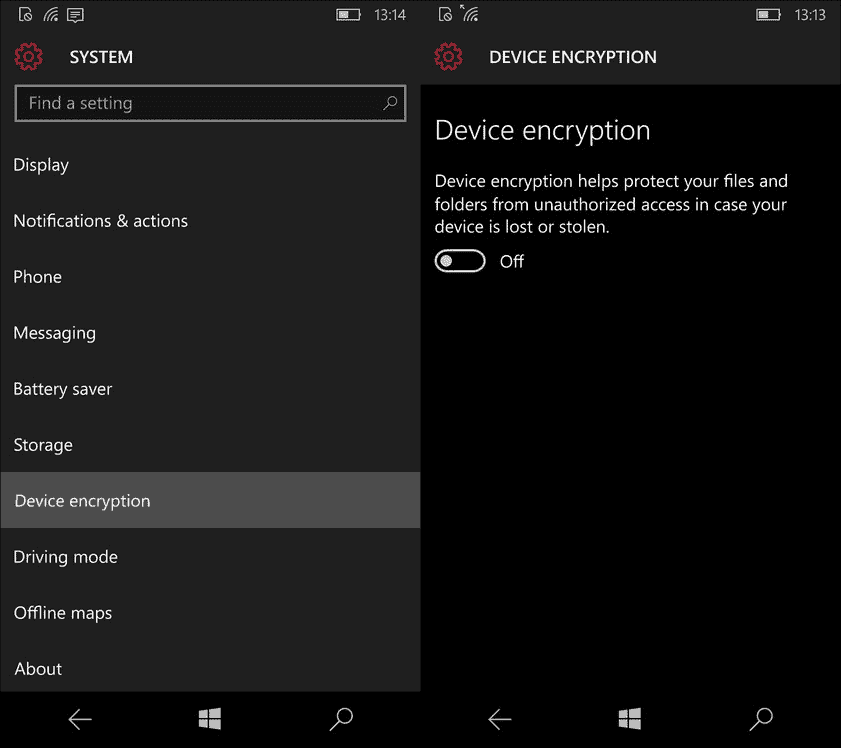

有趣的是，Windows 10 Mobile 允许用户在启用设备加密后禁用加密功能。这是 Android 中无法做到的。要禁用设备加密，用户只需在同一配置界面上将滑块切换为**关闭**。

关于 JTAG 获取，加密设备几乎没有兴趣，必须先解密才能获取数据。为了解密设备，必须输入正确的 PIN 码来解锁设备；然而，Windows 10 Mobile 允许即使没有 PIN 码也能进行加密。在 Windows 10 Mobile 中，系统没有用户可配置的功能来在多次登录失败后清除设备内存；因此，针对这些设备，基于硬件的 PIN 恢复选项是可行的。

# Windows Phone 8/8.1 和 Windows 10 Mobile 云取证

Windows Phone 8 和 8.1 设备，以及运行 Windows 10 Mobile 的设备，可以通过 Microsoft 账户（前身为 My Windows Phone）使用 Microsoft OneDrive（前身为 SkyDrive）。Microsoft 备份将信息分成多个部分并以一种不透明的格式保存。即使你恰好知道用户的 Live ID 和密码，或直接从 Microsoft 获取备份，手动分析这些数据仍然非常困难。

在从 Microsoft 云获取数据时，**Elcomsoft Phone Breaker** 按块下载信息，并创建一个人工备份。此备份主要使用 SQLite 格式，从而使专家能够使用标准的取证工具分析其内容。该工具还提取与某个 Microsoft 账户关联的设备列表。

Elcomsoft Phone Breaker 可以提取以下 Windows Phone 和 Windows 10 Mobile 设备的数据：

+   联系方式

+   注意事项

+   短信消息

下载的数据作为一个归档文件保存，其中包含 SQLite 数据库，以及一个 `Manifest.xml` 文件，后者包含该用户 Microsoft 账户下每个设备的信息，并列出了每个数据库文件的文件名。

# 通过空中获取 Windows Phone 备份

Elcomsoft Phone Breaker 允许下载通过用户 Microsoft 账户备份到云中的 Windows Phone 数据（前提是你知道用户的 Microsoft 账户登录信息和密码）。

要从 Microsoft OneDrive 下载 Windows Phone 数据，请执行以下步骤：

1.  在 **工具** 菜单中，选择 **Microsoft** 标签，然后点击 **下载 Windows Phone 数据**：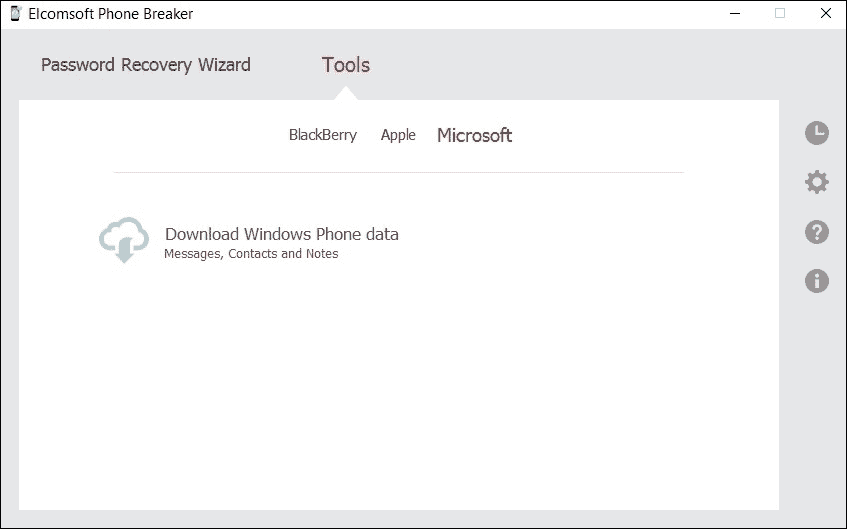

1.  为用于备份数据的 Microsoft 帐户定义**用户名**和**密码**。切换视图按钮以显示或隐藏密码：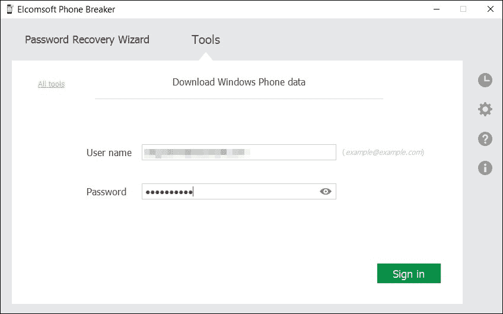

1.  选择一个位置以保存从 Microsoft 帐户下载的数据。

    +   点击**更改用户**以访问存储在不同 Microsoft 帐户下的数据。

    +   点击**下载**开始下载数据：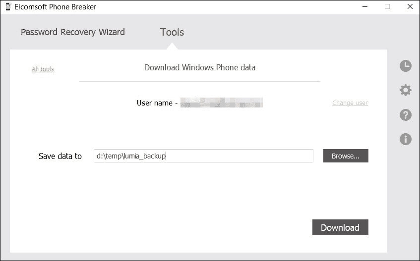

1.  下载过程开始。您可以查看处理过的文件数量以及解密过程中接收到的错误数量：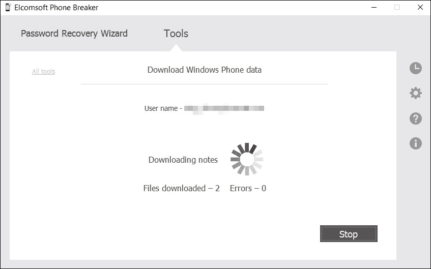

1.  解密完成后，您可以通过点击**查看**按钮，在本地计算机上查看保存备份的位置。要查看解密文件的详细信息以及解密过程中发生的错误，请点击**详细信息**：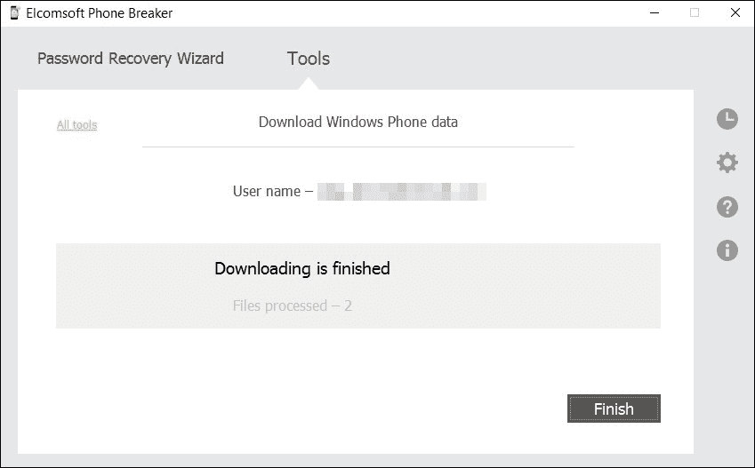

1.  点击**完成**以关闭向导。

人工创建的备份文件现在可以在您的计算机上进行进一步分析。您可以使用**Elcomsoft Phone Viewer**浏览并查看此备份的内容。此时，工具会提取联系人、消息和笔记（以 MS OneNote 格式）；**Elcomsoft Phone Viewer**可以将这些笔记提取为单独的`*.one`文件。

### 注意

**注意**：您可以使用相同的 Microsoft 帐户凭据访问存储在用户 Microsoft 帐户中的其他信息。这包括电子邮件（Hotmail）、在线云存储（OneDrive）、Skype 联系人和历史记录（Skype），以及在**Microsoft Live**旗下管理的其他服务。您可以通过登录用户的 OneDrive 帐户并选择**设置** | **设备备份** ([`onedrive.live.com/Options/DeviceBackups`](https://onedrive.live.com/Options/DeviceBackups))查看可用的备份列表：

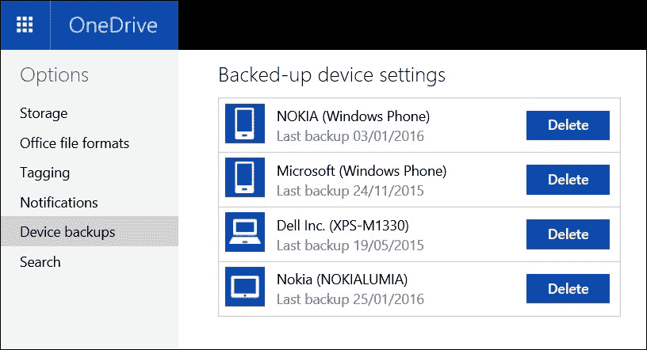

现在，您可以在 Elcomsoft Phone Viewer 中打开备份。您将能够访问与相同 Microsoft 帐户同步的所有设备上的联系人、消息和笔记：

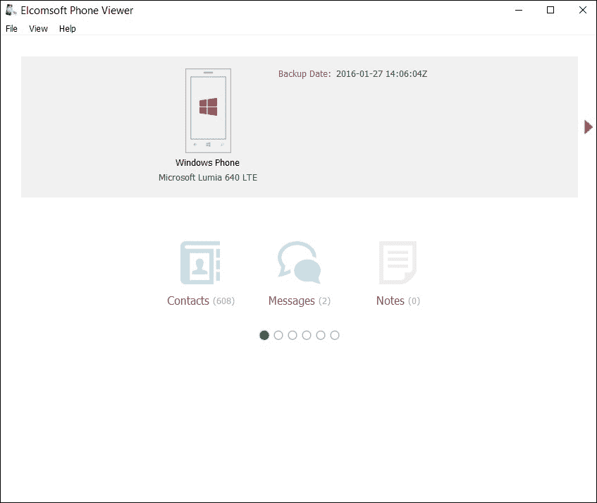

本次会话捕获的帐户包含六台 Windows 设备的备份，包括 Microsoft Lumia 640 和 Nokia Lumia 930 手机、一台 ThinkPad 8 平板电脑、一台运行 Windows RT 的 Nokia Lumia 2520 平板电脑、一台台式电脑和一台笔记本电脑。下载后，可以通过以下界面访问备份：

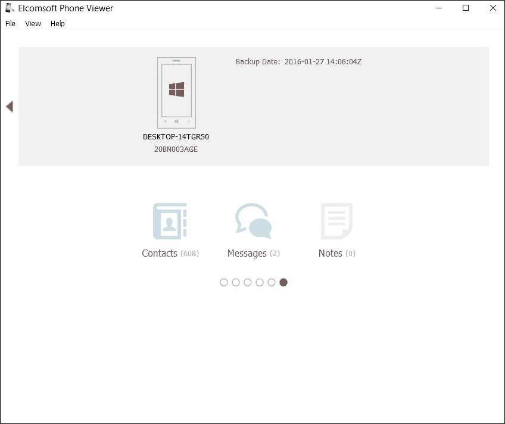

消息仅在下载由 Windows 智能手机备份的信息时可用：

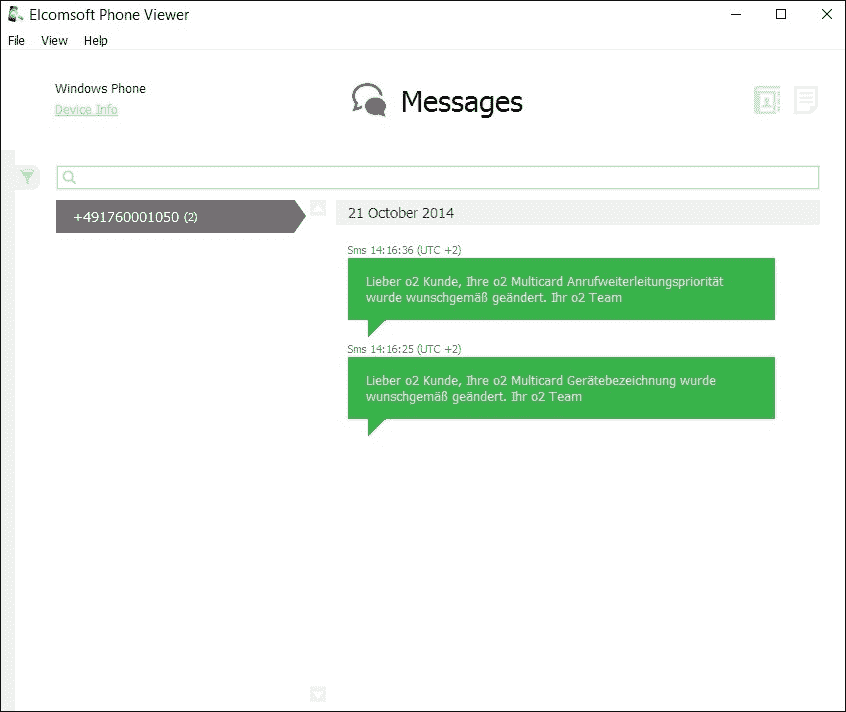

另一方面，联系人可以在所有设备上使用，并与用户的 Outlook / Hotmail / Windows Live 帐户同步：

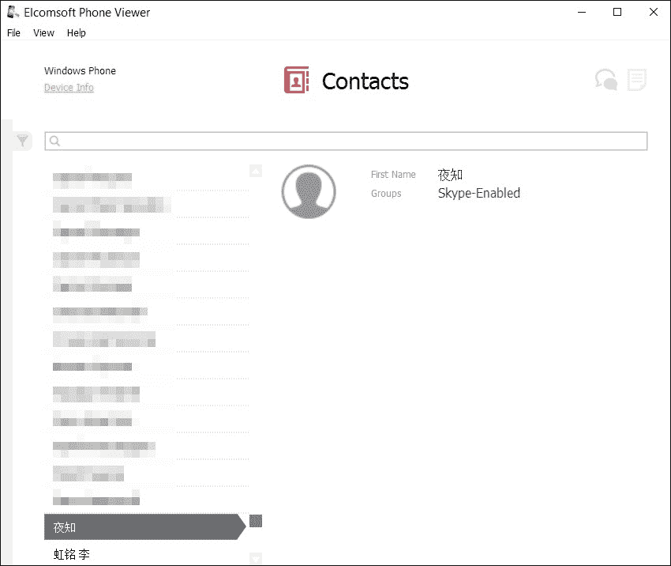

此时，Windows 设备的云获取选项仅限于之前看到的信息。实际设备备份（[`onedrive.live.com/Options/DeviceBackups`](https://onedrive.live.com/Options/DeviceBackups)）已被安全加密。需要进一步研究才能检索和解密这些备份：

# 总结

在本章中，我们讨论了适用于移动设备的 Windows 法医分析。我们还介绍了 Windows Phone 8.x 和 Windows 10 Mobile 智能手机的获取方法。我们讨论了云获取及其在 Windows 平台上的限制，并学习了如何使用 Elcomsoft Phone Breaker 从 Microsoft OneDrive 提取备份数据。在下一章中，我们将继续讨论 Windows 平台，尽管这一次我们将研究下一类设备——运行 Windows 和 Windows RT 操作系统的平板电脑。
