# Windows Phone 取证

尽管如今 Windows Phone 的使用并不广泛，但在取证调查中仍然可能遇到这些设备。这些设备是市场上最为经济实惠的，因此，了解如何获取、分析和解码 Windows Phone 上的数据非常重要。定位并解释这些设备上存在的数字证据需要对 Windows Phone 操作系统有专门的了解，而且并非总是可行。商用取证工具和开源工具对从 Windows 设备中获取用户数据的支持非常有限。由于 Windows Phone 在移动市场中占比不大，大多数取证从业者对其数据格式、嵌入式数据库以及设备上存在的其他证据不太熟悉。本章概述了 Windows Phone 取证，描述了获取和检查 Windows 移动设备数据的各种方法。

本章将覆盖以下主题：

+   Windows Phone 操作系统

+   Windows 10 Mobile 安全模型

+   Windows Phone 文件系统

+   数据采集

+   商用取证工具采集方法

+   在不使用商用工具的情况下提取数据

+   关键证据项目的检查

# Windows Phone 操作系统

Windows Phone 是由微软开发的专有移动操作系统。它作为 Windows Mobile 的继任者推出，但不提供与旧平台的向后兼容性。Windows Phone 于 2010 年 10 月发布，版本为 Windows Phone 7。此后，Windows Phone 操作系统的版本历史继续推出 Windows Phone 7.5、Windows Phone 7.8、Windows Phone 8.1 和 Windows Phone 10。

尽管微软宣称已停止开发这一移动操作系统（不包括安全补丁），但作为移动取证检查员，您仍然可能会遇到它。

以下各节将提供更多关于 Windows Phone、其功能及其底层安全模型的详细信息。

与 Android 和 iOS 设备不同，Windows Phone 引入了全新的界面，采用了所谓的*磁贴*（tiles）来代替图标，如下图所示。这些磁贴可以由用户设计和更新：

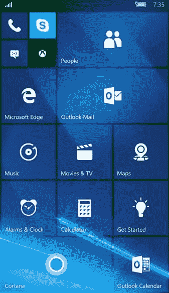

Windows Phone 主屏幕

类似于其他移动平台，Windows Phone 允许安装第三方应用。这些应用可以从由微软管理的 Windows Phone 市场下载。与 iOS 和 Android 设备上的应用数量相比，Windows Phone 显得逊色很多。然而，应用仍然是可用的，您应该在 Windows Phone 设备上看到它们。

Windows Phone 引入了新功能，使其与 Windows Mobile 相比更接近其他智能手机：

+   **Cortana**：这是设备的个人助手。它首次出现在 Windows 8.1 中，并且在 Windows 10 设备中依然存在。Cortana 通过使用 Bing 回答问题、设置提醒、发送短信等功能来帮助用户，从而为用户提供更好、更便捷的使用体验。Cortana 做的每一项操作都会在设备上留下痕迹。

+   **钱包**：这个功能存储信用卡账户、登机牌、票证、优惠券等。

+   **地理围栏和高级位置设置**：这些为用户提供额外的保护，因为手机可以检测到何时处于可信区域之外，并可能会自动锁定。

+   **附加功能**：这些功能包括动态磁贴、增强的颜色以及安静时间。

其他与 Windows Phone 相关的常见应用程序包括 OneDrive（前身为 SkyDrive）、OneNote 和 Office 365 同步。OneDrive 使用户可以从任何设备访问所有文档和文件。OneNote 本质上是相同的，但它充当笔记本或日记。Office 365 使用户可以在多个设备间持续访问他们的电子邮件、日历、联系人等。

数据同步功能的引入使得我们作为法医检查员的工作变得更加困难。我们的任务是确定证据是如何被放置到设备上的。是否有可能明确地说明一个物品是如何放置到设备上的？坦率地说，这取决于情况。没有人愿意听到这个回答，但确实有很多因素需要考虑。是什么应用程序？设备上运行的是什么操作系统？这个物品是什么？例如，让我们考虑一下 OneDrive。如果设备中包含来自 OneDrive 的文档，原始作者应当包含在元数据中。结合检查内容是否与设备共享，可能会揭示出这个物品是如何创建的。然而，在检查日历条目时，如果设备上安装了 Office 365，可能无法确定用户是在手机、PC 还是笔记本上创建了该条目。同步是即时的，并且表示物品创建位置的状态标志并不总是存在。如果这个物品确实是调查中的*致命证据*，你需要运用你的技能来发现支持你结论的其他物品。需要深入挖掘数据。现在我们已经了解了 Windows Phone 的细节和特点，接下来我们来看看它的安全模型，看看它是如何保持数据安全的。

# Windows 10 Mobile 安全模型

Windows Phone 的安全模型旨在确保设备上的用户数据安全可靠。以下部分简要介绍了 Windows Phone 安全模型所基于的概念。

# Chambers

Windows Phone 在最小权限和隔离的原则基础上构建。这一原则自 Windows Phone 7 开始便得到贯彻。为实现这一目标，Windows Phone 引入了**区域**的概念。每个区域都有一个隔离边界，进程可以在其中运行。根据特定区域的安全策略，运行在该区域的进程拥有访问操作系统资源和功能的特权（[`www.msec.be/mobcom/ws2013/presentations/david_hernie.pdf`](https://www.msec.be/mobcom/ws2013/presentations/david_hernie.pdf)）。安全区域共有四种类型。以下是每种类型的简要描述：

+   **可信计算基（TCB）**：此进程拥有对大多数 Windows Phone 资源的无限制访问权限。该区域拥有修改策略和强制执行安全模型的特权。内核在此区域运行。

+   **提升权限区域（ERC）**：此区域的权限低于 TCB 区域。它拥有访问所有资源的特权，除了安全策略外。此区域主要用于提供其他应用程序功能的服务和用户模式驱动程序。

+   **标准权限区域（SRC）**：这是预装应用程序的默认区域，例如 Microsoft Outlook Mobile 2010。

+   **最小权限区域（LPC）**：这是通过 Marketplace Hub（也称为 Windows Phone Marketplace）下载和安装的所有应用程序的默认区域。

接下来，我们将讨论加密。

# 加密

Windows Phone 8 引入了 BitLocker 技术，通过 AES 128 位加密加密设备上存储的所有用户数据。用户只需轻轻一 flip 开关即可启用此功能，设备上存储的所有数据将被加密。此外，用户还可以加密他们的 SD 卡（假设设备有 SD 卡），并为其设备设置密码或 PIN。如果启用了所有这些锁定和加密，除非密码被恢复，否则访问此设备上的数据几乎是不可能的。

# 基于能力的模型

能力被定义为与安全性、隐私和成本相关的设备资源（如相机、位置信息、麦克风等）。LPC 默认具有一组最小的访问权限。然而，在安装过程中可以通过请求更多能力来扩展此权限。能力是在应用程序安装过程中授予的，且在运行时不能修改或提升。因此，通常很难通过侧加载应用程序或强制自定义启动代码来获得取证访问权限，因为这通常在启动前会被拒绝。

要在 Windows Phone 上安装应用，你需要使用 Windows Live ID 登录到 Marketplace。在安装过程中，应用会要求用户在使用某些功能之前先获得许可，以下截图展示了一个例子：

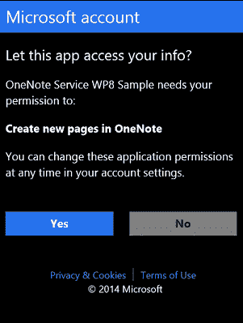

Windows 应用请求用户权限（https://i-msdn.sec.s-msft.com/dynimg/IC752370.png)

这与 Android 中的权限模型类似。它让用户在安装应用之前，可以自由了解应用的所有功能。所有功能的列表包含在`WMAppManifest.xml`应用清单文件中，用户可以通过 Visual Studio 或其他在[`docs.microsoft.com/en-us/previous-versions/windows/apps/ff769509(v=vs.105)`](https://docs.microsoft.com/en-us/previous-versions/windows/apps/ff769509(v=vs.105))定义的方法访问该文件。

# 应用沙箱

Windows Phone 上的应用在沙箱环境中运行。这意味着每个应用在 Windows Phone 上都运行在自己的“房间”中。应用程序彼此隔离，无法访问其他应用的数据。如果某个应用需要将信息保存到设备上，它可以通过隔离存储来实现，而此存储不能被其他应用访问。此外，安装在 Windows Phone 上的第三方应用不能在后台运行；也就是说，当用户切换到另一个应用时，之前使用的应用会被关闭（尽管应用状态会被保留）。这确保了应用在用户不使用时不能进行例如互联网通信等活动。这些限制也使 Windows Phone 更不容易受到恶意软件的侵害，但你永远不应假设任何设备都是完全安全的。恶意软件在这些设备上运行会更具挑战性。

到目前为止，我们已经看过四种安全沙箱，现已知 Windows Phone 8 使用 BitLocker 技术进行加密。我们了解了在安装应用时授予的不同功能，并看到了每个应用是如何相互隔离的。接下来，我们将讨论 Windows Phone 的一个重要方面，即其文件系统。

# Windows Phone 文件系统

Windows Phone 文件系统或多或少与 Windows 7、Windows 8 和 Windows 10 中使用的文件系统相似。从根目录开始，你可以访问设备上的不同文件和文件夹。从取证的角度来看，以下是一些可以提供有价值数据的文件夹。所有列出的目录都位于根目录中：

+   **应用数据**：此目录包含手机上应用的数据，如 Outlook、地图和 Internet Explorer。

+   **应用程序**：此目录包含用户安装的应用。每个应用分配或使用的隔离存储也位于此文件夹中。

+   **我的文档**：此目录包含不同的 Office 文档，例如 Word、Excel 或 PowerPoint 文件。该目录还包括配置文件和多媒体文件，如音乐或视频。

+   **Windows**：此目录包含与 Windows Phone 操作系统相关的文件。

这里使用的获取方法将决定你对设备的文件系统访问权限。例如，物理映像可能会提供访问多个分区的权限，这些分区可以从数据转储中恢复。下面的屏幕截图显示了一台包含 27 个分区的 Windows Phone 10 设备。第 26 个分区（MainOS）和第 27 个分区（Data）包含相关数据：

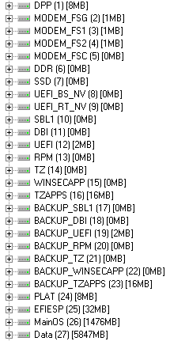

Windows Phone 10 分区

虽然大多数证据会存在于数据分区中，但最佳实践是尽可能同时捕获并分析两个分区。

上面屏幕截图中的 MainOS 分区（第 26 个分区）包含来自 Windows Phone 的系统数据。与所有 Windows 调查一样，系统数据包含与调查相关的证据。

在此示例中，第 27 个分区包含用户或数据分区。根据设备的不同，分区编号可能会有所不同。在我们的示例中，数据分区显示为第 27 个分区，如下图所示。在这里，使用移动取证工具恢复了 SMS、电子邮件、应用数据、联系人、通话记录和互联网历史。这些方法将在本章后面进行讨论：

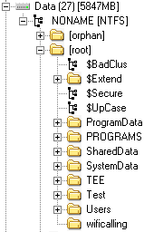

Windows Phone 10 数据分区

Windows Phone 还维护着 **Windows 注册表**，这是一个存储操作系统环境变量的数据库。Windows 注册表本质上是一个目录，用于存储 Microsoft 操作系统的设置和选项，Windows Phone 也不例外。在检查 Windows Phone 时，你会看到 `NTUSER.dat`、`SAM`、`SYSTEM`、`SOFTWARE`、`SECURITY` 和 `DEFAULT` 注册表区。尽管这些注册表区可能是手机特有的，但它们可以像传统 Windows 注册表区一样进行检查。

Cynthia Murphy 的论文中包含了一个详细的案例调查。这涉及到一起家庭入侵和性侵犯罪案件，并详细描述了取证界的杰出人士如何努力发现有助于解决调查的证据。有时，移动设备是与案件相关的最重要证据。欲了解更多信息，请参考 [`www.sans.org/reading-room/whitepapers/forensics/windows-phone-8-forensic-artifacts-35787`](https://www.sans.org/reading-room/whitepapers/forensics/windows-phone-8-forensic-artifacts-35787)。现在我们已经了解了文件和文件夹结构，接下来我们将学习如何利用这些知识进行数据获取。

# 数据获取

从 Windows Phone 采集数据对于法医检查人员来说是具有挑战性的，因为前几章中定义的物理、文件系统和逻辑方法并不得到广泛支持。除此之外，手机可能需要在特定的电池电量（%）状态下，商业工具才能识别并采集该设备。这通常是采集 Windows Phone 过程中最难的步骤之一。

商业工具在进行数据采集时常用的一种技术是安装一个应用程序或代理在设备上，从而实现双向通信，以便将命令发送到设备以提取数据。这可能会导致设备上某些变化；然而，只要检查人员遵循标准协议并验证所用工具的有效性，这种方法仍然是法医上可行的。这些协议包括适当的测试，确保用户数据未被更改（如果更改了，则记录所发生的情况）、在测试设备上验证方法，并记录采集过程中所采取的所有步骤。为了使这种采集方法有效，应用程序需要以 SRC 的权限进行安装。这可能需要你将制造商的 DLL 文件（具有更高权限）复制到用户应用中。这使得应用程序能够访问通常仅限于本地应用的方法和资源。此外，设备必须解锁，否则这些方法可能无法工作。

大多数检查人员依赖法医工具和方法来采集移动设备数据。同样，这些方法在 Windows Phone 上的支持并不多。请记住，要在 Windows Phone 上部署并运行应用程序，设备和开发者必须都经过微软注册并解锁。这个限制可以通过使用 Windows Phone 8 至 10 设备的公共越狱来绕过。

长期以来，JTAG 和芯片拆卸采集是获取大多数 Windows Phone 数据的唯一选择。2015 年 1 月，一切发生了变化：Cellebrite 实施了一个采集模块，使得移动法医检查人员能够从大多数 Lumia 设备的物理层提取数据。

后来，Windows Phone Internals 项目提供了一种方法，可以解锁某些 Lumia 设备的启动加载程序，包括 520、521、525、620、625、720、820、920、925、928、1020 和 1320。这使得对这些设备的物理采集成为可能。你可以在[`www.wpinternals.net/`](https://www.wpinternals.net/)了解更多关于该项目的信息。现在，我们将看看一些用于采集方法的商业工具。

# 商业法医工具采集方法

有一些商业工具可以支持 Windows Phone 设备的获取。Cellebrite UFED 支持使用物理、文件系统和逻辑方法获取 Windows Phone 设备。要确定你正在检查的设备是否被工具支持，可以下载并使用 UFED Phone Detective 移动应用程序，该应用程序在 App Store 和 Google Play 上均可免费下载：

正在搜索支持的 Lumia 设备

这些获取方法中，有些更为强大，能够获取完整的物理数据并绕过某些设备的锁码。然而，一些设备的支持仅限于提取设备中的联系人和照片。重要的是，检查员需要意识到，必须按照工具的指示采取特定步骤。获取这些设备并不容易，通常你会发现工具无法成功完成操作。

当工具似乎失败时，尝试使用 UFED 提供的智能手机/PDA 选项来获取设备。为此，请按照以下步骤操作：

1.  启动 UFED4PC 并选择移动设备。

1.  选择手动浏览。

1.  选择智能手机。

1.  选择你正在尝试获取的 Windows 设备。

1.  尝试所有提供的方法，顺序是：物理、文件系统和逻辑（在可能的情况下，按此顺序进行）：

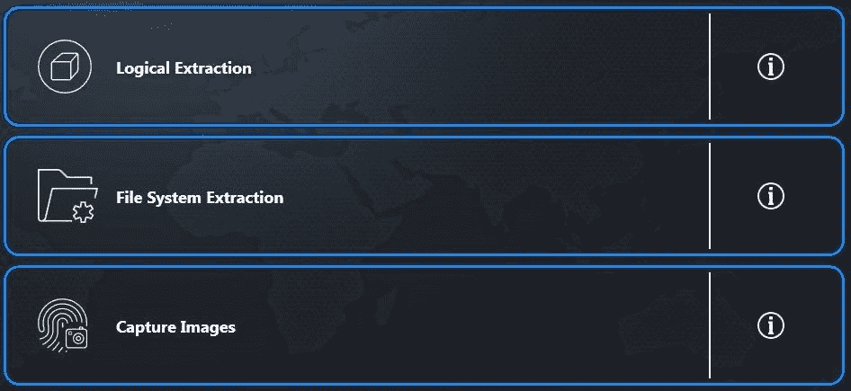

提取方法

1.  按照所有剩余的步骤操作，并尝试所有提供的获取方法，直到成功为止。

Cellebrite 可能会提醒你获取不成功，原因有多种。当这种情况发生时，尝试所有选项，确保已经尝试过所有可用的商业选项。以下是一个在 UFED4PC 中尝试获取设备的例子：

1.  启动 UFED4PC。

1.  选择你的设备的制造商和型号。

1.  选择物理、文件系统或逻辑获取方法（提供的选项会根据设备型号不同而有所变化）。

在这个例子中，只有**逻辑获取**是支持的。提供了两种方法。第一种方法使用电缆，第二种方法使用蓝牙。在这个例子中，要求使用专用的 UFED 电缆。我首先选择了 UFED 电缆，因为蓝牙需要在配对过程中对手机进行额外的更改：

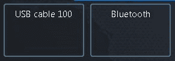

UFED4PC 逻辑提取选项

尝试使用 USB 电缆 100 获取设备时，只能访问多媒体文件。

然后，尝试相同的获取方法，但选择蓝牙。按照给定的说明将设备与取证工作站配对：

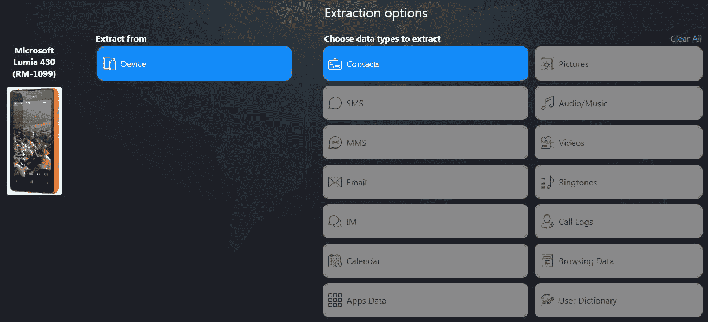

UFED4PC 提取选项（蓝牙）

通过这种获取方法，我们能够获取到联系人。请注意，目前没有提供获取短信、彩信、电子邮件、即时消息、日历、通话记录、应用数据等的方法。建议你重复前一截图中列出的通用方法，使用 UFED4PC 中的智能手机选项。到目前为止，我们已经看过了一些使用商业工具的获取方法。现在，让我们学习如何在没有这些工具的情况下提取数据。

# 在没有商业工具的情况下提取数据

在某些情况下，获取 Windows Phone 设备的物理数据仅能通过提前的方法，例如 JTAG 和芯片移除。但得益于名为 Heathcliff 的安全研究人员，使用他名为**WPinternals**的工具，现在可以在有限的手机型号和操作系统版本上进行物理获取，具体可以参见[`www.wpinternals.net`](https://www.wpinternals.net)。

该工具支持以下 Lumia 手机型号：520、521、525、620、625、720、820、920、925、928、1020 和 1320。

关于操作系统版本，支持以下版本：

+   8.10.12393.890

+   8.10.12397.895

+   8.10.14219.341

+   8.10.14226.359

+   8.10.14234.375

+   8.10.15116.125

+   8.10.15148.160

+   10.0.10512.1000

+   10.0.10536.1004

+   10.0.10549.4

+   10.0.10581.0

+   10.0.10586.11

+   10.0.10586.36

这种方法是实验性的，可能会导致设备变砖！尽管设备变砖的几率相对较低，我们建议你将其作为最后的选择。

获取过程的第一步将是下载一个 Windows **全闪存更新**（**FFU**）文件和你正在使用的手机型号的紧急文件：

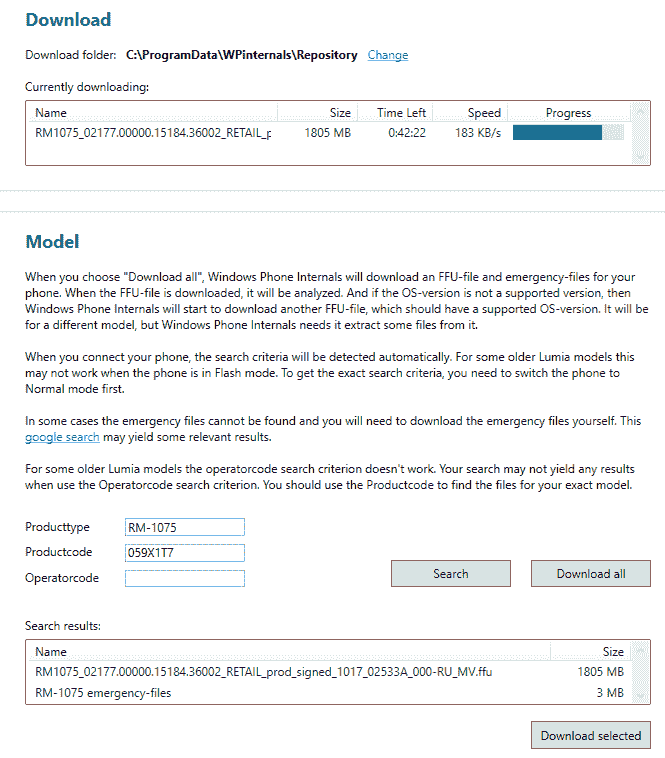

下载 FFU 文件

如果下载的 FFU 包含不支持的操作系统版本，WPinternals 将下载另一个 FFU 以获取附加文件：

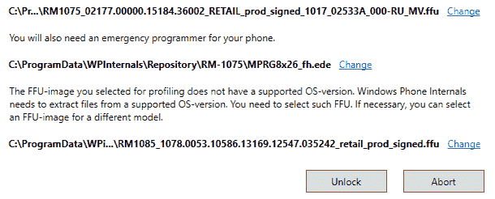

获取附加文件

在解锁过程中，手机可能会重启几次，但这是正常的行为：

扫描闪存配置文件

一旦找到配置文件，工具就会闪存解锁的引导加载程序：

闪存解锁的引导加载程序

如果设备已成功闪存，它会进入大容量存储模式：

大容量存储模式

现在，设备可以轻松成像，例如，使用 FTK Imager：

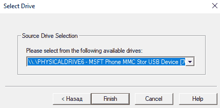

FTK Imager 中的 Windows Phone

现在，我们将学习如何从 SD 卡提取数据。

# SD 卡数据提取方法

Windows 手机可能包含可拆卸的 SD 卡。这些卡可能会通过密钥进行保护，防止 SD 卡被拆卸并使用，或通过其他设备（手机、相机、电脑等）访问。这与用户加密 SD 卡时创建的密钥不同。可以对用户加密的 SD 卡进行暴力破解和字典攻击，以尝试访问数据。在检查 Windows 手机时，最好研究设备，看看在获取设备数据时，SD 卡的安全性是否会成为一个因素。如果是这样，只需按照前面的步骤操作，通过手机在取证提取过程中获取 SD 卡数据。请参阅以下图表。

对于 SD 卡可以移除的设备，你需要考虑两种情况。如果设备已开机，你是否应该按原样获取手机和 SD 卡的数据？如果设备已关机，你是否应该移除 SD 卡并使用 FTK Imager 获取设备数据？答案是，视情况而定。在取证中，我们经常使用这个说法，但它依然成立。如果你保持设备开机，它必须与网络隔离，以确保不会被远程访问并立即获取，否则电池会耗尽，设备最终可能会关机。如果设备关机并且你移除了 SD 卡，你必须确保卡片仍然与设备本身绑定，并从外部和内部同时获取数据，以确保捕获所有数据。在正常情况下，以下图表建议了处理 Windows 手机中 SD 卡的推荐步骤：

大多数商业取证工具都会提供从 SD 卡提取数据的功能。通常，手机提取过程仅会提取存储在 SD 卡上的数据。当没有针对特定 Windows 手机的支持时，通常会发生这种情况。如果工具无法识别 SD 卡且数据无法提取，很可能是因为 SD 卡已经被用户加密，并且设备的密码与 SD 卡的密码不同。遇到这种情况时，尝试破解密码并重新获取设备。请注意，破解 SD 卡的密码并不总是可能的，但尝试暴力破解和字典攻击就像对待标准硬盘或外部设备一样，仍然值得一试。

在获取从 Windows 手机移除的 SD 卡时，FTK Imager 是一个免费的可靠选项，可以创建一个具有法证完整性的映像，供多种工具进行检查。要创建 SD 卡映像，请按照以下步骤操作：

1.  从设备中取出 SD 卡，并确保记录卡片和手机上的所有标识符，以确保它们不会永久分离。

1.  将 SD 卡插入*写保护器*，并将其插入你的取证工作站。

1.  启动 FTK Imager。

1.  选择文件，然后点击创建磁盘映像。

1.  选择物理驱动器：

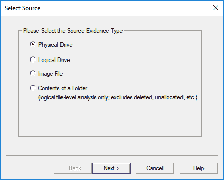

FTK Imager – 创建磁盘映像

1.  使用下拉列表选择正确的设备。

查看设备的型号和大小，确保获取的是正确的设备。

1.  选择完成。

1.  点击添加并选择镜像类型。在此示例中，将使用 Raw (dd)格式，因为它支持大多数商业和开源分析方法：

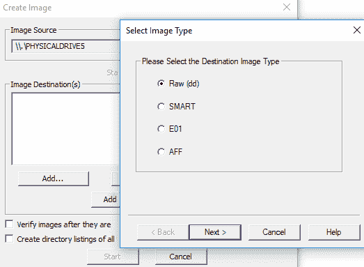

FTK Imager – 选择镜像类型

1.  输入相关案件信息并选择下一步。此步骤可以跳过。

1.  选择图片保存位置：

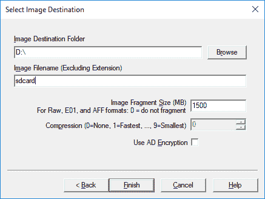

FTK Imager – 保存您的镜像文件

1.  选择完成，然后选择开始。建议在创建镜像后验证其内容。

完成后，您的结果将显示出来。接下来的部分我们将介绍如何分析 SD 卡数据。

# 关键取证数据供检查

在本节中，我们将向您介绍一些最常见的 Windows Phone 取证数据的位置，包括联系人、短信、通话和互联网历史记录。

# 提取联系人和短信

Windows Phone 7 到 10 中的所有联系人以及收发短信（SMS）都存储在名为`store.vol`的文件中，该文件位于` \Application Data\Microsoft\Outlook\Stores\DeviceStore`（Windows 7）和`Users\WPCOMMSERVICES\APPDATA\Local\Unistore`（Windows 8-10）目录下。以下是 Windows 10 中`store.vol`文件的示例：

Windows Phone 中的 store.vol 文件

现在，让我们学习如何提取通话历史。

# 提取通话历史

通话历史数据目前可以从`Phone`文件中提取。需要注意的是，该文件没有扩展名，并且位于`\Users\WPCOMMSERVICES\APPDATA\Local\UserData\`。以下是 Windows 10 中`Phone`文件的示例：

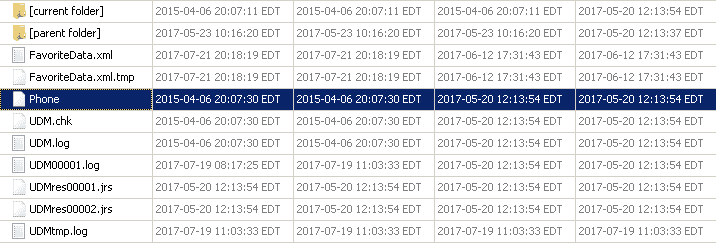

Windows Phone 中的 Phone 文件

以类似的方式，我们将在接下来的部分中提取互联网历史记录。

# 提取互联网历史

互联网历史记录可以从位于`\Users\DefApps\APPDATA\Local\Microsoft\Windows\WebCache\`的`WebCacheV01.dat`文件中提取。以下是 Windows 10 中`WebCacheV01.dat`文件的示例：

Windows Phone 中的 WebCacheV01.dat 文件

这些文件可以手动检查，例如使用十六进制查看器，或使用移动取证工具自动解析。以下是使用 Magnet AXIOM 解析的`WebCacheV01.dat`文件：

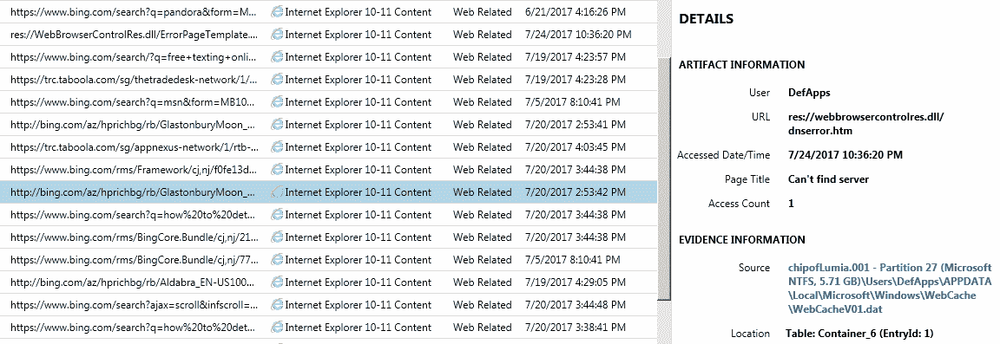

使用 Magnet AXIOM 解析的 WebCacheV01.dat 文件

到此为止，我们已经讲解了如何从 Windows Phone 中提取短信、联系人、通话和互联网历史记录。

# 总结

从 Windows Phone 设备获取数据具有挑战性，因为这些设备是安全的，商业取证工具和开源方法并不能为像你这样的取证专家提供简便的解决方案。多种工具、芯片拆卸、JTAG 以及本书中定义的方法是一些可以访问 Windows Phone 设备上用户数据的方法。通常，你会发现 Windows Phone 设备需要多种提取方法才能获取可访问的数据。最大的挑战是如何获得设备的访问权限以提取数据。一旦数据可用，所有提取的信息都可以由你进行分析。

在这一章中，我们介绍了 Windows Phone 设备的接口、重要特性和安全模型。然后，我们查看了 Windows 文件系统中的不同分区和文件夹结构。Windows Phone 注册表类似于 Microsoft 操作系统中的注册表。我们展示了如何使用或不使用商业工具提取数据，并查看了一些常见的 Windows Phone 取证数据。凭借这些知识，你现在可以使用多种提取方法从 Windows Phone 提取用户数据。

下一章将引导你解析第三方应用程序文件。
