# 解析第三方应用程序文件

第三方应用程序已经在智能手机社区掀起了风潮。大多数智能手机用户的设备上都安装了不止一个依赖于聊天、游戏、导航或分享图片的应用程序。根据[`www.statista.com/statistics/276623/number-of-apps-available-in-leading-app-stores/`](https://www.statista.com/statistics/276623/number-of-apps-available-in-leading-app-stores/)，全球几乎有 500 万个适用于各种智能手机的应用程序。苹果的 App Store 提供约 180 万个应用程序，Google Play 提供 247 万个应用程序，亚马逊提供 60 万个应用程序，Windows 提供 67 万个应用程序。预计到 2020 年，这一数字将呈指数增长。

本章的目标是向您介绍在 Android、iOS 设备和 Windows Phone 上常见的各种应用程序。每个应用程序因版本和设备的不同而有所变化，但它们的基本结构是相似的。我们将探讨数据是如何存储的，以及为何偏好文件对您的调查至关重要。

本章将详细介绍以下内容：

+   不同的第三方应用程序

+   iOS 设备上应用程序的存储方式

+   Android 设备上应用程序的存储方式

+   Windows Phone 应用程序存储

+   如何使用商业和开源解决方案解析应用程序数据

# 第三方应用程序简介

第三方应用程序是移动设备调查的重要组成部分；关键证据往往存在于应用程序内部。这要求您了解应用程序数据在设备上的存储位置、该平台如何保存应用程序数据，以及哪种工具最有助于发现证据。在任何智能手机上检查第三方应用程序时，手动解析通常是一个关键因素。虽然一些商业工具，如 Belkasoft Evidence Center 或 Magnet AXIOM，以支持应用程序解析而著名，但没有任何工具是完美的，几乎不可能让工具跟上每个应用程序频繁更新的步伐。

通常，您会发现，市面上大多数商业工具都支持解析最流行的应用程序。例如，当 Facebook 收购 WhatsApp 时，Belkasoft、Cellebrite、Magnet Forensics 和 Oxygen Forensics 等公司开始支持该应用程序。Facebook 非常受欢迎，但由于内置的安全功能，数据并不总是能够被提取或解析——这正是所有应用程序不同之处。我们最好的建议是进行多次测试！您可以下载一个应用程序，填充数据，并检查结果，看看您对证据的看法与实际证据的差异。这种实践将帮助您了解更新如何改变证据的痕迹，证据位置如何变化，以及如何手动提取您的工具无法捕捉到的证据。此外，逆向工程应用程序并分析其代码将帮助您识别数据存储的位置及其存储方式。

大多数应用不需要数据计划就可以使用；它们可以完全通过 Wi-Fi 网络运行，这意味着即使一个人旅行到一个通常其设备无法使用的地区，应用仍然可以正常运行。例如，当我旅行时，我依赖 Skype、Viber 和 WhatsApp 与家人和朋友通话和发短信。使用这些应用，只需要我的智能手机连接到 Wi-Fi。

我们已经在本书中介绍了一些第三方应用提取和分析的技巧。此外，我们还讨论了需要检查的文件，以了解和分析应用数据，具体内容见第五章，《*iOS 数据分析与恢复*》；第十章，《*Android 数据分析与恢复*》；第十一章，《*Android 应用分析、恶意软件与逆向工程*》；和第十二章，《*Windows Phone 法医分析*》。本章将深入探讨这些应用及相关文件，并为分析这些数据做好准备。每个应用都有其特定的用途。大多数工具都支持每个类别中最受欢迎的应用。其余的就交给你了。下图展示了 Oxygen Forensic Detective 工具所呈现的应用。正如预期的那样，这些并不是设备上所有的应用，而只是工具能够解析的部分应用：

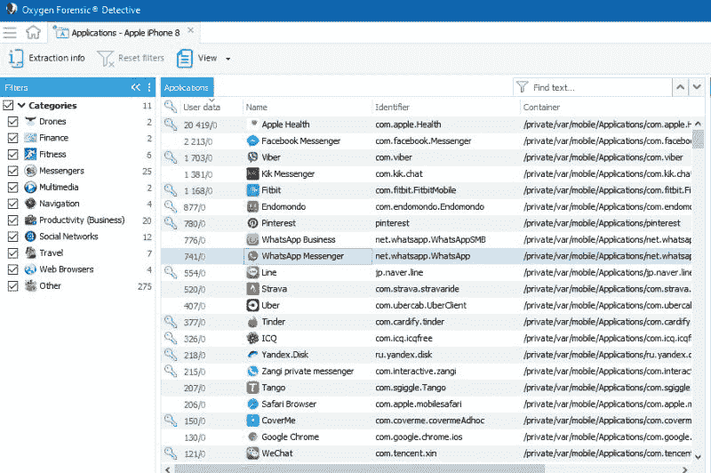

Oxygen Forensic Detective 在苹果设备上解析的应用示例

在接下来的部分，我们将分析一些广泛使用的聊天应用。

# 聊天应用

聊天应用是市场上最常见的应用之一。这些应用提供了用户在网络服务提供商提供的标准服务之外进行聊天或通话的功能。这些应用可能比其他应用更安全。所谓“安全”是指这些应用可能提供加密、私人资料、私人群聊等功能。此外，这些应用使用户能够在无需数据计划的情况下进行消息传递或通话，因为 Wi-Fi 提供了他们所需的所有访问权限。Facebook Messenger、WhatsApp、Skype、Tango 和 Snapchat 是一些比较受欢迎的应用。

从聊天应用程序中解析证据并非总是简单的。通常需要多种工具和方法才能提取其中的所有数据。商业工具可能只解析部分数据，这会迫使你学习如何检查和恢复所有数据，否则可能会错过证据。在下图中，Oxygen Forensic Detective 正在用于解析安卓设备上 Tango 应用的聊天消息。请注意，消息中并没有显示表格中的图片。然而，这张图片可以被*拼接*回消息中（注意截图中箭头指向的是图片所属的消息），以便提供一个关于对话中分享内容的整体图像。这是一个手动过程，并非工具自动执行：

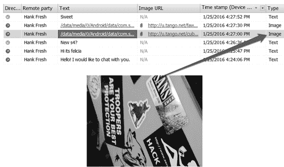

将应用程序聊天日志拼接回来的示例

接下来，我们将看看 GPS 应用程序。

# GPS 应用程序

大多数用户会从标准的手机应用扩展到 GPS 支持。包括获取路线指引和获取感兴趣区域的地图。常见的 GPS 应用包括 Waze 和 Google Maps。Waze 不仅仅提供路线指引，还会提醒用户沿途的道路危害、交通状况以及警察的存在：

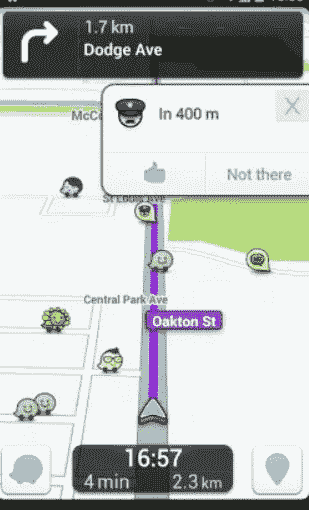

Waze 应用程序

其他存储位置信息的应用程序包括 Twitter、Instagram、Facebook 和 Foursquare。这些应用程序允许用户在创建帖子或分享图片或视频时，提醒朋友和关注者自己所在的位置。所有这些交易都在应用程序内进行跟踪。了解这一点对于揭示你的取证工具未报告的额外证据至关重要。

在检查 GPS 应用程序的位置信息时，最好假设你需要手动检查与该应用程序关联的数据库和偏好设置文件。我们建议使用你的取证工具对设备上的数据进行初步筛查，然后深入分析证据，相关内容将在本章稍后讨论。以下截图显示了 Waze 被 UFED Physical Analyzer 解析的示例。在这里，我们可以看到用户有 5 个收藏位置、74 个已映射位置和 70 条最近的路线指引。所有这些信息必须手动验证，如果与调查相关。这是因为工具无法判断用户是手动输入地址，还是系统推荐的，或者用户是否真的去了该位置。将用户与特定位置关联的技能是你所必需的，这比单靠取证工具要复杂：

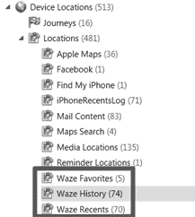

UFED Physical Analyzer 中的 Waze 应用程序

我们现在将分析一些流行的安全消息应用程序。

# 安全应用程序

如果数据是安全且自毁的，那它曾经存在过吗？忽略数据保存的说法，去寻找那些数据，因为这些应用常常做出不真实的声明。尽管这些应用设计时考虑到了安全性，但更新发布得很快，质量保证检查可能不足以捕捉所有问题。有时，你会发现应用中有加密或不存在的数据库，但文件中包含日志、写前日志或共享内存文件，这些文件包含本应加密的聊天部分。除此之外，用户还可以保存共享的媒体文件、截屏对话，还能做更多的事情。通常，你可能会发现共享的图片、音频和视频文件，原本应该是加密的。

一些流行的安全消息应用包括 Telegram、Wickr 和 Signal。其中一些应用是加密的，无法恢复任何内容。然而，这一切都取决于设备、智能手机上运行的操作系统以及应用的版本。这些应用的安全级别是公开宣传的，但同样，需要保持一定的怀疑态度。你应该始终假设应用中可能存在漏洞，可能会提供法医取证的访问权限。深入挖掘这些证据！

# 财务应用

使用财务信息的应用，如信用卡信息和个人银行信息，必须进行加密并确保安全。iOS 设备没有 Apple ID 和密码是无法安装这些应用的。即使你拥有用户的 Apple ID 和密码，提取的数据仍然应该是加密的。一些财务应用的例子包括 Google Pay、Microsoft Wallet、PayPal、Apple Pay 和应用内购买。当你检查设备时，可能会看到该应用已安装并带有相关的应用元数据，但账户信息和交易将无法访问。

# 社交网络应用

社交网络应用的商业支持非常强大，因为它们是应用商店中下载最多的应用。这些应用允许用户发布动态、共享位置、公开和私下聊天，基本上是记录他们的生活。常见的社交网络应用包括 Facebook、Twitter 和 Instagram。通常，用户会启用像 Instagram 这样的应用，以便访问 Facebook 和 Twitter，从而使发布过程更加无缝。因此，在检查设备时，用户可能会发现多个相同的文件或对话副本，因为应用间的共享。

在使用商业工具检查这些应用程序时，通常会解析聊天记录和联系人，这意味着其他数据可能被忽略。再次强调，你必须查看数据转储，确保没有遗漏任何内容。作为示例，我们将来看一下 Twitter。这个应用程序存储了大量的信息，可能需要不止一个工具来解析。此外，用户可能需要手动检查数据库文件，以确保所有证据都已恢复。

让我们来看一下工具能提取的内容。正如本书中多次提到的，首先从工具告诉你已安装的内容开始，然后制定关键词和方法，深入文件系统。我们可以在以下截图中看到 Twitter 的用户账户信息，以及该数据提取的文件路径：

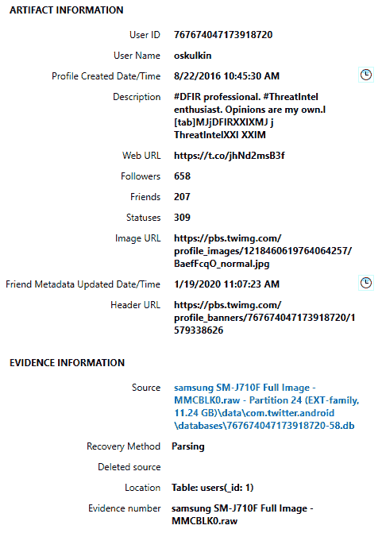

Magnet AXIOM 解析的 Twitter

接下来的逻辑步骤是查看工具能告诉你关于应用程序及其使用方式的信息。Magnet AXIOM 提供了以下关于 Twitter 账户使用的信息。请注意，公共推文和私人消息（DM）都已恢复：


Magnet AXIOM 解析的 Twitter 使用情况

在检查工具解析的内容后，应检查数据库文件以确保没有遗漏任何数据。这并不总是简单的，因为每个账户和功能可能都有独特的数据库。我们所说的功能是指，联系人可能存储在一个数据库中，而聊天记录和账户信息则存储在另一个数据库中。随着你对常见应用程序的熟悉，你将知道从哪里开始查看。

在以下截图中，我们可以看到所有与 Twitter 相关的数据库。同样，从你已经知道的信息开始，然后深入挖掘：


包含用户活动的 Twitter 数据库

每个数据库可能包含独特的数据，可以解析出更多的证据。这些应用程序还包含独特的`user_id`值，这些值可以作为关键词用于搜索在调查中有通讯痕迹的其他设备。

可以编写自定义查询来解析感兴趣的 Twitter 数据库。以下展示了一个如何执行此操作的良好示例。这个查询专门用于解析 Twitter 联系人：

```
SELECT _id AS "Index", 
user_id AS "User ID", 
username AS "Username", 
name AS "Name", 
datetime (profile_created/1000,'UNIXEPOCH','localtime') AS "Profile Created", 
description AS "Twitter Description", 
web_url AS "Website URL",
location AS "Location",
followers AS "Followers", 
friends AS "Following", 
users.statuses AS "Number of Tweets",
image_url AS "Profile Image URL", 
datetime (updated/1000,'UNIXEPOCH','localtime') AS "Profile Updated" 
FROM users
```

到目前为止，我们已经看过了各种第三方应用程序以及工具如何帮助调查员提取数据。接下来，我们将探讨一些在分析数据时帮助调查员的基本概念。

# 编码与加密

在讨论应用程序和智能手机数据时，*编码*和*加密*这两个术语使用得非常频繁，因此它们常常被混淆。编码本质上是将信息或消息伪装成原始代码的过程。在某些情况下，编码的目的是使数据对计算机或用户不可识别。实际上，编码的主要目标是使用公开的方案将输入转换为不同的格式。换句话说，任何人都可以轻松解码一个编码值。而加密则是使用密钥将数据转换，以保持其内容的机密性。因此，只有当你拥有密钥时，加密文本才可以被反转。

大多数应用程序声称它们会加密数据或数据永远不会保存到磁盘上。虽然一些应用程序确实如此，但大多数只是对数据进行了编码。编码选项可能有所不同，但智能手机数据最常见的编码方式是`Base64`。消息应用程序通常依赖`Base64`编码来使数据看起来像是被隐藏或*安全的*。`Base64`的一个常见特征是，当编码字节不能被三整除时，数据会用`**=**`进行填充。

几年前，Oxygen Forensics 和 Autopsy 是少数几款支持解码从智能手机应用程序中提取的`Base64`负载的工具。为了使这些工具能够解析数据，它们必须支持包含编码的应用程序。目前，MSAB、UFED Physical Analyzer 和 Magnet IEF 提供`Base64`解码支持。

以下截图展示了一个`Base64`编码的消息示例。这些数据来自 Tango 聊天应用：


Base64 编码的 Tango 消息

加密稍微复杂一些，因为应用程序本身可能根本不提供对加密数据的访问。例如，你可能会发现数据库目录或包含加密数据的单元格是空的。偶尔，你能访问到数据库中的加密数据块，但这些数据并不总是能被解密。同样，当你面对加密数据时，应该去其他地方查找。你是否检查了日志和预写日志？你是否检查了缓存和媒体目录？你是否检查了 SD 卡？这些是你经常需要问自己的常见问题，确保你不仅仅依赖你的取证工具，并且确保你已经全面检查，确保没有任何东西被忽视。正如我们所解释的，从你知道的地方开始。我们知道缓存和数据库目录存储着用户数据，因此这是开始手动检查的好地方，正如你在下面的截图中看到的：

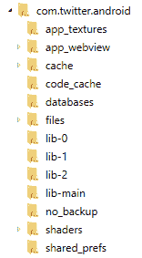

应用程序的数据存储位置

在接下来的部分中，我们将讨论应用程序如何在设备中存储它们的数据以及各种存储选项的重要性。

# iOS、Android 和 Windows Phone 应用程序的数据存储

几乎所有应用程序都依赖 SQLite 进行数据存储。这些数据库可以存储在设备的内部存储中，或者存储在相关手机的 SD 卡上。当使用 SQLite 时，临时内存文件通常与每个数据库相关联，以提高 SQLite 的效率。这些文件包括**回滚日志**（**JOURNAL**）、**预写日志**（**WAL**）和**共享内存**（**SHM**）文件。这些文件可能包含 SQLite 数据库中不存在的数据。我们可以在以下截图中看到与各种 WhatsApp 数据库文件相关联的多个 WAL 和 SHM 文件：

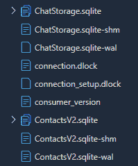

SHM 文件和 WAL 示例

除了 SQLite 数据库外，其他设备还依赖 Plist、XML、JSON 和 DAT 文件进行应用程序数据存储、账户数据存储、购买信息和用户偏好存储。本章中关于 Android、iOS 和 Windows Phone 的部分将讨论这些文件。

# iOS 应用程序

Apple 依赖 SQLite 和 Plist 作为应用程序数据存储的常见位置。偶尔，JSON 文件也会用于应用程序数据。检查从 iOS 设备恢复的应用程序可能会令人不知所措。我们建议您从已知的内容开始，并参考您的工具提供的信息。检查您选择的工具列出的已安装应用程序。从这里直接进入应用程序目录，确保没有遗漏任何内容。当用户删除应用程序时，数据库通常仍然存在，链接到已安装的应用程序仅仅是断开的。检查 iOS 设备的所有区域将有助于避免遗漏数据：

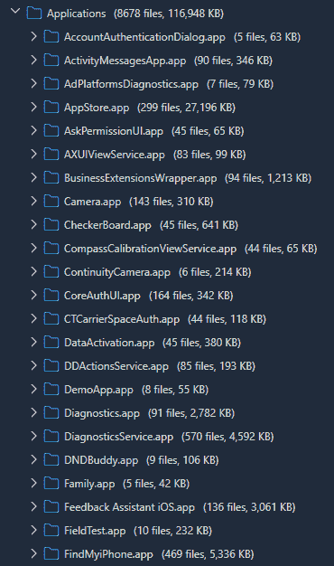

iPhone 上的已安装应用程序

在检查已安装的应用程序后，搜索`Library`和`Documents`目录，查找可能包含应用程序遗留数据的相关 Plist 文件。最后，检查 iPhone 的`Media`目录以及与该应用程序相关的目录，以恢复额外的遗留数据，例如共享照片、视频、音频文件和个人资料图片。在下面的截图中，我们正在检查与 WhatsApp 应用程序相关的`Media`目录：

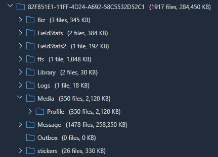

iPhone 上的应用程序数据

接下来，我们将查看 Android 应用程序中的数据存储。

# Android 应用程序

Android 设备在应用程序存储方面严重依赖 SQLite。每个应用程序的偏好设置文件通常采用 DAT 或 XML 文件格式。与 iOS 设备相比，检查 Android 设备上的应用程序可能是最繁琐的任务之一。这是由于数据可能存储在各种不同的位置。最好的起点是使用可以列出设备上已安装应用程序的工具。接下来，进入`/Root`目录下的子目录。记住，这些应用程序可能有独特的名称，可能很难找到。

你可能需要研究应用程序，以更好地理解与之相关的文件名。以下截图是 Android 设备上应用程序目录的一个示例：


Android 设备上的应用程序数据

每个应用程序目录都包含大量需要检查的数据。我们建议从 `Databases` 和 `Cache` 目录开始，然后将分析范围扩展到设备上的其他位置。接下来的检查位置包括 `Media` 和 `Cache` 分区。如果数据似乎丢失或声称已被删除，请不要忘记检查设备和 SD 卡上的 `Downloads` 目录。

应用程序数据可能存在于 `Media` 目录的多个位置。使用如 UFED Physical Analyzer 这样的工具，它提供了超越解析项目的关键字搜索功能，将非常有助于定位与特定应用程序相关的文物。在以下截图中，我们查看了存储在 Android 设备 `Media` 目录中的大量数据。这些数据与之前讨论的应用程序目录中存储的数据是不同的。每个位置都需要彻底检查，以确保不会遗漏任何内容。重要的是，你需要运用在前面章节中学到的知识来分析 Android 应用程序数据：

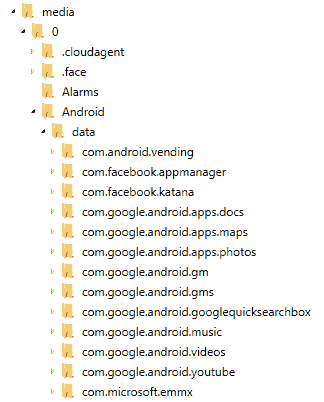

存储在 Media 目录中的独特应用程序数据

现在我们来看看 Windows Phone 上安装的应用程序及其获取方法。

# Windows Phone 应用程序

在 Windows Phone 上找到的应用程序与在 iOS 和 Android 设备上找到的应用程序没有区别。SQLite 是用于数据存储的最常见格式。然而，并不是所有设备都允许将 SQLite 文件存储在手机内部。对于这些设备，所有的应用程序数据都将存储在 SD 卡上。有些人可能会认为这是一件幸运的事，因为这样可以避免我们需要检查设备上的多个位置，但 SD 卡和应用程序本身可能会被加密。

如果可能，最好将 SD 卡移除并使用取证工具获取它。当这不可行时，下一步的最佳方法是尝试通过手机使用取证工具获取 SD 卡。同样，这通常会导致数据丢失。作为最后的努力，可以通过挂载设备并使用 Windows 资源管理器查看存储在设备和 SD 卡上的应用程序，进行实时分析，正如在第十二章中讨论的，*Windows Phone 取证*。

# 提取第三方应用程序数据的取证方法

几乎所有商用工具都会尝试支持提取第三方应用的数据。如果你依赖工具输出作为调查结果，建议你对工具进行彻底且频繁的测试。这是因为应用更新非常频繁，工具几乎不可能不遗漏任何内容。你必须了解这些应用，它们的工作原理以及设备如何存储每个应用的数据。我们强烈建议你使用工具来筛查案件，然后深入数据手动提取工具遗漏的任何信息。确保在法医报告中只包括事实数据，而不是所有工具解析的数据，因为工具无法区分设备与人类创作的数据，只有经过训练的检查员才能自信地做出区分。

# 商用工具

如本书中所示，处理智能手机取证的工具有很多。然而，真正能在解析应用数据方面表现出色的工具却不多。Magnet AXIOM、Oxygen Forensic Detective 和 UFED Physical Analyzer 是其中几个在本章讨论的应用类别数据恢复方面做得很好的工具。我们将简要介绍如何利用这些工具解析应用数据。请记住，这些工具并不会找到所有应用，也不会解析所有应用的数据。

# Oxygen Forensic Detective

Oxygen Forensic Detective 可用于检查应用数据。在这个示例中，我们假设数据采集已完成，我们只是在尝试分析数据。请注意，Oxygen 能够采集和分析智能手机。在这个示例中，我们用 Cellebrite UFED 采集了设备，并用 Oxygen 分析了数据。要加载设备的数据转储并检查其应用文物，请按照以下步骤操作：

1.  启动 Oxygen Forensic Detective。

1.  选择“导入文件”选项并选择你的图片。Oxygen 支持多种图像格式的导入。

1.  解析完成后，开始检查已解析的应用：

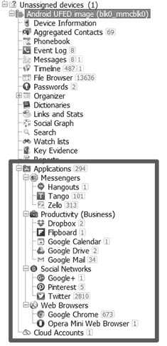

Oxygen Forensic Detective 应用视图

1.  接下来，开始检查感兴趣的应用，点击该应用并查看所有相关文件。

1.  一旦选择了应用，你将看到解析出来的数据以及数据提取的完整文件路径。使用此路径手动验证结果。我们在下面的截图中查看的是 Pinterest 应用。注意，容器、文件和感兴趣的表格都被提供并超链接给用户。该工具甚至鼓励你深入挖掘并验证结果：

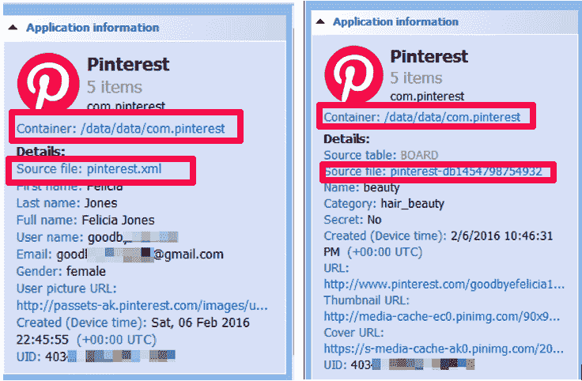

Oxygen Detective Pinterest 示例

Oxygen Detective 内置了关键词搜索、书签和报告功能。此外，SQLite 数据库和 Plist 查看器将为您提供检查相关应用数据的方法。

1.  报告所有账户信息、聊天记录、消息、位置和任何其他相关数据，因为这些对您的调查具有重要性。

接下来我们将讨论的工具是 Magnet AXIOM。

# Magnet AXIOM

Magnet AXIOM 一直被认为是互联网和应用程序解析领域的领导者之一，在数字媒体领域表现卓越。它在移动设备方面同样强大。再次强调，单一工具无法完成所有工作，但 AXIOM 已证明是最强大的工具，能够解析来自 Android、iOS 和 Windows Phone 的大多数应用程序。使用 AXIOM 审查应用程序文物时，请执行以下步骤：

1.  启动 AXIOM，创建一个新案件，然后选择 MOBILE（注意，如果 MOBILE 被灰显，您需要从 Magnet Forensics 获取一个支持移动设备的许可证）：

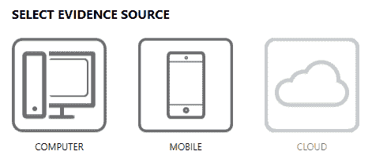

选择证据源

1.  选择加载证据（LOAD EVIDENCE），并导航到您的图像文件。可以同时加载并解析多个图像。

1.  选择进入文物详情（GO TO ARTIFACT DETAILS），并确定您希望解析的内容。我们建议选择所有应用程序：

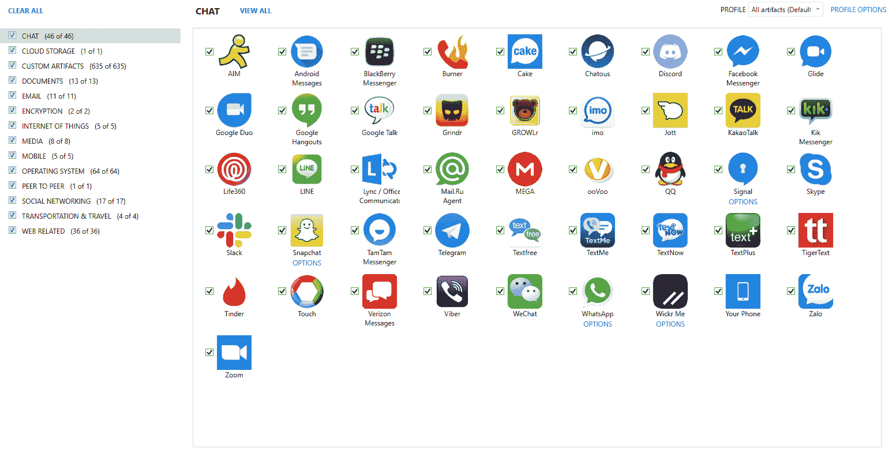

Magnet AXIOM 支持的文物

1.  选择分析证据（ANALYZE EVIDENCE）。

1.  完成后，您可以使用文物：

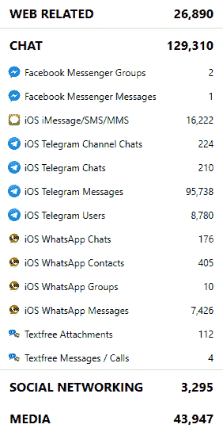

Magnet AXIOM 中的应用程序文物

审查的第一步是检查 AXIOM 已经解析的内容。在前面的截图中，我们可以看到 Telegram 已经被解析。请从最相关的位置开始审查。例如，如果你正在寻找 Telegram 聊天记录，可以直接跳到该位置并开始审查文物。请注意，消息和聊天被分为两类。这在使用私密消息时很常见。所有相关的应用容器都应该被检查。此外，AXIOM 提供了数据恢复的完整文件路径。使用其他工具导航到该文件进行验证和手动检查。

AXIOM 还提供了逻辑关键词搜索（它将仅搜索能解析的内容，而不搜索其他内容）、书签和报告功能。确保你只报告实际的应用文物，并将其纳入最终的取证报告中。

# UFED 物理分析器

Physical Analyzer 是市场上最著名的移动取证工具之一。这个工具不仅能帮助用户手动进行检查，还能利用工具解析出的数据进行分析。对于应用程序分析，Physical Analyzer 擅长解析每个支持的应用程序的聊天记录和联系人信息。对于那些未解析的数据，Physical Analyzer 提供了一个分析平台，允许用户浏览文件系统，揭示更多证据。该工具的关键词搜索功能强大，能够搜索原始的十六进制数据以及已解析的数据。此外，它还包括一个 SQLite 查看器。

要在 Physical Analyzer 中进行应用程序数据的取证检查，请按照以下步骤开始：

1.  双击 UFED 快捷方式图标文件或双击工具图标来启动 Physical Analyzer。

1.  加载图像文件并等待解析完成。

1.  检查解析出的证据，如下图所示：


Physical Analyzer 解析的数据

我们建议检查解析的内容，并参考数据提取的超链接位置。导航至该路径，然后检查整个应用程序目录。

要查找应用程序目录，可以利用内建的关键词搜索功能来协助调查。记住，如果文件名不明显，你可能需要做一些研究来确定与应用程序相关的文件名。

# 开源/免费工具

对于预算有限的用户，可以使用开源解决方案和廉价工具来检查智能手机上的应用程序数据。这些解决方案使用起来更加困难，通常对于那些需要工具帮助进行数据提取和分析的新手取证人员来说，并不是最好的选择。检查应用程序数据是一个繁琐的过程，如果你不知道该从哪里入手，可能需要花费一些钱来快速开始。像 Andriller 这样的工具大约可以以$500 的价格购买。虽然这并不是免费的，但也远低于一些其他商业工具的$10,000 价格。在接下来的章节中，我们将介绍几款我们最喜欢的有助于解析智能手机应用数据的工具。

# 使用 Autopsy

Autopsy 是最好的文件系统检查工具之一。不幸的是，Autopsy 不支持 iOS 解析，但它仍然可能对文件系统镜像有用。Autopsy 可以从 [`sleuthkit.org/autopsy/`](http://sleuthkit.org/autopsy/) 下载。当使用 Autopsy 时，Android Analyzer 模块将从设备中解析一些应用程序数据。接下来让我们看看如何使用 Autopsy 进行 Android 镜像分析。

要使用 Autopsy，请下载软件并在 Windows 计算机上安装，按照这些指示操作。确保你始终使用最新版本：

1.  启动 Autopsy。

1.  创建一个新案件：

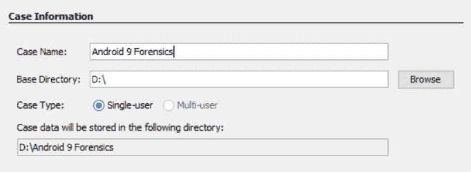

Autopsy 案件创建

1.  选择“下一步”，然后点击“完成”。

1.  导航到您的图像文件并选择“下一步”。

1.  选择您希望运行的模块。对于 Android 设备，关键字搜索和 Android 分析器将最有成效：

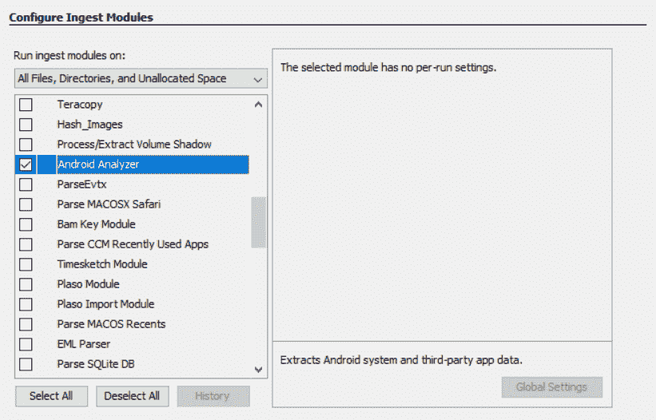

Autopsy 模块选择

数据导入模块是内置于 Autopsy 的工具，可以在案件开始时或之后的任何时间运行。此版本的 Autopsy 默认模块如下：

+   最近活动：此功能提取最近的用户活动，如网页浏览、最近使用的文档和已安装的程序。

+   哈希查找：此功能使用提供的哈希数据库（如标准的 NSRL 数据库）识别已知和著名的文件。它还允许导入自定义哈希数据库。

+   文件类型识别：此功能根据二进制签名匹配文件类型。

+   压缩文件提取器：此功能提取压缩文件（`.zip`、`.rar`、`.arj`、`.7z`、`.gzip`、`.bzip2` 和 `.tar`）。它自动提取这些文件类型并将其内容放入目录树中。

+   EXIF 解析器：此功能导入 JPEG 文件并提取其 EXIF 元数据。

+   关键字搜索：此功能通过关键字和正则表达式在列表中执行文件索引和定期搜索。它允许加载自定义的关键字/列表。

+   邮件解析器：此模块检测并解析 `mbox` 和 `pst`/`ost` 文件，并将电子邮件工件填充到黑板中。

+   扩展名不匹配检测器：这些是具有非标准扩展名的标记文件，依据其文件类型来判断。

+   E01 验证器：此功能验证 E01 文件的完整性。

+   Android 分析器：此功能提取 Android 系统和第三方应用程序的数据。

+   有趣文件识别器：此功能识别定义的有趣项目。

此外，您还可以为 Autopsy 安装第三方模块。其中一些对于 Android 取证非常有用。一个很好的例子是 Mark McKinnon 提供的 Parse SQLite DB 模块。此模块会解析它找到的任何 SQLite 数据库，并将其导入到提取的内容中。这个模块和其他模块可以从这个 GitHub 下载：[`github.com/markmckinnon/Autopsy-Plugins`](https://github.com/markmckinnon/Autopsy-Plugins)

Autopsy 提供比任何商业或开源工具更快的文件系统数据访问速度。从此之后，如何进一步操作才是难点。因此，再次强调，首先从提取的内容开始，然后深入文件系统，检查本书中讨论的文件和任何相关的应用数据，如下图所示：


使用 Autopsy 浏览文件系统

一旦确定了感兴趣的应用程序，首先查看已解析的内容，然后检查相关的数据库、缓存和偏好设置文件。Autopsy 包括一个基本的 SQLite 查看器，可以用于初步筛查。如果需要运行查询，我们建议使用 DB Browser for SQLite 或商业产品中包含的浏览器，例如 Belkasoft Evidence Center，特别是当你需要分析来自空闲列表和未分配空间的数据时。

Android Analyzer 可以自动解码一些数据，例如联系人、通话记录和短信。以下截图显示了解码后的短信结果：


Autopsy 解码的短信

现在，我们将探讨一些提取数据的其他方法。

# 提取应用数据的其他方法

解析应用数据的最简单方法之一是创建自定义的 SQLite 查询和 Python 脚本来解析感兴趣的数据。我们在本书中讨论了多个查询和脚本的建议与示例。Python 是最好的解决方案之一，因为它是免费的，并且我们可以完全访问它的库。需要记住的一点是，我们的脚本必须经常更新，以跟上应用更新的步伐。此外，请确保你的编码方案正确，以避免遗漏或错误解读应用数据。

除了 Python 脚本，已经存在一些免费的解析器，支持应用数据提取。WhatsApp Extract 是一款适用于 Android 和 iOS 的免费工具，可以从设备中提取 WhatsApp 应用数据。通常，这款免费工具提取的数据比商业解决方案更多，具体取决于用户在安装过程中分配的权限。其他开发者，如 Mari DeGrazia ([`az4n6.blogspot.in/p/downloads.html`](http://az4n6.blogspot.in/p/downloads.html))，Adrian Leong ([`github.com/cheeky4n6monkey/4n6-scripts`](https://github.com/cheeky4n6monkey/4n6-scripts))，Sarah Edwards ([`github.com/mac4n6`](https://github.com/mac4n6)) 和 Alexis Brignoni ([`github.com/abrignoni`](https://github.com/abrignoni))，也开发了用于解析应用程序、从 SQLite 空白页恢复删除数据、解码 `Base64` 等的脚本。我们建议在开发自己的工具之前，先使用现有的工具。

# 总结

在本章中，我们了解了如何成功地解析和提取流行第三方应用的数据。许多应用并不像它们所宣称的那样。不要轻信关于应用的描述，因为各应用的质量保证测试不一致，且多年来我们已发现了几处漏洞和安全缺陷，这些问题为我们提供了将应用数据重新拼凑的方法。同时，应用更新会改变我们查看数据的方式。理解每款智能手机以及它如何存储应用数据，是成功检查智能手机应用的第一步。要明白，更新可能会改变数据的位置、编码和加密方式，以及工具的功能，这也是考官最难掌握的概念之一。你的任务是了解应用的能力，以便从移动设备中提取尽可能多的数据。

理解一个应用程序的工作原理本身就足够困难，更别提还要考虑如何提取证据了。正如你在本书中所阅读到的，提取智能手机中的数据有许多方法。单一的工具永远不够，实际上，移动取证可能会非常昂贵。我们希望我们提供的这本实用指南，能帮助你学习如何获取并分析从智能手机中恢复的证据。将你所学的应用到你的方法中，立即投入到你的移动取证工作中，或是用它来帮助你在下一个工作中更加准备充分。记住，实践、测试和培训将使你在工作中更加出色，并帮助你完善移动取证的技巧。
