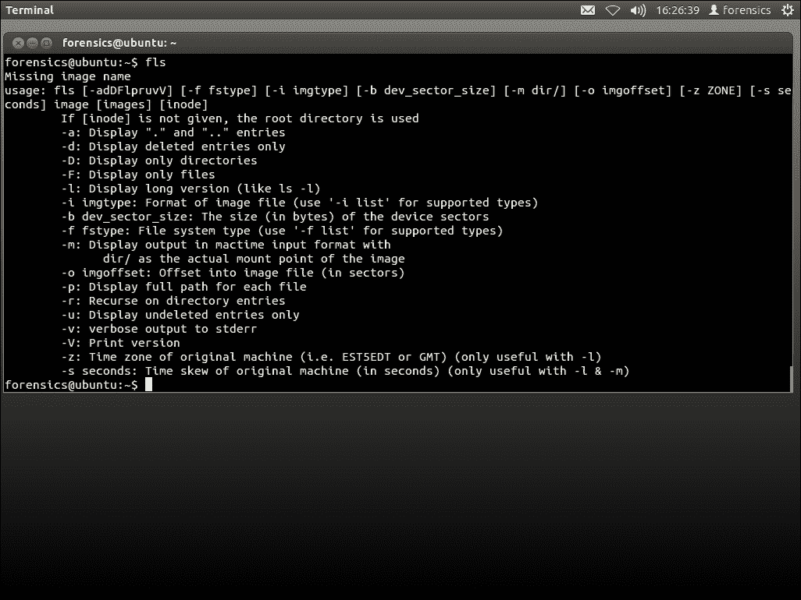
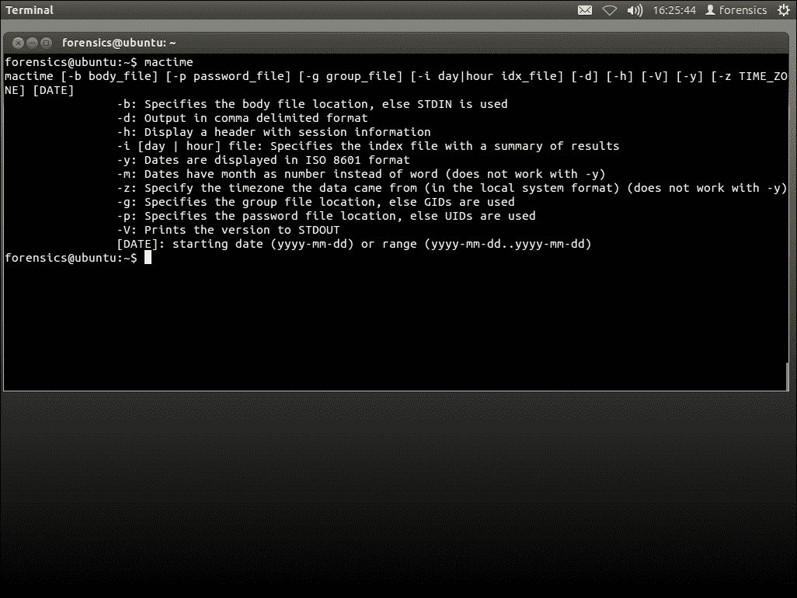
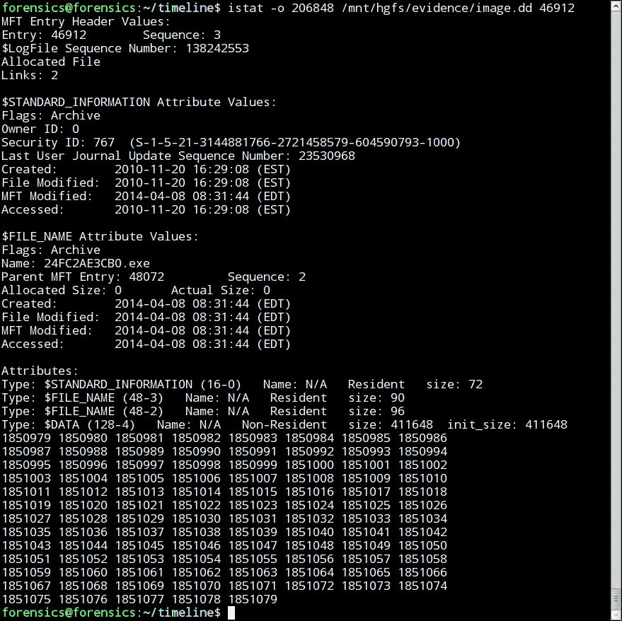
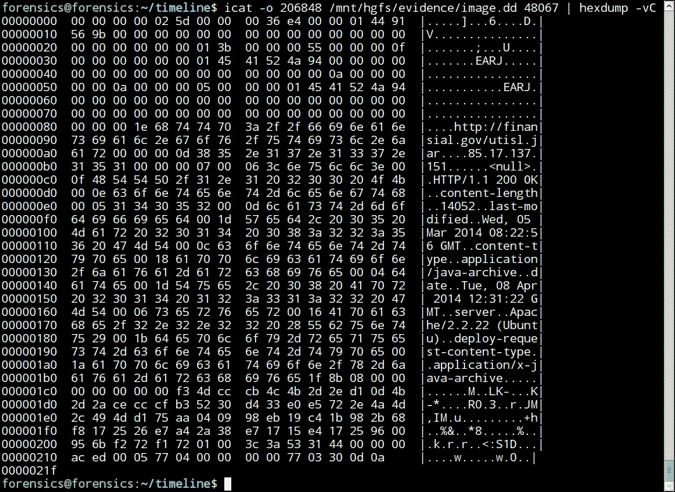
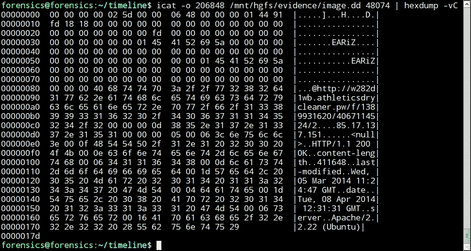
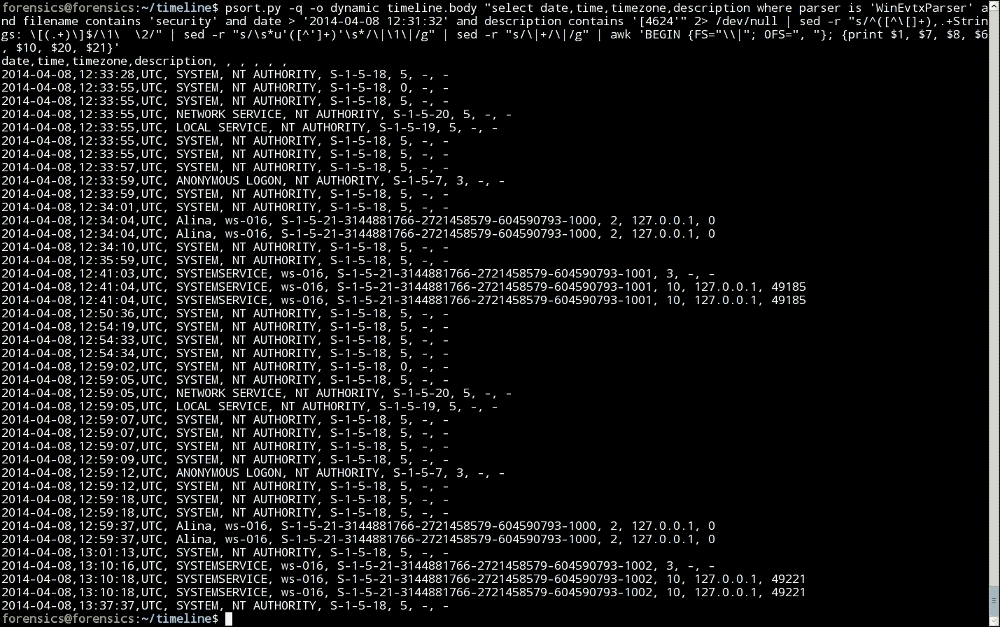

# 第五章 时间线

在本章中，我们将探讨时间线分析。我们将学习几种使用侦探工具包（The Sleuth Kit）和 Plaso 框架进行时间线分析的不同方法。我们还将涵盖一些特定于某些文件系统的理论问题，以及它们如何处理与文件时间相关的属性。我们还将演示如何在实践中使用 Plaso。

简而言之，我们将涵盖以下主题：

+   时间线

+   **侦探工具包** (**TSK**)

+   Plaso 架构

+   Plaso 的实际应用

# 时间线简介

在取证过程中，一个非常突出的疑问是，“什么时候？”

换句话说，时间是取证过程中分析的一个非常重要的因素。在调查中，我们使用的许多工件都有时间特征。这些特征帮助我们构建事件的完整图景。

此外，时间线分析有助于我们分析不同类型的证据。时间线分析可以建立在任何具有时间戳的来源上。这可以是文件系统的元数据、注册表、事件日志文件、应用程序的日志文件、内存、网络流量等等。

当然，时间线是数字取证中最有用的技术之一。然而，这基于对特定工件的分析，因此理解如何分析那些提供时间线事件的工件非常重要。

尽管时间线背后的概念看似简单，但实际上并不容易。一个困难是必须分析大量数据。对于一个正在运行的系统来说，问题在于有少量用户和大量系统服务，这些服务会产生许多事件。我们需要过滤掉正常用户的活动。

时间线的概念并不新鲜。自 2000 年以来，Rob Lee 和其他一些取证专家开始在数字取证中应用它。最初，文件系统是时间线数据的来源。我们将在本综述中将 NTFS 文件系统作为最常用的文件系统进行讨论。

NTFS 文件系统的时间线基于文件系统对象某些属性中的时间戳。

每个文件系统对象都有以下时间戳：

+   `M`：这是数据修改的日期

+   `A`：这是数据访问的日期

+   `C`：这是元数据更改的日期

+   `B`：这是元数据创建的日期

基于对这些数据的分析，我们可以确定文件何时被创建、复制、移动等等。NTFS 文件系统使用`FILETIME`作为其 UTC 时间格式。**UTC**是**协调世界时**。`FILETIME`包含一个 64 位的值，表示自 1601 年 1 月 1 日（UTC）以来的 100 纳秒间隔数。MS Windows 还使用其他时间格式，包括 UNIX 时间格式、DOS 日期格式和`SYSTEMTIME`格式。

此外，我们还需要强调一些文件在不同文件系统间移动的情况，例如文件被复制到 USB 驱动器。大多数情况下，USB 使用 FAT32 文件系统，因此 FAT32 系统中的文件属性和时间戳与 NTFS 和 FAT32 文件系统之间有所不同。

假设有一个文件在 NTFS 文件系统上创建，然后被复制到使用 FAT32 文件系统的 USB 上。在这种情况下，修改日期保持不变，但 USB 上的创建日期会变化，且会调整为文件在 USB 上创建的日期。微软对不同情况下属性变化的解释可以参考 [`support.microsoft.com/kb/299648`](http://support.microsoft.com/kb/299648)。以下是与日期和时间戳相关的文件属性：

+   如果一个文件从 `C:\fatfolder` 复制到 `C:\fatfolder\subfolder`，它保持相同的修改日期和时间，但创建日期和时间会更改为当前日期和时间。

+   如果一个文件从 `C:\fatfolder` 移动到 `C:\fatfolder\subfolder`，它保持相同的修改日期和时间，并保持相同的创建日期和时间。

+   如果一个文件从 `C:\fatfolder` 复制到 `D:\NTFSfolder`，它保持相同的修改日期和时间，但创建日期和时间会更改为当前日期和时间。

+   如果一个文件从 `C:\fatfolder` 移动到 `D:\NTFSfolder`，它保持相同的修改日期和时间，并保持相同的创建日期和时间。

+   如果一个文件从 `D:\NTFSfolder` 复制到 `D:\NTFSfolder\SUBfolder`，它保持相同的修改日期和时间，但创建日期和时间会更改为当前日期和时间。

+   如果一个文件从 `D:\NTFSfolder` 移动到 `D:\NTFSfolder\SUBfolder`，它保持相同的修改日期和时间，并保持相同的创建日期和时间。

在所有情况下，除非文件的某个属性发生变化，否则文件的修改日期和时间不会改变。文件的创建日期和时间会根据文件是被复制还是移动而变化。

以下是与日期和时间戳相关的文件夹属性：

+   如果在 NTFS 分区上创建了两个新文件夹，分别为 `D:\NTFSfolder1` 和 `D:\NTFSfolder2`，则它们的创建日期和时间以及修改日期和时间相同。

    +   如果 `D:\NTFSfolder2` 文件夹被移动到 `D:\NTFSfolder1` 文件夹中，创建了 `D:\NTFSfolder1\NTFSfolder2`，则会发生以下情况：

        +   `D:\NTFSfolder1`：这是当创建的文件夹保持不变，而修改的时间戳发生变化的情况。

        +   `D:\NTFSfolder1\NTFSfolder2`：这是当创建的文件夹发生变化，而修改的文件夹保持不变的情况。

            这种行为发生的原因是，尽管你移动了文件夹，但主文件表（MFT）仍然认为在 `D:\NTFSfolder1` 文件夹下创建了一个新文件夹。

+   如果将`D:\NTFSfolder2`文件夹复制到`D:\NTFSfolder1`文件夹中，创建`D:\NTFSfolder1\NTFSfolder2`文件夹，而`D:\NTFSfolder2`文件夹仍然存在（在复制后）：

    +   `D:\NTFSfolder1`：这是指当创建的文件夹相同，但修改的文件夹时间戳发生变化时。

    +   `D:\NTFSfolder2`：这是指没有发生任何更改，因为它是原始文件夹。

    +   `D:\NTFSfolder1\NTFSfolder2`：这是指当创建的文件夹和修改的文件夹都变成相同的时间戳，即移动时的时间。

    这种行为发生是因为即使你复制了文件夹，新的文件夹仍被 MFT 视为新创建的，并赋予新的创建和修改时间戳。

FAT 文件系统在修改时间戳方面表现不同。在 FAT 文件系统中，如果文件夹的内容发生变化，文件夹的修改日期不会改变。例如，如果`D:\FATfolder2`被复制或移动到`D:\FATfolder1`，`D:\FATfolder1`的创建日期和修改日期将保持不变。以下表格反映了根据文件操作变化的属性：

| **操作** | **属性** |
| --- | --- |
| 重命名 | `..C.` |
| 卷内位移 | `..C.` |
| 卷之间的位移 | `.AC.` |
| 复制 | `.ACB` |
| 访问 | `.AC.` |
| 修改 | `M.C.` |
| 创建 | `MACB` |
| 删除 | .... |

### 提示

当我们谈论移动操作时，我们指的是使用 Windows 资源管理器进行的文件移动操作，和剪切粘贴过程，而不是命令行中的`move`命令。

另外需要提到的是，一些调查人员错误地认为禁用最后访问时间会阻止文件的最后访问时间更新（Vista+系统的默认设置）。这是不正确的。最后访问时间会在复制或移动命令执行时发生变化；只有在打开文件时，文件的最后访问时间才不会改变。

此外，通过 Windows 资源管理器剪切和粘贴的文件，在文件系统的边界内移动时不会更改创建时间。然而，如果使用命令行中的`move`命令移动文件，创建时间将发生变化。

# Sleuth Kit

让我们考虑一下文件系统时间线创建的各个阶段。

创建时间线的第一步是构建正文文件。

有三种类型的数据需要收集：

+   存在于文件系统中的文件，我们可以通过`dir`或`ls`命令列出它们。

+   已删除的文件，它们被删除但其结构仍然存在。这允许恢复文件的完整路径及其他属性。然而，这取决于文件系统，并非所有文件系统都允许这样做。

+   未分配的 inode（`$Orphan`文件），这些是已不存在的文件结构。

要构建一个正文文件，我们将使用 TSK 中的`fls`工具。`fls`工具允许像操作文件系统一样与取证镜像进行交互，并从文件系统级别提取时间线数据。

这会获取 inode 目录的值，处理其内容，并显示目录中文件的名称（包括已删除的文件）。如果 inode 的值不存在，它将显示根目录的内容：



在我们的案例中，最重要的选项之一是 `-m`，它允许输出为 mactime 工具使用的格式：



所以，如果你有一个 `image.dd` 文件，并且想要创建一个时间轴，你应该输入以下三个命令：

```
mmls image.dd
fls -m  -o <offset of fs partition> -r images.dd >
    body.txt
mactime -b body.txt -z TZ >  timeline.txt

```

# 超级时间轴 – Plaso

文件系统并不是唯一包含系统中事件时间戳的数据源。当计算机工作时，即使用户什么都不做，系统中也会发生许多事件。例如，Windows XP 每 24 小时创建一个系统还原点，每三天运行磁盘碎片整理，以便删除的文件所在的扇区可以被重写。Windows 7 有一个卷影副本机制，它也会创建备份文件，等等。这些操作都会自动发生，且无需用户干预。所以，即使在空闲模式下，Windows 也会有许多事件。如果系统有活跃用户，我们会看到更多的事件。这些事件的信息会反映在不同的地方：注册表、事件日志文件、应用程序的日志文件、浏览器历史记录等等。

如果我们能在时间轴中使用所有这些来源，就能全面了解系统中发生了什么，并将不同事件链接成一个逻辑链条。这种方法被称为**超级时间轴**。

从不同来源分别构建超级时间轴然后合并结果可能是一个复杂且耗时的过程。然而，得益于像 Plaso 框架这样的酷工具，这项任务变得更加简单。

*Kristinn Gudjonsson* 创建了 `log2timeline` 工具，允许自动创建超级时间轴。最初，它是用 Perl 编写的，但后来用 Python 重写。现在的 Python 版本被称为**Plaso**。它有很多功能和灵活的架构，允许添加新的解析器和插件来处理新的数据类型。

# Plaso 架构

让我们来看看 Plaso 的架构。Plaso 有几个核心组件，它们执行独立的角色：

+   预处理

+   采集

+   工作者

+   存储

让我们更详细地了解它们。

## 预处理

在这个阶段，一些预处理任务应该在所有其他处理之前完成。例如，在挂载图像并确定磁盘上安装的操作系统之前，收集一些将在下一阶段使用的信息。

预处理过程应该收集以下内容：

+   操作系统的版本

+   主机名

+   时区信息

+   默认应用程序，例如默认浏览器等等

+   枚举所有用户及其路径

## 采集

在采集阶段，该过程会遍历图像、目录或挂载点，并找到工具可以处理的所有文件。

收集过程可以分为三种不同的场景：

+   在最简单的情况下，收集过程会递归地遍历一个挂载点或映像文件，收集每个发现的文件。

+   在递归扫描过程中，如果需要解析 VSS，会基于每个文件的四个时间戳计算哈希值。在收集阶段，从 VSS 映像中，哈希值会与该文件已存在的哈希值进行比较。如果该文件之前没有被收集，则会被包括在内；否则，会跳过。

+   在有针对性的收集情况下，会定义一组文件路径，只有符合该模式的文件才会被收集。

## Worker

Worker 是 Plaso 的核心部分。Worker 应该监控处理队列，并处理每一个进入队列的文件。在处理文件的过程中，worker 会执行以下操作：

+   确定文件类型

+   确定应应用哪些解析器

+   解析文件并从中提取所有事件

+   对文件应用一些定义的过滤器

+   将提取的事件发送到存储队列

+   确定该文件是否包含可以处理/提取的其他文件，并对它们进行处理。

## 存储

在存储阶段，存储队列中的事件被写入磁盘。

现在，让我们考虑 Plaso 框架中的主要工具：

+   **log2timeline**：这是 Plaso 后端的主要命令行前端。此工具可用于从映像、挂载点或文件中提取事件，并将其保存到 Plaso 存储文件中，以供未来处理和分析。

+   **Pinfo**：此工具允许提取 Plaso 存储中包含的信息。它是一个简单的工具，会打印出存储文件中的信息。

+   **pprof**：这是一个小工具，对于开发者和那些有兴趣尝试优化某些解析器的人来说非常有用。

+   **preg**：此工具为注册表解析器提供了一个不同的前端。它解析映像或注册表文件并提供一个控制台或 shell 供用户与注册表交互。

+   **pshell**：这是 Plaso 后端的 iPython 控制台。此 shell 提供用户对 Plaso 所有库的访问，并提供对输出的更高级分析、调试和实验的访问。

+   **psort**：Plaso 的存储格式不是人类可读的格式，psort 允许将其转换为更便捷的形式。它作为后处理工具，用于过滤、排序和处理 Plaso 存储文件。

# Plaso 在实践中

让我们来看一下如何在实践中使用 Plaso。

假设我们有一个来自感染的 PC 硬盘映像，现在我们需要调查此案例，找出感染是如何发生的。

首先，我们需要观察映像并确定需要分析的分区。为此，我们需要使用 TSK 中的 mmls 工具。

然后，我们可以使用 log2timeline 构建 bodyfile：


现在，我们将使用动态格式进行输出。动态输出格式允许像 SQL-SELECT 请求一样设置过滤规则。我们将基于事件的以下属性构建我们的规则：

| **属性** | **描述** |
| --- | --- |
| 日期 | 这是事件发生的日期 |
| 时间 | 这是事件发生的时间 |
| 时区 | 这是事件的时区 |
| 来源 | 这是事件的来源（`FILE`, `REG`, ...） |
| 消息，描述 | 这是事件的描述 |
| 用户 | 这是与事件相关的用户 |
| 主机 | 这是与事件相关的计算机的 ID |
| inode | 这是文件在文件系统中的 ID |
| 文件名 | 这是与事件相关联的文件名 |
| Macb | 这是 MACB 时间戳表示法 |
| 时间戳描述 | 这是时间戳的描述（`LastWritten`, ...） |
| 解析器 | 这是收集和处理数据的模块（`WinRegistryParser`, ...） |

当我们浏览已执行文件列表时，发现一个可疑文件，名为`ZkPECED.exe`。我们现在可以将其作为时间轴调查的关键点。

因此，我们可以过滤出所有文件，文件名中包含`ZkPECED`字符串的文件。

下图显示了搜索与文件名中包含`ZkPECED`关键字的事件的结果，结果清楚表明在 2014 年 4 月 8 日 12:39:08 UTC（16:39:08 UTC+4）时，两个文件`ZkPECED.tmp`和`ZkPECED.exe`被创建在`\Users\Alina\AppData\Local\Temp`目录中：


使用`--sliceDateTime`和`--slice_sizeMinutes`参数，以及`psort.py`工具，我们可以将文件存储（`timeline.body`）中的样本数据限制在发生在时间范围*[DateTime-Minutes, DateTime + Minutes]*内的事件。

由于我们不知道`ZkPECED.exe`文件的可执行文件来自哪里，因此我们对所有在 UTC 时间 12:39:08 前后 10 分钟内创建或修改的可执行文件进行搜索：


请注意，在`ZkPECED.exe`文件出现之前，位于`systemhost`目录中的一个名为`24FC2AE3CB0.exe`的文件（inode 46912）的元数据发生了变化（这意味着文件被重命名或在本地移动），尽管它的其他时间戳（`创建`、`最后修改`和`最后访问`）回溯至 2010 年：


使用 TSK 工具包中的`istat`工具，我们获得了`24FC2AE3CB0.exe`文件（inode 46912）属性的信息：



上面的截图显示，`$STANDARD_INFORMATION`和`$FILENAME`属性中的时间戳不匹配，这可能表明`24FC2AE3CB0.exe`文件（inode 46912）的时间戳是手动更改的。

因此，可以推测，`24FC2AE3CB0.exe`文件（inode 46912）是在 4 月 8 日 12:31:44 UTC（16:31:44 UTC+4）创建的，其时间戳（创建时间、最后修改时间和最后访问时间）被“手动”更改，这也是恶意软件的一个迹象。

## 分析结果

对 WinRegistryParser 处理模块的结果分析表明，两个可疑可执行文件的链接被存储在负责系统启动时自动运行程序的 Windows 注册表项中：


屏幕截图还显示了每个注册表项最后修改的时间。

由于`24FC2AE3CB0.exe`文件的来源也未知，我们执行了对 12:31:49 UTC 之前创建的文件进行搜索的操作，搜索结果中排除了具有`safe`扩展名的文件：


此命令的结果如下：


屏幕截图显示，在`24FC2AE3CB0.exe`文件出现之前的几秒钟，`jp2launcher.exe`文件进程已启动。它启动了 Java 虚拟机，用于 Java 小应用程序和`.jnlp`文件。因此，在此之后，创建了两个名为`7d088b-2be562b3.idx`（inode 48067）和`57ebc62f-6dfa622f.idx`（inode 48074）的 Java`.idx`文件。

`JavaIDXParser`处理模块的结果为我们提供了一些关于加载到 Java 虚拟机中的对象的信息：


屏幕截图显示的信息表明，名为`utisl.jar`的 Java 归档文件是从 URL `http://finansial.gov`（IP 85.17.137.151）下载的，另一个名为`2`的未知对象是从 URL `>http://w282d1wb.athleticsdrycleaner.pw/f/1389931620/4067114524/`下载的。

`utisl.jar` Java 归档文件保存在`/Users/Alina/AppData/LocalLow/Sun/Java/Deployment/cache/6.0/11/7d088b-2be562b3`文件中（inode 48068），而名为`2`的未知对象保存在`/Users/Alina/AppData/LocalLow/Sun/Java/Deployment/cache/6.0/47/57ebc62f-6dfa622f`（inode 48075）中。

在 The Sleuth Kit 套件的`icat`工具帮助下，我们可以获取两个 Java IDX 文件的内容，从中提取由 Java 虚拟机下载的对象的大小：



屏幕截图显示的输出表明，`utisl.jar`文件（`7d088b-2be562b3`）的大小为 14,052 字节：



图中呈现的输出表明，名为**2**（`57ebc62f-6dfa622f`）的对象大小为 411,648 字节。

这是因为根据`istat`和`icat`工具的输出，`/systemhost/24FC2AE3CB0.exe`（inode 46912）和`/Users/Alina/AppData/LocalLow/Sun/Java/Deployment/cache/6.0/47/57ebc62f-6dfa622f`（inode 48075）文件的大小和内容匹配：


可以假设，2014 年 3 月 13 日，从 URL `http://finansial.gov`（IP 85.17.137.151）下载了一个 Java 小程序，当该小程序启动时，下载了一个大小为 411,648 字节的可执行文件。该文件的内容被保存到`/systemhost/24FC2AE3CB0.exe`文件中。一个指向该可执行文件的链接作为`YI9B2F0F6EXG1Y1ZLMA`参数被添加到`HKCU\Software\Microsoft\CurrentVersion\Run`注册表项中，该项负责在操作系统启动时自动运行程序。

`MsiecfParser`解析器的结果表明，在 2014 年 4 月 8 日 12:31:13 UTC，用户在使用 Internet Explorer 时，可能在不知情的情况下访问了资源`http://finansial.gov`，从中下载并执行了`utisl.jar` Java 小程序：


接下来，在分析`WinEvtxParser`处理模块的结果时，我们从 Windows 安全日志（`Security.evtx`）中选择了 2014 年 4 月 8 日 12:31:13 UTC 之后，系统中成功的身份验证事件（`EventId` 4624），此时 Java `.idx`文件已经出现：


为了以更方便的形式呈现结果，我们可以使用以下命令进行转换：

```
sed -r "s/^([^\[]+),.+Strings: \[(.+)\]$/\1\  \2/" |
sed -r "s/\s*u'([^']+)'\s*/\|\1\|/g" |
sed -r "s/\|+/\|/g" |
awk 'BEGIN {FS="\\|"; OFS=", "}; {print $1, $7, $8, $6,
    $10, $20, $21}'

```

你可以在下面的截图中看到这些内容：



### 注意

请注意，身份验证类型`(LogonType)`中的`10`表示目标系统通过 RDP 协议建立了连接。

截图显示，2014 年 4 月 8 日，用户`SYSTEMSERVICE`通过 RDP 协议建立了几次连接。请注意两个特征：该连接是使用 IP 地址 127.0.0.1（回环）建立的，也就是说，实际上是从被调查的计算机连接到它自己；并且用户`SYSTEMSERVICE`的**安全标识符**（**SIDs**）是不同的，也就是说，用户在指定的时间间隔内被多次重建。

通过过滤`WinEvtxParser`模块的`EventId` 4720（用户创建）和用户名`SYSTEMSERVICE`的结果，我们得出结论，该用户首次创建于 2014 年 4 月 8 日 12:40:52 UTC，随后又进行了三次重建尝试：


因此，我们可以推测该事件的可能场景：2014 年 4 月 8 日，用户 Alina 可能在不知情的情况下访问了资源`http://finansial.gov`，导致下载并执行了`utisl.jar` Java 小程序。

接着，一个大小为 411,648 字节的未知对象从 URL `http://w282d1wb.athleticsdrycleaner.pw/f/1389931620/4067114524/` 被下载，内容被保存到`/systemhost/24FC2AE3CB0.exe`文件中。一个指向该可执行文件的链接作为`YI9B2F0F6EXG1Y1ZLMA`参数被添加到`HKCU\Software\Microsoft\CurrentVersion\Run`注册表项中，该项负责在系统启动时自动运行程序。

此后，系统反复创建了一个名为`SYSTEMSERVICE`的可疑用户，并通过 RDP 协议建立了本地连接。

# 摘要

本章我们探讨了不同文件系统上的时间相关属性，如何使用 TSK 和 Plaso 框架构建时间线。

在下一章，我们将讲解如何分析 NTFS 和 FAT 文件系统上的日期。我们将继续使用 TSK，并研究 TSK 中的其他工具。
