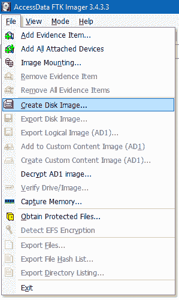
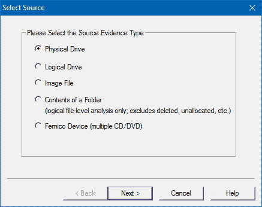
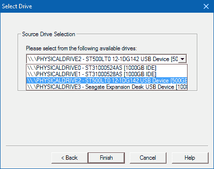
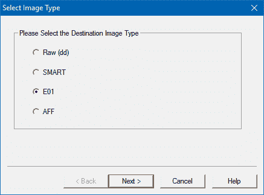
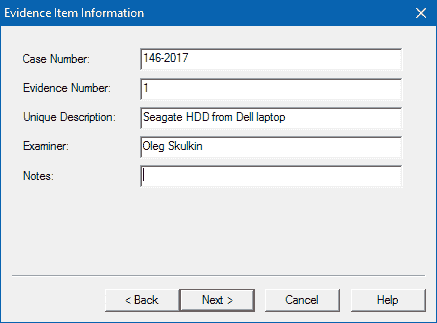
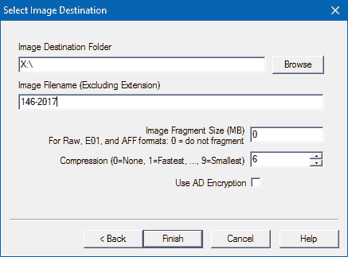
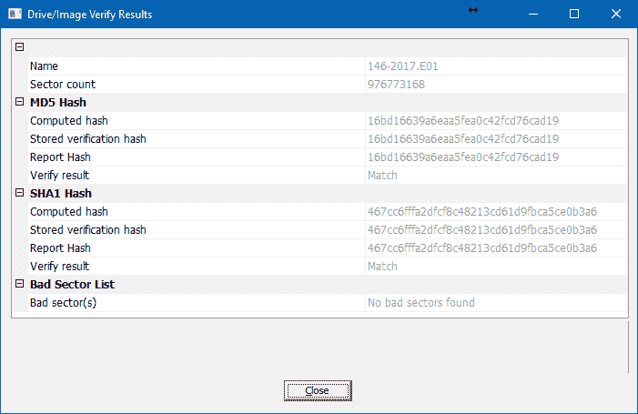
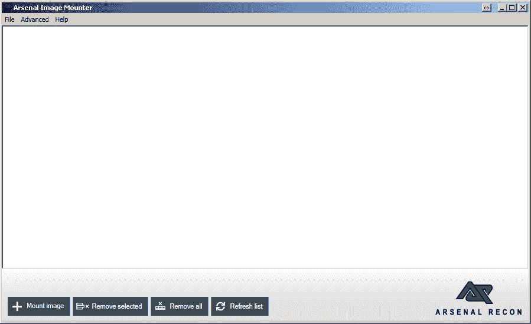
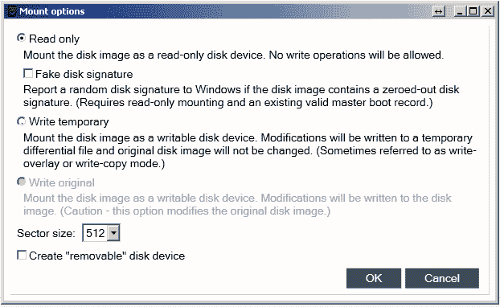

# Windows 磁盘镜像获取

在本章中，我们将介绍以下几种操作方法：

+   使用 FTK Imager 获取 E01 格式的磁盘镜像

+   使用 dc3dd 获取 RAW 格式的磁盘镜像

+   使用 Arsenal Image Mounter 挂载取证镜像

# 介绍

在开始分析来源证据之前，首先需要对其进行镜像。镜像是一个取证过程，其中会创建硬盘的精确副本。这是一个重要的步骤，尤其是在证据需要提交法庭时，因为取证调查员必须能够证明他们没有以任何方式篡改证据。

*取证镜像*一词可以指物理镜像或逻辑镜像。物理镜像是与参考磁盘完全一致的精确副本，而逻辑镜像是该磁盘中某一卷的复制。在一般情况下，逻辑镜像展示的是机器用户所看到和处理的内容，而物理镜像则提供了设备在更高层面如何工作的更全面的概述。

*哈希值*是用来验证获取的镜像真实性的。哈希值本质上是加密的数字指纹，能表明某个项目是否是另一个项目的精确副本。即使是数据的最小修改，也会生成完全新的哈希值，从而表明两个项目不相同。当取证调查员获取硬盘镜像时，他们应该为原始硬盘和获取的镜像生成哈希值。一些取证软件会为你自动完成这项操作。

市面上有许多可以用来制作硬盘镜像的工具，其中一些是免费的开源工具。然而，对于取证分析员来说，制作硬盘镜像的最流行方式是使用一些知名的取证软件厂商的解决方案。这是因为能够解释镜像是如何获取的及其完整性至关重要，尤其是当你处理的案件需要提交法庭时。

一旦你拥有了镜像，就可以在不直接干扰设备本身的情况下分析设备中的数字证据。

在本章中，我们将介绍几种工具，这些工具可以帮助你制作 Windows 磁盘镜像，并带领你完成磁盘镜像获取过程。

# 使用 FTK Imager 获取 E01 格式的磁盘镜像

FTK Imager 是一款由 AccessData 提供的镜像和数据预览工具，允许检查员不仅可以创建多种格式的取证镜像，包括 RAW、SMART、E01 和 AFF，还可以以取证合理的方式预览数据源。在本章的第一部分，我们将展示如何创建一个来自 Windows 系统的 E01 格式硬盘取证镜像。

E01 或 EnCase 的证据文件是执法机构使用的标准取证映像格式。这些映像由一个包含案件信息的头部组成，包括采集日期和时间、检查员姓名、采集备注和密码（可选），一个驱动器的逐位副本（由数据块组成，通过自己的 CRC 或循环冗余校验验证），以及一个包含位流的 MD5 哈希值的尾部。

# 准备中

首先，让我们从 AccessData 的官方网站下载 **FTK Imager**。为此，前往“产品与服务”标签，然后点击“产品下载”。接下来选择“数字取证”，然后选择 FTK Imager。在编写本文时，最新版本是 3.4.3，所以点击右侧的绿色“下载页面”按钮。现在你应该能看到下载页面。点击“立即下载”并填写表单。之后，下载链接将发送到你提供的电子邮件地址。

安装过程非常简单；你只需要点击几次“下一步”，因此我们在本配方中不再详细介绍。

# 如何操作...

有两种方式启动驱动器成像过程：

1.  使用工具栏中的“创建磁盘映像”按钮（图 3.1）


图 3.1\. 工具栏上的“创建磁盘映像”按钮

1.  使用文件菜单中的“创建磁盘映像...”选项（图 3.2）



图 3.2\. 文件菜单中的“创建磁盘映像...”选项

你可以选择任何你喜欢的选项。

第一个窗口是选择源。在这里，你有五个选项：

+   **物理驱动器**：允许你选择一个物理驱动器作为源，包括所有分区和未分配空间。

+   **逻辑驱动器**：允许你选择逻辑驱动器作为源，例如 `E:\ drive`。

+   **映像文件**：允许你选择一个映像文件作为源，例如，如果你需要将你的取证映像从一种格式转换为另一种格式。

+   **文件夹内容**：允许你选择一个文件夹作为源。当然，不会包括已删除的文件。

+   **Fernico 设备**：允许你从多个 CD/DVD 恢复映像。

当然，我们希望成像整个驱动器，以便能够处理已删除的数据和未分配空间，因此：

1.  让我们选择物理驱动器选项。

证据源不能以任何方式被更改，因此请确保使用硬件写保护器。例如，你可以使用 Tableau 的写保护器。这些设备可以在不修改数据的情况下获取驱动器内容。

*图 3.3\. FTK Imager 选择源窗口*

1.  点击“下一步”，你将看到下一个窗口——选择驱动器。

1.  现在，你应该从下拉菜单中选择源驱动器，在我们的案例中是 **\\.\PHYSICALDRIVE2**。



图 3.4\. FTK Imager 选择驱动器窗口

1.  现在选择了源驱动器，点击“完成”。

1.  下一个窗口是——创建图像。我们很快会回到这个窗口，但现在，点击“添加...”。

1.  现在是时候选择目标图像类型了。由于我们决定以 EnCase 的证据文件格式创建图像，因此选择 E01。

*图 3.5\. FTK Imager 选择图像类型窗口*

1.  点击“下一步”，你将看到证据项信息窗口。

在这里，我们有五个字段需要填写：案件编号、证据编号、唯一描述、检查员和备注。所有字段都是可选的。

**图 3.6\. FTK Imager 证据项信息窗口**

1.  填写字段，或者如果你愿意，可以跳过它们，然后点击**下一步**。

1.  现在选择图像目标。你可以使用浏览按钮来选择。

1.  此外，你还需要填写图像文件名。

如果你希望你的取证图像被分割，请选择一个分段大小（以兆字节为单位）。E01 格式支持压缩，因此如果你希望减小图像大小，可以使用此功能。正如图 3.7 所示，我们选择了 6。如果你希望图像中的数据得到保护，可以使用 AD 加密功能。

AD 加密是整个图像的加密，因此不仅原始数据被加密，任何元数据也会被加密。图像的每个段或文件都使用 AES-256 加密算法和随机生成的图像密钥进行加密。



图 3.7\. FTK Imager 选择图像目标窗口

我们快完成了。

1.  点击**完成**，你将再次看到创建图像窗口。

1.  现在查看窗口底部的三个选项。

验证过程非常重要，因此请确保勾选“创建后验证图像”选项；这有助于你确保源数据和图像一致。“预计算进度统计”选项也非常有用：它将在成像过程中显示预计到达时间。最后一个选项将为你创建图像中所有文件的目录列表，但当然，这需要时间，因此只有在需要时才使用它。

*图 3.8\. FTK Imager 创建图像窗口*

1.  现在你只需要点击“开始”。

很棒，成像过程已开始！一旦图像创建完成，验证过程就会开始。

1.  最后，你将看到一个驱动器/图像验证结果窗口，类似于图 3.9 所示的窗口。



图 3.9\. FTK Imager 驱动器/图像验证结果窗口

如你所见，在我们的案例中，源数据和图像是相同的：两者的哈希值匹配。在图像所在的文件夹中，你还会找到一个信息文件，其中包含重要信息，如驱动器型号、序列号、源数据大小、扇区计数、MD5 和 SHA1 校验和等。

# 它是如何工作的……

FTK Imager 使用你选择的物理驱动器作为源，并创建一个逐位镜像，格式为 EnCase 的证据文件格式。在验证过程中，会比较镜像和源驱动器的 MD5 和 SHA1 哈希值。

# 查看更多

FTK Imager 下载页面：

[`accessdata.com/product-download/digital-forensics/ftk-imager-version-3.4.3`](http://accessdata.com/product-download/digital-forensics/ftk-imager-version-3.4.3)

FTK Imager 用户指南：

[`ad-pdf.s3.amazonaws.com/Imager/3_4_3/FTKImager_UG.pdf`](https://ad-pdf.s3.amazonaws.com/Imager/3_4_3/FTKImager_UG.pdf)

# 使用 dc3dd 进行 RAW 格式的驱动器采集

DC3DD（由 Jesse Kornblum 开发）是经典 GNU dd 工具的一个修补版，加入了一些计算机取证功能。例如，支持使用多种算法进行哈希处理，如 MD5、SHA-1、SHA-256 和 SHA-512，显示采集过程的进度等。

# 准备工作

你可以在 SourceForge 上找到适用于 Windows 的 DC3DD 编译版。只需下载 ZIP 或 7z 压缩包，解压后就可以使用了。

# 如何操作...

使用 dc3dd 进行 RAW 格式驱动器采集的步骤如下：

1.  打开 Windows 命令提示符，切换到（可以使用 **cd** 命令）包含 `dc3dd.exe` 的目录，并输入以下命令：

```
dc3dd.exe if=\\.\PHYSICALDRIVE2 of=X:\147-2017.dd hash=sha256
log=X:\147-2017.log

```

1.  按下 *Enter* 键，采集过程将开始。

当然，你的命令会稍有不同，接下来让我们看看它的每个部分代表什么：

+   **if** - 代表输入文件。最初，dd 是一个 Linux 工具，假如你不知道，Linux 中的一切都是文件。正如你在我们的命令中看到的那样，我们在这里输入了物理驱动器 2（这是我们希望镜像的驱动器，但在你的情况下，可能是另一块驱动器，具体取决于连接到工作站的驱动器数量）。

+   **of** - 代表输出文件。在这里，你应该输入镜像的 RAW 格式保存位置。在我们的例子中，是 `X:\ drive` 和 `147-2017.dd` 文件。

+   **hash** - 如前所述，DC3DD 支持四种哈希算法：MD5、SHA-1、SHA-256 和 SHA-512。我们选择了 SHA-256，但你可以选择任何你喜欢的算法。

+   **log** - 在这里，你应该输入日志的保存位置。一旦采集完成，你将在这个文件中找到镜像版本、镜像哈希等信息。

# 它是如何工作的...

DC3DD 创建了源驱动器的逐位镜像，格式为 RAW，因此镜像的大小将与源驱动器相同，并且它使用考察者选择的算法来计算镜像的哈希值，在我们的例子中是 SHA-256。

# 另见

DC3DD 下载页面：

[`sourceforge.net/projects/dc3dd/files/dc3dd/7.2%20-%20Windows/`](https://sourceforge.net/projects/dc3dd/files/dc3dd/7.2%20-%20Windows/)

# 使用 Arsenal Image Mounter 挂载取证镜像

Arsenal Image Mounter 是一款由 Arsenal Recon 开发的开源工具。它可以帮助数字取证检查员在 Windows 上挂载取证镜像或虚拟机磁盘。它支持 E01（和 EX01）以及 RAW 取证镜像，因此你可以使用我们在前面的教程中创建的任何镜像。

需要特别注意的是，Arsenal Image Mounter 会将磁盘镜像的内容作为完整磁盘进行挂载。该工具支持你在 Windows 驱动器上找到的所有文件系统：NTFS、ReFS、FAT32 和 exFAT。同时，它对镜像提供了临时写入支持，这是一个非常有用的功能，例如，如果你想从你正在检查的镜像中启动系统。

# 准备工作

访问 Arsenal Recon 网站上的 Arsenal Image Mounter 页面，并点击下载按钮下载 ZIP 压缩包。在写作时，工具的最新版本是 2.0.010，因此在我们的案例中，压缩包的名称为 **Arsenal_Image_Mounter_v2.0.010.0_x64.zip**。将其解压到你选择的位置，即可使用，无需安装。

# 如何操作...

在 Arsenal Image Mounter 中，有两种方法可以选择一个镜像进行挂载。

+   你可以使用文件菜单（并选择 **挂载镜像...**）或

+   挂载镜像按钮，如图 3.10 所示

*图 3.10\. Arsenal Image Mounter 主窗口*

1.  当你从文件菜单选择挂载镜像... 选项或点击挂载镜像按钮时，打开窗口会弹出 - 在这里你应该选择一个镜像进行挂载。

1.  你接下来会看到的是挂载选项窗口，如图 3.11 所示。



图 3.11\. *Arsenal Image Mounter 挂载选项窗口*

如你所见，这里有一些选项：

+   **只读** - 如果选择此选项，镜像将以只读模式挂载，因此不允许进行写操作。（你还记得不能以任何方式修改证据吗？当然，它已经是镜像文件，而不是原始驱动器，但无论如何，还是要小心。）

+   **虚假磁盘签名** - 如果镜像上找到全零磁盘签名，Arsenal Image Mounter 会向 Windows 报告一个随机的磁盘签名，从而确保镜像正确挂载。

+   **临时写入** - 如果选择此选项，镜像将以读写模式挂载，但所有修改不会写入原始镜像文件，而是写入一个临时差异文件。

+   **写入原始** - 同样，此选项以读写模式挂载镜像，但这次原始镜像文件将被修改。

+   **扇区大小** - 此选项允许你选择扇区大小。

+   创建“可移动”磁盘设备 - 此选项模拟 USB 闪存驱动器的连接。

1.  选择你认为需要的选项并点击确定。

我们决定以只读模式挂载镜像。现在，你可以在工具的主窗口中看到一个硬盘图标 - 镜像已挂载。

如果你只挂载了一个镜像并想要卸载它，选择该镜像并点击“移除选中项”。如果你挂载了多个镜像并想要卸载所有镜像，点击“移除全部”按钮。

# 它是如何工作的…

Arsenal Image Mounter 将取证镜像或虚拟机磁盘挂载为完整磁盘，可以选择只读或读写模式。之后，数字取证检查员即使使用 Windows 资源管理器，也可以访问其中的内容。

# 另请参见

Arsenal Recon 网站上的 Arsenal Image Mounter 页面：[`arsenalrecon.com/apps/image-mounter/`](https://arsenalrecon.com/apps/image-mounter/)
